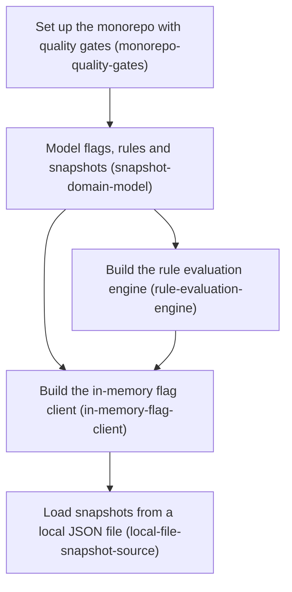

# FeatureSync — Horizon 1: Local-first core runtime

## 🎯 What are we trying to achieve?
Ship `@featuresync/core`: a small TypeScript library where teams define feature flags and typed configuration with Zod schemas, load them from an immutable versioned snapshot (a local JSON file for now), and evaluate them fully in memory with no network calls. Done means the full public API works end to end, bad snapshots can never replace good ones, and CI enforces strict types, layer boundaries and 100% test coverage.

## 🧠 Why does this change need to happen?
The repo holds only design notes and a LocalStack docker-compose. Every later piece of FeatureSync (S3/SNS sync, the publisher Lambda, the NestJS module, the CLI and the dashboard) reads or writes the same snapshot and depends on the same evaluation rules. Building that core first as a pure, well-tested domain means later horizons only add adapters and never rework the semantics.

**At a glance**
- Phases: 5
- Complexity: Medium
- Main risk: the snapshot JSON contract becomes a public cross-language API, so a wrong shape means a breaking change later (mitigated with a `schemaVersion` field)
- Target: 100% line/branch/function/statement coverage, strict TS, zero I/O on the flag query path
- Testing focus: behavioural edge cases, shared JSON test vectors, property/fuzz tests, type-level tests, real-file end-to-end

## Order of work
1. **Set up the monorepo with quality gates.** Everything after it must be born covered and layered.
2. ↓ **Model flags, rules and snapshots as domain types.** Evaluation and the client both consume these types.
3. ↓ **Build the local rule evaluation engine.** It needs the Feature/Rule model.
4. ↓ **Build the in-memory flag client with atomic swap.** It wires the snapshot parser and the evaluator behind a port.
5. ↓ **Load snapshots from a local JSON file.** This is the first real adapter for the client's port.

---

### Phase 1 — Set up the monorepo with quality gates
Technical ID: `monorepo-quality-gates` · Build Tooling · cross-cutting · small

- **Goal:** `pnpm verify` runs typecheck, lint and tests with enforced 100% coverage, locally and in GitHub Actions.
- **Why:** "Production-grade, fully covered" is enforced mechanically from commit one. ESLint path rules keep the DDD layering honest.
- **Changes:** pnpm workspace plus a `packages/core` skeleton. TS `strict` + `noUncheckedIndexedAccess` + `exactOptionalPropertyTypes`. ESLint flat config with type-aware rules and `import/no-restricted-paths` (domain → nothing). Vitest v8 coverage at a threshold of 100. `ci.yml` runs `pnpm verify`. Apache-2.0 LICENSE and README.
- **Files:** `package.json`, `pnpm-workspace.yaml`, `tsconfig.base.json`, `eslint.config.js`, `vitest.workspace.ts`, `packages/core/*`, `.github/workflows/ci.yml`, `.nvmrc`
- **How to verify:** gates fail on violations (an uncovered branch, a bad import or a type error each turn it red) · strict compiler settings are inherited everywhere · CI runs the identical command.
- **Depends on:** nothing, can start immediately.

### Phase 2 — Model flags, rules and snapshots as domain types
Technical ID: `snapshot-domain-model` · Flag Definition · domain · medium

- **Goal:** `parseSnapshot(unknown)` returns an immutable typed Snapshot or a path-specific validation error. `defineFeature()` infers config/context types.
- **Why:** the snapshot is the single shared contract across runtime, Lambda, CLI, UI and future Python/Go SDKs.
- **Changes:** Zod contract (`schemaVersion`, `environment`, `version`, `createdAt`, `createdBy`, `previousVersion`, `reason`, `features`). Boolean and config features with default + ordered rules. A deep-frozen Snapshot built via a Result-returning parser. `defineFeature({ key, schema, default, context? })` validates the default at definition time. Rule values are checked against registered schemas.
- **Files:** `packages/core/src/domain/{feature,rule,snapshot,snapshot-contract,define-feature,errors}.ts`, `test/domain/`
- **How to verify:** the contract is language-neutral JSON · immutable at any depth · errors name the feature and field path · domain has no I/O · inferred types proven by `expectTypeOf` tests.
- **Depends on:** Set up the monorepo with quality gates.

### Phase 3 — Build the local rule evaluation engine
Technical ID: `rule-evaluation-engine` · Evaluation · domain · medium

- **Goal:** a deterministic `evaluate(feature, context)` that returns `{ value, enabled, reason, ruleIndex? }`.
- **Why:** local evaluation is the core promise, and the semantics must be exact so other-language SDKs can reproduce them.
- **Changes:** `equals`/`notEquals`/`in` operators in a registry, with AND across `when` keys. First matching rule wins, otherwise the default applies. Disabled → default. A missing attribute is a non-match. Invalid context (checked against the Zod context schema) → default with reason `INVALID_CONTEXT`. Write `docs/spec/evaluation-semantics.md` plus a shared `test-vectors.json`.
- **Files:** `packages/core/src/domain/evaluation/*`, `test/domain/evaluation/`, `docs/spec/evaluation-semantics.md`
- **How to verify:** every edge case has a spec'd test vector · pure/deterministic (fast-check) · never throws on bad context · new operators need no edit to `evaluate()`.
- **Depends on:** Model flags, rules and snapshots.

### Phase 4 — Build the in-memory flag client with atomic swap
Technical ID: `in-memory-flag-client` · Runtime Client · application · medium

- **Goal:** `createFeatureFlags({ source, definitions?, logger?, allowStaleStartup? })` with synchronous `isEnabled/get/evaluate/version/has/getAll`, plus `ready/refresh/close`.
- **Why:** apps need one predictable object. The `SnapshotSource` port lets the same client run on a file today and S3/SNS tomorrow.
- **Changes:** `SnapshotSource` port (`load`, optional `subscribe`) and `Logger` port. The store holds one immutable reference that is replaced only after validation. A failed or invalid refresh keeps the old snapshot and logs the error. `ready()` rejects on startup failure unless `allowStaleStartup` is set. Query methods never throw and are type-checked against the definitions.
- **Files:** `packages/core/src/application/*`, `src/index.ts`, `test/application/`
- **How to verify:** atomic swap proven, including an invalid-refresh and a concurrent-refresh test · zero source calls across 1,000 queries · depends only on ports · both startup modes tested · public API surface snapshot + TSDoc.
- **Depends on:** Model flags, rules and snapshots; Build the rule evaluation engine.

### Phase 5 — Load snapshots from a local JSON file
Technical ID: `local-file-snapshot-source` · Snapshot Distribution · infrastructure · small

- **Goal:** `FEATURESYNC_FILE=./flags.json` + `createFeatureFlagsFromEnv()` gives a working client, with optional watch mode.
- **Why:** developers use FeatureSync with no AWS (docs §8). It also gives the first usable release and proves the port.
- **Changes:** `FileSnapshotSource` with typed load errors. Debounced `fs.watch`. Env parsing lives only in `config-from-env.ts`. An e2e test on real temp files (valid → invalid write keeps the old version → valid write swaps in). A runnable `examples/node-local`, smoke-tested in CI.
- **Files:** `packages/core/src/infrastructure/*`, `test/infrastructure/`, `test/e2e/file-to-evaluate.test.ts`, `examples/node-local/`, `packages/core/README.md`
- **How to verify:** real-fs e2e via the public entry only · `process.env` read in exactly one file · watch survives truncated writes and leaves no open handles · example runs in CI.
- **Rollback:** additive; revert the infrastructure folder and the env factory export.
- **Depends on:** Build the in-memory flag client.

Reference — full rubrics

See `horizon-01-local-first-core-runtime-roadmap.json` → `phases[].rubric` and `healerHint` (the file EXECUTE/VERIFY grade against).

## Out of Scope (deferred)
- **Horizon 2:** S3 snapshot source, SNS listener, periodic reconciliation. Integration tests run on LocalStack **only via AWS SDK env config** (`AWS_ENDPOINT_URL`, region, test credentials) with no LocalStack-specific code.
- **Horizon 3:** publisher Lambda (validate → version → write snapshot → `current.json` → SNS → audit), CDK stack, and least-privilege IAM roles (ApplicationRead / Publisher / Admin). LocalStack Community does not enforce IAM, so permission tests need real AWS or explicit policy assertions.
- **Later:** `@featuresync/nestjs`, the CLI (init/validate/pull/snapshot --version/publish/rollback), the dashboard (schema-generated forms, rules UI, diff, history, rollback), CI examples, and metrics hooks.
- **Excluded from MVP (docs §28):** percentage rollout, analytics, experimentation, Redis, databases, custom auth, multi-cloud.

## Success Criteria
See the JSON `successCriteria`. Headline: an app runs `defineFeature` + `FEATURESYNC_FILE` + `evaluate()` with zero network I/O and atomic, fail-safe refresh, under 100% enforced coverage.

## Alignment Preview
User accepted the first preview with no redirects.

## Quality Gate
Full path, run inline by the orchestrator (no subagents). Mechanical checks pass: dependencies exist, there are no cycles, and layer direction holds (domain ← application ← infrastructure; tooling is cross-cutting). Accepted minor debt: phase 4 has 7 change bullets but one deliverable (the client), so it is kept whole.

## Cost
0 Agent calls (the pipeline was executed inline instead of the 8–10 call budget).

## Full analysis
- domainShape: **business**. The core is rule-heavy: definitions, targeting rules, and versioned snapshot invariants.
- Ubiquitous language: Feature, Snapshot, Rule, Evaluation Context, Snapshot Source, Atomic Swap, Flag Client, Quality Gates (definitions are in the JSON).
- Assumptions and risks: listed in the JSON under `analysis`.
