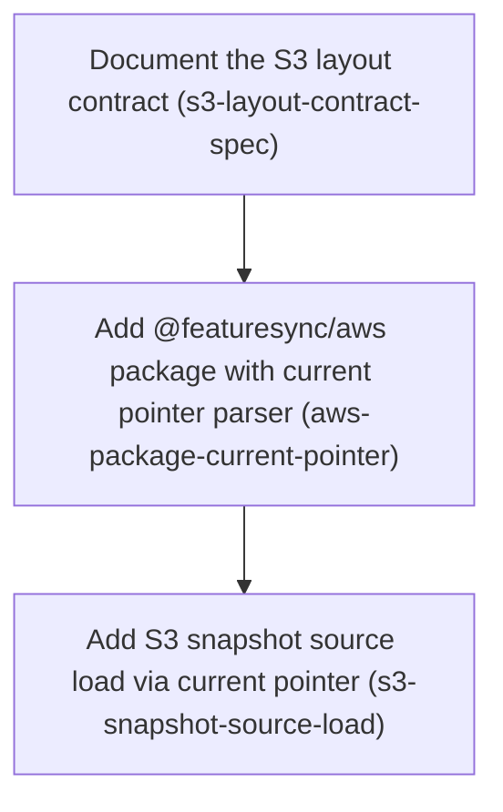

# Horizon 2 — AWS snapshot distribution (reader, load path)

## 🎯 What are we trying to achieve?
Let apps get their feature-flag snapshot from S3 instead of a local file. A new `@featuresync/aws` package reads `<env>/current.json` (the *current pointer*, a small file that names the active snapshot number) and then loads `<env>/snapshots/<n>.json`. The core library validates that snapshot. The step is done when that load path exists, is written down as a contract, and is covered 100% by tests. SDK settings come only from the standard AWS environment.

## 🧠 Why does this change need to happen?
Horizon 1 built the local-first core: evaluating flags in memory, fed by a file. The product vision is to deliver snapshots from S3 in the user's own AWS account, but nothing in the repo talks to S3 yet. The S3 key layout also exists only as a sketch in `docs/notes.md`. The core already rejects invalid snapshots, keeps the last good one, and fails startup safely, so this step only has to fetch the pointer and snapshot correctly.

**At a glance**
- Phases: 3
- Complexity: Low–Medium. Small phases, a clean gate, one criterion fixed.
- Main risk: SDK v3 and LocalStack behave differently (304 handling, path-style addressing, 403 instead of 404). Only the next step's LocalStack suite will catch that.
- Quality target: 100% line, branch, function and statement coverage. Only `s3:GetObject` is used. LocalStack is reached only through standard AWS SDK env config.
- Testing focus: typed error mapping (NoSuchKey / 403 / bad JSON), the snapshotKey-mismatch rejection, rollback to a lower version, and no endpoint/LocalStack branches (grep checks).

## Order of work
1. **Document the S3 layout contract**: comes first because both later phases build against this contract.
2. **Add @featuresync/aws package with current pointer parser**: needs the contract to know what a valid pointer looks like.
3. **Add S3 snapshot source load via current pointer**: uses the pointer parser to decide which snapshot key to fetch.

### Phase 1 — Document the S3 layout contract
Technical ID: `s3-layout-contract-spec` · Snapshot distribution · domain · small blast radius

**Goal:** Write down the S3 layout contract: the key scheme <env>/current.json and <env>/snapshots/<n>.json, plus the exact shape of the current pointer.

**Why:** Nothing publishes to S3 yet, so the reader defines the layout that any future publisher must follow. docs/notes.md §1.2 only sketches the layout, and docs/spec has no S3 layout spec. Writing it first gives the pointer parser and the S3 snapshot source one agreed contract to build against.

**Changes**
- Define the Environment as an S3 key prefix and list the two key patterns: <env>/current.json (the current pointer) and <env>/snapshots/<n>.json (immutable Snapshots, n a positive integer version).
- Define the current pointer JSON as {schemaVersion, environment, version, snapshotKey}; the reader derives the snapshot key from environment + version and rejects a pointer whose snapshotKey disagrees, so it never follows an arbitrary key.
- State that a rollback is the pointer naming a lower version, and the reader follows whatever version the pointer names.
- Document the minimal read-only IAM policy (s3:GetObject only), noting that without ListBucket a missing key returns 403 AccessDenied, not 404.
- Summarise the failure modes from docs/notes.md §22 and point to core's existing fail-safe behaviour (last good snapshot kept, StartupError) instead of restating it.

**Files / areas:** `docs/spec/s3-layout.md`

**How to verify**
- **Key scheme is exact and unambiguous**: Both literal patterns '<env>/current.json' and '<env>/snapshots/<n>.json' appear in the doc
- **Current pointer shape with valid and invalid examples**: A table or list gives each of the four fields with its type and constraints
- **Rollback semantics stated**: A section or sentence explicitly says rollback means pointing current.json at a lower n
- **GetObject-only read policy (caller criterion)**: An IAM policy JSON block lists exactly one Action: s3:GetObject
- **Contract stays at the domain level**: grep -iE 'S3Client|GetObjectCommand|localstack|AWS_ENDPOINT_URL|forcePathStyle' docs/spec/s3-layout.md returns nothing

**Done when:** docs/spec/s3-layout.md exists and defines the key scheme, the current pointer JSON shape with one valid and one invalid example, and the GetObject-only read policy., and every check under *How to verify* meets its bar.

**Depends on:** nothing, can start immediately

Reference — full rubric

| id | rule | pass criteria | failure examples | minScore |
|---|---|---|---|---|
| key-scheme-defined | docs/spec/s3-layout.md defines the Environment as a key prefix and the two key patterns <env>/current.json and <env>/snapshots/<n>.json, with n a positive integer and snapshots declared immutable. | Both literal patterns '<env>/current.json' and '<env>/snapshots/<n>.json' appear in the doc n is stated to be a positive integer (1, 2, ...), and the doc says whether leading zeros are allowed The doc states snapshot objects are never overwritten once written 10 vs 9: the doc states allowed environment-name characters (e.g. no '/'), so a reader can reject a malformed prefix | Patterns given only as prose ('a pointer file per env') with no literal keys Plausible miss: n described as 'a version number' without saying integer, can be 0, or leading zeros, leaving '<env>/snapshots/007.json' ambiguous | 7 |
| pointer-shape-examples | The pointer JSON {schemaVersion, environment, version, snapshotKey} is specified field by field, with at least one valid and one invalid example, and the rule that snapshotKey must equal the key derived from environment + version. | A table or list gives each of the four fields with its type and constraints A fenced JSON block shows a valid pointer whose snapshotKey matches environment/snapshots/version.json A fenced JSON block shows an invalid pointer (e.g. mismatched snapshotKey) and says why it is rejected The doc says the reader never follows a key that differs from the derived one | Only a valid example is given Plausible miss: the invalid example is invalid for a trivial reason (missing field) and the snapshotKey-mismatch rule is never shown | 8 |
| rollback-rule | A rollback is the pointer naming a lower version, and the reader follows whatever version the pointer names without a monotonic-version check. | A section or sentence explicitly says rollback means pointing current.json at a lower n The doc says the reader does not reject a version lower than the last one it loaded | Rollback not mentioned Plausible miss: the doc implies versions only go up ('latest version'), leading the implementer to add a monotonic check that blocks rollback | 7 |
| read-policy-getobject-only | Derived from the acceptance criterion 'Reader uses only s3:GetObject': the doc gives a minimal IAM policy granting only s3:GetObject and explains that without ListBucket a missing key returns 403 AccessDenied rather than 404. | An IAM policy JSON block lists exactly one Action: s3:GetObject The Resource is scoped to arn:aws:s3:::<bucket>/*, not '*' The 403-instead-of-404 behaviour is stated | Policy includes s3:ListBucket 'for convenience' Plausible miss: correct action but Resource '*', or the 403 note omitted so missing keys later get reported as generic request failures | 8 |
| domain-layer-purity | The doc describes domain facts (keys, pointer shape, rollback rule, failure modes by meaning) without AWS SDK class names, LocalStack endpoints, or client configuration; the IAM policy is the only allowed infrastructure note because it is part of the contract. | grep -iE 'S3Client\|GetObjectCommand\|localstack\|AWS_ENDPOINT_URL\|forcePathStyle' docs/spec/s3-layout.md returns nothing Failure modes are described by meaning (pointer missing, snapshot missing, invalid pointer) and linked to core's existing fail-safe behaviour, not restated as code | Includes a code sample building new S3Client({endpoint:'http://localhost:4566'}) Plausible miss: the failure-mode section lists SDK error names (NoSuchKey) as the contract instead of domain outcomes | 7 |

Healer hint: Most likely miss is an invalid-pointer example that does not show the snapshotKey mismatch, or an IAM policy with extra actions; add a mismatched-snapshotKey example and cut the policy to s3:GetObject on arn:aws:s3:::<bucket>/*.

### Phase 2 — Add @featuresync/aws package with current pointer parser
Technical ID: `aws-package-current-pointer` · Snapshot distribution · domain · medium blast radius

**Goal:** Create the packages/aws workspace package (@featuresync/aws) and its pure domain parser that validates a raw current.json value against the S3 layout contract.

**Why:** Every later phase needs the package to exist and a trusted, validated pointer. Core already validates Snapshots (parseSnapshot runs inside createFeatureFlags) but knows nothing about the pointer, so this package validates it. Keeping the parser in the domain layer makes it pure and easy to test to 100%.

**Changes**
- Copy the package shape from packages/core/package.json: name @featuresync/aws, depend on @featuresync/core via workspace:*, make @aws-sdk/client-s3 a peer and dev dependency, reuse build/typecheck scripts, export only from dist.
- Keep the src/{domain,application,infrastructure} layout so the existing ESLint import-x layer zones apply with no config change.
- Add parseCurrentPointer(raw: unknown) using zod: returns {schemaVersion, environment, version, snapshotKey} or a typed INVALID_POINTER failure when a field is missing, version is not a positive integer, or snapshotKey is not <environment>/snapshots/<version>.json.
- Add a helper deriving the snapshot key from environment + version, with unit tests for every branch.

**Files / areas:** `packages/aws/package.json`, `packages/aws/tsconfig.json`, `packages/aws/tsconfig.build.json`, `packages/aws/src/domain/current-pointer.ts`, `packages/aws/test/domain/current-pointer.test.ts`

**How to verify**
- **Package mirrors core's workspace shape**: package.json: name '@featuresync/aws', dependencies['@featuresync/core'] === 'workspace:*'
- **Parser enforces the full contract**: Tests cover: valid pointer, missing field, version 0, negative, non-integer (1.5), string '3', snapshotKey mismatch, non-object input (null, array, string)
- **Snapshot key derived in one place**: grep for 'snapshots/' in packages/aws/src finds the template only in the helper
- **100% coverage under root verify (caller criterion)**: pnpm verify at the repo root runs the aws tests (visible in output)
- **Parser is pure domain code**: grep -E "from '(@aws-sdk|\.\./(application|infrastructure)|node:)" packages/aws/src/domain returns nothing

**Done when:** packages/aws/src/domain/current-pointer.ts exports parseCurrentPointer, with 100%-covered unit tests passing under the root pnpm verify., and every check under *How to verify* meets its bar.

**Depends on:** Document the S3 layout contract

Reference — full rubric

| id | rule | pass criteria | failure examples | minScore |
|---|---|---|---|---|
| package-shape-parity | packages/aws/package.json is named @featuresync/aws, depends on @featuresync/core via workspace:*, lists @aws-sdk/client-s3 as peerDependency and devDependency (not dependency), exports only from dist, and reuses core's build and typecheck scripts. | package.json: name '@featuresync/aws', dependencies['@featuresync/core'] === 'workspace:*' @aws-sdk/client-s3 is in peerDependencies and devDependencies, not dependencies exports/main/types point only into dist/ pnpm -r build and typecheck succeed for the package from the repo root | @aws-sdk/client-s3 put in dependencies, so every consumer gets a second SDK copy Plausible miss: exports point to src/index.ts, or tsconfig.build.json does not exclude test/ so tests land in dist | 8 |
| pointer-validation-rules | parseCurrentPointer(raw: unknown) returns the typed pointer only when every field is present, version is a positive integer, and snapshotKey equals '<environment>/snapshots/<version>.json'; otherwise it returns a typed INVALID_POINTER failure and does not throw. | Tests cover: valid pointer, missing field, version 0, negative, non-integer (1.5), string '3', snapshotKey mismatch, non-object input (null, array, string) Every invalid case returns reason INVALID_POINTER rather than throwing A test shows snapshotKey 'other-env/snapshots/3.json' is rejected 10 vs 9: the failure carries zod issue details (path/message) | Parser throws ZodError on bad input instead of returning a failure Plausible miss: z.number().positive() without .int(), so 1.5 passes; or a startsWith(environment) check that accepts a path traversal | 8 |
| key-derivation-single-source | One exported helper builds the snapshot key from environment + version, and the parser's mismatch check uses it rather than a second string template. | grep for 'snapshots/' in packages/aws/src finds the template only in the helper The helper has a unit test asserting ('prod', 7) -> 'prod/snapshots/7.json' | Parser and helper each build the key with their own template literals that could drift Plausible miss: the helper exists but the parser rebuilds the string inline | 7 |
| full-coverage-verify | Derived from the acceptance criterion: the new package is in the root pnpm verify / CI coverage run, reporting 100% lines, branches, functions and statements for packages/aws/src. | pnpm verify at the repo root runs the aws tests (visible in output) The coverage report lists current-pointer.ts at 100/100/100/100 No istanbul/c8/v8 ignore comments in packages/aws/src | Tests pass locally but the root coverage config never measures packages/aws Plausible miss: a /* v8 ignore next */ to hide an unreachable default branch | 9 |
| domain-purity | src/domain/current-pointer.ts imports only zod and domain modules; no @aws-sdk, application/infrastructure, node: or I/O imports, and the existing ESLint layer zones pass with no config change. | grep -E "from '(@aws-sdk\|\.\./(application\|infrastructure)\|node:)" packages/aws/src/domain returns nothing eslint.config.js unchanged in the diff, and pnpm lint passes The domain file does not log or read environment variables | Pointer type imported from an infrastructure S3 types file Plausible miss: eslint.config.js edited to add an exception, hiding a layer violation | 8 |

Healer hint: Most likely failure is the root coverage gate not picking up packages/aws, or a zod schema without .int(); confirm the package is in the root vitest projects/coverage and use z.number().int().positive().

### Phase 3 — Add S3 snapshot source load via current pointer
Technical ID: `s3-snapshot-source-load` · Snapshot distribution · infrastructure · medium blast radius

**Goal:** Implement createS3SnapshotSource(options).load(): fetch <env>/current.json, validate it as the current pointer, then fetch and return the raw JSON of <env>/snapshots/<n>.json.

**Why:** This is the S3 adapter for the core SnapshotSource port, the interface the in-memory flag client uses to load Snapshots, following packages/core/src/infrastructure/file-snapshot-source.ts. Core already handles snapshot validation, keeping the last good snapshot, and StartupError, so load() only fetches, reports typed errors, and hands back raw JSON.

**Changes**
- Accept options: bucket, environment, optional injected S3Client (default new S3Client({}), configured only from standard AWS SDK env/shared config, no endpoint or LocalStack branch), optional Logger defaulting to a package-local console logger (core does not export consoleLogger).
- Add S3SnapshotError with a reason union (POINTER_NOT_FOUND, SNAPSHOT_NOT_FOUND, INVALID_POINTER, INVALID_JSON, REQUEST_FAILED) and a cause; map NoSuchKey and AccessDenied (403) to the *_NOT_FOUND reasons.
- Make load() use only GetObject and never call parseSnapshot; keep the pointer ETag and version in closure state for the polling phase.
- Unit-test every branch with a fake S3 client to 100% coverage; export createS3SnapshotSource and S3SnapshotError from src/index.ts.

**Files / areas:** `packages/aws/src/infrastructure/s3-snapshot-source.ts`, `packages/aws/src/infrastructure/s3-snapshot-error.ts`, `packages/aws/src/index.ts`, `packages/aws/test/infrastructure/s3-snapshot-source.load.test.ts`

**How to verify**
- **load() follows the pointer to the named snapshot**: A fake-client test records exactly two GetObject calls in order: '<env>/current.json' then '<env>/snapshots/<n>.json'
- **Failures map to typed S3SnapshotError reasons**: One test per reason asserts instanceof S3SnapshotError, err.reason and err.cause
- **GetObject only, no LocalStack branch (caller criteria)**: grep -E 'Command' packages/aws/src finds only GetObjectCommand
- **Adapter implements core's port from the infrastructure layer**: createS3SnapshotSource's return type is annotated as (or satisfies) SnapshotSource from @featuresync/core
- **100% coverage of the adapter under root verify**: Coverage report shows 100 on all four metrics for the three files

**Done when:** createS3SnapshotSource(...).load() returns the raw Snapshot named by the current pointer, or rejects with an S3SnapshotError, and its unit tests pass at 100% coverage., and every check under *How to verify* meets its bar.

**Depends on:** Add @featuresync/aws package with current pointer parser

Reference — full rubric

| id | rule | pass criteria | failure examples | minScore |
|---|---|---|---|---|
| pointer-then-snapshot-flow | load() does GetObject on '<env>/current.json', validates it with parseCurrentPointer, then GetObject on the derived snapshot key, returning parsed raw JSON without calling core's parseSnapshot. | A fake-client test records exactly two GetObject calls in order: '<env>/current.json' then '<env>/snapshots/<n>.json' A rollback test (pointer names a lower version than a previous load) loads the lower version grep parseSnapshot packages/aws/src returns nothing The pointer ETag and version are kept in closure state and a test observes them (e.g. via a second load) | load() calls parseSnapshot itself, validating twice and changing error types Plausible miss: fetches pointer.snapshotKey directly instead of the derived key, or a 'version must increase' check blocks rollback | 8 |
| typed-error-mapping | Every failure rejects with S3SnapshotError carrying a reason from {POINTER_NOT_FOUND, SNAPSHOT_NOT_FOUND, INVALID_POINTER, INVALID_JSON, REQUEST_FAILED} and the original cause; NoSuchKey and 403 AccessDenied map to the matching *_NOT_FOUND reason. | One test per reason asserts instanceof S3SnapshotError, err.reason and err.cause Tests cover NoSuchKey and 403 AccessDenied (by $metadata.httpStatusCode) separately, for pointer and snapshot Malformed JSON body gives INVALID_JSON; a network/5xx error gives REQUEST_FAILED 10 vs 9: an empty/missing Body is handled explicitly, not as a TypeError | Raw SDK errors escape from load() Plausible miss: AccessDenied matched only by error.name, missing the 403 status case, so a missing key under GetObject-only permissions shows as REQUEST_FAILED | 8 |
| getobject-only-no-endpoint-branch | Derived from the acceptance criteria: the adapter sends only GetObjectCommand, and the default client is new S3Client({}) configured from standard AWS SDK env/shared config, with no endpoint, forcePathStyle or LocalStack code path. | grep -E 'Command' packages/aws/src finds only GetObjectCommand grep -iE 'endpoint\|localstack\|forcePathStyle\|4566\|process\.env' packages/aws/src returns nothing The default client is built with an empty config; an injected client is used when given (tested) | Uses HeadObjectCommand to check existence first, needing extra permission Plausible miss: reads process.env.AWS_ENDPOINT_URL and passes it as endpoint — a LocalStack branch even though the SDK already reads that variable | 9 |
| port-conformance-layering | s3-snapshot-source.ts lives in infrastructure, is typed against core's exported SnapshotSource port, depends inward on the domain parser, and nothing in domain/ imports it; the logger is a package-local default because core does not export consoleLogger. | createS3SnapshotSource's return type is annotated as (or satisfies) SnapshotSource from @featuresync/core No imports of core internals ('@featuresync/core/src/...' or relative '../../core') packages/aws/src/domain has no imports from infrastructure; pnpm lint passes src/index.ts exports only createS3SnapshotSource and S3SnapshotError (plus types) | Imports consoleLogger from a core deep path Plausible miss: returns a hand-written object not typed against SnapshotSource, so port drift is not caught by tsc | 8 |
| load-coverage-verify | Derived from the acceptance criterion: pnpm verify passes and reports 100% line/branch/function/statement coverage for s3-snapshot-source.ts, s3-snapshot-error.ts and index.ts, using a fake S3 client (no network). | Coverage report shows 100 on all four metrics for the three files Tests run with no AWS credentials and no network access No coverage-ignore comments in packages/aws/src | The default-logger or default-client branch is never exercised, leaving branch coverage at 9x% Plausible miss: index.ts excluded from coverage via config instead of being covered | 9 |

Healer hint: Most likely failure is 403 AccessDenied falling through to REQUEST_FAILED, or an untested default-client/logger branch; match $metadata.httpStatusCode === 403 as well as the error name, and test building the source with no injected client or logger.

## Discovery Findings
| area | finding | file | implication |
|---|---|---|---|
| SnapshotSource port | SnapshotSource is { load(): Promise<unknown>; subscribe?(onChange:(snapshot: unknown)=>void): Unsubscribe }; no stop hook, no error callback; values are raw/untrusted. | packages/core/src/application/snapshot-source.port.ts | S3 source implements load() (pointer then snapshot) and runs poll+reconcile timers inside subscribe(); Unsubscribe clears timers; no port change needed; source logs its own poll errors. |
| createFeatureFlags consumption | Client subscribes once, calls load() on start and refresh(); every push goes through parseSnapshot; invalid push or load failure is logged and old snapshot kept; StartupError only when nothing loaded and no allowStaleStartup/fallbackSnapshot; close() calls unsubscribe. | packages/core/src/application/flag-client.ts | Fail-safe, validation and startup failure already live in core; aws only pushes raw JSON and must not throw from timers. |
| Snapshot validation from a sibling package | parseSnapshot is not exported from core index.ts; client validates every raw value itself. | packages/core/src/index.ts | aws does not validate snapshots; only the current.json pointer needs local validation (zod). Do not export parseSnapshot. |
| Reference adapter | file-snapshot-source.ts: factory returning {load, subscribe}, typed error class with reason union + cause, optional logger defaulting to consoleLogger, content dedup, unsubscribe clears timers. | packages/core/src/infrastructure/file-snapshot-source.ts | Mirror as createS3SnapshotSource(options) with S3SnapshotError reasons (POINTER_NOT_FOUND, SNAPSHOT_NOT_FOUND, INVALID_POINTER, INVALID_JSON, REQUEST_FAILED) and dedup by version. |
| Logger port | Logger is { error(message, error): void }; consoleLogger is not publicly exported from core. | packages/core/src/application/logger.port.ts | aws needs its own default logger or a required logger option, tested for coverage. |
| Core package build/exports | @featuresync/core exports '.' from dist via tsc -p tsconfig.build.json; no root build script; typecheck is pnpm -r typecheck. | packages/core/package.json | packages/aws mirrors package shape with workspace:* core dep; aws typecheck/lint may need core built first (or project references). |
| Workspace/root scripts | pnpm-workspace includes packages/* and examples/*; verify = typecheck && lint && test; test = vitest run --coverage; no integration script. | package.json | Add test:integration so LocalStack tests stay out of default pnpm test. |
| Vitest projects and coverage | Root vitest.config.ts projects ['packages/*'], coverage.include packages/*/src/**/*.ts at 100% thresholds; no per-package config. | vitest.config.ts | aws src is covered automatically; 100% must come from unit tests with fake S3 client; integration tests excluded from default run. |
| ESLint layer zones | import-x zones use packages/*/src/{domain,application,infrastructure} globs; no cross-package rule. | eslint.config.js | Same src layout in aws gets zones for free; optional zone forbidding ../core/src imports. |
| CI | ci.yml single verify job: install, pnpm verify, example:node-local; no services, docker, LocalStack or secrets. | .github/workflows/ci.yml | Add a LocalStack integration job with LOCALSTACK_AUTH_TOKEN secret, health wait, AWS_* env, running test:integration. |
| LocalStack docker-compose | Unpinned localstack image on 127.0.0.1:4566; LOCALSTACK_AUTH_TOKEN required via ${...:?}; no healthcheck; .env gitignored, no .env.example. | docker/docker-compose.yml | CI needs token secret; add healthcheck/pin and .env.example documenting AWS_* vars; path-style via env must be verified (or use localhost.localstack.cloud virtual-host). |
| Docs: S3 layout / pointer | notes.md §1.2 shows production/snapshots/{n}.json and production/current.json; SNS message {environment, version, snapshotKey}; env FEATURESYNC_BUCKET, FEATURESYNC_KEY; docs/spec has no S3 layout spec. | docs/notes.md | New docs/spec/s3-layout.md defines current.json as {schemaVersion, environment, version, snapshotKey}; decide trusting snapshotKey vs deriving it. |
| Docs: failure modes §22 | S3 down at startup -> fail unless allowStaleStartup; after startup keep last valid; invalid new snapshot rejected and logged; reconciliation every 5-15 min. | docs/notes.md | Matches core semantics; reuse, don't reimplement; default reconcile interval within 5-15 min. |
| Docs: IAM | Application role gets S3 GetObject only; free LocalStack does not enforce IAM. | docs/notes.md | Reader uses only GetObject; without ListBucket, missing key returns 403 not 404 — treat AccessDenied accordingly; document minimal read policy. |
| Test conventions | Core tests under packages/core/test mirroring layers plus e2e; tsconfig includes src and test; build excludes tests. | packages/core/test | aws tests in packages/aws/test/{infrastructure,integration}; LocalStack e2e (S3 -> createFeatureFlags -> evaluate) in integration suite. |

## Out of Scope
- Publishing/writing snapshots (CLI/UI publisher, current.json writer, Lambda validator) — deferred by the user; publisher-ownership blocker stays open.
- SNS→SQS push notifications — user chose polling first; push stays in the vision for later.
- Resolving the SNS subscription-without-public-endpoint blocker — only matters once push is in scope.
- Infrastructure provisioning (CloudFormation/CDK/Terraform) — this horizon reads from an existing bucket.
- Verifying IAM least-privilege on real AWS — blocked by the open LocalStack IAM question; at most a documented read-only policy.
- @featuresync/nestjs, CLI, and dashboard packages — later horizons.
- Changing the snapshot domain model, evaluation, or operators in core — done in horizon 1.
- Non-TypeScript SDKs — none built here.
- Pinned-snapshot CI tooling — depends on the deferred CLI/publisher.
- Rollback UI/commands — publisher-side pointer move.
- Add polling and reconciliation to S3 snapshot source (s3-snapshot-source-polling): subscribe() on the S3 snapshot source delivers pointer changes, treats a 304 as no change, reconciles on its interval, and stops on unsubscribe, shown by 100%-covered fake-timer unit tests. — held for the next Planning Horizon to keep this one small and reviewable — the Planning Brief and project memory carry the context forward
- Test S3 snapshot source against LocalStack (localstack-integration-suite): pnpm test:integration passes against a local docker-compose LocalStack using only AWS_* environment variables. — held for the next Planning Horizon to keep this one small and reviewable — the Planning Brief and project memory carry the context forward
- Add LocalStack integration job to CI (ci-localstack-job): A green integration job in .github/workflows/ci.yml that runs pnpm test:integration against LocalStack. — held for the next Planning Horizon to keep this one small and reviewable — the Planning Brief and project memory carry the context forward
- CI job against real AWS: no account/credentials; suite already runs against real AWS via env.
- Enforcing IAM least-privilege on real AWS: LocalStack Community does not enforce IAM; only the GetObject policy is documented.
- ESLint zone forbidding ../core/src imports: existing zones suffice, no violation exists.
- Stop/error callback on core SnapshotSource port: Unsubscribe already clears timers, source logs its own errors.
- Exporting parseSnapshot or consoleLogger from core: core validates every pushed value.

## Success Criteria
- (1) packages/aws (@featuresync/aws) exports createS3SnapshotSource implementing the core SnapshotSource port, whose load() reads <env>/current.json, validates it as the current pointer, and returns the raw Snapshot it names (core validates it), rejecting with a typed S3SnapshotError otherwise; (2) docs/spec/s3-layout.md defines the key scheme, pointer shape, rollback rule and GetObject-only read policy; (3) AWS SDK v3 configured only through standard env/shared config — no LocalStack/endpoint code branch; (4) root pnpm verify green with 100% coverage over packages/aws and core and unchanged ESLint layer zones; (5) flag evaluation makes zero network calls. Polling, reconciliation, LocalStack integration tests and the CI job are horizon 3.
- Document the S3 layout contract: docs/spec/s3-layout.md exists and defines the key scheme, the current pointer JSON shape with one valid and one invalid example, and the GetObject-only read policy.
- Add @featuresync/aws package with current pointer parser: packages/aws/src/domain/current-pointer.ts exports parseCurrentPointer, with 100%-covered unit tests passing under the root pnpm verify.
- Add S3 snapshot source load via current pointer: createS3SnapshotSource(...).load() returns the raw Snapshot named by the current pointer, or rejects with an S3SnapshotError, and its unit tests pass at 100% coverage.

## Alignment Preview
User accepted the first preview (no redirect). Concerns shown:
- This step ends at a one-time load from S3. Polling, LocalStack and CI come in horizon 3. The user accepted this.
- The pointer stores both `version` and `snapshotKey`, so the same fact is written twice. Kept for now: it matches the future SNS message shape, and a mismatch is rejected.
- 403 AccessDenied is mapped to *_NOT_FOUND, which may hide real permission problems. Kept and listed as a horizon-3 decision.

## Quality Gate
Full path, one iteration. Critic: 10 dimensions, 0 blockers, 1 major, 9 passing with minor notes.
- **Healed (major, success-coverage):** successCriteria[0] and analysis.successDefinition had copied the whole-project bar, including polling, reconciliation and LocalStack CI, which are all deferred. Both were rewritten to this horizon's slice. The fix was a one-field text edit, so the orchestrator applied it directly instead of making a healer Agent call.
- **Accepted debt (minor, yagni-scope):** phase 3 keeps the pointer ETag in closure state only for the deferred polling phase. The executor may drop it; horizon 3 would then add it.
- **Accepted debt (minor, phase-blast-radius):** phase 2 pairs package scaffolding with the parser. The scaffold only hosts the parser.
- The optional verification call did not run. Verdict: **passed**.

## Cost
Budget stated: 8–10 Agent calls. Made: 7 (Stage 1, Discovery, Stage 3, preview concerns, next-horizon brief, rubrics, critic). No patch, verification or healer calls.

## Full analysis
**domainShape:** business. The objective is about snapshot versioning, pointer-based activation/rollback and fail-safe snapshot replacement rules, with S3 machinery as infrastructure behind the existing SnapshotSource port.

| term | meaning |
|---|---|
| Snapshot | An immutable, versioned, language-neutral JSON document with schemaVersion holding all feature definitions for one environment, stored at <env>/snapshots/<n>.json. |
| Current pointer | The <env>/current.json object naming which snapshot number is active; moving it activates or rolls back. |
| Environment | The S3 key prefix (<env>) isolating one deployment stage's pointer and snapshots. |
| SnapshotSource | The core port that loads snapshots and signals updates to the in-memory flag client; the S3 snapshot source is its AWS adapter. |
| S3 layout contract | The documented key scheme and pointer shape the reader expects and any future publisher must follow. |
| Polling | Re-fetching the current pointer on an interval with If-None-Match/ETag so an unchanged pointer costs a 304 and no snapshot download. |
| Reconciliation | A slower periodic full re-read of the pointer and active snapshot fixing drift missed by polling. |
| Last good snapshot | The most recently validated snapshot that stays active whenever a fetch, parse, or validation fails. |

**Assumptions**
- Core SnapshotSource/Logger ports are stable; any needed addition is additive and backward-compatible.
- The reader owns the S3 layout contract this horizon; a later publisher must follow it, without deciding the publisher-ownership blocker.
- current.json is a small JSON pointer naming the active snapshot number and schemaVersion; snapshots/<n>.json are immutable.
- Integration fixtures are seeded by test setup via the AWS SDK.
- @aws-sdk/client-s3 is a peer dependency of @featuresync/aws (dev dep for tests).
- Unit tests reach 100% coverage with an injected/faked S3 client; LocalStack tests are extra checks.
- CI can start LocalStack from docker/docker-compose.yml with the auth token as a CI secret.
- Poll interval, reconciliation interval, bucket, and env prefix are options with safe defaults.
- Rollback is a later publisher pointer move; the reader follows whatever number current.json names, including a lower one.

**Risks**
- Real-AWS runs need an account and credentials that may not exist, so LocalStack-only behaviour (ETag, 304, path-style) may go unnoticed.
- SDK v3 surfaces a conditional-GET 304 as an error (NotModified / httpStatusCode 304), and LocalStack may differ; mishandling breaks caching or fail-safe.
- Path-style addressing must come from SDK env/shared config; if unsupported, there is pressure to add a forbidden code branch.
- 100% branch coverage over timers and error branches needs fake timers/injected clocks; poor design tempts coverage-exclusion pragmas.
- Pointer may name a snapshot not yet visible or invalid; reader must keep last good, retry, and not flip-flop.
- Designing the layout contract before the publisher exists may clash with how publisher ownership is resolved, forcing a schemaVersion bump.
- IAM least-privilege cannot be enforced on LocalStack Community (open blocker).
- Poll timers left running could hang test runners unless stop/close is exposed and tested.
- CI LocalStack auth token may be missing on forks, making integration jobs fail or silently skip.
