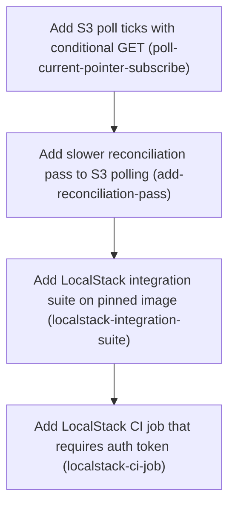

# Horizon 3 — S3 change polling, LocalStack suite and CI

## 🎯 What are we trying to achieve?

Apps using `@featuresync/aws` load a flag snapshot from S3 once at startup today and never notice when a new one is published. This horizon makes the S3 source watch for changes cheaply: it asks S3 "has `current.json` changed?", and S3 answers "no" (304) without sending the file. It also adds a slower safety re-read. Both are proven against a real S3 emulator (LocalStack), locally and in CI.

## 🧠 Why does this change need to happen?

The core flag client already supports live updates through an optional `subscribe()`, and the local-file source uses it, but the S3 source has only `load()`. The AWS SDK reports "not modified" as a thrown error, which the current error handling would mislabel as a request failure. Nothing has been tested against real S3 behaviour: the LocalStack image is unpinned and has no health check, and CI never runs it.

## At a glance

- **Phases:** 4
- **Complexity:** Medium — timer and async edge cases under a 100% coverage gate, plus CI/secret wiring
- **Main risk:** SDK v3 may report 304 as a thrown NotModified/304 error rather than a normal response, and LocalStack may differ from real S3. If handling covers only one form, polling may reload every tick or crash.
- **Quality target:** 100% line/branch/function/statement coverage, `pnpm verify` green without LocalStack, integration suite green against the pinned LocalStack
- **Testing focus:** fake-timer tests (304 handling, version dedup, no overlapping ticks, clean unsubscribe), exactly-once delivery against LocalStack, fail-fast CI token check

---

## Implementation plan

### Order of work

1. **Add S3 poll ticks with conditional GET** — can start immediately
2. **Add slower reconciliation pass to S3 polling** ↓ extends the same poll timer, so polling must exist first
3. **Add LocalStack integration suite on pinned image** ↓ proves polling and reconciliation against real S3 behaviour
4. **Add LocalStack CI job that requires auth token** ↓ runs the finished suite on every change, on the image the suite pinned

### Phase 1 — Add S3 poll ticks with conditional GET

Technical ID: `poll-current-pointer-subscribe` · @featuresync/aws S3 snapshot source · infrastructure · medium blast radius

**Goal** — Give the S3 snapshot source a subscribe(onChange) that runs poll ticks: each tick is a conditional GET (a request that only returns a body when it changed) of the current pointer, <env>/current.json. A 304 Not Modified response or an unchanged version delivers nothing. A new version loads the snapshot and passes the raw JSON to onChange. Ticks never overlap, and unsubscribe clears the timer.

**Why** — Right now createS3SnapshotSource returns only { load }, so apps never see new flag snapshots published to S3. The core SnapshotSource port already has an optional subscribe, and createFlagClient calls it at construction and calls unsubscribe on close(), so this change stays inside @featuresync/aws. The AWS SDK has no NotModified class and reports a 304 as a thrown error, so the poller has to spot it before the existing error mapping turns it into REQUEST_FAILED.

**Changes**

- Move the shared pointer-validate and snapshot-fetch path out of load() into a helper that both load() and the poller call, and keep the existing closure state loaded {etag, version, snapshot}.
- Add pollIntervalMs (default 30000) and logger?: Logger to S3SnapshotSourceOptions and validate that pollIntervalMs is a positive number. aws needs its own default console logger because core does not export consoleLogger.
- Add subscribe(onChange) that runs a single chained setTimeout: schedule the next poll tick only after the current one settles, so ticks never overlap.
- In each tick, send GetObject on current.json with IfNoneMatch set to the last ETag, and leave IfNoneMatch out when no ETag is known. Treat $metadata.httpStatusCode === 304 as no change first, and the error name 'NotModified' as a fallback.
- Apply version dedup: skip delivery when the pointer version equals the last delivered version. Otherwise fetch the snapshot and call onChange with the raw JSON; never validate it in aws.
- Log transient S3 errors with 'keeping the active snapshot' wording (mirroring createFileSnapshotSource), keep the last good snapshot and keep polling.
- Return an Unsubscribe that clears the pending timer synchronously and sets a stopped flag, so an in-flight tick delivers nothing after it.
- Move fakeS3/s3Error into a shared test helper and make the fake stateful so it honours IfNoneMatch. Write fake-timer tests for 304 by status, 304 by name, a same-version change, a new version, an error followed by recovery, no overlap and unsubscribe (including during an in-flight tick), keeping 100% coverage with no ignore pragmas.

**Files / areas**

- `packages/aws/src/infrastructure/s3-snapshot-source.ts`
- `packages/aws/test/infrastructure/s3-snapshot-source.subscribe.test.ts`
- `packages/aws/test/infrastructure/s3-snapshot-source.load.test.ts`

**How to verify**

- **304 treated as no change, not as an error** — subscribe.test.ts has one test where the fake throws an error with $metadata.httpStatusCode 304 and one where it throws name 'NotModified'; in both, onChange is called 0 times and the logger's error/warn spy is called 0 times
- **Version dedup and raw delivery** — A test changes the ETag but keeps the version, and asserts onChange is called 0 times
- **No overlapping ticks and a clean unsubscribe** — A fake-timer test with a GetObject that never resolves advances time by several intervals and asserts only 1 send call
- **Keeps the active snapshot and recovers from transient errors** — A test rejects one tick with a 500 or network error; the logger is called once with a message containing 'keeping the active snapshot', and onChange is not called
- **Options validation and a shared load path** — Tests show pollIntervalMs 0, a negative number, NaN and a non-number are all rejected when the source is created

**Done when** — createS3SnapshotSource returns { load, subscribe }, and packages/aws/test/infrastructure/s3-snapshot-source.subscribe.test.ts passes under pnpm verify at 100% coverage. And every check under *How to verify* passes its bar.

**Depends on** — nothing — can start immediately

Reference — full rubric

| Dimension | Rule | Pass criteria | Failure examples | minScore |
|---|---|---|---|---|
| not-modified-detection | A 304 from the conditional GET of current.json must produce no delivery and no REQUEST_FAILED error or error log, whether the SDK reports it by $metadata.httpStatusCode or by error name 'NotModified'. | subscribe.test.ts has one test where the fake throws an error with $metadata.httpStatusCode 304 and one where it throws name 'NotModified'; in both, onChange is called 0 times and the logger's error/warn spy is called 0 times The first tick sends GetObject with no IfNoneMatch key, and later ticks send IfNoneMatch equal to the last ETag (assert on the recorded command input) The 304 check runs before the existing error mapping (confirm in s3-snapshot-source.ts) | The 304 is caught by the shared error mapper and logged as a transient 'keeping the active snapshot' error on every tick IfNoneMatch: undefined is sent on the first tick, or it is sent with the snapshot object's ETag instead of the pointer's Only name === 'NotModified' is checked, so real SDK 304s with a different name get through | 8 |
| version-dedup-delivery | A new ETag with the same pointer version delivers nothing; a new version fetches the snapshot and passes the raw JSON to onChange exactly once, without validating it in aws. | A test changes the ETag but keeps the version, and asserts onChange is called 0 times A test changes the version, and asserts onChange is called once with the exact raw snapshot JSON The dedup key comes from the version already in load()'s state, so a subscribe right after load() does not deliver the version that load() just returned No snapshot schema validation is imported or called in the aws poll path | The dedup key is the ETag, so re-uploading the same version delivers it again The dedup state is kept per subscription and never seeded from load(), so the first tick delivers again what load() already returned Stored version is updated before the snapshot fetch succeeds, so a failed fetch loses that version forever | 8 |
| timer-lifecycle-safety | Ticks run on one chained setTimeout that is scheduled only after the previous tick settles, and unsubscribe leaves no pending timers and no later deliveries. | A fake-timer test with a GetObject that never resolves advances time by several intervals and asserts only 1 send call After unsubscribe(), vi.getTimerCount() is 0 A test unsubscribes while a tick is in flight, then resolves the tick with a new version, and asserts onChange is called 0 times and no timer is re-armed No setInterval is used in s3-snapshot-source.ts | Using setInterval, so a slow S3 call causes overlapping ticks clearTimeout is called, but the in-flight tick's finally block schedules a new timer afterward Subscribing twice shares one timer variable, so the first unsubscribe leaves the second subscription's timer running | 8 |
| transient-error-recovery | An S3 error during a tick is logged with 'keeping the active snapshot' wording, delivers nothing and keeps polling, and the next successful tick with a new version delivers it. | A test rejects one tick with a 500 or network error; the logger is called once with a message containing 'keeping the active snapshot', and onChange is not called The next tick returns a new version and onChange is called once A snapshot fetch that fails after the pointer changed does not advance the dedup version, so the change is retried | An unhandled rejection inside the tick stops the timer chain for good The error is sent to onChange or thrown out of subscribe console.error is called directly instead of the logger option, so the test logger sees nothing | 7 |
| options-and-refactor-integrity | pollIntervalMs defaults to 30000 and is validated, the logger is optional with an aws-local console default, and load() behaviour is unchanged after the helper extraction. | Tests show pollIntervalMs 0, a negative number, NaN and a non-number are all rejected when the source is created The default of 30000 is checked by advancing fake time 29999 ms (no send) and then 1 ms (one send) The existing load tests pass against the shared fakeS3 helper, and pnpm verify reports 100% coverage with no istanbul/v8 ignore pragmas in the file | NaN passes a `> 0`-free check such as `typeof === 'number'` consoleLogger is imported from core's internals, which core does not export load() and the poller keep separate copies of the pointer-validate code | 7 |

**Healer hint:** Most likely the SDK's thrown 304 falls into the REQUEST_FAILED mapping, or an in-flight tick re-arms the timer after unsubscribe; check for the 304 status before mapping errors, and check the stopped flag both before delivery and before scheduling the next timer.

### Phase 2 — Add slower reconciliation pass to S3 polling

Technical ID: `add-reconciliation-pass` · @featuresync/aws S3 snapshot source · infrastructure · small blast radius

**Goal** — Inside the same subscription, add a reconciliation pass: on a slower interval, re-read the current pointer with a plain unconditional GET and apply the same version dedup. This catches changes a conditional GET missed or where the ETag was wrong.

**Why** — Conditional GETs trust the ETag (a fingerprint S3 returns for each object version). If the ETag is wrong or a change slips between ticks, the app could keep a stale snapshot. An occasional full re-read is a cheap safety net. It is a separate phase because it adds a second schedule with its own validation and tests.

**Changes**

- Add reconcileIntervalMs (default 600000) to S3SnapshotSourceOptions and validate that it is positive and at least pollIntervalMs.
- On the same chained timer, turn a tick into a reconciliation tick once reconcileIntervalMs has passed since the last one. It sends no IfNoneMatch, and a single timer still means ticks never overlap.
- Refresh the stored ETag from the reconciliation response and use the same version dedup before any delivery.
- Add fake-timer tests: reconciliation delivers a new version even when the ETag is stale, delivers nothing when the version is unchanged, rejects bad interval options, and leaves no timer after unsubscribe.

**Files / areas**

- `packages/aws/src/infrastructure/s3-snapshot-source.ts`
- `packages/aws/test/infrastructure/s3-snapshot-source.subscribe.test.ts`

**How to verify**

- **Reconciliation uses an unconditional GET** — A test makes the fake return 304 for any IfNoneMatch (a stale ETag) while the pointer has a new version; after advancing past reconcileIntervalMs, onChange is called once with the new snapshot
- **Dedup and ETag refresh on reconciliation** — A test with the same version at reconciliation asserts onChange is called 0 times
- **Still one timer with no overlap** — The source file adds no second setTimeout/setInterval handle for reconciliation
- **Interval option validation** — Tests reject reconcileIntervalMs of 0, a negative number, NaN, and a value below pollIntervalMs

**Done when** — Reconciliation test cases in packages/aws/test/infrastructure/s3-snapshot-source.subscribe.test.ts pass under pnpm verify at 100% coverage. And every check under *How to verify* passes its bar.

**Depends on** — Add S3 poll ticks with conditional GET

Reference — full rubric

| Dimension | Rule | Pass criteria | Failure examples | minScore |
|---|---|---|---|---|
| reconcile-bypasses-etag | Once reconcileIntervalMs has passed since the last reconciliation, the tick sends GetObject on current.json without IfNoneMatch, and it catches a version change that a stale ETag hid. | A test makes the fake return 304 for any IfNoneMatch (a stale ETag) while the pointer has a new version; after advancing past reconcileIntervalMs, onChange is called once with the new snapshot The recorded command input for the reconciliation tick has no IfNoneMatch key Normal ticks between reconciliations still send IfNoneMatch | The reconciliation tick sends IfNoneMatch: undefined, and a fake that checks for the key treats it as conditional Every tick after the first reconciliation stays unconditional because the last-reconcile timestamp is never updated Reconciliation is timed from subscribe() only, so it runs once and never again | 8 |
| reconcile-dedup-and-etag-refresh | A reconciliation with an unchanged version delivers nothing, and it replaces the stored ETag with the one in the response. | A test with the same version at reconciliation asserts onChange is called 0 times After a reconciliation, the next normal tick sends IfNoneMatch equal to the ETag from the reconciliation response A snapshot fetch error during reconciliation logs the 'keeping the active snapshot' message, and the next reconciliation retries | Reconciliation always calls onChange because it skips the version dedup The ETag is refreshed only when the version changed, so a stale ETag stays in place forever when the version is the same | 8 |
| single-timer-invariant | Reconciliation shares the poll tick's chained timer; no second timer is added, and unsubscribe still leaves zero timers. | The source file adds no second setTimeout/setInterval handle for reconciliation With a hanging GetObject, advancing past reconcileIntervalMs still records only 1 send call vi.getTimerCount() is 0 after unsubscribe, including right after a reconciliation tick | A separate setInterval for reconciliation runs at the same time as a poll tick and delivers the same version twice unsubscribe clears the poll timer but not the reconciliation timer | 8 |
| reconcile-interval-validation | reconcileIntervalMs defaults to 600000, must be positive, and must be at least pollIntervalMs. | Tests reject reconcileIntervalMs of 0, a negative number, NaN, and a value below pollIntervalMs A value equal to pollIntervalMs is accepted (boundary test) The 600000 default is shown by a fake-timer test, and coverage stays at 100% | The comparison uses the default pollIntervalMs instead of the value the caller passed The check is `>` instead of `>=`, so the equal-intervals case is rejected | 7 |

**Healer hint:** Most likely the last-reconcile timestamp or the ETag refresh is updated only on the success-with-change path; update both after every reconciliation response, and build the command input without an IfNoneMatch key at all.

### Phase 3 — Add LocalStack integration suite on pinned image

Technical ID: `localstack-integration-suite` · LocalStack integration suite · infrastructure · medium blast radius

**Goal** — Add an integration suite with its own vitest config and a test:integration script. It seeds a bucket, a current pointer and a snapshot in LocalStack (a local emulator of AWS services), then checks that load() works, that updating current.json reaches a subscriber exactly once, and that an unchanged pointer produces a 304 or no delivery. The suite is configured only through standard AWS SDK environment variables. The suite runs against a pinned, health-checked LocalStack image in docker/docker-compose.yml, and what it proves about 304 reporting and path-style addressing is written into docs/spec/s3-layout.md.

**Why** — Unit tests use a fake S3 client, so they cannot show how real S3-compatible storage reports a 304 or handles path-style addressing (bucket name in the URL path instead of the hostname). The root vitest config enforces 100% coverage over packages/*/src and runs every package, so this suite must live outside that run. It also must not need LocalStack in the main verify job. Pinning the image here, before CI uses it, means the 304 behaviour the suite checks is the behaviour of the exact image CI will run.

**Changes**

- Pin the LocalStack image to a specific version tag in docker/docker-compose.yml, add a healthcheck on http://localhost:4566/_localstack/health (interval, timeout, retries), set SERVICES=s3, and keep the LOCALSTACK_AUTH_TOKEN=${LOCALSTACK_AUTH_TOKEN:?} guard.
- Create packages/aws/vitest.integration.config.ts that includes only integration/**/*.localstack.test.ts, and make sure the root vitest projects and coverage do not pick up these files.
- Add "test:integration": "vitest run --config vitest.integration.config.ts" to packages/aws/package.json, plus a root script that builds core first and then runs it.
- Write the suite so it builds the S3 client and source with no endpoint branch in code. The endpoint, path-style addressing, region and dummy credentials all come from env (AWS_ENDPOINT_URL_S3, AWS_REGION, AWS_ACCESS_KEY_ID/SECRET, and force-path-style or the localhost.localstack.cloud host).
- Seed a unique test bucket per run and clean it up afterwards. Use short poll intervals to test load, delivery on a pointer change and no delivery for an unchanged pointer.
- Add .env.example that documents LOCALSTACK_AUTH_TOKEN and the integration env vars.
- Make sure the suite passes the strict ESLint config.
- Add a 'Change detection' section to docs/spec/s3-layout.md: ETag + IfNoneMatch polling, 304 means no change (as the SDK and LocalStack actually report it), version dedup, reconciliation, and the path-style env settings the suite uses.

**Files / areas**

- `packages/aws/vitest.integration.config.ts`
- `packages/aws/integration/s3-snapshot-source.localstack.test.ts`
- `packages/aws/package.json`
- `.env.example`
- `docker/docker-compose.yml`
- `docs/spec/s3-layout.md`

**How to verify**

- **No LocalStack code branches** — grep for 'endpoint', 'forcePathStyle', '4566' and 'localstack' in packages/aws/src and in the suite's client construction returns no hard-coded config (the only match allowed is in comments or the bucket name)
- **Kept out of pnpm verify and coverage** — With docker stopped, pnpm verify exits 0 and its output lists no *.localstack.test.ts
- **Proves real 304 and exactly-once delivery** — There are three named tests: load, change delivers once, unchanged pointer does not deliver
- **Repeatable and cleans up** — The bucket name contains a random or timestamp suffix
- **Pinned image, healthcheck and spec** — The image tag is an exact version (for example localstack/localstack:4.x.y), not latest or a major-only tag

**Done when** — pnpm --filter @featuresync/aws test:integration passes against the pinned, healthy docker-compose LocalStack (docker compose up --wait), while pnpm verify still passes without LocalStack. And every check under *How to verify* passes its bar.

**Depends on** — Add slower reconciliation pass to S3 polling

**Rollback** — The suite creates only uniquely named test buckets in the local LocalStack and removes them in afterAll; nothing touches real AWS.

Reference — full rubric

| Dimension | Rule | Pass criteria | Failure examples | minScore |
|---|---|---|---|---|
| env-only-configuration | The suite and the source code get endpoint, path-style, region and credentials only from standard AWS SDK environment variables, with no LocalStack conditionals. | grep for 'endpoint', 'forcePathStyle', '4566' and 'localstack' in packages/aws/src and in the suite's client construction returns no hard-coded config (the only match allowed is in comments or the bucket name) new S3Client() is created without an endpoint argument The .env.example file lists AWS_ENDPOINT_URL_S3, AWS_REGION, AWS_ACCESS_KEY_ID, AWS_SECRET_ACCESS_KEY, the path-style setting and LOCALSTACK_AUTH_TOKEN | `endpoint: process.env.AWS_ENDPOINT_URL_S3 ?? 'http://localhost:4566'` fallback in the test forcePathStyle: true hard-coded in the suite because the env var name for path-style was unclear | 8 |
| isolation-from-verify | pnpm verify passes with no LocalStack running, and the integration files are outside the root vitest projects and coverage. | With docker stopped, pnpm verify exits 0 and its output lists no *.localstack.test.ts vitest.integration.config.ts includes only integration/**/*.localstack.test.ts and turns coverage off The strict ESLint run covers the integration folder and passes (it is not simply ignored) | The root vitest projects glob is packages/*, so packages/aws/vitest.integration.config.ts is picked up as a project The integration folder is added to ESLint ignores to make lint pass | 8 |
| real-behaviour-assertions | Against LocalStack, the suite checks load(), a pointer update delivered exactly once, and no delivery for an unchanged pointer, using real timers and bounded waits. | There are three named tests: load, change delivers once, unchanged pointer does not deliver The exactly-once test waits at least two more poll intervals after the first delivery and asserts the call count is still 1 Waits use a poll-until helper with a timeout, not a single fixed sleep The suite runs unsubscribe in afterEach/finally so vitest exits without hanging handles | The test asserts toHaveBeenCalled() instead of toHaveBeenCalledTimes(1), so a duplicate delivery goes unnoticed The unchanged-pointer test uses a poll interval longer than its wait, so it passes without any tick having run | 8 |
| repeatable-cleanup | Every run uses a unique bucket and deletes its objects and the bucket in afterAll, so reruns against the same LocalStack pass. | The bucket name contains a random or timestamp suffix afterAll empties the bucket and then deletes it, and does so even when a test failed Running test:integration twice in a row against one container passes both times | DeleteBucket is called without first deleting the objects, so it fails with BucketNotEmpty and buckets pile up A fixed bucket name makes the second run fail with BucketAlreadyOwnedByYou | 7 |
| pinned-healthchecked-image-and-spec | The compose file pins an exact LocalStack version with a working healthcheck and the auth-token guard, and s3-layout.md documents the change detection that the suite checks. | The image tag is an exact version (for example localstack/localstack:4.x.y), not latest or a major-only tag The healthcheck probes /_localstack/health with interval, timeout and retries set, and docker compose up --wait exits 0 LOCALSTACK_AUTH_TOKEN=${LOCALSTACK_AUTH_TOKEN:?} and SERVICES=s3 are present docs/spec/s3-layout.md has a 'Change detection' section covering IfNoneMatch, how a 304 shows up in the SDK, version dedup, reconciliation, and the path-style env | The healthcheck uses curl, but the pinned image has no curl, so the container never becomes healthy The spec says the 304 is returned normally, when the SDK actually throws it | 7 |

**Healer hint:** Most likely the root vitest projects glob picks up the integration config, or an endpoint fallback appears in the test; exclude integration/** from the root projects and coverage, and move every endpoint and path-style setting into env and .env.example.

### Phase 4 — Add LocalStack CI job that requires auth token

Technical ID: `localstack-ci-job` · CI pipeline · cross-cutting · small blast radius

**Goal** — Add a localstack job to .github/workflows/ci.yml. It fails straight away with a clear message when secrets.LOCALSTACK_AUTH_TOKEN is empty (fork PRs included), otherwise starts the pinned LocalStack, waits for it to be healthy, builds core and runs test:integration.

**Why** — Without CI, the S3 polling behaviour that only LocalStack can confirm would go unchecked on every change. The user chose to fail the job when the token is missing rather than skip it, so a missing secret shows up as an error instead of silently passing.

**Changes**

- Add a job named localstack next to verify, reusing checkout, pnpm setup, node from .nvmrc and pnpm install --frozen-lockfile.
- Add a first step that exits 1 with a message like 'LOCALSTACK_AUTH_TOKEN secret is missing; the LocalStack integration job requires it (fork PRs fail by design)' when the secret is empty.
- Start the pinned LocalStack with docker compose -f docker/docker-compose.yml up -d --wait so the job uses the same pinned image and healthcheck.
- Set the AWS SDK env vars for the job (endpoint, region, dummy credentials, path-style), build core, then run the integration script.

**Files / areas**

- `.github/workflows/ci.yml`

**How to verify**

- **Fails fast when the token is missing** — The step reads the secret through env (for example TOKEN: ${{ secrets.LOCALSTACK_AUTH_TOKEN }}) and tests it with [ -z "$TOKEN" ], then exits 1 with the message
- **Uses the pinned compose and waits for health** — The workflow YAML has no services: localstack block and no second image tag
- **Same env as the suite and builds core first** — AWS_ENDPOINT_URL_S3, AWS_REGION, dummy AWS credentials and the path-style variable are set at job or step level

**Done when** — The localstack job in .github/workflows/ci.yml passes on a branch that has the secret and fails with the missing-token message when it does not. And every check under *How to verify* passes its bar.

**Depends on** — Add LocalStack integration suite on pinned image

Reference — full rubric

| Dimension | Rule | Pass criteria | Failure examples | minScore |
|---|---|---|---|---|
| fail-fast-missing-token | The job's first step after checkout exits 1 with the clear missing-token message when secrets.LOCALSTACK_AUTH_TOKEN is empty, including on fork PRs. | The step reads the secret through env (for example TOKEN: ${{ secrets.LOCALSTACK_AUTH_TOKEN }}) and tests it with [ -z "$TOKEN" ], then exits 1 with the message The step runs before pnpm install and docker compose The job has no continue-on-error and no `if:` that skips it when the secret is missing | `if: secrets.LOCALSTACK_AUTH_TOKEN != ''` at job level, which quietly skips the job instead of failing The secret is placed directly in the run script with ${{ }}, which puts it into the shell command | 8 |
| pinned-compose-with-wait | The job starts LocalStack only through docker compose -f docker/docker-compose.yml up -d --wait with the token passed in env, and does not use a separate services: container. | The workflow YAML has no services: localstack block and no second image tag The compose step's env contains LOCALSTACK_AUTH_TOKEN An always() step tears the stack down or dumps the logs when a step fails | A GitHub services: container uses localstack/localstack:latest, which drifts from the pinned image --wait is left out, so the tests start before S3 is ready and fail at random | 7 |
| env-parity-and-ordering | The job sets the same AWS SDK env vars as .env.example, builds core, and runs the root integration script, and it matches the verify job's setup. | AWS_ENDPOINT_URL_S3, AWS_REGION, dummy AWS credentials and the path-style variable are set at job or step level pnpm/node setup uses .nvmrc and pnpm install --frozen-lockfile, the same as verify The core build step runs before test:integration actionlint (or a YAML parse) passes on ci.yml | test:integration runs without building core first, so imports from @featuresync/core dist fail The path-style var is set in .env.example but left out of CI, so virtual-host requests to localhost fail | 7 |

**Healer hint:** Most likely the token check was written as a job-level `if:` that skips the job, or the secret is not passed to docker compose; replace it with a first step that exits 1 when the env-mapped secret is empty, and pass LOCALSTACK_AUTH_TOKEN in the compose step's env.

## Discovery Findings

| Area | Finding | File | Implication |
|---|---|---|---|
| aws source layout | Source lives under packages/aws/src/infrastructure/ (s3-snapshot-source.ts, s3-snapshot-error.ts); domain/ holds only current-pointer.ts. index.ts re-exports createS3SnapshotSource, S3SnapshotSourceOptions, S3SnapshotError, S3SnapshotErrorReason. | `packages/aws/src/infrastructure/s3-snapshot-source.ts` | Plan edits against infrastructure/ paths; any pure dedup logic goes in domain/, which may not import infrastructure/application. |
| existing ETag/version state | createS3SnapshotSource returns only { load }, no subscribe. It keeps closure state loaded {etag, version, snapshot}; load() does an unconditional GET of current.json and compares ETag client-side (no IfNoneMatch). Missing ETag sets loaded undefined. | `packages/aws/src/infrastructure/s3-snapshot-source.ts` | subscribe can reuse loaded state and the pointer-validate + snapshot-fetch path (extract a shared helper); handle no-ETag (send no IfNoneMatch). |
| error mapping | Failed GetObject becomes S3SnapshotError: POINTER_NOT_FOUND/SNAPSHOT_NOT_FOUND when NoSuchKey/AccessDenied/404/403, else REQUEST_FAILED; also INVALID_POINTER and INVALID_JSON. | `packages/aws/src/infrastructure/s3-snapshot-source.ts` | A 304 would map to REQUEST_FAILED today; the poller must detect 304 (httpStatusCode 304 and/or name NotModified) before mapping and treat it as no change. |
| pointer shape | CurrentPointer is {schemaVersion:1, environment, version: positive int, snapshotKey}; parseCurrentPointer returns a Result. Spec: current.json is the only mutable key; publisher writes snapshot then pointer. Spec does not mention ETag/polling/304. | `packages/aws/src/domain/current-pointer.ts` | Version dedup keys on pointer version; docs/spec/s3-layout.md needs a change-detection section. |
| core port / client contract | SnapshotSource has load() and optional subscribe?(onChange:(snapshot: unknown)=>void): Unsubscribe. createFlagClient calls subscribe once at construction, validates in apply; close() calls unsubscribe(). | `packages/core/src/application/flag-client.ts` | No core change needed; unsubscribe must clear timers synchronously and suppress in-flight tick delivery (stopped flag). |
| subscribe pattern to mirror | createFileSnapshotSource takes watch?: boolean, logger?: Logger (default consoleLogger from application/logger.port.js), logs 'Ignoring ...; keeping the active snapshot', debounces with setTimeout; Unsubscribe closes watcher. | `packages/core/src/infrastructure/file-snapshot-source.ts` | Add pollIntervalMs, reconcileIntervalMs, logger?: Logger to S3SnapshotSourceOptions; core does not export consoleLogger (per memory) so aws needs its own default logger. |
| aws unit test layout / fake S3 | Tests at packages/aws/test/{domain/current-pointer.test.ts, infrastructure/s3-snapshot-source.load.test.ts}; vi.mock @aws-sdk/client-s3; fakeS3(objects) keyed by command.input.Key; s3Error(name,status) helper. No per-package vitest config. | `packages/aws/test/infrastructure/s3-snapshot-source.load.test.ts` | Add s3-snapshot-source.subscribe.test.ts with fake timers and a stateful fake honoring IfNoneMatch; move fakeS3 to a shared test helper. |
| vitest/coverage | Root vitest.config.ts: projects ['packages/*'], v8 coverage over packages/*/src/**/*.ts at 100% all metrics. verify = build core && typecheck && lint && test. packages/aws has only build and typecheck scripts. | `vitest.config.ts` | LocalStack suite must be excluded from default run (naming convention + separate vitest config) with its own test:integration script outside the coverage gate. |
| eslint zones | strictTypeChecked everywhere, --max-warnings=0; no-restricted-paths only in packages/*/src (domain !-> application/infrastructure; application !-> infrastructure). | `eslint.config.js` | Integration tests are linted strictly; keep poller in infrastructure/, pure helpers in domain/. |
| CI | Single 'verify' job on ubuntu-latest: checkout, pnpm setup, node 22 via .nvmrc, pnpm install --frozen-lockfile, pnpm verify, pnpm example:node-local. No services, no secrets. | `.github/workflows/ci.yml` | Add a separate localstack job reusing setup; first step fails when secrets.LOCALSTACK_AUTH_TOKEN is empty; pinned image with health wait; build core; run integration script. |
| docker compose | image localstack/localstack unpinned, no healthcheck, ports 4566/4510-4559/443 on 127.0.0.1, LOCALSTACK_AUTH_TOKEN=${LOCALSTACK_AUTH_TOKEN:?} already fails when missing, mounts docker.sock and ./volume. | `docker/docker-compose.yml` | Pin tag, add healthcheck on /_localstack/health, consider SERVICES=s3; use same tag in CI. |
| env files | Root .env (gitignored) holds only LOCALSTACK_AUTH_TOKEN; no .env.example. | `.env` | Add .env.example documenting token and integration env vars (AWS_ENDPOINT_URL_S3, bucket, region, dummy creds). |
| AWS SDK 304 behavior | @aws-sdk/client-s3 3.1135.0; GetObject accepts IfNoneMatch; no NotModified exception class — a 304 goes through the generic error path, thrown S3ServiceException with $metadata.httpStatusCode 304 and name 'NotModified' or generic. | `packages/aws/node_modules/@aws-sdk/client-s3/dist-types/commands/GetObjectCommand.d.ts` | Detect not-modified primarily by httpStatusCode === 304, name 'NotModified' as fallback; unit-test both, confirm in LocalStack suite. |
| package deps | @aws-sdk/client-s3 is peer+dev dep ^3.1135.0; @featuresync/core workspace:*; root devDeps vitest ^5, typescript ^6, eslint ^10. | `packages/aws/package.json` | Integration suite needs no new dependency; core build must run before aws tests. |

## Out of Scope

- Snapshot publisher / writing snapshots to S3: horizon 2 decided the reader side is read-only and publisher ownership is still an open blocker.
- SNS→SQS push notifications: decided for a later horizon; polling comes first.
- IAM least-privilege enforcement tests: LocalStack Community does not enforce IAM, so this remains an open blocker.
- Bucket provisioning / IaC (CDK, Terraform, CloudFormation): the integration suite seeds its own test bucket; deploying into user accounts is later work.
- A real-AWS CI job: no AWS test account is confirmed, so real-AWS runs are at most documented.
- Reworking the AccessDenied→*_NOT_FOUND mapping: it is an accepted preview concern from horizon 2; this horizon only records the risk.
- Changing the SnapshotSource port (e.g. adding error/stop hooks): the existing optional subscribe/Unsubscribe is enough, and changing core's port would widen the blast radius.
- Content-hash dedup or re-delivering unchanged versions: the user chose version dedup.
- Simplifying the current-pointer shape (dropping snapshotKey): that is a layout-contract change for a publisher horizon, not needed for polling.
- @featuresync/nestjs, the CLI and the dashboard: these are later vision packages unrelated to reader-side distribution.
- Skipping the integration job on fork PRs or when the token is missing: the user chose to fail.
- Recording horizon-3 unknowns in discoveries.md is bookkeeping done during execute/verify; the s3-layout.md change-detection section was folded into the LocalStack suite phase.
- Add a pure version-dedup helper in packages/aws/src/domain/: fails YAGNI gate 4 (needless abstraction). The check is a single equality comparison on the version and can stay inside the poller.
- Add a jitter/backoff policy for polling after repeated S3 errors: fails YAGNI gate 1 (no requirement). The success definition only asks to log errors and keep polling.
- Add SNS/SQS push notifications, a snapshot publisher, IAM least-privilege tests or a real-AWS CI job: fails YAGNI gate 1. These are explicitly out of scope for this horizon.
- Rework the AccessDenied to *_NOT_FOUND mapping: fails YAGNI gate 1. It is an accepted preview concern; this horizon only records the risk.

## Required Materials

| Name | Kind | Why needed | How to get it |
|---|---|---|---|
| LOCALSTACK_AUTH_TOKEN in local .env for running the suite | credential | Running the LocalStack integration suite locally (docker-compose reads it from .env). | Repo owner provides it (LocalStack account auth token); never committed. |
| GitHub Actions secret LOCALSTACK_AUTH_TOKEN configured by the repo owner | credential | The LocalStack CI job needs it; without it the job fails by design. | Repo owner provides it (LocalStack account auth token); never committed. |

## Success Criteria

- (1) The S3 snapshot source implements the optional SnapshotSource.subscribe(onChange) and returns an Unsubscribe. Each poll tick sends a conditional GET for current.json using the last ETag. A 304 (however SDK v3 reports it, as a thrown NotModified error and/or $metadata.httpStatusCode 304) delivers nothing. A changed pointer whose version equals the last delivered version delivers nothing. A new version loads the snapshot and passes the raw JSON to onChange; core validates it and @featuresync/aws never does. Reconciliation runs on a slower interval, does an unconditional GET and uses the same version dedup. Ticks never overlap. After unsubscribe (and after client close) no timers remain and no more deliveries happen. Transient S3 errors are logged, polling keeps going and the last good snapshot is kept. (2) Unit tests use fake timers and a fake S3 client and keep 100% line/branch/function/statement coverage with no ignore pragmas; ESLint layer-boundary rules pass; pnpm verify is green. (3) The integration suite has its own vitest config and test:integration script, sits outside the root unit-coverage projects, and reaches LocalStack only through standard AWS SDK env config with no code branch. Against docker-compose LocalStack it seeds a bucket/pointer/snapshot, checks that load() works, that updating current.json reaches a subscriber once, and that an unchanged pointer gives a 304 or no delivery. (4) docker-compose pins the LocalStack image tag and has a healthcheck. A CI job waits for health, runs test:integration and fails with a clear message when LOCALSTACK_AUTH_TOKEN is absent (fork PRs included). (5) The horizon-3 unknowns (304 reporting, path-style addressing, pointer shape) are resolved and recorded in discoveries.
- Add S3 poll ticks with conditional GET: createS3SnapshotSource returns { load, subscribe }, and packages/aws/test/infrastructure/s3-snapshot-source.subscribe.test.ts passes under pnpm verify at 100% coverage.
- Add slower reconciliation pass to S3 polling: Reconciliation test cases in packages/aws/test/infrastructure/s3-snapshot-source.subscribe.test.ts pass under pnpm verify at 100% coverage.
- Add LocalStack integration suite on pinned image: pnpm --filter @featuresync/aws test:integration passes against the pinned, healthy docker-compose LocalStack (docker compose up --wait), while pnpm verify still passes without LocalStack.
- Add LocalStack CI job that requires auth token: The localstack job in .github/workflows/ci.yml passes on a branch that has the secret and fails with the missing-token message when it does not.

## Alignment Preview

One round and no redirect. The user accepted the preview and asked for all 3 reviewer concerns to be fixed, and they were applied directly:
- LocalStack pinning and the health check moved into the suite phase, so the suite is proven on the image CI uses. This removed the separate compose phase (5 → 4 phases).
- The suite phase now owns the `s3-layout.md` change-detection section and recording the 304 and path-style answers.

## Quality Gate

- Path: full, with one gate iteration.
- Critic verdict: pass. 0 blockers, 0 majors, 3 minors.
- Discarded on evidence: none. The verification call did not run, and nothing needed healing.
- Fixed by the orchestrator: two truncated `whyNeeded` notes (an assembly bug, not a critic heal).
- Accepted debt:
  - `valid-dependencies` (7/10): the suite depends on reconciliation only for linear order. It could depend on phase 1 alone.
  - `success-coverage` (7/10): the first success criterion bundles the whole five-part success definition.
  - `resources-gathered` (8/10): truncated `whyNeeded` (fixed afterwards).

## Cost

7 Agent calls against a budget of 8–10: analyze, discovery, decompose, preview concerns, rubrics, critic. No patch, verify or heal calls were needed, and Step 3.5 was skipped because the phase cap deferred nothing.

## Full analysis

**Domain shape:** technical — This horizon is about distribution machinery (S3 polling with conditional GETs, timers, a LocalStack test harness and a CI job), not about flag or targeting business rules, which were already built in core.

| Term | Meaning |
|---|---|
| current pointer | The <env>/current.json object naming the active snapshot version (and key); it is what polling fetches conditionally. |
| conditional GET | A GetObject on current.json with IfNoneMatch set to the last ETag; a 304 Not Modified means no change. |
| poll tick | One scheduled, non-overlapping conditional GET of the current pointer, chained on a single timer. |
| reconciliation | A slower periodic unconditional re-read of the current pointer that catches missed or ETag-confused changes. |
| version dedup | Skipping delivery to subscribers when the pointer's snapshot version equals the last delivered version. |
| subscription | The S3 source's subscribe(onChange) → Unsubscribe lifecycle; unsubscribe clears all timers and stops delivery. |
| integration suite | Opt-in vitest suite with its own config and test:integration script that runs against LocalStack configured only through AWS SDK env vars. |
| LocalStack CI job | CI job running the integration suite on a pinned, health-checked LocalStack image; it fails when LOCALSTACK_AUTH_TOKEN is missing. |
| S3 snapshot source | The @featuresync/aws adapter that loads and watches snapshots in S3. |
| LocalStack environment | The pinned docker-compose LocalStack emulator used locally and in CI. |
| CI pipeline | The GitHub Actions workflow in .github/workflows/ci.yml. |

**Assumptions**

- Horizon 2's load(), the current-pointer parser, the S3 error mapping and docs/spec/s3-layout.md exist as recorded. The pointer's version field is the dedup key; if snapshotKey is still present it is ignored for dedup.
- The SnapshotSource port ({load(); subscribe?(onChange): Unsubscribe}) stays unchanged. Timers and ETag/version state live inside the S3 source, and flag-client already calls unsubscribe on close.
- Overlapping ticks are prevented with a single chained setTimeout (schedule the next tick only after the current one settles). This is the simplest option and meets the no-overlap bar.
- pollInterval and reconcileInterval are configurable with sensible defaults (e.g. poll about 30s, reconcile 5 to 15 min, default about 10 min). They are validated as positive numbers with reconcile >= poll; the 5 to 15 min range is advisory, not enforced.
- The integration suite is kept apart through a separate vitest config and a test:integration script, not a tag filter, because root coverage covers all of packages/*/src.
- A LOCALSTACK_AUTH_TOKEN GitHub secret is or will be configured by the repo owner. Fork PRs without it will fail that job by design (user decision).
- Path-style addressing is set through env/shared config (AWS_ENDPOINT_URL_S3 plus force-path-style, or the localhost.localstack.cloud host), never through code, per the binding decision.
- AccessDenied mapped to *_NOT_FOUND stays as horizon 2 left it. Polling treats it like any other transient or not-found error: log it and keep the last good snapshot.

**Risks**

- SDK v3 may report 304 as a thrown NotModified/304 error rather than a normal response, and LocalStack may differ from real S3. If handling covers only one form, polling may reload every tick or crash.
- Fake timers with async callbacks can make chained-timer tests flaky or leave branches uncovered, which would threaten the 100% coverage gate without pragmas.
- Failing CI when the token is missing will turn every fork PR red. The user chose this deliberately, but it may block outside contributors and needs clear documentation.
- An unpinned or poorly health-checked LocalStack, or path-style addressing that can't be set through env alone, could make the CI job flaky or push a code branch, which conflicts with the LocalStack-via-env-only decision.
- Version-only dedup misses a snapshot rewritten under the same version. This is acceptable only because snapshots are immutable per version; a publisher that breaks immutability would make deliveries silently stale.
- AccessDenied mapped to not-found can hide real credential or permission failures during polling, so an app may run on a stale snapshot indefinitely with only a log line.
- The integration job needs core built first (dist-only exports). If it skips the build step it fails for reasons unrelated to polling.
- Running the integration suite inside the root vitest projects by mistake would break the 100% unit-coverage gate or need LocalStack in the main verify job.
- The existing flaky core file-watch rename test may make pnpm verify fail intermittently and mask real results.
