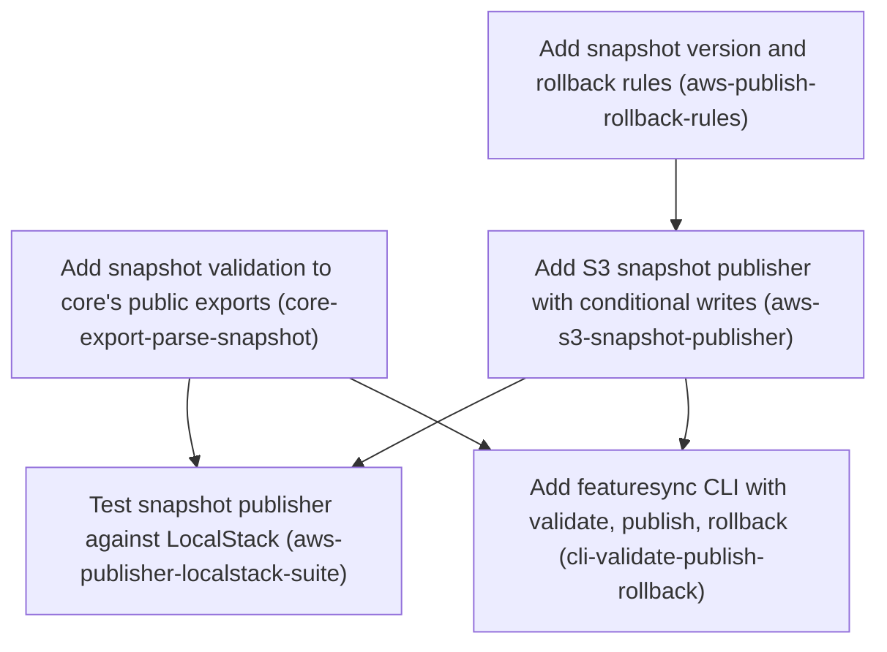

# Horizon 4 — Snapshot publisher and CLI

## 🎯 What are we trying to achieve?

FeatureSync can read flag snapshots from S3 but nothing writes them. This horizon adds the write side: a `featuresync` command that **validates** a snapshot file, **publishes** it as a new immutable version (`<env>/snapshots/<n>.json`) and then points `<env>/current.json` at it, and **rolls back** the pointer to an earlier version. Everything it writes must be loadable by the existing S3 reader, proven against LocalStack.

## 🧠 Why does this change need to happen?

Today someone has to hand-write S3 objects that must exactly follow `docs/spec/s3-layout.md`, which is error-prone and unsafe: nothing stops an existing version being overwritten, two people publishing at once from clobbering each other, or an invalid snapshot going live. Core's validator (`parseSnapshot`) and the pointer rules exist but are private, and no CLI exists. The open question "who owns the write?" is settled here: the CLI publisher does.

## At a glance

- **Phases:** 5
- **Complexity:** Medium — conditional S3 writes and race handling under a 100% coverage gate, plus a new package
- **Main risk:** LocalStack (or real S3) may report a failed conditional write (`IfNoneMatch '*'` / `IfMatch`) with a different error shape than expected; the LocalStack probe in phase 4 must pin it before the error mapping is trusted
- **Quality target:** 100% line/branch/function/statement coverage, `pnpm verify` green, LocalStack integration job green
- **Testing focus:** write ordering and conditional headers with a fake S3 client, 403-is-not-missing, rollback re-validation, LocalStack race + read-back through the existing reader, CLI exit codes

---

## Implementation plan

### Order of work

1. **Add snapshot validation to core's public exports** — can start immediately
2. **Add snapshot version and rollback rules** — can start immediately (independent of phase 1)
3. **Add S3 snapshot publisher with conditional writes** — ↓ uses the version and rollback rules
4. **Test snapshot publisher against LocalStack** — ↓ proves the publisher on real S3 behaviour, validating with core's newly exported parseSnapshot
5. **Add featuresync CLI with validate, publish, rollback** — ↓ wraps the exported validator and publisher in a command

### Phase 1 — Add snapshot validation to core's public exports

Technical ID: `core-export-parse-snapshot` · Snapshot Validation (@featuresync/core) · domain · small blast radius

**Goal** — Make core's existing snapshot validation (parseSnapshot) callable from other packages through one named, documented export, so the publisher and the CLI validate snapshots with exactly the same rules the readers use.

**Why** — The write side must reject any snapshot that readers would reject, and the only source of those rules is parseSnapshot in @featuresync/core, which the package index does not export yet. Adding one deliberate export avoids copying the rules and keeps core's public surface small.

**Changes**

- Export parseSnapshot from packages/core/src/index.ts, with a short doc comment saying it returns a Result holding either a Snapshot or a SnapshotValidationError that lists field-level issues ({path, message})
- Do not export any other internals (for example SNAPSHOT_SCHEMA_VERSION); keep the export list minimal
- Add or extend a test that imports parseSnapshot from the package entry point and checks one accepted and one rejected snapshot

**Files / areas**

- `packages/core/src/index.ts`
- `packages/core/test/index.test.ts`

**How to verify**

- **parseSnapshot reachable from package entry** — packages/core/src/index.ts contains a named export of parseSnapshot that re-exports from './domain/snapshot'
- **Public surface stays minimal** — git diff of packages/core/src/index.ts shows exactly one new exported value, parseSnapshot
- **Accept and reject both proven through the entry point** — The test asserts result.ok === true and checks a field of the returned Snapshot
- **Core remains dependency-pure domain** — packages/core/package.json dependencies are unchanged

**Done when** — `import { parseSnapshot } from '@featuresync/core'` works, and a test run through the package entry point shows it accepting a valid snapshot and returning field-level issues for an invalid one. Every check under *How to verify* passes its bar.

**Depends on** — nothing — can start immediately

Reference — full rubric

| Dimension | Rule | Pass criteria | Failure examples | minScore |
|---|---|---|---|---|
| `entry-point-export` | You can import parseSnapshot from '@featuresync/core' through packages/core/src/index.ts, and it is the same function as the one in domain/snapshot.ts. | packages/core/src/index.ts contains a named export of parseSnapshot that re-exports from './domain/snapshot' A test file imports parseSnapshot from the package index (for example '../src/index' or '@featuresync/core'), not from domain/snapshot pnpm --filter @featuresync/core build emits dist/index.d.ts that declares parseSnapshot | The test imports from '../src/domain/snapshot', so the test would still pass if the index export were removed (plausible) The export is written as a wrapper function that repeats the rules instead of re-exporting | 8 |
| `minimal-surface` | This phase adds only parseSnapshot, plus types already exported, to the public exports. | git diff of packages/core/src/index.ts shows exactly one new exported value, parseSnapshot SNAPSHOT_SCHEMA_VERSION and the internal zod schemas are not exported If SnapshotValidationError and its issue type were not already exported, they are exported only as types | A careful developer writes `export * from './domain/snapshot'` for convenience, which leaks the schema constants (plausible) The zod schema object is exported so callers can compose it | 8 |
| `accept-reject-contract` | The tests show one valid snapshot resolving to ok and one invalid snapshot resolving to an error that lists {path, message} issues. | The test asserts result.ok === true and checks a field of the returned Snapshot The test asserts result.ok === false, and the issues array has at least one entry with a specific path (for example 'flags.x.type') and a non-empty message Coverage of packages/core/src stays at 100% | The rejection test asserts only ok === false and never checks issue paths, so a regression to one generic error would pass (plausible) | 7 |
| `domain-purity` | The export adds no infrastructure or AWS dependency to @featuresync/core. | packages/core/package.json dependencies are unchanged index.ts does not import node:fs, @aws-sdk/*, or @featuresync/aws The doc comment describes the Result/Snapshot/SnapshotValidationError contract and does not mention S3 or the CLI | The doc comment or a helper adds a readSnapshotFile(path) that uses node:fs to 'help the CLI' (plausible) | 9 |

**Healer hint:** If the export test passes even without the index change, point its import at the package index (../src/index) so that it really proves the public export.

### Phase 2 — Add snapshot version and rollback rules

Technical ID: `aws-publish-rollback-rules` · Snapshot Publishing (@featuresync/aws) · domain · small blast radius

**Goal** — Add pure functions in @featuresync/aws that decide the next snapshot version for a publish and check whether a rollback target is allowed, reusing the existing current pointer rules.

**Why** — Publish and rollback have business rules: versions only increase and are never reused, the current pointer names <env>/snapshots/<n>.json, and rollback may only point to an existing lower version. These rules live next to snapshotKeyFor and parseCurrentPointer in packages/aws/src/domain, so the S3 layout contract stays in one package and no private helper needs to be exported to a new package. For that reason the publisher goes into @featuresync/aws and the CLI becomes a thin separate package.

**Changes**

- Add nextSnapshotVersion(currentPointer | undefined): returns 1 when no pointer exists, otherwise current version + 1
- Add buildCurrentPointer(environment, version), which returns {schemaVersion: POINTER_SCHEMA_VERSION, environment, version, snapshotKey: snapshotKeyFor(environment, version)}
- Add checkRollbackTarget(currentPointer, targetVersion), which returns a Result that rejects a missing current pointer and a target that is not a positive integer or not lower than the current version
- Add validateEnvironmentName/validateVersion by reusing the zod rules already in current-pointer.ts (a non-empty environment with no '/', a positive decimal integer), not by writing them again
- Cover every branch with unit tests

**Files / areas**

- `packages/aws/src/domain/publishing.ts`
- `packages/aws/test/domain/publishing.test.ts`

**How to verify**

- **Monotonic, never-reused versions** — Unit test: nextSnapshotVersion(undefined) === 1
- **Rollback target rejection matrix** — Separate tests for: undefined pointer, target 0, target -1, target 2.5, target == current, target > current, and a valid lower target
- **Reuses current-pointer zod rules** — publishing.ts imports the environment and version schemas or helpers from './current-pointer'
- **Pure domain, no I/O** — publishing.ts has no import from @aws-sdk/*, ../infrastructure/*, node:* or @featuresync/core

**Done when** — packages/aws/src/domain/publishing.ts exists with the version, pointer-building and rollback-check functions, and has 100% unit-test coverage. Every check under *How to verify* passes its bar.

**Depends on** — nothing — can start immediately

Reference — full rubric

| Dimension | Rule | Pass criteria | Failure examples | minScore |
|---|---|---|---|---|
| `version-sequencing` | nextSnapshotVersion returns 1 when there is no pointer and current.version + 1 otherwise, and buildCurrentPointer produces a pointer that parseCurrentPointer accepts. | Unit test: nextSnapshotVersion(undefined) === 1 Unit test: a pointer with version 7 gives 8 Unit test: parseCurrentPointer(JSON of buildCurrentPointer('production', 3)) is ok, and its snapshotKey equals snapshotKeyFor('production', 3) A 10 also includes a round-trip property check or a test over several versions | buildCurrentPointer hardcodes `${env}/snapshots/${v}.json` instead of calling snapshotKeyFor, so a later change to the layout breaks it silently (plausible) schemaVersion is a literal 1 instead of POINTER_SCHEMA_VERSION | 8 |
| `rollback-target-rules` | checkRollbackTarget returns an error Result for a missing pointer, a non-integer or non-positive target, and a target equal to or above the current version, and returns ok only for 1 <= target < current. | Separate tests for: undefined pointer, target 0, target -1, target 2.5, target == current, target > current, and a valid lower target Each error Result carries a distinguishable reason or message that a test asserts Rejections are returned as Results, and the function does not throw | A target equal to the current version is accepted as a no-op rollback (plausible off-by-one) NaN passes because the check uses `target < current` without Number.isInteger | 8 |
| `rule-reuse` | validateEnvironmentName and validateVersion get their rules from current-pointer.ts and do not write them again. | publishing.ts imports the environment and version schemas or helpers from './current-pointer' grep shows no second regex or '/' check for environment names in publishing.ts Tests cover the empty env, an env containing '/', and the version strings '01', '1.0' and '-1', matching the current-pointer behaviour | The code writes a fresh `/^[1-9]\d*$/` in publishing.ts that differs from current-pointer on the leading-zero case (plausible) | 7 |
| `pure-domain-layer` | publishing.ts is pure and imports nothing from infrastructure, the AWS SDK, or the core validator. | publishing.ts has no import from @aws-sdk/*, ../infrastructure/*, node:* or @featuresync/core It has no async functions, Date or random calls Coverage of packages/aws/src/domain/publishing.ts is 100% statements and branches | It imports S3PublishError from infrastructure to reuse its reason codes (plausible inward-dependency violation) | 9 |

**Healer hint:** The most likely miss is the target == current or non-integer rollback case: add explicit Number.isInteger and strict less-than checks, each with its own test.

### Phase 3 — Add S3 snapshot publisher with conditional writes

Technical ID: `aws-s3-snapshot-publisher` · Snapshot Publishing (@featuresync/aws) · infrastructure · medium blast radius

**Goal** — Add createS3SnapshotPublisher in @featuresync/aws. Its publish writes <env>/snapshots/<n>.json create-only and then replaces <env>/current.json. Its rollback rewrites only current.json after it re-validates the target snapshot.

**Why** — This adapter performs every write to the S3 layout. It uses S3 conditional writes so a published version can never be overwritten (IfNoneMatch '*', meaning create only if absent) and so two publishers racing each other fail loudly (IfMatch on the pointer's ETag, meaning replace only if nobody changed it since we read it). Package rules say @featuresync/aws never validates snapshots itself, so the caller injects a validate function (the CLI passes core's parseSnapshot).

**Changes**

- Move the private errorShape helper from s3-snapshot-source.ts into a shared s3-errors.ts and use it in both adapters
- Accept {bucket, client?: Pick<S3Client,'send'>, validate} and default to new S3Client({}) so only standard AWS SDK env config is used, with no LocalStack code path
- publish(env, snapshotBody): call validate first, read current.json with its ETag, pick n with nextSnapshotVersion, PutObject snapshots/<n>.json with IfNoneMatch '*', and only after that succeeds PutObject current.json with IfMatch (or IfNoneMatch '*' on the first publish). If the snapshot write fails, never touch the pointer
- Treat only NoSuchKey/404 as 'no pointer yet'. A 403 AccessDenied must fail with an error and must never lead to a version-1 publish
- rollback(env, targetVersion): read the pointer, run checkRollbackTarget, GetObject the target snapshot and pass it through validate, then PutObject current.json with IfMatch. Never write or delete a snapshot
- Throw S3PublishError with reasons INVALID_SNAPSHOT | VERSION_EXISTS | CONFLICT (412 Precondition Failed) | INVALID_ROLLBACK_TARGET | REQUEST_FAILED, and export it and the factory from packages/aws/src/index.ts
- Reach 100% coverage with a fake client

**Files / areas**

- `packages/aws/src/infrastructure/s3-snapshot-publisher.ts`
- `packages/aws/src/infrastructure/s3-errors.ts`
- `packages/aws/src/infrastructure/s3-snapshot-source.ts`
- `packages/aws/src/index.ts`
- `packages/aws/test/infrastructure/s3-snapshot-publisher.test.ts`

**How to verify**

- **Snapshot-then-pointer with conditional headers** — A fake-client test records the order of send calls: GetObject current, then PutObject snapshot, then PutObject current
- **Missing vs forbidden vs conflict mapping** — A test where the fake throws AccessDenied (403) on the pointer read expects S3PublishError REQUEST_FAILED, and no PutObject is sent
- **Validation injected, never owned** — grep of packages/aws/src shows no '@featuresync/core' import and no zod snapshot schema
- **Rollback touches only the pointer** — The fake-client test asserts that exactly one PutObject is sent, to <env>/current.json, with IfMatch
- **Adapter layering, SDK config, exports** — No 'localstack', 'endpoint' or 'forcePathStyle' literal appears in packages/aws/src

**Done when** — createS3SnapshotPublisher is exported from @featuresync/aws, and its fake-client unit tests at 100% coverage prove the snapshot-then-pointer order, create-only writes, 412 mapped to CONFLICT, and rollback re-validation. Every check under *How to verify* passes its bar.

**Depends on** — Add snapshot version and rollback rules

Reference — full rubric

| Dimension | Rule | Pass criteria | Failure examples | minScore |
|---|---|---|---|---|
| `write-ordering-conditional` | publish sends PutObject for snapshots/<n>.json with IfNoneMatch '*' before any pointer write. The pointer write uses IfMatch=<read ETag>, or IfNoneMatch '*' on the first publish. | A fake-client test records the order of send calls: GetObject current, then PutObject snapshot, then PutObject current The test asserts the IfNoneMatch '*' input on the snapshot put, and IfMatch equal to the ETag the fake returned on the pointer put When the snapshot put fails, a test asserts that no pointer PutObject was sent A first-publish test asserts that the pointer put uses IfNoneMatch '*' and version 1 | The pointer put has no IfMatch when the ETag contains quotes and the code strips them, so the condition never matches on real S3 (plausible) The snapshot and pointer puts run in parallel with Promise.all | 8 |
| `error-classification` | Only NoSuchKey or 404 counts as 'no pointer'. A 403 fails, 412 maps to CONFLICT, and a conflict on the snapshot put maps to VERSION_EXISTS. | A test where the fake throws AccessDenied (403) on the pointer read expects S3PublishError REQUEST_FAILED, and no PutObject is sent Tests for a 412 on the pointer put (expect CONFLICT) and a 412 or ConditionalRequestConflict on the snapshot put (expect VERSION_EXISTS) errorShape is imported from s3-errors.ts by both s3-snapshot-source.ts and the publisher, and no copy remains | Any GetObject error is treated as 'no pointer', so a 403 leads to a version-1 publish over live data (plausible) errorShape is copied into the publisher and not moved | 8 |
| `injected-validation` | The publisher calls the injected validate function for publish and for rollback targets, and it never imports @featuresync/core or schema rules. | grep of packages/aws/src shows no '@featuresync/core' import and no zod snapshot schema A test shows that validate rejecting on publish gives INVALID_SNAPSHOT with zero PutObject calls A test shows that a rollback target failing validate gives INVALID_SNAPSHOT and no pointer write | Rollback skips validate because the snapshot 'was already validated at publish' (plausible) packages/aws/package.json gains a dependency on @featuresync/core | 9 |
| `rollback-immutability` | rollback runs checkRollbackTarget, then GetObject for the target, then validate, then one IfMatch PutObject of current.json. | The fake-client test asserts that exactly one PutObject is sent, to <env>/current.json, with IfMatch It asserts that no DeleteObject is sent and no put goes to a snapshots/ key An invalid target gives INVALID_ROLLBACK_TARGET before any GetObject of a snapshot | Rollback copies the old snapshot to a new version n+1 instead of moving the pointer (plausible confusion with publish) | 8 |
| `sdk-config-and-exports` | The default client is new S3Client({}) with no endpoint branch, the factory and error are exported, and @aws-sdk/client-s3 stays a peer and dev dependency. | No 'localstack', 'endpoint' or 'forcePathStyle' literal appears in packages/aws/src packages/aws/src/index.ts exports createS3SnapshotPublisher and S3PublishError In packages/aws/package.json, @aws-sdk/client-s3 is in peerDependencies and devDependencies only packages/aws/src coverage is 100% | forcePathStyle is added 'for LocalStack' in the default client (plausible) The SDK is moved to dependencies | 8 |

**Healer hint:** The most likely bug is treating every pointer-read error as 'no pointer yet': narrow the check to NoSuchKey or a 404 status through the shared errorShape, and add a 403 test.

### Phase 4 — Test snapshot publisher against LocalStack

Technical ID: `aws-publisher-localstack-suite` · Snapshot Publishing (@featuresync/aws) · infrastructure · small blast radius

**Goal** — Show on LocalStack that conditional writes behave as the publisher expects, and that everything the publisher writes can be read by the existing S3 snapshot source.

**Why** — Nobody has confirmed that LocalStack honours IfNoneMatch '*' and IfMatch the way real S3 does, and the publisher's safety depends on it. The suite should check these conditions first, then run publish, a second publish, rollback, and a concurrent publish, with createS3SnapshotSource reading every result.

**Changes**

- Add a test that writes the same key twice with IfNoneMatch '*' and then uses a stale IfMatch, and asserts the exact 412 error shape LocalStack returns
- Test the first publish (version 1), a second publish (version 2) and a rollback to version 1, and after each step assert what createS3SnapshotSource loads
- Start two publishes concurrently against the same pointer and assert that one succeeds and the other fails with CONFLICT or VERSION_EXISTS
- Assert that a publish of an invalid snapshot writes nothing
- Pass core's parseSnapshot as the validate function, create a fresh bucket for each test, and read configuration only from the AWS_* environment variables through the existing vitest.integration.config.ts
- Add a 'Publishing / write access' section to docs/spec/s3-layout.md covering PutObject, the IfNoneMatch '*' / IfMatch conditional writes with the 412 shape this suite observed, and the orphaned-snapshot outcome (the next publish fails with VERSION_EXISTS and is fixed by hand)

**Files / areas**

- `packages/aws/integration/s3-snapshot-publisher.localstack.test.ts`
- `docs/spec/s3-layout.md`

**How to verify**

- **LocalStack conditional-write probe** — The test asserts $metadata.httpStatusCode === 412, or the documented name, for both cases
- **Every write read back by S3 snapshot source** — After each step there is an assertion on the snapshot content or version loaded through createS3SnapshotSource, not a raw GetObject
- **Race and invalid-publish outcomes** — Uses Promise.allSettled and asserts exactly one fulfilled and one S3PublishError with reason CONFLICT or VERSION_EXISTS
- **Isolated, env-configured, outside coverage** — The file path is packages/aws/integration/s3-snapshot-publisher.localstack.test.ts and it is picked up by vitest.integration.config.ts

**Done when** — packages/aws/integration/s3-snapshot-publisher.localstack.test.ts passes under pnpm test:integration locally and in the LocalStack CI job, and the conditional-write behaviour it proves is written up in docs/spec/s3-layout.md's new 'Publishing / write access' section. Every check under *How to verify* passes its bar.

**Depends on** — Add S3 snapshot publisher with conditional writes, Add snapshot validation to core's public exports

Reference — full rubric

| Dimension | Rule | Pass criteria | Failure examples | minScore |
|---|---|---|---|---|
| `conditional-semantics-probe` | A raw-SDK test checks, before any publisher test, that a second IfNoneMatch '*' put and a stale IfMatch put both fail, and asserts the exact error shape. | The test asserts $metadata.httpStatusCode === 412, or the documented name, for both cases The asserted shape matches the classification the publisher uses, so a mismatch fails here first A 10 notes the LocalStack version or image tag it assumes docs/spec/s3-layout.md has a 'Publishing / write access' section naming PutObject, IfNoneMatch/IfMatch, the observed 412 shape and the orphaned-snapshot outcome | It asserts only `rejects.toThrow()`, so a 409 ConditionalRequestConflict that the publisher maps wrongly still passes (plausible) | 8 |
| `read-side-roundtrip` | After publish v1, publish v2 and rollback to v1, createS3SnapshotSource loads the expected snapshot. | After each step there is an assertion on the snapshot content or version loaded through createS3SnapshotSource, not a raw GetObject After the rollback, snapshots/2.json still exists The validate passed in is core's parseSnapshot | It checks only current.json with a raw GetObject and never runs the reader, so a pointer the reader rejects goes unnoticed (plausible) | 8 |
| `concurrency-and-invalid` | Two concurrent publishes give exactly one success and one CONFLICT or VERSION_EXISTS. An invalid publish writes nothing. | Uses Promise.allSettled and asserts exactly one fulfilled and one S3PublishError with reason CONFLICT or VERSION_EXISTS After an invalid publish, ListObjectsV2 on the bucket returns zero keys | Runs the publishes one after another with await, so no race happens (plausible) Checks only the thrown error and does not check that the bucket stayed empty | 7 |
| `isolation-and-env-config` | The suite lives in packages/aws/integration, creates a fresh bucket per test, and reaches LocalStack only through AWS_* env config. | The file path is packages/aws/integration/s3-snapshot-publisher.localstack.test.ts and it is picked up by vitest.integration.config.ts A unique bucket name is created in beforeEach, or per test The test does not hardcode an endpoint (for example localhost:4566), or it takes the endpoint from env just as the existing source suite does The root coverage include does not pick up the integration folder, and pnpm test:integration passes in the CI job | It shares one bucket across tests, so the pointer from an earlier test makes later version assertions flaky (plausible) | 8 |

**Healer hint:** If LocalStack returns 409 or another shape for a conditional failure, fix the publisher's error mapping to match the probe's observed shape. Do not loosen the probe.

### Phase 5 — Add featuresync CLI with validate, publish, rollback

Technical ID: `cli-validate-publish-rollback` · Publisher CLI (@featuresync/cli) · interface · medium blast radius

**Goal** — Create a thin @featuresync/cli package whose featuresync command runs validate <file>, publish --env <env> <file>, and rollback --env <env> --to <n>.

**Why** — Users need one command to check a snapshot file, publish it, or roll back, and this package is the only place with write access. The package has no business logic of its own: it parses arguments with node:util parseArgs, calls core's parseSnapshot and the aws publisher, and maps outcomes to readable output and exit codes.

**Changes**

- Scaffold packages/cli from aws's tsconfig.json/tsconfig.build.json pair, with a 'bin' entry pointing to dist/bin.js (shebang), workspace:* dependencies on core and aws, and @aws-sdk/client-s3 as a peer and dev dependency
- Implement main(argv, io) returning an exit code: 0 for success, and separate non-zero codes for a validation failure, a conflict (CONFLICT/VERSION_EXISTS) and a usage or I/O failure
- validate reads the file and prints each issue as 'path: message', with no S3 access. publish and rollback read the bucket from FEATURESYNC_BUCKET or a --bucket option and print the published or restored version
- Keep bin.ts a one-line call to main so the in-process tests with a fake publisher reach 100% coverage
- Update the root package.json verify and test:integration scripts to build core, then aws, before the CLI

**Files / areas**

- `packages/cli/package.json`
- `packages/cli/src/main.ts`
- `packages/cli/src/bin.ts`
- `packages/cli/test/main.test.ts`
- `package.json`

**How to verify**

- **Distinct exit codes per outcome** — Exit codes are named constants in main.ts, and tests assert each one
- **No business logic in CLI** — packages/cli/src has no pointer JSON building, version arithmetic or rollback-target checks
- **Human-readable results** — A test asserts the exact stderr line 'flags.x.type: <message>'
- **Package wiring and verify pipeline** — package.json has bin.featuresync set to dist/bin.js, and dist/bin.js starts with '#!/usr/bin/env node'

**Done when** — The packages/cli package builds a working featuresync binary, and in-process tests of main() cover validate, publish, rollback and every exit-code path at 100% coverage, with pnpm verify green. Every check under *How to verify* passes its bar.

**Depends on** — Add snapshot validation to core's public exports, Add S3 snapshot publisher with conditional writes

Reference — full rubric

| Dimension | Rule | Pass criteria | Failure examples | minScore |
|---|---|---|---|---|
| `exit-code-contract` | main(argv, io) returns 0 for success and separate, named non-zero codes for validation failure, conflict (CONFLICT or VERSION_EXISTS) and usage or I/O failure. | Exit codes are named constants in main.ts, and tests assert each one Tests cover an unknown command, a missing --env, a missing file, an invalid snapshot, CONFLICT, VERSION_EXISTS, an invalid rollback target and REQUEST_FAILED An unexpected thrown error maps to a non-zero code and does not crash with a stack trace | INVALID_ROLLBACK_TARGET falls into the conflict code because of a switch fallthrough (plausible) The code calls process.exit inside main, so tests cannot observe the result | 8 |
| `thin-interface` | The CLI only parses arguments, reads files, calls parseSnapshot or the publisher, and formats output. It does not compute versions or check pointers. | packages/cli/src has no pointer JSON building, version arithmetic or rollback-target checks It imports parseSnapshot from '@featuresync/core' and createS3SnapshotPublisher from '@featuresync/aws', not from deep paths The validate command never builds an S3 client, and a test with a publisher factory that throws still passes | The CLI checks `--to < current` itself before calling rollback, which duplicates the domain rule (plausible) | 8 |
| `readable-output` | Validation issues print as 'path: message' lines on stderr, and success prints the published or restored version. | A test asserts the exact stderr line 'flags.x.type: <message>' A test asserts that stdout of publish includes the version number from the publisher result The bucket comes from --bucket or FEATURESYNC_BUCKET, a test covers the precedence, and a missing bucket gives the usage code | The code prints JSON.stringify(issues), which is not in the 'path: message' format (plausible) | 7 |
| `packaging-and-build` | packages/cli has a working bin, the correct dependency kinds and 100% coverage, and the root scripts build core, then aws, then cli. | package.json has bin.featuresync set to dist/bin.js, and dist/bin.js starts with '#!/usr/bin/env node' core and aws are workspace:* dependencies, and @aws-sdk/client-s3 is a peer and dev dependency only bin.ts is a single main call, and the coverage of packages/cli/src is 100% The root package.json verify and test:integration scripts build in core, aws, cli order, and pnpm verify is green | The shebang is in src/bin.ts but tsc drops or mangles it, or the file is not executable, so `npx featuresync` fails although the tests pass (plausible) The SDK is listed under dependencies | 8 |

**Healer hint:** If pnpm verify fails on missing @featuresync/aws types, fix the root script order so that it builds core, then aws, then cli.

## Discovery Findings

| Area | Finding | File | Implication |
|---|---|---|---|
| spec | s3-layout.md fixes <env>/snapshots/<n>.json (immutable) and <env>/current.json (only mutable key); n positive decimal no leading zeros, env non-empty no '/'. Publish = write snapshot then replace pointer. Says a future publisher must write exactly this layout, but has no write-access/publisher section; only reader GetObject IAM documented. | `docs/spec/s3-layout.md` | Add a 'Publishing / Write access' section (PutObject, conditional writes, orphan handling); pointer shape and rollback semantics are already fixed. |
| spec | Rollback is defined as a pointer naming a lower version; reader never refuses a lower version. 403 AccessDenied treated as not-found on the read side. | `docs/spec/s3-layout.md` | Publisher must not reuse reader's isMissing (403=absent) for the first-publish decision; needs its own stricter mapping. |
| aws domain | packages/aws/src/domain/current-pointer.ts exports POINTER_SCHEMA_VERSION, CurrentPointer type, snapshotKeyFor(env, version), parseCurrentPointer (zod: env no '/', version positive int, snapshotKey matches) returning Result with INVALID_POINTER issues[]. None exported from package index (index.ts exports only S3SnapshotError and createS3SnapshotSource). | `packages/aws/src/domain/current-pointer.ts` | A separate CLI package can reuse key builder/pointer parser only with deliberate new aws exports; placing the publisher inside @featuresync/aws avoids that and keeps the pointer contract in one place. |
| aws infra | s3-snapshot-source.ts injects client?: Pick<S3Client,'send'> defaulting to new S3Client({}) (env config only); private errorShape/isMissing/isNotModified helpers; S3SnapshotError reasons POINTER_NOT_FOUND/SNAPSHOT_NOT_FOUND/INVALID_POINTER/INVALID_JSON/REQUEST_FAILED. | `packages/aws/src/infrastructure/s3-snapshot-source.ts` | Reuse Pick<S3Client,'send'> injection for fakes/100% coverage; extract errorShape to a shared infra helper rather than duplicate; publisher needs its own error type with CONFLICT/ALREADY_EXISTS (412). |
| aws structure | packages/aws has only src/domain and src/infrastructure (no application layer), plus test/, integration/s3-snapshot-source.localstack.test.ts and vitest.integration.config.ts (loads AWS_* from root .env/process env, coverage off, 30s timeouts). | `packages/aws/vitest.integration.config.ts` | Publisher LocalStack tests go into packages/aws/integration, or a new package must copy this config and add its own test:integration script. |
| core exports | parseSnapshot(input,{definitions?}) in core/src/domain/snapshot.ts returns Result<Snapshot, SnapshotValidationError> with issues {path,message} field-level paths. core index exports SnapshotValidationError, ValidationIssue, Result but not parseSnapshot or SNAPSHOT_SCHEMA_VERSION. | `packages/core/src/index.ts` | Add one deliberate parseSnapshot export to core's index; CLI validate prints issue.path: issue.message. |
| sdk | @aws-sdk/client-s3 3.1135.0 (peer+dev of aws); PutObjectRequest type includes IfMatch and IfNoneMatch. | `packages/aws/node_modules/@aws-sdk/client-s3/dist-types/models/models_0.d.ts` | Conditional create (IfNoneMatch '*') and pointer CAS (IfMatch etag) type-check; remaining risk is LocalStack runtime 412 shape — plan an early probe test. |
| build/scripts | Root verify = build core && typecheck && lint && test; test:integration builds core then runs aws test:integration. Packages export dist via tsconfig.build.json. | `package.json` | A CLI package importing @featuresync/aws needs aws built too; update verify and test:integration build order and include the new package's integration script. |
| tests | Root vitest.config.ts auto-creates one project per packages/* dir, excludes integration/**, coverage packages/*/src/**/*.ts at 100% all metrics. | `vitest.config.ts` | New packages/cli is picked up automatically; bin must be a thin testable main(argv, io) covered in-process. |
| lint | eslint layer zones on packages/*/src: domain must not import application/infrastructure; application must not import infrastructure. strictTypeChecked, --max-warnings=0. | `eslint.config.js` | New package with domain/application/infrastructure dirs is covered without config change; a CLI interface layer needs a new zone if wanted. |
| tsconfig | Per-package tsconfig.json extends ../../tsconfig.base.json, includes src/test/integration; tsconfig.build.json rootDir src, outDir dist. | `packages/aws/tsconfig.json` | Use aws's tsconfig pair as template for a new package. |
| CI | ci.yml verify job plus localstack job (AWS_ENDPOINT_URL_S3 etc., requires LOCALSTACK_AUTH_TOKEN, compose localstack 2026.08.3 SERVICES=s3) running pnpm test:integration. | `.github/workflows/ci.yml` | Extending root test:integration to cover the publisher suite suffices; no workflow change. |
| CLI | No CLI/bin code exists; packages/ has only aws and core. docs/notes.md 'Phase 4 — CLI' lists init/validate/pull/snapshot/publish/rollback and mentions a Lambda publisher and CLI-created PublisherRole. | `docs/notes.md` | Scope to validate/publish/rollback; defer init, pull, snapshot, Lambda publisher, infrastructure. New package needs 'bin' and a shebang file built to dist. |
| dependencies | aws depends on @featuresync/core workspace:* and zod ^4.6.5; core depends only on zod. | `packages/aws/package.json` | CLI package depends on core and aws via workspace:*, client-s3 peer+dev; env/version rules reuse aws pointer zod rules, not re-implemented. |

## Out of Scope

- SNS change notifications on publish: decisions put SNS→SQS push in a later horizon, and polling is the current detection path.
- Dashboard/UI and a Lambda-based validate-on-upload flow: the user chose a CLI-owned write, which settles the blocker in favour of a single writer.
- @featuresync/nestjs integration: this is a separate vision package and unrelated to the write side.
- Deleting or garbage-collecting old snapshots: the layout forbids deleting while any pointer may name a snapshot, and retention policy is its own decision.
- Infrastructure provisioning (bucket creation, IAM roles, CloudFormation/CDK/Terraform): deployment into the user's account is a separate horizon, and the tests create buckets directly.
- Real-AWS IAM enforcement tests: the blocker is still open, since LocalStack Community does not enforce IAM.
- Changing the reader, the pointer format or pointer schemaVersion: s3-layout.md is the fixed contract the publisher must follow.
- Authoring or diffing flag definitions from Zod schemas (codegen, a snapshot build from TS definitions): the CLI publishes an already-built snapshot JSON file.
- npm release/publishing of the packages: packaging and release pipelines are not part of the write-side logic.
- Multi-environment promotion (copy staging→production) and approval workflows: not requested, and they can be layered on publish later.
- CLI commands init, pull and snapshot from docs/notes.md Phase 4: not requested for this horizon (YAGNI gate: not needed now)
- Automatic orphan recovery (scanning for max(existing)+1 with ListBucket): the create-only write already fails loudly on an orphan; add recovery only if orphans happen in practice (YAGNI: speculative)
- Roll-forward to a higher existing version: the rollback definition only allows lower versions (YAGNI: not requested)
- Lambda validate-on-upload publisher and a CLI-created PublisherRole or other IAM provisioning: out of scope, since the write belongs to the CLI and infrastructure is a separate horizon
- Real-AWS IAM least-privilege enforcement tests: blocked because LocalStack Community does not enforce IAM
- Separate ESLint zone for a CLI interface layer: the existing zones cover the package, and a single thin main file does not need its own zone (YAGNI: ceremony)
- A SnapshotPublisher port interface separate from the S3 adapter: S3 is the only store and there is no second implementation (YAGNI gate 4: ceremony)
- SNS change notifications on publish, snapshot garbage collection, multi-environment promotion, npm release: out of scope per the analysis

## Success Criteria

- (1) `validate <file>` exits 0 for a snapshot core accepts and non-zero with field-level errors for one it rejects, with no S3 access. (2) `publish --env <env> <file>` validates first, picks version n = current pointer version + 1 (1 when no pointer exists), writes <env>/snapshots/<n>.json with a create-only condition (never overwrites an existing version), and only after that succeeds writes current.json {schemaVersion:1, environment, version:n, snapshotKey:'<env>/snapshots/<n>.json'}; if the snapshot write fails, current.json is left unchanged. (3) `rollback --env <env> --to <n>` checks that snapshots/<n>.json exists, is valid, and has a version lower than the current one, then rewrites only current.json; no snapshot is written or deleted. (4) Every output the publisher writes can be read by the existing @featuresync/aws reader (S3 source load and polling), and the LocalStack integration suite shows this for publish, a second publish, rollback, and a concurrent-publish conflict. (5) S3 access uses only standard AWS SDK env config, with no LocalStack code path; @aws-sdk/client-s3 is a peer/dev dependency. (6) Environment names and versions are checked against the layout rules (non-empty env with no '/', positive decimal integer). (7) pnpm verify passes with 100% line/branch/function/statement coverage, ESLint layer-boundary zones for the new package, and the LocalStack CI job green. (8) The 'who owns the write' blocker is recorded as resolved: the CLI publisher owns it.
- Add snapshot validation to core's public exports: `import { parseSnapshot } from '@featuresync/core'` works, and a test run through the package entry point shows it accepting a valid snapshot and returning field-level issues for an invalid one.
- Add snapshot version and rollback rules: packages/aws/src/domain/publishing.ts exists with the version, pointer-building and rollback-check functions, and has 100% unit-test coverage.
- Add S3 snapshot publisher with conditional writes: createS3SnapshotPublisher is exported from @featuresync/aws, and its fake-client unit tests at 100% coverage prove the snapshot-then-pointer order, create-only writes, 412 mapped to CONFLICT, and rollback re-validation.
- Test snapshot publisher against LocalStack: packages/aws/integration/s3-snapshot-publisher.localstack.test.ts passes under pnpm test:integration locally and in the LocalStack CI job, and the conditional-write behaviour it proves is written up in docs/spec/s3-layout.md's new 'Publishing / write access' section.
- Add featuresync CLI with validate, publish, rollback: The packages/cli package builds a working featuresync binary, and in-process tests of main() cover validate, publish, rollback and every exit-code path at 100% coverage, with pnpm verify green.

## Alignment Preview

Accepted on the first preview (no redirect). Concerns raised and how they were handled:
- Publisher lives in `@featuresync/aws` (reader package also becomes writer) — user confirmed; keeps the pointer contract in one place.
- Orphaned snapshot after a failed pointer write blocks the next publish with `VERSION_EXISTS` — accepted as a manual fix; automatic skip-ahead deferred.
- "CLI owns the write" not assigned to a phase — recorded as a decision in project memory (bookkeeping, not a phase).
- Spec section buried in the publisher phase — made a checked part of a phase's expected result (see Quality Gate).

## Quality Gate

- Path: full, one gate iteration. Critic: 0 blockers, 1 major, 9 minor.
- Healed (orchestrator applied the critic's exact fixProposal instead of a healer call): `phase-blast-radius` — the publisher phase bundled the spec-doc section and omitted `docs/spec/s3-layout.md` from its files; the section moved to the LocalStack phase (where the real 412 shape is known), with its rubric check.
- Accepted debt (minor): success criterion 4 mentions polling but the LocalStack suite proves read-back via `load` only; `validateEnvironmentName`/`validateVersion` are not explicitly called by the publisher's changes; `deferred` repeats some out-of-scope entries; the CLI has no integration suite by design (covered in-process).
- No verification call was needed. Verdict: passed.

## Cost

6 Agent calls (Stage 1, Discovery, Stage 3, preview concerns, Stage 4, critic) against a budget of 8–10; Stage 3.5 skipped (nothing deferred by the size cut), no patch, verify or healer calls.

## Full analysis

**Domain shape:** business — The objective is about snapshot versioning, immutability, publish and rollback rules. These are domain workflows with invariants (monotonic versions, pointer-after-snapshot ordering, rollback-to-lower-existing), and the S3 and CLI parts are adapters around them.

| Term | Meaning |
|---|---|
| Snapshot | Immutable, validated language-neutral JSON of all flags for one environment at one version, stored at <env>/snapshots/<n>.json. |
| Snapshot version | Positive decimal integer n identifying a snapshot. The publisher assigns it as the current version + 1, and it is never reused. |
| Current pointer | <env>/current.json {schemaVersion, environment, version, snapshotKey}, the only mutable key. Replacing it makes a version live. |
| Environment | Non-empty key prefix without '/' (e.g. production) that scopes snapshots and one current pointer. |
| Publish | Validate a snapshot, write it create-only as the next version, then replace the current pointer to name it. |
| Rollback | Replace the current pointer so it names an existing, re-validated lower version. No snapshot is written or deleted. |
| Validate | Run core's snapshot validation on a file with no S3 access, and report field-level errors. |
| Publisher | The write-side component (behind a port, with an S3 adapter) that owns all writes to the S3 layout, driven by the CLI. |
| Snapshot Validation | Core's bounded context that owns the snapshot rules (parseSnapshot). |
| Snapshot Publishing | The @featuresync/aws context that owns version, pointer and rollback rules plus the S3 writer. |
| Publisher CLI | The thin @featuresync/cli command-line interface over validation and publishing. |

**Assumptions**

- The publisher's S3 write logic lives in @featuresync/aws next to the current-pointer contract (user-confirmed at preview); the CLI is a new thin workspace package @featuresync/cli with no business logic.
- Validation reuses core's validator, which must be exposed deliberately (per discovery: 'CLI validate must re-export parseSnapshot deliberately'). This is a narrow, intentional public-API addition, not a copy of the rules, and it keeps the decision that @featuresync/aws never validates snapshots.
- The version is assigned by the publisher (current + 1), not taken from the input file. The snapshot body keeps its own schemaVersion per the language-neutral JSON decision.
- Immutability is enforced with S3 conditional writes (PutObject IfNoneMatch '*'). The pointer swap uses the current pointer's ETag (IfMatch) as optimistic concurrency, so two publishers racing to the same version fail loudly instead of silently diverging. Both need to be proven on LocalStack.
- The publisher needs s3:GetObject, s3:PutObject, and possibly s3:ListBucket. The spec's read-access section stays reader-only, and a publisher write-access section is added to s3-layout.md.
- Rollback means 'point to an existing lower version'. Roll-forward to a higher existing version is not supported unless the user asks for it.
- The CLI uses a minimal argument parser (node:util parseArgs), prints human-readable output, and uses distinct non-zero exit codes for validation failure, conflict and I/O failure.
- The LocalStack integration tests extend the existing packages/*/integration pattern with their own vitest config, outside root coverage.
- User-confirmed at preview: the publisher lives in @featuresync/aws (next to the pointer contract) and the CLI package stays thin; an orphaned snapshot left by a failed pointer write makes the next publish fail loudly with VERSION_EXISTS and is fixed by hand — automatic skip-ahead is deferred.

**Risks**

- Conditional-write support: SDK/LocalStack support for PutObject IfNoneMatch '*' and IfMatch on overwrite may differ from real S3, so this must be probed before the design relies on it (same pattern as the horizon 2/3 304 probe).
- Exposing parseSnapshot widens core's deliberately small public surface. It has to be one named, documented export, or the small-surface rubric regresses.
- Two-step publish failure: if the snapshot write succeeds and the pointer write fails, an orphan snapshots/<n>.json is left; readers are unaffected, but the next publish fails with VERSION_EXISTS until an operator fixes it (automatic skip-ahead deferred).
- Version allocation without ListBucket: deriving n from current.json alone collides with an orphaned version. The conditional create has to detect this, which makes the conditional-write probe load-bearing.
- Rollback to a snapshot that core would now reject (e.g. after a schema change) would push readers onto a snapshot they refuse. Rollback must re-validate the target.
- IAM least-privilege for the writer cannot be verified on LocalStack Community (open blocker, horizon 1). Only policy documentation or assertion tests are possible here.
- A runtime import of @featuresync/core from the CLI depends on core being built first in verify/CI (discovery). The build order has to cover the new package.
- The open blocker about 403 AccessDenied mapping to *_NOT_FOUND also affects the publisher's 'no pointer yet → version 1' logic. Without ListBucket, a real permission error could be mistaken for a first publish and start a fresh version 1. The publisher must not treat 403 as 'absent' for the first-publish decision, or it must require explicit confirmation.
- The CLI end-to-end tests (process exit codes/stdout) must reach 100% coverage without LocalStack. The bin entrypoint has to stay thin and be testable in-process.
