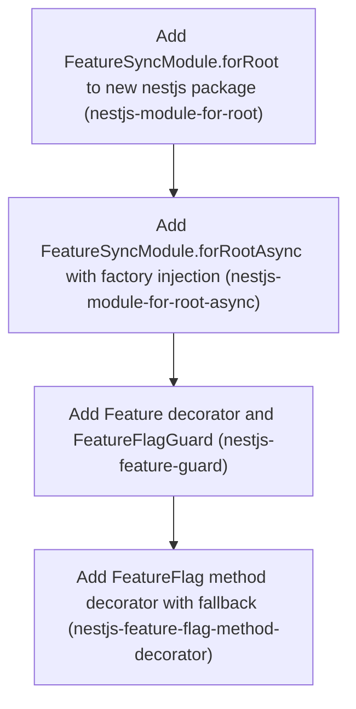

# Horizon 5 — NestJS module and flag decorators

## 🎯 What are we trying to achieve?

Ship `@featuresync/nestjs`: a NestJS module that gives any Nest app the FeatureSync in-memory flag client through dependency injection (Nest's system for handing objects to classes). The module checks that a valid snapshot is loaded before the app starts and closes the client when the app stops. Optional decorators gate a route (`@Feature` + `FeatureFlagGuard`) or a service method (`@FeatureFlag`) behind a flag. Done means `pnpm verify` passes with 100% coverage on the new package.

## 🧠 Why does this change need to happen?

The core runtime, the S3 reader/poller and the CLI publisher all exist, but a NestJS app today would have to wire `createFeatureFlags` by hand, handle startup failure itself and remember to close the client. The vision names a NestJS package as a first-class deliverable. The core client type is an interface with no runtime value, and this repo's test runner does not emit decorator metadata, so the integration needs deliberate design: injection by an explicit token.

## At a glance

- **Phases:** 4
- **Complexity:** Medium (new package + new framework deps; each phase small, gate healed nothing)
- **Main risk:** NestJS decorators under ESM/NodeNext + `verbatimModuleSyntax` + an esbuild test transform that emits no decorator metadata — mitigated by explicit `@Inject(TOKEN)` everywhere, proven in phase 1
- **Quality target:** `pnpm verify` green, 100% line/branch/function/statement coverage for `packages/nestjs/src`
- **Testing focus:** `@nestjs/testing` bootstrap/shutdown, `StartupError` propagation, DI token/isGlobal visibility, guard branches with mocked `ExecutionContext`, decorator lifecycle across sequential apps

## Order of work

1. **Add FeatureSyncModule.forRoot to new nestjs package** — starts immediately — creates the package
2. **Add FeatureSyncModule.forRootAsync with factory injection** — needs Add FeatureSyncModule.forRoot to new nestjs package
3. **Add @Feature decorator and FeatureFlagGuard** — needs Add FeatureSyncModule.forRootAsync with factory injection
4. **Add @FeatureFlag method decorator with fallback** — needs Add @Feature decorator and FeatureFlagGuard

### Phase 1 — Add FeatureSyncModule.forRoot to new nestjs package

Technical ID: `nestjs-module-for-root` · Nest integration: module registration · infrastructure · medium blast radius

**Goal** — Create packages/nestjs (@featuresync/nestjs) with a working FeatureSyncModule.forRoot(options) that builds one FeatureFlags client from core's createFeatureFlags, provides it under the FEATURE_FLAGS token with an @InjectFeatureFlags() helper, awaits ready() at startup and calls close() on application shutdown.

**Why** — Nest apps need the in-memory flag client from @featuresync/core available through dependency injection (Nest's system for handing objects to classes) and started and stopped with the app. Shipping the package with a real forRoot registration proves early that Nest decorators, ESM/NodeNext and the 100% coverage gate work together, so the package is useful from its first commit and is more than an empty scaffold.

**Changes**
- Create packages/nestjs following the packages/cli layout (type module, files [dist], build/typecheck scripts), with an exports map like core's, @featuresync/core as workspace:*, and @nestjs/common, @nestjs/core, reflect-metadata and rxjs as peer + dev dependencies, plus @nestjs/testing as a dev dependency
- Turn on experimentalDecorators and emitDecoratorMetadata in packages/nestjs/tsconfig.json only, and use explicit @Inject(FEATURE_FLAGS) everywhere so tests do not depend on decorator metadata
- Export a FEATURE_FLAGS token and an InjectFeatureFlags() helper that wraps @Inject(FEATURE_FLAGS)
- Add FeatureSyncModule.forRoot(options: FeatureFlagsOptions) returning a global-by-default dynamic module (isGlobal option) whose async provider calls createFeatureFlags and awaits ready(), so a missing snapshot with no fallback fails bootstrap with StartupError
- Call flags.close() from the module's onApplicationShutdown hook
- Add '&& pnpm --filter @featuresync/nestjs build' after the core build in the root verify script
- Leave test:integration unchanged: it runs only the @featuresync/aws LocalStack suite, which never loads @featuresync/nestjs
- Test with @nestjs/testing: injection through the token, isEnabled/get/evaluate matching core, StartupError on bootstrap, close() on app.close(), and isGlobal on and off; reach 100% coverage

**Files / areas**
- `packages/nestjs/package.json`
- `packages/nestjs/tsconfig.json`
- `packages/nestjs/tsconfig.build.json`
- `packages/nestjs/src/index.ts`
- `packages/nestjs/src/feature-sync.module.ts`
- `packages/nestjs/src/tokens.ts`
- `packages/nestjs/test/`
- `package.json`
- `pnpm-lock.yaml`

**How to verify**
- **Startup readiness and shutdown close** — A @nestjs/testing test compiles a module with a snapshot source that fails and has no fallback, and asserts that compile()/init() rejects with core's StartupError (checked with instanceof, not only the message text)
- **FEATURE_FLAGS token, InjectFeatureFlags and isGlobal** — FEATURE_FLAGS and InjectFeatureFlags are exported from packages/nestjs/src/index.ts
- **Package wiring, ESM build and verify gate** — package.json has type module, files [dist], an exports map shaped like core's, @featuresync/core as workspace:*, and @nestjs/common, @nestjs/core, reflect-metadata and rxjs listed in both peerDependencies and devDependencies
- **Behaviour matches core** — forRoot passes its FeatureFlagsOptions to createFeatureFlags unchanged, including the source, the fallback and any other fields

**Done when** — @featuresync/nestjs package whose FeatureSyncModule.forRoot provides a lifecycle-bound FeatureFlags client under FEATURE_FLAGS, passing pnpm verify at 100% coverage, and every check under *How to verify* passes its bar.

**Depends on** — nothing — can start immediately

**Rollback** — Delete packages/nestjs, revert the verify script line and the pnpm-lock.yaml changes.

Reference — full rubric

#### Startup readiness and shutdown close (`lifecycle-binding-correctness`, minScore 8)

The FeatureFlags client provider awaits ready() before the app finishes bootstrapping, and close() is called exactly once when the app shuts down. 10 = startup failure, shutdown and the timing of both are all proven by tests; 8 = competent and complete; minScore is the acceptable bar.

Pass criteria:
- A @nestjs/testing test compiles a module with a snapshot source that fails and has no fallback, and asserts that compile()/init() rejects with core's StartupError (checked with instanceof, not only the message text)
- A test spies on the client's close() and asserts it was called exactly once after app.close()
- A test asserts the injected client is already ready at injection time (for example, isEnabled returns the snapshot value right away without awaiting anything)
- The shutdown hook is onApplicationShutdown (or equivalent) and does not require the user to call enableShutdownHooks for app.close() to trigger it

Failure examples:
- The provider calls createFeatureFlags but does not await ready(), so bootstrap succeeds with a missing snapshot and the first isEnabled call returns defaults
- close() is called in onModuleDestroy and in onApplicationShutdown, so the client is closed twice
- The StartupError test only checks that the call rejects, so a TypeError from a bad import also passes

#### FEATURE_FLAGS token, InjectFeatureFlags and isGlobal (`di-token-and-global-scope`, minScore 8)

The client is provided under an exported FEATURE_FLAGS token and injected through @InjectFeatureFlags() without relying on emitted type metadata, and isGlobal really changes visibility. 10 = both isGlobal on and off, plus injection in a feature module, are tested; 8 = competent.

Pass criteria:
- FEATURE_FLAGS and InjectFeatureFlags are exported from packages/nestjs/src/index.ts
- A test provider in a separate feature module that does not import FeatureSyncModule receives the client when isGlobal is true (the default)
- A test shows that with isGlobal: false, resolving the client from a module that does not import FeatureSyncModule fails
- There is exactly one client instance: two consumers receive the same object (checked with toBe)
- No test or source file relies on the class type of a constructor parameter to inject the client

Failure examples:
- The token is a plain string 'FEATURE_FLAGS', which can clash with a user provider of the same name, instead of a Symbol or a unique constant
- isGlobal: false is accepted but ignored because global: true is hard-coded in the returned DynamicModule
- Only the default isGlobal case is tested

#### Package wiring, ESM build and verify gate (`package-build-and-verify-integration`, minScore 8)

packages/nestjs builds as ESM/NodeNext alongside the other packages, declares Nest as peer dependencies, and is part of root pnpm verify at 100% coverage without changing test:integration. 10 = a clean pnpm verify from a fresh install and a dist that can be imported; 8 = competent.

Pass criteria:
- package.json has type module, files [dist], an exports map shaped like core's, @featuresync/core as workspace:*, and @nestjs/common, @nestjs/core, reflect-metadata and rxjs listed in both peerDependencies and devDependencies
- experimentalDecorators and emitDecoratorMetadata are set only in packages/nestjs/tsconfig.json; the root/base tsconfig is unchanged
- The root verify script contains '&& pnpm --filter @featuresync/nestjs build' after the core build, and the test:integration script is unchanged
- pnpm verify passes with 100% coverage for packages/nestjs
- Importing the built dist/index.js from Node ESM works: relative imports use .js extensions

Failure examples:
- @nestjs/core is a regular dependency, so apps end up with two Nest copies and DI tokens that do not match
- The decorator flags are added to the shared base tsconfig and change how other packages compile
- Tests pass under vitest but dist fails to load because of an import without an extension

#### Behaviour matches core (`core-api-fidelity`, minScore 8)

The injected client is core's own FeatureFlags from createFeatureFlags(options) with options passed through unchanged, not a wrapper with different behaviour. 10 = isEnabled/get/evaluate results are compared against a core client built directly from the same snapshot; 8 = competent.

Pass criteria:
- forRoot passes its FeatureFlagsOptions to createFeatureFlags unchanged, including the source, the fallback and any other fields
- A test compares isEnabled, get and evaluate from the injected client with a core client built directly from the same fixture, including a targeted evaluation context
- The module does not re-implement evaluation and does not import core internals (imports only from '@featuresync/core')

Failure examples:
- forRoot picks out only the source and fallback, silently dropping other options such as an onError callback
- The module wraps the client in a class that changes get() to return null instead of undefined

Healer hint: Most likely failure is a provider that does not await ready() or that closes the client twice; make the async useFactory await flags.ready(), close it only in onApplicationShutdown, and add instanceof StartupError and a close-called-once assertion.

### Phase 2 — Add FeatureSyncModule.forRootAsync with factory injection

Technical ID: `nestjs-module-for-root-async` · Nest integration: module registration · infrastructure · small blast radius

**Goal** — Let users build the client options asynchronously from other Nest providers with forRootAsync({ imports, useFactory, inject, isGlobal }), for example to create an S3 SnapshotSource from ConfigService.

**Why** — Real apps usually read the bucket name or file path from configuration services that are only available through Nest DI, so options often cannot be written as a literal. An async factory lets users wire @featuresync/aws or any other SnapshotSource without the module depending on AWS.

**Changes**
- Add FeatureSyncModule.forRootAsync({ imports?, useFactory, inject?, isGlobal? }) that resolves the options through a FEATURE_SYNC_OPTIONS provider and reuses the forRoot client provider and lifecycle hook
- Export the FeatureSyncAsyncOptions type
- Test factory injection from another provider, an async factory, a factory that rejects, StartupError from ready(), and close() on shutdown, keeping 100% coverage

**Files / areas**
- `packages/nestjs/src/feature-sync.module.ts`
- `packages/nestjs/src/index.ts`
- `packages/nestjs/test/`

**How to verify**
- **useFactory with imports and inject** — A test registers a ConfigModule-like module in imports, lists its provider in inject, and asserts the factory received that exact provider instance
- **Reuses the forRoot client provider and lifecycle** — The source code has one function or provider definition that calls createFeatureFlags and awaits ready(), used by both forRoot and forRootAsync
- **Factory and readiness failures fail bootstrap** — A test with a factory that rejects with a specific Error asserts that init rejects with that same error object (toBe or matching the message and class)

**Done when** — FeatureSyncModule.forRootAsync that provides the same lifecycle-bound client from factory-built options, covered by @nestjs/testing tests, and every check under *How to verify* passes its bar.

**Depends on** — Add FeatureSyncModule.forRoot to new nestjs package

Reference — full rubric

#### useFactory with imports and inject (`factory-injection-resolution`, minScore 8)

forRootAsync resolves options through a FEATURE_SYNC_OPTIONS provider built from useFactory, with inject dependencies taken from the imports list, and supports both sync and async factories. 10 = injection from an imported module, async factory and no-inject cases are all tested; 8 = competent.

Pass criteria:
- A test registers a ConfigModule-like module in imports, lists its provider in inject, and asserts the factory received that exact provider instance
- A test with an async factory (returning a Promise) produces a working client
- A test without inject/imports works (the factory is called with no arguments)
- FeatureSyncAsyncOptions is exported from src/index.ts and types imports, useFactory, inject and isGlobal

Failure examples:
- The imports array is not forwarded into the DynamicModule, so inject tokens from another module fail to resolve
- The factory's return value is not awaited, so createFeatureFlags receives a Promise as its options

#### Reuses the forRoot client provider and lifecycle (`shared-client-provider-no-duplication`, minScore 8)

forRootAsync and forRoot share one client provider and one shutdown path, so their behaviour cannot drift apart. 10 = a single shared factory function whose parity is proven by tests; 8 = competent.

Pass criteria:
- The source code has one function or provider definition that calls createFeatureFlags and awaits ready(), used by both forRoot and forRootAsync
- forRoot is implemented through the options provider as well, or both call the same helper; no copied blocks
- A test shows the forRootAsync client is closed exactly once on app.close()
- isGlobal behaves the same as in forRoot (tested for false)

Failure examples:
- forRootAsync copies the forRoot factory but leaves out await ready(), so a startup failure no longer blocks bootstrap on the async path
- The forRootAsync module does not register the shutdown hook, so the S3 polling timer keeps the process alive

#### Factory and readiness failures fail bootstrap (`async-failure-propagation`, minScore 8)

A factory that rejects and a ready() that throws StartupError both make app init reject with the original error and leave no running client behind. 10 = both are tested and the original error identity is kept; 8 = competent.

Pass criteria:
- A test with a factory that rejects with a specific Error asserts that init rejects with that same error object (toBe or matching the message and class)
- A test with a failing snapshot source asserts that init rejects with StartupError
- No test leaves an open handle or timer after a failed bootstrap (vitest finishes without hanging or leak warnings)

Failure examples:
- The factory error is caught and wrapped in a generic Error, so the user loses the original ConfigService message
- A factory rejection is logged and swallowed, the client provider receives undefined options and fails later with a TypeError

Healer hint: Most likely failure is the async path duplicating the forRoot provider and losing await ready() or imports forwarding; route both registrations through one shared client-provider helper that injects FEATURE_SYNC_OPTIONS.

### Phase 3 — Add @Feature decorator and FeatureFlagGuard

Technical ID: `nestjs-feature-guard` · Nest integration: route gating · interface · small blast radius

**Goal** — Let controllers gate routes with @Feature('key') plus FeatureFlagGuard, which allows a request when the flag is enabled and otherwise throws a configurable exception (NotFoundException by default).

**Why** — Hiding a whole HTTP endpoint behind a flag is the most common way flags are used in a Nest app. A guard (Nest's hook that decides whether a request may reach a handler) does this declaratively and keeps the plain flags.isEnabled API unchanged.

**Changes**
- Add @Feature(key) that sets route metadata with SetMetadata on a handler or controller
- Add FeatureFlagGuard implementing CanActivate: read the key through Reflector, allow when there is no metadata, evaluate isEnabled(key, contextFrom?.(executionContext)), and throw the configured exception when the flag is off or unknown
- Add optional contextFrom and guard exception factory options to forRoot/forRootAsync and provide them to the guard
- Test the guard by calling canActivate with a mocked ExecutionContext and Reflector for the enabled, disabled, unknown key, no metadata, custom exception and context extractor branches, plus one @nestjs/testing module test that resolves the guard through DI; 100% coverage

**Files / areas**
- `packages/nestjs/src/feature.decorator.ts`
- `packages/nestjs/src/feature-flag.guard.ts`
- `packages/nestjs/src/feature-sync.module.ts`
- `packages/nestjs/src/index.ts`
- `packages/nestjs/test/`

**How to verify**
- **Guard allows and denies correctly** — Tests call canActivate with a mocked ExecutionContext for: flag enabled returns true; flag disabled throws NotFoundException; unknown key throws NotFoundException; no metadata returns true
- **Exception factory and context extractor options** — A test with a custom exception factory asserts the thrown error is the factory's result and that the factory received the flag key
- **Guard resolves through Nest DI** — A @nestjs/testing test resolves FeatureFlagGuard from a module that imports FeatureSyncModule.forRoot and gets a working instance

**Done when** — Exported @Feature decorator and FeatureFlagGuard that reject requests for disabled or unknown flags, covered by tests, and every check under *How to verify* passes its bar.

**Depends on** — Add FeatureSyncModule.forRootAsync with factory injection

Reference — full rubric

#### Guard allows and denies correctly (`guard-decision-branches`, minScore 8)

FeatureFlagGuard allows requests when there is no @Feature metadata or the flag is enabled, and throws the configured exception when the flag is off or unknown. It reads handler metadata before controller metadata. 10 = every branch, including handler-overrides-class, is tested; 8 = competent.

Pass criteria:
- Tests call canActivate with a mocked ExecutionContext for: flag enabled returns true; flag disabled throws NotFoundException; unknown key throws NotFoundException; no metadata returns true
- Metadata is read with reflector.getAllAndOverride (or equivalent) over [context.getHandler(), context.getClass()], and a test shows @Feature on a controller class gates its methods
- The guard never returns false for a disabled flag; it throws, so Nest's default 403 cannot replace the configured exception

Failure examples:
- The guard only checks context.getHandler(), so @Feature on a controller class is ignored
- The guard returns false for a disabled flag, which gives 403 Forbidden instead of the documented 404
- An unknown key is treated as allowed because isEnabled's default is not considered

#### Exception factory and context extractor options (`configurable-exception-and-context`, minScore 8)

The optional guard exception factory and contextFrom extractor from forRoot/forRootAsync reach the guard through DI and are used as documented. 10 = both are tested through a real module and through unit tests; 8 = competent.

Pass criteria:
- A test with a custom exception factory asserts the thrown error is the factory's result and that the factory received the flag key
- A test with contextFrom asserts that isEnabled was called with (key, the object contextFrom returned for that ExecutionContext)
- Without contextFrom, isEnabled is called with the key and undefined context (no crash)
- The options are accepted by both forRoot and forRootAsync and have exported types

Failure examples:
- contextFrom is only wired through forRoot, so forRootAsync users cannot target by request
- The guard reads options from a module-level variable instead of DI, so two test modules leak options into each other

#### Guard resolves through Nest DI (`guard-di-resolution`, minScore 8)

FeatureFlagGuard can be used with @UseGuards(FeatureFlagGuard) or APP_GUARD in an app that imports FeatureSyncModule, with its Reflector, client and options injected through explicit tokens. 10 = a @nestjs/testing module resolves it and a real route is gated; 8 = competent.

Pass criteria:
- A @nestjs/testing test resolves FeatureFlagGuard from a module that imports FeatureSyncModule.forRoot and gets a working instance
- The guard's constructor uses @Inject(FEATURE_FLAGS) / explicit tokens for the client and options, not type metadata only
- @Feature and FeatureFlagGuard are exported from src/index.ts; coverage stays at 100%

Failure examples:
- The guard is not exported or provided by the module, so @UseGuards(FeatureFlagGuard) fails with 'Nest can't resolve dependencies' in a feature module
- The options token is marked @Optional() incorrectly, so the guard silently runs with no exception factory even when one was configured

Healer hint: Most likely failure is reading metadata only from the handler or returning false instead of throwing; use reflector.getAllAndOverride over handler and class, and always throw the configured exception, defaulting to NotFoundException.

### Phase 4 — Add @FeatureFlag method decorator with fallback

Technical ID: `nestjs-feature-flag-method-decorator` · Nest integration: method gating · interface · small blast radius

**Goal** — Let any provider method run only when a flag is on: @FeatureFlag(key, { fallback? }) wraps the method so that when the flag is off it returns undefined or calls the fallback, for both sync and async methods.

**Why** — Some flag checks sit inside services rather than at the route level. A method decorator removes repeated if-statements while staying optional. The on/off semantics must be stated clearly because users may otherwise expect an exception.

**Changes**
- Add @FeatureFlag(key, options?) that wraps the method descriptor and reads the client from a module-held reference set during module init
- Skip the method and return undefined (or the fallback's result) when the flag is off; throw a clear error if the decorated method runs before the module has initialised
- The decorator always uses the most recently initialised client; clear the reference on application shutdown, and test two apps started one after the other plus a call after shutdown
- Write packages/nestjs/README.md covering forRoot, forRootAsync, injection, the guard and the method decorator
- Record the skip-versus-throw choice as a decision; test on, off, fallback, async method and uninitialised branches at 100% coverage

**Files / areas**
- `packages/nestjs/src/feature-flag.decorator.ts`
- `packages/nestjs/src/feature-sync.module.ts`
- `packages/nestjs/src/index.ts`
- `packages/nestjs/test/`
- `packages/nestjs/README.md`

**How to verify**
- **On/off/fallback for sync and async methods** — Tests cover flag on (the original runs, its return value passes through, this is the provider instance), flag off without fallback (returns undefined, original not called), and flag off with fallback (fallback result returned, called with the same arguments)
- **Module-held client reference is safe** — Calling a decorated method before any module init throws an Error whose message names FeatureSyncModule and says it has not been initialised
- **README and decision record** — The README has a section for each of forRoot, forRootAsync (with a ConfigService example), @InjectFeatureFlags, @Feature + FeatureFlagGuard, and @FeatureFlag

**Done when** — Exported @FeatureFlag method decorator with documented skip/fallback behaviour, plus packages/nestjs/README.md, and every check under *How to verify* passes its bar.

**Depends on** — Add @Feature decorator and FeatureFlagGuard

Reference — full rubric

#### On/off/fallback for sync and async methods (`skip-and-fallback-semantics`, minScore 8)

@FeatureFlag runs the original method with the same this and arguments when the flag is on, and otherwise returns undefined or the fallback's result, keeping sync and async return shapes. 10 = all combinations are tested, including this binding and fallback arguments; 8 = competent.

Pass criteria:
- Tests cover flag on (the original runs, its return value passes through, this is the provider instance), flag off without fallback (returns undefined, original not called), and flag off with fallback (fallback result returned, called with the same arguments)
- For an async method with the flag off, the result is still awaitable (a Promise resolving to undefined or the fallback value), and a test awaits it
- The wrapper keeps the method's name and does not break other method decorators applied to it

Failure examples:
- The wrapper calls original(...args) without .apply(this, args), so provider methods that use this.repo crash
- A sync-off return of undefined for an async method means callers doing result.then(...) crash
- The fallback is called without the original arguments

#### Module-held client reference is safe (`client-reference-lifecycle`, minScore 8)

The decorator reads the client from a module-held reference set on module init and cleared on shutdown; a call before init or after shutdown throws a clear error, and the newest app wins. 10 = the sequential two-app and after-shutdown cases are tested; 8 = competent.

Pass criteria:
- Calling a decorated method before any module init throws an Error whose message names FeatureSyncModule and says it has not been initialised
- A test starts app A, closes it, starts app B with a different snapshot, and asserts the decorator uses B's flag values
- After app.close(), calling a decorated method throws the same clear error, not a stale-client result
- The reference is set in a lifecycle hook (onModuleInit or the provider factory), not at import time

Failure examples:
- The reference is not cleared on shutdown, so after app.close() the decorator keeps evaluating against a closed client
- Closing app A clears the reference even though app B is running, breaking B

#### README and decision record (`documented-contract`, minScore 8)

packages/nestjs/README.md documents forRoot, forRootAsync, injection, the guard and the method decorator with runnable snippets, and the skip-versus-throw choice is written down as a decision. 10 = snippets match the exported API exactly and the single-client limitation is stated; 8 = competent.

Pass criteria:
- The README has a section for each of forRoot, forRootAsync (with a ConfigService example), @InjectFeatureFlags, @Feature + FeatureFlagGuard, and @FeatureFlag
- The @FeatureFlag section states that a disabled flag skips the method and returns undefined or the fallback result, rather than throwing
- The README states that the decorator uses the most recently initialised client
- A decision entry (in the repo's decisions/discoveries docs) records skip vs throw and the reason
- Every identifier in the README snippets exists in src/index.ts exports

Failure examples:
- The README example uses FeatureSyncModule.register(), which does not exist
- The skip-vs-throw behaviour is only in a code comment, so users expect an exception

Healer hint: Most likely failure is losing this binding or keeping a stale client after shutdown; wrap with original.apply(this, args), and set and clear the module-held reference in onModuleInit/onApplicationShutdown, only clearing it if it still points to this module's client.

## Discovery Findings

| Area | Finding | File | Implication |
|---|---|---|---|
| core public API | packages/core/src/index.ts exports createFeatureFlags, FeatureFlags, FeatureFlagsOptions, FlagEvaluation, FlagReason, SnapshotFeatures, StartupError, Logger, SnapshotSource, Unsubscribe, ConfigurationError, createFeatureFlagsFromEnv, FeatureFlagsFromEnvOptions, createFileSnapshotSource, SnapshotFileError, defineFeature, ConfigOf, ContextOf, FeatureDefinition, parseSnapshot and domain types. | `packages/core/src/index.ts` | @featuresync/nestjs imports only from '@featuresync/core'; no core changes needed except possibly the Definitions alias. |
| createFeatureFlags signature | createFeatureFlags<const Defs extends Definitions = []>(options: FeatureFlagsOptions<Defs>): FeatureFlags<Defs> is synchronous and starts loading immediately. FeatureFlagsOptions = { source; definitions?; logger? } & ({ allowStaleStartup?: false } | { allowStaleStartup: true; fallbackSnapshot: unknown }). Definitions = readonly FeatureDefinition[] is not exported. | `packages/core/src/application/flag-client.ts` | forRoot options must be FeatureFlagsOptions<Defs> or wrap it (discriminated union, no interface extends); use readonly FeatureDefinition[] in generics; factory calls createFeatureFlags then awaits ready() in an async provider or lifecycle hook. |
| FeatureFlags interface and lifecycle | FeatureFlags is an interface: isEnabled(key, context?), get, evaluate, version(), has, getAll, ready(): Promise<void> (rejects StartupError), refresh(): Promise<boolean>, close(): void (sync). | `packages/core/src/application/flag-client.ts` | Use a FEATURE_FLAGS token + @InjectFeatureFlags(); close() from onApplicationShutdown/onModuleDestroy; startup failure surfaces as StartupError from ready(). |
| env-based factory | createFeatureFlagsFromEnv(options?: { definitions?, logger?, watch?, env? }) reads FEATURESYNC_FILE, throws ConfigurationError synchronously when missing, builds a file source. | `packages/core/src/infrastructure/config-from-env.ts` | An env-style forRoot form can delegate to it; ConfigurationError (sync) vs StartupError (ready) both need tests. |
| TypeScript base config | tsconfig.base.json: NodeNext, ES2022, strict, noUncheckedIndexedAccess, exactOptionalPropertyTypes, verbatimModuleSyntax, isolatedModules; no experimentalDecorators/emitDecoratorMetadata. | `tsconfig.base.json` | packages/nestjs/tsconfig.json enables decorators locally; use explicit @Inject(TOKEN) everywhere; .js relative imports. |
| Vitest transform and decorators | Root vitest.config.ts auto-creates one project per packages/* (excludes integration/**), default esbuild transform (no decorator metadata), v8 coverage over packages/*/src/**/*.ts at 100% all metrics. | `vitest.config.ts` | nestjs is gated at 100% as soon as its package.json exists; tests must not rely on design:paramtypes — explicit @Inject or add unplugin-swc (a decision). |
| ESLint layer zones | eslint.config.js: strictTypeChecked + import-x/no-restricted-paths zones on packages/*/src (domain !-> application/infrastructure, application !-> infrastructure), --max-warnings=0. | `eslint.config.js` | Choose a layout inside the zones; plan targeted handling of rules like no-extraneous-class for the Nest module class. |
| Root scripts | verify = build core, aws, cli, then pnpm -r typecheck, eslint . --max-warnings=0, vitest run --coverage. test:integration and example:node-local hardcode filter builds. | `package.json` | Add '&& pnpm --filter @featuresync/nestjs build' to verify after core; add build/typecheck scripts matching other packages. |
| Package template | packages/cli: type module, files ['dist'], build 'tsc -p tsconfig.build.json', typecheck 'tsc -p tsconfig.json --noEmit', workspace:* deps, optional SDK as peer+dev dep; tsconfig.json extends base, include [src,test]; tsconfig.build.json rootDir src outDir dist excludes tests. core adds an exports map. Apache-2.0, 0.0.0. | `packages/cli/package.json` | Copy this shape for packages/nestjs with a core-style exports map; @nestjs/common, @nestjs/core, reflect-metadata, rxjs as peer+dev deps, @nestjs/testing dev. |
| Dependencies | No @nestjs/*, reflect-metadata or swc installed anywhere. | `package.json` | First phase adds deps and commits pnpm-lock.yaml (CI uses --frozen-lockfile); check Nest peer ranges vs TS ^6 / Node 22. |
| Workspace | pnpm-workspace.yaml includes packages/* and examples/*; examples/node-local runs in CI via pnpm example:node-local. | `pnpm-workspace.yaml` | packages/nestjs picked up automatically; an optional examples/nestjs would follow node-local. |
| CI | verify job: pnpm install --frozen-lockfile, pnpm verify, pnpm example:node-local; separate localstack job runs test:integration. | `.github/workflows/ci.yml` | Nest tests run in pnpm verify; no new CI job needed. |
| Core package layout | core uses src/domain, src/application, src/infrastructure with tests in test/, plus README.md. | `packages/core` | Mirror: test/ dir, README, layout consistent with eslint zones. |

## Out of Scope

- SNS/SQS push change notifications: the user chose the NestJS module this horizon, and polling remains the change-detection mechanism per the horizon 2 decision.
- CLI pull and snapshot pinning for CI: explicitly not chosen by the user this horizon.
- IaC (S3 bucket, SNS, IAM, Lambda provisioning): explicitly not chosen by the user and still blocked on IAM verification questions.
- Changes to @featuresync/core's evaluation semantics, SnapshotSource port or public API: this package only consumes core, and core's small public surface is intentional.
- Building S3 client configuration or AWS credentials handling inside the Nest module: the S3 source already exists in @featuresync/aws and is wired by the user's factory.
- Dashboard/UI and a Nest HTTP admin endpoint exposing flags: belongs to the later UI horizon and would add an attack surface.
- Non-HTTP transports (GraphQL resolvers, microservices, WebSocket guards) beyond keeping the guard transport-agnostic when no context extractor is given: HTTP controllers are the documented use case.
- Publishing to npm and release automation: packaging and release are not part of this horizon's quality bar.
- Per-request context propagation (AsyncLocalStorage/CLS): callers pass context explicitly, which keeps the plain API simple as notes.md section 7 requires.
- forRoot({ environment }) form delegating to createFeatureFlagsFromEnv: fails the need gate (no consumer yet; users can pass createFileSnapshotSource or build options in forRootAsync)
- examples/nestjs sample app wired into CI: fails the timing gate (the @nestjs/testing module tests already prove behaviour; add it when docs/examples are next planned)
- unplugin-swc Vitest transform for decorator metadata: fails the need gate (explicit @Inject tokens avoid needing design:paramtypes)
- Per-request context propagation (AsyncLocalStorage/CLS) and non-HTTP transport guards: fail the scope gate (out of scope per analysis)
- npm publishing/release automation for @featuresync/nestjs: fails the scope gate (not part of this horizon)

## Success Criteria

- packages/nestjs exists, builds via tsconfig.build.json and is included in root verify (build order core -> nestjs). pnpm verify passes: typecheck, eslint layer zones with --max-warnings=0, and 100% line/branch/function/statement coverage over packages/nestjs/src. A Nest test app that imports FeatureSyncModule.forRoot({ source }) or forRootAsync({ useFactory, inject }) can inject the client through an exported token or a @InjectFeatureFlags() helper. Bootstrap awaits flags.ready(), so startup fails with StartupError when there is no valid snapshot and no fallback, and flags.close() runs on application shutdown. isEnabled/get/evaluate behave exactly like core with zero network I/O per call. FeatureFlagGuard allows a request when the @Feature key is enabled and rejects it with a configurable exception (default NotFoundException) when the key is off or unknown. @FeatureFlag(key) on a method skips the method (or runs an optional fallback) when the flag is off. Decorators stay optional and the plain flags.isEnabled API is unchanged. Each of these behaviours is covered by unit tests plus a @nestjs/testing module test.
- Add FeatureSyncModule.forRoot to new nestjs package: @featuresync/nestjs package whose FeatureSyncModule.forRoot provides a lifecycle-bound FeatureFlags client under FEATURE_FLAGS, passing pnpm verify at 100% coverage
- Add FeatureSyncModule.forRootAsync with factory injection: FeatureSyncModule.forRootAsync that provides the same lifecycle-bound client from factory-built options, covered by @nestjs/testing tests
- Add @Feature decorator and FeatureFlagGuard: Exported @Feature decorator and FeatureFlagGuard that reject requests for disabled or unknown flags, covered by tests
- Add @FeatureFlag method decorator with fallback: Exported @FeatureFlag method decorator with documented skip/fallback behaviour, plus packages/nestjs/README.md

## Alignment Preview

The preview critique raised 3 concerns: the shared client reference used by `@FeatureFlag`, the `test:integration` build step, and the unclear guard-test approach. The user accepted the plan with all three fixes, and they were applied to phases 4, 1 and 3 before the rubrics were written. There were no redirect rounds.

## Quality Gate

Path: full. One critic pass: `pass: true`, 0 blockers raised (so the evidence screen and the verification call did not run), 0 major, 10 minor. Nothing was healed. The minor issues are accepted debt:

- **phase-blast-radius (7)** — Phase 4 ships the README and the decision record alongside the decorator. Accepted: the README is package-wide documentation, not a second code module.
- **valid-dependencies (8)** — Phase 4 depends on the guard phase only because the README documents the guard; the decorator itself could be built independently.
- **testable-rubrics (8)** — A phase 1 failure example mentions an `onError` option that core does not have. **Executor: read it as 'silently dropping `definitions` or `logger`'.**
- **grounded-in-discovery (8)** — No phase explicitly plans how the static-only `FeatureSyncModule` class passes `strictTypeChecked`'s `no-extraneous-class` rule. **Executor: handle it in phase 1** (e.g. `allowWithDecorator`).
- **success-coverage (9)** — 'Zero network I/O per call' is covered only indirectly by the core-parity check. Optional extra: spy on `source.load` after `ready()`.
- **phase-measurable-result (9), ddd-boundaries (8), domain-shape-fit (9), yagni-scope (9), resources-gathered (8)** — Passed and scored as minor; no action.

Verdict: **passed**.

## Cost

Agent calls: 6 — analysis, repo scan (Discovery), phase breakdown, preview critique, rubrics, critic. That is under the 8–10 budget for this path: the next-horizon brief was skipped (nothing was cut for size), and there were no patch, verification or healer calls.

## Full analysis

**domainShape:** technical — The work is framework integration machinery (DI providers, lifecycle hooks, decorators and guards) that wraps the existing flag domain without adding new business rules.

| Term | Meaning |
|---|---|
| FeatureSyncModule | The Nest dynamic module (forRoot/forRootAsync) that creates and provides one FeatureFlags client and ties it to the Nest lifecycle. |
| FeatureFlags client | The in-memory flag client from core's createFeatureFlags, exposing isEnabled/get/evaluate/ready/close with no per-call network I/O. |
| SnapshotSource | Core's port ({load, subscribe?}) that the module is configured with, for example the file source or the S3 source. |
| FEATURE_FLAGS token | The DI injection token (with the @InjectFeatureFlags() helper) under which the client is provided, needed because FeatureFlags is an interface. |
| lifecycle binding | Awaiting ready() during module init so startup fails fast, and calling close() on application shutdown. |
| @FeatureFlag | Optional method decorator that runs the decorated method only when the named flag is enabled, otherwise skips it or calls a fallback. |
| @Feature + FeatureFlagGuard | Optional route metadata decorator plus a CanActivate guard that rejects requests when the named flag is off. |
| context extractor | Optional module option mapping a Nest ExecutionContext to the targeting context passed to flag evaluation in the guard. |

**Assumptions**
- The module gets a ready-made SnapshotSource, or options passed straight to core's createFeatureFlags (source, definitions, fallback, logger). It does not construct S3 clients itself, so @featuresync/aws stays an optional peer the user wires in their factory. The notes.md shape forRoot({ environment }) is supported only by passing through to core's createFeatureFlagsFromEnv.
- FeatureFlags is a TypeScript interface, not a class, so injection uses an exported token (FEATURE_FLAGS) plus an @InjectFeatureFlags() helper. The bare constructor(private flags: FeatureFlags) form from notes.md cannot work as written.
- @nestjs/common, @nestjs/core, reflect-metadata and rxjs are peerDependencies (plus devDependencies) of @featuresync/nestjs and never direct dependencies, matching how @aws-sdk/client-s3 is handled. @featuresync/core is a workspace:* dependency.
- The package tsconfig turns on experimentalDecorators and emitDecoratorMetadata locally, because Nest DI needs legacy decorators and tsconfig.base.json does not enable them.
- The module is global by default (isGlobal option), and one client instance exists per module registration.
- Context for FeatureFlagGuard evaluation comes from an optional contextFrom(executionContext) option. With no option, isEnabled(key) is evaluated with no context.
- @FeatureFlag is a method decorator that wraps the method: the method runs when the flag is on, and when it is off the call returns undefined or calls an optional fallback. The client is resolved from a module-held reference set at init, not through a per-call lookup.
- The package follows the existing layout: src/domain, src/application and src/infrastructure only where they are needed, with the eslint zones already applied to packages/*/src. The root vitest.config.ts picks it up automatically as a coverage project.

**Risks**
- NestJS with ESM/NodeNext and verbatimModuleSyntax can break decorator metadata emit or DI type imports (import type erases constructor param types). This must be proven with a real @nestjs/testing bootstrap early.
- Current NestJS and rxjs versions may not type-check cleanly under TS 6 with exactOptionalPropertyTypes and strictTypeChecked eslint. Peer version ranges must be verified against the installed versions.
- Reaching 100% branch coverage on decorator and guard branches (HTTP vs non-HTTP contexts, missing metadata, fallback vs no fallback) requires deliberate tests. Vitest's esbuild transform does not emit decorator metadata, so tests may need explicit @Inject tokens or an SWC transform.
- Method-decorator semantics are ambiguous: sync vs async methods, and whether the method is skipped or throws when the flag is off. Picking the wrong default could surprise users. The choice must be recorded as a decision.
- Calling await ready() in onModuleInit or an async provider blocks app startup when the source is slow. Timeouts and fallback behaviour depend on core's existing StartupError/fallback semantics, which the module must not re-implement.
- The task text's constructor(private flags: FeatureFlags) and forRoot({ environment }) from notes.md conflict with core's interface-only type and SnapshotSource port (a binding decision). The notes are adapted to a token-based API rather than changing core.
- Discovery: CI runs verify without prior builds. Root verify and test:integration scripts must add a nestjs build step, or its runtime import of core may fail to resolve.
