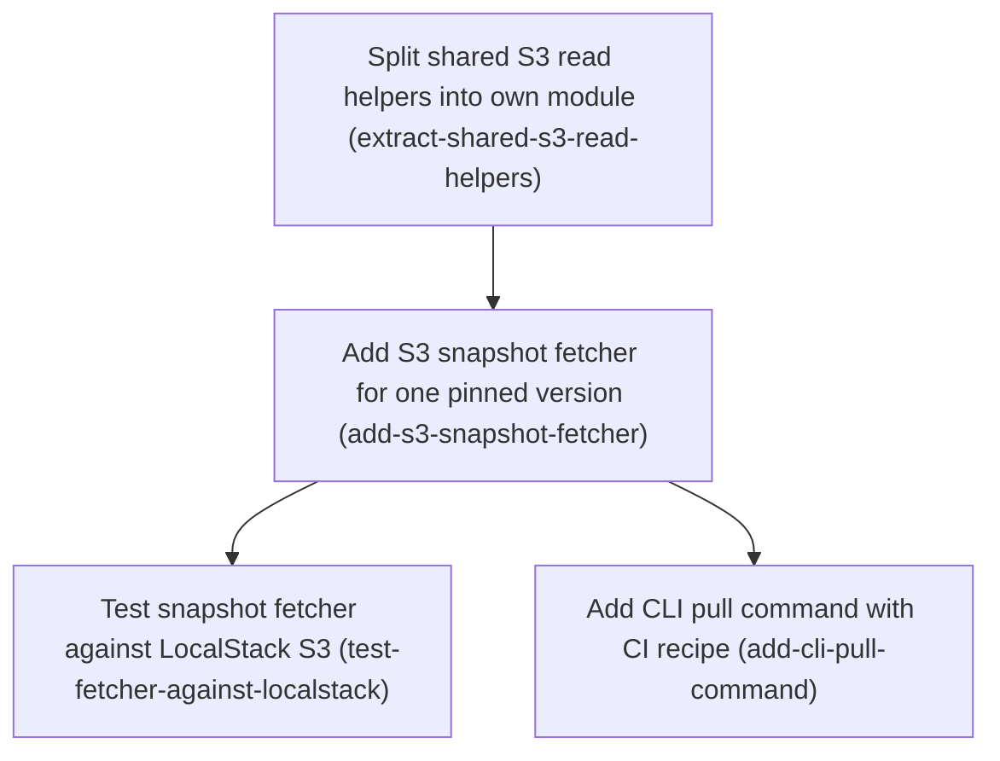

# Horizon 6 — Pull a pinned snapshot for reproducible CI

## 🎯 What are we trying to achieve?

Add a `featuresync pull` command that downloads one exact, immutable snapshot version from S3 to a local file. CI then points `FEATURESYNC_FILE` at that file, so every run evaluates flags against the same bytes, even after someone publishes a newer version. The command refuses to run without an explicit version, validates what it downloads, and never leaves a half-written file.

## 🧠 Why does this change need to happen?

Apps can already read the *live* snapshot from S3, but a test pipeline that follows the live version sees flags change under it between runs. The vision promises "reproducible CI via pinned snapshots", and nothing in the repo downloads a specific older version today. The S3 read logic that would do it is locked inside the live reader as private helpers.

## At a glance

- **Phases:** 4
- **Complexity:** Low–Medium: four small or medium phases, extending existing code; the gate needed no fixes
- **Main risk:** an S3 403 (permission denied) being reported as "version not found", which would misdiagnose CI credential failures. The fetcher reports it separately.
- **Quality target:** 100% coverage, zero ESLint warnings, and a LocalStack (local AWS emulator) proof in the existing CI job
- **Testing focus:** byte-for-byte equality with what was published, a distinct error reason per failure, no partial files on disk, and the file loading through `FEATURESYNC_FILE`

## Order of work

1. **Split shared S3 read helpers into own module**: starts first because it is a behaviour-preserving refactor the fetcher builds on
2. **Add S3 snapshot fetcher for one pinned version**: comes after 1 because it reuses the extracted helpers
3. **Test snapshot fetcher against LocalStack S3**: comes after 2 because it proves the fetcher against real S3 behaviour
4. **Add CLI pull command with CI recipe**: comes after 2 because it calls the fetcher; it does not wait for 3

### Phase 1 — Split shared S3 read helpers into own module

Technical ID: `extract-shared-s3-read-helpers` · Snapshot Distribution (@featuresync/aws) · infrastructure · small blast radius

**Goal.** Move the private helper that reads an S3 object as text, and the helper that decides whether an S3 error means 'object missing', out of the S3 Snapshot Source into a shared infrastructure module that the new snapshot fetcher can import. Behaviour stays the same.

**Why.** The S3 Snapshot Source already knows how to fetch an object's text and how to classify S3 errors, but those helpers are hidden inside its factory function. The new fetcher needs the same logic, and copying it would let the two readers drift apart. This is a behaviour-preserving refactor, so it can be reviewed on its own.

**Changes**
- Create packages/aws/src/infrastructure/s3-read.ts that exports readObjectText(client, bucket, key) (GetObject plus Body.transformToString) and isMissing(error) (NoSuchKey/404 and AccessDenied/403, exactly as today).
- Change s3-snapshot-source.ts to import these helpers and delete its private copies. Do not change its error reasons or public API.
- Add unit tests for s3-read.ts, using the existing fake-s3.ts, that keep 100% coverage.
- Do not export the new module from packages/aws/src/index.ts, because it is internal.

**Files / areas**
- `packages/aws/src/infrastructure/s3-read.ts`
- `packages/aws/src/infrastructure/s3-snapshot-source.ts`
- `packages/aws/test/infrastructure/s3-read.test.ts`

**How to verify**
- **S3 Snapshot Source behaviour unchanged**: `git diff` shows no changes under packages/aws/test/infrastructure/s3-snapshot-source*.test.ts
- **One helper copy, used by the source**: `grep -rn "transformToString\|NoSuchKey" packages/aws/src` finds matches only in s3-read.ts
- **Helper module stays internal**: packages/aws/src/index.ts does not mention s3-read
- **Direct tests for s3-read.ts**: s3-read.test.ts has cases for NoSuchKey, a 404 status, AccessDenied, a 403 status, an unrelated error returning false, and a successful text read

**Done when.** packages/aws/src/infrastructure/s3-read.ts exists and is used by s3-snapshot-source.ts, with the existing S3 Snapshot Source tests still passing unchanged at 100% coverage., and every check under *How to verify* passes its bar.

**Depends on.** nothing — can start immediately

Reference — full rubric

| Dimension | Rule | Pass criteria | Failure examples | Min |
|---|---|---|---|---|
| behaviour-preserved | s3-snapshot-source.ts behaves exactly as before the refactor: same error reasons, same public API, and its existing tests are untouched. | `git diff` shows no changes under packages/aws/test/infrastructure/s3-snapshot-source*.test.ts The existing S3 Snapshot Source tests pass without edits s3-snapshot-source.ts still maps the same errors to the same reason strings (compare the reason literals in the diff before and after) The export list of packages/aws/src/index.ts is unchanged | isMissing is moved but now treats only NoSuchKey as missing and drops the AccessDenied/403 branch, so a 403 now gives a different source reason The source test file was edited so that a changed assertion passes | 9 |
| single-copy-no-drift | readObjectText and isMissing exist only in s3-read.ts, and s3-snapshot-source.ts imports them from there. | `grep -rn "transformToString\\|NoSuchKey" packages/aws/src` finds matches only in s3-read.ts s3-snapshot-source.ts has an import from './s3-read' (or './s3-read.js') There is no leftover private readObjectText or isMissing function in s3-snapshot-source.ts | s3-read.ts is added, but s3-snapshot-source.ts keeps its own private isMissing, so there are two copies that can drift apart | 9 |
| internal-not-public | s3-read.ts is an infrastructure-internal module. It is not exported from the package entry point and does not import from the CLI or core. | packages/aws/src/index.ts does not mention s3-read s3-read.ts imports only @aws-sdk/client-s3 types and local modules ESLint layer rules report zero warnings for packages/aws | A developer adds `export * from './infrastructure/s3-read'` to index.ts "for the fetcher", which widens the public API | 9 |
| helper-unit-coverage | s3-read.test.ts exercises each helper branch directly with fake-s3.ts, and the package stays at 100% coverage. | s3-read.test.ts has cases for NoSuchKey, a 404 status, AccessDenied, a 403 status, an unrelated error returning false, and a successful text read The coverage report shows s3-read.ts at 100% for lines, branches and functions The test uses fake-s3.ts, not a new ad-hoc mock | Coverage reaches 100% only indirectly through the source tests, and s3-read.test.ts checks just the happy path, so the 403 branch has no direct assertion | 8 |

**Healer hint:** Most likely, a branch of isMissing (403 or AccessDenied) is subtly changed or left untested during the move. Fix it by copying the original predicate verbatim and adding one direct test for each error shape in s3-read.test.ts.

### Phase 2 — Add S3 snapshot fetcher for one pinned version

Technical ID: `add-s3-snapshot-fetcher` · Snapshot Distribution (@featuresync/aws) · infrastructure · medium blast radius

**Goal.** Add createS3SnapshotFetcher({bucket, client?}) to @featuresync/aws. Its fetch(environment, version) downloads the immutable Snapshot object for exactly that Snapshot Version from the S3 Layout and returns {environment, version, key, text}, with the raw bytes unvalidated.

**Why.** CI needs to download one specific, immutable Snapshot (a Pinned Snapshot) instead of whatever the Current Pointer names today, so every run loads the same bytes. All S3 logic belongs in @featuresync/aws next to the layout contract, and the CLI stays thin. Following the project decision, the fetcher does not validate the Snapshot. It returns raw text for core to check.

**Changes**
- Validate environment with environmentSchema and version with versionSchema from domain/current-pointer.ts. Reject bad input with S3FetchError reason INVALID_ENVIRONMENT or INVALID_VERSION before any S3 call.
- Build the key with the existing snapshotKeyFor(env, version) (`<env>/snapshots/<version>.json`) and read it with readObjectText from s3-read.ts.
- Map errors to S3FetchError reasons: SNAPSHOT_NOT_FOUND for NoSuchKey/404, ACCESS_DENIED for AccessDenied/403 (reported separately so credential problems are not misreported as a missing version), EMPTY_SNAPSHOT for an empty body, and REQUEST_FAILED otherwise.
- Export createS3SnapshotFetcher, S3SnapshotFetcherOptions, FetchedSnapshot, S3FetchError and S3FetchErrorReason from packages/aws/src/index.ts.
- Add unit tests with fake-s3.ts that cover every branch to 100%.

**Files / areas**
- `packages/aws/src/infrastructure/s3-snapshot-fetcher.ts`
- `packages/aws/src/index.ts`
- `packages/aws/test/infrastructure/s3-snapshot-fetcher.test.ts`

**How to verify**
- **Input rejected before any S3 call**: Tests pass a bad environment (such as '../x') and a bad version (such as 0, -1 or 'abc'), expect the matching reason, and assert that the fake client's send was called 0 times
- **Pinned key, never the Current Pointer**: The source calls snapshotKeyFor and has no hand-built '/snapshots/' string template
- **Distinct S3FetchError reasons**: There is one test for each reason: NoSuchKey or 404, AccessDenied or 403, an empty-string body, and a generic network error
- **Layer direction and exports**: index.ts exports createS3SnapshotFetcher, S3SnapshotFetcherOptions, FetchedSnapshot, S3FetchError and S3FetchErrorReason, and nothing else new
- **100% branch coverage of fetcher**: The coverage report lists s3-snapshot-fetcher.ts at 100/100/100/100

**Done when.** createS3SnapshotFetcher is exported from @featuresync/aws, and its unit test file passes with 100% coverage of s3-snapshot-fetcher.ts., and every check under *How to verify* passes its bar.

**Depends on.** Split shared S3 read helpers into own module

Reference — full rubric

| Dimension | Rule | Pass criteria | Failure examples | Min |
|---|---|---|---|---|
| input-validated-before-io | fetch validates the environment with environmentSchema and the version with versionSchema, and rejects bad input with S3FetchError INVALID_ENVIRONMENT or INVALID_VERSION before any S3 call is sent. | Tests pass a bad environment (such as '../x') and a bad version (such as 0, -1 or 'abc'), expect the matching reason, and assert that the fake client's send was called 0 times The fetcher imports environmentSchema and versionSchema from domain/current-pointer.ts and does not use its own regex | The version is checked only with Number.isInteger, so 0 is accepted and GetObject is sent for '<env>/snapshots/0.json' The test asserts the reason but not that send was never called | 9 |
| exact-immutable-key | The fetcher reads only the key from snapshotKeyFor(env, version) and never reads the Current Pointer object. | The source calls snapshotKeyFor and has no hand-built '/snapshots/' string template A test asserts that GetObject was called once, with Key equal to '<env>/snapshots/<version>.json' and the configured Bucket The returned object is {environment, version, key, text}, with text identical to the stored body (no JSON.parse or re-serialisation) | The fetcher parses and re-stringifies the JSON, which changes whitespace, so the bytes are no longer identical to what was published The fetcher first reads current.json to check that the version exists, which adds a request that is not needed | 9 |
| error-reason-mapping | Each failure class maps to its own reason: SNAPSHOT_NOT_FOUND, ACCESS_DENIED, EMPTY_SNAPSHOT or REQUEST_FAILED. AccessDenied is never reported as not found. | There is one test for each reason: NoSuchKey or 404, AccessDenied or 403, an empty-string body, and a generic network error The thrown value is an instance of S3FetchError with a typed `reason` property and keeps the original error as `cause` The ACCESS_DENIED test is separate from the SNAPSHOT_NOT_FOUND test | The fetcher reuses isMissing directly, which folds 403 into SNAPSHOT_NOT_FOUND, so CI with bad credentials reports 'version not published' An empty body passes through as text '' | 9 |
| layer-and-public-surface | The fetcher is infrastructure: it imports domain helpers and s3-read, domain never imports it, and only the declared symbols are added to the public index. | index.ts exports createS3SnapshotFetcher, S3SnapshotFetcherOptions, FetchedSnapshot, S3FetchError and S3FetchErrorReason, and nothing else new There is no import of @featuresync/core or of CLI code in s3-snapshot-fetcher.ts `grep -rn fetcher packages/aws/src/domain` finds nothing ESLint import/no-restricted-paths reports zero warnings | The fetcher calls core's parseSnapshot to validate the text, which breaks the raw-bytes decision and adds a dependency from aws to core | 9 |
| fetcher-full-coverage | s3-snapshot-fetcher.ts has 100% line and branch coverage from its own unit test file, which uses fake-s3.ts. | The coverage report lists s3-snapshot-fetcher.ts at 100/100/100/100 The default-client branch (client omitted) is covered, or it is excluded with a justified comment `pnpm --filter @featuresync/aws test` passes | The `client ?? new S3Client()` branch is never covered, so branch coverage is 95% | 9 |

**Healer hint:** The most likely miss is ACCESS_DENIED collapsing into SNAPSHOT_NOT_FOUND through the shared isMissing, or a missing assertion that send was not called on invalid input. Classify 403 separately before the missing check, and assert the send call count in the validation tests.

### Phase 3 — Test snapshot fetcher against LocalStack S3

Technical ID: `test-fetcher-against-localstack` · Snapshot Distribution (@featuresync/aws) · infrastructure · small blast radius

**Goal.** Prove against a real S3 API (LocalStack, a local AWS emulator) that a Snapshot published with createS3SnapshotPublisher can be fetched back by its Snapshot Version, byte-for-byte, after a newer version has been published.

**Why.** Unit tests use a fake S3 client and cannot catch mismatches with real S3 behaviour, such as the error codes for a missing key. The existing CI localstack job picks up any integration/*.localstack.test.ts file, so no workflow change is needed.

**Changes**
- Copy the per-test bucket setup and teardown pattern from s3-snapshot-publisher.localstack.test.ts (randomUUID bucket, fail fast if AWS_ENDPOINT_URL_S3 is unset).
- Publish v1 and v2, then fetch v1 and assert that its text equals the bytes published for v1 and that the result names version 1.
- Assert that fetching a version that was never published rejects with S3FetchError reason SNAPSHOT_NOT_FOUND.

**Files / areas**
- `packages/aws/integration/s3-snapshot-fetcher.localstack.test.ts`

**How to verify**
- **Old version fetched byte-for-byte after newer publish**: The test publishes two different snapshots, so v1 text differs from v2 text
- **Real S3 missing-key classification**: There is a test that fetches a version such as 99 and uses `rejects` to check both instanceof S3FetchError and reason 'SNAPSHOT_NOT_FOUND'
- **Isolated bucket, picked up by CI**: The file path is packages/aws/integration/s3-snapshot-fetcher.localstack.test.ts

**Done when.** packages/aws/integration/s3-snapshot-fetcher.localstack.test.ts passes under `pnpm test:integration` in the existing CI localstack job., and every check under *How to verify* passes its bar.

**Depends on.** Add S3 snapshot fetcher for one pinned version

Reference — full rubric

| Dimension | Rule | Pass criteria | Failure examples | Min |
|---|---|---|---|---|
| pinned-roundtrip-after-newer | The test publishes v1 and then v2 with createS3SnapshotPublisher, and proves that fetching v1 returns exactly v1's published bytes and version 1. | The test publishes two different snapshots, so v1 text differs from v2 text It asserts `result.text` strictly equals the exact string the publisher wrote for v1, not a parsed deep-equal It asserts `result.version === 1` and that `result.key` ends with '/snapshots/1.json' | The test publishes only v1 and fetches it, so it would still pass if the fetcher read the Current Pointer It compares JSON.parse outputs, which hides byte-level differences | 9 |
| real-not-found-code | Against LocalStack, fetching a version that was never published rejects with S3FetchError reason SNAPSHOT_NOT_FOUND. | There is a test that fetches a version such as 99 and uses `rejects` to check both instanceof S3FetchError and reason 'SNAPSHOT_NOT_FOUND' It does not use a fake client in this file; the real S3Client targets AWS_ENDPOINT_URL_S3 | The test only checks `rejects.toThrow()`, so a REQUEST_FAILED result caused by misconfiguration would still pass | 9 |
| isolation-and-ci-pickup | The file follows the publisher localstack test pattern: it uses a randomUUID bucket per test, removes it afterwards, fails fast when AWS_ENDPOINT_URL_S3 is unset, and matches the integration glob. | The file path is packages/aws/integration/s3-snapshot-fetcher.localstack.test.ts beforeEach creates the bucket and afterEach empties and deletes it A missing AWS_ENDPOINT_URL_S3 throws; it does not skip `pnpm test:integration` with LocalStack running lists this file as passed, and the CI workflow has no changes | The test uses `describe.skipIf(!endpoint)`, so CI silently passes when the environment variable is missing A shared fixed bucket name makes parallel runs flaky | 8 |

**Healer hint:** The most likely failure is a weak assertion (a parsed deep-equal, or a bare toThrow) that would pass against a wrong implementation. Compare the raw text strings exactly, and assert the SNAPSHOT_NOT_FOUND reason explicitly.

### Phase 4 — Add CLI pull command with CI recipe

Technical ID: `add-cli-pull-command` · Command-line tooling (@featuresync/cli) · interface · medium blast radius

**Goal.** Add `featuresync pull --env <environment> --version <n> --out <path> [--bucket <b>]` to @featuresync/cli. It fetches the Pinned Snapshot through the fetcher, validates it with core's public parseSnapshot, writes it atomically to --out and prints the Snapshot Version it pulled. Then document the CI recipe: pull a pinned version, then set FEATURESYNC_FILE=<path>.

**Why.** This is the user-facing command that makes CI reproducible. The pulled file loads unchanged through the existing File Snapshot Source (FEATURESYNC_FILE), so core needs no change. The CLI only parses arguments, calls the fetcher, validates with the already-exported parseSnapshot and writes the file. Writing to a temp file and then renaming it means a failed pull never leaves a partial Snapshot for a later CI step to load.

**Changes**
- Add `version` and `out` to the shared parseArgs options and a 'pull' case to the command switch. Update USAGE. Require --env, --version and --out; if one is missing, exit with EXIT_USAGE_OR_IO (3). The bucket falls back to FEATURESYNC_BUCKET as publish does.
- Extend CliIo with createFetcher(bucket) and file hooks writeFile, rename and rm. Wire the real ones in nodeIo using node:fs/promises and createS3SnapshotFetcher.
- Run parseSnapshot on the fetched text. If it is invalid, print the issues, write nothing and exit EXIT_INVALID_SNAPSHOT (1). If it is valid, write to `<out>.tmp-<random>` and rename it to <out>, removing the temp file if the write or rename fails. Print `pulled <env> v<n> -> <out>`.
- Add reportFetchError that maps S3FetchError reasons to clear messages and exit codes (not found, access denied or request failure give 3; invalid input gives 3).
- Cover every branch with fake-io tests. Add one test that loads the written file through createFeatureFlagsFromEnv({FEATURESYNC_FILE}).
- Document the pull command and the CI recipe in the README, and note in the Read access section of s3-layout.md that pull needs only s3:GetObject on `<env>/snapshots/*`.

**Files / areas**
- `packages/cli/src/main.ts`
- `packages/cli/test/main.test.ts`
- `docs/spec/s3-layout.md`
- `README.md`

**How to verify**
- **CLI stays an interface layer**: packages/cli/src/main.ts imports only from '@featuresync/aws' and '@featuresync/core' package roots, with no '/src/' or '/dist/' deep paths
- **No partial Snapshot ever left on disk**: A fake-io test for invalid snapshot text asserts that writeFile was never called and the exit code is 1
- **Argument contract and exit codes**: There are separate tests for each missing required flag, each expecting exit 3 and a usage message
- **Pulled file loads via FEATURESYNC_FILE**: main.test.ts has a test that writes the pulled output to a real temp directory and then calls createFeatureFlagsFromEnv({FEATURESYNC_FILE: path}) successfully
- **CI recipe and IAM note documented**: The README has a copy-pasteable snippet: `featuresync pull --env ... --version ... --out ...`, then `FEATURESYNC_FILE=<same path>`

**Done when.** `featuresync pull --env <e> --version <n> --out <path>` is implemented in packages/cli/src/main.ts and documented in the README CI recipe, and `pnpm verify` passes with 100% coverage and zero ESLint layer-rule warnings., and every check under *How to verify* passes its bar.

**Depends on.** Add S3 snapshot fetcher for one pinned version

Reference — full rubric

| Dimension | Rule | Pass criteria | Failure examples | Min |
|---|---|---|---|---|
| thin-interface-layer | The pull command only parses arguments, calls the fetcher through CliIo, validates with core's public parseSnapshot and writes the file. It contains no S3 logic and imports no internals. | packages/cli/src/main.ts imports only from '@featuresync/aws' and '@featuresync/core' package roots, with no '/src/' or '/dist/' deep paths main.ts has no import from @aws-sdk and no snapshotKeyFor or key string building ESLint layer rules report zero warnings for packages/cli | The CLI builds `${env}/snapshots/${v}.json` itself to print the key, which duplicates the S3 Layout It imports environmentSchema from '@featuresync/aws/src/domain/current-pointer' to pre-validate the arguments | 9 |
| atomic-write-no-partial | A pulled snapshot is written to `<out>.tmp-<random>` and renamed to <out>. An invalid snapshot, fetch error or write/rename failure leaves no file at <out> and no temp file. | A fake-io test for invalid snapshot text asserts that writeFile was never called and the exit code is 1 Fake-io tests where writeFile throws and where rename throws each assert that rm was called on the temp path, and that the exit code is 3 A happy-path test asserts that writeFile targeted a path matching `<out>.tmp-` and that rename(temp, out) followed | It writes directly to --out, so a crash mid-write leaves a truncated JSON file for the next CI step rm is called only when rename fails, so a writeFile failure leaves the temp file behind | 9 |
| args-and-exit-codes | --env, --version and --out are required, --bucket falls back to FEATURESYNC_BUCKET, and each S3FetchError reason maps to a clear message and a documented exit code. | There are separate tests for each missing required flag, each expecting exit 3 and a usage message A test runs with no --bucket and FEATURESYNC_BUCKET set, and asserts createFetcher received that bucket There is one test for each reason (SNAPSHOT_NOT_FOUND, ACCESS_DENIED, REQUEST_FAILED, INVALID_ENVIRONMENT, INVALID_VERSION, EMPTY_SNAPSHOT), each asserting a distinct stderr message and exit 3 On success, stdout is exactly `pulled <env> v<n> -> <out>`, and USAGE lists pull | reportFetchError has a default branch that prints the raw error for every reason, so an access-denied error reads like a generic failure --version '1.5' is passed through as a string without a test showing it is rejected | 8 |
| file-source-roundtrip | The written file loads unchanged through the File Snapshot Source, which proves the CI recipe works end to end. | main.test.ts has a test that writes the pulled output to a real temp directory and then calls createFeatureFlagsFromEnv({FEATURESYNC_FILE: path}) successfully That test asserts a flag value or version from the loaded snapshot matches the fetched fixture | The round-trip test only checks that the file exists, so a wrongly re-serialised or wrapped payload would still pass | 8 |
| ci-recipe-docs | The README shows the pull command followed by FEATURESYNC_FILE, and s3-layout.md states that pull needs only s3:GetObject on `<env>/snapshots/*`. | The README has a copy-pasteable snippet: `featuresync pull --env ... --version ... --out ...`, then `FEATURESYNC_FILE=<same path>` The flags in the README match USAGE in main.ts exactly The Read access section of docs/spec/s3-layout.md mentions s3:GetObject scoped to `<env>/snapshots/*` for pull | The README uses `--output` while the code parses `--out` The IAM note grants s3:GetObject on the whole bucket, including current.json | 8 |

**Healer hint:** The most likely gap is cleanup on the writeFile-failure path, or an exit-code branch left uncovered, which breaks the 100% coverage gate. Wrap write and rename in one try/finally that runs rm on the temp path when the file was not renamed, and add one fake-io test for each failure point.

## Discovery Findings

| Area | Finding | File | Implication |
|---|---|---|---|
| cli dispatch | main(argv, io = nodeIo) uses node:util parseArgs with allowPositionals and one flat, shared options object ({env, bucket, to}). It switches on positionals[0] across validate, publish and rollback, and each branch has a runX(io, values, rest) helper. It never calls process.exit. bin.ts only does `process.exitCode = await main(process.argv.slice(2))`. The USAGE string lists the commands, and the bucket falls back to FEATURESYNC_BUCKET. | `packages/cli/src/main.ts` | Add a 'pull' case plus the options version/out (and prefix only if the layout supports one) to the shared parseArgs options, and update USAGE. Note that parseArgs is strict, so unknown flags throw, and those errors are caught as usage errors. |
| cli DI / exit codes | The CliIo interface is {env, out, err, readFile, createPublisher}. There is no writeFile/rename and no fetcher factory yet. The exit codes are EXIT_OK=0, EXIT_INVALID_SNAPSHOT=1, EXIT_CONFLICT=2 and EXIT_USAGE_OR_IO=3. A catch-all prints error.message to err. S3PublishError is mapped by reason in reportPublishError. Tests are in packages/cli/test/main.test.ts (a fake io/createPublisher, no S3Client) and packages/cli/test/bin.test.ts. | `packages/cli/src/main.ts` | Extend CliIo with a createFetcher factory and atomic file-write hooks (writeFile to a temp file, then rename, plus rm on failure) so they can be faked in tests. Add a reportFetchError that maps the fetcher's error reasons to exit codes 1 and 3 (and maybe add a new code for not-found). |
| core validation | The core index publicly exports parseSnapshot (from domain/snapshot.js, with a doc comment) and SnapshotValidationError. The CLI already imports parseSnapshot from '@featuresync/core' for validate and publish. The analysis assumption that 'core's parseSnapshot stays private' is false. | `packages/core/src/index.ts` | Resolve the stage-1 risk: the CLI can validate the pulled bytes with parseSnapshot and printIssues before writing, the same way validate does. No new core export is needed. The fetcher can take an optional validate hook like SnapshotValidation in the publisher. |
| core file source | createFileSnapshotSource reads the file with readFile(path,'utf8') and JSON.parse, and createFeatureFlagsFromEnv (config-from-env.ts) handles FEATURESYNC_FILE. Neither transforms the file. | `packages/core/src/infrastructure/file-snapshot-source.ts` | No core change is needed. Writing the exact S3 object bytes gives a file that loads unchanged, and a test can prove this with createFeatureFlagsFromEnv({FEATURESYNC_FILE}). |
| aws layout helpers | current-pointer.ts is a domain module (zod) exporting snapshotKeyFor(env, version) => `${env}/snapshots/${version}.json`, environmentSchema, versionSchema (z.int().positive()), parseCurrentPointer and POINTER_SCHEMA_VERSION. The pointer key `${env}/current.json` is hard-coded inline in the source. There is no bucket prefix option anywhere; keys are rooted at <environment>/. | `packages/aws/src/domain/current-pointer.ts` | The pin is (environment, version), so pull needs --env rather than --prefix. Validate inputs with environmentSchema and versionSchema and reuse snapshotKeyFor. Consider extracting a pointerKeyFor helper so the source, publisher and fetcher share it. |
| aws s3 source | s3-snapshot-source.ts keeps its helpers private inside the factory closure: fetchText (GetObject plus Body.transformToString), getObject, toS3Error, parseJson (empty body gives INVALID_JSON) and readPointer (also checks the pointer's environment). isMissing is module-private and treats NoSuchKey, AccessDenied, 404 and 403 as NOT_FOUND. S3SnapshotErrorReason is POINTER_NOT_FOUND \| SNAPSHOT_NOT_FOUND \| INVALID_POINTER \| INVALID_JSON \| REQUEST_FAILED. s3-errors.ts exports errorShape. | `packages/aws/src/infrastructure/s3-snapshot-source.ts` | None of the fetch helpers can be imported as they are. Either extract isMissing, the GetObject-to-text read and readPointer into a shared infrastructure module (such as s3-errors.ts or a new s3-read.ts) that both the source and the new fetcher use, or duplicate them. Extracting is better for DRY. Reusing S3SnapshotError and its reasons gives the CLI a consistent error mapping. Note that 403 maps to NOT_FOUND, so an access error is reported as not found unless the fetcher reports it separately. |
| aws publisher | s3-snapshot-publisher.ts exports createS3SnapshotPublisher (publish(env, raw) and rollback(env, n)), S3PublishError with reasons (INVALID_SNAPSHOT, INVALID_POINTER, CONFLICT, VERSION_EXISTS, INVALID_ENVIRONMENT, INVALID_ROLLBACK_TARGET, REQUEST_FAILED), and SnapshotValidation. Its private helpers are isAbsent, isPreconditionFailed and parseJson. packages/aws/src/domain/publishing.ts also exists. The publisher has no public method for reading one version. | `packages/aws/src/infrastructure/s3-snapshot-publisher.ts` | Build a new infrastructure module, s3-snapshot-fetcher.ts with createS3SnapshotFetcher({bucket, client?}) returning fetch(env, version \| 'current') => {version, key, text}, and export it from the aws index. Do not overload the publisher with it. |
| aws exports | The aws index exports only S3SnapshotError and its reason type, createS3SnapshotSource with its options type, and createS3SnapshotPublisher, S3PublishError and the related types. It does not export snapshotKeyFor, parseCurrentPointer or environmentSchema. | `packages/aws/src/index.ts` | Add the fetcher's factory, options, result and error to the index. The CLI must not import domain helpers directly. |
| eslint zones | The import-x no-restricted-paths zones are packages/*/src/domain, which must not import application or infrastructure, and packages/*/src/application, which must not import infrastructure. packages/cli/src has no layer folders (main.ts and bin.ts are at its root). | `eslint.config.js` | Put the fetcher in aws/src/infrastructure, which may import domain/current-pointer. Pure key or pin logic can go in the domain layer. The CLI is unconstrained by the zones but should stay thin. |
| integration tests | packages/aws/integration has s3-snapshot-publisher.localstack.test.ts and s3-snapshot-source.localstack.test.ts. These tests fail fast unless AWS_ENDPOINT_URL_S3 is set, use new S3Client({}), create a per-test bucket with randomUUID and CreateBucketCommand, clean up with ListObjectsV2, DeleteObjects and DeleteBucket, and build fixtures with snapshot(reason). The helpers are inline in each file; there is no shared helper module. vitest.integration.config.ts includes integration/**/*.localstack.test.ts, loads AWS_* variables from ../../.env, disables coverage and sets a 30s timeout. The CI 'localstack' job runs `pnpm test:integration`, which builds core, aws and cli first. | `packages/aws/integration/s3-snapshot-publisher.localstack.test.ts` | Add integration/s3-snapshot-fetcher.localstack.test.ts, copying the bucket setup and teardown pattern (or extracting a shared helper). It should publish with createS3SnapshotPublisher, fetch by version and check the result against the published bytes. No workflow change is needed because the glob picks up the new file. |
| coverage / verify | The root vitest config measures coverage over packages/*/src/**/*.ts with thresholds. Integration tests are excluded from coverage. `pnpm verify` runs the core, nestjs, aws and cli builds, then typecheck, lint, and test with coverage. | `vitest.config.ts` | Unit tests with fakes (packages/aws/test/infrastructure/fake-s3.ts exists) must cover the fetcher 100% on their own. The CLI pull paths, including temp-file cleanup, need fake-io tests. LocalStack runs do not count toward coverage. |
| typecheck state | `tsc --noEmit` succeeds with no output for both the aws and cli tsconfigs. The issues the editor reported are not real in src: S3SnapshotSourceOptions has pollIntervalMs (line 14) and current-pointer.ts exports environmentSchema. These are stale dist or editor artifacts. | `packages/aws/src/infrastructure/s3-snapshot-source.ts` | No repair phase is needed. Just rebuild dist (verify already builds first). |
| docs | docs/spec/s3-layout.md has the sections Key scheme, Current pointer, Rollback, Read access, Publishing / write access, Change detection (including Local S3 endpoint) and Failure modes. docs/notes.md section 19 'Snapshot Pinning' sketches `featuresync snapshot --environment staging --version 42` (the pipeline uses v42 even after staging moves to v43). The README only has Packages, Development and License sections and never mentions FEATURESYNC_*. | `docs/spec/s3-layout.md` | Note the naming mismatch: the notes use a command called 'snapshot' with --environment, while the task says 'pull'. Keep 'pull' with --env to match the existing CLI flags. Add a pinning/pull recipe to s3-layout.md (Read access; pull needs only GetObject) and a CI recipe to the README or a docs page. |

## Out of Scope

- Changes to the S3 layout, publisher, or rollback commands: pull is a read-only consumer of the horizon-4 contract.
- SNS/SQS push notifications: they are deferred to a later horizon by the polling-first decision.
- The dashboard/UI: it is a separate vision package and not needed for CI pinning.
- A lockfile or manifest (such as a featuresync.lock that records the pinned version in the repo): CLI flags are enough for reproducibility, and a lockfile format is a separate design choice.
- Listing or browsing available versions (a `versions`/`ls` command): it is not needed to download a known pin and can come later.
- Automatically caching pulled snapshots across CI runs: this is up to the CI provider's cache and does not belong in the CLI.
- The other notes.md CLI commands (init, snapshot): they are unrelated to pinning and were not requested.
- IAM least-privilege verification: LocalStack Community cannot enforce IAM, and the blocker is still open.
- Non-TypeScript SDK consumers of the pulled file: the language-neutral JSON contract already covers them, and no SDK work is planned.
- Resolving `--version current` through the Current Pointer: fails YAGNI gate 1 (not needed now). The success bar only needs an explicit pin, and allowing `current` weakens reproducibility.
- A shared LocalStack test helper module for bucket setup and teardown: fails gate 3 (no second real consumer beyond copying one pattern). It is an inline copy for now, matching the existing tests.
- A pointerKeyFor helper shared by the source and publisher: fails gate 1. Pull by version never reads the Current Pointer.
- A --prefix flag: fails gate 2 (no current requirement). The S3 Layout has no bucket prefix, and the pin is (environment, version).
- A featuresync.lock pinning manifest, a versions/ls command and caching pulled snapshots: out of scope, fails gate 1.
- Changing the S3 Snapshot Source's 403-to-NOT_FOUND mapping: fails gate 4 (it changes existing behaviour outside this task). The fetcher reports ACCESS_DENIED on its own instead.

## Success Criteria

- `featuresync pull --env <environment> --version <n> --out <path> [--bucket <b>]` (bucket falls back to FEATURESYNC_BUCKET) writes the immutable snapshot object for exactly version <n> to <path> byte-for-byte via temp file + rename, so repeated runs give identical files; --version is mandatory and there is no `current` shortcut; it prints the version it pulled. The bytes are validated with core's public parseSnapshot before writing, and the written file loads through createFeatureFlagsFromEnv with FEATURESYNC_FILE. A missing version, access error (reported distinctly from not-found), bad input or invalid snapshot exits non-zero with a clear message and leaves no partial file. All S3 logic lives in @featuresync/aws; the CLI stays thin. pnpm verify passes at 100% coverage with zero ESLint warnings; a LocalStack integration test publishes, then fetches a pinned version back byte-for-byte in the existing CI localstack job; the README documents the CI recipe.
- Split shared S3 read helpers into own module: packages/aws/src/infrastructure/s3-read.ts exists and is used by s3-snapshot-source.ts, with the existing S3 Snapshot Source tests still passing unchanged at 100% coverage.
- Add S3 snapshot fetcher for one pinned version: createS3SnapshotFetcher is exported from @featuresync/aws, and its unit test file passes with 100% coverage of s3-snapshot-fetcher.ts.
- Test snapshot fetcher against LocalStack S3: packages/aws/integration/s3-snapshot-fetcher.localstack.test.ts passes under `pnpm test:integration` in the existing CI localstack job.
- Add CLI pull command with CI recipe: `featuresync pull --env <e> --version <n> --out <path>` is implemented in packages/cli/src/main.ts and documented in the README CI recipe, and `pnpm verify` passes with 100% coverage and zero ESLint layer-rule warnings.

## Alignment Preview

The user accepted the first preview ("Build the full plan"). Three concerns were shown. (1) The success definition still described `--prefix` and `--version current`: fixed by updating it to the real command shape. (2) The `business` label is borderline: kept. (3) Phase 1 could merge into phase 2: kept separate as a small refactor that changes no behaviour.

## Quality Gate

Full path, one iteration. The critic passed all 10 dimensions: 0 blockers, 0 majors, so there was no verification call and no heal. Accepted debt (minor):
- `analysis.ubiquitousLanguage` *Current Pointer* says pull uses it "only when asked explicitly", but `--version current` is deferred, so pull never reads it.
- Phase 4's expected result pairs the command with its docs. That is the same deliverable, but the docs could be read as a second artifact.
- Phase 1's grep check ("`NoSuchKey` only in s3-read.ts") may conflict with phase 2 classifying 403 separately. Put an `isAccessDenied` helper in `s3-read.ts`, or limit the grep to `s3-snapshot-source.ts`.

Verdict: **passed**.

## Cost

7 Agent calls against a budget of 8–10: Stage 1, Discovery, Stage 3, preview concerns, Stage 4, critic, plus 0 patch, verify or heal calls. Stage 3.5 was skipped because nothing was cut for size.

## Full analysis

**Domain shape:** business. The objective is about snapshot versioning semantics (choosing and pinning an immutable Snapshot Version and matching it to the publisher's layout), which is part of the project's rule-heavy snapshot domain rather than pure build tooling. The case is borderline, so the default is business.

| Term | Meaning |
|---|---|
| Snapshot | The immutable, language-neutral JSON document of flag definitions and values, identified by a schemaVersion and a version. |
| Snapshot Version | The publisher-assigned identifier of one immutable snapshot object in the S3 layout. |
| Pinned Snapshot | A Snapshot Version named explicitly by CI so that every run loads the same bytes. |
| Pull | The CLI action that downloads a Pinned Snapshot from the S3 layout to a local file. |
| S3 Layout | The contract of per-version snapshot keys plus the current.json pointer. The publisher is its single writer. |
| Current Pointer | current.json, which names the live Snapshot Version. Pull uses it only when asked explicitly. |
| File Snapshot Source | The core SnapshotSource that loads a local snapshot file, selected in apps through FEATURESYNC_FILE. |

**Assumptions**
- The horizon-2/4 S3 layout contract (immutable per-version snapshot keys plus a current.json pointer) is final, and pull reads it without changing it.
- Pin identity is the integer/string Snapshot Version the publisher assigns, so a pinned version always maps to one immutable object key.
- The S3 read logic (GetObject by version key) goes in @featuresync/aws next to the pointer contract and reuses the existing key builder, and @featuresync/cli only parses arguments and writes files. This follows the horizon-4 thin-CLI decision.
- @aws-sdk/client-s3 stays a peer+dev dependency, and LocalStack is reached only through AWS SDK env config.
- The pulled bytes are validated with core's public parseSnapshot export (already used by CLI validate/publish); @featuresync/aws does not validate them.
- The existing file snapshot source and FEATURESYNC_FILE env factory already consume a local snapshot JSON file unchanged, so no core changes are needed.
- The existing CI localstack job and pinned LocalStack image run the new integration test without changes to the workflow.

**Risks**
- If pull silently resolves `current` when no version is pinned, CI loses reproducibility. Making the pin mandatory (or explicit) is a correctness invariant.
- The open blocker says mapping 403 AccessDenied to *_NOT_FOUND could hide credential errors. If pull reuses that mapping, CI failures will be misdiagnosed.
- A non-atomic write could leave a truncated snapshot that a later CI step loads. The write must go to a temp file and then be renamed.
- The version keys of a snapshot orphaned by a failed pointer write (VERSION_EXISTS decision) exist without ever having been current, so pulling them by version may unexpectedly succeed.
- The 100% branch coverage requirement on the CLI's fs and error paths may need injected fs/S3 ports, which could slow delivery.
- The LocalStack job fails hard without LOCALSTACK_AUTH_TOKEN, so fork PRs cannot prove the pull integration test.
