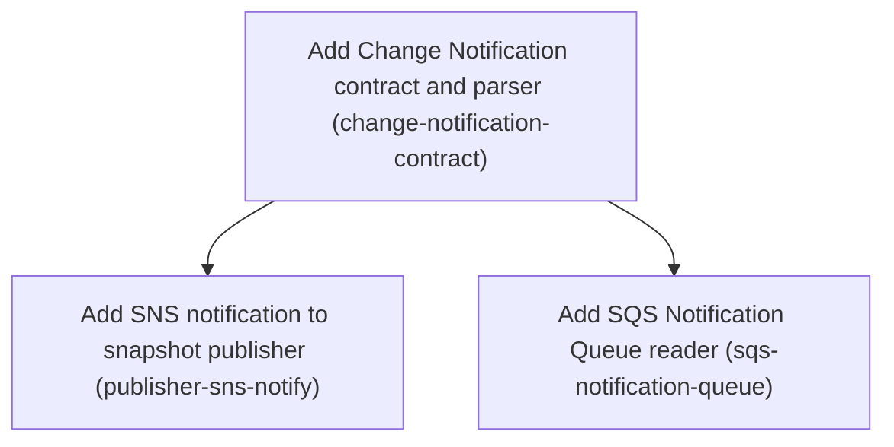

# Horizon 7 — Push change notifications (SNS → SQS)

## 🎯 What are we trying to achieve?
FeatureSync apps currently learn about a new flag snapshot only by polling `current.json` in S3. This horizon builds the first half of push updates: a documented notification message, a publisher that announces each new live version on SNS, and an SQS reader apps can use to hear those announcements without exposing a public endpoint. Done means all three are production-ready at 100% test coverage, and polling still works unchanged.

## 🧠 Why does this change need to happen?
Polling means a flag change only reaches running apps after the next poll, which can be up to minutes later. The vision calls for SNS change notifications. An app can't receive SNS directly without a public HTTP endpoint, so each app reads its own SQS queue subscribed to the topic. Notifications are a hint only: S3 stays the source of truth and polling stays on as the safety net, because SNS/SQS delivery can be lost, duplicated or out of order.

**At a glance**
- Phases: 3 (3 more were deferred to horizon 8; see `../next-horizon-brief.md`)
- Complexity: Medium
- Main risk: the long-poll loop must stop promptly (AbortController) or tests and NestJS shutdown hang
- Target: `pnpm verify` green with 100% coverage; ESLint layer zones hold
- Testing focus: fake `send()` clients, SNS envelope vs raw delivery, failure isolation, abort/stop, poison messages
- Note: after this horizon, no app reacts to a push yet. Wiring the reader into the S3 source comes in horizon 8.

## Order of work
1. **Add Change Notification contract and parser**: first, because both other phases build or parse this message.
2. **Add SNS notification to snapshot publisher**: after the contract, because it sends `buildChangeNotification` output.
3. **Add SQS Notification Queue reader**: after the contract, because it runs `parseChangeNotification`. It can run in parallel with phase 2.

### Phase 1 — Add Change Notification contract and parser
Technical ID: `change-notification-contract` · Change Notification · domain · small blast radius

**Goal:** Define the Change Notification message {environment, version, snapshotKey} as a documented, language-neutral contract with a pure zod parser and builder in @featuresync/aws domain.

**Why:** The publisher and every running app must agree on one exact message shape before anything is sent or received. SQS can deliver the message raw or wrapped in an SNS envelope, so one parser must accept both and reject foreign or malformed messages.

**Changes**
- Write docs/spec/change-notification.md next to s3-layout.md: fields environment, version, snapshotKey, plus schemaVersion; state that the message is only a hint, that the Current Pointer (<env>/current.json) stays the source of truth, that delivery is at-least-once, unordered and may be lost, and show both delivery shapes: raw JSON, and an SNS envelope {Type:'Notification', Message:'<json string>'}.
- Create domain/change-notification.ts reusing environmentSchema, versionSchema and snapshotKeyFor from current-pointer.ts: export buildChangeNotification(environment, version) returning the message body string, and parseChangeNotification(body: string) returning a result object in the same {ok, value}/{ok:false, reason} style as parseCurrentPointer.
- parseChangeNotification unwraps an SNS envelope when Type is 'Notification' and Message is a string, otherwise treats the body as raw; it rejects invalid JSON, other envelope types (e.g. SubscriptionConfirmation), a missing/invalid field, and a snapshotKey that differs from snapshotKeyFor(environment, version).
- Keep the module pure: zod only, no AWS SDK imports (ESLint domain zone).
- Add a note in docs/notes.md where the S3-event->SNS diagram appears: the CLI publisher, not an S3 event, sends the notification.
- Unit-test every branch to keep 100% coverage.

**Files / areas**
- `docs/spec/change-notification.md (new)`
- `packages/aws/src/domain/change-notification.ts (new)`
- `packages/aws/src/domain/change-notification.test.ts (new)`
- `docs/notes.md`

**How to verify**
- **Parses both SNS-envelope and raw delivery shapes**: A unit test passes a raw JSON body {environment, version, snapshotKey, schemaVersion} and gets ok:true
- **Rejects malformed and foreign messages without throwing**: Tests cover: non-JSON text, JSON that is not an object, a missing environment, a non-integer or negative version, and a missing snapshotKey — each returns ok:false
- **Pure domain module that reuses existing schemas**: The imports in packages/aws/src/domain/change-notification.ts are only zod and ./current-pointer
- **Contract document states the delivery semantics**: The doc lists environment, version, snapshotKey and schemaVersion with their types and constraints

**Done when:** packages/aws/src/domain/change-notification.ts with tests, documented by docs/spec/change-notification.md, and every check under *How to verify* passes its bar.

**Depends on:** nothing — can start immediately

Reference — full rubric

| Dimension | Rule | Pass criteria | Failure examples | minScore |
|---|---|---|---|---|
| envelope-and-raw-parsing | parseChangeNotification accepts a raw JSON body and an SNS envelope with Type 'Notification' and a string Message, and returns the same value for both. 10 = both shapes plus edge envelopes are tested; 8 = both shapes work and are tested; minScore 7. | A unit test passes a raw JSON body {environment, version, snapshotKey, schemaVersion} and gets ok:true A unit test wraps the same payload as {Type:'Notification', Message:'<json string>'} and gets an equal ok:true value A unit test passes an envelope with Type 'SubscriptionConfirmation' and gets ok:false with a reason A unit test passes an envelope whose Message is an object, not a string, and gets ok:false | Only raw bodies are tested, so an envelope whose Message is already-parsed JSON (an object) crashes or is silently accepted Any object that has a Message field is unwrapped, so a SubscriptionConfirmation envelope is treated as a notification | 7 |
| rejects-malformed-and-foreign | Every invalid input returns {ok:false, reason} and never throws: invalid JSON, missing or invalid fields, an unknown schemaVersion, and a snapshotKey that differs from snapshotKeyFor(environment, version). 10 = every rejection path has its own test with an asserted reason; 8 = all paths are rejected and tested; minScore 7. | Tests cover: non-JSON text, JSON that is not an object, a missing environment, a non-integer or negative version, and a missing snapshotKey — each returns ok:false A test with a valid environment/version but snapshotKey 'prod/snapshots/999.json' for version 3 returns ok:false No test input makes parseChangeNotification throw (JSON.parse errors are caught) Coverage report shows 100% branches for change-notification.ts | snapshotKey is checked only for format and never compared to snapshotKeyFor(environment, version), so a message pointing at another environment's snapshot is accepted JSON.parse is called without try/catch, so a poison body throws instead of returning ok:false | 7 |
| domain-purity-and-reuse | change-notification.ts lives in the domain layer: it imports only zod and current-pointer.ts, never an AWS SDK or infrastructure module, and reuses environmentSchema, versionSchema and snapshotKeyFor instead of redefining them. 10 = the builder output round-trips through the parser in a test; 8 = pure and reuses the schemas; minScore 8. | The imports in packages/aws/src/domain/change-notification.ts are only zod and ./current-pointer grep finds no new environment/version regex or schema in change-notification.ts (it uses the imported schemas) pnpm lint passes with the domain ESLint zone active A test shows parseChangeNotification(buildChangeNotification(env, v)) returns ok:true with the same environment, version and snapshotKeyFor(env, v) | The environment regex is copied into the new file and later drifts from current-pointer.ts The result type is a thrown error or a nullable value instead of the {ok, value}/{ok:false, reason} style parseCurrentPointer uses | 8 |
| contract-doc-semantics | docs/spec/change-notification.md fully defines the message and its guarantees so a non-TypeScript consumer could implement it. 10 = it also has a worked example per shape and a list of rejection rules; 8 = fields, semantics and both shapes are covered; minScore 7. | The doc lists environment, version, snapshotKey and schemaVersion with their types and constraints The doc says the message is only a hint and <env>/current.json stays the source of truth The doc says delivery is at-least-once, unordered and may be lost The doc shows a raw JSON example and an SNS envelope example docs/notes.md says the CLI publisher, not an S3 event, sends the notification | The doc describes the fields but never says messages can be lost or arrive out of order, so a reader could drop Poll Detection Only the raw shape is shown, leaving the SNS envelope undocumented | 7 |

Healer hint: The most likely miss is accepting a snapshotKey that does not equal snapshotKeyFor(environment, version) or a non-Notification envelope, so add those two rejection branches with a test each.

### Phase 2 — Add SNS notification to snapshot publisher
Technical ID: `publisher-sns-notify` · Snapshot Publishing · infrastructure · medium blast radius

**Goal:** After S3SnapshotPublisher.publish or rollback writes the Current Pointer successfully, send exactly one Change Notification to a configured SNS topic, without a notification failure ever failing or undoing the S3 write.

**Why:** Running apps can only react instantly if the single writer announces each new live version. Because S3 is the source of truth and apps still poll, a lost notification only delays an update, so it must never turn a successful publish into a failure.

**Changes**
- Add @aws-sdk/client-sns ^3 as a peer and dev dependency of @featuresync/aws (never a direct dependency), marked optional in peerDependenciesMeta because push is opt-in.
- Create infrastructure/sns-change-notifier.ts that sends PublishCommand with buildChangeNotification(...) as Message to a topic ARN via a client typed Pick<SNSClient,'send'>; keeping it in its own module means only the publisher path imports client-sns.
- Extend S3SnapshotPublisherOptions with optional topicArn, snsClient, and onNotifyError(error, {environment, version}). With no topicArn nothing is sent and behaviour is unchanged.
- Decision on failure reporting: publish/rollback keep returning Promise<number> (the new version) — the return type does not change. The notification is sent only after the pointer PutObject succeeds; if SNS throws, the error is caught and passed to onNotifyError, and the method still resolves with the version. Nothing rolls back S3. If onNotifyError is not given, a default handler writes a one-line warning via console.warn (never silently dropped), because the success bar requires a failed notification to be reported.
- If the pointer write fails, no notification is sent and the existing S3PublishError is thrown as before.
- Export the new option and callback types from packages/aws/src/index.ts.
- Unit-test with fake send() clients: notify after publish, after rollback, no notify without topicArn, no notify when the pointer write fails, SNS failure routed to onNotifyError with the version still returned.

**Files / areas**
- `packages/aws/src/infrastructure/s3-snapshot-publisher.ts`
- `packages/aws/src/infrastructure/sns-change-notifier.ts (new)`
- `packages/aws/src/infrastructure/*.test.ts`
- `packages/aws/src/index.ts`
- `packages/aws/package.json`

**How to verify**
- **Notify only after a successful pointer write**: A test with a fake S3 client and fake SNS client shows publish() sends one PublishCommand after the current.json PutObject
- **SNS failure never fails or undoes the publish**: A test with a rejecting SNS send shows publish() resolves with the version number
- **Opt-in without a behaviour or API change**: A test without topicArn shows zero SNS calls and the same result as before
- **client-sns is an optional peer plus dev dependency**: packages/aws/package.json has @aws-sdk/client-sns in peerDependencies and devDependencies with a ^3 range

**Done when:** S3SnapshotPublisher that sends one Change Notification per successful pointer write and reports SNS failures through onNotifyError, and every check under *How to verify* passes its bar.

**Depends on:** Add Change Notification contract and parser

**Rollback:** Remove the topicArn/snsClient/onNotifyError options and the client-sns peer dependency; publishers without a topic are unaffected.

Reference — full rubric

| Dimension | Rule | Pass criteria | Failure examples | minScore |
|---|---|---|---|---|
| notify-after-pointer-only | Exactly one SNS PublishCommand is sent per publish or rollback, and only after the Current Pointer PutObject resolves. 10 = tests assert call order and count for both methods and the failure path; 8 = behaviour is correct and tested; minScore 8. | A test with a fake S3 client and fake SNS client shows publish() sends one PublishCommand after the current.json PutObject A matching test shows rollback() sends one PublishCommand with the rollback target version A test where the pointer PutObject rejects shows zero PublishCommand calls and an S3PublishError thrown The PublishCommand Message equals buildChangeNotification(environment, version) and TopicArn equals the configured topicArn | The notification is sent after the snapshot object write but before the pointer write, so a failed pointer write still announces a version that is not live rollback() is left out, so rollbacks only spread through polling | 8 |
| notify-failure-isolation | If SNS throws, publish/rollback still resolve with the new version, S3 is not rolled back, and the error goes to onNotifyError, or to a console.warn default when no callback is given. 10 = also covers a throwing onNotifyError callback; 8 = the error is routed and the version returned; minScore 8. | A test with a rejecting SNS send shows publish() resolves with the version number The same test shows onNotifyError called once with the error and {environment, version} A test without onNotifyError shows console.warn called once (spied) and no rejection No DeleteObject or second pointer PutObject is sent after an SNS failure | The SNS error is caught and silently ignored when onNotifyError is missing, so the operator never learns the notification was lost onNotifyError itself throws and that error rejects publish(), turning a successful S3 write into a reported failure | 8 |
| opt-in-and-backward-compat | With no topicArn the publisher behaves exactly as before, the Promise<number> return type is unchanged, and SNS code stays in its own module. 10 = a test also shows no SNS client is created when topicArn is absent; 8 = compatible and isolated; minScore 7. | A test without topicArn shows zero SNS calls and the same result as before All existing s3-snapshot-publisher tests pass without edits to their assertions @aws-sdk/client-sns appears only in sns-change-notifier.ts, and only its type is used in s3-snapshot-publisher.ts The new option and callback types are exported from packages/aws/src/index.ts | A default SNSClient is created in the constructor even when topicArn is missing, which needs credentials/region at runtime for polling-only users publish() is changed to return {version, notified}, breaking the existing CLI callers | 7 |
| peer-dependency-shape | @aws-sdk/client-sns ^3 appears in peerDependencies and devDependencies, is marked optional in peerDependenciesMeta, and never in dependencies. 10 = the lockfile is updated and pnpm verify passes; 8 = the manifest is correct; minScore 8. | packages/aws/package.json has @aws-sdk/client-sns in peerDependencies and devDependencies with a ^3 range peerDependenciesMeta['@aws-sdk/client-sns'].optional is true dependencies does not contain @aws-sdk/client-sns pnpm verify passes with 100% coverage | The package is added as a peer but not marked optional, so every polling-only install gets a missing-peer warning A version range that does not match the existing client-s3 major is used | 8 |

Healer hint: The most likely failure is an SNS error escaping through a missing or throwing onNotifyError, so wrap the whole notify step (including the callback) in try/catch with a console.warn fallback and test both paths.

### Phase 3 — Add SQS Notification Queue reader
Technical ID: `sqs-notification-queue` · Push Detection · infrastructure · medium blast radius

**Goal:** Provide a separate, opt-in module that long-polls an app's own SQS Notification Queue, parses each message into a Change Notification, and deletes it after handling, stoppable at any time.

**Why:** Apps cannot expose a public HTTP endpoint for SNS, so each app reads its own SQS queue subscribed to the topic. Isolating the SQS client in its own module keeps polling-only users from needing @aws-sdk/client-sqs installed.

**Changes**
- Add @aws-sdk/client-sqs ^3 as a peer (optional) and dev dependency.
- Create createSqsNotificationQueue({queueUrl, client?: Pick<SQSClient,'send'>, waitTimeSeconds?=20, logger?}) returning a small NotificationQueue object with start(onNotification: (n) => Promise<void>) that returns a synchronous stop().
- The loop calls ReceiveMessage (long poll), runs parseChangeNotification on each body, awaits the handler, then calls DeleteMessage. A message that fails to parse (poison or foreign) is logged and deleted, so it is never redelivered forever. If the handler throws, the message is left undeleted so SQS redelivers it (or moves it to a DLQ the user configured).
- stop() aborts the in-flight ReceiveMessage through an internal AbortController (passed as abortSignal to send) so tests and NestJS shutdown do not hang; an abort error after stop ends the loop quietly.
- Receive/Delete errors are logged and the loop retries after a short backoff; errors never reach the SnapshotSource port, which has no error callback.
- Export createSqsNotificationQueue and the NotificationQueue type from index.ts.
- Unit-test with fake send() clients and fake timers: raw and envelope bodies, poison message deleted, handler failure not deleted, DeleteMessage failure, receive error with backoff, stop during an in-flight receive.
- Scope boundary: the reader only delivers parsed Change Notifications to its handler; it applies no Version Dedupe, environment filtering or rollback confirmation — those belong to the later phase that wires it into createS3SnapshotSource, so the NotificationQueue interface stays stable.

**Files / areas**
- `packages/aws/src/infrastructure/sqs-notification-queue.ts (new)`
- `packages/aws/src/infrastructure/sqs-notification-queue.test.ts (new)`
- `packages/aws/src/index.ts`
- `packages/aws/package.json`

**How to verify**
- **Correct delete versus redeliver decisions**: A test with a valid body shows the handler receives the parsed Change Notification, then DeleteMessage is sent with that message's ReceiptHandle
- **stop() ends the loop promptly with no leaked handles**: A test starts the queue with a fake send that waits until aborted, calls stop(), and the loop promise settles without a timeout
- **Receive and Delete errors are retried with backoff**: A test where ReceiveMessage rejects once shows a logged error, no second receive before the backoff time passes, then a successful receive
- **Thin reader with isolated optional dependency**: sqs-notification-queue.ts has no comparison against a loaded version and no environment check

**Done when:** packages/aws/src/infrastructure/sqs-notification-queue.ts exporting createSqsNotificationQueue with full unit tests, and every check under *How to verify* passes its bar.

**Depends on:** Add Change Notification contract and parser

Reference — full rubric

| Dimension | Rule | Pass criteria | Failure examples | minScore |
|---|---|---|---|---|
| delete-semantics | A message is deleted after its handler resolves, and a poison or foreign message is logged and deleted. A message whose handler throws is not deleted, so SQS redelivers it. 10 = each case asserts the exact ReceiptHandle deleted and a batch mixes all three; 8 = all three cases are tested; minScore 8. | A test with a valid body shows the handler receives the parsed Change Notification, then DeleteMessage is sent with that message's ReceiptHandle A test with an unparseable body shows the handler is never called, the logger gets a warning, and DeleteMessage is sent A test where the handler rejects shows no DeleteMessage for that message and the loop keeps running Raw-body and SNS-envelope messages are both delivered to the handler | DeleteMessage runs in a finally block, so a message whose handler failed is deleted and the update is lost until the next poll A poison message is skipped but not deleted, so it is redelivered forever | 8 |
| stop-and-abort | The synchronous stop() aborts the in-flight ReceiveMessage through an AbortController passed as abortSignal, ends the loop without logging the abort as an error, and starts no new receive. 10 = a test also shows stop() during handler execution finishes that message and then exits; 8 = stop during a receive is tested; minScore 8. | A test starts the queue with a fake send that waits until aborted, calls stop(), and the loop promise settles without a timeout The fake send receives an abortSignal and it is aborted after stop() No error-level log is written for the abort that follows stop() After stop(), no further ReceiveMessage calls happen (checked by advancing fake timers) | stop() only sets a flag, so the loop exits after the 20-second long poll returns and Jest/Nest shutdown hangs The abort error is treated like any receive error, logged, and followed by a backoff retry | 8 |
| error-resilience-backoff | ReceiveMessage and DeleteMessage errors are logged and the loop continues after a short backoff instead of spinning or dying, and no error reaches the SnapshotSource port. 10 = the backoff time is asserted with fake timers and there is no tight loop; 8 = errors are recovered and tested; minScore 7. | A test where ReceiveMessage rejects once shows a logged error, no second receive before the backoff time passes, then a successful receive A test where DeleteMessage rejects shows a logged error and the loop goes on to the next receive Neither error rejects start() or throws out of the loop Receive calls use WaitTimeSeconds 20 by default and the configured value when given | A receive error retries at once in a tight loop, burning CPU and API calls during an SQS outage An unhandled rejection from DeleteMessage kills the loop quietly, so push stops while polling hides it | 7 |
| scope-and-isolation | The module only delivers parsed Change Notifications; it applies no Version Dedupe, environment filtering or rollback checks. @aws-sdk/client-sqs is imported only here and is an optional peer plus dev dependency. 10 = the NotificationQueue type is minimal and documented with TSDoc; 8 = scope and dependency are correct; minScore 7. | sqs-notification-queue.ts has no comparison against a loaded version and no environment check @aws-sdk/client-sqs appears only in sqs-notification-queue.ts among the source files packages/aws/package.json lists client-sqs in peerDependencies (optional in peerDependenciesMeta) and devDependencies, not in dependencies createSqsNotificationQueue and NotificationQueue are exported from index.ts, and pnpm verify passes with 100% coverage | The reader drops messages whose version is not above the last one it saw, which silently loses Rollbacks and duplicates the later subscriber's job index.ts re-exports in a way that makes importing the package root load client-sqs for polling-only users | 7 |

Healer hint: The most likely failure is a hanging or flaky long-poll test caused by stop() not aborting the in-flight receive, so pass the AbortController signal to send and treat the abort after stop as a clean exit.

## Discovery Findings
| Area | Finding | File | Implication |
|---|---|---|---|
| core port | SnapshotSource has optional `subscribe?(onChange: (snapshot: unknown) => void): Unsubscribe` with `Unsubscribe = () => void`; no error callback, no async stop hook; both exported from core index.ts. | `packages/core/src/application/snapshot-source.port.ts` | Push must fit the synchronous Unsubscribe; abort in-flight long-poll via internal AbortController; errors go to a logger, not the port. Do not change the core port. |
| aws source state | createS3SnapshotSource keeps one closure `loaded: {etag, version, snapshot} / undefined`, set by load()/loadVersion(). subscribe() runs a setTimeout poll loop: conditional GET on current.json with loaded.etag plus periodic unconditional reconcile (reconcileIntervalMs >= pollIntervalMs, default 10 min); skips onChange when version equals loaded.version. | `packages/aws/src/infrastructure/s3-snapshot-source.ts` | Version dedupe state is private to this factory. To dedupe pushes against it, either add queue options to createS3SnapshotSource or extract a shared loaded-state holder; a separate composing source would not see `loaded`. |
| aws source helpers | readPointer (checks environment), loadVersion(pointerObject, version) and getPointerIfChanged are non-exported closures inside createS3SnapshotSource. s3-read.ts exports readObjectText(client, bucket, key, ifNoneMatch?), S3Text {text, etag}, isNotFound, isMissing. | `packages/aws/src/infrastructure/s3-read.ts` | Rollback confirmation against current.json and snapshot load should reuse these closures, avoiding duplication in a new module. |
| publisher | S3SnapshotPublisher: `publish(environment, snapshot): Promise<number>`, `rollback(environment, targetVersion): Promise<number>`; options {bucket, client?: Pick<S3Client,'send'>, validate}; errors thrown as S3PublishError with S3PublishErrorReason. | `packages/aws/src/infrastructure/s3-snapshot-publisher.ts` | Reporting a failed notification without failing the S3 write needs either a changed return type (breaks CLI/tests) or an onNotifyError/logger option; decide explicitly. New options topicArn? and snsClient?: Pick<SNSClient,'send'>. |
| domain | current-pointer.ts exports environmentSchema (z.string().min(1).regex(/^[^/]+$/)), versionSchema (z.int().positive()), snapshotKeyFor, POINTER_SCHEMA_VERSION, parseCurrentPointer -> PointerResult. publishing.ts exports PublishingResult<T>, validateEnvironmentName, validateVersion, checkRollbackTarget. | `packages/aws/src/domain/current-pointer.ts` | New domain/change-notification.ts reuses environmentSchema/versionSchema and the parseCurrentPointer result pattern; unwraps SNS envelope (Type:'Notification', Message string) or accepts raw delivery. |
| exports | aws index.ts exports only infrastructure factories, errors and types (source, publisher, fetcher); no domain symbols. | `packages/aws/src/index.ts` | New public API (source/publisher options, result types, optionally parseChangeNotification) must be exported here; exporting the parser is a decision. |
| deps | @featuresync/aws deps: @featuresync/core, zod ^4.6.5; @aws-sdk/client-s3 ^3.1135.0 is peer + dev. No SNS/SQS clients. | `packages/aws/package.json` | Add @aws-sdk/client-sns and client-sqs as peer+dev at ^3; consider peerDependenciesMeta optional since push is opt-in; ESM static imports still require installation, so keep them in separate modules. |
| cli | main.ts has injectable CliIo with env and createPublisher(options: S3SnapshotPublisherOptions). Bucket from --bucket or FEATURESYNC_BUCKET via bucketFor/requireValue; publisherFor builds options. Commands: validate, publish --env, rollback --env --to, pull. main(argv, io) returns ExitCode; reportPublishError maps S3PublishError reasons to exit codes. | `packages/cli/src/main.ts` | Add --topic-arn / FEATURESYNC_TOPIC_ARN in publisherFor; a notification failure prints a stderr warning with exit 0 (or a new code — decide). Tests use a fake CliIo. |
| lint zones | eslint.config.js import/no-restricted-paths: domain may not import application/infrastructure; application may not import infrastructure; applies to packages/*/src. | `eslint.config.js` | Notification parser in domain/, pure zod, no AWS SDK; SQS/SNS adapters in infrastructure/. |
| coverage | Root vitest config: 100% thresholds for lines/branches/functions/statements; excludes **/*.test.ts and integration/** from unit runs. Scripts: test = vitest run --coverage, typecheck = pnpm -r typecheck, lint = eslint . --max-warnings=0. | `vitest.config.ts` | Every new branch needs unit tests with fake send() clients: envelope vs raw, abort, DeleteMessage failure, stale version, rollback check. LocalStack tests don't count toward coverage. |
| integration | packages/aws/integration holds s3-snapshot-fetcher, s3-snapshot-publisher, s3-snapshot-source .localstack.test.ts run via vitest.integration.config.ts; root test:integration builds core, aws, cli first. | `packages/aws/integration` | Add sns-sqs-push.localstack.test.ts: fixture creates topic+queue, queue policy, subscription (RawMessageDelivery true and false); long pollIntervalMs so push, not polling, is proven. |
| localstack/CI | docker/docker-compose.yml sets SERVICES=s3 and requires LOCALSTACK_AUTH_TOKEN=${LOCALSTACK_AUTH_TOKEN:?}; ci.yml integration job already fails when the secret is missing, runs docker compose up -d --wait then pnpm test:integration. | `docker/docker-compose.yml` | Only CI/infra change needed: SERVICES=s3,sns,sqs. Token-fail is already enforced; no work planned for it. |
| docs | docs/spec has s3-layout.md, evaluation-semantics.md, evaluation-vectors.json; no notification spec. docs/notes.md describes SNS as notification-not-storage (§1.3), SNS publish flow and 'SNS unavailable' failure (~line 806), and an S3-event->SNS diagram (~line 31). | `docs/notes.md` | Create docs/spec/change-notification.md; annotate that the publisher publishes to SNS instead of S3 event notifications. |
| typecheck | pnpm typecheck exits 0; IDE errors in s3-snapshot-source.subscribe.test.ts, publishing.ts, feature-sync.module.ts, feature-flag.guard.test.ts are stale. |  | No phase needed for type errors; restart the IDE TS server. |

## Out of Scope
- Provisioning AWS infrastructure (CloudFormation/CDK/Terraform for topic, queue, subscription, policies): a separate deployment horizon; the library must work with the user's own IaC.
- Removing or disabling S3 current.json polling: it is the safety net against lost/unordered notifications (horizon-2 decision).
- Lambda-based publishing or S3 event notifications: the horizon-4 decision makes the CLI publisher the single writer and notifier.
- A public HTTP/HTTPS SNS endpoint in the app: the blocker is resolved in favour of SQS to avoid public endpoints.
- Automatic per-instance queue creation and cleanup at app startup: needs create/delete IAM rights and lifecycle handling; deferred.
- Dashboard/UI and non-TypeScript SDKs: separate vision slices.
- Real-AWS IAM least-privilege verification: LocalStack Community does not enforce IAM; stays an open blocker.
- NestJS-specific push wiring beyond passing the new source through existing module options: Nest already consumes any SnapshotSource.
- Provisioning topic/queue/subscription with CloudFormation/CDK/Terraform — gate 1 (not required by this horizon; out of scope, library works with user IaC)
- Automatic per-instance SQS queue create/delete at app startup — gate 1 (needs extra IAM rights and lifecycle; not needed now)
- Changing the core SnapshotSource port to add an error callback or async stop — gate 4 (errors go to a logger and an internal AbortController suffices)
- Exporting parseChangeNotification publicly for other consumers — gate 1 (no consumer outside @featuresync/aws yet)
- Library-managed dead-letter queue configuration — gate 1 (DLQ is a queue setting the user's IaC owns; poison messages are already deleted)
- NestJS-specific push wiring — gate 3 (Nest already accepts any SnapshotSource through existing module options)
- Real-AWS IAM least-privilege verification — gate 2 (LocalStack does not enforce IAM; stays an open blocker)
- A dedicated CLI exit code for notification failure — gate 4 (a warning with exit 0 covers the need)
- Add Push Detection to S3 snapshot source (s3-source-push-detection): held for the next Planning Horizon to keep this one small and reviewable — the Planning Brief and project memory carry the context forward
- Add topic ARN option to CLI publish (cli-topic-arn): held for the next Planning Horizon to keep this one small and reviewable — the Planning Brief and project memory carry the context forward
- Test SNS to SQS push on LocalStack (localstack-push-proof): held for the next Planning Horizon to keep this one small and reviewable — the Planning Brief and project memory carry the context forward

## Success Criteria
- Horizon 7 bar: (1) a documented Change Notification contract (docs/spec/change-notification.md) with a pure zod parser in packages/aws/src/domain accepting raw and SNS-envelope shapes and rejecting malformed or foreign messages; (2) publisher publish and rollback send exactly one notification to a configured topic ARN only after the pointer write succeeds, and a failed notification is reported (onNotifyError or a console.warn default) but never fails or undoes the S3 write; (3) an opt-in SQS Notification Queue reader that long-polls, deletes handled and poison messages, and stops promptly; (4) @aws-sdk/client-sns and client-sqs are optional peer + dev deps only; (5) pnpm verify passes with 100% coverage and ESLint layer zones hold.
- Add Change Notification contract and parser: packages/aws/src/domain/change-notification.ts with tests, documented by docs/spec/change-notification.md
- Add SNS notification to snapshot publisher: S3SnapshotPublisher that sends one Change Notification per successful pointer write and reports SNS failures through onNotifyError
- Add SQS Notification Queue reader: packages/aws/src/infrastructure/sqs-notification-queue.ts exporting createSqsNotificationQueue with full unit tests
- Carried to horizon 8 (not a horizon 7 criterion): the deduping SQS subscriber inside createS3SnapshotSource with rollback confirmation, push+poll composition through SnapshotSource.subscribe, the CLI --topic-arn flag, the LocalStack publish->SNS->SQS proof with SERVICES=s3,sns,sqs, and recording the resolved no-public-endpoint blocker.

## Alignment Preview
The user accepted the first preview. Three advisory concerns were raised. Two were folded in: an SNS failure with no callback now goes to a `console.warn` default instead of being dropped, and the SQS reader explicitly leaves dedupe and rollback checks to horizon 8. The third ("no app reacts to a push this horizon") was accepted as-is, with the wiring deferred to horizon 8.

## Quality Gate
Full path, one iteration. The critic raised 1 major and 0 blockers, so no evidence screen or verification call was needed. **Healed (1):** `success-coverage`. successCriteria[0] had copied the whole-feature definition, including deferred work, so it was rescoped to horizon 7 and a "carried to horizon 8" line was added. The heal was applied directly by the orchestrator as a text substitution, with no healer call. **Accepted debt (4 minor):** the `deferred` list has near-duplicate entries (provisioning, per-instance queues, IAM, NestJS each appear twice); it's still undecided whether the `ChangeNotification` value type is exported next to `NotificationQueue`; the docker `SERVICES` change is deferred along with the LocalStack proof; and Version Dedupe should become a domain function in horizon 8. **Verdict:** passed.

## Cost
Agent calls: 7 against a budget of 8–10 (analysis, discovery, decompose, preview concerns, next-horizon brief, rubrics, critic). No verification or healer call was needed. No stage overran.

## Full analysis
**domainShape:** business. Whether a running app accepts a new or rolled-back snapshot version is governed by version ordering, rollback semantics and dedupe rules — domain policy — with SNS/SQS only as transport adapters.

| Term | Meaning |
|---|---|
| Change Notification | The {environment, version, snapshotKey} message the publisher sends to SNS after a successful Current Pointer write, hinting a new version is live. |
| Current Pointer | <env>/current.json, the only mutable key and the single source of truth for the live Snapshot version. |
| Snapshot | An immutable, versioned, language-neutral JSON flag definition at <env>/snapshots/<n>.json. |
| Notification Queue | The app-side SQS queue subscribed to the change topic, long-polled to receive Change Notifications without a public endpoint. |
| Push Detection | Learning about a new version by receiving a Change Notification, as opposed to Poll Detection. |
| Poll Detection | The existing ETag-based periodic Current Pointer read plus reconciliation, kept as the safety net. |
| Version Dedupe | A delivery is applied only if its version differs from the loaded one; a lower version only when the Current Pointer confirms a Rollback. |
| Rollback | Pointing the Current Pointer at a lower existing Snapshot version; must propagate through push too. |
| Snapshot Publishing | The CLI-owned write of Snapshots and the Current Pointer to S3, now followed by a Change Notification. |

**Assumptions**
- The app's SQS queue and its SNS subscription are provisioned outside the library; the library takes a queue URL and the publisher a topic ARN; neither creates infrastructure at runtime except in LocalStack fixtures.
- Polling current.json stays the default baseline; push is an optional acceleration, so correctness never depends on at-least-once, unordered, lossy SNS/SQS delivery.
- The payload {environment, version, snapshotKey} is a hint; the subscriber re-derives the key with snapshotKeyFor and never trusts a differing snapshotKey.
- Default layout is one queue per deployment or instance; with a shared queue only one instance receives each message and polling covers the rest (documented, not engineered around).
- The SNS publish lives in @featuresync/aws next to the publisher (horizon-4 decision); @featuresync/cli only gains a --topic-arn flag/env var.
- subscribe() runs before load() resolves, so the subscriber reads the shared loaded-version state at handling time.
- IAM least-privilege for sqs:ReceiveMessage/DeleteMessage and sns:Publish is documented but not enforceable on LocalStack.

**Risks**
- Rollback vs version dedupe: a lower-version notification is legitimate; dropping it misses rollbacks until next poll, accepting blindly lets a late/redelivered message downgrade flags. Fix: re-read current.json before acting on any non-higher version.
- SNS publish failing after the pointer write leaves a partial publish; the CLI must warn clearly without reporting total failure or rolling back S3.
- The long-poll loop has no stop/error hook on the SnapshotSource port; unsubscribe must abort in-flight ReceiveMessage (AbortController) so handles don't leak and Nest shutdown/tests don't hang.
- SNS->SQS body is either an SNS envelope or raw depending on RawMessageDelivery, and LocalStack may differ from AWS; the parser and tests must cover both.
- Fake-timer tests of a long-poll loop can be flaky and threaten the 100% coverage gate.
- The LocalStack CI job must add sns/sqs to SERVICES and new AWS_ENDPOINT_URL_* vars; a wrong endpoint silently hits real AWS or hangs.
- A poison message must be deleted or left to a DLQ rather than redelivered forever.
- Two new peer SDKs widen install surface; imports must stay in separate modules so polling-only consumers don't need client-sqs.
