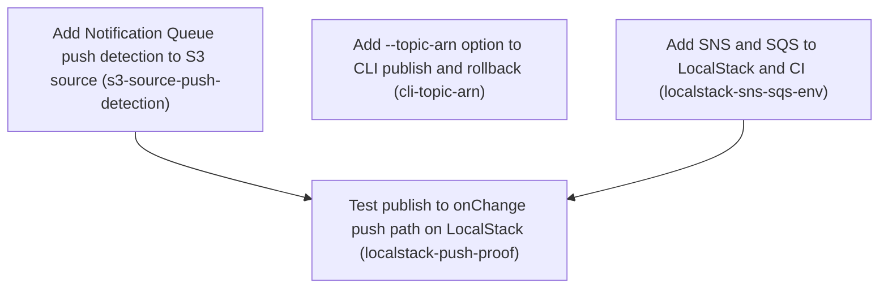

# Horizon 8 — Wire SNS/SQS push detection end to end

## 🎯 What are we trying to achieve?
When someone publishes or rolls back a Snapshot, running apps should pick it up within seconds through their own SQS queue instead of waiting for the next poll of `current.json`. The CLI gets a way to name the SNS topic, and the whole path — publish → SNS → SQS → `onChange` — is proven against LocalStack.

## 🧠 Why does this change need to happen?
Horizon 7 built the pieces — a Change Notification format, an SNS notify step in the publisher, and an SQS queue reader — but nothing connects them yet. Apps still only see changes when polling runs, and the CLI cannot pass a topic, so no notification is ever sent in practice.

### At a glance
- **Phases:** 4
- **Complexity:** Medium
- **Main risk:** a push-triggered load racing a poll load could deliver an older Snapshot after a newer one
- **Testing focus:** ordering and dedupe under concurrent loads, Unsubscribe with work in flight, real SNS→SQS delivery on LocalStack, 100% coverage

## Order of work

1. **Add Notification Queue push detection to S3 source** — can start immediately
2. **Add --topic-arn option to CLI publish and rollback** — can start immediately
3. **Add SNS and SQS to LocalStack and CI** — can start immediately
4. **Test publish to onChange push path on LocalStack** — needs Add Notification Queue push detection to S3 source and Add SNS and SQS to LocalStack and CI

(Phases 1–3 are independent and can run in any order.)

### Phase 1 — Add Notification Queue push detection to S3 source
Technical ID: `s3-source-push-detection` · Snapshot delivery (@featuresync/aws source) · infrastructure · medium

**Goal** — createS3SnapshotSource accepts an optional notificationQueue. On each Change Notification it re-reads the Current Pointer (current.json) and delivers the Snapshot it names through onChange, alongside polling. One synchronous Unsubscribe stops both the poll loop and the Notification Queue.

**Why** — Horizon 7 shipped the SNS notifier and an SQS Notification Queue reader, but no Snapshot source uses them yet, so apps still see changes only when polling runs. Plugging the existing NotificationQueue port into the S3 source makes push detection work with no change to the core SnapshotSource port.

**Changes**
- Add optional notificationQueue?: NotificationQueue to S3SnapshotSourceOptions (type-only import). Without it, polling behaviour stays exactly as it is now.
- In subscribe, start the queue with a handler that ignores (acks) notifications for another environment. For a matching environment it re-reads current.json through the existing getPointerIfChanged/readPointer/loadVersion closures, skips when the pointer version equals loaded.version, and otherwise delivers the Snapshot. Because the Current Pointer is re-read every time, a lower-version rollback is delivered only once current.json confirms it (Rollback Confirmation).
- Run push loads and poll loads one after another through a single promise chain, ordered by load sequence rather than version number, so an older Snapshot is never delivered after a newer one and rollbacks are not blocked.
- Make the handler rethrow when a load fails, so the queue leaves the message for redelivery or the dead-letter queue (DLQ). Unparseable messages keep the queue's existing delete-immediately behaviour (Poison Message policy).
- Make Unsubscribe call stopQueue() and clearTimeout(timer) synchronously and set the stopped flag. A push load that is already running must not call onChange after Unsubscribe.
- Add unit tests with a fake NotificationQueue covering: a higher version, a duplicate or equal version, a rollback, another environment, a load failure that rethrows, a push load in flight during Unsubscribe, a push racing a poll, and no queue. Keep 100% coverage.
- As a step inside this phase, record in decisions.md the push placement, the rollback policy (confirm against the Current Pointer), the Poison Message policy (rethrow on load failure) and the public-export decision (only the options field changes).

**Files / areas**
- `packages/aws/src/infrastructure/s3-snapshot-source.ts`
- `packages/aws/test/infrastructure/s3-snapshot-source.push.test.ts`
- `docs/roadmaps/featuresync/decisions.md`

**How to verify**
- **Version dedupe and Rollback Confirmation** — s3-snapshot-source.push.test.ts has a test where a notification carries a version equal to the loaded version and asserts that onChange is never called
- **Push and poll loads run in one serial chain** — The source has one shared promise chain (or mutex) that both the poll tick and the queue handler append to
- **One synchronous Unsubscribe stops push and polling** — The Unsubscribe body calls stopQueue() and clearTimeout(timer) without awaiting anything
- **Load-failure rethrow and environment filter** — A test sends another environment's notification and asserts that the handler resolves and no S3 GetObject or readPointer call happened
- **Infrastructure layer respects the NotificationQueue port** — s3-snapshot-source.ts uses 'import type { NotificationQueue }' and has no import from @aws-sdk/client-sqs or client-sns
- **100% coverage and recorded decisions** — pnpm --filter @featuresync/aws test --coverage reports 100 for all four metrics

**Done when** — s3-snapshot-source.push.test.ts passes at 100% coverage. It proves that push delivers a newer Snapshot, deduplicates by version, confirms rollbacks against the Current Pointer, and delivers no onChange after Unsubscribe. Every check under *How to verify* passes its bar.

**Depends on** — nothing — can start immediately

Reference — full rubric

| Dimension | Rule | Pass criteria | Failure examples | Min |
|---|---|---|---|---|
| push-dedupe-and-rollback-confirmation | Every Change Notification for the matching environment makes the source re-read current.json. It delivers a Snapshot only when the pointer version differs from loaded.version, so a lower-version rollback is delivered because current.json confirms it, not because the notification says so. | s3-snapshot-source.push.test.ts has a test where a notification carries a version equal to the loaded version and asserts that onChange is never called It has a test where current.json points to a lower version (rollback) and asserts that onChange receives that older Snapshot exactly once It has a test where the notification's version differs from current.json and asserts that the version from current.json is the one delivered The handler in s3-snapshot-source.ts calls the existing readPointer/getPointerIfChanged closures and does not trust the notification's version field alone | The handler dedupes with notification.version > loaded.version, so rollbacks are silently dropped The handler loads the Snapshot named in the notification without re-reading current.json, so a stale out-of-order notification delivers an outdated Snapshot It uses getPointerIfChanged with an ETag that the poll loop already updated, so a push after a poll returns 'unchanged' and the confirmed rollback never fires (a plausible miss from sharing ETag state) | 8 |
| serialized-load-ordering | Push loads and poll loads run one at a time through a single promise chain, in load-sequence order, so an older Snapshot is never delivered after a newer one. | The source has one shared promise chain (or mutex) that both the poll tick and the queue handler append to A test with a fake queue fires a push while a poll load is still pending (a deferred promise) and asserts that onChange versions arrive in load order with no older-after-newer delivery No version-number guard in the source blocks a confirmed rollback | Push and poll each call loadVersion on their own, so a slow poll resolves after a fast push and overwrites it with an older Snapshot The chain is serialized but a rejected load breaks it (no catch between links), so every later load is skipped | 8 |
| unsubscribe-stops-both | The Unsubscribe that subscribe returns synchronously calls stopQueue(), clears the poll timer and sets the stopped flag. A push load already in flight must not call onChange after that. | The Unsubscribe body calls stopQueue() and clearTimeout(timer) without awaiting anything A test starts a push load, calls Unsubscribe before the load resolves, then resolves it and asserts onChange was not called A test asserts that the fake queue's stop function was called exactly once and that advancing fake timers triggers no further poll reads | Unsubscribe clears the timer but forgets stopQueue, so SQS long-polling keeps running The stopped flag is checked before the await on loadVersion but not after it, so an in-flight push still calls onChange (the typical honest race miss) | 9 |
| poison-and-env-policy | Notifications for another environment are acked without any S3 read. A load failure rethrows so the queue keeps the message for redelivery or the DLQ. Unparseable messages keep the queue's existing delete-immediately behaviour. | A test sends another environment's notification and asserts that the handler resolves and no S3 GetObject or readPointer call happened A test makes loadVersion reject and asserts that the handler promise rejects with that error sqs-notification-queue.ts parse/delete behaviour is unchanged (empty diff, or its tests are untouched and still pass) | The handler catches load errors and logs them, so the message is deleted and the change is lost until the next poll The environment check compares against the bucket prefix instead of the configured environment, so real notifications get filtered out | 8 |
| layer-and-port-respect | The source depends on the NotificationQueue port only by type and does not change the core SnapshotSource port or the public exports beyond the options field. | s3-snapshot-source.ts uses 'import type { NotificationQueue }' and has no import from @aws-sdk/client-sqs or client-sns packages/core SnapshotSource interface has no diff pnpm lint passes with the ESLint layer zones unchanged Without notificationQueue, the existing s3-snapshot-source tests pass unchanged | It imports createSqsNotificationQueue as a value to build a default queue inside the source, which pulls client-sqs into the source It adds an onPush callback to the core SnapshotSource interface | 9 |
| coverage-and-decisions | The aws package stays at 100% line, branch, function and statement coverage, and decisions.md records the push placement, rollback, poison and export decisions. | pnpm --filter @featuresync/aws test --coverage reports 100 for all four metrics decisions.md has an entry that names push placement, Rollback Confirmation against the Current Pointer, rethrow on load failure, and 'only the options field changes' | The branch where stopped is set after an await is never covered, so branch coverage is 99.x% The decisions entry covers rollback but leaves out the Poison Message policy | 8 |

Healer hint: If the rollback or race tests fail, make the push path re-read current.json with its own unconditional readPointer (not an ETag shared with polling), and check the stopped flag after every await inside the single serial promise chain.

### Phase 2 — Add --topic-arn option to CLI publish and rollback
Technical ID: `cli-topic-arn` · Snapshot publishing CLI (@featuresync/cli) · interface · small

**Goal** — featuresync publish and rollback read the SNS topic ARN from --topic-arn or FEATURESYNC_TOPIC_ARN, pass it to the S3 publisher, and report a failed Change Notification as a warning on stderr with exit code 0.

**Why** — The publisher can already send Change Notifications when it gets a topicArn, but the CLI has no way to pass one. The CLI must stay a thin wrapper with no business logic.

**Changes**
- Add a 'topic-arn' string option to parseArgs. Resolve topicArn = values['topic-arn'] ?? io.env.FEATURESYNC_TOPIC_ARN, and pass nothing when neither is set so no notification is sent.
- Pass topicArn and an onNotifyError that writes one line to io.err into io.createPublisher inside publisherFor.
- Add --topic-arn and FEATURESYNC_TOPIC_ARN to USAGE.
- Add tests for the flag, the env fallback, the flag taking priority over the env var, the case where neither is set, and a notify failure that writes a warning with exit code 0.
- As a step inside this phase, record in decisions.md that a notify failure in the CLI gives exit code 0 with a warning.

**Files / areas**
- `packages/cli/src/main.ts`
- `packages/cli/test/main.test.ts`
- `docs/roadmaps/featuresync/decisions.md`

**How to verify**
- **Flag, env fallback and precedence** — main.test.ts asserts that the createPublisher spy receives topicArn from the flag
- **publish and rollback both carry topicArn** — There are tests for the rollback command as well as publish that assert topicArn reaches createPublisher
- **Notify failure is a warning with exit 0** — A test makes the fake publisher call onNotifyError and asserts exit code 0 and exactly one stderr line containing the error message
- **CLI stays thin** — main.ts has no import from @aws-sdk/client-sns and no ARN parsing or validation logic

**Done when** — main.test.ts passes at 100% coverage. It shows that --topic-arn or FEATURESYNC_TOPIC_ARN reaches createPublisher, and that a notify failure writes a warning to stderr with exit 0. Every check under *How to verify* passes its bar.

**Depends on** — nothing — can start immediately

Reference — full rubric

| Dimension | Rule | Pass criteria | Failure examples | Min |
|---|---|---|---|---|
| topic-arn-resolution | topicArn resolves as --topic-arn ?? io.env.FEATURESYNC_TOPIC_ARN, and it is left undefined when neither is set. | main.test.ts asserts that the createPublisher spy receives topicArn from the flag A test sets only FEATURESYNC_TOPIC_ARN and asserts the env value reaches createPublisher A test sets both and asserts the flag wins A test with neither set asserts topicArn is undefined (the key is absent or undefined, not an empty string) | It reads process.env directly instead of io.env, so the tests cannot inject the variable It uses \|\| with a default of '' and passes an empty topicArn, which makes the publisher try an SNS call | 8 |
| both-commands-wired | Both the publish and rollback commands pass topicArn and onNotifyError through publisherFor. | There are tests for the rollback command as well as publish that assert topicArn reaches createPublisher topicArn is wired in publisherFor only, not duplicated in each command | Only publish passes topicArn, so rollbacks never notify subscribers | 8 |
| notify-failure-warning-exit0 | A failed Change Notification writes exactly one warning line to io.err and the command still exits 0. A failed notify never fails a publish. | A test makes the fake publisher call onNotifyError and asserts exit code 0 and exactly one stderr line containing the error message stdout still holds the normal success output | onNotifyError rethrows or sets process.exitCode = 1 The warning prints the whole error object, stack trace included, across many lines | 9 |
| thin-cli-layer | main.ts only parses args and env and forwards options. It contains no SNS or client logic. | main.ts has no import from @aws-sdk/client-sns and no ARN parsing or validation logic The ESLint layer zones pass USAGE lists --topic-arn and FEATURESYNC_TOPIC_ARN packages/cli coverage is 100% for all metrics | It validates the ARN format with a regex in the CLI, which is business logic in the interface layer It builds an SNSClient inside main.ts to send the notification | 8 |

Healer hint: If the env-fallback test fails, read the variable from the injected io.env (not process.env), use ?? rather than ||, and wire it once in publisherFor so publish and rollback share it.

### Phase 3 — Add SNS and SQS to LocalStack and CI
Technical ID: `localstack-sns-sqs-env` · Build and CI tooling · cross-cutting · small

**Goal** — Local runs and the CI integration job start LocalStack with S3, SNS and SQS, and send the AWS SDK SNS and SQS clients to it using only standard endpoint env vars.

**Why** — LocalStack currently starts only S3. Without the SNS and SQS endpoint env vars, the push test would call real AWS. Horizon 1 decided that LocalStack is reached only through env config, never through a code branch.

**Changes**
- Set SERVICES=s3,sns,sqs in docker-compose.
- Add AWS_ENDPOINT_URL_SNS and AWS_ENDPOINT_URL_SQS to .env.example and to the CI integration job, next to where AWS_ENDPOINT_URL_S3 is set (ci.yml line ~24).
- Pass the new env vars through vitest.integration.config.ts.

**Files / areas**
- `docker/docker-compose.yml`
- `.env.example`
- `.github/workflows/ci.yml`
- `packages/aws/vitest.integration.config.ts`

**How to verify**
- **LocalStack starts S3, SNS and SQS** — docker/docker-compose.yml has SERVICES=s3,sns,sqs
- **Endpoints come from env only** — grep for 'localstack' or '4566' in packages/*/src returns nothing
- **CI exports the vars and fails without the token** — ci.yml integration job env has AWS_ENDPOINT_URL_SNS and AWS_ENDPOINT_URL_SQS next to AWS_ENDPOINT_URL_S3

**Done when** — docker compose up --wait starts LocalStack with S3, SNS and SQS healthy, and the CI integration job exports AWS_ENDPOINT_URL_SNS and AWS_ENDPOINT_URL_SQS. Every check under *How to verify* passes its bar.

**Depends on** — nothing — can start immediately

Reference — full rubric

| Dimension | Rule | Pass criteria | Failure examples | Min |
|---|---|---|---|---|
| compose-services | docker-compose sets SERVICES=s3,sns,sqs, and docker compose up --wait reports LocalStack as healthy. | docker/docker-compose.yml has SERVICES=s3,sns,sqs docker compose up --wait exits 0, and curl localhost:4566/_localstack/health shows s3, sns and sqs as available or running | SNS is added but SQS is forgotten The healthcheck still probes only S3, so --wait succeeds before SNS is ready | 8 |
| env-config-only | The SNS and SQS clients reach LocalStack only through AWS_ENDPOINT_URL_SNS and AWS_ENDPOINT_URL_SQS. No source code branches on LocalStack. | grep for 'localstack' or '4566' in packages/*/src returns nothing No endpoint: option is added to the SNSClient or SQSClient constructors The variables are set in .env.example next to AWS_ENDPOINT_URL_S3 | It adds a generic AWS_ENDPOINT_URL override in code, or an if (process.env.LOCALSTACK) branch, to make SNS work | 9 |
| ci-repeatable-fail-closed | The CI integration job exports both new endpoint vars and still fails (never skips) when LOCALSTACK_AUTH_TOKEN is missing. | ci.yml integration job env has AWS_ENDPOINT_URL_SNS and AWS_ENDPOINT_URL_SQS next to AWS_ENDPOINT_URL_S3 The existing token-missing step still exits non-zero, with no if: condition added that skips the job vitest.integration.config.ts passes both vars through | The vars are added to the unit job instead of the integration job The vars are exported in ci.yml but vitest.integration.config.ts's env allowlist drops them, so the tests see undefined | 8 |

Healer hint: If the integration tests call real AWS or see undefined endpoints, make sure the vars are set in the integration job's env block and forwarded by vitest.integration.config.ts, not only listed in .env.example.

### Phase 4 — Test publish to onChange push path on LocalStack
Technical ID: `localstack-push-proof` · Snapshot delivery (@featuresync/aws source) · infrastructure · medium

**Goal** — Prove on LocalStack the full path publish -> SNS -> SQS -> createS3SnapshotSource onChange, including rollback and Unsubscribe, and document the consumer-side rules.

**Why** — Unit tests use fakes. Only a real SNS-to-SQS delivery shows that the envelope shape, the queue subscription and the source wiring actually work together. The spec must also tell users how notifications are consumed.

**Changes**
- Create a random bucket, SNS topic, SQS queue, queue policy and subscription for each test, and tear them down in afterEach/afterAll. Throw if the SNS or SQS endpoint env var is not set.
- Publish through the real S3SnapshotPublisher with topicArn. Use a very long pollIntervalMs so that only push can deliver, and assert that onChange receives the new Snapshot. Then roll back and assert the older Snapshot is delivered. Then Unsubscribe and assert no further onChange.
- Use a short waitTimeSeconds and bounded waits (under the 30s timeout), not fixed sleeps.
- Add a 'Consuming notifications' section to docs/spec/change-notification.md covering version dedupe, Rollback Confirmation, the Poison Message policy (a load failure leaves the message for redelivery, so users must configure a dead-letter queue with a max receive count to stop endless retries), environment filtering, Unsubscribe, and the notificationQueue option.

**Files / areas**
- `packages/aws/integration/push-detection.localstack.test.ts`
- `docs/spec/change-notification.md`

**How to verify**
- **Real publish -> SNS -> SQS -> onChange** — push-detection.localstack.test.ts uses the real publisher and createSqsNotificationQueue with no fakes
- **Rollback and Unsubscribe proven live** — The test asserts that onChange receives the rolled-back older version
- **Per-test resources and cleanup** — Resource names include a random suffix
- **Bounded waits, no fixed sleeps** — No bare setTimeout sleep is used to wait for delivery; it waits with vi.waitFor or a deadline loop
- **Consuming notifications documented** — The section exists and names all six topics

**Done when** — push-detection.localstack.test.ts passes in pnpm test:integration and in the CI integration job, covering push delivery, rollback and Unsubscribe. Every check under *How to verify* passes its bar.

**Depends on** — Add Notification Queue push detection to S3 source, Add SNS and SQS to LocalStack and CI

Reference — full rubric

| Dimension | Rule | Pass criteria | Failure examples | Min |
|---|---|---|---|---|
| real-end-to-end-push | The test publishes through the real S3SnapshotPublisher with topicArn and receives the new Snapshot via push only. | push-detection.localstack.test.ts uses the real publisher and createSqsNotificationQueue with no fakes pollIntervalMs is set far beyond the test timeout, so only push can deliver It asserts that onChange received the published Snapshot's version | It uses a short pollIntervalMs, so the test passes through polling even if the SNS->SQS wiring is broken The subscription does not set RawMessageDelivery to match what the queue parser expects, so the envelope does not parse (an honest envelope-shape miss) | 9 |
| rollback-and-unsubscribe-live | After a rollback the older Snapshot is delivered, and after Unsubscribe a further publish produces no onChange. | The test asserts that onChange receives the rolled-back older version After Unsubscribe it publishes again, waits a bounded window, and asserts the onChange call count did not change | It checks Unsubscribe only by asserting that the function exists or returns, without publishing again afterwards | 8 |
| isolation-and-teardown | Each test creates a random bucket, topic, queue, queue policy and subscription and tears them down. It throws when the endpoint env vars are missing. | Resource names include a random suffix afterEach/afterAll delete the subscription, queue, topic and bucket The test throws (does not skip) when AWS_ENDPOINT_URL_SNS or AWS_ENDPOINT_URL_SQS is unset | The queue policy that allows sns.amazonaws.com SendMessage is missing, so delivery silently fails on stricter LocalStack versions It uses describe.skipIf on missing env vars, which breaks the fail-never-skip rule | 8 |
| bounded-waits-deterministic | The test waits with a short waitTimeSeconds and poll-until helpers, and stays under the 30s timeout. | No bare setTimeout sleep is used to wait for delivery; it waits with vi.waitFor or a deadline loop waitTimeSeconds is 1 to 2 The test passes three times in a row with pnpm test:integration | It waits with await sleep(5000), which is flaky under CI load The default 20s waitTimeSeconds makes Unsubscribe plus teardown exceed the timeout | 8 |
| consumer-spec-section | docs/spec/change-notification.md has a 'Consuming notifications' section covering dedupe, Rollback Confirmation, the Poison Message policy with DLQ guidance, environment filtering, Unsubscribe and the notificationQueue option. | The section exists and names all six topics The DLQ guidance mentions maxReceiveCount | It documents the rethrow but never tells users to configure a DLQ, which leaves endless retries possible | 8 |

Healer hint: If onChange never fires on LocalStack, check the queue policy that allows SNS SendMessage, and check that the subscription's RawMessageDelivery setting matches the envelope the queue parser expects.

## Discovery Findings
| Area | Finding | File | Implication |
|---|---|---|---|
| SQS queue interface | NotificationQueue is { start(onNotification: (n: ChangeNotification) => Promise<void>): () => void }; stop is synchronous and aborts the in-flight ReceiveMessage via AbortController; long-polls WaitTimeSeconds 20, MaxNumberOfMessages 10; retries after 1s on receive failure. | `packages/aws/src/infrastructure/sqs-notification-queue.ts` | Fits a synchronous Unsubscribe as-is; no interface change. Unsubscribe calls stopQueue() and clearTimeout(timer). |
| SQS handler semantics | Handler runs first, message deleted after; handler throw is logged and message left for redelivery; unparseable message logged and deleted immediately; failed delete only logged; batch handled sequentially. | `packages/aws/src/infrastructure/sqs-notification-queue.ts` | Poison-message policy already built in. The source's push handler must throw on load failure to get redelivery or swallow to ack — record the choice in decisions.md. |
| SQS stop edge | After abort, a handler already running still finishes; stop does not wait for it; the loop checks stopped() only between messages. | `packages/aws/src/infrastructure/sqs-notification-queue.ts` | The source's own stopped flag must guard onChange for push loads; unit-test no onChange after Unsubscribe with a push load in flight. |
| Parser / raw delivery | parseChangeNotification(body) returns {ok,value}/{ok:false,error:{reason:INVALID_JSON/UNSUPPORTED_ENVELOPE/INVALID_NOTIFICATION}}; accepts raw body and SNS envelope; checks snapshotKey == env/snapshots/v.json; does not check environment matches the source. | `packages/aws/src/domain/change-notification.ts` | The source should ack-and-ignore notifications for another environment. LocalStack test should cover at least the envelope shape. |
| S3 source internals | createS3SnapshotSource closures: getPointerIfChanged(etag), readPointer(text), loadVersion(pointerObject, version) setting shared loaded {etag,version,snapshot}. tick() conditional GET, early return on same version, loads and calls onChange if not stopped; setTimeout rescheduling; no guard against concurrent loads. | `packages/aws/src/infrastructure/s3-snapshot-source.ts` | Push trigger reuses tick-like logic with a pointer read. A serialization guard (promise chain) is needed so an older version is never delivered after a newer one. |
| S3 source options | S3SnapshotSourceOptions: bucket, environment, client, pollIntervalMs, reconcileIntervalMs, logger; no queue option; loaded shared by load() and subscribe. | `packages/aws/src/infrastructure/s3-snapshot-source.ts` | Add optional notificationQueue?: NotificationQueue (inject the port, not a queueUrl). Without it, behaviour unchanged. |
| Rollback on source | tick delivers whatever version the pointer names, including a lower one after rollback; no higher-version requirement. | `packages/aws/src/infrastructure/s3-snapshot-source.ts` | Re-reading current.json on every notification already confirms rollbacks. Ordering guard must be by load sequence, not version number, or it blocks rollbacks. |
| SNS notifier / publisher | Publisher options topicArn?: string and onNotifyError?: NotifyErrorHandler (default one-line console.warn); publish/rollback return Promise<number>; notify failure never fails publish. | `packages/aws/src/infrastructure/s3-snapshot-publisher.ts` | Matches horizon-7 plan. CLI only passes topicArn and an onNotifyError writing to io.err; exit code 0. |
| Public exports | index.ts exports createSqsNotificationQueue, NotificationHandler, NotificationQueue, SqsNotificationQueueOptions, ChangeNotification type, NotifyErrorHandler/NotifyFailure; not parseChangeNotification or the SNS notifier. | `packages/aws/src/index.ts` | Exports mostly done; only S3SnapshotSourceOptions gains the queue field. |
| Peer deps | client-sns and client-sqs already optional peers (^3.1135.0) and devDeps; client-s3 required peer imported statically in the source; SQS queue loads SDK by dynamic import(). | `packages/aws/package.json` | No package.json change. The source imports only the NotificationQueue type. |
| CLI | publisherFor(io, values) calls io.createPublisher({bucket, validate}); parseArgs options env, bucket, to, version, out; bucket falls back to FEATURESYNC_BUCKET via io.env; no notify-failure reporting; USAGE lists no topic option. | `packages/cli/src/main.ts` | Add 'topic-arn' option, topicArn = values['topic-arn'] ?? io.env.FEATURESYNC_TOPIC_ARN, onNotifyError writing to io.err, update USAGE. Small single-file phase. |
| LocalStack compose | docker-compose localstack/localstack:2026.08.3 with SERVICES=s3 only, requires LOCALSTACK_AUTH_TOKEN; .env.example sets only AWS_ENDPOINT_URL_S3, AWS_REGION and keys. | `docker/docker-compose.yml` | SERVICES=s3,sns,sqs and AWS_ENDPOINT_URL_SNS / AWS_ENDPOINT_URL_SQS in .env.example and CI env; otherwise clients hit real AWS. |
| Integration fixtures | 3 *.localstack.test.ts files (source, publisher, fetcher); random bucket per test, cleanup afterEach/afterAll, throw if AWS_ENDPOINT_URL_S3 unset; vitest.integration.config.ts passes AWS_* env, 30s timeouts. | `packages/aws/vitest.integration.config.ts` | New push test follows the pattern: random topic/queue/subscription, queue policy, teardown, SNS/SQS endpoint guard, short waitTimeSeconds. |
| CI | Integration job checks LOCALSTACK_AUTH_TOKEN, runs docker compose up --wait then pnpm test:integration; where AWS_ENDPOINT_URL_S3 is set in the job was not confirmed. | `.github/workflows/ci.yml` | Add SNS/SQS endpoints wherever the job sets AWS_ENDPOINT_URL_S3; new test is picked up by the include glob. |
| Spec doc | docs/spec/change-notification.md covers 'The message is only a hint', 'Message', 'Delivery shapes'; no consumer-side semantics (dedup, poison, Unsubscribe, options). | `docs/spec/change-notification.md` | Add a 'Consuming notifications' section. |
| Core port | SnapshotSource is { load(): Promise<unknown>; subscribe?(onChange): Unsubscribe }, Unsubscribe = () => void. | `packages/core/src/application/snapshot-source.port.ts` | No core change; push wiring stays in @featuresync/aws. |

## Out of Scope
- Provisioning SNS/SQS/subscriptions/policies (IaC) — user owns infrastructure in their account.
- Automatic per-instance queue creation — brief defers it; needs own lifecycle/IAM design.
- IAM least-privilege checks on real AWS — no real-AWS test account.
- NestJS-specific push wiring — brief keeps it out; generic subscribe already reaches Nest.
- Replacing or removing polling/reconciliation — push is additive.
- DLQ implementation or redrive tooling — user infrastructure.
- HTTP/webhook subscriptions — horizon-7 decision requires own SQS queue only.
- Dashboard/UI and non-TS SDKs — later vision slices.
- Automatic skip-ahead for orphaned snapshots — horizon-4 decision makes it manual.
- Separate 'verify horizon-7 interfaces' phase: discovery already confirmed NotificationQueue, parser, publisher and exports match the plan (no work remains).
- Extracting the shared loaded state into its own holder module: a promise chain inside the existing closure is enough (YAGNI ceremony; coverage risk).
- Exporting parseChangeNotification or the SNS notifier publicly: no consumer needs them (YAGNI: no current need).
- package.json peer-dependency changes: client-sns/client-sqs are already optional peers and devDeps (already exists).
- Core SnapshotSource port changes: existing subscribe/Unsubscribe shape already fits.
- A queueUrl convenience option on the source: injecting a NotificationQueue already works (YAGNI: no second need).
- Separate LocalStack test for the RawMessageDelivery=true shape: parser unit tests cover both shapes and the envelope shape is proven end to end (low value).

## Required Materials
| Name | Kind | Why | How |
|---|---|---|---|
| LOCALSTACK_AUTH_TOKEN CI secret | credential | Starts LocalStack with S3, SNS and SQS in the CI integration job (localstack-sns-sqs-env, localstack-push-proof). | Already provisioned as a GitHub Actions secret; the job fails, never skips, without it. |

## Success Criteria
- (1) Horizon-7's NotificationQueue, SNS notifier and parser were confirmed against their planned interfaces during discovery; decisions on push placement, rollback policy, poison-message policy, CLI notify-failure exit code and public exports written to decisions.md. (2) createS3SnapshotSource accepts an optional Notification Queue; higher version triggers a load reusing readPointer/loadVersion/loaded; duplicate/equal version calls onChange zero extra times; lower-version delivered only after current.json confirms; poison policy applied; single synchronous Unsubscribe stops poll loop and queue, no onChange after it; concurrent push and poll loads never deliver older after newer; without a queue polling unchanged. (3) CLI publish/rollback pass topic ARN from --topic-arn or FEATURESYNC_TOPIC_ARN; none given means no notify; notify failure warns and follows decided exit code; no business logic in CLI. (4) docker-compose SERVICES=s3,sns,sqs; LocalStack test creates topic, queue, subscription, publishes via real publisher, onChange receives new Snapshot, covers rollback and Unsubscribe; runs in existing CI integration job. (5) typecheck, lint, 100% coverage unit tests and integration suite pass; docs/spec/change-notification.md describes consumption semantics.
- Add Notification Queue push detection to S3 source: s3-snapshot-source.push.test.ts passes at 100% coverage. It proves that push delivers a newer Snapshot, deduplicates by version, confirms rollbacks against the Current Pointer, and delivers no onChange after Unsubscribe.
- Add --topic-arn option to CLI publish and rollback: main.test.ts passes at 100% coverage. It shows that --topic-arn or FEATURESYNC_TOPIC_ARN reaches createPublisher, and that a notify failure writes a warning to stderr with exit 0.
- Add SNS and SQS to LocalStack and CI: docker compose up --wait starts LocalStack with S3, SNS and SQS healthy, and the CI integration job exports AWS_ENDPOINT_URL_SNS and AWS_ENDPOINT_URL_SQS.
- Test publish to onChange push path on LocalStack: push-detection.localstack.test.ts passes in pnpm test:integration and in the CI integration job, covering push delivery, rollback and Unsubscribe.

## Alignment Preview
Two concerns: (1) rethrowing on load failure retries a permanently broken Snapshot forever without a DLQ — user kept the rethrow policy; the spec phase now requires documenting a DLQ with maxReceiveCount. (2) CI env location unconfirmed — resolved by checking `.github/workflows/ci.yml:24`. Accepted on the first preview.

## Quality Gate
Full path, one iteration. Critic: 9 dimensions, 1 failing (`resources-gathered`, major, 4/6 — requiredMaterials empty despite an EXTERNAL input). Fixed mechanically by the orchestrator (the post-Stage-3 EXTERNAL lift had been skipped) — no healer call. Also applied two minor suggestions: phase 4 inputs now name what it consumes from phases 1 and 3; successDefinition (1) says the horizon-7 interface check happened in discovery. Blockers raised: 0. Verification call: not run. Accepted debt: 0. Verdict: passed.

## Cost
7 Agent calls (Stage 1, Discovery, Stage 3, preview concerns, Stage 4, critic) against a budget of 8–10 — Stage 3.5 skipped (nothing deferred by the cap), healer skipped.

## Full analysis
**domainShape:** business — The work is about when a Change Notification causes a new Snapshot version to be delivered: version dedupe, rollback confirmation and poison-message policy are snapshot-versioning rules.

| Term | Meaning |
|---|---|
| Change Notification | The small SNS message sent after publish/rollback naming environment and new pointer version; a signal only, S3 stays source of truth. |
| Notification Queue | The app's own SQS queue subscribed to the SNS topic; the @featuresync/aws reader starts it with a handler and stops it. |
| Snapshot | The immutable, versioned JSON of flag and config values in S3, validated by core. |
| Current Pointer | current.json per environment naming the live Snapshot version; the authority to confirm pushed versions and rollbacks. |
| Push Detection | A Change Notification triggering createS3SnapshotSource to load and deliver a new Snapshot via onChange, alongside polling. |
| Rollback Confirmation | Checking a lower-version Change Notification against the Current Pointer before delivering the older Snapshot. |
| Poison Message | A queue message that cannot be parsed or keeps failing its handler; deleted or left for redelivery/DLQ per policy. |
| Unsubscribe | The single synchronous function returned by subscribe that stops both poll loop and Notification Queue; no onChange after it. |
| Build and CI tooling | Bounded context / subsystem this horizon touches. |
| Snapshot delivery (@featuresync/aws source) | Bounded context / subsystem this horizon touches. |
| Snapshot publishing CLI (@featuresync/cli) | Bounded context / subsystem this horizon touches. |

**Assumptions**
- Scope is exactly the brief: three deferred horizon-7 phases (s3-source-push-detection, cli-topic-arn, localstack-push-proof) plus a first check horizon-7 shipped as planned; production bar.
- Horizon 7 shipped the Change Notification contract, SNS notify in S3SnapshotPublisher (Promise<number>, onNotifyError / console.warn default) and an SQS Notification Queue reader shaped roughly start(handler) -> stop.
- The core SnapshotSource port stays unchanged: subscribe?(onChange) returns a synchronous Unsubscribe; push errors handled inside @featuresync/aws.
- Push is additive to polling and reconciliation; polling remains the safety net.
- The user provisions SNS topic, SQS queue, subscription and queue policy; FeatureSync consumes a queue URL and topic ARN.
- Default policies: lower version confirmed against current.json; unparseable message deleted immediately; handler-failed message left for redelivery/DLQ.
- CLI keeps exit code 0 with a warning on notify failure.
- @aws-sdk/client-sns and client-sqs are optional peer+dev deps loaded by dynamic import().

**Risks**
- NotificationQueue interface may not fit createS3SnapshotSource (sync stop, handler errors, delete-vs-handle order).
- LocalStack may deliver SNS->SQS messages in only one RawMessageDelivery shape, unlike AWS.
- A push-triggered load can race a poll/reconcile load in the shared loaded closure.
- No poison-message policy yet: deleting early loses changes; never deleting loops without a DLQ.
- publish/rollback may no longer return Promise<number> with onNotifyError.
- IAM least-privilege for sns/sqs cannot be verified on LocalStack Community.
- Extracting a shared loaded-state holder could grow into a refactor threatening 100% branch coverage.
- Timing tests (long-poll + setTimeout poll loop) may be flaky.
- Adding sns,sqs to LocalStack may need queue policy and AWS_ENDPOINT_URL_SNS/SQS; must be env config only per horizon-1 decision.
- Exporting parseChangeNotification/NotificationQueue publicly would break the horizon-7 rule that index.ts exports no domain symbols unless recorded.
