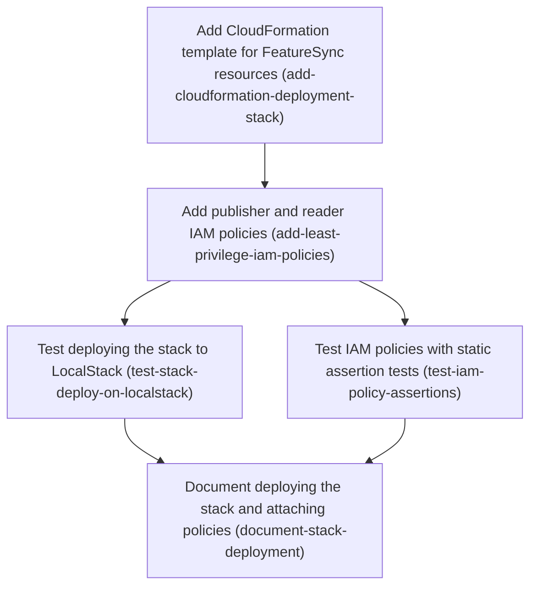

# Horizon 9 — AWS deployment stack

## 🎯 What are we trying to achieve?
Give users one CloudFormation template (AWS's built-in infrastructure-as-code format) that sets FeatureSync up in their own AWS account. It creates the S3 bucket for Snapshots, the SNS topic for Change Notifications, and one SQS queue per app with a dead-letter queue (DLQ), which catches messages that keep failing. It also defines ready-made least-privilege IAM policies for the CLI publisher and for reading apps. Done means: policy tests in CI fail on any extra or wildcard permission, the template really deploys on LocalStack and delivers a publish end to end, and a guide explains how to deploy it and attach the policies.

## 🧠 Why does this change need to happen?
FeatureSync's runtime pieces are finished, but nothing provisions the AWS resources. Today they're created by hand, the way the integration tests do it one SDK call at a time. Two questions have also stayed open. First, least-privilege IAM can't be proven on LocalStack, which doesn't enforce IAM. Second, it's unclear whether reporting an S3 403 (access denied) as "not found" hides real permission errors. Discovery showed that the second one is really a permissions question: without `s3:ListBucket`, S3 answers 403 for a missing key. So the right grants settle it without changing any code.

### At a glance
- **Phases:** 5
- **Complexity:** Medium
- **Main risk:** LocalStack can't prove IAM is enforced, so the policies are proven by static tests plus a manual check on real AWS. A policy that is too tight could also turn "not found" into "access denied".
- **Testing focus:** exact-match permission assertions, wildcard guards, both branches of the reader ListBucket parameter, a real template deploy on LocalStack with teardown

> **Revision 1 (2026-09-18, REPLAN):** every stack created its own bucket and topic, so "one stack per reading app" couldn't share snapshots. Added phase 5 **Add a queue-only mode that attaches to an existing bucket and topic** (`add-queue-only-stack-mode`); the docs phase is now phase 6, depends on it, and documents one full stack plus one queue-only stack per app. The roadmap JSON is the source of truth for both phases; the pre-revision plan is in `horizon-09-aws-deployment-stack-roadmap.rev0.json`.

## Order of work

1. **Add CloudFormation template for FeatureSync resources** — can start immediately
2. **Add publisher and reader IAM policies** — needs the template's resources to point the policies at
3. **Test IAM policies with static assertion tests** — needs the policies to exist
4. **Test deploying the stack to LocalStack** — needs the full template, including the policies
5. **Document deploying the stack and attaching policies** — documents the parameters, outputs and checks proven by the two test phases

(Phases 3 and 4 are independent of each other.)

### Phase 1 — Add CloudFormation template for FeatureSync resources
Technical ID: `add-cloudformation-deployment-stack` · Deployment Stack · infrastructure · medium

**Goal** — Provide one versioned Deployment Stack template that creates the Snapshot Bucket, Change Topic, one per-app Notification Queue with its Dead-Letter Queue (DLQ), and the queue policy that lets only the topic send. Result: packages/deploy/template/featuresync-stack.json: a valid CloudFormation template declaring bucket, topic, queue, DLQ, queue policy and subscription with parameters and outputs

**Why** — Today users must hand-create the S3 bucket, SNS topic and SQS queues (the integration tests do it imperatively). A plain CloudFormation JSON template (AWS's built-in infrastructure-as-code format) is chosen over AWS CDK because CDK on LocalStack needs cdklocal and a bootstrap step, breaking the binding decision that LocalStack is reached only via standard AWS SDK endpoint env config; a plain template outside src/ also avoids the 100% coverage and layer-lint rules and can be JSON.parsed by tests with zero new dependencies.

**Changes**
- Create packages/deploy as a pnpm workspace package holding only the template and its tests
- Declare the Snapshot Bucket with versioning on, block-all-public-access, SSE-S3 encryption and a bucket policy denying non-TLS requests (aws:SecureTransport false)
- Declare the Change Topic (SNS)
- Declare the Notification Queue and its DLQ with a RedrivePolicy whose maxReceiveCount comes from a parameter defaulting to 5 (per docs/spec/change-notification.md)
- Add a queue policy allowing only sns.amazonaws.com to sqs:SendMessage with Condition aws:SourceArn equal to the topic ARN
- Subscribe the queue to the topic with RawMessageDelivery as a parameter (the horizon-7 reader accepts raw and envelope shapes)
- Parameters for app name and env prefix; Outputs for bucket name, topic ARN, queue URL/ARN and DLQ ARN

**Files / areas**
- `packages/deploy/package.json (new workspace package, no runtime deps)`
- `packages/deploy/template/featuresync-stack.json (new)`
- `packages/deploy/tsconfig.json (new, mirrors packages/aws pattern)`

**How to verify**
- **Snapshot Bucket hardening** — In featuresync-stack.json the bucket has VersioningConfiguration.Status Enabled
- **Only the Change Topic can send to the queue** — AWS::SQS::QueuePolicy Principal is {"Service":"sns.amazonaws.com"}, not "*" or an AWS account
- **DLQ redrive wired and parameterized** — The queue's RedrivePolicy.deadLetterTargetArn is GetAtt of the DLQ Arn
- **Repeatable per app and env** — No BucketName/TopicName/QueueName is a literal string — each is omitted or built with Fn::Sub from the AppName/EnvPrefix parameters

**Done when** — packages/deploy/template/featuresync-stack.json: a valid CloudFormation template declaring bucket, topic, queue, DLQ, queue policy and subscription with parameters and outputs, and every check under *How to verify* passes its bar.

**Depends on** — nothing — can start immediately

Reference — full rubric

| Dimension | Rule | Pass criteria | Failure examples | Min |
|---|---|---|---|---|
| bucket-hardening | The Snapshot Bucket must be versioned, block all public access, be encrypted, and deny non-TLS requests. 10 = all four plus DeletionPolicy/UpdateReplacePolicy Retain on the bucket; 8 = all four settings present; minScore 8. | In featuresync-stack.json the bucket has VersioningConfiguration.Status Enabled PublicAccessBlockConfiguration sets all four flags (BlockPublicAcls, BlockPublicPolicy, IgnorePublicAcls, RestrictPublicBuckets) true BucketEncryption uses SSE-S3 (AES256) An AWS::S3::BucketPolicy has a Deny statement with Condition Bool aws:SecureTransport "false" covering both the bucket ARN and bucket ARN/* For 10: DeletionPolicy Retain and UpdateReplacePolicy Retain on the bucket so stack deletion never destroys snapshot history | The TLS Deny covers only arn:...:bucket/* and omits the bucket ARN itself, so ListBucket over plain HTTP is still allowed Only BlockPublicAcls and BlockPublicPolicy are set; IgnorePublicAcls and RestrictPublicBuckets are missing | 8 |
| topic-scoped-queue-policy | The queue policy must let only the SNS service send to the Notification Queue, and only for this stack's Change Topic. 10 = also exactly one action and no send permission on the DLQ; 8 = service principal + aws:SourceArn condition; minScore 8. | AWS::SQS::QueuePolicy Principal is {"Service":"sns.amazonaws.com"}, not "*" or an AWS account The only Action is sqs:SendMessage Condition ArnEquals aws:SourceArn is a Ref to this stack's topic, not a hardcoded ARN The subscription Endpoint is the queue ARN (GetAtt Arn) and RawMessageDelivery is a Ref to a parameter | Principal is "*" with a SourceArn condition — works, but lets any principal send if the condition key is absent Condition uses StringEquals with a hardcoded ARN string, so a second stack deploy points at the wrong topic | 8 |
| dlq-redrive-parameterized | The Notification Queue must redrive to its DLQ with maxReceiveCount taken from a parameter defaulting to 5. 10 = DLQ also retains messages longer than the source queue (e.g. 14 days); 8 = redrive + parameter; minScore 8. | The queue's RedrivePolicy.deadLetterTargetArn is GetAtt of the DLQ Arn RedrivePolicy.maxReceiveCount is a Ref to a Number parameter with Default 5 and MinValue ≥1 For 10: the DLQ MessageRetentionPeriod is longer than the source queue's | maxReceiveCount is hardcoded to 5, so users cannot tune it The DLQ is declared but the queue has no RedrivePolicy, so the DLQ never receives messages | 8 |
| multi-instance-safe | The template must deploy once per app/env in the same account without name collisions, and its Outputs must expose everything consumers need. 10 = no hardcoded physical names anywhere and parameters have AllowedPattern validation; 8 = names derived from parameters or CloudFormation-generated and all five Outputs present; minScore 7. | No BucketName/TopicName/QueueName is a literal string — each is omitted or built with Fn::Sub from the AppName/EnvPrefix parameters Outputs include bucket name, topic ARN, queue URL, queue ARN and DLQ ARN The template parses with JSON.parse and `aws cloudformation validate-template` (or cfn-lint) reports no errors packages/deploy/package.json has no runtime dependencies | QueueName derives from AppName but the DLQ name is fixed, so the second app's stack fails with AlreadyExists The EnvPrefix parameter has no AllowedPattern, so a trailing-slash value produces an S3 prefix like prod// | 7 |

**Healer hint:** Most likely failure: the TLS-deny statement or queue policy is scoped too loosely (bucket ARN missing, Principal "*"). Fix: list both the bucket ARN and bucket/* as resources, and use Principal Service sns.amazonaws.com with ArnEquals aws:SourceArn on Ref of the topic.

### Phase 2 — Add publisher and reader IAM policies
Technical ID: `add-least-privilege-iam-policies` · Deployment Stack · infrastructure · small

**Goal** — Add the Publisher Policy and Reader Policy to the Deployment Stack as managed IAM policies granting exactly the actions the SDK calls in packages/aws/src need, scoped to stack ARNs, and settle the 403-to-*_NOT_FOUND blocker by granting the publisher prefix-scoped s3:ListBucket rather than changing the horizon-6 isNotFound/isMissing split. Result: Publisher Policy and Reader Policy resources in featuresync-stack.json with no wildcard actions and resources limited to stack ARNs

**Why** — Users need ready-made, non-wildcard permissions for the CLI publisher and for reading apps. Without s3:ListBucket, S3 returns 403 Access Denied instead of 404 for a missing key; the publisher's isNotFound check deliberately ignores 403 (horizon-6 decision), so first publish and rollback-target checks would break. Granting ListBucket limited to the env prefixes fixes this without touching code or reopening that decision.

**Changes**
- Add Publisher Policy (AWS::IAM::ManagedPolicy): s3:GetObject+s3:PutObject on arn:...:bucket/<env>/*, s3:ListBucket on the bucket ARN with an s3:prefix condition for <env>/, sns:Publish on the topic ARN only
- Add Reader Policy: s3:GetObject on <env>/ keys, sqs:ReceiveMessage+sqs:DeleteMessage on this app's queue only; s3:ListBucket optional since isMissing already maps 403 to *_NOT_FOUND
- Export both policy ARNs as stack Outputs
- Rewrite the IAM snippets in docs/spec/s3-layout.md to match the template and link to it as single source of truth
- Record the decision: 403 mapping unchanged; publisher/pull principals get prefix-scoped s3:ListBucket; note in the decision that the 403→not-found behaviour is proven only by the manual real-AWS recipe, since LocalStack does not enforce IAM
- Add a boolean parameter (default false) that adds prefix-scoped s3:ListBucket to the Reader Policy, so a CI principal running `featuresync pull` gets SNAPSHOT_NOT_FOUND instead of ACCESS_DENIED for a missing version; document which policy a pull principal attaches

**Files / areas**
- `packages/deploy/template/featuresync-stack.json`
- `docs/spec/s3-layout.md (IAM section lines ~77-113 point to the stack policies)`
- `docs/roadmaps/featuresync/decisions.md (step inside the phase: record the 403 resolution)`

**How to verify**
- **Actions match the SDK calls** — Publisher Policy actions are exactly s3:GetObject, s3:PutObject, s3:ListBucket, sns:Publish
- **Scoped to stack ARNs and the env prefix** — The resource for s3:GetObject/PutObject is Fn::Sub '${Bucket.Arn}/${EnvPrefix}/*', not bucket/*
- **Pull-principal ListBucket parameter works both ways** — A Conditions entry uses Fn::Equals on the parameter against "true"
- **Spec and decision record match the template** — The IAM section of s3-layout.md lists the same actions/resources as the template, or points to it

**Done when** — Publisher Policy and Reader Policy resources in featuresync-stack.json with no wildcard actions and resources limited to stack ARNs, and every check under *How to verify* passes its bar.

**Depends on** — Add CloudFormation template for FeatureSync resources

Reference — full rubric

| Dimension | Rule | Pass criteria | Failure examples | Min |
|---|---|---|---|---|
| exact-action-sets | Each policy must grant exactly the actions packages/aws/src calls — no wildcards, nothing extra. 10 = each statement is a separate Sid tied to one SDK call; 8 = exact action sets; minScore 8. | Publisher Policy actions are exactly s3:GetObject, s3:PutObject, s3:ListBucket, sns:Publish Reader Policy actions are exactly s3:GetObject, sqs:ReceiveMessage, sqs:DeleteMessage, plus s3:ListBucket only under the pull parameter No Action contains "*" (e.g. s3:* or s3:Get*) A grep for SDK Command classes in packages/aws/src/infrastructure finds none whose action is missing from a policy | The Reader Policy adds sqs:GetQueueAttributes "just in case" though no code calls it s3:GetObjectVersion is added for rollback although the code reads by key, not by version | 8 |
| resource-and-prefix-scoping | Object actions must be limited to <env>/* and ListBucket limited by an s3:prefix condition. 10 = the condition also covers the prefix itself (<env>/ and <env>/*); 8 = prefix-scoped; minScore 8. | The resource for s3:GetObject/PutObject is Fn::Sub '${Bucket.Arn}/${EnvPrefix}/*', not bucket/* s3:ListBucket is on the bucket ARN with Condition StringLike s3:prefix '${EnvPrefix}/*' sns:Publish is on Ref of the topic; the sqs actions are on GetAtt of the queue Arn, not the DLQ Both policy ARNs appear in Outputs | ListBucket has no s3:prefix condition, so the publisher can list other envs' keys The Reader Policy's sqs resource includes the DLQ ARN, letting a reader consume dead-lettered messages | 8 |
| reader-listbucket-toggle | A boolean parameter (default false) must add prefix-scoped ListBucket to the Reader Policy only when it is true. 10 = implemented with a Fn::If/AWS::NoValue conditional statement and the parameter's AllowedValues restricted; 8 = both branches correct; minScore 7. | A Conditions entry uses Fn::Equals on the parameter against "true" With the parameter false, the Reader Policy contains no s3:ListBucket (resolves through Fn::If to AWS::NoValue) With it true, the added statement carries the same s3:prefix condition as the publisher's | Fn::If returns an empty object {} instead of AWS::NoValue, creating a statement with no action that CloudFormation rejects The conditional ListBucket statement omits the s3:prefix condition | 7 |
| decision-and-spec-sync | docs/spec/s3-layout.md and decisions.md must describe the same policies as the template and record the 403 resolution. 10 = the spec points to the template instead of repeating JSON that can drift; 8 = consistent content; minScore 7. | The IAM section of s3-layout.md lists the same actions/resources as the template, or points to it decisions.md records: 403 mapping unchanged; publisher/pull principals get prefix-scoped s3:ListBucket; proven only by the manual real-AWS recipe because LocalStack does not enforce IAM s3-layout.md has no leftover s3:* or Resource "*" snippets | The old spec snippet stays, granting s3:ListBucket on the whole bucket with no prefix condition, contradicting the template The decision entry omits that LocalStack cannot prove the 403 behaviour | 7 |

**Healer hint:** Most likely failure: the Fn::If for the reader ListBucket returns {} instead of AWS::NoValue, or the s3:prefix condition is missing. Fix: wrap the statement in Fn::If with AWS::NoValue as the false branch and copy the publisher's StringLike s3:prefix condition.

### Phase 3 — Test IAM policies with static assertion tests
Technical ID: `test-iam-policy-assertions` · Deployment Stack · cross-cutting · small

**Goal** — Add Policy Assertion Tests that run in the existing verify CI job with no AWS credentials, pinning the exact actions, resources and conditions of every policy in the template — the CI proof of least privilege because LocalStack does not reliably enforce IAM. Result: packages/deploy/test/stack-policies.test.ts passing inside pnpm verify

**Why** — LocalStack does not reliably enforce IAM, so a deploy there cannot prove the policies are tight. The CI proof is instead to read the template JSON in a unit test and assert the exact permission sets, so a later edit adding a wildcard or an extra action fails the build. This closes the IAM-verification-under-LocalStack blocker together with a manual real-AWS check documented later.

**Changes**
- Load the template with JSON.parse and locate each IAM policy and the queue policy
- Assert the Publisher Policy action set is exactly {s3:GetObject, s3:PutObject, s3:ListBucket, sns:Publish} and s3:ListBucket carries the s3:prefix condition
- Assert the Reader Policy action set is exactly {s3:GetObject, sqs:ReceiveMessage, sqs:DeleteMessage} with resources referencing only stack resources
- Assert no statement uses '*' as action or resource, and the queue policy requires aws:SourceArn equal to the topic
- Assert the DLQ RedrivePolicy exists and maxReceiveCount defaults to 5
- Assert every s3:ListBucket grant (publisher, and reader when the pull parameter is on) carries an s3:prefix condition limited to <env>/ and is absent from the reader when the parameter is off

**Files / areas**
- `packages/deploy/test/stack-policies.test.ts (new)`
- `vitest.config.ts (add packages/deploy project if auto-pickup misses it)`

**How to verify**
- **Exact equality, not containment** — Each policy's actions are flattened across all statements and compared with toEqual on a sorted array or Set, not toContain/arrayContaining
- **Wildcard and condition guards cover every policy** — Policies are found by filtering Resources on Type (AWS::IAM::ManagedPolicy, AWS::SQS::QueuePolicy, AWS::S3::BucketPolicy), not by fixed logical IDs alone
- **Both reader-parameter branches tested** — A test asserts that with the parameter false (default) the reader has no s3:ListBucket
- **Runs in pnpm verify with no credentials** — `pnpm verify` output lists stack-policies.test.ts

**Done when** — packages/deploy/test/stack-policies.test.ts passing inside pnpm verify, and every check under *How to verify* passes its bar.

**Depends on** — Add publisher and reader IAM policies

Reference — full rubric

| Dimension | Rule | Pass criteria | Failure examples | Min |
|---|---|---|---|---|
| exact-set-equality | Tests must compare each policy's full action set to the expected set so any extra action fails. 10 = actions normalized first (string treated as one-item array, sorted) then compared with toEqual; 8 = exact comparison; minScore 8. | Each policy's actions are flattened across all statements and compared with toEqual on a sorted array or Set, not toContain/arrayContaining A helper handles Action written as either a string or an array Hand-adding sqs:GetQueueAttributes to the Reader Policy makes a test fail | expect(actions).toContain('s3:GetObject') still passes after s3:DeleteObject is added Only Statement[0] is checked, so a wildcard in a second statement goes unnoticed | 8 |
| wildcard-and-condition-guards | Every policy-shaped resource must be checked for "*" or partial-wildcard actions, the queue policy's aws:SourceArn, and s3:prefix on every ListBucket. 10 = policies are found by resource Type so a newly added policy is covered automatically; 8 = all current policies checked; minScore 8. | Policies are found by filtering Resources on Type (AWS::IAM::ManagedPolicy, AWS::SQS::QueuePolicy, AWS::S3::BucketPolicy), not by fixed logical IDs alone Any action matching /\*/ fails, not only an action exactly equal to "*" A test asserts the queue policy's aws:SourceArn condition references the topic A test asserts every ListBucket carries an s3:prefix condition | The wildcard check rejects only exactly "*", so s3:Get* passes The exemption for the bucket-policy Deny statement's Resource "*" also skips the Allow statements, missing a "*" there | 8 |
| parameter-branch-coverage | Tests must cover both values of the Reader ListBucket parameter and the default maxReceiveCount of 5. 10 = a small resolver evaluates Fn::If/Conditions per branch; 8 = both branches asserted in some way; minScore 7. | A test asserts that with the parameter false (default) the reader has no s3:ListBucket A test asserts that with it true, ListBucket appears with an s3:prefix condition A test asserts the DLQ RedrivePolicy exists and the maxReceiveCount parameter Default is 5 | Only the Fn::If structure is inspected, so swapped true/false branches still pass The redrive test checks the parameter exists but not that its Default is 5 | 7 |
| runs-in-verify-offline | The suite must be picked up by the existing verify job and make no network or AWS calls. 10 = it also fails loudly if the template path moves; 8 = runs in verify; minScore 8. | `pnpm verify` output lists stack-policies.test.ts The test imports no @aws-sdk client and passes with AWS_* env unset The template is read from a path relative to the test file (new URL or path.resolve(__dirname)) | The vitest workspace glob misses packages/deploy, so the file never runs and CI stays green The template path depends on process.cwd(), so the test passes from the root but fails from the package directory | 8 |

**Healer hint:** Most likely failure: containment checks, or a wildcard check matching only exact "*", let extra actions or s3:Get* slip through. Fix: flatten each policy's actions into a sorted array compared with toEqual, and fail on any action matching /\*/.

### Phase 4 — Test deploying the stack to LocalStack
Technical ID: `test-stack-deploy-on-localstack` · Deployment Stack · cross-cutting · medium

**Goal** — Deploy the template to LocalStack via @aws-sdk/client-cloudformation CreateStack using only AWS SDK endpoint env config, then prove publish → push notification reaches the app's queue using the stack's outputs. Result: deployment-stack.localstack.test.ts passing in the CI localstack job

**Why** — The template must actually deploy and work end to end, not just look right. The existing integration tests build resources one SDK call at a time; this test deploys the real template instead and reuses the push-detection flow against its resources, so no LocalStack-specific code path is added.

**Changes**
- Check whether the pinned licensed LocalStack image (2026.08.3) enforces IAM (ENFORCE_IAM=1); if it does, add a negative case where a Reader Policy principal's PutObject is denied; if not, record the finding in the 403/IAM decision entry and in discoveries.md
- Add cloudformation, iam and sts to LocalStack SERVICES and the healthcheck
- Set AWS_ENDPOINT_URL_CLOUDFORMATION (and IAM/STS) in the CI localstack job, same as the S3/SNS/SQS endpoints
- Create the stack from featuresync-stack.json, wait for CREATE_COMPLETE, read Outputs
- Publish a snapshot to the output bucket/topic and assert the reader's queue receives the Change Notification and the source loads the new version
- Delete the stack in afterAll

**Files / areas**
- `packages/aws/integration/deployment-stack.localstack.test.ts (new, modelled on push-detection.localstack.test.ts)`
- `packages/aws/package.json (devDependency @aws-sdk/client-cloudformation)`
- `docker/docker-compose.yml (SERVICES + healthcheck add cloudformation, iam, sts)`
- `.github/workflows/ci.yml (localstack job env adds AWS_ENDPOINT_URL_CLOUDFORMATION)`

**How to verify**
- **Deploys the actual template via SDK** — TemplateBody is read from packages/deploy/template/featuresync-stack.json, not an inline copy
- **Publish-to-queue flow uses only the Outputs** — Bucket name, topic ARN and queue URL come from DescribeStacks Outputs, with no literal names
- **Repeatable and cleans up** — The stack name and AppName parameter include a random or timestamp suffix
- **IAM enforcement premise checked** — The test or a documented probe runs with ENFORCE_IAM=1 against the pinned image

**Done when** — deployment-stack.localstack.test.ts passing in the CI localstack job, and every check under *How to verify* passes its bar.

**Depends on** — Add publisher and reader IAM policies

**Rollback** — Revert the docker-compose SERVICES change and CI env lines; the test file is standalone.

Reference — full rubric

| Dimension | Rule | Pass criteria | Failure examples | Min |
|---|---|---|---|---|
| real-template-deploy | The test must run CreateStack on featuresync-stack.json as it exists on disk, using only standard AWS_ENDPOINT_URL_* env config. 10 = also asserts final stack status and prints the failure reason on error; 8 = deploys and waits; minScore 8. | TemplateBody is read from packages/deploy/template/featuresync-stack.json, not an inline copy No `endpoint:` is hardcoded in client config; AWS_ENDPOINT_URL_CLOUDFORMATION/IAM/STS are set in ci.yml It waits with waitUntilStackCreateComplete (or equivalent) and reads Outputs docker-compose SERVICES and the healthcheck include cloudformation, iam, sts | The test passes endpoint: 'http://localhost:4566' to the client, adding a LocalStack-only code path On CREATE_FAILED the test times out without printing the stack events | 8 |
| end-to-end-via-outputs | The publish and push-detection steps must take every resource identifier from the stack Outputs. 10 = also asserts the loaded version number; 8 = notification received and loaded; minScore 8. | Bucket name, topic ARN and queue URL come from DescribeStacks Outputs, with no literal names A published snapshot produces a Change Notification on the Output queue The snapshot source loads the new version (the assertion compares the version value) | The test reuses the queue from the older push-detection setup instead of the stack's queue It asserts only that a message arrived, not that the source loaded the new version | 8 |
| isolation-and-teardown | Repeated or parallel runs must not collide, and the stack must be removed even when the test fails. 10 = the bucket is emptied before DeleteStack and the delete is awaited; 8 = unique names + afterAll delete; minScore 7. | The stack name and AppName parameter include a random or timestamp suffix afterAll runs DeleteStack even if creation failed, guarding against an undefined stack ID Because the bucket is versioned, afterAll empties all object versions before DeleteStack (or handles the Retain policy) | DeleteStack fails with BucketNotEmpty because versioned objects remain, and the next run collides on names afterAll throws when beforeAll failed, hiding the real error | 7 |
| iam-enforcement-premise-checked | The phase must verify, not assume, whether the pinned LocalStack image enforces IAM, and act on the result. 10 = enforcement probed and a negative reader-PutObject case added when supported; 8 = premise checked and outcome recorded; minScore 7. | The test or a documented probe runs with ENFORCE_IAM=1 against the pinned image If enforced: a Reader Policy principal's PutObject fails with AccessDenied in the LocalStack test If not enforced: the outcome is recorded in decisions.md/discoveries.md with the image version | The phase repeats 'LocalStack does not enforce IAM' without running any probe on the licensed image ENFORCE_IAM is turned on globally and breaks the existing integration suites that use test credentials | 7 |

**Healer hint:** Most likely failure: teardown breaks on the versioned bucket, or the stack name collides between runs. Fix: add a unique suffix to the stack name and AppName, and delete all object versions before DeleteStack in a guarded afterAll.

### Phase 5 — Document deploying the stack and attaching policies
Technical ID: `document-stack-deployment` · Deployment Stack · interface · small

**Goal** — Write a guide to deploying the Deployment Stack into the user's own AWS account, attaching the Publisher Policy and Reader Policy to principals, one queue per reading app, why the DLQ is required, and a manual real-AWS least-privilege verification recipe. Result: docs/deploy.md deployment and policy-attachment guide, linked from README.md

**Why** — Users need to know how to deploy the template, wire its outputs into the CLI (--topic-arn / FEATURESYNC_TOPIC_ARN) and createS3SnapshotSource, and understand that a failed push load is redelivered until the DLQ catches it. The manual real-AWS check is the second half of closing the IAM-verification blocker, since CI has no real-AWS credentials.

**Changes**
- Describe deploying with aws cloudformation deploy or the SDK, with parameters (app name, env prefix, maxReceiveCount, raw delivery)
- Show attaching the Publisher Policy to the CLI's role/user and the Reader Policy to each app's role
- Explain that each reading app needs its own stack instance/queue and why the DLQ with maxReceiveCount is mandatory
- Add a manual real-AWS verification recipe: publisher succeeds, reader cannot PutObject, missing version reports SNAPSHOT_NOT_FOUND for the publisher/pull principal

**Files / areas**
- `docs/deploy.md (new)`
- `README.md (link + short deploy section)`
- `docs/spec/change-notification.md (link to the stack for the DLQ setup)`

**How to verify**
- **Deploy commands match the template** — The aws cloudformation deploy command includes --capabilities CAPABILITY_NAMED_IAM or CAPABILITY_IAM (required because the stack creates IAM policies)
- **Which principal gets which policy** — The CLI publisher gets the Publisher Policy; each app role gets the Reader Policy
- **Real-AWS verification recipe** — Publisher publish succeeds (command and expected output shown)

**Done when** — docs/deploy.md deployment and policy-attachment guide, linked from README.md, and every check under *How to verify* passes its bar.

**Depends on** — Test deploying the stack to LocalStack, Test IAM policies with static assertion tests

Reference — full rubric

| Dimension | Rule | Pass criteria | Failure examples | Min |
|---|---|---|---|---|
| copy-pasteable-deploy | The guide's deploy command must run as written, using the template's real parameter and Output names. 10 = also shows fetching Outputs with describe-stacks --query; 8 = correct command with all parameters; minScore 8. | The aws cloudformation deploy command includes --capabilities CAPABILITY_NAMED_IAM or CAPABILITY_IAM (required because the stack creates IAM policies) Every parameter-overrides key matches a Parameters key in featuresync-stack.json The guide maps Outputs to --topic-arn / FEATURESYNC_TOPIC_ARN and to the createS3SnapshotSource options | --capabilities is missing, so the command fails with InsufficientCapabilities The guide says MaxReceiveCount while the template parameter is named MaxReceiveCountParam | 8 |
| policy-attachment-guidance | The guide must say plainly which policy each principal attaches, including the pull-principal case. 10 = an attach-role-policy example per principal; 8 = clear mapping; minScore 7. | The CLI publisher gets the Publisher Policy; each app role gets the Reader Policy A CI `featuresync pull` principal is told to enable the reader ListBucket parameter to get SNAPSHOT_NOT_FOUND It explains one stack instance (queue) per reading app, and why the DLQ and maxReceiveCount are mandatory | The pull principal isn't mentioned, so CI sees ACCESS_DENIED for a missing version It says apps may share a queue, contradicting the one-queue-per-app design | 7 |
| manual-least-privilege-recipe | The recipe must give concrete commands and expected results that prove the policies on real AWS, closing the IAM-verification blocker. 10 = an expected error code for each negative check; 8 = all three checks covered; minScore 8. | Publisher publish succeeds (command and expected output shown) A reader PutObject is denied with AccessDenied A missing version reports SNAPSHOT_NOT_FOUND for the publisher/pull principal It states that LocalStack cannot substitute for this check | Only the positive path (publisher succeeds) is checked, with no negative reader check The missing-version check runs as an admin user, which proves nothing about the policy | 8 |

**Healer hint:** Most likely failure: the deploy command omits --capabilities CAPABILITY_NAMED_IAM, or parameter names differ from the template. Fix: copy parameter keys straight from featuresync-stack.json and run the negative checks as the scoped principals, not an admin.

## Discovery Findings

| Area | Finding | File | Implication |
|---|---|---|---|
| S3 SDK calls | packages/aws/src sends only GetObjectCommand (s3-read.ts readObjectText, optional IfNoneMatch), PutObjectCommand (publisher, conditional) and PublishCommand (sns-change-notifier.ts). No HeadObject/ListObjects/DeleteObject in src. | packages/aws/src/infrastructure/s3-read.ts | Publisher S3 = s3:GetObject+s3:PutObject; reader = s3:GetObject (ListBucket optional). No Delete/Acl/wildcards; assertion tests pin exact sets. |
| Publisher conditional writes | Writes <env>/snapshots/<n>.json IfNoneMatch '*', <env>/current.json IfMatch etag (IfNoneMatch '*' first publish); reads current.json first. Rollback isNotFound -> INVALID_ROLLBACK_TARGET (line 192); missing pointer treated undefined (line 129). | packages/aws/src/infrastructure/s3-snapshot-publisher.ts | Without s3:ListBucket first publish and bad-rollback get 403 which isNotFound does not match -> publisher fails. Publisher policy needs s3:ListBucket (prefix-scoped) or code must change. |
| S3 key layout | docs/spec/s3-layout.md: <env>/snapshots/<n>.json immutable, <env>/current.json mutable; env prefix has no '/'. Lines 77-113 already document reader/pull/publisher IAM JSON snippets. | docs/spec/s3-layout.md | Derive resource ARNs from layout; keep spec IAM section consistent with or pointing to stack policies. |
| 403 handling | s3-read.ts: isNotFound = NoSuchKey/404; isMissing = isNotFound OR AccessDenied/403 (comment: GetObject-only perms give 403 for missing key). isMissing used only by s3-snapshot-source.ts:75 (-> *_NOT_FOUND with cause). Fetcher has isAccessDenied -> ACCESS_DENIED. | packages/aws/src/infrastructure/s3-read.ts | Horizon-6 split holds; reader without ListBucket works. 403 decision candidate: keep split + stack grants prefix-scoped s3:ListBucket to publisher/pull. Any mapping change = new decision. |
| pull 403 | s3-snapshot-fetcher.ts maps 404->SNAPSHOT_NOT_FOUND, 403->ACCESS_DENIED; spec says pull role reports missing version as access denied unless s3:ListBucket with <env>/snapshots/ prefix condition. | packages/aws/src/infrastructure/s3-snapshot-fetcher.ts | Publisher/CLI policy includes s3:ListBucket on bucket ARN with s3:prefix condition; assertion test checks it. |
| SNS/SQS SDK calls | sns-change-notifier sends only PublishCommand. sqs-notification-queue sends only ReceiveMessageCommand and DeleteMessageCommand; failed load leaves message for redelivery. | packages/aws/src/infrastructure/sqs-notification-queue.ts | Publisher sns:Publish on topic only; reader sqs:ReceiveMessage+DeleteMessage on own queue only. DLQ required since failed loads never deleted. |
| Change-notification spec | Queue policy must allow topic to sqs:SendMessage; raw or envelope delivery both accepted (lines 43-46, 98); DLQ maxReceiveCount e.g. 5 recommended (lines 92-93). | docs/spec/change-notification.md | Queue policy: Allow sns.amazonaws.com sqs:SendMessage, Condition aws:SourceArn=topic. maxReceiveCount default 5, parameterised. |
| Integration tests | 4 *.localstack.test.ts files create resources imperatively via SDK (CreateBucket, CreateTopic, CreateQueue, SetQueueAttributes, Subscribe, ...). No IaC. | packages/aws/integration/push-detection.localstack.test.ts | Stack proof = new localstack test deploying template via @aws-sdk/client-cloudformation CreateStack with AWS_ENDPOINT_URL and reading outputs; model on push-detection. |
| LocalStack setup | docker/docker-compose.yml pins localstack/localstack:2026.08.3, requires LOCALSTACK_AUTH_TOKEN (licensed image), SERVICES=s3,sns,sqs; healthcheck greps only those. | docker/docker-compose.yml | Must add cloudformation (+iam, sts) to SERVICES and healthcheck. IAM enforcement premise to be checked against auth-token tier; static assertion tests remain CI proof. |
| CI | ci.yml: verify job (pnpm verify: build, typecheck, lint, test+coverage, example:node-local); localstack job sets AWS_ENDPOINT_URL_S3/SNS/SQS, us-east-1, test creds, fails without token, docker compose up --wait, pnpm test:integration. | .github/workflows/ci.yml | Add AWS_ENDPOINT_URL_CLOUDFORMATION (or generic) env. Assertion tests run in verify with no creds. |
| Workspace | pnpm-workspace packages/*, examples/*; packages aws, cli, core, nestjs. Root package.json has explicit per-package build chains in verify/test:integration. tsconfig.base.json only. No CDK/CloudFormation deps. | package.json | New packages/deploy auto-picked by workspace and vitest projects; add build to verify only if needed; follow packages/aws tsconfig pattern. |
| Coverage | vitest.config.ts: one project per package, excludes integration/**, coverage packages/*/src/**/*.ts at 100% all metrics. aws integration config: integration/**/*.localstack.test.ts, forwards AWS_* env, no coverage, 30s timeouts. | vitest.config.ts | Template code in src/ must be 100% covered; a plain CloudFormation template outside src/ (e.g. packages/deploy/template/) avoids coverage pressure and tests can load it. |
| ESLint | import-x/no-restricted-paths layer rules on packages/*/src/{domain,application}; lint is 'eslint . --max-warnings=0'. | eslint.config.js | Flat template + small policy/test module avoids layer friction; generated output (cdk.out) would need ignoring. |
| Existing IaC | No CDK/CloudFormation/Terraform files or deps anywhere. |  | Greenfield IaC; plain CloudFormation template deployed via @aws-sdk/client-cloudformation fits 'LocalStack only via SDK env config' better than CDK (needs cdklocal/bootstrap). |
| Docs | README.md mentions deploy/IAM; docs/spec has s3-layout.md (IAM snippets), change-notification.md, evaluation-semantics.md. Node 22. | README.md | Deploy/attach docs update README and cross-link spec IAM sections as single source of truth. |

## Out of Scope

- Real-AWS automated tests in CI — no credentials provisioned.
- Dashboard/UI — separate future package.
- Lambda publisher/validator — CLI is single writer (horizon-4 decision).
- Multi-account/multi-region/cross-account — single user-owned account.
- DLQ redrive tooling or CloudWatch alarms — follow-up.
- Customer-managed KMS keys — adds IAM surface.
- Terraform/Pulumi variants — one IaC flavour first.
- Changes to snapshot format, pointer contract, or SnapshotSource port — binding contracts.
- Remaining horizon-7 blockers unrelated to deployment/IAM.
- npm publishing/release automation.
- CI OIDC role setup for user pipelines.
- AWS CDK package variant — YAGNI: needs cdklocal/bootstrap, conflicts with SDK-env-only LocalStack decision
- 'featuresync deploy' CLI command — YAGNI: no user need; AWS CLI/SDK already deploys a template

## Success Criteria

- Versioned IaC template (bucket, topic, per-app queue+DLQ with parameterised maxReceiveCount, topic-only queue policy, publisher+reader IAM policies, outputs); least-privilege policies with no wildcard actions/resources beyond stack ARNs; policy-assertion tests in existing CI plus decision + manual real-AWS recipe; 403 blocker resolved by a recorded decision plus prefix-scoped s3:ListBucket grants (publisher always, reader via parameter), horizon-6 isNotFound/isMissing split unchanged and no runtime code change; template deploys to LocalStack via SDK env config only and push proof passes against stack resources; all CI gates green (100% coverage, ESLint layers, typecheck, LocalStack job); deploy/attach docs incl. why DLQ is required.
- Add CloudFormation template for FeatureSync resources: packages/deploy/template/featuresync-stack.json: a valid CloudFormation template declaring bucket, topic, queue, DLQ, queue policy and subscription with parameters and outputs
- Add publisher and reader IAM policies: Publisher Policy and Reader Policy resources in featuresync-stack.json with no wildcard actions and resources limited to stack ARNs
- Test IAM policies with static assertion tests: packages/deploy/test/stack-policies.test.ts passing inside pnpm verify
- Test deploying the stack to LocalStack: deployment-stack.localstack.test.ts passing in the CI localstack job
- Document deploying the stack and attaching policies: docs/deploy.md deployment and policy-attachment guide, linked from README.md

## Alignment Preview
The user accepted the first preview (no redirect) and asked for both proposed fixes: an optional parameter that gives the reader policy a prefix-scoped `ListBucket` for `featuresync pull` principals, and an assertion that every `ListBucket` is prefix-limited, with a note that the 403 behaviour is proven only on real AWS. The user also confirmed the switch from AWS CDK to plain CloudFormation JSON.

## Quality Gate
Full path, one iteration. The critic passed the roadmap with 0 blockers, 2 major issues and 8 minor issues. No verification call was needed.
- **Healed (major):** the success criterion promised code or test changes for the 403 question, but the fix is a permissions grant with no code change. The criterion was reworded to match.
- **Healed (major):** the plan assumed LocalStack doesn't enforce IAM, but the pinned image is the licensed tier. Phase 4 now checks for IAM enforcement and adds a denied-write test if enforcement is available. A rubric dimension was added for this.
- **Accepted debt (minor):** the policy tests don't yet check the bucket's TLS-deny rule or its public-access flags. Phase 4's test reads the template from another package without saying how the path is resolved.
- **Verdict:** passed.

The two heals were applied directly by the orchestrator against the critic's named fixes. No separate healer Agent call was made, and the critic wasn't re-run.

## Cost
6 Agent calls (Stage 1, Discovery, Stage 3, preview concerns, Stage 4, critic) against a budget of 8–10. Stage 3.5, the verification call and the healer call were not needed.

## Full analysis

**Domain shape:** technical — Infrastructure provisioning and IAM policy authoring for existing runtime components; no new flag/targeting/snapshot domain rules.

| Term | Meaning |
|---|---|
| Deployment Stack | Versioned infrastructure template provisioning every FeatureSync AWS resource in the user's account, exposing names/ARNs as outputs. |
| Snapshot Bucket | S3 bucket holding immutable versioned snapshots and the current.json Current Pointer. |
| Change Topic | SNS topic the publisher notifies after publish/rollback. |
| Notification Queue | Per-app SQS queue subscribed to the Change Topic; only the topic may send. |
| Dead-Letter Queue (DLQ) | SQS queue receiving messages after maxReceiveCount failed receives. |
| Publisher Policy | Least-privilege IAM policy for the CLI principal. |
| Reader Policy | Least-privilege IAM policy for a reading app. |
| Policy Assertion Test | CI unit test asserting exact IAM actions/resources/conditions in the template. |

**Assumptions**
- IaC tool: AWS CDK in TypeScript as a new workspace package; plain CloudFormation YAML fallback.
- S3 layout contract (snapshot keys + current.json) fixed; IAM ARNs derived from it.
- Per-app queue is an instantiable construct/parameterised stack, one per reading app.
- SNS subscription uses the RawMessageDelivery shape the horizon-7 reader accepts.
- Least-privilege blocker resolved by static policy-assertion tests in CI plus documented manual real-AWS check; no real-AWS creds in CI.
- Bucket defaults: versioning on, block public access, SSE-S3, enforce TLS.
- No customer-managed KMS.

**Risks**
- LocalStack Community does not enforce IAM; assertions prove intent only.
- Too-tight policies break code paths: without s3:ListBucket missing keys return 403, interacting with isMissing/isNotFound.
- Changing source 403 behaviour reopens horizon-6 decision; must be recorded as a new decision.
- CDK deps may strain 100% coverage and layer ESLint rules; package may need own coverage scope.
- CDK deploy on LocalStack (cdklocal/bootstrap) may need tooling beyond SDK env config, violating decision; fallback: deploy synthesized template via CloudFormation API with AWS_ENDPOINT_URL.
- LocalStack CI job fails (never skips) on fork PRs.
- Too-low maxReceiveCount default sends transient failures to DLQ.
- Open horizon-7 blockers (RawMessageDelivery shapes, poison messages) may surface against stack-created subscriptions.
