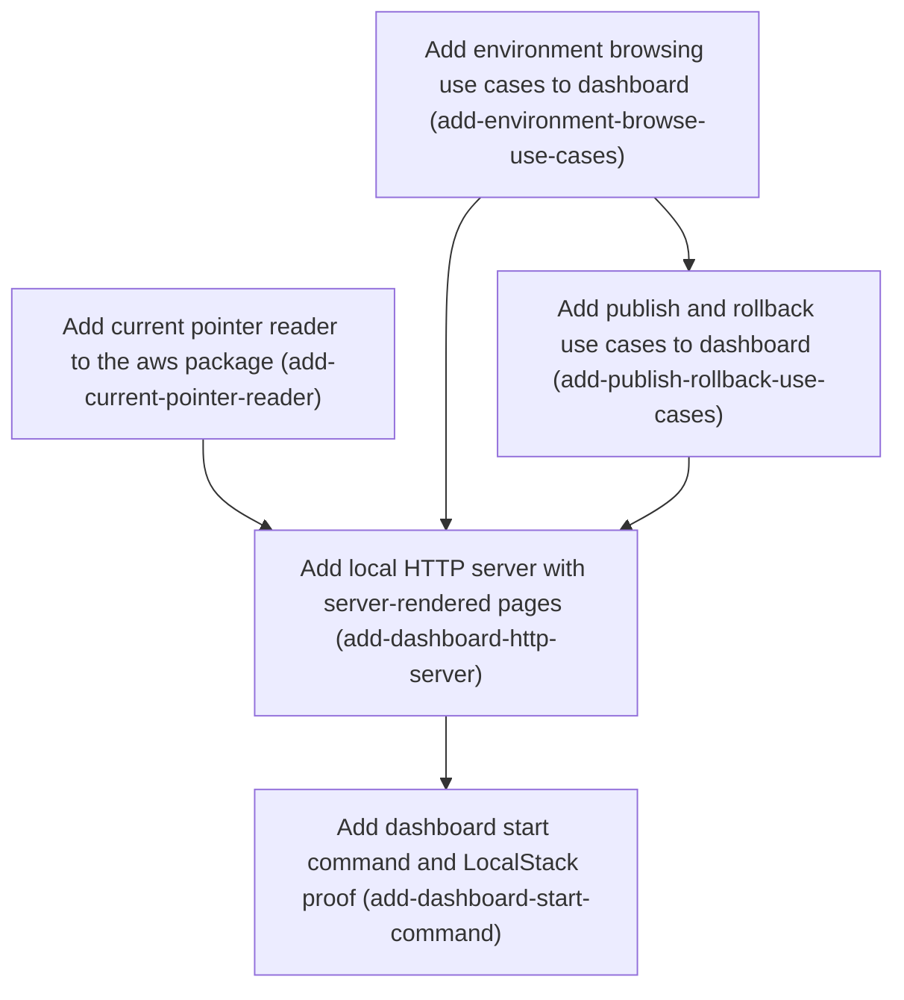

# Horizon 10 — Local dashboard, first slice

## 🎯 What are we trying to achieve?

Add a small web dashboard that runs on the operator's own machine. You pick an environment, see which snapshot version is live and which flags it contains, look at earlier versions, publish a new snapshot by pasting its JSON, or roll back to an earlier version. It is production quality: fully tested, lint-clean, part of `pnpm verify`, and proven end to end against LocalStack (a local AWS emulator).

## 🧠 Why does this change need to happen?

FeatureSync can already store, publish, pull and push snapshots, but only through the CLI and code. The dashboard is the one part of the project vision that isn't built yet. It must not become a second way to write to S3. Every write goes through the existing publisher so the "one writer" rule holds. Browsing needs a public way to read which version is current, and that doesn't exist yet.

## At a glance

- **Phases:** 5
- **Complexity:** Medium. It's a new package, but every piece is small and reuses existing aws/core code.
- **Main risk:** after a rollback the next publish fails with "version exists" (existing publisher behaviour). The dashboard explains this but does not fix it.
- **Target:** 100% line/branch/function/statement coverage, `eslint --max-warnings=0`, LocalStack proof under `test:integration` only.
- **Testing focus:** error semantics (missing vs failing), layer purity (no AWS SDK in use cases), write-path security (Origin check, HTML escaping, no secret leaks), build-chain wiring.

## Order of work

1. **Add current pointer reader to the aws package**: can start immediately
2. **Add environment browsing use cases to dashboard**: can start immediately
3. **Add publish and rollback use cases to dashboard**: needs Add environment browsing use cases to dashboard
4. **Add local HTTP server with server-rendered pages**: needs Add current pointer reader to the aws package, Add environment browsing use cases to dashboard, Add publish and rollback use cases to dashboard
5. **Add dashboard start command and LocalStack proof**: needs Add local HTTP server with server-rendered pages

### Phase 1 — Add current pointer reader to the aws package

Technical ID: `add-current-pointer-reader` · Snapshot Storage (@featuresync/aws) · infrastructure · small

**Goal:** Export a one-shot, read-only reader from @featuresync/aws that returns the Current Pointer version for an Environment, or undefined when the Environment has no snapshots yet.

**Why:** The dashboard has to know the current Snapshot Version to list versions 1..current. Today the only code that reads <env>/current.json is internal to @featuresync/aws or a polling subscription; without a public reader the dashboard would have to copy S3 and pointer-parsing logic.

**Changes:**
- Add createS3CurrentPointerReader({bucket, client?}) with read(environment): Promise<number | undefined>, reusing internal parseCurrentPointer (domain/current-pointer.ts) and s3-read.ts helpers.
- Resolve undefined when current.json is missing; throw S3FetchError with existing reasons (INVALID_ENVIRONMENT, ACCESS_DENIED, REQUEST_FAILED) otherwise, and a clear error for a malformed pointer.
- Export the factory and its types from packages/aws/src/index.ts.
- Add unit tests at 100% coverage and a LocalStack test covering empty Environment, after Publish, and after Rollback.

**Files / areas:**
- `packages/aws/src/infrastructure/s3-current-pointer-reader.ts`
- `packages/aws/src/infrastructure/s3-current-pointer-reader.test.ts`
- `packages/aws/src/index.ts`
- `packages/aws/integration/s3-current-pointer-reader.localstack.test.ts`

**How to verify:**
- **Missing pointer resolves undefined, other failures throw typed errors**: Unit test with a fake client returning NoSuchKey/404 asserts read() resolves to undefined
- **Reuses parseCurrentPointer and s3-read helpers**: s3-current-pointer-reader.ts imports parseCurrentPointer from ../domain/current-pointer
- **Factory and types exported from package index**: grep packages/aws/src/index.ts shows createS3CurrentPointerReader and its type exports
- **LocalStack test covers empty, publish, rollback**: File packages/aws/integration/s3-current-pointer-reader.localstack.test.ts exists with three assertions: undefined, published version, rollback target

**Done when:** @featuresync/aws exports createS3CurrentPointerReader, with passing unit and LocalStack tests., and every check under *How to verify* passes its bar.

**Depends on:** nothing, can start immediately

Reference: full rubric

| Dimension | Rule | Pass criteria | Failure examples | minScore |
|---|---|---|---|---|
| missing-vs-error-semantics | read(environment) resolves undefined only when <env>/current.json is absent; access, request and invalid-environment failures throw S3FetchError with the existing reasons, and a malformed pointer throws a clear error. | Unit test with a fake client returning NoSuchKey/404 asserts read() resolves to undefined Unit tests assert S3FetchError with reason ACCESS_DENIED (403), REQUEST_FAILED (generic network error) and INVALID_ENVIRONMENT (e.g. 'a/b' or '..') Unit test with body '{"version":"x"}' or non-JSON asserts a thrown error whose message names the malformed pointer, not undefined Environment is validated before any S3 call (fake client records zero calls for invalid env) | Any GetObject error is caught and mapped to undefined, so an AccessDenied looks like an empty Environment Malformed pointer silently returns NaN or 0 Plausible: NoSuchKey detected only via error.name, missing the 404 $metadata.httpStatusCode shape that LocalStack returns | 8 |
| reuse-not-copy | The reader imports domain/current-pointer.ts parseCurrentPointer and s3-read.ts helpers rather than re-implementing pointer parsing or body reading. | s3-current-pointer-reader.ts imports parseCurrentPointer from ../domain/current-pointer No new JSON.parse of the pointer body or stream-to-string helper inside the new file Key built through the same helper/format the publisher uses (<env>/current.json) | A second pointer parser with a subtly different schema Plausible: hand-built key string 'env/current.json' diverging from the publisher's key helper for prefixed buckets | 7 |
| public-export-surface | createS3CurrentPointerReader and its options/reader types are exported from packages/aws/src/index.ts and nothing internal leaks. | grep packages/aws/src/index.ts shows createS3CurrentPointerReader and its type exports parseCurrentPointer itself is not newly exported pnpm --filter @featuresync/aws build emits the symbol in dist .d.ts | Only the factory exported, its option type missing so consumers cannot type the port Plausible: exporting internal domain helpers alongside to make the dashboard tests easier | 7 |
| localstack-lifecycle-proof | The integration test lives under packages/aws/integration and asserts undefined for an empty Environment, N after Publish, and the target after Rollback. | File packages/aws/integration/s3-current-pointer-reader.localstack.test.ts exists with three assertions: undefined, published version, rollback target Test runs only via test:integration (not matched by the root vitest unit include) Root vitest run shows 100% line/branch/function/statement for the new file, eslint --max-warnings=0 clean | Integration test named *.test.ts under src/ so root unit run needs LocalStack Plausible: rollback case asserts pointer only after publishing twice to the same env reused across tests, making order-dependent passes | 7 |

Healer hint: Most likely failure is collapsing every GetObject error into undefined; fix by checking NoSuchKey/404 explicitly and letting the existing S3FetchError mapping handle the rest.

### Phase 2 — Add environment browsing use cases to dashboard

Technical ID: `add-environment-browse-use-cases` · Dashboard · application · medium

**Goal:** Create the @featuresync/dashboard package with application-layer use cases returning an Environment's view model (current Snapshot Version, its Flag Definitions, Snapshot Versions 1..current) and a single Snapshot Version's flags.

**Why:** Keeping browse logic in plain functions over small injected ports (pointer reader, snapshot fetcher) keeps the HTTP layer thin and 100% coverage cheap; the application/ folder makes the existing ESLint layer rules apply.

**Changes:**
- Scaffold packages/dashboard mirroring packages/cli shape (type module, dist build, workspace deps on @featuresync/core and @featuresync/aws, @aws-sdk/client-s3 peer+dev).
- Define ports readCurrentVersion(env) and fetchSnapshotText(env, version).
- Add browseEnvironment(env): empty state when no pointer; else current version, Flag Definitions via core parseSnapshot, version list 1..current.
- Add viewSnapshotVersion(env, version) that marks a SNAPSHOT_NOT_FOUND gap as 'not available' instead of failing.
- Unit-test every branch with fakes.

**Files / areas:**
- `packages/dashboard/package.json`
- `packages/dashboard/tsconfig.json`
- `packages/dashboard/tsconfig.build.json`
- `packages/dashboard/src/application/browse-environment.ts`
- `packages/dashboard/src/application/browse-environment.test.ts`

**How to verify:**
- **Browse use cases depend only on ports and core**: grep src/application for '@aws-sdk' and 'infrastructure/' returns nothing
- **Empty Environment and missing versions are states, not errors**: Test: readCurrentVersion resolves undefined → result has an empty-state marker and no fetch calls
- **Flag Definitions parsed with core parseSnapshot**: browse-environment.ts imports parseSnapshot from @featuresync/core
- **Package scaffold mirrors packages/cli**: package.json has "type":"module", workspace:* deps on @featuresync/core and @featuresync/aws, @aws-sdk/client-s3 in peerDependencies and devDependencies

**Done when:** packages/dashboard/src/application/browse-environment.ts use cases, tested at 100% coverage., and every check under *How to verify* passes its bar.

**Depends on:** nothing, can start immediately

Reference: full rubric

| Dimension | Rule | Pass criteria | Failure examples | minScore |
|---|---|---|---|---|
| application-layer-purity | src/application/browse-environment.ts imports only @featuresync/core and local port types — never infrastructure/, @featuresync/aws runtime values, or @aws-sdk. | grep src/application for '@aws-sdk' and 'infrastructure/' returns nothing Any @featuresync/aws import is `import type` only (or absent) eslint --max-warnings=0 passes with the repo's layer rules applied to packages/dashboard | browseEnvironment constructs S3Client directly Plausible: importing S3FetchError class from @featuresync/aws for an instanceof check, pulling the aws runtime into application/ | 8 |
| empty-and-gap-states | No pointer yields an explicit empty view model; a SNAPSHOT_NOT_FOUND version is marked 'not available' while other fetch errors propagate. | Test: readCurrentVersion resolves undefined → result has an empty-state marker and no fetch calls Test: fetchSnapshotText rejects with reason SNAPSHOT_NOT_FOUND → viewSnapshotVersion returns a not-available result Test: rejection with ACCESS_DENIED is rethrown, not converted to not-available Version list for current=3 is exactly [1,2,3] | Every fetch error turned into 'not available', hiding access problems Plausible: version list built 0..current or off-by-one when current=1 | 8 |
| flag-definitions-via-core | Snapshot text is parsed and validated through @featuresync/core parseSnapshot, not ad-hoc JSON access. | browse-environment.ts imports parseSnapshot from @featuresync/core Test with an invalid snapshot text asserts a defined failure path rather than a TypeError View model exposes flag key, type and default in a plain shape | JSON.parse(text).flags used directly Plausible: invalid current snapshot crashes the whole Environment page instead of reporting it | 7 |
| package-scaffold-parity | packages/dashboard has type module, dist build via tsconfig.build.json, workspace deps on core and aws, and @aws-sdk/client-s3 as peer+dev. | package.json has "type":"module", workspace:* deps on @featuresync/core and @featuresync/aws, @aws-sdk/client-s3 in peerDependencies and devDependencies pnpm --filter @featuresync/dashboard build emits dist/ without test files Root vitest reports 100% coverage for packages/dashboard/src/application | @aws-sdk/client-s3 in dependencies, duplicating the SDK Plausible: tsconfig.build.json does not exclude *.test.ts so tests ship in dist | 7 |

Healer hint: Most likely failure is importing aws error classes into application/ for SNAPSHOT_NOT_FOUND detection; fix by matching on the error's reason field via a structural type-only check.

### Phase 3 — Add publish and rollback use cases to dashboard

Technical ID: `add-publish-rollback-use-cases` · Dashboard · application · medium

**Goal:** Add application-layer Publish and Rollback use cases over an injected publisher port, each returning an outcome with an operator-facing message (success, Change Notification warning, or failure).

**Why:** The existing S3SnapshotPublisher stays the only writer, so the dashboard only parses, calls the publisher, and translates errors; VERSION_EXISTS after a rollback and CONFLICT (another writer moved the pointer) need recovery guidance.

**Changes:**
- Add publishSnapshot(env, jsonText) (text pasted by the operator): JSON.parse then publisher.publish; parse failures and INVALID_SNAPSHOT issues rendered as `${path}: ${message}` lines.
- Add rollbackSnapshot(env, targetVersion) calling publisher.rollback.
- Capture Change Notification failure via onNotifyError and return it as a warning while still reporting success.
- Add a message map covering all 7 S3PublishError and 6 S3FetchError reasons with recovery hints for VERSION_EXISTS and CONFLICT, never echoing credentials or raw causes.
- Unit-test every reason and branch.

**Files / areas:**
- `packages/dashboard/src/application/publish-snapshot.ts`
- `packages/dashboard/src/application/publish-snapshot.test.ts`
- `packages/dashboard/src/application/error-messages.ts`
- `packages/dashboard/src/application/error-messages.test.ts`

**How to verify:**
- **All writes go through the injected publisher port**: grep src/application for 'PutObject', '@aws-sdk', 'infrastructure/' returns nothing
- **Every error reason has an operator message**: A table-driven test iterates every reason literal and asserts a non-empty, distinct message
- **Messages never echo credentials or raw causes**: Test: an error whose cause contains 'AKIA...' secret produces an outcome message not containing it
- **Change Notification failure is a warning on success**: Test: fake publisher invokes onNotifyError then resolves → outcome.kind success with a warning string

**Done when:** packages/dashboard/src/application/publish-snapshot.ts use cases with the error map, tested at 100% coverage., and every check under *How to verify* passes its bar.

**Depends on:** Add environment browsing use cases to dashboard

Reference: full rubric

| Dimension | Rule | Pass criteria | Failure examples | minScore |
|---|---|---|---|---|
| single-writer-port | publishSnapshot and rollbackSnapshot only call publisher.publish / publisher.rollback; application/ never imports @aws-sdk, infrastructure/, or issues PutObject. | grep src/application for 'PutObject', '@aws-sdk', 'infrastructure/' returns nothing Tests use a fake publisher and assert exactly one publish/rollback call with the env and parsed snapshot/target eslint --max-warnings=0 passes | Use case writes current.json itself for rollback Plausible: calling publisher.publish even after JSON.parse fails, sending undefined | 9 |
| complete-reason-map | error-messages.ts maps all 7 S3PublishError and 6 S3FetchError reasons, with recovery hints for VERSION_EXISTS and CONFLICT. | A table-driven test iterates every reason literal and asserts a non-empty, distinct message VERSION_EXISTS message mentions the post-rollback hidden versions and manual fix; CONFLICT message says another writer moved the pointer, reload and retry Map is typed as Record<Reason, string> so a new reason fails tsc | A default branch 'Unknown error' covers half the reasons Plausible: map keyed by string so adding a reason to aws compiles without a message | 8 |
| no-secret-leak | Outcomes contain only mapped messages and validation issue lines, never error.cause, stack, AWS request IDs or credential text. | Test: an error whose cause contains 'AKIA...' secret produces an outcome message not containing it Outcome objects have no cause/stack fields INVALID_SNAPSHOT issues render as `${path}: ${message}` lines only | Failure message is `${err.message}: ${err.cause}` Plausible: JSON.parse SyntaxError message echoed including a large slice of the pasted input | 8 |
| notify-warning-outcome | An onNotifyError callback is captured and returned as a warning while the outcome remains success. | Test: fake publisher invokes onNotifyError then resolves → outcome.kind success with a warning string Test: no notify error → success without warning Warning text is a mapped message, not the raw error | Notification error turned into a failure though the snapshot was published Plausible: warning variable captured in module scope, leaking between concurrent calls | 7 |

Healer hint: Most likely failure is an incomplete reason map hidden behind a default branch; fix by typing the map as Record over the exported reason unions and table-testing every key.

### Phase 4 — Add local HTTP server with server-rendered pages

Technical ID: `add-dashboard-http-server` · Dashboard · infrastructure · medium

**Goal:** Add a node:http server bound to 127.0.0.1 rendering HTML pages to pick an Environment, browse flags and versions, and submit Publish and Rollback forms, wiring the use cases to real @featuresync/aws adapters.

**Why:** This is the driving adapter the operator uses. Plain node:http with server-rendered HTML and form POSTs needs no framework and keeps 100% coverage achievable. Because it can write to AWS, POST routes must reject requests from other origins so another open web page cannot trigger a Publish (cross-site request forgery, CSRF).

**Changes:**
- Add routes GET /, GET /env/:env, GET /env/:env/versions/:n, POST /env/:env/publish (snapshot JSON pasted into a text area — no file upload), POST /env/:env/rollback.
- HTML-escape all dynamic values; one small view function per page under views/, minimal inline CSS kept per view.
- On every POST, reject requests whose Origin (or, when absent, Host) does not match the bound 127.0.0.1 address — this single check is the write protection (no CSRF token).
- On the Environment page, show a short note that after a Rollback newer versions are hidden from the list and the next Publish fails with 'version exists' until fixed by hand, and what to do.
- Build ports from createS3CurrentPointerReader, createS3SnapshotFetcher and createS3SnapshotPublisher (validate via parseSnapshot), injected as factories so tests use fakes.
- Test routes against an in-process server on an ephemeral port.

**Files / areas:**
- `packages/dashboard/src/infrastructure/http-server.ts`
- `packages/dashboard/src/infrastructure/views/`
- `packages/dashboard/src/infrastructure/aws-adapters.ts`
- `packages/dashboard/src/infrastructure/http-server.test.ts`

**How to verify:**
- **Origin/Host check guards every POST**: Tests: POST with Origin http://evil.example returns 403 and the fake publisher records zero calls, for both publish and rollback
- **All dynamic values HTML-escaped**: Test renders env '<script>' and flag key containing '"&<' and asserts escaped entities, no raw '<script>' in body
- **Binds 127.0.0.1 and serves exactly the five routes**: listen called with host '127.0.0.1' (test asserts server.address().address)
- **Real AWS adapters confined to aws-adapters.ts**: grep views/ and http-server.ts for '@featuresync/aws' and '@aws-sdk' returns nothing (except types)
- **Rollback caveat shown, errors sanitized**: GET /env/:env body contains the rollback note text and the manual-fix guidance

**Done when:** packages/dashboard/src/infrastructure/http-server.ts serving all five routes, tested at 100% coverage., and every check under *How to verify* passes its bar.

**Depends on:** Add current pointer reader to the aws package, Add environment browsing use cases to dashboard, Add publish and rollback use cases to dashboard

Reference: full rubric

| Dimension | Rule | Pass criteria | Failure examples | minScore |
|---|---|---|---|---|
| origin-check-every-post | Both POST routes reject requests whose Origin (or Host when Origin absent) is not the bound 127.0.0.1:port before any use case runs. | Tests: POST with Origin http://evil.example returns 403 and the fake publisher records zero calls, for both publish and rollback Test: no Origin and Host evil.example → 403; matching Origin → proceeds Check implemented once and applied in the POST dispatch, not per handler | Check only on publish, rollback unguarded Plausible: comparing Origin to 'localhost' only, or accepting Origin 'null', or checking only the hostname ignoring port | 9 |
| html-escaping | Every Environment name, flag key/value, version, message and echoed textarea content is passed through one escape function in views/. | Test renders env '<script>' and flag key containing '"&<' and asserts escaped entities, no raw '<script>' in body Error and validation messages are escaped Pasted JSON re-rendered into textarea after failure is escaped | Flags table escaped but the flash message is not Plausible: attribute values (href to /env/:env) not escaped/encoded for quotes | 9 |
| loopback-bind-and-routes | The server listens on 127.0.0.1 only and implements the five specified routes with 404/405 for others. | listen called with host '127.0.0.1' (test asserts server.address().address) Tests hit GET /, /env/:env, /env/:env/versions/:n, POST publish, POST rollback, plus unknown path → 404 and wrong method → 405 Non-numeric :n yields 400, not a crash; oversized POST body is rejected | listen(port) defaults to all interfaces Plausible: URL-encoded env name not decoded, or unhandled promise rejection crashing the server on a throwing port | 8 |
| adapter-wiring-layer | Only infrastructure/aws-adapters.ts constructs @featuresync/aws readers/fetcher/publisher; the server receives them as injected factories and views import no aws code. | grep views/ and http-server.ts for '@featuresync/aws' and '@aws-sdk' returns nothing (except types) aws-adapters.ts uses createS3CurrentPointerReader, createS3SnapshotFetcher, createS3SnapshotPublisher with parseSnapshot validation http-server tests use fakes; no S3 client created in unit tests | http-server.ts calls createS3SnapshotPublisher inline Plausible: publisher built without the validate/parseSnapshot option so invalid snapshots reach S3 | 8 |
| rollback-caveat-and-no-leak | The Environment page shows the post-rollback 'version exists' note and 500 responses show a generic message without stack or cause. | GET /env/:env body contains the rollback note text and the manual-fix guidance Test: port throwing Error('secret-cause') → response 500 whose body does not include 'secret-cause' or a stack Root vitest 100% coverage on infrastructure files, eslint clean | Note only rendered after a rollback POST Plausible: default error handler writes err.stack in dev | 7 |

Healer hint: Most likely failure is an Origin check that compares hostname only or skips rollback; fix by building the expected origin from server.address() including port and enforcing it in the shared POST dispatcher.

### Phase 5 — Add dashboard start command and LocalStack proof

Technical ID: `add-dashboard-start-command` · Dashboard · interface · medium

**Goal:** Add a featuresync-dashboard bin that reads config like the CLI and starts the server, wire the package into root verify and test:integration, and prove browse, Publish and Rollback end to end against LocalStack (local AWS emulator).

**Why:** The operator needs one command that fails with a clear message when FEATURESYNC_BUCKET is missing. The root build chains list packages explicitly, so without wiring verify silently skips the dashboard.

**Changes:**
- Add main(argv, io) using node:util parseArgs with --bucket|FEATURESYNC_BUCKET, --topic-arn|FEATURESYNC_TOPIC_ARN, --port; non-zero exit on missing config; 4-line bin.ts.
- Add packages/dashboard/vitest.integration.config.ts and a test:integration script modelled on packages/aws.
- Add a LocalStack test that starts the server, publishes, browses versions 1..current, and rolls back.
- Add the dashboard build to root verify (build + unit tests only) and the dashboard LocalStack run to root test:integration only — verify must never need LocalStack.
- Add a short README usage section for the dashboard.

**Files / areas:**
- `packages/dashboard/src/main.ts`
- `packages/dashboard/src/bin.ts`
- `packages/dashboard/integration/dashboard.localstack.test.ts`
- `packages/dashboard/vitest.integration.config.ts`
- `package.json`
- `README.md`

**How to verify:**
- **Missing config exits non-zero with clear message**: Unit test: no bucket flag or env → exit code non-zero and io.stderr contains 'FEATURESYNC_BUCKET'
- **verify never needs LocalStack; test:integration runs dashboard**: Root package.json verify/build chain lists the dashboard build
- **LocalStack test proves browse, publish, rollback over HTTP**: Test POSTs publish twice, GETs /env/:env and sees versions 1..2, POSTs rollback to 1 and sees current = 1
- **README documents running the dashboard**: README.md section names featuresync-dashboard, FEATURESYNC_BUCKET, optional FEATURESYNC_TOPIC_ARN and --port

**Done when:** A featuresync-dashboard start command whose LocalStack test runs green under root pnpm test:integration., and every check under *How to verify* passes its bar.

**Depends on:** Add local HTTP server with server-rendered pages

Reference: full rubric

| Dimension | Rule | Pass criteria | Failure examples | minScore |
|---|---|---|---|---|
| config-errors-clear | main(argv, io) resolves --bucket/FEATURESYNC_BUCKET, --topic-arn/FEATURESYNC_TOPIC_ARN and --port, and exits non-zero with a message naming the missing setting. | Unit test: no bucket flag or env → exit code non-zero and io.stderr contains 'FEATURESYNC_BUCKET' Test: invalid --port (e.g. 'abc' or 70000) → non-zero with message Test: flag overrides env var; server started with the resolved values via injected starter bin.ts is about 4 lines with a shebang and only calls main | Starts with bucket undefined and fails on first request Plausible: parseArgs strict mode throws raw TypeError on unknown flag instead of a friendly message | 8 |
| verify-vs-integration-wiring | Root verify builds and unit-tests the dashboard, while the dashboard LocalStack test runs only under root test:integration. | Root package.json verify/build chain lists the dashboard build Root test:integration includes the dashboard test:integration script packages/dashboard/vitest.integration.config.ts includes only integration/**; root vitest config does not match *.localstack.test.ts pnpm verify passes with LocalStack stopped | Dashboard omitted from the explicit build chain so verify silently skips it Plausible: dashboard build ordered before @featuresync/aws build so dist types are missing on a clean checkout | 9 |
| e2e-localstack-flow | The integration test starts the real server against LocalStack and drives publish, version browsing and rollback through HTTP with a correct Origin. | Test POSTs publish twice, GETs /env/:env and sees versions 1..2, POSTs rollback to 1 and sees current = 1 Uses a unique bucket/env per run and closes the server in afterAll Also asserts a cross-origin POST is rejected against the real stack | Test calls use cases directly, bypassing the HTTP server Plausible: server left listening, hanging vitest, or env name reused so reruns hit VERSION_EXISTS | 8 |
| readme-usage | README has a short dashboard section with the command, required env vars/flags, 127.0.0.1-only note and rollback caveat. | README.md section names featuresync-dashboard, FEATURESYNC_BUCKET, optional FEATURESYNC_TOPIC_ARN and --port States it binds 127.0.0.1 only Mentions the post-rollback VERSION_EXISTS caveat | Usage example with a flag name that main() does not accept Plausible: documents default port that differs from the code | 6 |

Healer hint: Most likely failure is the root build chain omitting or misordering the dashboard so verify skips it or fails on a clean checkout; fix by adding it after the aws build in root package.json and keeping its LocalStack run only in test:integration.

## Discovery Findings

| Area | Finding | File | Implication |
|---|---|---|---|
| Publisher API | createS3SnapshotPublisher(options) -> publish(environment, snapshot: unknown): Promise<number>, rollback(environment, targetVersion): Promise<number>. publish takes parsed JSON, not a path. Options: bucket, client?, validate: (snapshot)=>SnapshotValidation, topicArn?, snsClient?, onNotifyError?(error,{environment,version}). | packages/aws/src/infrastructure/s3-snapshot-publisher.ts | Dashboard JSON.parses uploaded file and passes a parseSnapshot-based validate like the CLI; onNotifyError -> UI warning. |
| Publisher errors | S3PublishError.reason in INVALID_ENVIRONMENT/INVALID_POINTER/INVALID_SNAPSHOT/VERSION_EXISTS/CONFLICT/INVALID_ROLLBACK_TARGET/REQUEST_FAILED, plus key and cause. Stale ETag = CONFLICT. No ACCESS_DENIED on publisher (REQUEST_FAILED). | packages/aws/src/infrastructure/s3-snapshot-publisher.ts | Error-message map covers exactly these 7 reasons; INVALID_SNAPSHOT shows validation issues from cause. |
| Fetcher API | createS3SnapshotFetcher({bucket,client?}).fetch(env,version) -> {environment,version,key,text} raw unvalidated; S3FetchError reasons INVALID_ENVIRONMENT, INVALID_VERSION, SNAPSHOT_NOT_FOUND, ACCESS_DENIED, EMPTY_SNAPSHOT, REQUEST_FAILED. Never reads current.json. | packages/aws/src/infrastructure/s3-snapshot-fetcher.ts | Use for browsing versions; parse via core parseSnapshot; handle SNAPSHOT_NOT_FOUND per version (orphan gaps). |
| Current pointer read gap | @featuresync/aws exports no public current-pointer reader; parseCurrentPointer/snapshotKeyFor (domain/current-pointer.ts) and s3-read.ts helpers are internal. createS3SnapshotSource is a polling subscription, not one-shot. | packages/aws/src/index.ts | Add and export a read-only current-pointer reader in @featuresync/aws resolving undefined for empty env, with unit + LocalStack test; otherwise dashboard duplicates S3/pointer logic. |
| Core inspection API | @featuresync/core exports parseSnapshot(raw): Result<Snapshot, SnapshotValidationError> and types Snapshot, Feature, BooleanFeature, ConfigFeature, rules, Condition, ValidationIssue {path,message}. | packages/core/src/index.ts | Flag list view maps parseSnapshot output; no new core API; no evaluation. |
| CLI config and io | CLI uses node:util parseArgs; bucket --bucket/FEATURESYNC_BUCKET, topic --topic-arn/FEATURESYNC_TOPIC_ARN, --env no env fallback. Injected CliIo (env,out,err,readFile,createPublisher,createFetcher,writeFile,rename,rm); main(argv,io) returns exit code 0/1/2/3. Helpers (validateSnapshot, requireValue, error maps) are private. | packages/cli/src/main.ts | Dashboard mirrors env var names and an injected io/factory seam for 100% coverage; must not depend on @featuresync/cli; small duplication or extraction. |
| Definition file format | validate/publish read a UTF-8 JSON snapshot (JSON.parse then parseSnapshot); issues reported as `${path}: ${message}`. | packages/cli/src/main.ts | Dashboard publish = upload/paste snapshot JSON; render issue list on validation failure. |
| Package conventions | cli package.json: type module, files [dist], build tsc -p tsconfig.build.json, typecheck tsc --noEmit, deps @featuresync/aws+core workspace:*, @aws-sdk/client-s3 peer+dev, tsconfig extends ../../tsconfig.base.json, Apache-2.0, bin dist/bin.js (4-line bin.ts). | packages/cli/package.json | packages/dashboard copies this shape with a thin bin; bin.ts is under coverage. |
| Root build chains | verify builds core->nestjs->aws->cli then typecheck, lint, test; test:integration builds core, aws, cli then runs aws test:integration. Node >=22, pnpm 10.12.1, workspace packages/*. | package.json | Add dashboard build to verify and test:integration chains. |
| Vitest coverage | Root vitest.config.ts auto-creates one project per packages/*, excludes integration/**, coverage packages/*/src/**/*.ts at 100% all metrics. | vitest.config.ts | New package auto-included; every src .ts (server bootstrap, bin, HTML rendering) needs full coverage; keep startup tiny and injectable; non-.ts assets outside coverage. |
| ESLint layer rules | import-x/no-restricted-paths: packages/*/src/domain must not import application/infrastructure; application must not import infrastructure. cli/nestjs are flat. | eslint.config.js | Dashboard uses application/ (view models, use cases) and infrastructure/ (HTTP server, AWS wiring) folders so rules apply automatically. |
| Integration tests | packages/aws/integration/*.localstack.test.ts via vitest.integration.config.ts (loads ../../.env, no coverage, 30s timeouts); publisher/fetcher tests are templates. | packages/aws/vitest.integration.config.ts | Dashboard LocalStack test needs its own integration config + script wired into root test:integration. |
| CI | ci.yml: verify job (pnpm verify, example:node-local) and localstack job (LOCALSTACK_AUTH_TOKEN, docker compose, AWS_ENDPOINT_URL_S3, pnpm test:integration). | .github/workflows/ci.yml | No new CI job if root scripts extended. |
| Web/UI dependencies | No express/fastify/hono/react/vite anywhere; no HTTP server or UI code in the repo. |  | Use node:http + server-rendered HTML strings and form POSTs; no new framework. |
| S3 layout semantics | Keys <env>/snapshots/<n>.json immutable, <env>/current.json the only mutable key; readers never list. After rollback versions above current exist; orphaned snapshot gives VERSION_EXISTS; IfMatch mismatch gives CONFLICT. | docs/spec/s3-layout.md | Browse 1..current; document invisibility of versions above current; show recovery guidance for VERSION_EXISTS and CONFLICT. |
| Security boundary | Publisher/fetcher use default AWS credential chain; CLI relies on operator creds. | packages/aws/src/infrastructure/s3-snapshot-fetcher.ts | Bind 127.0.0.1 only; Origin/Host check or CSRF token on POSTs so other local pages cannot trigger writes. |

## Out of Scope

- In-browser flag editing — large UX/validation surface, own horizon.
- Hosted dashboard / Lambda backend — decision h4, vision says local.
- Auth, users, roles, audit log — single local operator.
- Fixing publish-after-rollback / orphan skip-ahead — changes binding h4 decision.
- Snapshot diffing and evaluation preview — beyond first slice.
- Live push updates via SNS/SQS — manual refresh suffices.
- Changes to snapshot format, pointer contract, SnapshotSource port, S3 layout — binding contracts.
- Multi-environment promotion — new workflow.
- CLI behaviour changes beyond extracting shared config helpers.
- IAM / deployment stack changes for a dashboard principal — uses h9 publisher policy.
- Snapshot file upload in the publish form — pasted JSON only (chosen at preview).
- Styling polish / separate stylesheet directory — YAGNI: minimal inline styles suffice for a local operator tool.
- Showing versions above current after a rollback via ListObjectsV2 — needs IAM changes; pointer-range browsing suffices.
- Extracting shared config/error helpers from @featuresync/cli into a shared package — CLI stays unchanged; small duplication is cheaper.
- A dashboard domain layer — no dashboard-specific business rules (they live in core/aws).

## Success Criteria

- packages/dashboard starts a 127.0.0.1-only server from one command using CLI-equivalent config; operator can see current version + flags, browse versions 1..current read-only, publish a validated flag definition file, and roll back — all writes via the existing S3SnapshotPublisher; publisher errors render as clear messages; SNS notify failure is a warning; missing config fails fast; empty env shows empty state; pnpm verify green at 100% coverage with ESLint layer rules, package wired into root build chain, LocalStack integration test for browse/publish/rollback, README usage section.
- Add current pointer reader to the aws package: @featuresync/aws exports createS3CurrentPointerReader, with passing unit and LocalStack tests.
- Add environment browsing use cases to dashboard: packages/dashboard/src/application/browse-environment.ts use cases, tested at 100% coverage.
- Add publish and rollback use cases to dashboard: packages/dashboard/src/application/publish-snapshot.ts use cases with the error map, tested at 100% coverage.
- Add local HTTP server with server-rendered pages: packages/dashboard/src/infrastructure/http-server.ts serving all five routes, tested at 100% coverage.
- Add dashboard start command and LocalStack proof: A featuresync-dashboard start command whose LocalStack test runs green under root pnpm test:integration.

## Alignment Preview

The user accepted the first preview and asked for all four concerns to be fixed. The fixes were applied as local edits: publish takes pasted JSON only (no file upload), the environment page gets a rollback note, the Origin/Host check is the single write protection (no CSRF token), and LocalStack tests run only under `test:integration`.

## Quality Gate

Path: full. One critic pass: 10/10 dimensions pass, 0 blockers raised, 0 discarded, no verify call, no healing. Accepted minor debt:
- **Phase blast radius:** The HTTP server phase also builds the real AWS adapter wiring; optionally move aws-adapters.ts to the start-command phase.
- **Dependencies:** The publish/rollback phase depends on the browse phase only for the package scaffold that phase creates.
- **Testable rubrics:** The Origin check doesn't say whether http://localhost:<port> is accepted; decide it and print the exact URL on start.
- **Grounded in discovery:** Two discovery implications still say 'uploaded file'; the phases correctly use pasted JSON.
- **Success coverage:** The success definition wording says 'flag definition file'; the actual input is pasted snapshot JSON.

## Cost

Agent calls: 7 of the 8–10 budget (analysis, discovery, phase breakdown, preview concerns, next-horizon brief, rubrics, critic). Stage 2 skipped because discovery ran; no patch calls needed.

## Full analysis

**Domain shape:** business. Operator workflows over domain concepts (flags, versioned snapshots, publish, rollback); the UI is a driving adapter over that domain.

| Term | Meaning |
|---|---|
| Environment | The S3 prefix <env>/ holding one line of snapshots and its pointer. |
| Snapshot | Immutable validated numbered document <env>/snapshots/<n>.json. |
| Current Pointer | <env>/current.json naming the version readers load; changed only by the publisher. |
| Publish | Validate a definition file, write version current+1, move the pointer (S3SnapshotPublisher). |
| Rollback | Move the pointer back to an existing earlier version. |
| Flag Definition | Zod-typed flag/config entry (key, type, default, rules) inside a snapshot. |
| Change Notification | SNS hint after publish/rollback; failure is a warning only. |

**Assumptions:**
- Local Node HTTP server, operator's own AWS creds, no auth, localhost bind is the security boundary.
- Thin UI (server-rendered HTML or minimal static frontend), no business logic in dashboard.
- Version list derived from pointer (1..current), reusing existing read code; no ListObjectsV2.
- Publish = publish operator-pasted snapshot JSON (text area); no file upload and no in-browser editing in this slice.
- Dashboard is a driving adapter beside the CLI, depending on @featuresync/aws and core; CLI behaviour unchanged.
- Unit tests under root coverage; LocalStack tests in separate integration config.
- Horizon-7 blockers answered by horizon-8 decisions.

**Risks:**
- Publish-after-rollback fails with VERSION_EXISTS today; UI must explain it; fixing it is out of scope.
- Orphaned snapshot blocks next publish; UI reports but does not repair.
- Pressure to add direct S3 writes or logic in the dashboard would break single-writer decision and layer rules.
- ListObjectsV2 would need IAM changes; pointer-range listing avoids it but orphan gaps show as not-found.
- 100% branch coverage of UI code is expensive; stack choice matters.
- Local server writing to AWS needs localhost bind, CSRF/origin checks on POST, no secrets in responses.
- Concurrent CLI+dashboard writers rely on conditional IfMatch; UI must show stale-pointer conflict as refresh-and-retry.
- New package must be added to explicit root build chains or verify silently skips it.
