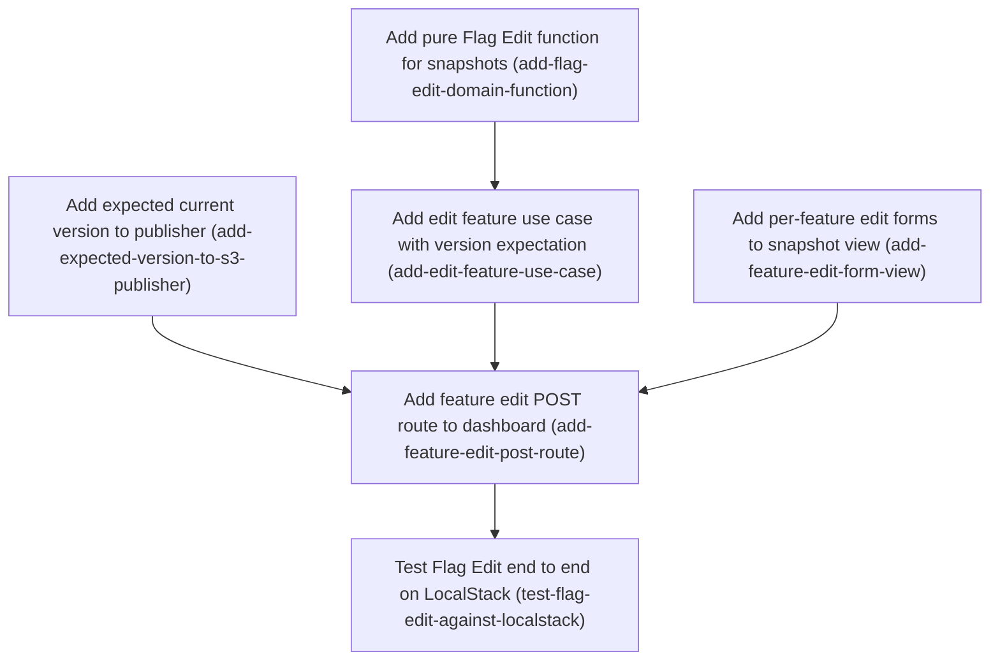

# Horizon 11 — In-browser flag editing

## Executive summary

### 🎯 What are we trying to achieve?

Operators should be able to change flags directly in the local dashboard. They can turn any feature on or off, or edit a config feature's default value, instead of pasting a whole snapshot JSON. Each save becomes a new immutable snapshot version (n+1) that differs from the previous one only in the edited field. Two people saving at the same time can never overwrite each other: exactly one save wins, and the other is told to reload.

### 🧠 Why does this change need to happen?

Today the dashboard (horizon 10) can browse, publish pasted JSON, and roll back. Changing one flag means hand-editing and pasting the entire snapshot, which is slow and error-prone. The S3 publisher also has no way to say "only publish if the live version is still the one I edited". Without that check, an edit made from an out-of-date page would silently undo someone else's change.

### At a glance

- **Phases:** 6 (you chose to keep all 6, over the usual 3–5 target and within the ceiling of 7)
- **Complexity:** Medium. There is one small change to the `@featuresync/aws` publisher; everything else is in `packages/dashboard`.
- **Main risk:** after a rollback, the next version number already exists, so edits are refused (VERSION_EXISTS) until the horizon-4 versioning decision is revisited. The refusal is shown clearly, but it is not fixed here.
- **Quality target:** 100% unit coverage. Two simultaneous edits on the same base result in exactly one publish. Unedited features stay byte-identical.
- **Testing focus:** byte-faithful copying, compare-and-swap (a write that happens only if the live version is still the expected one; otherwise nothing is written), mapping CONFLICT vs VERSION_EXISTS, HTML escaping, the Origin guard, and LocalStack end-to-end tests.

## Implementation plan

### Order of work

1. **Add pure Flag Edit function for snapshots** — nothing before it — can start immediately
2. **Add expected current version to publisher** — nothing before it — can start immediately
3. **Add edit feature use case with version expectation** — needs Add pure Flag Edit function for snapshots
4. **Add per-feature edit forms to snapshot view** — nothing before it — can start immediately
5. **Add feature edit POST route to dashboard** — needs Add expected current version to publisher, Add edit feature use case with version expectation, Add per-feature edit forms to snapshot view
6. **Test Flag Edit end to end on LocalStack** — needs Add feature edit POST route to dashboard

### Phase 1 — Add pure Flag Edit function for snapshots

Technical ID: `add-flag-edit-domain-function` · Snapshot Editing (dashboard) · domain · small blast radius

**Goal** — Build a pure domain function that takes the raw stored Snapshot JSON of the Base Version, one Flag Edit (feature key plus a new `enabled` value, or a new `default` JSON value for a config Feature), the edit metadata and the current time. It returns the next Snapshot body or a typed failure.

**Why** — A Snapshot is an immutable, versioned JSON document. An edit must produce version n+1 that differs from version n only in the edited field and in the metadata fields. S3SnapshotPublisher stores the body exactly as given (JSON.stringify of the input) and never sets or checks the body's version, previousVersion or createdAt against the version it computes, so this function must set them correctly. Keeping the rule pure, with the time passed in as a parameter, makes it deterministic and easy to cover at 100%.

**Changes**
- Create packages/dashboard/src/domain/ as a new directory. It is the dashboard's first domain layer, and the existing ESLint zone rules cover it automatically.
- Define a FlagEdit type as a discriminated union: {kind:'enabled', key, enabled:boolean} | {kind:'default', key, defaultJson:string}. A discriminated union is a TypeScript union told apart by a literal `kind` field.
- Implement applyFlagEdit(rawSnapshotText, edit, meta:{baseVersion, createdBy, reason, now:Date}). JSON.parse the raw text and copy it without mutating the input (non-mutating spread). Replace only the target Feature's field, and copy other Features, their rules and all other fields byte-faithfully. Do not add `rules: []` where it is absent.
- Set version=baseVersion+1, previousVersion=baseVersion, createdAt=now.toISOString(), and createdBy/reason from meta.
- Return typed failures: UNKNOWN_FEATURE when the key is not present; DEFAULT_NOT_EDITABLE when a default edit targets a boolean Feature; INVALID_DEFAULT_JSON when JSON.parse fails on defaultJson, carrying the parser message. Then validate the result with @featuresync/core parseSnapshot and return INVALID_SNAPSHOT with its path: message issues on failure.
- Add unit tests for every branch, including a round-trip test proving that unedited Features are deep-equal to the input and that no rules:[] is injected.

**Files / areas**
- `packages/dashboard/src/domain/flag-edit.ts`
- `packages/dashboard/test/domain/flag-edit.test.ts`

**How to verify**
- **Unedited content copied byte-faithfully** (min 8/10) — flag-edit.test.ts has a fixture Feature with no `rules` key, and asserts that the output Feature still has no `rules` key (`'rules' in f` is false)
- **Next-version metadata set from meta and the injected clock** (min 8/10) — The test asserts all five fields exactly, with a fixed `new Date('2026-01-01T00:00:00.000Z')`
- **Every typed failure reachable and specific** (min 8/10) — Each of the four failure kinds has a test asserting the `kind` value and its payload (the parser message string, and an issues array whose entries are formatted as `path: message`)
- **Domain has no outer-layer dependencies** (min 8/10) — The import lines in flag-edit.ts reference only '@featuresync/core' or relative domain paths

**Done when** — packages/dashboard/src/domain/flag-edit.ts exporting applyFlagEdit, covered 100% by test/domain/flag-edit.test.ts, and every check under *How to verify* passes its bar.

**Depends on** — nothing — can start immediately

Reference — full rubric

- **`byte-faithful-unedited-copy`** (minScore 8): applyFlagEdit changes only the target Feature's edited field plus version/previousVersion/createdAt/createdBy/reason, and leaves everything else exactly as it was. 10 = a test compares JSON.stringify of every unedited Feature and top-level field before and after, and also checks that the input object is not mutated. 8 = deep-equal round-trip test plus a no-rules:[] test. Below 7 = anything gets injected or normalized.
  - pass: flag-edit.test.ts has a fixture Feature with no `rules` key, and asserts that the output Feature still has no `rules` key (`'rules' in f` is false)
  - pass: A test asserts that every non-target Feature in the output deep-equals the input Feature, and that the target Feature differs only in `enabled` or `default`
  - pass: A test freezes the input (or keeps a copy of the raw text) and asserts that it is unchanged after the call
  - pass: Unknown top-level fields in the input snapshot are still present in the output
  - fail: Parsing through @featuresync/core parseSnapshot and then serializing the parsed result, which fills in `rules: []` defaults on Features that had none
  - fail: A shallow spread that mutates the nested target Feature object in the input snapshot
  - fail: Dropping an unknown top-level property because the result was built from a typed object instead of the parsed JSON
- **`metadata-and-version-arithmetic`** (minScore 8): The output has version=baseVersion+1, previousVersion=baseVersion, createdAt=meta.now.toISOString(), and createdBy/reason taken from meta. The function never calls the system clock. 10 = the tests use a baseVersion that differs from the body's own version field, which proves the value comes from meta. 8 = all five fields are asserted with a fixed Date.
  - pass: The test asserts all five fields exactly, with a fixed `new Date('2026-01-01T00:00:00.000Z')`
  - pass: grep flag-edit.ts for `Date.now` or `new Date(`: there must be no match
  - pass: A test where the raw body's version differs from meta.baseVersion still produces baseVersion+1
  - fail: Computing version as parsed.version+1 instead of meta.baseVersion+1
  - fail: Setting createdAt with new Date() inside the function, so the tests can only be made stable with fake timers
- **`typed-failure-branches`** (minScore 8): Each failure (UNKNOWN_FEATURE, DEFAULT_NOT_EDITABLE, INVALID_DEFAULT_JSON carrying the parser message, INVALID_SNAPSHOT carrying path: message issues) is returned as a value, not thrown, and has its own test. 10 = the INVALID_SNAPSHOT test really triggers a schema failure caused by an edit (for example a default that breaks the schema), and the coverage run reports 100% branches. 8 = all four failures are tested and coverage is 100%.
  - pass: Each of the four failure kinds has a test asserting the `kind` value and its payload (the parser message string, and an issues array whose entries are formatted as `path: message`)
  - pass: A default edit on a boolean Feature returns DEFAULT_NOT_EDITABLE and does not change the Feature
  - pass: Running the dashboard coverage command shows 100% lines and branches for src/domain/flag-edit.ts
  - fail: Letting JSON.parse throw out of the function for a bad defaultJson instead of returning INVALID_DEFAULT_JSON
  - fail: Looking up the key with `in` on a Features array, or matching by prototype keys like `toString`, so a key such as 'constructor' is wrongly accepted as known
- **`domain-layer-purity`** (minScore 8): src/domain/flag-edit.ts imports only @featuresync/core and its own types. It has no imports from application or infrastructure code, no AWS SDK, no node:http and no I/O. 10 = ESLint zone rules pass and the file has no side-effecting imports at all. 8 = lint passes and there are no forbidden imports.
  - pass: The import lines in flag-edit.ts reference only '@featuresync/core' or relative domain paths
  - pass: The dashboard's eslint command passes, with the no-restricted-paths zones covering src/domain
  - pass: There are no console or process usages in the file
  - fail: Importing FlagDefinitionView from ../application/browse-environment to decide whether a Feature is a config Feature
  - fail: Returning error message strings from error-messages.ts instead of typed failure kinds

Healer hint: The usual failure is running the result through parseSnapshot and serializing the parsed value, which injects rules:[]. Validate with parseSnapshot but return the spread-copied raw JSON object, and add the no-rules-key round-trip test.

### Phase 2 — Add expected current version to publisher

Technical ID: `add-expected-version-to-s3-publisher` · Snapshot Publishing (aws) · infrastructure · small blast radius

**Goal** — Give S3SnapshotPublisher.publish an optional third argument, publish(environment, snapshot, { expectedCurrentVersion }). When it is given, the publisher compares it to the pointer version it has just read and throws S3PublishError('CONFLICT') before writing any object if the two differ.

**Why** — Before this change, a stale check could only run in the dashboard, before the publisher re-read the pointer. That left a race: A checks base=5, B publishes 6, A's publisher reads 6 and writes A's edit (built on 5) as 7, silently reverting B. Doing the comparison inside publish, against the same readPointer result whose ETag guards the IfMatch pointer write, closes the race and makes the publish a compare-and-swap. If another writer moves the pointer after the check, either the snapshot write fails (IfNoneMatch '*' gives VERSION_EXISTS, because both writers computed the same next version) or the pointer write fails (IfMatch ETag gives CONFLICT). Either way, a stale edit never becomes current. The option is optional, so the CLI and paste-publish callers do not change. Finding: publish never checks that the body's `version`/`previousVersion` fields agree with the version it computes (validate only checks the schema, and the body is stored as JSON.stringify(snapshot)). This phase leaves that as it is, because adding the check would change behaviour for existing callers. The edit path gets consistency from the expectation, since applyFlagEdit writes baseVersion+1, which the passed check guarantees is the computed version.

**Changes**
- Export a PublishOptions interface { readonly expectedCurrentVersion?: number } and change the S3SnapshotPublisher interface to publish(environment, snapshot, options?: PublishOptions). Re-export the type from the package index if the other publisher types are exported there.
- In publish, right after readPointer(env) and before any put: if options?.expectedCurrentVersion is defined and differs from current?.pointer.version, throw new S3PublishError('CONFLICT', `${env}/current.json`, new Error('Expected current version X, found Y')). Treat 'no pointer yet' (current undefined) as a mismatch whenever an expectation is given, and use 'none' for Y in the cause message.
- Leave behaviour unchanged when options or expectedCurrentVersion is omitted, and leave rollback unchanged.
- Unit tests in s3-snapshot-publisher.test.ts using fake-s3.ts: the expectation matches and publishes; a mismatch throws CONFLICT with zero PutObject calls; no pointer plus an expectation throws CONFLICT with zero puts; omitting the option keeps existing behaviour. Keep 100% coverage.
- Add one LocalStack case in s3-snapshot-publisher.localstack.test.ts: seed version 1, then publish with expectedCurrentVersion 0 (or 2). Assert CONFLICT, assert that no snapshots/2.json exists, and assert that current.json is byte-identical to before.

**Files / areas**
- `packages/aws/src/infrastructure/s3-snapshot-publisher.ts`
- `packages/aws/src/index.ts`
- `packages/aws/test/infrastructure/s3-snapshot-publisher.test.ts`
- `packages/aws/integration/s3-snapshot-publisher.localstack.test.ts`

**How to verify**
- **Mismatched expectation writes nothing** (min 9/10) — A fake-s3 test with the pointer at 5 and expectedCurrentVersion 4 asserts reason 'CONFLICT' and that the PutObject call count is 0
- **Existing callers and rollback unchanged** (min 9/10) — git diff shows no changes to existing test expectations in s3-snapshot-publisher.test.ts, only added tests
- **Expectation compared against the ETag-guarded read** (min 8/10) — publish contains a single readPointer call, and the comparison uses its `pointer.version`
- **Type exported from package, stays in infrastructure** (min 7/10) — packages/aws/src/index.ts re-exports PublishOptions (or the other publisher types are not exported there either)

**Done when** — S3SnapshotPublisher.publish accepting { expectedCurrentVersion } and throwing CONFLICT with nothing written on mismatch, covered 100% by s3-snapshot-publisher.test.ts plus one passing LocalStack case, and every check under *How to verify* passes its bar.

**Depends on** — nothing — can start immediately

**Rollback** — The option is additive and optional: reverting the commit restores the old two-argument publish without touching any caller.

Reference — full rubric

- **`cas-writes-nothing-on-mismatch`** (minScore 9): When expectedCurrentVersion is given and differs from the pointer that was read (including when there is no pointer), publish throws S3PublishError('CONFLICT') before any PutObject. 10 = the unit tests assert zero puts for both a mismatch and a missing pointer, and the LocalStack test asserts that current.json is byte-identical and that no snapshots/N.json exists. 8 = the unit tests assert zero puts, and the LocalStack test asserts CONFLICT.
  - pass: A fake-s3 test with the pointer at 5 and expectedCurrentVersion 4 asserts reason 'CONFLICT' and that the PutObject call count is 0
  - pass: A fake-s3 test with no pointer and expectedCurrentVersion 0 asserts CONFLICT, 0 puts, and a cause message containing 'none'
  - pass: The LocalStack case reads current.json before and after and compares the bytes, and HeadObject on snapshots/2.json returns not found
  - fail: Checking the expectation after the snapshot PutObject and before the pointer write, which leaves an orphan snapshots/N.json
  - fail: Treating an undefined pointer as version 0, so expectedCurrentVersion 0 passes on an empty environment
  - fail: Checking with a truthy test (`if (options?.expectedCurrentVersion)`), so an expectation of 0 is ignored
- **`backward-compatible-signature`** (minScore 9): The third argument is optional, and CLI, paste-publish and rollback behave exactly as before. 10 = a test calls the two-argument publish and gets the same writes as before, the rollback tests pass without edits, and no caller file changed. 8 = the existing tests pass unmodified.
  - pass: git diff shows no changes to existing test expectations in s3-snapshot-publisher.test.ts, only added tests
  - pass: The CLI package sources that call publish are not in the diff
  - pass: rollback() has no diff in the function body
  - fail: Making options required, which breaks CLI type-checking
  - fail: Reusing the new check in rollback, so a rollback with a stale pointer suddenly throws
- **`check-uses-same-pointer-read`** (minScore 8): The comparison uses the same readPointer result whose ETag feeds the IfMatch pointer write. There is no second read. 10 = the read count is asserted as exactly one GetObject on current.json per publish. 8 = the code reads the pointer once.
  - pass: publish contains a single readPointer call, and the comparison uses its `pointer.version`
  - pass: A test counts the GetObject calls on current.json and finds exactly 1
  - fail: Adding a separate readPointer for the check, which reopens the race between the check and the ETag
- **`infra-layer-and-export`** (minScore 7): PublishOptions is exported next to the other publisher types in packages/aws/src/index.ts, and the aws package does not import from dashboard. 8 = exported and lint clean; 10 = also documented with a JSDoc comment on the conflict semantics.
  - pass: packages/aws/src/index.ts re-exports PublishOptions (or the other publisher types are not exported there either)
  - pass: The aws lint and tsc commands pass, and coverage for s3-snapshot-publisher.ts is 100%
  - fail: Defining PublishOptions only inside the dashboard, which forces the dashboard to write a structural duplicate

Healer hint: The most likely bug is a truthy or undefined-pointer check (`if (options?.expectedCurrentVersion)`, or current?.pointer.version ?? 0). Test with `!== undefined`, treat a missing pointer as a mismatch, and run the check before the first put.

### Phase 3 — Add edit feature use case with version expectation

Technical ID: `add-edit-feature-use-case` · Snapshot Editing (dashboard) · application · medium blast radius

**Goal** — Add an application use case, editFeature, that fetches the Snapshot at the form's Base Version and applies the Flag Edit. It then publishes through the SnapshotWriter port with expectedCurrentVersion=baseVersion and returns the existing WriteOutcome type, mapping a concurrent-publish CONFLICT to a 'reload and redo your edit' message.

**Why** — The application layer depends only on its own port. SnapshotWriter in publish-snapshot.ts gains the same optional third argument, and any adapter that honours it (the aws publisher, wired in the route phase) makes the publish a compare-and-swap. Decision: remove the dashboard-side pre-read pointer check. It cannot prevent the race, it costs an extra S3 read on every edit, and the publisher's expectation check produces the same result (nothing written, CONFLICT) at the only point where the check is authoritative. The after-the-fact heuristic 'published version != base+1' is also removed, because a successful expected-version publish always yields base+1. VERSION_EXISTS on the edit path has two causes: a simultaneous edit on the same base won the snapshot key, or version base+1 already exists after a Rollback. The use case tells them apart by re-reading the current pointer: if it is no longer baseVersion, it reports the concurrent message; otherwise it reports the rollback explanation. Other decisions: createdBy is the constant 'dashboard', the reason is generated (e.g. "Set <key>.enabled=false via dashboard"), and the clock is injected as `now: () => Date`.

**Changes**
- Extend SnapshotWriter.publish in publish-snapshot.ts to publish(environment, snapshot, options?: { expectedCurrentVersion?: number }). Existing callers pass no options, so paste-publish and rollback tests stay green.
- Export the private write() helper and the WriteOutcome type from publish-snapshot.ts without changing their behaviour.
- Create editFeature(ports: BrowsePorts & WritePorts & {now: () => Date}, env, baseVersion, edit). Fetch the text with fetchSnapshotText(env, baseVersion), call applyFlagEdit, then run write() with writer.publish(env, snapshot, { expectedCurrentVersion: baseVersion }). Do not pre-read the pointer.
- Map CONFLICT on this path to a new EDIT_CONFLICT message: 'Someone else published version N meanwhile — reload and redo your edit', where N is obtained by re-reading the current pointer after the failure (fall back to wording without N if that read fails). On VERSION_EXISTS, re-read the pointer: if it differs from baseVersion, use EDIT_CONFLICT; otherwise use a new EDIT_AFTER_ROLLBACK message explaining that version base+1 already exists because of an earlier Rollback, that edits from a rolled-back version are not supported yet, and that the Operator should paste-publish instead.
- Add message constants for EDIT_CONFLICT, EDIT_AFTER_ROLLBACK, UNKNOWN_FEATURE, DEFAULT_NOT_EDITABLE and INVALID_DEFAULT_JSON to error-messages.ts, and reuse the path: message issue formatting for INVALID_SNAPSHOT. Confirm that every S3FetchError/S3PublishError reason reachable on this path has a message.
- Unit-test with fake ports: success passes expectedCurrentVersion=baseVersion; CONFLICT gives EDIT_CONFLICT naming N; VERSION_EXISTS with the pointer moved gives EDIT_CONFLICT; VERSION_EXISTS with the pointer at base gives EDIT_AFTER_ROLLBACK; each domain failure; each fetch/publish error reason; and a failed re-read fallback.

**Files / areas**
- `packages/dashboard/src/application/edit-feature.ts`
- `packages/dashboard/src/application/publish-snapshot.ts`
- `packages/dashboard/src/application/error-messages.ts`
- `packages/dashboard/test/application/edit-feature.test.ts`

**How to verify**
- **Publishes with expectedCurrentVersion=baseVersion and no pre-read** (min 9/10) — The fake writer records its third argument, and the test asserts that it equals {expectedCurrentVersion: baseVersion}
- **CONFLICT/VERSION_EXISTS mapped by re-reading the pointer** (min 8/10) — Tests exist for: CONFLICT with the pointer at 7 (the message contains '7'); VERSION_EXISTS with the pointer moved; VERSION_EXISTS with the pointer equal to base (the rollback message); and a re-read that throws (the message has no number and no 'undefined')
- **SnapshotWriter widening keeps paste-publish and rollback intact** (min 8/10) — The git diff of publish-snapshot.ts touches only the export keywords and the optional parameter
- **Depends only on ports and domain** (min 8/10) — No import in edit-feature.ts resolves to packages/aws or src/infrastructure

**Done when** — packages/dashboard/src/application/edit-feature.ts exporting editFeature, covered 100% by test/application/edit-feature.test.ts, and every check under *How to verify* passes its bar.

**Depends on** — Add pure Flag Edit function for snapshots

Reference — full rubric

- **`expectation-passed-no-preread`** (minScore 9): editFeature fetches the base snapshot text, applies the edit, and calls writer.publish(env, snapshot, {expectedCurrentVersion: baseVersion}) without reading the pointer first. 10 = the success test asserts the exact options object and that the pointer read count is 0 before publish. 8 = the options are asserted.
  - pass: The fake writer records its third argument, and the test asserts that it equals {expectedCurrentVersion: baseVersion}
  - pass: The fake pointer reader records call order, and no pointer read happens before publish on the success path
  - pass: fetchSnapshotText is called with (env, baseVersion), not with 'current'
  - fail: Fetching the current snapshot instead of the snapshot at baseVersion, so an edit silently rebases onto someone else's change
  - fail: Keeping a dashboard-side pointer pre-check 'for safety', which adds an S3 read and gives the same race
- **`conflict-vs-rollback-disambiguation`** (minScore 8): CONFLICT maps to EDIT_CONFLICT naming N. VERSION_EXISTS maps to EDIT_CONFLICT when the re-read pointer differs from base, and to EDIT_AFTER_ROLLBACK when it still equals base. A failed re-read falls back to wording without N. 10 = all four paths are tested and the message text is asserted. 8 = all four paths are tested.
  - pass: Tests exist for: CONFLICT with the pointer at 7 (the message contains '7'); VERSION_EXISTS with the pointer moved; VERSION_EXISTS with the pointer equal to base (the rollback message); and a re-read that throws (the message has no number and no 'undefined')
  - pass: The EDIT_AFTER_ROLLBACK text mentions paste-publish
  - fail: Mapping every VERSION_EXISTS to the rollback message, so a lost same-base race tells the Operator to paste-publish
  - fail: Interpolating an undefined N and producing 'published version undefined meanwhile'
- **`shared-port-unchanged-for-existing-callers`** (minScore 8): SnapshotWriter.publish gains only an optional third parameter. write() and WriteOutcome are exported with their behaviour unchanged. 8 = the existing publish-snapshot tests pass unmodified; 10 = also no diff to their bodies apart from the export keyword.
  - pass: The git diff of publish-snapshot.ts touches only the export keywords and the optional parameter
  - pass: The existing publish and rollback use-case tests pass without edits
  - fail: Changing write() to map CONFLICT to EDIT_CONFLICT globally, which changes the paste-publish message
- **`application-layer-boundary`** (minScore 8): edit-feature.ts imports from domain, from application ports and messages, and from @featuresync/core only. It never imports @featuresync/aws values or infrastructure, and it gets the time from ports.now(). Error reasons are compared as strings or through the port's error shape, not with aws instanceof.
  - pass: No import in edit-feature.ts resolves to packages/aws or src/infrastructure
  - pass: grep shows no `new Date(` in edit-feature.ts, and createdBy is 'dashboard'
  - pass: The lint zone check passes, and coverage for edit-feature.ts is 100%
  - fail: Using `instanceof S3PublishError` imported from @featuresync/aws inside the application layer

Healer hint: The most likely miss is the VERSION_EXISTS branch not re-reading the pointer, or leaking 'undefined' when the re-read fails. Add the re-read with a try/catch fallback message and test all four conflict paths.

### Phase 4 — Add per-feature edit forms to snapshot view

Technical ID: `add-feature-edit-form-view` · Snapshot Editing (dashboard) · infrastructure · small blast radius

**Goal** — Render an edit form on each Feature row of the environment page only: a hidden baseVersion equal to the current version, an enabled checkbox for every Feature, and a default JSON textarea for config Features only. Show a draft value and an error message when the form is re-rendered after a failed edit.

**Why** — Operators should change a Feature in place instead of pasting a whole Snapshot. The existing read-only table in snapshot-contents.ts is shared by the environment and version pages, so the forms go in a new file under views/. Plain HTML forms with no client-side JavaScript keep the Horizon 10 rule of no framework and no build step. Forms appear only on the environment page, which always shows the current version, because edits always start from the Current Pointer; the per-version pages stay read-only.

**Changes**
- Create views/feature-edit-form.ts, rendering one <form method=post action=/env/<env>/features/<key>> per Feature. Build the action URL with environmentPath and encodeURIComponent, and escape every value with escapeHtml.
- Render the default textarea only when FlagDefinitionView.type is 'config'. The boolean defaultValue mirrors enabled and must not be offered as editable.
- Accept an optional EditDraft {key, enabled?, defaultJson?, message, issues} so a 422 re-render keeps the Operator's typed text and shows the error next to that Feature.
- Add an optional `editable` input to snapshot-contents.ts that appends the form cell only when true. Only the environment page passes true; the version page never does, even for the current version.
- Unit-test the escaping of hostile keys and values, config vs boolean rendering, the draft/error rendering, and the read-only mode.

**Files / areas**
- `packages/dashboard/src/infrastructure/views/feature-edit-form.ts`
- `packages/dashboard/src/infrastructure/views/snapshot-contents.ts`
- `packages/dashboard/src/infrastructure/views/feature-edit-form.test.ts`

**How to verify**
- **Every interpolated value HTML-escaped** (min 9/10) — The test renders the key `a">` and asserts that the output contains no raw `
- **Forms appear only when editable** (min 8/10) — A test renders with editable omitted and asserts there is no '<form'
- **Draft and error shown next to the right Feature** (min 7/10) — The test passes a draft for key B and asserts that the message appears after B's row marker and not in A's row
- **View is pure rendering** (min 8/10) — Its imports are limited to ./escape, the environmentPath helper, and application types

**Done when** — packages/dashboard/src/infrastructure/views/feature-edit-form.ts rendering escaped per-feature edit forms, covered 100% by its colocated test, and every check under *How to verify* passes its bar.

**Depends on** — nothing — can start immediately

Reference — full rubric

- **`escape-every-rendered-value`** (minScore 9): Keys, env, default JSON, draft text, messages and issues all pass through escapeHtml, and URL segments are also encodeURIComponent'd. 10 = the test uses a hostile key like `"><script>` and a textarea value containing `</textarea>`, and asserts that none appears raw. 8 = a hostile key and a hostile value are tested.
  - pass: The test renders the key `a">` and asserts that the output contains no raw `<script>` and asserts that it is escaped inside the textarea
  - pass: The action attribute for the key 'a/b' contains 'a%2Fb'
  - fail: Escaping the displayed key but not the hidden input value, or not the action URL
  - fail: Putting draft text inside <textarea> unescaped on the assumption that textarea content is inert
- **`config-vs-boolean-controls`** (minScore 8): Every Feature gets an enabled checkbox and a hidden baseVersion equal to the current version. Only type 'config' gets a default textarea. 8 = both cases are tested; 10 = the test also asserts that the checkbox `checked` state reflects enabled and that the baseVersion value is exact.
  - pass: A boolean Feature's form contains no <textarea>
  - pass: A config Feature's form has a textarea prefilled with its default as JSON
  - pass: The hidden input baseVersion value equals the rendered version
  - pass: The checkbox is checked if and only if enabled is true
  - fail: Offering the boolean Feature's mirrored defaultValue as editable
  - fail: A missing field discriminator, so the route cannot tell an unchecked checkbox from an omitted one
- **`read-only-version-page`** (minScore 8): snapshot-contents renders form cells only when editable is true, so the version pages stay byte-identical to before. 10 = a snapshot test proves that the non-editable output is unchanged from the previous output.
  - pass: A test renders with editable omitted and asserts there is no '<form'
  - pass: The version-page handler call site does not pass editable:true
  - pass: The existing view tests pass unmodified
  - fail: Setting editable when version === current on the version page
- **`draft-error-rendering`** (minScore 7): An EditDraft re-render keeps the typed text and the checkbox state, and shows the escaped message and issues only on the matching key's row.
  - pass: The test passes a draft for key B and asserts that the message appears after B's row marker and not in A's row
  - pass: The draft defaultJson replaces the stored default in the textarea
  - fail: Showing the draft text in every config Feature's textarea
- **`view-layer-boundary`** (minScore 8): feature-edit-form.ts imports only the view helpers and application view types, does no I/O, and does not call use cases.
  - pass: Its imports are limited to ./escape, the environmentPath helper, and application types
  - pass: Coverage for the file is 100%
  - fail: Calling applyFlagEdit from the view to pre-validate

Healer hint: The most likely miss is unescaped textarea or hidden-input content, or a key that is not URL-encoded in the action. Route every interpolation through escapeHtml and encodeURIComponent, and add a hostile-key test.

### Phase 5 — Add feature edit POST route to dashboard

Technical ID: `add-feature-edit-post-route` · Snapshot Editing (dashboard) · interface · medium blast radius

**Goal** — Handle POST /env/:env/features/:key: parse the form, call editFeature with a real clock and the aws publisher's expected-version support, and re-render the environment page in place. Return status 200 with 'Published version N' on success, or 422 with the preserved draft and mapped message on failure.

**Why** — This route connects the browser form to the use case, and aws-adapters.ts is where the application's SnapshotWriter port is bound to S3SnapshotPublisher. That binding must forward the third options argument, which is why this phase depends on the aws publisher phase. It keeps the existing render-with-notice pattern (200/422, no redirect) of the publish and rollback POSTs: success is shown on the re-rendered environment page, and no flash/session state is needed. The existing Origin/Host guard and 1 MiB body cap apply automatically.

**Changes**
- In aws-adapters.ts, make openWriter return a writer whose publish forwards (environment, snapshot, options) to S3SnapshotPublisher.publish. If it returns the publisher directly, the widened type check alone confirms this. Also inject `now: () => new Date()` into the ports built by createAwsDashboardPorts.
- Extend the router to match the 4-segment path /env/:env/features/:key for POST only. URL-decode the key and reject an empty one with 404.
- Read form fields baseVersion (validated with parseVersion; 422 on failure), field ('enabled' or 'default'), enabled (checkbox present means true), and default. Build the FlagEdit from them.
- On success, re-run browseEnvironment and render the environment page with 'Published version N' at status 200 (no redirect). On failure, render the environment page with the EditDraft and mapped message (EDIT_CONFLICT, EDIT_AFTER_ROLLBACK, or a domain/validation message) at status 422.
- Extend http-server.test.ts with a fixed clock and fake writer: a cross-origin POST gets 403; bad baseVersion; a writer CONFLICT renders the reload-and-redo message; VERSION_EXISTS after rollback renders the rollback explanation; unknown key; invalid default JSON; the success notice. Assert that the fake writer received expectedCurrentVersion. Confirm that the paste-publish and rollback tests pass unchanged.

**Files / areas**
- `packages/dashboard/src/infrastructure/http-server.ts`
- `packages/dashboard/src/infrastructure/http-server.test.ts`
- `packages/dashboard/src/infrastructure/aws-adapters.ts`

**How to verify**
- **Origin/Host guard applies to the new POST** (min 9/10) — The test sends a POST with Origin http://evil.example and asserts status 403 and a fake writer call count of 0
- **Options forwarded through aws-adapters** (min 9/10) — http-server.test asserts that the writer's third argument is {expectedCurrentVersion: <form baseVersion>}
- **Correct status codes and form parsing** (min 8/10) — There are tests for: success (200, body contains 'Published version 2'); baseVersion 'abc' (422); an unknown key (422); invalid default JSON (422, with the draft text echoed back escaped); CONFLICT (the reload message); and VERSION_EXISTS after rollback (the rollback message)
- **Paste-publish and rollback behaviour untouched** (min 9/10) — The git diff of http-server.test.ts only adds tests
- **Route delegates, no domain logic** (min 7/10) — http-server.ts does not call applyFlagEdit or compute baseVersion+1

**Done when** — A POST /env/:env/features/:key route in http-server.ts, wired through aws-adapters.ts with expectedCurrentVersion forwarded, returning 200 with the new version or 422 with a mapped message, covered 100% by http-server.test.ts, and every check under *How to verify* passes its bar.

**Depends on** — Add expected current version to publisher, Add edit feature use case with version expectation, Add per-feature edit forms to snapshot view

**Rollback** — An edit wrongly published to S3 is undone with the existing Rollback, which moves the Current Pointer back to the previous version; snapshots are never deleted.

Reference — full rubric

- **`origin-guard-and-body-cap`** (minScore 9): The new route sits behind the existing Origin/Host check and the 1 MiB cap. 10 = tests for a cross-origin POST (403) and a missing-Origin case matching the existing policy both assert that the writer was never called.
  - pass: The test sends a POST with Origin http://evil.example and asserts status 403 and a fake writer call count of 0
  - pass: The route is dispatched after the shared guard, not before it
  - fail: Matching the 4-segment path in a new branch placed before the guard runs
- **`expected-version-wired-to-s3`** (minScore 9): openWriter's publish forwards the options argument to S3SnapshotPublisher, and the ports include now. 8 = a test asserts that the fake writer got expectedCurrentVersion; 10 = the adapter forwarding is also proved by a test or by returning the publisher directly.
  - pass: http-server.test asserts that the writer's third argument is {expectedCurrentVersion: <form baseVersion>}
  - pass: In aws-adapters.ts, publish is either the publisher itself or a function taking (env, snapshot, options) that passes all three on
  - pass: createAwsDashboardPorts returns now
  - fail: A wrapper `(e, s) => publisher.publish(e, s)` that silently drops options, so production has no compare-and-swap
- **`form-parsing-and-status`** (minScore 8): Success gives 200 with 'Published version N'. A bad baseVersion, domain failure or conflict gives 422 with the preserved draft. An empty key gives 404. 10 = an unchecked checkbox (field=enabled with no enabled field) is tested as false.
  - pass: There are tests for: success (200, body contains 'Published version 2'); baseVersion 'abc' (422); an unknown key (422); invalid default JSON (422, with the draft text echoed back escaped); CONFLICT (the reload message); and VERSION_EXISTS after rollback (the rollback message)
  - pass: A test posts field=enabled with no enabled key and asserts that the FlagEdit had enabled:false
  - pass: A test for a URL-decoded key 'a%2Fb' reaches key 'a/b'
  - fail: Redirecting with 303 after success, which breaks the render-with-notice pattern
  - fail: Treating a missing enabled field as 'no change' instead of false
- **`existing-routes-unchanged`** (minScore 9): The existing HTTP tests pass without edits, and the router change does not shadow the 3-segment routes.
  - pass: The git diff of http-server.test.ts only adds tests
  - pass: GET /env/:env/features/:key returns the same 404 or 405 as before
  - pass: Coverage for http-server.ts is 100%
  - fail: A greedy path match that routes /env/x/publish into the features handler
- **`interface-layer-thin`** (minScore 7): The route only parses and renders. Version arithmetic and conflict mapping stay in the use case and domain.
  - pass: http-server.ts does not call applyFlagEdit or compute baseVersion+1
  - fail: Re-implementing the conflict message mapping in the route

Healer hint: The most likely failure is an aws-adapters wrapper that drops the third options argument. Return the publisher directly or forward (env, snapshot, options), and assert expectedCurrentVersion in the route test.

### Phase 6 — Test Flag Edit end to end on LocalStack

Technical ID: `test-flag-edit-against-localstack` · Snapshot Editing (dashboard) · interface · small blast radius

**Goal** — Prove against LocalStack (a local AWS emulator) that an edit submitted through the dashboard server publishes version n+1, whose body differs from version n only in the edited field and the metadata. Two edits on the same base must result in exactly one publish, and the loser must write nothing.

**Why** — Unit tests use fake ports. Only a real S3 round trip shows that the expected-version check, the conditional writes, the pointer move and the byte-faithful copy of unedited Features hold together. This file is excluded from the unit coverage run.

**Changes**
- Seed version 1, submit an enabled edit POST, then fetch versions 1 and 2 and assert that the diff contains only the edited Feature field plus version/previousVersion/createdAt/createdBy/reason.
- Submit a config default edit, then assert the new default and that the other Features are unchanged.
- Submit two edits with the same baseVersion (sequentially, the second after the first succeeded, and also concurrently via Promise.all). Assert that exactly one returns 200, that the other returns 422 with the reload-and-redo message, that only one new snapshot key exists, and that the Current Pointer names the winner's version.
- Seed a rollback (publish v2, roll back to v1), submit an edit on base 1, and assert status 422 with the rollback explanation and that nothing was written.
- Run with the fail-not-skip LocalStack rule from Horizon 3.

**Files / areas**
- `packages/dashboard/integration/dashboard.localstack.test.ts`

**How to verify**
- **n+1 differs only in the edited field and metadata** (min 8/10) — The test computes the differing paths between the parsed v1 and v2 and asserts that the set equals the expected 6 paths
- **Same-base concurrent edits publish exactly once** (min 9/10) — The Promise.all case sorts the statuses and asserts [200, 422]
- **Edit after rollback refused with nothing written** (min 8/10) — The test asserts status 422 and the EDIT_AFTER_ROLLBACK text
- **Runs through the real server and fails without LocalStack** (min 8/10) — The test builds ports via createAwsDashboardPorts against the LocalStack endpoint and sends real HTTP POSTs that include an allowed Origin

**Done when** — Passing LocalStack integration cases in dashboard.localstack.test.ts proving that an edit yields version n+1 and that same-base concurrent edits publish exactly once, and every check under *How to verify* passes its bar.

**Depends on** — Add feature edit POST route to dashboard

Reference — full rubric

- **`minimal-diff-proof`** (minScore 8): The test fetches v1 and v2 from S3 and asserts that the diff is exactly the edited field plus version/previousVersion/createdAt/createdBy/reason. 10 = the seed includes a Feature with no rules key and asserts that it survives byte-faithfully. 8 = there is a structured diff assertion for both the enabled and the config-default edits.
  - pass: The test computes the differing paths between the parsed v1 and v2 and asserts that the set equals the expected 6 paths
  - pass: The seed has a Feature without `rules`, and v2's raw text for it has no `rules` key
  - pass: The config-default edit asserts the new default value and that the other Features are unchanged
  - fail: Asserting only v2.features[key].enabled === false, which misses injected rules:[] or dropped fields
- **`exactly-once-concurrent`** (minScore 9): Both a sequential and a Promise.all pair of same-base edits yield exactly one 200 and one 422 with the reload message, exactly one new snapshot key, and a pointer on the winner. 10 = the concurrent case lists the snapshots/ prefix and asserts the exact key set.
  - pass: The Promise.all case sorts the statuses and asserts [200, 422]
  - pass: HeadObject on <env>/snapshots/2.json succeeds and on <env>/snapshots/3.json returns not found (test-only raw client check; the dashboard itself never lists)
  - pass: current.json version equals 2, and the v2 body carries the winner's edit
  - fail: Only testing the sequential case, which never exercises the IfNoneMatch or IfMatch race
  - fail: Asserting that 'at least one' request succeeded
- **`rollback-edit-writes-nothing`** (minScore 8): After publishing v2 and rolling back to v1, an edit on base 1 returns 422 with the rollback explanation, and the S3 state is unchanged.
  - pass: The test asserts status 422 and the EDIT_AFTER_ROLLBACK text
  - pass: The snapshots key list and the current.json bytes are identical before and after the request
  - fail: Checking only the status code, and missing that the pointer was changed
- **`real-stack-fail-not-skip`** (minScore 8): The requests go through the real HTTP server with aws-adapters (no fake writer), and a missing LocalStack fails the run instead of skipping it.
  - pass: The test builds ports via createAwsDashboardPorts against the LocalStack endpoint and sends real HTTP POSTs that include an allowed Origin
  - pass: It uses the Horizon 3 fail-not-skip helper, so with no LocalStack the suite errors
  - pass: The file is under integration/ and excluded from unit coverage
  - fail: Using describe.skipIf(!localstack), so CI silently passes

Healer hint: The most likely failure is a flaky or omitted concurrent case. Fire both POSTs with Promise.all against real aws-adapters, then assert the sorted statuses [200, 422] and the exact snapshots/ key list.

## Discovery findings

| Area | Finding | File | Implication |
|---|---|---|---|
| publisher semantics | publish(env, snapshot) validates, reads pointer (with ETag), computes version = pointer+1 via nextSnapshotVersion, PUTs snapshots/<n>.json IfNoneMatch:* (fail→VERSION_EXISTS), then PUTs current.json IfMatch etag / IfNoneMatch:* (fail→CONFLICT). No expected-base-version parameter. | packages/aws/src/infrastructure/s3-snapshot-publisher.ts | Stale-base detection must be done in the dashboard: re-read current version and compare to the form's baseVersion before publish; the ETag only guards the gap between the publisher's own read and write. Do not change the aws package. (Superseded at preview: the user asked for a compare-and-swap publish, so the aws publisher gains an optional expectedCurrentVersion — see phase add-expected-version-to-s3-publisher.) |
| publisher body fidelity | publish stores JSON.stringify(snapshot) as-is. It does NOT rewrite the body's version/previousVersion/createdAt fields to match the computed version number. | packages/aws/src/infrastructure/s3-snapshot-publisher.ts | The edit domain function must set version=base+1, previousVersion=base, and a fresh createdAt (plus createdBy/reason). Otherwise the stored body disagrees with its key. A mismatch between the expected base+1 and the returned version means a race. |
| snapshot contract | The snapshot is a strictObject with schemaVersion:1, environment, version:int>0, createdAt (ISO with offset), createdBy (min 1), previousVersion (nullable, must be < version), reason:string, features:record. | packages/core/src/domain/snapshot-contract.ts | The edit must produce every metadata field. createdBy and reason need a source, either a form field or a constant such as 'dashboard'. The clock must be injected so the domain stays pure and tests are deterministic. |
| feature schema | boolean: strict {type, enabled, rules default []}. config: strict {type, enabled, default: z.json(), rules default []}. The only editable fields in scope are enabled (both types) and default (config only). | packages/core/src/domain/feature.ts | strictObject means no extra keys can be added. The default must be any JSON value (null allowed). Rules are copied through untouched. |
| round-trip fidelity | parseSnapshot returns a deep-frozen, normalized copy that fills in rules:[] when absent. fetcher.fetch returns raw text, and the ports expose fetchSnapshotText(env, version) returning a string. | packages/dashboard/src/infrastructure/aws-adapters.ts | Apply edits to JSON.parse(rawText) with non-mutating copies, not to the frozen parsed value. This keeps unedited features byte-faithful (no injected rules:[]). Then validate with parseSnapshot before publishing. |
| core public API | core index exports parseSnapshot, Snapshot, DeepReadonly, Feature/BooleanFeature/ConfigFeature types, ValidationIssue, SnapshotValidationError, Result. It does NOT export featureSchema, snapshotContract, or SNAPSHOT_SCHEMA_VERSION. | packages/core/src/index.ts | Dashboard validation must go through parseSnapshot. Avoid adding core exports unless there is a clear need. |
| dashboard layers | packages/dashboard/src has application/ and infrastructure/ (with views/) but no domain/ dir. The ESLint zones glob ./packages/*/src/domain/** blocks imports from application or infrastructure, and application is blocked from importing infrastructure. | eslint.config.js | A new packages/dashboard/src/domain/ (e.g. edit-feature.ts) is covered by the lint zones automatically. The domain may import @featuresync/core (a package, not a restricted path). |
| coverage | Root vitest coverage includes packages/*/src/**/*.ts with 100% thresholds for lines, branches, functions and statements. The integration/** dir is excluded from unit runs. | vitest.config.ts | Every branch of the new domain function, application use case, routes and views needs unit tests. Budget test work in each phase. |
| test layout | Application tests live in packages/dashboard/test/application/*.test.ts. Infrastructure tests are colocated (src/infrastructure/http-server.test.ts, aws-adapters.test.ts). The LocalStack integration test is at integration/dashboard.localstack.test.ts. | packages/dashboard/integration/dashboard.localstack.test.ts | Put domain tests at test/domain/. Extend http-server.test.ts for the route and the LocalStack test for the end-to-end edit and conflict cases. |
| application write path | publish-snapshot.ts has SnapshotWriter{publish, rollback}, WritePorts.openWriter(onNotifyError) opened per request, and a private write() helper that maps errors via describeFailure into a WriteOutcome (success with version/message/warning, or failure with message/issues). | packages/dashboard/src/application/publish-snapshot.ts | Add an editFeature use case beside it and reuse write()/WriteOutcome (export or share the helper). Ports need BrowsePorts plus WritePorts to load the base snapshot. |
| error messages | PUBLISH_ERROR_MESSAGES already covers CONFLICT ('Reload the page and retry') and VERSION_EXISTS (explained as a post-rollback leftover). describeFailure adds 'path: message' issue lines only for INVALID_SNAPSHOT and INVALID_POINTER. | packages/dashboard/src/application/error-messages.ts | Add new constants for a stale base version, an unknown feature key, invalid default JSON, and a non-config default edit. Reuse the path: message issue formatting for validation failures. |
| http routing | The router matches segments /env/:env[/publish\|/rollback\|/versions/:n] (max 4 segments). POST requires Origin == http://127.0.0.1:port, or a matching Host when Origin is absent (else 403). readForm parses urlencoded bodies with a 1 MiB cap (413). parseVersion accepts only ^[1-9]\d{0,8}$. | packages/dashboard/src/infrastructure/http-server.ts | Add a POST route such as /env/:env/features/:key or /env/:env/edit (form fields: key, baseVersion, enabled, default). The same-origin guard applies automatically. Reuse parseVersion for baseVersion. |
| post response pattern | The existing publish and rollback POSTs do NOT redirect. They re-run browseEnvironment and render the environment page with notices, status 200 on success or 422 on failure. 303 redirect is used only for the home ?env= form. | packages/dashboard/src/infrastructure/http-server.ts | The success criterion asks for a redirect showing the new version. Either follow the current render-with-notice pattern for consistency, or use a 303 plus a query or flash param. Decide explicitly. |
| views | snapshot-contents.ts renders a read-only table (Flag/Type/Enabled/Default JSON/Rules) from FlagDefinitionView (key, type, enabled, defaultValue, ruleCount). It is shared by environment-page and version-page. escapeHtml and environmentPath are in views/escape.ts. | packages/dashboard/src/infrastructure/views/snapshot-contents.ts | Add per-row forms (a hidden baseVersion equal to the current version, an enabled checkbox, a default textarea) only on the environment page or when the version is current. Escape all values. A draft-preserving state is needed for re-render after a 422. |
| flag view model | FlagDefinitionView.defaultValue for boolean features is set to feature.enabled, and is computed from the parsed and normalized snapshot. | packages/dashboard/src/application/browse-environment.ts | The edit form must render the default textarea only for type=config and must not treat the boolean 'default' as editable. |
| adapters/main | createAwsDashboardPorts wires the reader, the fetcher (returning .text) and a per-request publisher with parseSnapshot validation. main.ts/bin.ts need no changes unless a createdBy source (e.g. an env var or flag) is added. | packages/dashboard/src/infrastructure/aws-adapters.ts | No new AWS adapter is needed. The existing DashboardPorts suffice, apart from an optional clock/actor port. |

## Out of scope

- Editing targeting rules and conditions: the rule and condition schema needs a much richer form UI. This slice covers values only.
- Adding, deleting or renaming features: this changes the snapshot's structure and must be kept consistent with app definitions. It is a separate slice.
- Fixing publish or edit after rollback (reopening the horizon-4 versioning decision): the user explicitly passed over this focus. It is only surfaced as a risk.
- Hardening the dashboard (CSRF tokens, DNS-rebinding defence, auth): the user explicitly passed over this focus, and the horizon-10 decision on the Origin/Host check is binding.
- Snapshot file upload, diff views and evaluation preview (the brief's 'safer publishing' theme): the user did not choose them.
- A UI framework, client-side bundle or build step: the horizon-10 decision requires plain node:http and HTML strings.
- Batch or multi-feature draft editing with a single publish: this needs session or draft state. The slice publishes one edit at a time.
- Pagination, ListObjectsV2 or IAM policy changes: these are unrelated to editing, and the pointer-only listing decision is binding.
- Live updates via SNS/SQS in the dashboard: unrelated to editing, and manual refresh is enough.
- Extracting config and error helpers shared by the CLI and the dashboard: refactoring debt that is not needed for editing.
- Hosted or multi-user deployment of the dashboard: it stays a local tool bound to 127.0.0.1.
- Configurable createdBy (CLI flag or env var for Operator identity): fails gate 1 (no current need); AWS credentials already identify the Operator, and the constant 'dashboard' satisfies the snapshot contract
- Free-text reason field on the edit form: fails gate 1; the generated reason describes the edit, so add the field only when someone asks for it
- 303 redirect after a successful edit: fails gate 4 (ceremony); it needs flash/query state, whereas render-with-notice already shows the new version on the re-rendered page and matches the existing POSTs
- Publisher rejecting a body whose version/previousVersion disagrees with the computed version: fails gate 3 (it changes behaviour for existing CLI/paste-publish callers); the edit path is already consistent through expectedCurrentVersion
- Moving applyFlagEdit into @featuresync/core: fails gate 2 (only one consumer); the core public API grows only when a second consumer appears
- Validating a config default against the app's Zod definition: fails gate 1; the dashboard has no access to app definitions
- Fixing edit-after-rollback VERSION_EXISTS (publishing past existing higher versions): out of scope by user choice; it is refused with a clear explanation
- Editing rules, adding or deleting features, multi-feature drafts, and diff preview: out of scope for this slice
- CSRF tokens and DNS-rebinding defence: out of scope; the Horizon 10 Origin/Host decision is binding

## Success criteria

- An Operator on the environment page (the current version only; older version pages stay read-only) can flip a Feature's enabled flag or replace a config Feature's default JSON and submit it. The dashboard publishes version n+1, whose body differs from version n only in the edited field and the version/previousVersion/createdAt/createdBy/reason metadata. The success notice ('Published version N') appears on the re-rendered environment page with status 200; there is no redirect. The publish is a compare-and-swap: the edit carries its Base Version as expectedCurrentVersion, and S3SnapshotPublisher checks it against the same pointer read whose ETag guards the conditional pointer write. When two edits are submitted at the same time on the same base, exactly one succeeds. The other writes nothing and is re-rendered with status 422, the Operator's draft kept, and a message like 'Someone else published version N meanwhile — reload and redo your edit'. An edit made after a Rollback (when the next version number already exists) is refused, writes nothing, and shows a clear VERSION_EXISTS explanation; the real fix is deferred. The CLI, paste-publish and rollback behave exactly as before. All new code has 100% unit coverage, and LocalStack cases prove that a mismatched expectation writes nothing.
- Add pure Flag Edit function for snapshots: packages/dashboard/src/domain/flag-edit.ts exporting applyFlagEdit, covered 100% by test/domain/flag-edit.test.ts
- Add expected current version to publisher: S3SnapshotPublisher.publish accepting { expectedCurrentVersion } and throwing CONFLICT with nothing written on mismatch, covered 100% by s3-snapshot-publisher.test.ts plus one passing LocalStack case
- Add edit feature use case with version expectation: packages/dashboard/src/application/edit-feature.ts exporting editFeature, covered 100% by test/application/edit-feature.test.ts
- Add per-feature edit forms to snapshot view: packages/dashboard/src/infrastructure/views/feature-edit-form.ts rendering escaped per-feature edit forms, covered 100% by its colocated test
- Add feature edit POST route to dashboard: A POST /env/:env/features/:key route in http-server.ts, wired through aws-adapters.ts with expectedCurrentVersion forwarded, returning 200 with the new version or 422 with a mapped message, covered 100% by http-server.test.ts
- Test Flag Edit end to end on LocalStack: Passing LocalStack integration cases in dashboard.localstack.test.ts proving that an edit yields version n+1 and that same-base concurrent edits publish exactly once

## Alignment preview

- Round 1 raised three concerns: the success bar said "redirect" but the pages re-render; the version page was mentioned but only the environment page gets forms; and editing after a rollback fails. All three were fixed in the wording of the success definition.
- The user redirected once (1 of 2 rounds) with: "what about version check before writing - if multiple users try to change simultaneously". The dashboard-only stale check still left a race, so a new phase adds `expectedCurrentVersion` to `S3SnapshotPublisher.publish`. This makes the publish a compare-and-swap.
- That produced 6 phases. The user chose to keep all 6 rather than defer the end-to-end LocalStack test. The concerns critique was not re-run on the second preview, to save cost.

## Quality gate

- Path: full, one gate iteration. The critic scored 10 dimensions; 9 passed.
- **valid-dependencies (6/8, major):** the form view depended on the use case without using it. Fixed mechanically by the orchestrator (the dependency was removed), with no healer call.
- Minor issues fixed: the LocalStack exactly-once check now uses HeadObject instead of ListObjectsV2, and discovery finding 1 is annotated as superseded by the compare-and-swap choice.
- Accepted debt (1 minor): phases 5 and 6 are labelled layer `interface` although the files sit under `src/infrastructure` and `integration/`.
- Blockers: 0 raised. No verification call was made. Verdict: **passed**.

## Cost

Agent calls: 7, against a stated budget of 8–10. The calls were Stage 1, Discovery, Stage 3, preview concerns, the Stage 3 re-run (the user's redirect), Stage 4 rubrics, and the critic. Stage 2 was skipped because Discovery ran; Stage 3.5 was skipped because nothing was deferred for size; the healer was skipped because the fix was mechanical.

## Full analysis

**domainShape:** business — The objective is about domain rules operators recognise: which feature values may be changed, and how an edit becomes a new immutable snapshot version against the Current Pointer without losing a concurrent publish.

| Term | Meaning |
|---|---|
| Feature | A named entry in a snapshot, either a boolean feature (enabled plus rules) or a config feature (enabled, default JSON value, rules). |
| Flag Edit | An operator's change to one feature's editable value (enabled, or a config feature's default), made in the dashboard. |
| Snapshot | An immutable, versioned JSON document of all features for one environment, stored at <env>/snapshots/<n>.json. |
| Current Pointer | <env>/current.json, the only mutable key. It names the live snapshot version and is the base every Flag Edit starts from. |
| Base Version | The snapshot version an edit form was rendered from. The edit is refused if the Current Pointer no longer names it (stale edit). |
| Publish | Writing a new snapshot version and moving the Current Pointer to it, only ever through S3SnapshotPublisher. |
| Rollback | Moving the Current Pointer back to an earlier existing version without writing a new snapshot. |
| Operator | The person running the local dashboard with their own AWS credentials who publishes, edits and rolls back snapshots. |
| Snapshot Editing / Snapshot Publishing | The two bounded contexts touched: the dashboard turning a Flag Edit into the next Snapshot, and the aws publisher writing it with an optional expected current version. |

**Assumptions**
- 'Flag values' means each feature's `enabled` flag (boolean and config features) and a config feature's `default` JSON value, the fields in packages/core/src/domain/feature.ts. Editing targeting rules is a later slice.
- An edit always starts from the snapshot the Current Pointer names. Publishing it creates version current+1 through S3SnapshotPublisher.publish, so snapshot immutability and the single-writer rule still hold.
- Horizon-10 decisions stay binding: plain node:http with server-rendered HTML strings and no framework, one Origin/Host check with no CSRF token, versions listed only from the Current Pointer, and no ListObjectsV2.
- Edits use plain HTML forms, one feature and one submit per edit. Client-side JavaScript is not needed. This keeps branch coverage and the security surface small.
- A config `default` is entered as JSON text and checked with JSON.parse plus parseSnapshot. The dashboard has no access to the app's Zod definitions, so an edit is checked only against the snapshot schema, not against the app-side typed definition.
- Concurrent edits are handled by a compare-and-swap publish: the edit passes its Base Version as expectedCurrentVersion, and S3SnapshotPublisher refuses (CONFLICT, nothing written) unless the pointer it reads — whose ETag guards the conditional pointer write — still names it (user request at preview).
- The pure snapshot edit function can live in the dashboard's domain or application layer, or in core if planning finds it reusable. Core's public API only grows if that is justified.

**Risks**
- Edit after rollback: publish writes current+1, so after a rollback that version may already exist and the edit fails with VERSION_EXISTS. This is the known horizon-4/horizon-10 limitation and an open blocker. Editing makes publishing much more frequent, so operators will hit it more often. The plan must at least surface it clearly. Reopening the horizon-4 decision is out of scope.
- Security: edit forms add more state-changing POSTs that rely on the single Origin/Host check. The open blocker about a missing Origin header, DNS rebinding and proxied localhost applies directly, and the edit forms widen that exposure without any new protection.
- Coverage cost: per-feature forms, validation re-rendering and error branches in hand-written HTML strings may make 100% branch coverage expensive (open blocker).
- A lost update or stale overwrite if the based-on-version check is missing or wrong: an operator edits an old view and silently reverts another publish.
- Round-trip fidelity: parseSnapshot applies defaults such as `rules: []`. If the edit republishes the parsed snapshot instead of the stored JSON, fields could change that the operator did not touch. The diff-only-in-edited-field test must guard against this.
- A config default can be valid JSON yet have the wrong shape for the app's typed definition. The dashboard cannot catch this, and the app may then fail to load the snapshot or fall back to its default.
- Scope drift toward rule editing, adding or deleting features, or a diff preview. The brief recommended safer publishing and a diff, and the user chose editing instead.
