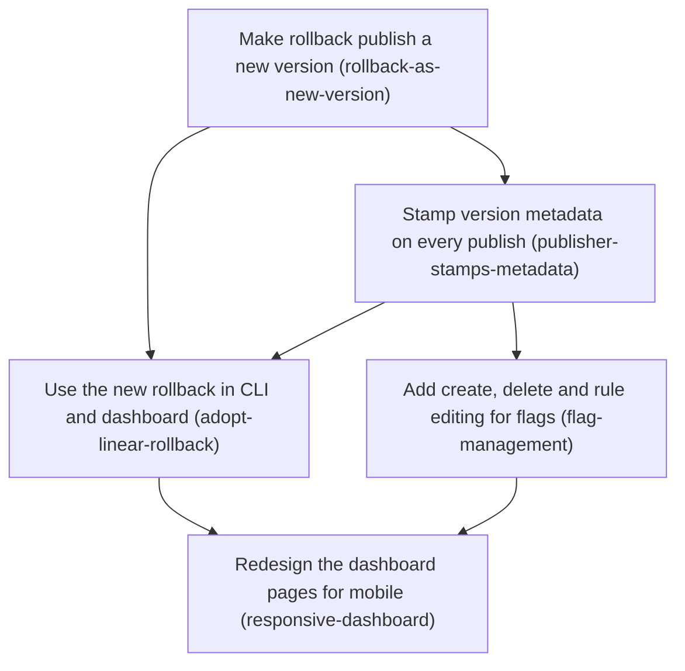

# Horizon 12 — Dashboard v2: linear rollback, flag management, modern UI

> Planning Horizon 12 of project `featuresync`. Written directly as a Markdown plan at the user's request
> (no JSON twin, no subagent gate run, no project-memory writes). To execute it with the roadmap skill,
> first generate the JSON twin from this file.

## 🎯 What are we trying to achieve?

Make the local dashboard something an operator can actually run day to day. After a rollback, every write
(edit, publish, rollback) must keep working. Operators can create, delete and edit flags, including their
rules, without hand-writing JSON. The dashboard works on a phone and clearly shows the current snapshot.
The CLI stops storing snapshots whose internal `version` or `environment` disagree with where they're stored.

## 🧠 Why does this change need to happen?

Manual QA with `pnpm dev:dashboard` on 2026-09-19 found these problems:

- **Rollback blocks every later write.** Rollback only moves `<env>/current.json` back to an older
  version. Newer snapshot files stay in the bucket, so the next write computes `current + 1`, finds that
  file already there, and fails with `VERSION_EXISTS`. The dashboard's edit error tells the operator to
  paste-publish instead, but paste-publish fails the same way.
- **Stored snapshot bodies can lie.** `publish` stores the file body exactly as given. So
  `snapshots/2.json` can say `"version": 1`, and an SDK's `flags.version()` then reports the wrong
  number. `publish --env qa` also accepts a body that says `"environment": "development"`.
- **The dashboard is a prototype.** It has one inline `<style>` block and no mobile layout. The current
  snapshot is plain text under a heading. The publish box starts empty. A flag can only be toggled or
  have its default changed: flags can't be added or deleted, and rules can't be edited.
- **The same-origin check has a hole.** A POST with no `Origin` header gets through when its `Host`
  header matches (`http-server.ts:140-144`). This was an open blocker from horizon 10.

## At a glance

- **Phases:** 5 in this horizon. Creating environments and the activity/notification view move to
  horizon 13 (see *Out of scope*).
- **Complexity:** Medium to High. Rollback semantics change across three packages, and the dashboard
  gets a new look.
- **Main risk:** the new rollback meaning (it now creates a new version) must stay consistent across
  the aws publisher, the CLI, the dashboard and SDK readers, without stranding buckets that already
  contain old-style rollbacks.
- **Quality bar:** `pnpm verify` stays green at 100% coverage, `pnpm test:integration` passes on
  LocalStack, and `pnpm dev:dashboard` is the manual acceptance check.
- **Testing focus:** version numbering after a rollback, stored metadata matching the S3 key,
  behaviour on legacy buckets, validation that flag operations keep the snapshot valid, the HTTP
  403/405 rules, and responsive rendering.

## Decisions this horizon records (supersede earlier ones)

When the horizon closes, add these to `decisions.md`:

1. **Rollback creates a new version.** Rolling back to vN publishes vN's snapshot as version
   `current+1`, with `reason: "Rollback to vN"`, `previousVersion: current`, and `createdBy` set to the
   actor. History stays linear. This supersedes the horizon-4 and horizon-8 entries about the pointer
   moving down and `VERSION_EXISTS` appearing after a rollback.
2. **Legacy buckets skip ahead.** If the pointer is below the highest existing snapshot (a rollback
   done the old way), the next write goes to `highest existing + 1`. The publisher finds that number by
   probing `HeadObject` forward from `current+1`, never by listing the bucket, so the IAM rules from
   horizon 10 still hold.
3. **The publisher stamps the metadata.** `version`, `previousVersion` and `createdAt` in the stored
   body are always set by the publisher. A body whose `environment` doesn't match the target
   environment is rejected with a new `ENVIRONMENT_MISMATCH` reason.
4. **A POST needs a matching `Origin`.** A dashboard POST without one gets 403. The `Host` fallback is
   removed.

## Order of work

1. **Make rollback publish a new version**: the core rule change, which everything else relies on.
2. **Stamp version metadata on every publish**: uses the same "next version" helper as phase 1.
3. **Use the new rollback in the CLI and dashboard**: needs the publisher behaviour from phases 1 and 2.
4. **Add create, delete and rule editing for flags**: flag operations build on the same publish path.
5. **Redesign the dashboard pages for mobile**: done last, so the new forms from phase 4 get styled once.

---

### Phase 1 — Make rollback publish a new version

`Technical ID: rollback-as-new-version` · snapshot publishing (`@featuresync/aws`) · domain + infrastructure · medium

**Goal:** `S3SnapshotPublisher.rollback(env, n)` reads snapshot vN and publishes it as a new version.
Any write, whether publish or rollback, works on a bucket that has older-style rollbacks in its history.

**Why:** today a rollback leaves newer version files behind, and those block every later write. A
rollback that appends a new version keeps history linear and needs no manual cleanup. SDK readers need
no changes: they just see a newer version.

**Changes**
- In `domain/publishing.ts`, replace `checkRollbackTarget`'s "must be below current" rule with "must
  be an existing version other than current". Add a pure `buildRollbackSnapshot(source, meta)`.
- In `s3-snapshot-publisher.ts`, make `rollback` read `snapshots/<n>.json`, build the new body, and
  write it through the same path as `publish` (put `IfNoneMatch:*`, then the pointer CAS, then
  notify). It returns the new version number.
- Add `resolveNextVersion`. It starts at `pointer+1`, and while `HeadObject` finds a file, it keeps
  going (bounded, for example at 1000 probes, then fails with a clear reason).
- Unit tests cover: a normal rollback, rolling back to the current version (rejected), a missing
  target, a legacy bucket (pointer 1, files 1–3, so the next write is 4), and the probe limit.
- LocalStack test in `packages/aws/integration`: publish v1 and v2, roll back to v1, check that v3
  exists with v1's features, then publish again and get v4.

**Files / areas:** `packages/aws/src/domain/publishing.ts`, `packages/aws/src/infrastructure/s3-snapshot-publisher.ts`,
their tests, `packages/aws/integration/s3-snapshot-publisher.localstack.test.ts`.

**How to verify**
- *Linear history*: after any sequence of publish and rollback calls, the versions are 1..N with no
  gaps, and `current.json` always names N.
- *Legacy safety*: a bucket prepared the old way (pointer below the highest file) accepts the next
  write at `highest+1`, with no manual cleanup.
- *No listing*: the publisher never calls `ListObjectsV2`, verified by a test that asserts the S3
  commands it sends.
- *Notification*: rollback sends a Change Notification for the **new** version.

**Done when:** all of the above pass, `pnpm verify` is green at 100%, and the LocalStack test passes.

**Depends on:** nothing, so it can start immediately.

**Rollback:** revert the package. Buckets written by the new code stay readable by old readers,
because the layout doesn't change.

---

### Phase 2 — Stamp version metadata on every publish

`Technical ID: publisher-stamps-metadata` · snapshot publishing (`@featuresync/aws`) · domain + infrastructure · small

**Goal:** every stored snapshot body has `version` equal to its key, `previousVersion` equal to the
old pointer, and a fresh `createdAt`. A body for the wrong environment is refused.

**Why:** today the stored body can disagree with its S3 key, so `flags.version()` can report the wrong
version to apps. The environment check stops `publish --env prod dev-flags.json` accidents.

**Changes**
- Add `stampSnapshot(raw, {version, previousVersion, now})` in `domain/publishing.ts`. It is pure and
  keeps every other field exactly as it was.
- `publish` checks `raw.environment === env`, otherwise it throws `S3PublishError('ENVIRONMENT_MISMATCH')`.
  It then stamps the body and validates the stamped body.
- In `@featuresync/cli`, map `ENVIRONMENT_MISMATCH` to a readable message with exit code 1.
- In `@featuresync/dashboard`, remove the now-duplicate stamping in `domain/flag-edit.ts`, which the
  publisher does now.

**Files / areas:** `packages/aws/src/domain/publishing.ts`, `s3-snapshot-publisher.ts`,
`packages/cli/src/main.ts`, `packages/dashboard/src/domain/flag-edit.ts`, `application/error-messages.ts`,
and their tests.

**How to verify**
- *Body matches key*: publishing a file that says `"version": 1` as the third version stores
  `"version": 3, "previousVersion": 2`.
- *Environment guard*: a mismatched environment writes nothing to S3, and the CLI exits 1 naming both
  environments.
- *Fidelity*: fields other than the three stamped ones are byte-equal to the input, including key order
  inside `features`.

**Done when:** these pass and `pnpm verify` is green.

**Depends on:** Make rollback publish a new version, which provides the shared next-version helper.

---

### Phase 3 — Use the new rollback in the CLI and dashboard

`Technical ID: adopt-linear-rollback` · CLI + dashboard application · application + interface · medium

**Goal:** the CLI and dashboard both use the new rollback. Editing a flag right after a rollback
works. No message tells users to delete files by hand. A POST without `Origin` is rejected.

**Why:** this is what fixes the bug the user reported (the edit error after rolling back to v1). It
also closes the horizon-10 blockers on missing `Origin` headers and on `VERSION_EXISTS` after a rollback.

**Changes**
- CLI `rollback`: print `Rolled <env> back to v<n> as version <m>`, update the usage text and the
  `INVALID_ROLLBACK_TARGET` message, and add tests.
- Dashboard: remove `EDIT_AFTER_ROLLBACK` and the post-rollback handling in `edit-feature.ts`. Rewrite
  the `VERSION_EXISTS` message as a rare race ("someone else published; reload"). Remove `ROLLBACK_NOTE`
  from `environment-page.ts`. Let the version list offer "Restore" on every non-current version.
- `http-server.ts`: `isSameOrigin` requires `Origin === expectedOrigin()`, and drops the `Host` fallback.
- Update the README's rollback paragraph and `docs/playbooks/local-qa.md`.

**Files / areas:** `packages/cli/src/main.ts`, `packages/dashboard/src/application/{edit-feature,publish-snapshot,error-messages}.ts`,
`packages/dashboard/src/infrastructure/{http-server.ts,views/environment-page.ts}`, `README.md`,
`docs/playbooks/local-qa.md`, `packages/dashboard/integration/dashboard.localstack.test.ts`.

**How to verify**
- *Reported bug*: in `pnpm dev:dashboard`, roll back to v1, then toggle a flag. The result is a new
  version, with no error.
- *Origin rule*: a POST without `Origin` gets 403, a foreign `Origin` gets 403, and the dashboard's own
  `Origin` gets through (unit tests on the request handler).
- *No stale guidance*: grep finds no "delete … by hand" or "paste-publish" text in the source.

**Done when:** these pass, and the dashboard LocalStack suite covers "rollback, then edit".

**Depends on:** Make rollback publish a new version; Stamp version metadata on every publish.

---

### Phase 4 — Add create, delete and rule editing for flags

`Technical ID: flag-management` · flag editing (dashboard domain) · domain + application + interface · medium

**Goal:** from the environment page, an operator can add a boolean or config flag, delete a flag, and
add, edit or remove targeting rules. Each change publishes one new version.

**Why:** today a new flag can only be added by hand-editing JSON, which the user named as a gap. It
reuses horizon 11's approach: edit the raw snapshot, validate it with `parseSnapshot`, and publish with
`expectedCurrentVersion`.

**Changes**
- Extend `FlagEdit` in `domain/flag-edit.ts` with `create {key, type, enabled, defaultJson?}`,
  `delete {key}` and `setRules {key, rulesJson}`. New failures: `FEATURE_EXISTS` and `INVALID_KEY`
  (checked against core's key pattern).
- `application/edit-feature.ts`: handle the new kinds and map the new failures to messages.
- Routes: `POST /env/:env/features` (create) and `POST /env/:env/features/:key` with
  `field=delete|rules`. Keep the per-request `baseVersion` hidden input used for the conflict check.
- Forms: a "New flag" form, a delete button per flag that asks for confirmation (a `
` element,
  no JavaScript `confirm()`), and a rules editor as a JSON textarea validated on the server.

**Files / areas:** `packages/dashboard/src/domain/flag-edit.ts`, `application/edit-feature.ts`,
`infrastructure/http-server.ts`, `infrastructure/views/feature-edit-form.ts` (plus a new
`views/new-flag-form.ts`), and their tests.

**How to verify**
- *Each operation is one version*: create, delete and rules each produce exactly one new version, and
  only the target flag differs from the previous version (the diff test from horizon 11, reused).
- *Validation*: a duplicate key, a key like `bad/key`, malformed rules JSON, and rules that break the
  schema each get 422, keep the operator's draft, and write nothing.
- *Conflicts*: a stale `baseVersion` gets a conflict notice, not an overwrite.

**Done when:** these pass at 100% coverage, and each operation is shown working in `pnpm dev:dashboard`
with the new version reaching the "app sees →" line.

**Depends on:** Stamp version metadata on every publish.

---

### Phase 5 — Redesign the dashboard pages for mobile

`Technical ID: responsive-dashboard` · dashboard views · interface · medium

**Goal:** the dashboard is modern and mobile-friendly. The current snapshot is prominent at the top,
the publish box is pre-filled, and the version history shows who, when and why for each version.

**Why:** the user reported the UI is "not modern, mobile friendly", couldn't find the current
snapshot, and found the publish box empty. The layout stays server-rendered with no build step (user
decision), so this is HTML and CSS work.

**Changes**
- Move the styles out of the inline block in `layout.ts` into a styles directory, served as one
  stylesheet at `GET /assets/app.css`. It's built by concatenating these files, with no build tool:
  `views/styles/base.css` (tokens, light and dark via `prefers-color-scheme`), `layout.css` (header,
  container, 16px gutters), `components.css` (cards, buttons, forms, notices, badges) and `tables.css`
  (flag table that turns into stacked cards below 640px). Each file stays under about 200 lines.
- Environment page: a "Current snapshot · vN" card at the top (created by, date, reason, flag count,
  collapsible raw JSON); a flag list of cards, one per flag with its controls; a version timeline with
  who, when, why and a Restore button.
- Publish box pre-filled with the current snapshot's raw JSON, with its metadata fields removed (the
  publisher stamps them).
- Add a viewport meta tag, visible focus states and 44px touch targets. Add a small inline script for
  "copy JSON" only (the page works without it).
- Snapshot tests of the rendered HTML, plus tests that the stylesheet is served (content type and
  cache headers).

**Files / areas:** `packages/dashboard/src/infrastructure/views/` (`layout.ts`, `environment-page.ts`,
`snapshot-contents.ts`, `version-page.ts`, `home-page.ts`, new `styles/`), `infrastructure/http-server.ts`
(asset route), and `application/browse-environment.ts` (who/when/why in the version list).

**How to verify**
- *Mobile*: at a 375px viewport, nothing scrolls horizontally, every control is reachable, and tap
  targets are at least 44px (checked by hand in the browser's device mode, and noted in the PR).
- *Current snapshot first*: the first card on `/env/:env` names the current version and its metadata.
- *Prefill round-trip*: submitting the pre-filled publish box unchanged creates a new version whose
  features equal the current version's.
- *Security unchanged*: the asset route is GET-only, and no inline event handlers are added (all
  output still goes through `escapeHtml`).
- *Maintainable styles*: no stylesheet over about 200 lines, and no inline `<style>` left.

**Done when:** these pass, and `pnpm dev:dashboard` looks correct on desktop, on a phone viewport, and
in dark mode.

**Depends on:** Use the new rollback in the CLI and dashboard; Add create, delete and rule editing for flags.

---

## Out of scope (moved to horizon 13)

- **Create an environment** (empty, or copied from another environment) and **an environment list on
  the home page.** Listing environments needs either `s3:ListBucket` at the bucket root, which would
  reverse the horizon-10 decision, or a new `environments.json` index that the publisher maintains.
  That choice needs its own decision, so it goes first in horizon 13.
- **An activity view:** a diff of each version against the previous one, plus a log of the change
  notifications (SNS) sent and whether they succeeded. Today the notification result exists only while
  a request is being handled. Persisting it needs a new sidecar object (for example
  `<env>/activity/<n>.json`) and IAM changes to the deployment stack.
- Authentication or multiple users on the dashboard. It stays a 127.0.0.1 tool for one operator.
- A single-page app, a frontend build step, or any JavaScript framework (user decision).
- Paginating the version history (open horizon-10 blocker). Tracked, but not needed at today's volumes.

## Discovery facts that shaped this plan

| Area | Finding | File | Implication |
|---|---|---|---|
| rollback | `rollback` only rewrites `current.json` to a lower version, then notifies | `packages/aws/src/infrastructure/s3-snapshot-publisher.ts:221` | Rollback must go through the publish path |
| publish | body stored as `JSON.stringify(snapshot)` with no stamping; version = pointer+1 | same file, `:200-201` | Stamping belongs in the publisher (phase 2) |
| edit | `EDIT_AFTER_ROLLBACK` suggests paste-publish, which fails the same way | `packages/dashboard/src/application/error-messages.ts:67` | Remove it in phase 3 |
| origin | a POST with no `Origin` passes when the `Host` matches | `packages/dashboard/src/infrastructure/http-server.ts:140` | Tighten in phase 3 |
| browse | the version list is `1..current`, derived from the pointer (no listing) | `application/browse-environment.ts:87` | Linear history keeps this correct |
| styles | one inline `<style>` of 6 rules, no viewport meta | `infrastructure/views/layout.ts:22` | Phase 5 creates a styles directory |
| IAM | publisher `s3:ListBucket` is limited by `s3:prefix` to `<env>/*` | `packages/deploy/template/featuresync-stack.json:329` | Legacy skip-ahead probes with `HeadObject`, and environment listing is deferred |

## Success criteria

- Rolling back, then editing, publishing or rolling back again always succeeds, and history is 1..N with no gaps.
- Every stored snapshot's `version`/`previousVersion` match its key and the pointer, and a body with the wrong environment is refused.
- Operators can create and delete flags and edit rules from the dashboard, and each change publishes one version.
- The dashboard is usable at 375px, supports dark mode, shows the current snapshot first, and pre-fills the publish box.
- A POST without a matching `Origin` gets 403.
- `pnpm verify` (100% coverage), `pnpm test:integration` and `pnpm dev:dashboard` all pass.

## Notes on how this was planned

The user asked for the Markdown plan only, so none of the skill's automated steps ran: no subagent
analysis, repo-discovery or quality-gate passes, and no JSON twin, ledger or memory writes. Phase
boundaries and the facts in the table above come from reading the code directly in this session. The
user's earlier answers fixed the rollback model, the UI approach and the feature scope.
