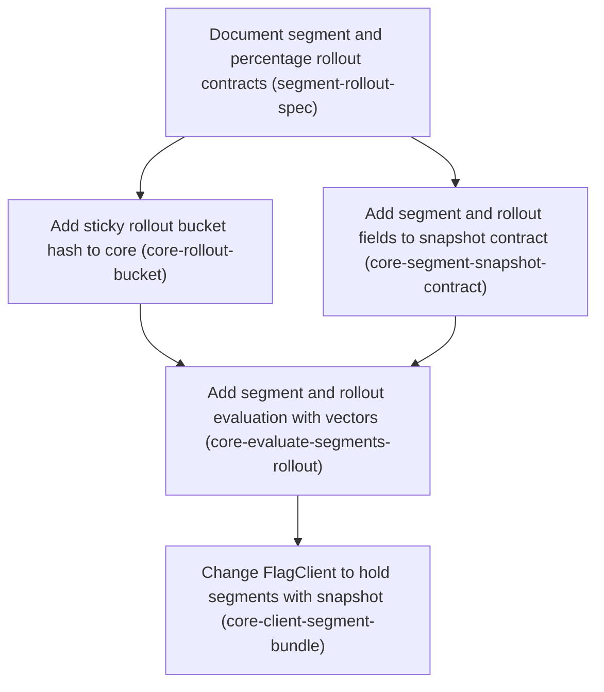

# Horizon 13 — Segments and sticky percentage rollout (core SDK)

> Planning Horizon 13 of project `featuresync`. Execute with `/dima-plan-roadmap-ddd-v5-8 execute docs/roadmaps/featuresync/horizons/horizon-13-segments-rollout-roadmap.json`.

## 🎯 What are we trying to achieve?

A flag rule can target a **segment** (a list of users uploaded separately as CSV, stored on its own versioned S3 layout, and referenced from the flag only by key) and can turn on for a **percentage of users** in a sticky way: the same user always gets the same answer, and raising the percentage only adds users. This horizon fixes the contract in the spec and makes the core SDK (`@featuresync/core`) evaluate both correctly. The S3 upload path, CLI and dashboard follow in horizon 14.

## 🧠 Why does this change need to happen?

Rules today can only compare context attributes against literal values (`equals`, `notEquals`, `in`). There is no way to target a large, externally managed list of users, and no gradual rollout. Stickiness must not need stored assignments, so it comes from a deterministic hash: `murmur3_32(flagKey:salt:value) mod 10000`. Because every future SDK must give identical answers, the hash and the fail-safe rules are pinned in the spec and in shared test vectors before any code is written.

## At a glance

- **Phases:** 5 (6 more deferred to horizon 14; see `next-horizon-brief.md`)
- **Complexity:** Medium. It changes the cross-language snapshot contract (schemaVersion 2) and the SnapshotSource payload.
- **Main risk:** older SDKs reading a snapshot that uses segment/rollout fields. The spec must define the schemaVersion 2 rule and what v1 readers do.
- **Quality bar:** `pnpm verify` green at 100% coverage with ESLint layer zones; all shared evaluation vectors pass.
- **Testing focus:** hash reference values and UTF-8, rollout boundaries and monotonicity, fail-safe behaviour for missing data, strict schema validation, and the atomic snapshot-plus-segments swap.

### User decisions recorded at planning

- Stickiness = deterministic hash bucketing. No stored assignments.
- A flag references a segment by key only. SDKs follow each segment's own `current.json` pointer, so a new CSV upload takes effect without republishing flags.
- Scope: spec + core in this horizon. Publisher, CSV/CLI upload, S3 loading and dashboard in horizon 14.

## Order of work

1. **Document segment and percentage rollout contracts**: starts immediately; everything else builds on it
2. **Add sticky rollout bucket hash to core**: after Document segment and percentage rollout contracts, because it consumes their output
3. **Add segment and rollout fields to snapshot contract**: after Document segment and percentage rollout contracts, because it consumes their output
4. **Add segment and rollout evaluation with vectors**: after Add sticky rollout bucket hash to core + Add segment and rollout fields to snapshot contract, because it consumes their output
5. **Change FlagClient to hold segments with snapshot**: after Add segment and rollout evaluation with vectors, because it consumes their output

### Phase 1 — Document segment and percentage rollout contracts

Technical ID: `segment-rollout-spec` · Targeting contract · domain · small blast radius

**Goal.** Write down the Segment file format, its own S3 layout, the segment and rollout rule conditions, the exact bucketing hash, and the schemaVersion rule before any code exists.

**Why.** Segments and rollouts change the cross-language contract every SDK must follow, so the rules must be fixed in the spec first; later phases depend on the settled design choices.

**Changes**

- Add the segment layout: immutable <env>/segments/<key>/<n>.json plus a mutable <env>/segments/<key>/current.json pointer, inside the existing <env>/ prefix so current IAM policies already cover it
- Define the Segment JSON contract: key, version, member attribute, members array, schemaVersion, a documented maximum member count, and a note that members are PII and must never be logged
- Record the user's decision: a snapshot references segments by key only and SDKs follow each segment's current pointer, so a new CSV upload takes effect without republishing flags; state how segment pointer changes are detected (poll/reconcile, and whether segment uploads send a Change Notification)
- Decide and record the snapshot schemaVersion rule: bump to 2 when segment or rollout fields appear, and say what older SDKs do with version 2
- Pin the hash: murmur3_32 (seed 0) over UTF-8 bytes of flagKey + ':' + salt + ':' + bucketBy value, unsigned, bucket = hash mod 10000; in rollout when bucket < percentage*100; define how a numeric/boolean bucketBy value is turned into a string
- Define the fail-safe rules: missing segment means the condition does not match (never opens the flag to everyone); missing bucketBy attribute means not in rollout
- Define an inSegment condition operator and a rule-level rollout {percentage, bucketBy, salt} field, with first-match ordering unchanged
- State that a rule whose conditions match but whose bucket is outside the rollout falls through to the next rule (or the default)

**Files / areas**

- `docs/spec/s3-layout.md`
- `docs/spec/evaluation-semantics.md`
- `docs/spec/change-notification.md`

**How to verify**

- Hash is reproducible from the spec alone: docs/spec/evaluation-semantics.md names murmur3_32, seed 0, UTF-8 encoding, the ':' separator, field order flagKey:salt:value, unsigned result, N = 10000, and 'in rollout when bucket < percentage*100'
- Fail-safe rules never widen exposure: A missing segment means inSegment does not match; a missing bucketBy attribute means not in rollout
- Segment layout and contract are complete: <env>/segments/<key>/<n>.json and <env>/segments/<key>/current.json are written out and versions are stated immutable
- schemaVersion rule settles compatibility: A snapshot with any segment or rollout field must use schemaVersion 2; one without may stay at 1

**Done when.** Updated docs/spec/s3-layout.md and evaluation-semantics.md defining the segment layout, contract, rule conditions, pinned hash and fail-safe rules, with every open design decision settled, and every check under *How to verify* passes its bar.

**Depends on.** nothing — can start immediately

Reference: full rubric

| Dimension | Rule | Pass criteria | Failure examples | Min |
|---|---|---|---|---|
| hash-reproducible-from-text | Someone with only the spec text can write the bucket function in another language and get the same buckets. 10 = nothing left to guess plus a worked example; 8 = complete but no worked example; minScore is the acceptable bar. | docs/spec/evaluation-semantics.md names murmur3_32, seed 0, UTF-8 encoding, the ':' separator, field order flagKey:salt:value, unsigned result, N = 10000, and 'in rollout when bucket < percentage*100' The spec says how a number value and a boolean become strings (e.g. integer vs 1.0 vs 1e21) The spec says whether the percentage may be a fraction, and how 0 and 100 behave A 10 also gives at least one worked example: input string, hash, bucket | The spec says 'hash the attribute with murmur3' but omits the separator or field order Number-to-string is left to 'String(value)', which differs across languages for 1.0 and very large numbers Signedness is unstated, so a Java SDK with signed ints puts users in different buckets | 8 |
| fail-safe-rules-closed | Every missing or bad data case has a written outcome, and none opens a flag to more users. 10 = every case covered including an invalid segment file; 8 = the two main cases plus one edge case. | A missing segment means inSegment does not match; a missing bucketBy attribute means not in rollout The spec says what happens when a segment file exists but is invalid or over the member limit The spec says what happens when bucketBy has the wrong type (object, array, null) No rule leads to 'match everyone' or 'throw during evaluation' The spec states that a user outside a matched rule's rollout falls through to the next rule or the default | A missing segment is treated as empty and a 'not inSegment' rule turns the flag on for everyone A null bucketBy value is stringified to 'null' and bucketed like a real value | 8 |
| segment-layout-contract | docs/spec/s3-layout.md fully defines where segment files live and what they contain, including PII rules and size limits. 10 = includes an example JSON and a note that the IAM prefix already covers it; 8 = complete but no example. | <env>/segments/<key>/<n>.json and <env>/segments/<key>/current.json are written out and versions are stated immutable Segment JSON fields key, version, member attribute, members, schemaVersion are listed with types, plus a numeric maximum member count Members are stated to be PII that must never be logged The spec says how SDKs notice a segment's current pointer changed (polling and/or change notification) | The maximum member count is 'a reasonable limit' with no number SDKs follow the current pointer but the spec never says how they notice a change, so a new CSV never takes effect | 7 |
| schema-version-compat | The spec says when a snapshot must use schemaVersion 2 and what an older SDK does with one. 10 = downgrade behavior spelled out; 8 = rule is clear. | A snapshot with any segment or rollout field must use schemaVersion 2; one without may stay at 1 The spec says what a v1-only SDK does with a v2 snapshot (e.g. rejects it and keeps its last good snapshot) The spec names the inSegment operator and rule-level rollout {percentage, bucketBy, salt}, with first-match order unchanged | The version is bumped but older SDK behavior is unstated, so they may crash or silently drop rules It is unstated whether a v2 snapshot with no new fields is valid | 7 |

Healer hint: The likeliest gap is unstated number-to-string conversion or signedness; add explicit rules plus one worked example with input, hash and bucket.

### Phase 2 — Add sticky rollout bucket hash to core

Technical ID: `core-rollout-bucket` · Flag evaluation · domain · small blast radius

**Goal.** Provide a pure, dependency-free murmur3_32 hash and a bucket function in the core domain that match the spec byte for byte.

**Why.** Percentage rollout must give the same user the same answer every time and in every language, which requires a fixed hash; the domain layer may not use Node APIs, so it is plain TypeScript.

**Changes**

- Implement murmur3_32 over UTF-8 bytes (TextEncoder) returning an unsigned 32-bit integer
- Add computeBucket(flagKey, salt, value) returning hash mod 10000 using the spec's separator and value-to-string rule
- Add isInRollout(bucket, percentage) with exact handling of 0 and 100
- Test against published murmur3 reference values and non-ASCII input for 100% coverage

**Files / areas**

- `packages/core/src/domain/evaluation/bucket.ts`
- `packages/core/test/domain/evaluation/bucket.test.ts`

**How to verify**

- murmur3_32 matches reference values: bucket.test.ts checks known reference outputs (e.g. '' -> 0)
- Bucket and rollout boundaries are exact: isInRollout(b, 0) is false for every bucket; isInRollout(b, 100) is true for 0..9999
- Domain layer stays pure: bucket.ts imports no Node modules (no crypto, no Buffer) and no npm packages

**Done when.** packages/core/src/domain/evaluation/bucket.ts exporting computeBucket and isInRollout with fully covered reference-value tests, and every check under *How to verify* passes its bar.

**Depends on.** Document segment and percentage rollout contracts

Reference: full rubric

| Dimension | Rule | Pass criteria | Failure examples | Min |
|---|---|---|---|---|
| murmur-reference-parity | The hash matches published murmur3_32 (seed 0) vectors. 10 = tests cover every tail length and non-ASCII; 8 = reference values plus one non-ASCII case. | bucket.test.ts checks known reference outputs (e.g. '' -> 0) Tests include input lengths with remainder mod 4 of 0, 1, 2 and 3 Tests include multi-byte UTF-8 input (emoji or Cyrillic) Every result is in 0..4294967295 (>>> 0), never negative | charCodeAt is hashed instead of UTF-8 bytes, so ASCII passes but non-ASCII is wrong The result is a signed int32 and negative for half of inputs 32-bit multiply uses * instead of Math.imul and loses precision | 8 |
| bucket-boundaries | computeBucket and isInRollout follow the spec at the edges. 10 = a property test shows raising the percentage only adds users; 8 = edge cases tested. | isInRollout(b, 0) is false for every bucket; isInRollout(b, 100) is true for 0..9999 Buckets 0 and 9999 are tested at the percentage boundaries computeBucket builds flagKey + ':' + salt + ':' + value and converts numbers/booleans exactly as the spec says A test shows raising p to q never removes a bucket that was in | <= instead of <, so 0% lets in bucket 0 A fractional percentage times 100 hits floating-point error (0.29*100 = 28.999...) | 8 |
| domain-purity | bucket.ts is domain code with no Node or infrastructure dependencies. 10 = its only global is TextEncoder; 8 = clean imports. | bucket.ts imports no Node modules (no crypto, no Buffer) and no npm packages ESLint layer zones pass and pnpm verify passes with 100% coverage No side effects: no logging, randomness or clock | Buffer.from(str) is used for UTF-8 bytes, breaking the domain rule A murmurhash npm package is added instead of plain TypeScript | 8 |

Healer hint: The usual failure is hashing UTF-16 code units or returning a signed result; hash TextEncoder bytes, use Math.imul and finish with >>> 0.

### Phase 3 — Add segment and rollout fields to snapshot contract

Technical ID: `core-segment-snapshot-contract` · Flag evaluation · domain · medium blast radius

**Goal.** Extend the core schemas so a rule can hold an inSegment condition and a rollout config, and add a validated Segment contract, under the schemaVersion rule the spec chose.

**Why.** The snapshot schema is strict, so new fields are rejected until the schema allows them; core is the only place that validates snapshots and segments.

**Changes**

- Add an inSegment operator entry to the operator registry schema
- Add an optional strict rollout {percentage 0-100, bucketBy, salt} field to rule schemas
- Apply the spec's schemaVersion rule (accept version 2 with the new fields; keep version 1 valid)
- Add parseSegment for the Segment JSON contract with the documented member limit
- Make parseSnapshot reject malformed rollout config and malformed segment references

**Files / areas**

- `packages/core/src/domain/rule.ts`
- `packages/core/src/domain/snapshot-contract.ts`
- `packages/core/src/domain/segment-contract.ts`
- `packages/core/test/domain/`

**How to verify**

- New fields gated by schemaVersion: A v1 snapshot without new fields still parses and existing tests are unchanged
- Rollout config validated strictly: parseSnapshot rejects percentage <0, >100, NaN or non-number, and missing/empty bucketBy or salt
- parseSegment enforces contract and limit: A valid segment parses; missing fields or wrong types are rejected
- Contracts stay in the domain layer: segment-contract.ts imports nothing from application or infrastructure

**Done when.** Core snapshot and segment schemas that accept valid segment references and rollout config and reject malformed ones, fully tested, and every check under *How to verify* passes its bar.

**Depends on.** Document segment and percentage rollout contracts

**Rollback.** Revert the schema change before any publisher writes schemaVersion 2 snapshots.

Reference: full rubric

| Dimension | Rule | Pass criteria | Failure examples | Min |
|---|---|---|---|---|
| version-gated-fields | parseSnapshot follows the spec's schemaVersion rule in both directions. 10 = every combination tested; 8 = main combinations tested. | A v1 snapshot without new fields still parses and existing tests are unchanged A v2 snapshot with inSegment and rollout fields parses A v1 snapshot containing rollout or inSegment is rejected (unless the spec says otherwise) Unknown versions such as 3 are still rejected | The version literal is loosened to any number, so schemaVersion 99 is accepted New fields are allowed in v1 too, breaking the chosen compatibility rule | 8 |
| rollout-validation-strict | Malformed rollout is rejected at parse time, not during evaluation. 10 = edge values and error content tested; 8 = main invalid cases rejected. | parseSnapshot rejects percentage <0, >100, NaN or non-number, and missing/empty bucketBy or salt Unknown extra keys inside rollout are rejected (strict) Percentages of exactly 0 and 100 are accepted A malformed inSegment reference (empty or non-string key) is rejected | Only the range is checked, so Infinity or NaN passes rollout is not strict, so a typo 'percent' is ignored and the rollout acts as 100% | 8 |
| segment-contract-limits | parseSegment validates Segment JSON exactly as the spec defines. 10 = errors never echo member values; 8 = contract and limit enforced. | A valid segment parses; missing fields or wrong types are rejected Maximum+1 members is rejected; exactly the maximum is accepted Error messages do not include member values (PII) | A raw Zod error prints the offending member value The limit check is off by one and rejects exactly the maximum | 7 |
| domain-layer-respected | New schema files stay pure domain code. 10 = pnpm verify passes with every new branch covered; 8 = lint rules pass. | segment-contract.ts imports nothing from application or infrastructure ESLint layer zones pass and coverage stays 100% including new error branches | segment-contract.ts reads the member limit from an environment variable or config module | 8 |

Healer hint: The likeliest miss is a non-strict rollout object or schemaVersion loosened to any number; use a strict object and a union of literals 1 and 2 gated by field presence.

### Phase 4 — Add segment and rollout evaluation with vectors

Technical ID: `core-evaluate-segments-rollout` · Flag evaluation · domain · medium blast radius

**Goal.** Make evaluate() honour inSegment conditions and rollout config, with segment data passed through EvaluateOptions, and prove it with shared evaluation vectors.

**Why.** This is the heart of the feature; shared vectors let every future SDK prove it gives the same answers.

**Changes**

- Add an optional segments map to EvaluateOptions so the evaluate() signature stays compatible and pure
- Resolve inSegment in evaluate.ts against the segments map; a missing segment does not match
- Apply rollout after a rule's conditions match, using computeBucket; a missing bucketBy attribute means not in rollout
- Add vectors for segment in/not-in, missing segment, missing bucketBy, rollout 0/100/boundary with pinned buckets, and monotonicity
- Pass an optional per-vector segments field through the vector runner

**Files / areas**

- `packages/core/src/domain/evaluation/evaluate.ts`
- `packages/core/src/domain/evaluation/operators.ts`
- `docs/spec/evaluation-vectors.json`
- `packages/core/test/domain/evaluation/vectors.test.ts`

**How to verify**

- Shared vectors pin the edge cases: Vectors for: in segment, not in segment, missing segment, missing bucketBy, rollout 0%, rollout 100%, and a boundary rollout with its expected bucket written in the vector
- Fail-safe order and semantics: If conditions match but the user is outside the rollout, evaluation continues to the next rule or default, and the spec states this
- evaluate() stays pure and backward compatible: The segments option is optional and existing callers and tests work unchanged

**Done when.** evaluate() that passes the new segment and rollout vectors in docs/spec/evaluation-vectors.json while staying pure, and every check under *How to verify* passes its bar.

**Depends on.** Add sticky rollout bucket hash to core, Add segment and rollout fields to snapshot contract

Reference: full rubric

| Dimension | Rule | Pass criteria | Failure examples | Min |
|---|---|---|---|---|
| vectors-cover-edges | evaluation-vectors.json proves another SDK matches without reading TypeScript. 10 = vectors at p-1, p, p+1 bucket boundaries; 8 = every listed category present. | Vectors for: in segment, not in segment, missing segment, missing bucketBy, rollout 0%, rollout 100%, and a boundary rollout with its expected bucket written in the vector A monotonicity vector: the same user in at p is still in at a higher p The runner passes each vector's optional segments field to evaluate(), and every vector passes | Boundary vectors give only the expected value, not the bucket, so a wrong hash can pass by luck No vector for a 'not inSegment' rule with a missing segment | 8 |
| fail-safe-semantics | Rollout applies only after a rule's conditions match; a user outside the rollout falls through to the next rule; missing data never widens exposure. 10 = fall-through covered by a vector; 8 = covered by tests. | If conditions match but the user is outside the rollout, evaluation continues to the next rule or default, and the spec states this A missing segment makes the condition not match, even when negated A missing or wrong-typed bucketBy means not in rollout, and evaluate() never throws | A user outside the rollout gets the default immediately instead of falling through A missing segment makes inSegment return undefined and a negation turns it true | 8 |
| purity-and-signature | Segments come in only through an optional EvaluateOptions field; evaluate() does no I/O. 10 = old callers compile unchanged; 8 = signature compatible. | The segments option is optional and existing callers and tests work unchanged evaluate.ts and operators.ts import only domain modules; ESLint zones pass Coverage stays 100% with the new branches | A required segments parameter breaks every existing caller inSegment looks segments up in a module-level registry or cache instead of the options | 8 |

Healer hint: The likeliest failure is rollout-miss semantics (returning default instead of falling through) or boundary vectors without pinned buckets; follow the spec and put bucket numbers in the vectors.

### Phase 5 — Change FlagClient to hold segments with snapshot

Technical ID: `core-client-segment-bundle` · Flag client · application · medium blast radius

**Goal.** Let a SnapshotSource deliver a snapshot together with its referenced segments as one value, store both under one ticket, and pass segments into evaluate().

**Why.** If snapshot and segments swapped at different moments a user could see new rules with old segments; one value keeps updates atomic and queries synchronous.

**Changes**

- Allow the source payload to be a bundle {snapshot, segments} while still accepting a bare snapshot
- Validate every bundled segment with parseSegment and apply the spec's missing-segment rule
- Store snapshot and resolved segments as one value in SnapshotStore under the same ticket
- Pass stored segments into evaluate() from FlagClient
- Let the file snapshot source load referenced segment files next to the snapshot

**Files / areas**

- `packages/core/src/application/snapshot-source.port.ts`
- `packages/core/src/application/snapshot-store.ts`
- `packages/core/src/application/flag-client.ts`
- `packages/core/src/infrastructure/file-snapshot-source.ts`
- `packages/core/test/application/`

**How to verify**

- Snapshot and segments swap atomically: SnapshotStore holds one value containing snapshot and segments, replaced in a single assignment under one ticket
- Bundle validated, bare snapshot still works: Existing bare-snapshot sources and tests still pass
- Layers respected; file source loads segments: Application files import no node:fs and nothing from infrastructure; ESLint zones pass

**Done when.** FlagClient that evaluates segment and rollout rules from an atomically replaced snapshot-plus-segments value, fully tested, and every check under *How to verify* passes its bar.

**Depends on.** Add segment and rollout evaluation with vectors

Reference: full rubric

| Dimension | Rule | Pass criteria | Failure examples | Min |
|---|---|---|---|---|
| atomic-swap | A query never sees new rules with old segments or the reverse. 10 = a test runs queries during an update; 8 = one stored value holds both under one ticket. | SnapshotStore holds one value containing snapshot and segments, replaced in a single assignment under one ticket A test shows a stale ticket cannot replace the bundle FlagClient reads snapshot and segments from the same stored value when calling evaluate() | Segments live in a separate field updated after an await, so a query sees them out of step The ticket protects only the snapshot, so an old segments load overwrites newer ones | 8 |
| bundle-validation | Sources may send a bare snapshot or a {snapshot, segments} bundle, and every segment is checked with parseSegment. 10 = missing-segment rule tested end to end; 8 = both payload shapes tested. | Existing bare-snapshot sources and tests still pass An invalid bundled segment is handled as the spec says, and no member values appear in logs or errors A referenced segment absent from the bundle makes the rule not match, per the spec, without throwing | One bad segment rejects the whole bundle when the spec says only that segment counts as missing (or the reverse) The validation error is logged with the whole segment payload | 8 |
| layer-and-file-source | Port and store stay in application; file reading stays in infrastructure. 10 = file source handles a missing segment file; 8 = it loads segment files next to the snapshot. | Application files import no node:fs and nothing from infrastructure; ESLint zones pass file-snapshot-source.ts loads referenced segments through their current pointer and sends a bundle A missing segment file makes the file source omit that segment without crashing pnpm verify passes with 100% coverage | FlagClient reads segment files directly The file source reads a pinned n.json instead of current.json, contrary to the follow-the-pointer decision | 7 |

Healer hint: The likely failure is storing segments separately or ticket-checking only one of them; put both in one immutable bundle assigned once under the ticket.

## Discovery Findings

| Area | Finding | File | Implication |
|---|---|---|---|
| core evaluation | evaluate(feature, context, options?) is pure; rules {when, enabled|value}; Condition = attribute -> scalar|single-operator expression; first-match; reasons RULE_MATCH|DEFAULT|DISABLED|INVALID_CONTEXT. | `packages/core/src/domain/evaluation/evaluate.ts` | Pass segments via EvaluateOptions to keep signature compatible; a reserved condition key would collide with attribute names. |
| core rule schema | Operators registry generates operatorExpressionSchema (strict, exactly one operator); rule schemas are strictObjects. | `packages/core/src/domain/rule.ts` | An inSegment operator fits the registry; rollout needs a new rule-level field; strict schemas change. |
| core operators | Operator matches(actual: Scalar, operand) sees no segment data. | `packages/core/src/domain/evaluation/operators.ts` | Widen operator signature with an evaluation environment, or handle segment in evaluate.ts. |
| snapshot contract | SNAPSHOT_SCHEMA_VERSION=1, schemaVersion z.literal(1), strictObject. | `packages/core/src/domain/snapshot-contract.ts` | New fields are rejected by old SDKs; decide v2 bump in the spec phase before core. |
| SnapshotSource port | SnapshotSource {load(): Promise<unknown>; subscribe?(onChange(snapshot: unknown))}; FlagClient validates with parseSnapshot. | `packages/core/src/application/snapshot-source.port.ts` | Atomic delivery needs a bundle payload {snapshot, segments} or new port method; file and s3 sources change together. |
| SnapshotStore | Holds a single Snapshot with ticket ordering (issueTicket/replace). | `packages/core/src/application/snapshot-store.ts` | Store snapshot + resolved segments as one value under the same ticket; no separate segment store. |
| FlagClient | createFeatureFlags applies source.load() then store.replace; evaluateKey calls evaluate synchronously; isEnabled/get/evaluate are sync. | `packages/core/src/application/flag-client.ts` | FlagClient passes in-memory segments into evaluate. |
| core deps/hash | core depends only on zod; domain has no node: imports; infrastructure uses node:fs. | `packages/core/package.json` | Pure-TS murmur3_32 in domain keeps it pure and portable; node:crypto would bring Node into domain. |
| evaluation vectors | evaluation-vectors.json {schemaVersion:1, vectors:[{name, feature, context, expected}]}; vectors.test.ts parses feature and calls evaluate without options. | `packages/core/test/domain/evaluation/vectors.test.ts` | Add optional segments field per vector and pass it through the runner; pinned-bucket vectors. |
| spec docs | docs/spec has s3-layout.md (<env>/snapshots/<n>.json immutable, <env>/current.json only mutable), evaluation-semantics.md, change-notification.md. | `docs/spec/s3-layout.md` | Mirror as <env>/segments/<key>/<n>.json + <env>/segments/<key>/current.json under existing <env>/ prefix. |
| aws s3-snapshot-source | Polls pointer with ETag/IfNoneMatch, reconciles, push via subscribe; emits one raw snapshot per change. | `packages/aws/src/infrastructure/s3-snapshot-source.ts` | Resolve referenced segments before emitting; segment pointer changes need watching unless segment versions are pinned in the snapshot — this drives phase size. |
| aws s3-read | readObjectText (IfNoneMatch), isNotFound, isMissing, isAccessDenied, parseJsonObject; pointer reader and fetcher built on it. | `packages/aws/src/infrastructure/s3-read.ts` | Segment reader reuses helpers; missing-segment fail-safe reuses isMissing. |
| aws publisher | Writes immutable version IfNoneMatch:* (VERSION_EXISTS), CAS-moves pointer via IfMatch, probes up to 1000 free versions, linear rollback, ENVIRONMENT_MISMATCH; API {publish, rollback}. | `packages/aws/src/infrastructure/s3-snapshot-publisher.ts` | Segment publisher reuses write-then-CAS pattern; segment rollback is YAGNI. |
| aws domain publishing | publishing.ts: nextSnapshotVersion, buildCurrentPointer, validateEnvironmentName, error reasons; current-pointer.ts pointer schema. | `packages/aws/src/domain/publishing.ts` | Segment contract belongs in core if SDKs validate segments; key validation alongside. |
| cli | runCli switch on validate|publish|rollback|pull; reasons map to exit codes; no CSV parser anywhere in workspace. | `packages/cli/src/main.ts` | segment upload is the first two-word command; hand-written pure one-column CSV parser with line numbers. |
| deploy IAM | Reader/publisher S3 policies scoped to bucket/${Environment}/*; optional ListBucket with prefix ${Environment}/*. | `packages/deploy/template/featuresync-stack.json` | <env>/segments/... already covered; IAM phase likely unnecessary. |
| dashboard routes | http-server.ts routes /env/:env + current-version, changes, merge, merge/apply, publish, rollback, features, features/:key, versions/:n; same-origin POST check; views new-flag-form, merge-dialog, changes-dialog, feature-edit-form. | `packages/dashboard/src/infrastructure/http-server.ts` | Segment list needs a new route/view; rollout editing follows features/:key CAS flow. |
| dashboard rule editing | Rules edited as raw JSON textarea (setRules, INVALID_RULES_JSON); snapshot-contents shows only rule count. | `packages/dashboard/src/domain/flag-edit.ts` | Segment refs can already be typed as JSON; showing them needs a rule summary; rollout editing is a new edit kind plus merge/diff awareness. |
| dashboard adapters | S3 access via infrastructure/aws-adapters.ts; application: browse-environment, publish-snapshot, merge-draft, compare-versions. | `packages/dashboard/src/infrastructure/aws-adapters.ts` | Listing segments by ListObjects needs optional s3:ListBucket; prefer deriving segment list from snapshot references. |
| nestjs | Only calls FeatureFlags.isEnabled; never evaluate(). | `packages/nestjs/src/feature-flag.guard.ts` | No nestjs changes. |
| gates | ESLint no-restricted-paths layer zones in every package; vitest 100% thresholds. | `vitest.config.ts` | Hash, segment contract, CSV parser, rollout logic are pure domain code with full tests. |

## Out of Scope

- Stored or server-side sticky assignments.
- Multivariate experiments and exposure/analytics events.
- Rule-defined or nested segments.
- Segment upload from the dashboard browser UI.
- Scheduled automatic ramping of rollout percentage.
- Non-TypeScript SDK implementations.
- Segment garbage collection or deleting old versions.
- Re-examining open horizon-10 blockers.
- S3 segment publisher (write-then-CAS pointer) — held for the next Planning Horizon to keep this one small and reviewable — the Planning Brief and project memory carry the context forward
- One-column segment CSV parser with line-numbered errors — held for the next Planning Horizon to keep this one small and reviewable — the Planning Brief and project memory carry the context forward
- featuresync segment upload CLI command — held for the next Planning Horizon to keep this one small and reviewable — the Planning Brief and project memory carry the context forward
- S3 snapshot source loads segments + watches segment pointers, LocalStack proof — held for the next Planning Horizon to keep this one small and reviewable — the Planning Brief and project memory carry the context forward
- Dashboard: show segment references and rollout — held for the next Planning Horizon to keep this one small and reviewable — the Planning Brief and project memory carry the context forward
- Dashboard: rollout percentage editing via CAS — held for the next Planning Horizon to keep this one small and reviewable — the Planning Brief and project memory carry the context forward
- Deploy IAM changes — not needed: <env>/segments/... is already under bucket/${Environment}/*
- @featuresync/nestjs changes — not needed: guard only calls isEnabled
- Segment rollback command — YAGNI

## Success Criteria

- (1) docs/spec/s3-layout.md and evaluation-semantics.md define the Segment contract, its own S3 layout (immutable versions + segment current pointer), the inSegment and rollout conditions, the exact hash, fail-safe rules and the schemaVersion rule. (2) docs/spec/evaluation-vectors.json gains segment and rollout vectors with pinned buckets and monotonicity, and core passes them while evaluate() stays pure. (3) parseSnapshot accepts segment references and rollout config under the schemaVersion rule and rejects malformed rollout; parseSegment validates segments. (4) FlagClient evaluates segment/rollout rules from an atomically swapped snapshot-plus-segments bundle, loaded by the file source. (5) 100% coverage and ESLint layer rules pass. Publisher, CLI upload, S3 loading and dashboard are horizon 14.
- Document segment and percentage rollout contracts: Updated docs/spec/s3-layout.md and evaluation-semantics.md defining the segment layout, contract, rule conditions, pinned hash and fail-safe rules, with every open design decision settled
- Add sticky rollout bucket hash to core: packages/core/src/domain/evaluation/bucket.ts exporting computeBucket and isInRollout with fully covered reference-value tests
- Add segment and rollout fields to snapshot contract: Core snapshot and segment schemas that accept valid segment references and rollout config and reject malformed ones, fully tested
- Add segment and rollout evaluation with vectors: evaluate() that passes the new segment and rollout vectors in docs/spec/evaluation-vectors.json while staying pure
- Change FlagClient to hold segments with snapshot: FlagClient that evaluates segment and rollout rules from an atomically replaced snapshot-plus-segments value, fully tested

## Alignment Preview

The user accepted the first preview and chose (a) following each segment's current pointer, and (b) the 5-phase core-first cut. The advisory concerns call was skipped: the preview question already covered the one open design decision.

## Quality Gate

- Path: full, one iteration.
- Critic: 1 major, 9 minor, 0 blockers (none to screen, so no verification call).
- Healed directly by the orchestrator: `success-coverage` (major). successCriteria[0] repeated the whole original goal, including deferred work, and was narrowed to this horizon's slice. Also applied the cheap `testable-rubrics` minor: the spec phase now requires stating the rollout-miss fall-through.
- Accepted debt (minor): phase 5 is the widest phase (port + store + client + file source); the spec phase's context label is 'Targeting contract' rather than 'Flag evaluation'.
- Verdict: passed after heal.

## Cost

6 Agent calls (Stage 1, Discovery, Stage 3, Stage 3.5, Stage 4, critic) against a budget of 8–10. The concerns, verify and healer calls were not needed.

## Full analysis

**domainShape:** business. Targeting rules — segment membership, rollout bucketing, segment/snapshot versioning — are domain logic.

| Term | Meaning |
|---|---|
| Segment | A named, versioned population of member identifiers uploaded from CSV, stored on its own S3 layout. |
| Segment Reference | A rule condition naming a segment by key; matches when the context identifier is a member. |
| Percentage Rollout | Rule config turning a flag on for a percentage of contexts via deterministic bucketing. |
| Bucket | hash(flagKey + salt + bucketBy value) mod N; in rollout when bucket < percentage*N/100. |
| bucketBy | Context attribute hashed for bucketing (and matched against segment members). |
| Salt | Per-flag string mixed into the hash; changing it reshuffles. |
| Stickiness | A context's bucket never changes for a given flag and salt. |
| Segment Pointer | Per-segment current.json naming the active segment version. |

**Assumptions**

- Stickiness comes only from deterministic hashing; raising the percentage only adds users.
- CSV has one member identifier per row (named column or first column), matched with equals against one context attribute.
- A snapshot names a segment by key only; the SDK resolves it through the segment's own current pointer (version pinning to confirm at preview).
- Segments stored per environment under <env>/segments/<key>/... as language-neutral JSON, not raw CSV.
- Hash pinned in spec (e.g. murmur3_32 or first 4 bytes of SHA-256) over UTF-8 with fixed separator, N = 10000; vectors carry expected buckets.
- evaluate() receives segment data as an extra argument; FeatureFlags queries stay synchronous and in-memory.
- @featuresync/aws publisher stays the single writer for segments too.
- Horizon 12 landed outside the pipeline, so dashboard routes/views must be rediscovered from code.

**Risks**

- Adding segment/rollout fields to the strict snapshot contract breaks older SDKs; schemaVersion rule must be decided.
- Snapshot and segments loading at different moments; missing-segment fail-safe rule can open a flag to everyone or break atomic updates.
- Changing evaluate() signature touches the cross-language contract and every caller under 100% coverage.
- Cross-language hash reproducibility (encoding, number-to-string, signedness) unless vectors pin it.
- Large segment CSVs raise memory and load time; a documented maximum is needed.
- Segments may contain PII; never log them or dump member lists in the dashboard.
- IAM policies are prefix-scoped; segment layout must fall inside them or readers get 403.
- Segment changes need push/poll detection or apps miss updates until the next snapshot change.
- Rollout with missing bucketBy attribute must be pinned by a vector.
- Horizon spans spec, core, aws, cli, deploy, nestjs and dashboard: likely oversized; defer dashboard or push.
