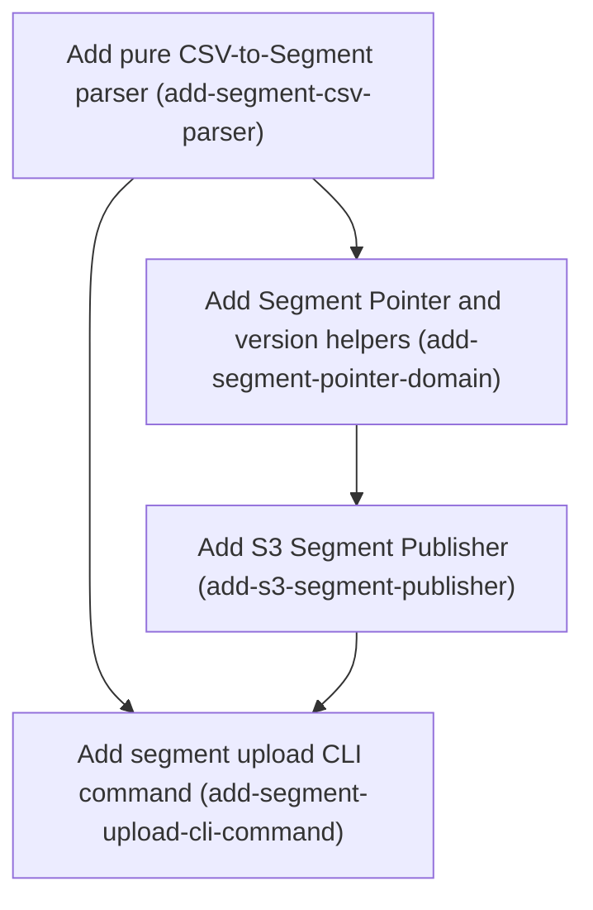

# Horizon 14 — Segment CSV upload and S3 segment publisher

## Executive summary

### 🎯 What are we trying to achieve?
An operator runs `featuresync segment upload --env prod --key beta-testers --file users.csv`. The CSV of user IDs becomes a validated segment and is stored in S3 as a new version that can never be overwritten. The segment's pointer file is then moved to it safely, so two uploads at the same time cannot both win. Loading those segments into running apps from S3 is the next horizon.

### 🧠 Why does this change need to happen?
Horizon 13 taught flags to target a *segment* (a named list of user IDs) and taught the SDK to evaluate it, but there is no way to create a segment in S3. Today someone would have to hand-write JSON files. The segment rules also live inside the core package without being exported, so the AWS package can't reuse them.

### At a glance
- Phases: 4
- Complexity: Medium (two small domain phases, one conditional-write S3 publisher, one CLI command)
- Main risk: a CSV quirk (BOM, CRLF, `007` vs `7`, stray spaces) silently changes who is in a segment
- Quality target: 100% coverage, ESLint layer rules green, publisher proven on LocalStack
- Testing focus: CSV edge cases, typed errors that never leak member values, conditional S3 writes (version collision, pointer race), CLI exit codes

## Implementation plan

### Order of work

1. **Add pure CSV-to-Segment parser** — starts immediately; everything else needs core's segment rules exported and a parsed Segment
2. **Add Segment Pointer and version helpers** — needs core's exported segment key rules
3. **Add S3 Segment Publisher** — needs the pointer format and object paths
4. **Add segment upload CLI command** — needs both the parser and the publisher

### Phase 1 — Add pure CSV-to-Segment parser
Technical ID: `add-segment-csv-parser` · Segment · domain · small blast radius

**Goal** — Export the horizon-13 segment contract (parseSegment, Segment, segmentKeySchema, MAX_SEGMENT_MEMBERS, MAX_SEGMENT_MEMBER_LENGTH, SEGMENT_SCHEMA_VERSION, SegmentValidationError, referencedSegmentKeys, SnapshotBundle) from @featuresync/core's entry point, then add a pure domain function in @featuresync/aws that turns member CSV text plus a segment key into a validated Segment: one Member per line, optional single header, values trimmed, BOM and CRLF handled, blank lines skipped, duplicates removed, members kept as canonical strings (so '007' stays '007'), final validation by core's parseSegment. Failures return typed reasons (EMPTY_FILE, MALFORMED_ROW, HEADER, TOO_MANY_MEMBERS, INVALID_SEGMENT).

**Why** — The segment rules already exist in core but are not exported, so the AWS package cannot use them without copying them. Segment Upload needs one well-defined way to read a CSV so membership never shifts because of formatting quirks. Keeping it pure and dependency-free makes every edge case unit-testable.

**Changes**
- Re-export the segment contract symbols and SnapshotBundle from packages/core/src/index.ts, with no contract change
- Create parseSegmentCsv(text, segmentKey) returning Result<Segment, SegmentCsvError>
- Reject empty input, quoted/multi-column rows and more than MAX_SEGMENT_MEMBERS members with typed reasons
- Strip BOM, normalise CRLF, trim, skip blanks, dedupe, then run parseSegment
- Unit-test every edge case including '007' vs 7 and header detection

**Files / areas**
- `packages/core/src/index.ts`
- `packages/core/test/application/public-api.test.ts`
- `packages/aws/src/domain/segment-csv.ts`
- `packages/aws/test/domain/segment-csv.test.ts`

**How to verify**
- CSV normalisation edge cases — packages/aws/test/domain/segment-csv.test.ts has a test where the input starts with \uFEFF and the first member does not contain the BOM
- Typed rejection reasons, no member data in errors — Each of the five reasons has at least one test that asserts result.ok === false and the exact reason string
- Reuses core's exported contract and stays pure domain — packages/core/src/index.ts exports parseSegment, Segment, segmentKeySchema, MAX_SEGMENT_MEMBERS, MAX_SEGMENT_MEMBER_LENGTH, SEGMENT_SCHEMA_VERSION, SegmentValidationError, referencedSegmentKeys, SnapshotBundle

**Done when** — packages/aws/src/domain/segment-csv.ts exporting parseSegmentCsv, built on core's newly exported segment contract, with full unit-test coverage of its typed rejection reasons. Every check under *How to verify* passes its bar.

**Depends on** — nothing — can start immediately

Reference — full rubric

| Dimension | Rule | Pass criteria | Failure examples | minScore |
|---|---|---|---|---|
| csv-normalisation-edge-cases | parseSegmentCsv turns messy but valid CSV text into the same canonical Segment every time: BOM stripped, CRLF and LF both handled, values trimmed, blank lines skipped, duplicates removed, members kept as strings exactly as written ('007' stays '007'). 10 = every listed quirk has a named unit test, including combinations of them; 8 = each quirk tested once; minScore 7. | packages/aws/test/domain/segment-csv.test.ts has a test where the input starts with \uFEFF and the first member does not contain the BOM A test feeds CRLF input and a test feeds a trailing newline plus blank lines; neither produces an empty-string member A test shows '007' and '7' come back as two different members, with '007' unchanged A test shows ' alice ' and 'alice' on separate lines produce one member 'alice' For 10: a single test combines BOM + CRLF + header + duplicates + trailing blank line and checks the exact member array | Plausible: BOM is stripped only when the file has no header, so the header check fails on '\uFEFFuser_id' and it is kept as a member Plausible: lines are split on '\n' only, so members end with '\r' and don't match at evaluation time Plausible: dedup runs before trimming, so 'bob' and 'bob ' both survive | 7 |
| typed-rejection-reasons | Every bad input returns an error Result with exactly one of EMPTY_FILE, MALFORMED_ROW, HEADER, TOO_MANY_MEMBERS, INVALID_SEGMENT, and never throws. Error messages give line numbers or counts, never member values, because Members are personal data (docs/spec/s3-layout.md). 10 = every reason has a boundary test and there is a test proving no member value appears in any message; 8 = every reason tested; minScore 7. | Each of the five reasons has at least one test that asserts result.ok === false and the exact reason string A test feeds exactly MAX_SEGMENT_MEMBERS unique members (ok) and a test feeds MAX_SEGMENT_MEMBERS + 1 (TOO_MANY_MEMBERS) A quoted row like '"a",b' or a two-column row returns MALFORMED_ROW with a line number A file with only a header, or only whitespace, returns EMPTY_FILE and does not throw No error message string in segment-csv.ts contains a member value (check the template literals); for 10 a test asserts this | Plausible: the member limit is checked before dedup, so a file with MAX+1 rows containing a duplicate is rejected wrongly Plausible: MALFORMED_ROW message is `invalid row: ${line}`, which puts the member value in logs Plausible: a member longer than MAX_SEGMENT_MEMBER_LENGTH makes core's parseSegment throw instead of returning INVALID_SEGMENT | 7 |
| reuses-core-contract-in-domain | The core entry point re-exports the segment contract with no contract change, and segment-csv.ts builds its result with core's parseSegment instead of copying rules; the file imports nothing from infrastructure, the AWS SDK, fs or the CLI. 10 = public-api test lists every new export and ESLint layer rules pass; 8 = exports present and used; minScore 7. | packages/core/src/index.ts exports parseSegment, Segment, segmentKeySchema, MAX_SEGMENT_MEMBERS, MAX_SEGMENT_MEMBER_LENGTH, SEGMENT_SCHEMA_VERSION, SegmentValidationError, referencedSegmentKeys, SnapshotBundle packages/core/test/application/public-api.test.ts checks those names are exported segment-csv.ts imports only from @featuresync/core (or relative domain files); no '@aws-sdk', 'node:fs', or '../infrastructure' import No re-declared member-count or key-regex constant appears in packages/aws; `git diff packages/core/src/domain/segment-contract.ts` is empty for this phase ESLint passes for packages/aws and packages/core | Plausible: the parser copies the segment key regex into aws instead of using segmentKeySchema, so the two drift later Plausible: the parser reads the file itself with fs.readFileSync, putting I/O in the domain layer Plausible: a new symbol is exported but public-api.test.ts is not updated, so a later removal goes unnoticed | 7 |

Healer hint: Most likely miss is an ordering bug (limit or dedup before trim, BOM only stripped in one path); fix by normalising (BOM, CRLF, trim, skip blank) first, then header, then dedup, then limit, then parseSegment, and add a combined-quirks test.

### Phase 2 — Add Segment Pointer and version helpers
Technical ID: `add-segment-pointer-domain` · Segment Publishing · domain · small blast radius

**Goal** — Add the domain type for the Segment Pointer ({segmentKey, version, objectKey}) with a zod schema whose objectKey must equal <env>/segments/<key>/<version>.json, plus segmentObjectKeyFor, segmentPointerKeyFor, nextSegmentVersion, buildSegmentPointer and a segment-key validator, reusing environmentSchema and validateEnvironmentName.

**Why** — Both the Segment Publisher and the S3 source must agree on where Segment Versions live and what the pointer looks like. Putting that in one pure module avoids two diverging copies and leaves the proven snapshot CurrentPointer untouched.

**Changes**
- Create segmentPointerSchema matching docs/spec/s3-layout.md field names
- Add key builders for Segment Version objects and the Segment Pointer
- Add nextSegmentVersion and buildSegmentPointer mirroring the snapshot helpers
- Validate segment keys with core's segmentKeySchema

**Files / areas**
- `packages/aws/src/domain/segment-pointer.ts`
- `packages/aws/test/domain/segment-pointer.test.ts`

**How to verify**
- Pointer schema enforces the S3 layout — Field names in segment-pointer.ts match the Segment Pointer example in docs/spec/s3-layout.md word for word
- Key builders and version stepping — segmentPointerKeyFor('prod','vip') returns 'prod/segments/vip/current.json'
- Snapshot pointer untouched, pure domain — `git diff packages/aws/src/domain/current-pointer.ts` shows no change

**Done when** — packages/aws/src/domain/segment-pointer.ts with schema and key/version helpers, fully unit-tested. Every check under *How to verify* passes its bar.

**Depends on** — Add pure CSV-to-Segment parser

Reference — full rubric

| Dimension | Rule | Pass criteria | Failure examples | minScore |
|---|---|---|---|---|
| pointer-schema-enforces-layout | segmentPointerSchema accepts only {segmentKey, version, objectKey} where objectKey equals exactly <env>/segments/<segmentKey>/<version>.json and field names match docs/spec/s3-layout.md. 10 = mismatch tests cover wrong key, wrong version, wrong env, and extra fields; 8 = valid and one mismatch case tested; minScore 7. | Field names in segment-pointer.ts match the Segment Pointer example in docs/spec/s3-layout.md word for word A test shows a pointer whose objectKey uses a different segment key is rejected A test shows a pointer whose objectKey version number differs from version is rejected A test shows version 0, negative and non-integer versions are rejected For 10: tests show extra fields are rejected (strict) or the chosen behaviour is written in the spec | Plausible: objectKey is checked only with endsWith('.json') or a regex, so a pointer for key 'a' pointing at 'segments/b/3.json' passes Plausible: the schema cannot know the env, so it checks segment and version but lets any env prefix through without saying so Plausible: field named 'key' instead of 'segmentKey', different from the spec | 7 |
| key-and-version-helpers | segmentObjectKeyFor, segmentPointerKeyFor, nextSegmentVersion and buildSegmentPointer return exactly the layout's paths and step versions like the snapshot helpers, rejecting bad env or segment key using environmentSchema/validateEnvironmentName and core's segmentKeySchema. 10 = helpers and schema share one path function so they cannot disagree, with round-trip test; 8 = all helpers tested; minScore 7. | segmentPointerKeyFor('prod','vip') returns 'prod/segments/vip/current.json' segmentObjectKeyFor('prod','vip',3) returns 'prod/segments/vip/3.json' nextSegmentVersion(undefined or no pointer) returns 1 and nextSegmentVersion(pointer with version 4) returns 5 A test passes buildSegmentPointer's output back through segmentPointerSchema and it parses A segment key like '../x' or 'A B' and an invalid env name are rejected with a typed error, not a thrown exception | Plausible: the schema and segmentObjectKeyFor build the path separately, and one uses a leading slash Plausible: a new env-name check is written instead of reusing validateEnvironmentName, so rules differ from snapshots Plausible: the segment key is not validated in the key builder, so '../prod/current' could form a path outside segments/ | 7 |
| snapshot-pointer-untouched-domain-pure | The module is new and pure: it does not change current-pointer.ts or the snapshot CurrentPointer, and imports no S3 client or infrastructure code. 10 = no diff to current-pointer.ts and shared helpers are reused, not copied; 8 = pure with minor duplication; minScore 7. | `git diff packages/aws/src/domain/current-pointer.ts` shows no change segment-pointer.ts has no '@aws-sdk' or '../infrastructure' import ESLint layer rules pass for packages/aws Test coverage for segment-pointer.ts is 100% | Plausible: CurrentPointer is made generic to serve both snapshots and segments, changing the proven snapshot code Plausible: the module imports S3 error types to define its errors, pulling infra into domain | 7 |

Healer hint: Most likely miss is objectKey checked loosely or built in two places; fix by making the schema's refine call segmentObjectKeyFor so there is one source of truth.

### Phase 3 — Add S3 Segment Publisher
Technical ID: `add-s3-segment-publisher` · Segment Publishing · infrastructure · medium blast radius

**Goal** — Add createS3SegmentPublisher in @featuresync/aws: validate env and segment key, probe the next version, write <env>/segments/<key>/<n>.json with IfNoneMatch:'*' (VERSION_EXISTS on collision), then CAS-move <env>/segments/<key>/current.json with IfMatch (CONFLICT on mismatch). No Change Notification is sent. Reuse s3-read helpers and the snapshot publisher's reason names plus INVALID_SEGMENT and INVALID_SEGMENT_KEY.

**Why** — A Segment Upload must never overwrite an old version and two concurrent uploads must not both win. The same conditional-write pattern already protects snapshots, so segments follow it in a smaller separate file.

**Changes**
- Create createS3SegmentPublisher with publish(env, segment) returning the new pointer
- Use IfNoneMatch '*' for version objects and IfMatch for the pointer
- Map S3 failures to S3PublishError reasons
- Export it from the aws index and add unit plus LocalStack tests

**Files / areas**
- `packages/aws/src/infrastructure/s3-segment-publisher.ts`
- `packages/aws/src/index.ts`
- `packages/aws/test/infrastructure/s3-segment-publisher.test.ts`
- `packages/aws/integration/s3-segment-publisher.localstack.test.ts`

**How to verify**
- Segment Versions are never overwritten — The PutObject for the version object in s3-segment-publisher.ts passes IfNoneMatch: '*'
- Pointer moves only by CAS — The pointer PutObject uses IfMatch with the ETag from the pointer read, and IfNoneMatch: '*' when there was no pointer
- Error mapping reuses snapshot reasons and hides members — Reason names are imported or shared from s3-snapshot-publisher.ts, not re-typed as new strings
- Reuse shared S3 helpers without touching snapshot publishing — s3-segment-publisher.ts imports from ./s3-read and ../domain/segment-pointer instead of redefining read/ETag logic or key paths

**Done when** — packages/aws/src/infrastructure/s3-segment-publisher.ts exporting createS3SegmentPublisher, covered by unit tests and a LocalStack publish/collision/CAS test. Every check under *How to verify* passes its bar.

**Depends on** — Add Segment Pointer and version helpers

**Rollback** — Uploaded objects are immutable and harmless; to roll back, remove the export and file. Stray segment objects under <env>/segments/ can be deleted manually since no snapshot references them until flags do.

Reference — full rubric

| Dimension | Rule | Pass criteria | Failure examples | minScore |
|---|---|---|---|---|
| immutable-version-write | The publisher writes <env>/segments/<key>/<n>.json with IfNoneMatch:'*' and maps a 412 on that write to VERSION_EXISTS without moving the pointer. 10 = LocalStack test proves an existing version object survives a colliding publish byte for byte; 8 = unit test with mocked 412 plus LocalStack happy path; minScore 7. | The PutObject for the version object in s3-segment-publisher.ts passes IfNoneMatch: '*' A unit test simulates a 412 on the version write and gets reason VERSION_EXISTS, and asserts no pointer PutObject was sent The LocalStack test pre-writes a version object, runs publish, and checks the original object content is unchanged The body written parses with core's parseSegment and includes SEGMENT_SCHEMA_VERSION | Plausible: the next version is probed but the write has no IfNoneMatch, so two racing uploads overwrite the same version Plausible: any 412 is mapped to CONFLICT, so the operator cannot tell a version collision from a pointer race Plausible: pointer is written first, then the version object, so a crash leaves a pointer to a missing object | 7 |
| pointer-cas-move | current.json is updated with IfMatch on the ETag read during probing (or IfNoneMatch:'*' when no pointer exists yet), and a mismatch returns CONFLICT. 10 = LocalStack test runs two publishes from the same probed state and only one wins; 8 = first-publish and mismatch cases covered; minScore 7. | The pointer PutObject uses IfMatch with the ETag from the pointer read, and IfNoneMatch: '*' when there was no pointer A unit test for the first-ever publish (pointer 404) returns version 1 and writes the pointer A unit test with a 412 on the pointer write returns CONFLICT The LocalStack test shows a stale-ETag publish gets CONFLICT and current.json still points to the winner publish returns the new Segment Pointer that matches segmentPointerSchema | Plausible: the first publish writes the pointer with no condition, so two first uploads both succeed Plausible: the ETag is read again right before the pointer write instead of reusing the probed one, which makes CAS useless Plausible: a 404 on the pointer read is mapped to an error instead of 'no pointer yet' | 7 |
| error-mapping-and-privacy | S3 failures map to the snapshot publisher's S3PublishError reason names plus INVALID_SEGMENT and INVALID_SEGMENT_KEY; invalid env/key/segment fail before any S3 call; no error message, log or thrown text contains member values. 10 = a test asserts member values are absent from every error path; 8 = each reason tested; minScore 7. | Reason names are imported or shared from s3-snapshot-publisher.ts, not re-typed as new strings Tests show invalid env, invalid segment key and invalid segment return typed errors and the fake S3 client got zero calls An access-denied or network error from S3 maps to the same reason the snapshot publisher uses for it No console/logger call or error message in s3-segment-publisher.ts includes the segment body or members The file does not send a Change Notification (no SNS/notifier import) | Plausible: an S3 error is wrapped with `cause` holding the request, whose Body contains every member Plausible: a new 'SEGMENT_CONFLICT' reason is invented, so the CLI's existing exit-code map misses it Plausible: the publisher reuses the snapshot publisher's notifier hook and fires a Change Notification | 7 |
| reuse-without-snapshot-regression | The publisher reuses s3-read helpers and the segment-pointer domain module, is exported from packages/aws/src/index.ts, and leaves snapshot publisher behaviour unchanged. 10 = no diff to s3-snapshot-publisher.ts beyond exporting shared names and 100% coverage; 8 = reuse plus passing existing tests; minScore 7. | s3-segment-publisher.ts imports from ./s3-read and ../domain/segment-pointer instead of redefining read/ETag logic or key paths packages/aws/src/index.ts exports createS3SegmentPublisher All existing snapshot publisher unit and LocalStack tests still pass Coverage for s3-segment-publisher.ts is 100% | Plausible: the key path string is built inline in the publisher instead of calling segmentObjectKeyFor Plausible: snapshot publisher code is refactored into a generic base and a snapshot test breaks | 7 |

Healer hint: Most likely miss is the first-publish case (no pointer) written without IfNoneMatch or a 404 treated as an error; fix by branching on probed ETag presence and adding a unit plus LocalStack race test.

### Phase 4 — Add segment upload CLI command
Technical ID: `add-segment-upload-cli-command` · Segment Publishing · interface · small blast radius

**Goal** — Add `featuresync segment upload --env --key --file [--bucket]` as the CLI's first two-word command: read the file, call parseSegmentCsv, pass the Segment to createS3SegmentPublisher, print the new version, and map reasons to existing exit codes (1 invalid CSV/segment, 2 CONFLICT/VERSION_EXISTS, 3 usage or I/O). It sends no Change Notification.

**Why** — Operators need one command to turn a member list into a live Segment. Keeping it thin means all rules stay in tested domain and publisher code.

**Changes**
- Handle positionals ['segment','upload'] and reject unknown segment subcommands with usage exit 3
- Parse --env, --key, --file, --bucket options
- Delegate to parseSegmentCsv and createS3SegmentPublisher and map reasons in the existing reason-to-exit map
- Add CLI tests for success and each exit code

**Files / areas**
- `packages/cli/src/main.ts`
- `packages/cli/test/main.test.ts`

**How to verify**
- Every reason maps to the documented exit code — packages/cli/test/main.test.ts has a success test that checks exit 0 and the new version number in stdout
- Two-word command and option parsing — `featuresync segment` with no subcommand and `featuresync segment delete` both exit 3 with usage text
- Thin command, no member data in output, no notification — The segment upload handler in main.ts has no CSV splitting, trimming or S3 key building; it calls parseSegmentCsv and createS3SegmentPublisher

**Done when** — A working `featuresync segment upload` command in packages/cli/src/main.ts with tests for every exit code. Every check under *How to verify* passes its bar.

**Depends on** — Add pure CSV-to-Segment parser, Add S3 Segment Publisher

Reference — full rubric

| Dimension | Rule | Pass criteria | Failure examples | minScore |
|---|---|---|---|---|
| exit-code-mapping | `featuresync segment upload` returns 0 on success, 1 for every CSV or segment problem (EMPTY_FILE, MALFORMED_ROW, HEADER, TOO_MANY_MEMBERS, INVALID_SEGMENT, INVALID_SEGMENT_KEY), 2 for CONFLICT and VERSION_EXISTS, and 3 for usage and file I/O errors, through the existing reason-to-exit map in packages/cli/src/main.ts. 10 = one test per reason; 8 = one test per exit code; minScore 7. | packages/cli/test/main.test.ts has a success test that checks exit 0 and the new version number in stdout There are tests for exit 1 (bad CSV), exit 2 (CONFLICT and VERSION_EXISTS), and exit 3 (missing --file, unreadable file, missing --key) The new reasons are added to the existing reason-to-exit map in main.ts, not handled by a separate switch For 10: every CSV reason name has its own test | Plausible: a missing file makes readFile throw and the CLI crashes with a stack trace and exit 1 instead of exit 3 Plausible: VERSION_EXISTS is left out of the map and falls to a default exit code Plausible: INVALID_SEGMENT_KEY from the publisher is mapped to 3 as a usage error, not 1 as the phase specifies | 7 |
| subcommand-and-option-parsing | The CLI accepts ['segment','upload'] with --env, --key, --file and optional --bucket, rejects unknown segment subcommands and missing required options with usage exit 3, and does not change how existing one-word commands parse. 10 = tests for 'segment' alone, 'segment foo', and each missing option, plus unchanged existing tests; 8 = main paths tested; minScore 7. | `featuresync segment` with no subcommand and `featuresync segment delete` both exit 3 with usage text Each missing required option (--env, --key, --file) has a test that exits 3 --bucket falls back to the same default/env source the existing publish command uses All existing CLI tests pass unchanged | Plausible: the parser only looks at positionals[0], so 'segment anything' runs upload Plausible: adding a second positional breaks an existing command that treated extra positionals as an error | 7 |
| thin-interface-no-leaks | The command only reads the file, calls parseSegmentCsv and createS3SegmentPublisher, and prints the result; it holds no CSV or S3 rules, never prints member values, and sends no Change Notification. 10 = a test asserts stdout/stderr contain no member from the input on success and failure; 8 = thin and no notifier; minScore 7. | The segment upload handler in main.ts has no CSV splitting, trimming or S3 key building; it calls parseSegmentCsv and createS3SegmentPublisher No notifier/SNS call is reachable from the segment upload path (check imports and handler) Success output shows segment key and version, not members or member count lists For 10: a test uses a recognisable member like 'secret-user@example.com' and asserts it is not in stdout or stderr on success and on a failure | Plausible: the error path prints `JSON.stringify(error)` and the error carries the parsed members Plausible: the command trims or dedupes lines itself before calling the parser, duplicating domain rules Plausible: the handler reuses the publish command's flow and triggers a Change Notification | 7 |

Healer hint: Most likely miss is file read errors crashing or new reasons missing from the exit map; fix by wrapping the read in a Result mapped to exit 3 and adding every new reason to the existing map with a test each.

## Discovery findings

| Area | Finding | File | Implication |
|---|---|---|---|
| core public API | packages/core/src/index.ts does NOT export parseSegment, Segment, segmentKeySchema, SEGMENT_KEY_PATTERN, MAX_SEGMENT_MEMBERS, MAX_SEGMENT_MEMBER_LENGTH, SEGMENT_SCHEMA_VERSION, SegmentValidationError, referencedSegmentKeys or SnapshotBundle; it exports parseSnapshot, Snapshot, SnapshotSource, Unsubscribe, Logger. | packages/core/src/index.ts | Add these to core's public exports (exports only, no contract change) before aws can validate segments or find referenced keys without duplicating core logic. |
| segment contract | segment-contract.ts: MAX_SEGMENT_MEMBERS=100_000, MAX_SEGMENT_MEMBER_LENGTH=256, SEGMENT_KEY_PATTERN, SEGMENT_SCHEMA_VERSION=1, parseSegment(input): Result<Segment, SegmentValidationError> (zod). | packages/core/src/domain/segment-contract.ts | CSV parser builds a candidate and runs parseSegment, reusing exported limits so errors match what the SDK reads. |
| bundle port | SnapshotBundle is {snapshot: unknown; segments: readonly unknown[]}; FlagClient detects a bundle via Object.hasOwn(raw,'snapshot'), validates each segment, logs+skips invalid ones, keeps a held segment when omitted. | packages/core/src/application/flag-client.ts | S3 source may send raw segment JSON and omit unloadable segments; it must not duplicate fail-safe/hold logic. |
| S3 snapshot source | createS3SnapshotSource (178 lines) has no segment logic; poll ticks and env-filtered pushes run through one serial promise queue ('serially') and emit a raw snapshot via onChange. | packages/aws/src/infrastructure/s3-snapshot-source.ts | Add segment loading and per-segment pointer polling inside the serially queue; load() and onChange switch to a bundle; update existing unit and LocalStack source tests expecting a bare snapshot. |
| S3 read helpers | s3-read.ts exports readObjectText, isNotFound, isMissing, isAccessDenied, parseJsonObject. current-pointer.ts is snapshot-specific (snapshotKey, snapshotKeyFor); environmentSchema exported there. | packages/aws/src/domain/current-pointer.ts | Reuse s3-read; add a separate segment pointer domain type {segmentKey, version, objectKey} with its own objectKey refine and segmentObjectKeyFor; reuse environmentSchema; do not generalize CurrentPointer. |
| publishing domain | publishing.ts exports PublishingErrorReason, PublishingResult, nextSnapshotVersion, buildCurrentPointer, validateEnvironmentName, validateVersion, stampSnapshot and rollback helpers; all snapshot-specific except env/version validators. | packages/aws/src/domain/publishing.ts | Segment publisher needs nextSegmentVersion, buildSegmentPointer and a segment-key validator; reuse validateEnvironmentName and PublishingResult; CSV parser in a separate domain file. |
| S3 snapshot publisher | s3-snapshot-publisher.ts (329 lines) exports createS3SnapshotPublisher and S3PublishError (INVALID_SNAPSHOT, INVALID_POINTER, CONFLICT, VERSION_EXISTS, INVALID_ENVIRONMENT, INVALID_ROLLBACK_TARGET, VERSION_PROBE_LIMIT, REQUEST_FAILED); coupled to notify. | packages/aws/src/infrastructure/s3-snapshot-publisher.ts | Build createS3SegmentPublisher as a separate smaller file with no notifier, same IfNoneMatch/IfMatch CAS pattern and reason names plus INVALID_SEGMENT/INVALID_SEGMENT_KEY; export from aws index. |
| CLI structure | CLI is one file main.ts (258 lines), switch on positionals[0] (validate, publish, rollback, pull), node parseArgs, exit codes 0 OK, 1 INVALID_SNAPSHOT, 2 CONFLICT, 3 USAGE_OR_IO, one reason-to-exit map; no layer folders. | packages/cli/src/main.ts | 'segment upload' needs a nested second positional; map CSV/segment validation errors to existing code 1 rather than new codes. |
| package graph | cli depends on @featuresync/aws and core; aws depends on core and zod; core only on zod. |  | No new package dependencies needed. |
| ESLint layers | Root eslint.config zones for ./packages/*/src/{domain,application,infrastructure}: domain must not import application/infrastructure; application must not import infrastructure. | eslint.config.js | CSV parser and segment pointer go in aws/src/domain (may import core, not s3-read); AWS SDK code in infrastructure. |
| IAM / deploy | Reader and Publisher policies scope objects to ${SnapshotBucket.Arn}/${Environment}/* and ListBucket prefix ${Environment}/*; s3-layout.md states no IAM change is needed for segments. | packages/deploy/template/featuresync-stack.json | No deploy phase needed. |
| spec | s3-layout.md already fully documents segments: layout, IfNoneMatch '*', pointer {segmentKey, version, objectKey}, load only referenced segments, no hold-back on failure, polling with conditional GET/304 plus version dedup; change-notification.md says segment uploads send no notification. | docs/spec/s3-layout.md | Docs work is reconciliation only; implementation must match the pointer field names and ETag conditional-GET polling. |
| integration tests | packages/aws/integration has LocalStack tests for snapshot publisher, source, fetcher, pointer reader, push detection, deployment stack; no segment test yet. | packages/aws/integration/s3-snapshot-source.localstack.test.ts | Add segment-publisher and end-to-end segment LocalStack tests on the existing harness; update the existing source LocalStack test for bundle output. |

## Out of scope

- Dashboard segment display and rollout editing: the brief defers them to keep this horizon at 3–5 phases, and the PII and version-display questions are still open.
- Change Notifications on segment upload: the binding decision says segment changes are detected by polling only and the notification contract covers snapshots only.
- Segment rollback and delete commands: not requested. Recovery can re-upload an earlier CSV as a new version.
- Listing all segments via ListObjectsV2: readers never list the bucket, and listing would need IAM changes.
- Changes to evaluation semantics, the bucket hash or the snapshot schema: these landed and are binding from horizon 13.
- Fixing the file-snapshot-source watch for segment-only edits: this is a local-dev source concern, separate from the S3 write and load path. It can be a later small fix.
- IAM template changes: existing policies already cover <env>/segments/* under ${Environment}/*.
- Non-TypeScript SDK segment loading: the spec contract stays language-neutral, but only the TS SDK is built.
- NestJS package changes: it only calls isEnabled and needs no change.
- S3 source segment loading (load-segments-in-s3-source) — held for the next Planning Horizon to keep this one small and reviewable — the Planning Brief and project memory carry the context forward
- End-to-end LocalStack chain test (CSV upload -> publish -> source bundle -> FlagClient inSegment/rollout -> re-upload changes evaluation) — needs this horizon plus next horizon's S3 source loading; plan it first next horizon so this horizon stays within size.
- docs/spec s3-layout.md and segments page reconciliation — discovery shows the spec already documents segments; any drift fix is a step inside the phase that causes it, not a phase.
- Load test at MAX_SEGMENT_MEMBERS (100,000) for Node SDK memory/latency — open horizon-13 blocker; needs the loading path first and its own measurement plan.
- Extracting shared publish logic between snapshot and segment publishers — YAGNI until duplication is proven; risks regressions in the proven snapshot publish path.

## Success criteria

- (1) A pure CSV parser turns a member CSV into the horizon-13 segment contract via core's exported parseSegment, rejecting empty files, malformed rows, header problems and more than MAX_SEGMENT_MEMBERS members with typed reasons, trimming, skipping blanks, deduping and keeping canonical strings. (2) The S3 segment publisher writes <env>/segments/<key>/<n>.json with IfNoneMatch:* (VERSION_EXISTS on collision) and CAS-moves current.json with IfMatch, proven on LocalStack. (3) `featuresync segment upload --env --key --file [--bucket]` is a thin CLI command mapping reasons to the existing exit codes and sending no Change Notification. (4) 100% coverage and ESLint layer rules pass in every package. SDK segment loading and the end-to-end chain test are next horizon.
- Add pure CSV-to-Segment parser: packages/aws/src/domain/segment-csv.ts exporting parseSegmentCsv, built on core's newly exported segment contract, with full unit-test coverage of its typed rejection reasons.
- Add Segment Pointer and version helpers: packages/aws/src/domain/segment-pointer.ts with schema and key/version helpers, fully unit-tested.
- Add S3 Segment Publisher: packages/aws/src/infrastructure/s3-segment-publisher.ts exporting createS3SegmentPublisher, covered by unit tests and a LocalStack publish/collision/CAS test.
- Add segment upload CLI command: A working `featuresync segment upload` command in packages/cli/src/main.ts with tests for every exit code.

## Alignment preview
The mechanical size cut kept 4 of 6 phases: core exports, parser, pointer and publisher. That pushed out the CLI command and S3 source loading. The preview check raised 3 concerns: the plan didn't deliver what was asked for, the export phase was too small to stand alone, and the success bar couldn't be met by the kept phases. In 1 redirect round the user chose "Add the upload command". The core-export step was folded into the CSV parser phase, the CLI phase was kept, S3 source loading was deferred to the next horizon, and the success definition was trimmed to match.

## Quality gate
The full path ran, with 1 gate iteration. The critic passed with 0 blockers and 0 majors. It raised 10 minor issues, which are accepted debt:
- The parser phase has two deliverables: core exports plus the parser (the user chose this).
- The CSV parser and publisher use different bounded-context names (Segment vs Segment Publishing) without explaining why.
- The success-coverage score is 7 (at the bar).

Three minors were fixed mechanically: the objective was trimmed to the write path, duplicate and stale deferred entries were removed, and the source-polling risks are marked as carried forward. No verification call and no healer call were needed.

## Cost
7 Agent calls against a budget of 8–10: Stage 1, Discovery, Stage 3, preview concerns, Stage 3.5, Stage 4, and the critic. Budget was not exceeded, and Stage 3 was not re-run: the redirect was applied mechanically.

## Full analysis

**domainShape:** business — The work models segment membership, versioned segment publication and targeting-bundle consistency. These rules decide which users see a flag, so they are domain rules and not just machinery.

| Term | Meaning |
|---|---|
| Segment | A named, keyed set of canonical member strings, referenced by flags through the inSegment condition. |
| Segment Upload | The `featuresync segment upload` CLI action that parses a CSV into a Segment and publishes it as a new immutable version. |
| Segment Version | An immutable <env>/segments/<key>/<n>.json object that is never overwritten. |
| Segment Pointer | The mutable <env>/segments/<key>/current.json. The publisher moves it by CAS, and SDKs poll it to follow the latest Segment Version. |
| Segment Publisher | The @featuresync/aws single writer that stores a Segment Version and CAS-moves its Segment Pointer. |
| Snapshot Bundle | The atomic {snapshot, segments[]} value a SnapshotSource emits and FlagClient stores under one ticket. |
| Member | One canonical identifier in a Segment: a string as-is, or a safe integer in decimal. |
| Fail-safe No-match | The rule that an unloadable segment never blocks a snapshot swap. Its conditions simply do not match. |
| Segment Publishing | Subsystem name used as this phase's bounded context. |

**Assumptions**
- Horizon 13's segment contract, schemaVersion 2 snapshot, bucket hash, evaluate(options.segments/flagKey) and FlagClient bundle port are final. This horizon consumes them and does not change them.
- The segment S3 layout mirrors snapshots: immutable <env>/segments/<key>/<n>.json plus one mutable <env>/segments/<key>/current.json pointer, as the horizon-13 spec defines.
- The CSV parser is pure domain code with no third-party dependency. It lives in @featuresync/aws's domain next to publishing.ts, so the CLI stays thin and core keeps zod as its only dependency. Format: one member per line, an optional single header, trimmed values, blank lines skipped, duplicates removed.
- The segment publisher is part of the CLI-owned single writer in @featuresync/aws. It reuses the snapshot publisher's version-probe and CAS-pointer flow rather than a second implementation.
- Deployed IAM already covers <env>/segments/* through the bucket/${Environment}/* policies, so no deploy template change is needed. This is confirmed by the existing static policy-assertion tests.
- Any segment change re-emits the whole bundle. There are no fine-grained segment updates, because the store holds snapshot and segments as one value under one ticket.
- Segment keys a snapshot no longer references stop being polled. Keys it starts referencing are fetched before the next emit, or fail safe.

**Risks**
- Polling N segment pointers inside the single-emit, serial poll/push/reconcile loop can race or re-emit stale bundles. Ticket ordering and serial loads must cover the segment polls too. (carried to the next horizon with S3 source loading)
- Segment fetch failures could stall the snapshot swap and break the 'never holds the swap' decision. Failures could also be swallowed silently. The source needs an onError-style report while still emitting. (carried to the next horizon with S3 source loading)
- A CSV at the documented maximum member count could exceed memory or latency budgets in the Node SDK. This is the open horizon-13 blocker, and a load test is needed to answer it.
- Duplicating publisher logic between snapshots and segments would break DRY. Extracting the shared logic risks regressions in the proven snapshot publish, rollback and CAS paths.
- Segment uploads send no Change Notification (decision). Push-only deployments therefore see a segment change only after the next poll interval. This must be documented, not 'fixed' by reopening the decision.
- A CSV parsing edge case can shift membership: BOM, CRLF, quoted values, or numeric members such as '007' versus 7. The one-canonical-string decision must hold end to end.
- LocalStack behaviour for many concurrent IfNoneMatch GETs on segment pointers may differ from real S3.
- The file-source watch ignoring segment-only edits is a known gap. Leaving it could look like an inconsistency between sources.
