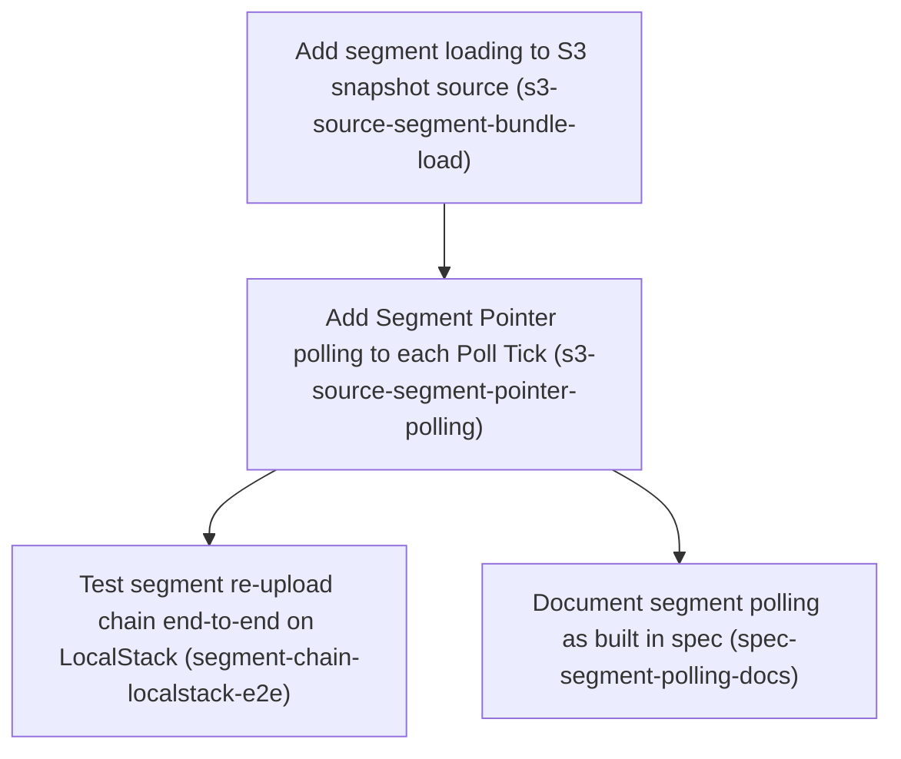

# Horizon 15 — Load segments in the S3 snapshot source

## 🎯 What are we trying to achieve?

Apps that read flags from S3 should also receive the segments (member lists uploaded from CSV) that their flags target, and pick up a re-uploaded CSV on the next poll without anyone republishing flags. The proof is a LocalStack test where re-uploading a CSV flips a flag result in a running client.

## 🧠 Why does this change need to happen?

Horizons 13–14 built segment rules in the core client, the CSV parser, the S3 segment publisher and the `segment upload` CLI. But `createS3SnapshotSource` still hands the client only the bare flag snapshot, so in any S3-backed app a rule like "user is in segment beta-testers" never matches. This horizon closes that gap inside the AWS adapter only; the core client already accepts snapshot+segments bundles.

## At a glance

- **Phases:** 4
- **Complexity:** Medium — two medium adapter phases touching the same polling loop, then a test and a docs edit
- **Main risk:** when the flag set and several segments change in the same poll, the source must send one consistent update, not several stale ones
- **Testing focus:** exactly-one emission per poll, no re-download of unchanged segments, PII-safe logging (segment key only), push/poll ordering, 100% coverage, LocalStack flip test without sleeps

## Order of work

1. **Add segment loading to S3 snapshot source** — first, so a newly loaded flag set carries its segments.
2. **Add Segment Pointer polling to each Poll Tick** — builds on step 1's per-segment cache so segment-only changes are picked up.
3. **Test segment re-upload chain end-to-end on LocalStack** — needs polling to see the re-upload.
4. **Document segment polling as built in spec** — describes the behaviour step 2 implemented (can run in parallel with step 3).

### Phase 1 — Add segment loading to S3 snapshot source

Technical ID: `s3-source-segment-bundle-load` · Snapshot Delivery · infrastructure · medium blast radius

**Goal** — When createS3SnapshotSource loads a new Snapshot, it also resolves every Segment Version that Snapshot references and emits one Snapshot Bundle ({snapshot, segments}) instead of the bare snapshot.

**Why** — Today the source emits only the bare snapshot (load() returns loaded.snapshot and deliver() calls onChange(snapshot)), so FlagClient never receives segments from S3 and inSegment conditions can never match. The core port already accepts a SnapshotBundle, so this change stays inside the S3 adapter.

**Changes**
- After a Snapshot is loaded, call parseSnapshot(raw) from @featuresync/core and then referencedSegmentKeys(snapshot) to get the segment keys it uses. If parsing fails or no keys are referenced, emit the bare raw snapshot unchanged, as createFileSnapshotSource.withSegments does. This keeps existing tests, including the 'not a snapshot' pass-through, green.
- For each referenced key, read <env>/segments/<key>/current.json with segmentPointerKeyFor and parseSegmentPointer from packages/aws/src/domain/segment-pointer.ts. Reject a pointer whose environment or segmentKey does not match. Then read segmentObjectKeyFor(...) with readObjectText and parseJsonObject. Run the reads in parallel with Promise.all inside the existing serially() queue.
- Omit any segment that fails to load (not found, access denied, invalid pointer, invalid JSON) from the bundle. Log it through the existing Logger by segment key only, never with the cause, because segments hold PII. FlagClient then keeps the last-known-good segment if it holds one, and otherwise applies Fail-safe No-match.
- Add a per-segment cache {etag, version, segment} on the source state. The next phase uses it for polling.
- Add fake-s3 unit tests for every new branch so the 100% coverage gate holds: bundle emitted, bare snapshot when no keys, missing pointer, env/key mismatch, invalid JSON, stopped mid-load, all segments failing.

**Files / areas**
- `packages/aws/src/infrastructure/s3-snapshot-source.ts`
- `packages/aws/test/infrastructure/s3-snapshot-source.load.test.ts`
- `packages/aws/test/infrastructure/s3-snapshot-source.subscribe.test.ts`
- `packages/aws/test/infrastructure/fake-s3.ts`

**How to verify**
- **One Snapshot Bundle per load** — s3-snapshot-source.load.test.ts has a test where a snapshot with inSegment keys A and B produces exactly one onChange call whose argument has .snapshot and .segments with both keys
- **Bare snapshot when no segments** — A test asserts that a snapshot with no inSegment rules is emitted with toBe/toEqual on the raw object, with no segments wrapper
- **Unloadable segment omitted, logged by key only** — There are separate tests for missing pointer, env mismatch, segmentKey mismatch and invalid JSON; each asserts the key is absent from bundle.segments
- **Change stays in the aws adapter, reusing core helpers** — git diff --stat shows no files under packages/core/src
- **Full coverage including stop mid-load** — The root vitest.config.ts coverage run reports 100% for s3-snapshot-source.ts

**Done when** — s3-snapshot-source.load.test.ts passes, showing that a Snapshot which references segments is delivered as a single Snapshot Bundle with its resolved Segment Versions, and that unloadable segments are omitted and logged by key only. Every check under *How to verify* passes its bar.

**Depends on** — nothing — can start immediately

Reference — full rubric

| Dimension | Rule | Pass criteria | Failure examples | Min |
|---|---|---|---|---|
| single-bundle-emission | A loaded Snapshot that references segments is delivered to onChange exactly once, as {snapshot, segments} holding every resolved Segment Version. | s3-snapshot-source.load.test.ts has a test where a snapshot with inSegment keys A and B produces exactly one onChange call whose argument has .snapshot and .segments with both keys onChange call count is asserted with toHaveBeenCalledTimes(1), not just toHaveBeenCalledWith Segment reads go through Promise.all inside serially(), visible in s3-snapshot-source.ts | onChange called once with the bare snapshot, then again with the bundle Segments emitted keyed by pointer version instead of segment key Reads done sequentially outside the serial queue, so a concurrent push interleaves | 8 |
| bare-snapshot-passthrough | A snapshot that references no segments, or that parseSnapshot rejects, is emitted as the unchanged raw value, as createFileSnapshotSource.withSegments does. | A test asserts that a snapshot with no inSegment rules is emitted with toBe/toEqual on the raw object, with no segments wrapper The existing 'not a snapshot' pass-through test still passes unchanged No segments/*/current.json GET is recorded by fake-s3 in the no-key case | Emits {snapshot, segments: {}} for a segment-free snapshot, which breaks existing equality tests A parseSnapshot throw propagates and kills the source instead of passing through | 8 |
| unloadable-segment-omitted-pii-safe | A missing pointer, env/segmentKey mismatch, access denied or invalid JSON leaves that key out of the bundle and logs only the segment key, never the error cause or segment content. | There are separate tests for missing pointer, env mismatch, segmentKey mismatch and invalid JSON; each asserts the key is absent from bundle.segments Logger spy assertions check that the message/fields contain the key and do not contain the error object, the message text or member ids (e.g. expect(JSON.stringify(logCalls)).not.toContain('<member>')) A test where all segments fail still emits one bundle, with empty segments | logger.warn('segment load failed', { key, err }) leaks S3 error text or the parse snippet holding PII A pointer whose environment differs is accepted because only segmentKey is checked One failing segment rejects the Promise.all, so the whole snapshot is dropped | 8 |
| layer-boundary-aws-adapter | Segment loading lives only in packages/aws/src/infrastructure/s3-snapshot-source.ts, using core's parseSnapshot/referencedSegmentKeys and aws's segmentPointerKeyFor/parseSegmentPointer/segmentObjectKeyFor, with no change to core's port or FlagClient. | git diff --stat shows no files under packages/core/src grep in s3-snapshot-source.ts finds the imports referencedSegmentKeys, parseSnapshot, segmentPointerKeyFor, parseSegmentPointer and segmentObjectKeyFor No re-implemented key-walking or pointer-path string templates (grep for '/segments/' literals in s3-snapshot-source.ts returns nothing) | A handwritten walker over rules for inSegment duplicates referencedSegmentKeys The SnapshotSource port is widened in core to add a segments callback | 8 |
| coverage-and-stop-safety | Every new branch is covered, including stopping the source while segment reads are in flight, so nothing is emitted after stop. | The root vitest.config.ts coverage run reports 100% for s3-snapshot-source.ts A test stops the source during a pending segment GET (a deferred promise in fake-s3) and asserts that onChange is not called afterward The per-segment cache {etag, version, segment} is populated, which a test asserts or later-phase tests exercise | A stopped check exists after the snapshot read but not after the segment Promise.all, so a late bundle is emitted The coverage threshold is met by adding an istanbul ignore on the error branches | 8 |

Healer hint: Most likely the bundle path emits for segment-free snapshots or logs the caught error; route no-key and parse-fail cases to the raw snapshot, and log only { segmentKey }.

### Phase 2 — Add Segment Pointer polling to each Poll Tick

Technical ID: `s3-source-segment-pointer-polling` · Snapshot Delivery · infrastructure · medium blast radius

**Goal** — Every Poll Tick, and every push-triggered read, re-checks the Segment Pointers of the current Snapshot with ETag/IfNoneMatch. It emits exactly one new Snapshot Bundle when any Segment Version changed, even if the Snapshot itself did not.

**Why** — Segment Uploads send no Change Notification (horizon 13 decision), so polling is the only way a re-upload reaches FlagClient. The current tick exits early on a Snapshot 304, so segment checking must run as a separate step after that exit.

**Changes**
- Change tick() and the push handler so that after the Current Pointer check, including the 304 and unchanged-version paths, they GET each referenced Segment Pointer with IfNoneMatch set to its cached etag. Skip IfNoneMatch on reconcile ticks, as the snapshot path does.
- Fetch a Segment Version only when the pointer version differs from the cached one. On a 304 or the same version, reuse the cached segment. If a pointer has no etag, clear that key's cache entry, mirroring the loaded=undefined handling.
- Retry segments that previously failed on every tick until they load.
- Emit at most one Snapshot Bundle per tick, and only after all segment reads have settled. Do not emit when neither the Snapshot nor any Segment Version changed. Drop cache entries for keys the new Snapshot no longer references.
- Add unit tests: segment-only change emits once, unchanged segments are not re-fetched, Snapshot and segment change together emit once, a failed segment recovers on a later tick, push and poll stay serialized.

**Files / areas**
- `packages/aws/src/infrastructure/s3-snapshot-source.ts`
- `packages/aws/test/infrastructure/s3-snapshot-source.push.test.ts`
- `packages/aws/test/infrastructure/s3-snapshot-source.load.test.ts`

**How to verify**
- **A segment-only change emits exactly one bundle** — A test in s3-snapshot-source.load or push tests changes only segments/<key>/current.json in fake-s3, advances one poll, and asserts onChange toHaveBeenCalledTimes(previous+1) with the new segment content
- **Unchanged segments are not re-fetched** — A fake-s3 request log shows IfNoneMatch equal to the cached etag on segment pointer GETs during normal ticks and absent on reconcile ticks
- **Failed segments retried; unreferenced ones dropped** — A test fails a segment on tick 1, fixes it in fake-s3, and asserts the tick 2 bundle contains it
- **Push and poll serialized** — s3-snapshot-source.push.test.ts fires a push while a poll tick's segment GET is pending and asserts that the emissions are ordered, with no stale bundle after a fresh one
- **Adapter-only change with a 100% gate** — git diff shows no packages/core/src changes

**Done when** — s3-snapshot-source.push.test.ts and load tests pass, showing that a Segment Pointer change with an unchanged Snapshot produces exactly one new Snapshot Bundle and that unchanged segments are not re-fetched. Every check under *How to verify* passes its bar.

**Depends on** — Add segment loading to S3 snapshot source

Reference — full rubric

| Dimension | Rule | Pass criteria | Failure examples | Min |
|---|---|---|---|---|
| segment-only-change-emits-once | When the Snapshot pointer returns 304 or has the same version but a Segment Pointer moved, the tick emits exactly one new Snapshot Bundle with the new Segment Version. | A test in s3-snapshot-source.load or push tests changes only segments/<key>/current.json in fake-s3, advances one poll, and asserts onChange toHaveBeenCalledTimes(previous+1) with the new segment content A test where the Snapshot and a segment change in the same tick asserts exactly one emission A tick with nothing changed asserts no emission | tick() still returns early on the Snapshot 304 before checking segments The Snapshot change emits, then the segment refresh emits a second, stale-then-fresh bundle | 8 |
| conditional-fetch-no-refetch | Segment Pointers are fetched with IfNoneMatch set to the cached etag (not on reconcile ticks), and a Segment Version object is GET'd only when the pointer version differs. | A fake-s3 request log shows IfNoneMatch equal to the cached etag on segment pointer GETs during normal ticks and absent on reconcile ticks Across two unchanged ticks, the test asserts zero GETs of the segment object key A pointer with no etag clears its cache entry, and a test covers this | IfNoneMatch is also sent on reconcile ticks, so a lost cache never self-heals A 200 pointer with the same version still refetches the segment object | 8 |
| failed-segment-recovery-and-pruning | A segment that failed on an earlier tick is retried every tick until it loads and then emits; cache entries for keys the new Snapshot no longer references are removed. | A test fails a segment on tick 1, fixes it in fake-s3, and asserts the tick 2 bundle contains it A test switches the Snapshot to drop key B and asserts B is absent from the next bundle and from internal cache (no further GETs of B's pointer) | A failed key has no cache entry so it is never retried after the Snapshot 304 A removed key keeps being polled forever and is re-included in the bundle | 7 |
| push-poll-serialized | Push-triggered reads re-check Segment Pointers and run through the same serially() queue as poll ticks, so their emissions never interleave. | s3-snapshot-source.push.test.ts fires a push while a poll tick's segment GET is pending and asserts that the emissions are ordered, with no stale bundle after a fresh one A push with an unchanged Snapshot but a moved segment emits one bundle | The push handler calls the segment refresh directly outside serially(), so an older bundle overwrites a newer one | 8 |
| adapter-boundary-and-coverage | Polling logic stays in s3-snapshot-source.ts with no core/FlagClient changes, and the 100% coverage gate holds. | git diff shows no packages/core/src changes The root vitest.config.ts coverage run passes at 100% for packages/aws | FlagClient is patched to diff segments itself instead of the source deduping emissions | 8 |

Healer hint: Most likely the Snapshot-304 early return still skips segment checks; restructure tick() into snapshot-check then segment-check, then a single emit if anything changed.

### Phase 3 — Test segment re-upload chain end-to-end on LocalStack

Technical ID: `segment-chain-localstack-e2e` · Snapshot Delivery · cross-cutting · small blast radius

**Goal** — Prove on LocalStack that CSV upload -> S3 segment publisher -> Snapshot Bundle from the source -> FlagClient inSegment and rollout evaluation works, and that a CSV re-upload changes the evaluation without republishing the Snapshot.

**Why** — Unit tests use fake-s3. Only a real S3 API (LocalStack) shows that the ETag polling, the publisher's pointer move and FlagClient's bundle handling agree. This is the horizon's acceptance proof and a separate deliverable.

**Changes**
- Create a new integration test next to s3-segment-publisher.localstack.test.ts. It publishes a Snapshot with an inSegment rule and a rollout, then publishes a segment through parseSegmentCsv and createS3SegmentPublisher.
- Start createS3SnapshotSource with a short pollIntervalMs and feed it into FlagClient. Assert that a member evaluates true and a non-member false.
- Re-upload a CSV that swaps the membership, without touching the Snapshot. Wait until FlagClient's evaluation flips, polling with a deadline rather than sleeping.
- Keep the test failing, not skipping, when LOCALSTACK_AUTH_TOKEN is missing, as the existing suite does.

**Files / areas**
- `packages/aws/integration/s3-segment-source-chain.localstack.test.ts`

**How to verify**
- **Chain built from public exports only** — packages/aws/integration/s3-segment-source-chain.localstack.test.ts imports only from package entry points (@featuresync/aws, @featuresync/core, or src/index)
- **Re-upload flips evaluation without republishing the Snapshot** — Asserts initial inSegment evaluation for a member and a non-member, and a rollout flag result
- **Waits with deadline polling** — grep finds no setTimeout-based sleep or `await sleep(` as the wait for the flip
- **Fails, not skips, without LOCALSTACK_AUTH_TOKEN** — No describe.skipIf/it.skip keyed on the token; running the integration config with the token unset gives a failure

**Done when** — packages/aws/integration/s3-segment-source-chain.localstack.test.ts passes under the LocalStack integration config, showing the evaluation change after a re-upload. Every check under *How to verify* passes its bar.

**Depends on** — Add Segment Pointer polling to each Poll Tick

Reference — full rubric

| Dimension | Rule | Pass criteria | Failure examples | Min |
|---|---|---|---|---|
| full-chain-public-api | The test wires parseSegmentCsv, createS3SegmentPublisher, createS3SnapshotSource and FlagClient via package public exports, with no fake-s3 or internal imports. | packages/aws/integration/s3-segment-source-chain.localstack.test.ts imports only from package entry points (@featuresync/aws, @featuresync/core, or src/index) grep finds no fake-s3 or /infrastructure/ deep imports in the file | It imports a private helper from src/infrastructure to seed the pointer, bypassing the publisher | 8 |
| membership-flip-without-snapshot-republish | After an initial member=true/non-member=false assertion, a swapped CSV re-upload flips both evaluations while the Snapshot's current pointer is untouched. | Asserts initial inSegment evaluation for a member and a non-member, and a rollout flag result After re-upload, asserts the flipped values Asserts the Snapshot current pointer ETag or version is equal before and after, or there is no snapshot publish call after setup | The test republishes the Snapshot along with the CSV, so snapshot-path reload hides a broken segment polling | 8 |
| deadline-polling-not-sleep | Waiting for the flip uses a loop that polls until a deadline (or vi.waitFor with a timeout), never a fixed sleep. | grep finds no setTimeout-based sleep or `await sleep(` as the wait for the flip The wait uses a deadline loop or vi.waitFor with an explicit timeout, and fails with a clear message on timeout pollIntervalMs is short (<=500ms) | await new Promise(r => setTimeout(r, 3000)) before asserting, which is flaky and slow | 7 |
| fail-not-skip-without-token | Like s3-segment-publisher.localstack.test.ts, a missing token makes the test fail loudly rather than skip. | No describe.skipIf/it.skip keyed on the token; running the integration config with the token unset gives a failure The source is stopped and resources are cleaned up in afterAll/finally | describe.runIf(process.env.LOCALSTACK_AUTH_TOKEN), so CI goes green with zero tests run The source is never stopped, so the vitest process hangs on the poll timer | 8 |

Healer hint: Most likely the flip wait times out or sleeps; use a short pollIntervalMs with a vi.waitFor/deadline loop, and confirm the publisher moved segments/<key>/current.json under the same environment the source reads.

### Phase 4 — Document segment polling as built in spec

Technical ID: `spec-segment-polling-docs` · Snapshot Delivery · cross-cutting · small blast radius

**Goal** — Make docs/spec/s3-layout.md and change-notification.md describe how the S3 source loads and polls Segment Pointers, emits Snapshot Bundles, and handles unloadable segments.

**Why** — The spec already has a Segments section and says segments are poll-only. It lacks the cadence, the bundle output, and the last-known-good and Fail-safe No-match behaviour that were actually built.

**Changes**
- In s3-layout.md, add to the Segments section: pointers are checked every Poll Tick with IfNoneMatch, a Segment Version is fetched only on a version change, and one Snapshot Bundle is emitted per tick.
- State the unloadable-segment rule: the segment is omitted and logged by key only, FlagClient keeps last-known-good if it holds the segment, and otherwise no-match applies.
- In change-notification.md, note that a push-triggered Snapshot read also re-checks the Segment Pointers of the segments it references.

**Files / areas**
- `docs/spec/s3-layout.md`
- `docs/spec/change-notification.md`

**How to verify**
- **Polling cadence matches code** — The Segments section mentions IfNoneMatch/ETag, fetch-on-version-change and a single Snapshot Bundle per Poll Tick
- **Unloadable-segment rule stated** — s3-layout.md contains all three parts: omitted, logged by key only (no cause/PII), last-known-good else no-match
- **Push path noted in change-notification.md** — The diff to docs/spec/change-notification.md adds this sentence without removing the poll-only statement
- **Uses the ubiquitous language** — grep of the edited sections finds these terms, and no ad-hoc synonyms such as 'segment manifest' or 'refresh cycle'

**Done when** — The updated docs/spec/s3-layout.md Segments section describes segment polling cadence and unloadable-segment behaviour matching the code. Every check under *How to verify* passes its bar.

**Depends on** — Add Segment Pointer polling to each Poll Tick

Reference — full rubric

| Dimension | Rule | Pass criteria | Failure examples | Min |
|---|---|---|---|---|
| cadence-matches-code | The s3-layout.md Segments section states that pointers are checked every Poll Tick with IfNoneMatch (not on reconcile), that versions are fetched only on change, and that one bundle is emitted per tick, all consistent with s3-snapshot-source.ts. | The Segments section mentions IfNoneMatch/ETag, fetch-on-version-change and a single Snapshot Bundle per Poll Tick Every behavioural claim can be matched to a code path or test name in the aws package | The docs say segments are refreshed on Change Notification only, which contradicts the poll-only horizon 13 decision They claim the reconcile tick uses IfNoneMatch when the code skips it | 8 |
| unloadable-rule-documented | The docs state that an unloadable segment is omitted and logged by segment key only, that FlagClient keeps last-known-good if it has one, and that Fail-safe No-match applies otherwise. | s3-layout.md contains all three parts: omitted, logged by key only (no cause/PII), last-known-good else no-match | The docs say the error is logged, without saying key only, which invites logging the cause with PII | 8 |
| push-path-note | change-notification.md states that a push-triggered Snapshot read also re-checks the referenced Segment Pointers, while Segment Uploads send no notification. | The diff to docs/spec/change-notification.md adds this sentence without removing the poll-only statement | The note implies that segment uploads trigger pushes | 7 |
| ubiquitous-language | The docs use the terms Snapshot Bundle, Segment Pointer, Segment Version, Poll Tick and Fail-safe No-match, as defined in stage1-analysis.json. | grep of the edited sections finds these terms, and no ad-hoc synonyms such as 'segment manifest' or 'refresh cycle' | The docs mix 'segment index file' with 'Segment Pointer' for the same object | 7 |

Healer hint: Most likely the docs drift from the code on reconcile/IfNoneMatch or omit the key-only logging; re-read tick() in s3-snapshot-source.ts and state exactly what it does.

## Discovery Findings

| Area | Finding | File | Implication |
|---|---|---|---|
| S3 source emit shape | createS3SnapshotSource today emits only the bare snapshot: load() returns loaded.snapshot, deliver() calls onChange(snapshot); snapshot is unparsed JSON from parseJsonObject; no segment code exists. | `packages/aws/src/infrastructure/s3-snapshot-source.ts` | Plan must add bundle assembly around loadVersion/deliver and decide always-bundle vs bare-when-no-segments. |
| Dedupe state | Dedupe uses a single loaded {etag, version, snapshot}; deliver() early-returns on unchanged pointer version (refreshing etag only); tick() uses IfNoneMatch=loaded.etag except on reconcile ticks (reconcileIntervalMs default 10m); 304 via isNotModified; pointer without etag sets loaded=undefined. | `packages/aws/src/infrastructure/s3-snapshot-source.ts` | Snapshot 304/unchanged exits early, so segment pointer polling must be a separate step that runs even when the snapshot is unchanged, with a per-segment cache (etag, version, raw segment) and the same no-etag handling. |
| Serial queue and push | Push and poll both go through serially(job) chained on queue, skipped when stopped; push fires only for notification.environment===environment and unconditionally GETs the pointer; poll errors are logged; options are bucket, environment, client, pollIntervalMs, reconcileIntervalMs, logger, notificationQueue — no onError. | `packages/aws/src/infrastructure/s3-snapshot-source.ts` | Segment refresh belongs inside tick/push under the same queue; the existing Logger is the no-API-change reporting channel; onError would be new surface. |
| Core FlagClient omitted-segment semantics | resolveSegments keeps the previously held segment for a referenced key missing from a bundle (last-known-good); an omitted segment fails safe only if never loaded. | `packages/core/src/application/flag-client.ts` | Success criterion (3) must be restated as: omitted segment keeps last-known-good if held, no-match if never loaded; no core change needed. |
| Core port | SnapshotBundle {snapshot: unknown; segments: readonly unknown[]} and SnapshotSource already accept bare snapshot or bundle; FlagClient isBundle detects bundles and rejects non-array segments. | `packages/core/src/application/snapshot-source.port.ts` | No core port change; import SnapshotBundle from @featuresync/core. |
| Referenced keys | referencedSegmentKeys(snapshot: Snapshot) needs a parsed Snapshot and collects rule.when[*].inSegment; exported from core alongside parseSnapshot. | `packages/core/src/domain/snapshot.ts` | S3 source calls parseSnapshot(raw) to discover keys and passes an invalid raw snapshot through unchanged (s3-snapshot-source.load.test.ts:83 expects 'not a snapshot'). |
| Reference implementation | createFileSnapshotSource.withSegments returns the bare snapshot when parse fails or no keys are referenced, otherwise loads segments with Promise.all and filters undefined; unloadable segments are logged by key only (never cause) because segments hold PII. | `packages/core/src/infrastructure/file-snapshot-source.ts` | Mirror bare-when-no-segments (keeps existing S3 tests unchanged) and the PII-safe key-only logging. |
| Segment pointer domain | packages/aws/src/domain/segment-pointer.ts exports segmentPointerKeyFor, segmentObjectKeyFor, parseSegmentPointer (zod refine on objectKey), SegmentPointer, validateSegmentKey; index exports only the SegmentPointer type. | `packages/aws/src/domain/segment-pointer.ts` | Reuse these helpers; the source must also check pointer.environment and segmentKey as the publisher's readPointer does. |
| Segment publisher | createS3SegmentPublisher (separate file) reads the pointer via readObjectText, conditionally puts <n>.json, then moves current.json; throws S3SegmentPublishError (INVALID_POINTER, REQUEST_FAILED, ...). | `packages/aws/src/infrastructure/s3-segment-publisher.ts` | The e2e test can drive upload via parseSegmentCsv + createS3SegmentPublisher; source segment reader can reuse the pointer-validation pattern. |
| Error types | S3SnapshotErrorReason has no segment reasons; s3-read.ts exports readObjectText, isNotFound, isMissing, isAccessDenied, parseJsonObject; s3-errors.ts exports errorShape, isPreconditionFailed. | `packages/aws/src/infrastructure/s3-snapshot-error.ts` | Segment failures are logged, not thrown, so no new public error reasons are needed. |
| Limits | MAX_SEGMENT_MEMBERS=100_000 and MAX_SEGMENT_MEMBER_LENGTH=256 live in core segment-contract.ts; s3-layout.md states the limit. | `packages/core/src/domain/segment-contract.ts` | A stretch memory measurement can import MAX_SEGMENT_MEMBERS; worst case is held twice (source cache + FlagClient). |
| Existing tests | Unit tests split into s3-snapshot-source.load/.push/.subscribe.test.ts over fake-s3.ts; LocalStack source test asserts bare output ({ version: 1 }); push-detection, deployment-stack and publisher LocalStack tests also construct the source; none reference segments. | `packages/aws/integration/s3-snapshot-source.localstack.test.ts` | With bare-when-no-segments these stay unchanged; new e2e test sits beside s3-segment-publisher.localstack.test.ts. |
| Coverage gate | Root vitest.config.ts enforces 100% lines/branches/functions/statements; packages/aws has vitest.integration.config.ts. | `vitest.config.ts` | Every new branch (per-segment 304, missing/invalid pointer, env/key mismatch, invalid JSON, no-etag, stopped mid-load, all-fail) needs a fake-s3 unit test. |
| Other consumers | Only examples/local-dashboard/run.js consumes createS3SnapshotSource outside aws tests; CLI needs no change. | `examples/local-dashboard/run.js` | Small blast radius since options shape is unchanged. |
| Docs | s3-layout.md already has a Segments section (key table, pointer section, 'SDKs always use the version the segment's own pointer names'); change-notification.md says segment uploads send no notification and apps poll segment pointers. | `docs/spec/s3-layout.md` | Docs work is small edits describing cadence and unloadable behaviour, not new sections. |

## Out of Scope
- Dashboard segment UI (listing or showing segment versions): this needs ListObjects/IAM design and is a separate blocker.
- Segment rollback or delete: the publisher only needs forward publish for this chain, and rollback semantics are undecided.
- File-source watch fix: this is a separate adapter, and the brief excludes it.
- Extracting a shared publisher for snapshot and segment publishers: this is a refactor with no behaviour gain, and the brief excludes it.
- Change Notifications for segment uploads: binding decision (horizon 13), segment changes are poll-only.
- Fixing the pre-existing dashboard LocalStack edit-conflict test failure: it predates this work and needs its own fix.
- A CI-gated MAX_SEGMENT_MEMBERS performance test: at most a one-off recorded measurement, if there is room.
- Real-AWS verification or IAM changes: the existing reader policy already covers <env>/segments/*, and LocalStack is the proof target.
- NestJS integration changes: it only calls isEnabled and is unaffected.
- New onError option on createS3SnapshotSource: fails the necessity gate. The existing Logger already reports failures, and horizon 8 fixed notificationQueue as the only options change.
- Always emitting a bundle, even when no segments are referenced: fails the necessity gate. Emitting the bare snapshot mirrors the file source and keeps existing tests and consumers unchanged.
- MAX_SEGMENT_MEMBERS memory/latency measurement: optional stretch that fails the necessity gate for this horizon. The horizon-13/15 blocker stays open and can be taken up as a separate one-off measurement.
- Changing the core SnapshotSource port or FlagClient: fails the existence gate. The port already accepts SnapshotBundle, and FlagClient already keeps last-known-good.
- New S3SnapshotErrorReason values for segments: fails the necessity gate, because segment failures are logged, not thrown.
- Fixing the dashboard LocalStack edit-conflict failure: out of scope, pre-existing and unrelated.

## Success Criteria
- (1) On load and on every poll/push-triggered change, createS3SnapshotSource resolves every segment key the current Snapshot references by reading <env>/segments/<key>/current.json and then the referenced Segment Version. It emits one Snapshot Bundle per change under one ticket, never several stale ones. (2) A Segment Pointer change with no Snapshot change triggers exactly one new Snapshot Bundle, detected by polling with ETag/IfNoneMatch. Unchanged segments are not re-fetched. (3) An unloadable segment never blocks the swap. It is omitted from the Snapshot Bundle and logged by segment key only; FlagClient keeps the last-known-good copy if it holds one, otherwise Fail-safe No-match applies. (4) Push- and poll-triggered loads stay serialized in the existing single queue, and ordering follows the pointer. (5) Existing unit and LocalStack source tests stay green unchanged, since segment-free snapshots are still emitted bare. 100% coverage and all repo gates stay green. (6) A LocalStack integration test passes the full chain: segment upload CSV -> S3 segment publisher -> Snapshot Bundle from the source -> FlagClient inSegment and rollout result -> CSV re-upload -> the evaluation changes without republishing the Snapshot. (7) docs/spec/s3-layout.md and change-notification.md describe segment polling as built. (8) Optional stretch: a bounded MAX_SEGMENT_MEMBERS load measurement is recorded, either answering the horizon-13/15 memory blocker or explicitly left open.
- Add segment loading to S3 snapshot source: s3-snapshot-source.load.test.ts passes, showing that a Snapshot which references segments is delivered as a single Snapshot Bundle with its resolved Segment Versions, and that unloadable segments are omitted and logged by key only.
- Add Segment Pointer polling to each Poll Tick: s3-snapshot-source.push.test.ts and load tests pass, showing that a Segment Pointer change with an unchanged Snapshot produces exactly one new Snapshot Bundle and that unchanged segments are not re-fetched.
- Test segment re-upload chain end-to-end on LocalStack: packages/aws/integration/s3-segment-source-chain.localstack.test.ts passes under the LocalStack integration config, showing the evaluation change after a re-upload.
- Document segment polling as built in spec: The updated docs/spec/s3-layout.md Segments section describes segment polling cadence and unloadable-segment behaviour matching the code.

## Alignment Preview
Concerns raised: (1) an omitted segment keeps its last good copy rather than always stopping to match; (2) a segment-free flag set is sent bare, not as a bundle; (3) failures are only logged, no error callback; (4) the 100,000-member memory question stays open. The user accepted the first preview as shown ("Build it as shown"), 0 redirect rounds.

## Quality Gate
Full path, one iteration. Critic: pass, 10/10 dimensions at or above their bar; 0 blockers, 0 major, 10 minor carried as accepted debt. No verification or heal call was needed. Notable minor debt: phase 1 creates the segment cache that phase 2 first uses; phase 2's rubric does not explicitly say that a newly referenced segment which fails must not be served from a stale source cache (the executor should cover it); the docs rubric's "every claim matches code" is a judgment check. The orchestrator corrected success criterion (5) to match the bare-snapshot decision, and fixed test paths to `packages/aws/test/infrastructure/` after Stage 3.

## Cost
7 Agent calls (analysis, discovery, decompose, preview concerns, rubrics, critic, + 0 heal/verify) against a budget of 8–10; Stage 2 and Stage 3.5 skipped (discovery ran; nothing deferred by size), 0 patch calls.

## Full analysis

**domainShape:** business — The objective is about delivering Snapshot and Segment Versions atomically and fail-safe, so that targeting rules (inSegment, rollout) evaluate correctly. These are feature-flag domain rules, even though the adapter is S3.

| Term | Meaning |
|---|---|
| Snapshot | An immutable, versioned flag definition set at <env>/snapshots/<n>.json, selected by the Current Pointer. |
| Segment Version | An immutable member list for one segment key, published from a CSV upload. |
| Segment Pointer | <env>/segments/<key>/current.json, which names the live Segment Version. It is polled with ETag/IfNoneMatch. |
| Snapshot Bundle | A Snapshot together with its resolved segments, delivered to FlagClient as one atomic value under one ticket. |
| Poll Tick | One serialized pass of the source queue that checks the Current Pointer and the referenced Segment Pointers and emits at most one Snapshot Bundle. |
| Fail-safe No-match | A segment that cannot be loaded is omitted, so its conditions do not match. It never blocks a swap or widens exposure. |
| Segment Upload | The CLI flow that turns a CSV into a new Segment Version and moves its Segment Pointer. |
| Snapshot Delivery | The subsystem that reads Snapshots and Segment Versions from S3 and hands Snapshot Bundles to FlagClient. |

**Assumptions**
- Horizon 14 landed as planned. The segment-pointer domain module (packages/aws/src/domain/segment-pointer.ts), the S3 segment publisher, the segment upload CLI and the core exports (parseSegment and the segment contract) all exist and are usable.
- Horizon 13 already accepts snapshot+segments bundles in the core SnapshotSource port and FlagClient/SnapshotStore, so no change to the core port shape is needed.
- Segment Versions are immutable per version, like snapshots. Delivery is deduped by Segment Pointer version, extending the horizon-3 decision.
- Segment uploads send no Change Notification (horizon-13 decision), so segment changes are found only by polling. A push-triggered Snapshot re-read also re-checks the pointers of the segments it references.
- Default: segment pointer reads within one tick run in parallel, bounded, inside the single serial queue, and the tick emits once after all have settled.
- Default: a segment that failed to load is retried on every tick until it loads, not only when its pointer ETag changes. This keeps recovery fail-safe.
- The LocalStack CI job keeps failing, never skipping, when LOCALSTACK_AUTH_TOKEN is missing. Integration tests stay in packages/aws/integration.
- The source emits the bare Snapshot when it references no segments (mirrors the file source); failures are reported through the existing Logger only (user confirmed at preview).

**Risks**
- Tick ordering: if the Snapshot pointer and several Segment Pointers move together, a naive implementation emits several stale Snapshot Bundles or mixes segment versions. This would break the atomic-update invariant.
- A 100,000-member Segment Version reloading N-at-once may exceed the Node SDK's memory or poll-latency budget. This is an open blocker from horizon 13 and 15, and the stretch measurement may not fit the horizon.
- LocalStack may handle many concurrent IfNoneMatch GETs differently from real S3, which could make parallel reads flaky in CI and force serial reads in tests.
- A segment that a new Snapshot references and that fails to load must not widen exposure. An implementation that carries over a stale held segment for a newly referenced key could conflict with the horizon-13 fail-safe decision.
- Changing the source output from a bare snapshot to a bundle may break existing unit tests, LocalStack tests or downstream consumers (nestjs, dashboard) that assume a raw snapshot. Omitting segments must keep FlagClient's held-segment behaviour consistent.
- Adding an onError option widens createS3SnapshotSource's options surface. This conflicts in spirit with the horizon-8 decision that notificationQueue is the only options change. Keep the decision and justify the addition explicitly, or use logger only.
- An existing, unrelated dashboard LocalStack edit-conflict failure (200 instead of 422) may make the integration suite red and hide this horizon's results.
- Spec drift from horizon 14 in s3-layout.md and change-notification.md may make the plan rest on outdated contracts.
