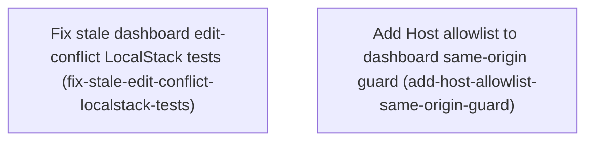

# Horizon 16 — Dashboard edit-conflict tests and Host guard

> Planning Horizon 16 of project `featuresync` (a *Planning Horizon* is one bounded slice of the long-running project). Lite path, 2 phases.

## 🎯 What are we trying to achieve?

Get the dashboard's LocalStack integration suite green again without changing product behaviour. Edits made against the same base version on *different* flags keep auto-replaying onto the latest version. Edits on the *same* flag must still be refused with 422 CONFLICT, and both cases are proven sequentially and concurrently. Separately, the dashboard should answer only requests addressed to its own loopback host and port, so a DNS-rebinding page or a localhost proxy can't read or change it.

## 🧠 Why does this change need to happen?

- Two LocalStack edit-conflict tests fail with 200 instead of 422. The cause isn't a regression. Commit `c0c62ee` ("merge improvements") deliberately added auto-replay (`replayOnLatest` in `packages/dashboard/src/application/edit-feature.ts`) and new conflict wording. The tests edit two *different* flags, so the second edit is correctly replayed as v3. The tests are stale. You chose to keep replay.
- The same-origin guard checks `Origin` only, and only on POST. The `Host` header is never checked, so after DNS rebinding (an attacker's domain re-pointed at 127.0.0.1) a malicious page can read dashboard pages through GET. This was an open horizon-10 blocker.

## At a glance

- **Phases:** 2 (independent, either can go first)
- **Complexity:** Low
- **Main risk:** the concurrent same-flag test passing by timing luck rather than proving the race is caught
- **Quality target:** `pnpm typecheck && pnpm lint && pnpm test` at 100% coverage, and `pnpm test:integration` green
- **Testing focus:** order-independent race assertions, exact Host allowlist matching, keeping POST-without-Origin fail-closed

## Order of work

1. **Fix stale dashboard edit-conflict LocalStack tests**: nothing blocks it
2. **Add Host allowlist to dashboard same-origin guard**: independent of phase 1, touches different files

### Phase 1 — Fix stale dashboard edit-conflict LocalStack tests

Technical ID: `fix-stale-edit-conflict-localstack-tests` · dashboard · cross-cutting · small blast radius

**Goal:** Make the dashboard LocalStack edit-conflict tests match the kept auto-replay behaviour, and prove that a real same-feature conflict still returns 422 CONFLICT on LocalStack, both sequentially and concurrently.

**Why:** Commit c0c62ee added auto-replay on purpose: editFeature calls replayOnLatest when canReplayEdit sees that the edited feature did not change between the base snapshot and the latest one. The existing tests edit two different features on base v1 and still expect a 422, no snapshots/3.json, and the old 'reload and redo your edit.' wording, so they are stale. The user decided to keep replay, which means only the tests change. Production code and the publisher's horizon-12 code stay as they are.

**Changes:**
- Rewrite the sequential different-feature same-base case (around :220-245). It should expect success, snapshots/3.json to be written as v3 with both edits applied, and the replay notice in the response.
- Rewrite the concurrent different-feature same-base case (around :246-270) the same way. Assert the final state: the pointer is at the highest version, both edits are present, and no request got a 5xx.
- Add a sequential case where two edits on the same base touch the SAME feature. The second edit must return 422 with the current EDIT_CONFLICT text from packages/dashboard/src/application/error-messages.ts (':64-67', '...meanwhile, so your edit was not saved.'), and the published version must not move past v2.
- Add a concurrent case where two edits on the same base touch the SAME feature. Exactly one should succeed and one should return 422 CONFLICT. Import the EDIT_CONFLICT message, or match its stable prefix, so the tests stop copying message text by hand.
- Do not edit edit-feature.ts, flag-edit.ts, or packages/aws/src/infrastructure/s3-snapshot-publisher.ts (linear rollback, skip-ahead, stamping, ENVIRONMENT_MISMATCH stay untouched). Recording the keep-replay decision in decisions.md is a step inside this phase.

**Files / areas:** `packages/dashboard/integration/dashboard.localstack.test.ts`

**How to verify:**
- **Only the tests and decisions.md change**: `git diff --name-only <base>..HEAD` lists only packages/dashboard/integration/dashboard.localstack.test.ts and docs/roadmaps/featuresync/decisions.md
- **Different-feature same-base edits replay to v3**: The sequential case expects a 2xx on the second edit and reads snapshots/3.json from LocalStack
- **A sequential same-feature edit still returns 422**: Both edits send expectedCurrentVersion=1 and change the same feature key
- **Concurrent same-feature race is deterministic**: Both requests are started together with Promise.all or allSettled, with no sleep between them
- **Conflict text comes from the source**: Running `grep -n "reload and redo" packages/dashboard/integration/dashboard.localstack.test.ts` finds nothing

**Done when:** `pnpm test:integration` passes, and packages/dashboard/integration/dashboard.localstack.test.ts contains passing replay cases plus same-feature 422 CONFLICT cases, both sequential and concurrent., and every check under *How to verify* meets its bar.

**Depends on:** nothing, can start immediately.

Reference: full rubric

| Dimension | Rule | Pass criteria | Failure examples | minScore |
|---|---|---|---|---|
| production-code-untouched | The phase may change only packages/dashboard/integration/dashboard.localstack.test.ts and decisions.md. Replay, CAS, linear rollback, skip-ahead, stamping and ENVIRONMENT_MISMATCH production code must stay unchanged. | `git diff --name-only <base>..HEAD` lists only packages/dashboard/integration/dashboard.localstack.test.ts and docs/roadmaps/featuresync/decisions.md; `git diff <base>..HEAD -- packages/dashboard/src packages/aws/src` is empty; decisions.md has an entry recording the keep-auto-replay decision and naming commit c0c62ee | A tweak to canReplayEdit in flag-edit.ts so that a test passes; A change to the EDIT_CONFLICT wording in error-messages.ts instead of changing the test; A test helper added under packages/aws/src/infrastructure; The keep-replay decision is not recorded in decisions.md | 9 |
| different-feature-replay-asserted | The sequential and concurrent different-feature same-base cases must assert the replay result: success, snapshots/3.json written as v3 with both edits, and the replay notice. | The sequential case expects a 2xx on the second edit and reads snapshots/3.json from LocalStack; The test checks that the v3 content holds both features' new values, not just that the file exists; The Current Pointer is asserted to be at 3; The response body is checked for the replay notice; The concurrent case asserts that no response is 5xx, the pointer is at the highest written version, and both edits are present in that snapshot | The test asserts only `status !== 422` and never reads 3.json; The concurrent case asserts the pointer equals 3, which holds only if the requests land in a lucky order; The test checks that 3.json exists but not that the first edit survived the replay | 8 |
| same-feature-conflict-sequential | Two sequential edits on the same base that touch the same feature must end with the second one returning 422 CONFLICT, and the published version must not move past v2. | Both edits send expectedCurrentVersion=1 and change the same feature key; The second edit returns status 422 and a CONFLICT code; The test asserts that snapshots/3.json is absent and the Current Pointer is still 2 | The second edit sends expectedCurrentVersion=2, so the test never exercises a conflict; The test checks only the status and not that the pointer stayed at v2; The test uses different features and relies on a replay failure that never happens | 8 |
| same-feature-conflict-concurrent | Concurrent same-feature same-base edits must give exactly one success and one 422 CONFLICT. The assertion must not depend on timing. | Both requests are started together with Promise.all or allSettled, with no sleep between them; The test counts outcomes by status: exactly one 2xx and exactly one 422, in either order; The final snapshot holds the winner's value, and no version beyond v2 exists; The test passes on 5 consecutive runs of `pnpm test:integration` | The test awaits the first request before sending the second, so it is really sequential; The test asserts responses[1] is the 422, which passes only by ordering luck; A setTimeout is added to force the race order | 8 |
| message-not-hand-copied | The tests must import EDIT_CONFLICT or match its stable prefix, never copy the message text by hand. The stale 'reload and redo your edit.' wording must be gone. | Running `grep -n "reload and redo" packages/dashboard/integration/dashboard.localstack.test.ts` finds nothing; The test imports from src/application/error-messages or uses a prefix constant built from it; No test literal repeats the full text '...meanwhile, so your edit was not saved.' | The new message is pasted by hand as a string literal, so the test breaks on the next wording change; The test uses a loose regex /conflict/i that would also match an unrelated error | 7 |

Healer hint: If the concurrent case flakes, assert on the multiset of statuses and on the final S3 state instead of on response order. Never touch edit-feature.ts or flag-edit.ts to make a test pass.

### Phase 2 — Add Host allowlist to dashboard same-origin guard

Technical ID: `add-host-allowlist-same-origin-guard` · dashboard · infrastructure · medium blast radius

**Goal:** Harden the same-origin guard in the dashboard HTTP server. Every request, GET included, must carry a Host of 127.0.0.1:<port> or localhost:<port>, so a DNS-rebound page cannot read dashboard HTML and a proxied request with a foreign Host is rejected even when its Origin matches.

**Why:** Today isSameOrigin (http-server.ts:230-231) checks only Origin, and only on POST (:397-403). The Host header is never validated, so after DNS rebinding the GET routes serve snapshots and environments to any Host. DNS rebinding means an attacker's domain is re-pointed at 127.0.0.1 so the victim's browser treats the dashboard as same-origin with the attacker's page. Checking Host against an allowlist closes that gap and keeps the fail-closed POST rule that already exists.

**Changes:**
- Add a pure isAllowedHost(hostHeader, port) helper. It accepts exactly '127.0.0.1:<port>' and 'localhost:<port>' (case-insensitive host part) and rejects a missing Host, any other host, and a wrong port.
- Run the Host check before routing on every method, GET included, and reject failures with 403 (use a plain-text body, not dashboard HTML).
- Keep the POST Origin check unchanged: a missing Origin is still 403, and so are foreign, null or wrong-port origins. A POST now needs both an allowed Host and the matching Origin, so a proxied request with a matching Origin but a foreign Host is rejected.
- Add unit tests beside the source in http-server.test.ts: GET with Host evil.example:<port> gets 403, GET with Host localhost:<port> gets 200, GET with Host 127.0.0.1:<wrong port> gets 403, POST with matching Origin and foreign Host gets 403, and a raw request with no Host gets 403. Keep 100% coverage.
- In docs/playbooks/local-qa.md, document that the dashboard serves only 127.0.0.1/localhost on its own port, and that putting it behind a proxy on localhost is unsupported. Also append a decisions.md entry for the Host allowlist and mark the horizon-10 Origin/Host blocker in blockers.md as resolved by that decision.

**Files / areas:** `packages/dashboard/src/infrastructure/http-server.ts`, `packages/dashboard/src/infrastructure/http-server.test.ts`, `docs/playbooks/local-qa.md`, `docs/roadmaps/featuresync/decisions.md`, `docs/roadmaps/featuresync/blockers.md`

**How to verify:**
- **The Host check stays in the HTTP adapter**: `grep -rn -i "host" packages/dashboard/src/application packages/dashboard/src/domain` shows no new matches
- **The allowlist matches exactly**: `LOCALHOST:<port>` is accepted
- **The check runs on every method before routing**: The check appears at the top of the request handler, before route dispatch
- **POST without Origin still fails closed**: A POST with a valid Host and no Origin returns 403 (there is a test for this)
- **Unit tests and full coverage**: There are tests for: a foreign-Host GET (403), a localhost GET (200), a GET on the wrong port (403), a POST with matching Origin and foreign Host (403), and a raw request with no Host (403)
- **The local-qa playbook is updated**: The playbook states the allowed Host values

**Done when:** `pnpm typecheck && pnpm lint && pnpm test` passes, and http-server.test.ts contains passing Host-allowlist tests: GET with a foreign Host gets 403, GET with Host localhost:<port> gets 200, and a POST with matching Origin and foreign Host gets 403., and every check under *How to verify* meets its bar.

**Depends on:** nothing, can start immediately.

Reference: full rubric

| Dimension | Rule | Pass criteria | Failure examples | minScore |
|---|---|---|---|---|
| host-check-in-infrastructure-only | isAllowedHost and its call site must live only in packages/dashboard/src/infrastructure/http-server.ts. No application use case or domain module may reference Host. | `grep -rn -i "host" packages/dashboard/src/application packages/dashboard/src/domain` shows no new matches; isAllowedHost is a pure function in http-server.ts with no I/O; The diff touches only http-server.ts, http-server.test.ts, docs/playbooks/local-qa.md and the featuresync decisions.md / blockers.md memory files | The Host is passed into editFeature and validated there; The allowlist check is placed in the domain layer; The use case signature gains a new request-context parameter | 9 |
| allowlist-exactness | Only 127.0.0.1:<port> and localhost:<port> are accepted. The host part is compared case-insensitively. Every other host or port is rejected. | `LOCALHOST:<port>` is accepted; `localhost` with no port, `localhost:<other>`, `127.0.0.1:<other>`, `[::1]:<port>`, `evil.example:<port>`, `localhost.evil.example:<port>`, `127.0.0.1.nip.io:<port>` and an empty string are all rejected; The comparison uses exact equality after lowercasing, not startsWith, includes or a regex without anchors | hostHeader.startsWith('localhost'), which lets localhost.evil.example through; The port is not checked, so any port is accepted; The case is compared exactly, so `Localhost:<port>` gets 403; A trailing-dot or IPv6 host is accidentally accepted by a split(':') parse | 8 |
| every-method-before-routing | The Host check must run before any route handler for GET, POST and unknown methods, and must reject with 403 and a plain-text body. | The check appears at the top of the request handler, before route dispatch; A GET / request with a foreign Host returns 403 with a text/plain content-type, and the body contains no dashboard HTML; The snapshot and environment GET routes return 403 when the Host is foreign; A raw request with no Host header returns 403 | The check is added only inside the POST branch, so GET data is still exposed after DNS rebinding; The 403 body is the rendered dashboard error page, which leaks HTML; The no-Host test uses fetch, which always sets a Host, so the case is never really tested | 8 |
| post-origin-fail-closed-preserved | The existing POST Origin guard must stay in place and must be combined with the Host check. A POST needs an allowed Host and a matching Origin. | A POST with a valid Host and no Origin returns 403 (there is a test for this); POSTs with a foreign Origin, a null Origin, or an Origin on the wrong port each return 403; A POST with a matching Origin and a foreign Host returns 403; A POST with a valid Host and a matching Origin still succeeds; The existing guard tests (:661-671, :944-1030) pass unchanged | The Origin check is replaced by the Host check, so a POST with no Origin now passes; The logic is changed to `if (origin && !isSameOrigin(origin))`, which lets a missing Origin through; An existing no-Origin test is deleted as redundant | 9 |
| tests-and-coverage | http-server.test.ts must cover every Host case from the phase and keep 100% coverage, and `pnpm typecheck && pnpm lint && pnpm test` must pass. | There are tests for: a foreign-Host GET (403), a localhost GET (200), a GET on the wrong port (403), a POST with matching Origin and foreign Host (403), and a raw request with no Host (403); The raw no-Host test uses http.request or a net socket and omits the Host header on purpose; The coverage report shows 100% for http-server.ts; The gate command exits with code 0 | Only isAllowedHost is unit-tested, and there is no end-to-end check that GET is blocked; A coverage ignore comment is added around the new branch; The tests hardcode port 3000 while the server listens on an ephemeral port | 8 |
| playbook-documented | docs/playbooks/local-qa.md must say that only 127.0.0.1 and localhost on the dashboard's own port are served and that running behind a localhost proxy is unsupported; decisions.md records the Host allowlist and blockers.md marks the horizon-10 Origin/Host blocker resolved. | The playbook states the allowed Host values; The playbook states that running behind a proxy is unsupported; decisions.md has a horizon-16 entry for the Host allowlist, and the horizon-10 'Does the single Origin/Host check hold...' line in blockers.md ends with '— resolved by decision <date>' | Only a generic note about security is added; The playbook suggests configuring a reverse proxy, which contradicts the allowlist | 7 |

Healer hint: If the no-Host test passes too easily, send it with a raw net socket or with http.request after removing the Host header, and keep the fail-closed rule that rejects a POST with no Origin exactly as it is.

## Discovery Findings

| Area | Finding | File | Implication |
|---|---|---|---|
| edit-conflict root cause | The publisher CAS works (s3-snapshot-publisher.ts:207-215 checkExpectedVersion, conditional pointer write :199-205). The 200 comes from editFeature() (packages/dashboard/src/application/edit-feature.ts:99-101) calling replayOnLatest (:118-136): when canReplayEdit (domain/flag-edit.ts:145-156) sees the edited feature unchanged between base and latest, it re-applies the edit on latest and publishes. Both LocalStack tests edit different features on base 1, so the second edit is replayed as v3. Added deliberately in commit c0c62ee 'merge improvements' (with e2e/concurrent-edits.spec.ts); unrelated to horizon-12 rollback/skip-ahead/stamping. | `packages/dashboard/src/application/edit-feature.ts` | The integration tests predate an intentional behaviour change; the fix is either update the tests to the auto-replay behaviour (and add a true same-feature conflict case) or remove/opt-in the replay. No publisher change. |
| conflict message text | Integration tests expect 'reload and redo your edit.' (integration/dashboard.localstack.test.ts:239,260); EDIT_CONFLICT now says '...meanwhile, so your edit was not saved.' (application/error-messages.ts:64-67), also changed in c0c62ee. | `packages/dashboard/src/application/error-messages.ts` | Test and message text must be reconciled to whichever behaviour is kept. |
| concurrent case / pointer CAS | Concurrent same-base publishes are caught by IfNoneMatch snapshot put (:262), resolveNextVersion VERSION_EXISTS (:236-244) or IfMatch pointer CONFLICT; publishExpecting maps both to conflict (publish-snapshot.ts:88-97). Tests assert snapshots/3.json absent (:265), which replay contradicts. | `packages/aws/src/infrastructure/s3-snapshot-publisher.ts` | Keep publisher as-is (horizon-12 code). Optionally pin CAS + skip-ahead + rollback-created version in a publisher unit test. |
| same-origin guard | isSameOrigin (packages/dashboard/src/infrastructure/http-server.ts:230-231) is strict equality on Origin === http://127.0.0.1:<port>, POST only (:397-403); server binds 127.0.0.1 only (:43,:428). Missing Origin on POST -> 403; foreign/port-mismatch/null/localhost origins -> 403. Host header is never validated: GET routes answer any Host, so a DNS-rebound page can read dashboard HTML (snapshots, environments). Proxied localhost: POST rejected unless proxy rewrites Origin exactly; GETs served. | `packages/dashboard/src/infrastructure/http-server.ts` | Add a Host allowlist (127.0.0.1:<port>, localhost:<port>) on every method incl. GET, reject others; keep POST-without-Origin fail-closed; document proxy as unsupported. |
| existing guard tests | http-server.test.ts covers missing Origin 403 (:661-671,:990-999), foreign Origin / Host-only evil POST 403 (:944-960), evil/null/localhost/wrong-port origins 403 (:977-985), own origin ok (:1003), raw POST without Origin/Host 403 (:1013-1030). No test for non-loopback Host on GET or proxied request (matching Origin, foreign Host). | `packages/dashboard/src/infrastructure/http-server.test.ts` | New tests: GET with Host evil.example:port -> rejected; Host localhost:port -> accepted; matching Origin + foreign Host -> rejected. Unit tests live beside source in src/infrastructure. |
| test/coverage commands | `pnpm test` = vitest run --coverage (100% thresholds, packages/*/src). `pnpm test:integration` builds packages then runs aws+dashboard LocalStack suites (packages/dashboard/vitest.integration.config.ts). Also pnpm typecheck, pnpm lint (--max-warnings=0), pnpm verify; dashboard Playwright e2e via test:e2e. | `package.json` | Phases verify with pnpm typecheck && pnpm lint && pnpm test, plus pnpm --filter @featuresync/dashboard test:integration after rebuild. |

## Out of Scope

- Segment operations and segment scale or memory measurement: the user chose dashboard fix and hardening over these.
- The environments and activity view in the dashboard: this was deferred when the user chose.
- Other open horizon-10 blockers (VERSION_EXISTS frequency, version-list pagination, HTML coverage scalability, in-browser flag editing): only the same-origin blocker is in this horizon.
- Authentication or user accounts for the dashboard: the local-only loopback model stays. Hardening means origin/host validation, not auth.
- Trusted reverse-proxy support (X-Forwarded-* handling): proxied access is rejected or documented as unsupported, not enabled.
- Re-architecting rollback, skip-ahead or publisher metadata stamping: these are binding horizon-12 decisions, and only a minimal fix for the CAS interaction is allowed.
- Horizon-13 to 15 blockers (segment poll ordering, retries, LocalStack concurrency for segments, dashboard segment version display): these are unrelated to the dashboard edit or origin work.
- Backfilling a JSON roadmap or ledger for horizon 12: only the decisions.md bookkeeping is needed.
- Removing or making auto-replay opt-in (replayOnLatest): overridden by the binding user decision to keep replay, so it fails the 'is it needed now' gate.
- Publisher unit test pinning CAS, skip-ahead and rollback-created version in s3-snapshot-publisher: horizon-12 code is out of scope and the LocalStack same-feature 422 cases already prove the conflict path, so it fails the 'duplicate proof' gate.
- Supporting reverse-proxied localhost (for example X-Forwarded-Host trust): documented as unsupported and nobody has asked for it, so it fails the 'real consumer' gate.
- Updating Playwright e2e/concurrent-edits.spec.ts: it already reflects the replay behaviour from c0c62ee and discovery found nothing broken there, so it fails the 'evidence of need' gate.

## Success Criteria

- (1) The root cause of the 200-instead-of-422 failure (intentional auto-replay from c0c62ee, kept by user decision) is recorded; the LocalStack tests assert replay for different-feature same-base edits and 422 CONFLICT for same-feature same-base edits, sequentially and concurrently. (2) Each of the three same-origin scenarios has an automated test showing it is rejected or safely handled: missing Origin on a state-changing request, a Host header that is not a loopback name (DNS rebinding), and a proxied localhost request. Any case that failed now fails closed. The horizon-10 blocker is marked resolved, with a decision entry. (3) Rollback still creates version current+1. Legacy buckets still skip ahead via HeadObject probing without ListObjects. The publisher still stamps version, previousVersion and createdAt and rejects ENVIRONMENT_MISMATCH, and the existing tests for all of these stay green. (4) The repo gates pass: typecheck, lint, 100% coverage, and the unit plus LocalStack integration suites.
- Fix stale dashboard edit-conflict LocalStack tests: `pnpm test:integration` passes, and packages/dashboard/integration/dashboard.localstack.test.ts contains passing replay cases plus same-feature 422 CONFLICT cases, both sequential and concurrent.
- Add Host allowlist to dashboard same-origin guard: `pnpm typecheck && pnpm lint && pnpm test` passes, and http-server.test.ts contains passing Host-allowlist tests: GET with a foreign Host gets 403, GET with Host localhost:<port> gets 200, and a POST with matching Origin and foreign Host gets 403.

## Quality Gate

Path: lite. Scoping: the user chose dashboard fix + hardening, then (after discovery) chose to keep auto-replay and fix the tests. Critic, one pass: 1 blocker (`domain-shape-fit`: the plan was labelled business, but the work is tests plus an HTTP adapter). Its quoted evidence checked out, so it was confirmed and healed by reclassifying as `technical`. 1 major (`success-coverage`: no phase recorded the Host decision or resolved the blocker, and the objective contradicted replay) was healed by extending phase 2 and rewording the objective. Both fixes were applied directly by the orchestrator, without a healer call. No verification call. Accepted debt: none failing; minor note that phase 1's layer label is loose (now `cross-cutting`). Verdict: passed after heal.

## Cost

Budget 5–7 Agent calls; used 5 (analyze, discovery, decompose, rubrics, critic). No overrun.

## Full analysis

**domainShape:** technical: The horizon rewrites integration tests to match unchanged versioning behaviour and hardens an HTTP adapter; no domain rule or model changes.

| Term | Meaning |
|---|---|
| Flag Edit | A dashboard change to flag definitions, submitted against a base version and published as a new Snapshot Version. |
| expectedCurrentVersion (CAS) | The base version a Flag Edit was made against. The publish must fail with CONFLICT if the Current Pointer has moved past it. |
| Current Pointer | The <env>/current.json object naming the live Snapshot Version. |
| Snapshot Version | An immutable numbered snapshot. The publisher stamps its version, previousVersion and createdAt. |
| Linear Rollback | Rolling back to vN republishes vN's content as version current+1, so history never moves backward. |
| Skip-ahead | When the pointer lags the highest existing snapshot, the next write goes to highest+1, found by forward HeadObject probing without listing the bucket. |
| CONFLICT | The domain error for a stale-base Flag Edit, returned by the dashboard as HTTP 422. |
| Same-origin guard | The dashboard check on Origin and Host that rejects cross-site, rebinding or non-loopback requests to state-changing endpoints. |

**Assumptions**
- The dashboard is local-only and bound to loopback. Its threat model is a malicious web page in the operator's browser (CSRF or DNS rebinding), not a network attacker.
- Once CAS is respected, a same-base conflict should surface as the existing CONFLICT error mapped to HTTP 422. No new error code or status is introduced.
- Fail-closed is the right default for a request with no Origin on a mutating method. Safe GET requests may stay permitted. CLI and SDK traffic does not call the dashboard HTTP API.
- A proxied localhost is handled by documenting that it is unsupported and rejecting non-loopback Host values. There is no trusted-proxy configuration.
- Horizon 12's decisions are recorded in decisions.md as bookkeeping during this horizon. That is not a planned phase.
- LocalStack is available locally for the integration tests, configured via AWS SDK env only.
- Auto-replay (replayOnLatest, commit c0c62ee) is intended behaviour and is kept; the stale integration tests are what change (user decision after discovery).

**Risks**
- The root cause may sit inside horizon 12's skip-ahead logic. A naive fix, such as dropping the forward HeadObject probe or letting the pointer move down, would contradict binding horizon-12 decisions. The fix must keep linear history and skip-ahead.
- S3 conditional writes (IfMatch/IfNoneMatch on the pointer) may behave differently on LocalStack than on real S3. The concurrent test could pass or fail for emulator reasons, masking the real bug.
- The concurrent same-base test may be timing-dependent and flaky. A passing run does not prove the race is closed without a deterministic test.
- Tightening the Origin/Host check could break legitimate use: browsers that omit Origin on same-origin GETs, IPv6 [::1], a custom port, or a 'localhost' versus '127.0.0.1' mismatch.
- Keeping the 100% branch coverage gate with new security branches in hand-written HTML/HTTP handlers adds test burden.
- A horizon-4 or horizon-8 decisions.md entry (pointer moves down, VERSION_EXISTS after rollback) conflicts with horizon 12. It must be recorded as superseded, not silently edited.
