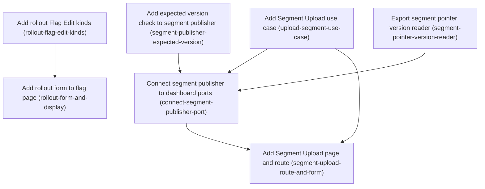

# Horizon 17 — Dashboard segment upload and rollout editing

> Planning Horizon 17 of project `featuresync`. A *Planning Horizon* is one bounded slice of the long-running project; the next one is prepared in `../next-horizon-brief.md`.

## 🎯 What are we trying to achieve?

Operators of the local dashboard can upload a CSV in the browser to create or replace a Segment's members, and can set, change or remove the percentage Rollout on any rule of a flag. Every write goes through the existing S3 publishers and is rejected cleanly if the page was out of date (an expected-version check, also called compare-and-swap).

## 🧠 Why does this change need to happen?

Segments and sticky percentage rollout exist in the SDK and the CLI since horizons 13–15, but the dashboard can't use them. Its only option is typing raw rules JSON, and segment upload is CLI-only. The segment publisher also can't reject an upload made from a stale page, and it keeps its pointer reader private, so the dashboard can't learn a segment's current version.

**At a glance**

- Phases: 7 (at the hard ceiling of 7, by user choice at the preview)
- Complexity: Medium–High
- Main risk: Showing members, or echoing a CSV error that contains an identifier, could leak PII into HTML pages or logs.
- Testing focus: expected-version conflicts (422), Host/Origin guard (403), no member identifiers in any response, 100% coverage

## Order of work

1. **Add rollout Flag Edit kinds** — after: nothing — can start immediately
2. **Add rollout form to flag page** — after: Add rollout Flag Edit kinds
3. **Add expected version check to segment publisher** — after: nothing — can start immediately
4. **Export segment pointer version reader** — after: nothing — can start immediately
5. **Add Segment Upload use case** — after: nothing — can start immediately
6. **Connect segment publisher to dashboard ports** — after: Add expected version check to segment publisher, Export segment pointer version reader, Add Segment Upload use case
7. **Add Segment Upload page and route** — after: Add Segment Upload use case, Connect segment publisher to dashboard ports

### Phase 1 — Add rollout Flag Edit kinds

Technical ID: `rollout-flag-edit-kinds` · Flag Editing (dashboard) · domain · small blast radius

**Goal** — Let a Flag Edit set, change or remove the Rollout (percentage, bucketBy, salt) on one rule of a flag, chosen by its rule index, without editing raw rules JSON.

**Why** — A Rollout belongs to a rule, not to the whole flag. The dashboard can already change rules as raw JSON, but operators need a structured edit. Adding new kinds to the existing FlagEdit union means edit-feature's expected-version check and replay-on-latest cover rollout edits with no new publish path.

**Changes**
- Add FlagEdit kinds 'setRollout' {featureKey, ruleIndex, percentage, bucketBy, salt} and 'removeRollout' {featureKey, ruleIndex}
- Handle them in applyFlagEdit on the raw stored Snapshot, and reject a rule index that is out of range or a percentage outside 0-100 (at most 2 decimals) with the existing edit error type
- Run the edited Snapshot through parseSnapshot (schemaVersion 2) exactly as setRules does
- Unit-test every branch, including replay onto a Snapshot where a different feature changed

**Files / areas**
- `packages/dashboard/src/domain/flag-edit.ts`
- `packages/dashboard/test/domain/flag-edit.test.ts`

**How to verify**
- **setRollout/removeRollout touch exactly one rule** — In test/domain/flag-edit.test.ts, a setRollout test asserts that the target rule's rollout equals {percentage, bucketBy, salt} and that the rule's conditions and value are unchanged
- **Out-of-range index and percentage rejected with existing error type** — Tests cover ruleIndex -1, ruleIndex equal to rules.length, and a non-integer index, and each returns the existing edit error type (not a thrown generic Error)
- **Stays pure domain and replays on a newer snapshot** — flag-edit.ts imports only domain modules or @featuresync/core, with no aws, http, or views imports

**Done when** — flag-edit.ts accepts setRollout and removeRollout edits, with 100% covered unit tests in test/domain/flag-edit.test.ts, and every check under *How to verify* passes its bar.

**Depends on** — nothing — can start immediately

Reference: full rubric

- **rollout-edit-semantics** (minScore 8): applyFlagEdit applies setRollout and removeRollout only to the rule at ruleIndex of the named feature and leaves all other rules and features byte-for-byte unchanged.
  - pass: In test/domain/flag-edit.test.ts, a setRollout test asserts that the target rule's rollout equals {percentage, bucketBy, salt} and that the rule's conditions and value are unchanged
  - pass: A test on a flag with two or more rules asserts that the sibling rules are deep-equal to the originals
  - pass: A removeRollout test asserts that the rollout key is gone from the target rule, not set to null or {}
  - pass: A test asserts that removeRollout on a rule without a rollout is either a no-op or a typed error, and the behaviour is documented by the test name
  - fail: setRollout replaces the whole rules array with one rule
  - fail: removeRollout leaves `rollout: undefined`, so the rule serializes differently and parseSnapshot rejects it
  - fail: Plausible: the edit mutates the input snapshot object in place, so replay tests pass but the caller's cached snapshot is corrupted
- **rollout-input-validation** (minScore 8): An out-of-range ruleIndex, and a percentage below 0, above 100 or with more than 2 decimals, are rejected with the existing FlagEdit error type, and the snapshot passes through parseSnapshot as setRules does.
  - pass: Tests cover ruleIndex -1, ruleIndex equal to rules.length, and a non-integer index, and each returns the existing edit error type (not a thrown generic Error)
  - pass: Tests cover percentage -0.01, 100.01 and 12.345 as rejected, and 0, 100 and 12.34 as accepted
  - pass: The edited snapshot goes through the same parseSnapshot call as the setRules branch (grep flag-edit.ts)
  - pass: A test checks that an unknown featureKey returns the same error as the other kinds
  - fail: Plausible: the 2-decimal check uses `percentage * 100 % 1 === 0`, which rejects valid values such as 0.29 because of floating-point error
  - fail: A bad index throws TypeError from `rules[i].rollout`
  - fail: The branch skips parseSnapshot, so an empty bucketBy is accepted
- **rollout-domain-purity-and-replay** (minScore 8): flag-edit.ts keeps no infrastructure imports, and a rollout edit replayed onto a snapshot where a different feature changed keeps that other change.
  - pass: flag-edit.ts imports only domain modules or @featuresync/core, with no aws, http, or views imports
  - pass: A replay test applies setRollout to snapshot B (a different feature was edited after A) and asserts that both changes are present
  - pass: Coverage for flag-edit.ts is 100% lines and branches
  - fail: Plausible: the edit is computed on the old snapshot and the whole feature map is written back, so the other feature's change is lost
  - fail: Imports a percentage helper from the infrastructure views

Healer hint: Most likely failure is float-unsafe 2-decimal validation or in-place mutation; validate with Math.round(p*100)===p*100 within an epsilon (or a string regex) and structuredClone the snapshot before editing.

### Phase 2 — Add rollout form to flag page

Technical ID: `rollout-form-and-display` · Flag Editing (dashboard) · interface · medium blast radius

**Goal** — Show each rule's Rollout and the Segments its conditions reference on the flag page, and let an operator set, edit or remove a rule's Rollout through a form POST.

**Why** — Operators need to see and change a Rollout in the browser. The POST uses the existing edit-feature use case, so a stale edit to the same feature returns 422 CONFLICT and an edit to a different feature replays automatically.

**Changes**
- Add a small rollout-form.ts view: for each rule, show a badge with the percentage, bucketBy and referenced Segment keys, plus a form with the fields percentage, bucketBy, salt and a remove button
- Map the form fields to setRollout or removeRollout in the existing features/:key POST handler, which already goes through the Host/Origin guard
- Put the new styles in a new styles/rollout.css file and add it to the stylesheet route
- Test rendering and the POST mapping, including a 403 test for a POST without Origin and a 422 test for a stale edit

**Files / areas**
- `packages/dashboard/src/infrastructure/views/rollout-form.ts`
- `packages/dashboard/src/infrastructure/views/feature-edit-form.ts`
- `packages/dashboard/src/infrastructure/http-server.ts`
- `packages/dashboard/src/infrastructure/views/styles/rollout.css`

**How to verify**
- **Per-rule rollout badge and segment keys** — The rollout-form test renders a flag with one rule that has a rollout and one rule without, and asserts that the badge text (for example '25% by userId') appears only for the first
- **Form maps to setRollout/removeRollout via edit-feature** — A test POSTs percentage=30&bucketBy=userId&salt=s&ruleIndex=1 and asserts that the published snapshot's rule 1 has that rollout
- **Guard 403 and stale 422** — A test with no Origin header gets 403 and the fake publisher records zero calls

**Done when** — The flag page shows each rule's Rollout and referenced Segments and saves rollout changes, covered by a rollout-form test file at 100% coverage, and every check under *How to verify* passes its bar.

**Depends on** — Add rollout Flag Edit kinds

Reference: full rubric

- **rollout-display-per-rule** (minScore 8): The flag page renders, for each rule, its rollout percentage, bucketBy and the Segment keys its conditions reference, and shows only Segment keys, never members.
  - pass: The rollout-form test renders a flag with one rule that has a rollout and one rule without, and asserts that the badge text (for example '25% by userId') appears only for the first
  - pass: The test asserts that Segment keys taken from inSegment conditions appear in the output
  - pass: All interpolated values are HTML-escaped: a test with a salt or key containing <script> finds the escaped text in the output
  - pass: The page is served with rollout.css linked, and GET of the stylesheet route returns the new rules
  - fail: Plausible: the badge is rendered once per flag instead of once per rule
  - fail: Segment keys are collected only from top-level conditions and miss nested ones
  - fail: The salt is interpolated without escaping
- **rollout-post-mapping** (minScore 8): The features/:key POST turns the rollout fields into setRollout, or into removeRollout when remove is pressed, with the correct ruleIndex, and goes only through the edit-feature use case.
  - pass: A test POSTs percentage=30&bucketBy=userId&salt=s&ruleIndex=1 and asserts that the published snapshot's rule 1 has that rollout
  - pass: A test POSTs the remove button and asserts that the rollout is gone
  - pass: A bad percentage returns a 400 page that shows the edit error, and nothing is published
  - pass: http-server.ts does not import the S3 publisher for this path; it calls editFeature
  - fail: Plausible: percentage is passed as the string '30', so parseSnapshot fails with a 500 instead of a 400
  - fail: ruleIndex is taken from button order and is off by one
  - fail: The handler publishes directly and skips the CAS
- **rollout-security-and-conflict** (minScore 9): A rollout POST without a valid Origin/Host is rejected with 403 before any use-case call, and a stale expected version for the same feature returns 422.
  - pass: A test with no Origin header gets 403 and the fake publisher records zero calls
  - pass: A test with a stale expected version for the same feature gets 422 and a conflict page
  - pass: A test where a different feature changed succeeds (replay)
  - fail: Plausible: rollout is added as a new route that is not in the guarded route table
  - fail: A conflict is mapped to 500

Healer hint: Likely a string percentage or an unguarded new route; coerce with Number() and validate, and keep the rollout submit on the existing guarded features/:key POST.

### Phase 3 — Add expected version check to segment publisher

Technical ID: `segment-publisher-expected-version` · Segment Publishing (@featuresync/aws) · infrastructure · small blast radius

**Goal** — Let a caller pass an optional expectedCurrentVersion to createS3SegmentPublisher().publish, so that a stale Segment Upload fails with CONFLICT before any object is written.

**Why** — Today the segment publisher reads the Current Pointer itself and only protects against a race while it is running. A dashboard operator who uploads from an old page must get an error and nothing must be written. This adds an optional input and does not change the S3 layout.

**Changes**
- Add an optional expectedCurrentVersion (number or null for 'no Segment yet') to the publish input
- After reading the pointer and before the version PUT, compare it with the pointer's version and throw S3SegmentPublishError CONFLICT when they differ
- Leave the behaviour unchanged when the field is not passed, so the CLI keeps working
- Test the match, mismatch and 'no pointer' cases and assert that no PutObject is sent on mismatch

**Files / areas**
- `packages/aws/src/infrastructure/s3-segment-publisher.ts`
- `packages/aws/test/infrastructure/s3-segment-publisher.test.ts`

**How to verify**
- **Mismatch throws CONFLICT before any PutObject** — In s3-segment-publisher.test.ts, the mismatch test asserts that the error is an instance of S3SegmentPublishError with code 'CONFLICT'
- **null means no Segment; match proceeds** — Tests: null with no pointer publishes; null with an existing pointer gives CONFLICT; a number with no pointer gives CONFLICT; an equal number publishes version+1
- **Omitted field keeps old behaviour** — The existing publisher tests pass without being edited

**Done when** — s3-segment-publisher.ts rejects a stale expectedCurrentVersion with CONFLICT and no writes, proven by its unit tests, and every check under *How to verify* passes its bar.

**Depends on** — nothing — can start immediately

**Rollback** — The field is optional, so reverting the commit restores the previous publisher behaviour; no stored S3 data changes.

Reference: full rubric

- **cas-before-write** (minScore 9): When expectedCurrentVersion differs from the pointer's version, publish throws S3SegmentPublishError with code CONFLICT and sends no PutObject.
  - pass: In s3-segment-publisher.test.ts, the mismatch test asserts that the error is an instance of S3SegmentPublishError with code 'CONFLICT'
  - pass: The same test asserts that the mocked client received zero PutObjectCommand calls (only a GetObject)
  - pass: The comparison in the source sits between the pointer read and the first PutObject
  - fail: Plausible: the check runs after the version object PUT and before the pointer PUT, so an orphan version object is left in S3
  - fail: Throws a generic Error('conflict')
- **null-and-match-semantics** (minScore 8): expectedCurrentVersion null matches only a missing pointer, a number matches only an equal pointer version, and a match publishes normally.
  - pass: Tests: null with no pointer publishes; null with an existing pointer gives CONFLICT; a number with no pointer gives CONFLICT; an equal number publishes version+1
  - pass: Absent (undefined) and null are handled differently in the code (for example `!== undefined`, not a falsy check)
  - fail: Plausible: `if (input.expectedCurrentVersion && ...)` treats both 0 and null as not passed, so the check is skipped
- **backward-compat** (minScore 8): Callers that omit the field (the CLI) behave exactly as before, and the S3 key layout is unchanged.
  - pass: The existing publisher tests pass without being edited
  - pass: A test without the field publishes even when the pointer exists
  - pass: The CLI package typechecks unchanged
  - fail: The field is made required, so the CLI build breaks

Healer hint: Most likely a falsy check that conflates null, 0 and undefined; compare with `!== undefined` and `(pointer?.version ?? null) !== expected`.

### Phase 4 — Export segment pointer version reader

Technical ID: `segment-pointer-version-reader` · Segment Publishing (@featuresync/aws) · infrastructure · small blast radius

**Goal** — Export a createS3SegmentVersionReader from @featuresync/aws whose readVersion(env, key) returns the current Segment pointer version, or null when no Segment exists yet.

**Why** — The upload page must carry the current Segment Version as expectedCurrentVersion, but the segment publisher's readPointer is private and index.ts exports neither parseSegmentPointer nor segmentPointerKeyFor. A version-only reader reads just the small Current Pointer object, so no member counts or version objects are fetched and the S3 layout does not change.

**Changes**
- Add s3-segment-version-reader.ts that GETs the key from segmentPointerKeyFor(env, key), parses it with parseSegmentPointer and returns pointer.version
- Return null on NoSuchKey; throw S3SegmentPublishError REQUEST_FAILED (or the existing snapshot error type) on other failures and on an unparsable pointer
- Export createS3SegmentVersionReader and its options type from packages/aws/src/index.ts
- Unit-test present pointer, missing pointer, malformed pointer and S3 failure with a mocked client

**Files / areas**
- `packages/aws/src/infrastructure/s3-segment-version-reader.ts`
- `packages/aws/src/index.ts`
- `packages/aws/test/infrastructure/s3-segment-version-reader.test.ts`

**How to verify**
- **Reads only the Current Pointer** — A test asserts the mocked client received one GetObjectCommand whose Key equals segmentPointerKeyFor(env, key)
- **Missing pointer returns null** — Tests cover NoSuchKey -> null, AccessDenied -> throws with a code field, malformed JSON -> throws
- **Reuses domain pointer parsing** — The reader imports both from ../domain/segment-pointer.js
- **Exported from the package entry** — index.ts has the new export line

**Done when** — An exported createS3SegmentVersionReader returning the pointer version or null, proven by its unit tests, and every check under *How to verify* passes its bar.

**Depends on** — nothing — can start immediately

**Rollback** — Purely additive export; reverting the commit removes it and no stored S3 data changes.

Reference: full rubric

- **version-only-read** (minScore 8): readVersion sends exactly one GetObject for the pointer key and never reads a version object or members.
  - pass: A test asserts the mocked client received one GetObjectCommand whose Key equals segmentPointerKeyFor(env, key)
  - pass: The return type is number | null, with no member count or createdAt
  - fail: Plausible: it follows the pointer and fetches the version object to also return a member count
- **missing-is-null** (minScore 9): A NoSuchKey response returns null; any other S3 error or a malformed pointer throws a coded error.
  - pass: Tests cover NoSuchKey -> null, AccessDenied -> throws with a code field, malformed JSON -> throws
  - pass: null is returned, not 0 or undefined
  - fail: Plausible: every error is caught and returns null, so an S3 outage makes the page claim a new Segment and the first upload conflicts
- **shared-pointer-parsing** (minScore 8): The reader uses parseSegmentPointer and segmentPointerKeyFor from the domain module rather than duplicating key building or parsing.
  - pass: The reader imports both from ../domain/segment-pointer.js
  - pass: No string template builds the pointer key inside the reader
  - fail: Plausible: the key is rebuilt as `${env}/segments/${key}/current.json`, drifting from the publisher's layout
- **public-export** (minScore 8): createS3SegmentVersionReader is exported from packages/aws/src/index.ts and the existing exports are unchanged.
  - pass: index.ts has the new export line
  - pass: Existing aws tests pass unedited and the dashboard can import it from '@featuresync/aws'
  - fail: Plausible: the dashboard imports it by a deep path into packages/aws/src/infrastructure because index.ts was not updated

Healer hint: Most likely a catch-all that turns every error into null, or a hand-built pointer key; narrow null to NoSuchKey and reuse segmentPointerKeyFor/parseSegmentPointer.

### Phase 5 — Add Segment Upload use case

Technical ID: `upload-segment-use-case` · Segment Management (dashboard) · application · small blast radius

**Goal** — Add an upload-segment use case that parses CSV text with parseSegmentCsv and publishes it through a new publishSegment port with the expected Segment Version, returning a typed result for each failure reason; declare a readSegmentVersion port the page uses to fill the expected version.

**Why** — The dashboard needs one place that turns a CSV and an expected version into a new Segment Version, following the CLI's existing steps. A bad CSV must return an error without calling the publisher, so nothing is written. Error messages report the reason and row number only, never a member identifier, because Segments hold personal data.

**Changes**
- Add a publishSegment port to DashboardPorts: (env, {key, memberAttribute, members, expectedCurrentVersion}) => Promise<SegmentPointer>
- Add a readSegmentVersion port to DashboardPorts: (env, key) => Promise<number | null> (version only, no member count)
- Implement uploadSegment: parseSegmentCsv, then publishSegment; return a Result with reasons EMPTY_FILE, MALFORMED_ROW, HEADER, TOO_MANY_MEMBERS, INVALID_SEGMENT, CONFLICT, VERSION_EXISTS or REQUEST_FAILED
- Use the same error wording as the CLI in packages/cli/src/main.ts, without echoing member values
- Unit-test with a fake port, including that the port is never called for an invalid CSV

**Files / areas**
- `packages/dashboard/src/application/upload-segment.ts`
- `packages/dashboard/src/application/ports.ts`
- `packages/dashboard/test/application/upload-segment.test.ts`

**How to verify**
- **Invalid CSV never calls the port** — upload-segment.test.ts has one case each for EMPTY_FILE, HEADER, MALFORMED_ROW, TOO_MANY_MEMBERS and INVALID_SEGMENT, each asserting that the fake port call count is 0
- **Publisher errors mapped to reasons** — A test asserts that the fake port received expectedCurrentVersion (including null) exactly as given
- **No member identifiers in results** — A test with a malformed row containing 'alice@example.com' asserts that the serialized result does not contain that string but does contain the row number
- **Port-only dependency** — Its imports are limited to ./ports and domain/parse modules (segment-csv, the pointer type); there is no @aws-sdk and no infrastructure path

**Done when** — upload-segment.ts with publishSegment and readSegmentVersion ports and 100% covered unit tests, and every check under *How to verify* passes its bar.

**Depends on** — nothing — can start immediately

Reference: full rubric

- **no-publish-on-invalid** (minScore 9): Every CSV parse failure returns a typed failure and the publishSegment port is never called.
  - pass: upload-segment.test.ts has one case each for EMPTY_FILE, HEADER, MALFORMED_ROW, TOO_MANY_MEMBERS and INVALID_SEGMENT, each asserting that the fake port call count is 0
  - pass: Each case asserts the specific reason value, not only ok:false
  - fail: Plausible: INVALID_SEGMENT (for example a bad key) is detected only by the publisher, so the port is called first
- **typed-publish-failures** (minScore 8): CONFLICT, VERSION_EXISTS and other publisher failures map to the CONFLICT, VERSION_EXISTS and REQUEST_FAILED results, and expectedCurrentVersion is passed through unchanged.
  - pass: A test asserts that the fake port received expectedCurrentVersion (including null) exactly as given
  - pass: Tests where the port throws each error code check the mapped reason; an unknown error maps to REQUEST_FAILED
  - pass: A success returns the SegmentPointer
  - fail: Plausible: every thrown error is mapped to REQUEST_FAILED, so the route cannot return 422
- **pii-free-messages** (minScore 9): Failure messages contain the reason and row number only, never a member value.
  - pass: A test with a malformed row containing 'alice@example.com' asserts that the serialized result does not contain that string but does contain the row number
  - pass: Wording matches the CLI messages in packages/cli/src/main.ts
  - fail: Plausible: the parser's error message, which quotes the row, is passed through as is
- **application-layer-boundary** (minScore 8): upload-segment.ts depends on the ports and domain parsing only, never on the S3 client or the infrastructure.
  - pass: Its imports are limited to ./ports and domain/parse modules (segment-csv, the pointer type); there is no @aws-sdk and no infrastructure path
  - pass: publishSegment and readSegmentVersion are declared in ports.ts; readSegmentVersion returns Promise<number | null>
  - fail: It imports createS3SegmentPublisher or the error class from the infrastructure to use instanceof
  - fail: Plausible: readSegmentVersion is typed to return the whole SegmentPointer, pulling the aws domain type into the page contract

Healer hint: The likely failure is leaking the parser message (with member values) or using instanceof on an infrastructure error class; build messages from reason and row only, and match on an error `code` field.

### Phase 6 — Connect segment publisher to dashboard ports

Technical ID: `connect-segment-publisher-port` · Segment Management (dashboard) · infrastructure · small blast radius

**Goal** — Wire createS3SegmentPublisher and createS3SegmentVersionReader into the dashboard's AWS adapters so the publishSegment port writes real Segment Versions and the readSegmentVersion port reads the current pointer version.

**Why** — The dashboard's composition file only creates snapshot adapters today. The Segment Upload use case needs a real S3 implementation of its port before a route can use it.

**Changes**
- Create the segment publisher with the same bucket and client as the snapshot publisher
- Map the publishSegment port to publisher.publish, passing expectedCurrentVersion through
- Map the readSegmentVersion port to createS3SegmentVersionReader(...).readVersion with the same client and bucket
- Extend aws-adapters.test.ts to cover both new ports

**Files / areas**
- `packages/dashboard/src/infrastructure/aws-adapters.ts`
- `packages/dashboard/src/infrastructure/aws-adapters.test.ts`

**How to verify**
- **Same bucket and client** — In aws-adapters.ts, createS3SegmentPublisher receives the same client and bucket variables that createS3SnapshotPublisher gets
- **Port forwards all fields including expected version** — An aws-adapters.test.ts case with a mocked client and an existing pointer, and a stale expectedCurrentVersion, rejects with a CONFLICT-coded error and records no PutObject
- **readSegmentVersion uses the exported reader** — An aws-adapters.test.ts case with a mocked pointer returns its version; a NoSuchKey case returns null
- **Wiring stays in the composition file** — aws-adapters.ts does not import parseSegmentCsv or parse pointer JSON itself

**Done when** — aws-adapters.ts provides working publishSegment and readSegmentVersion ports, covered by aws-adapters.test.ts, and every check under *How to verify* passes its bar.

**Depends on** — Add expected version check to segment publisher, Export segment pointer version reader, Add Segment Upload use case

Reference: full rubric

- **shared-bucket-client** (minScore 8): The segment publisher is built with the same S3 client and bucket as the snapshot publisher, and no second client is created.
  - pass: In aws-adapters.ts, createS3SegmentPublisher receives the same client and bucket variables that createS3SnapshotPublisher gets
  - pass: A test asserts the bucket in the captured PutObject Input
  - fail: Plausible: a new S3Client() is created without the configured endpoint or region, so a LocalStack setup writes to real AWS
- **port-pass-through** (minScore 9): publishSegment passes env, key, memberAttribute, members and expectedCurrentVersion to publish and returns its pointer.
  - pass: An aws-adapters.test.ts case with a mocked client and an existing pointer, and a stale expectedCurrentVersion, rejects with a CONFLICT-coded error and records no PutObject
  - pass: A matching case resolves to a pointer with version+1
  - fail: Plausible: expectedCurrentVersion is dropped in the mapping, so stale uploads succeed
- **version-port-wiring** (minScore 8): readSegmentVersion is implemented via createS3SegmentVersionReader imported from '@featuresync/aws' and returns null for a missing pointer.
  - pass: An aws-adapters.test.ts case with a mocked pointer returns its version; a NoSuchKey case returns null
  - pass: The import is from '@featuresync/aws', not a deep path
  - fail: Plausible: the adapter reads the pointer itself with a hand-built key and GetObject instead of using the exported reader
- **composition-only** (minScore 7): The only change is wiring; no upload logic or CSV parsing is added to aws-adapters.ts.
  - pass: aws-adapters.ts does not import parseSegmentCsv or parse pointer JSON itself
  - pass: The diff touches only aws-adapters.ts and its test
  - fail: It re-validates members or maps errors to HTTP codes inside the adapter

Healer hint: Most likely expectedCurrentVersion is dropped or a fresh S3 client is created; spread the port input straight into publish and reuse the existing client.

### Phase 7 — Add Segment Upload page and route

Technical ID: `segment-upload-route-and-form` · Segment Management (dashboard) · interface · medium blast radius

**Goal** — Add GET and POST /env/:env/segments/:key, with a page that shows the Segment key and a CSV upload form carrying a hidden expected version, and map each upload error to a clear 4xx page.

**Why** — This is the browser entry point for Segment Upload. The transport is the simplest choice: a few lines in app.js read the chosen file with FileReader into a urlencoded 'csv' field, and only this route raises its body cap to 32 MiB (100k members x 256 characters, URL-encoded). The 1 MiB default stays for every other route, and no multipart parser is added.

**Changes**
- Put the segment routes in a new segment-routes.ts module and register them in the existing route table, so the Host/Origin guard applies
- GET calls the readSegmentVersion port and renders its value (empty for null) in the hidden expectedCurrentVersion field
- Give readForm a per-route byte limit and use 32 MiB for the upload POST only, still returning 413 above the limit
- Map invalid-CSV reasons to 400, CONFLICT to 422 and REQUEST_FAILED to 502; never render member identifiers
- Add the FileReader handler to views/scripts/app.js and the styles to a new styles/segments.css
- Test 403 (guard), 413, 400, 422 and success

**Files / areas**
- `packages/dashboard/src/infrastructure/segment-routes.ts`
- `packages/dashboard/src/infrastructure/http-server.ts`
- `packages/dashboard/src/infrastructure/views/segment-page.ts`
- `packages/dashboard/src/infrastructure/views/styles/segments.css`

**How to verify**
- **Host/Origin guard on upload POST** — A segment-routes test POSTs without Origin, gets 403, and the fake publishSegment records 0 calls
- **32 MiB only on the upload route** — A test sends more than 32 MiB to the upload route and gets 413 with 0 port calls
- **Error codes mapped and no members rendered** — Tests assert 400 for MALFORMED_ROW, 422 for CONFLICT and 502 for REQUEST_FAILED
- **Page carries expected version; FileReader posts csv** — The GET test, with a fake readSegmentVersion returning 7, finds <input type=hidden name=expectedCurrentVersion value=7>; with null it finds an empty value

**Done when** — A working /env/:env/segments/:key upload page and POST route, covered at 100% by a segment-routes test file, and every check under *How to verify* passes its bar.

**Depends on** — Add Segment Upload use case, Connect segment publisher to dashboard ports

Reference: full rubric

- **guarded-route** (minScore 9): POST /env/:env/segments/:key is registered in the guarded route table, and a request with a bad or missing Origin gets 403 with no use-case call.
  - pass: A segment-routes test POSTs without Origin, gets 403, and the fake publishSegment records 0 calls
  - pass: The routes are registered through the existing route table in http-server.ts
  - fail: Plausible: the route is matched before the guard runs, because the body-limit special case short-circuits routing
- **per-route-body-cap** (minScore 8): readForm takes a per-route limit, the upload POST allows 32 MiB and returns 413 above it, and every other route keeps 1 MiB.
  - pass: A test sends more than 32 MiB to the upload route and gets 413 with 0 port calls
  - pass: A test sends about 2 MiB to features/:key and gets 413
  - pass: A body just under 32 MiB is accepted
  - fail: Plausible: the global default is raised to 32 MiB
- **status-mapping-no-pii** (minScore 9): Invalid-CSV reasons return 400, CONFLICT returns 422, REQUEST_FAILED returns 502, success shows the new version, and no response contains a member identifier.
  - pass: Tests assert 400 for MALFORMED_ROW, 422 for CONFLICT and 502 for REQUEST_FAILED
  - pass: A test uploads a CSV with 'bob@x.io' on a bad row and asserts that no response body (error or success) contains that string
  - pass: A rejected upload has zero PutObject calls or port calls
  - fail: Plausible: the success page echoes the first few members as a preview
  - fail: VERSION_EXISTS falls through to 500
- **page-and-transport** (minScore 8): GET renders the Segment key and a hidden expectedCurrentVersion taken from the readSegmentVersion port (empty for null), and app.js sends the file as a urlencoded csv field.
  - pass: The GET test, with a fake readSegmentVersion returning 7, finds <input type=hidden name=expectedCurrentVersion value=7>; with null it finds an empty value
  - pass: The POST parses an empty value as null, not 0
  - pass: app.js has a FileReader handler that fills the csv field; segments.css is served by the stylesheet route
  - pass: The segment key is HTML-escaped
  - fail: Plausible: an empty hidden field is parsed with Number('') to 0, so the first upload always conflicts

Healer hint: The most likely miss is the empty-string expected version turning into 0 or a global body-limit raise; parse '' as null explicitly and pass the limit as a readForm argument only from the upload handler.

## Discovery Findings

| Area | Finding | File | Implication |
|---|---|---|---|
| dashboard routing | http-server.ts (456 lines) hand-routes split paths: /env/:env/{current-version,changes,merge,merge/apply,publish,rollback,features,features/:key,versions/:v} plus stylesheet and client-script routes; paths are capped at 4 segments; each route declares GET or POST; method mismatch returns 405 with Allow. | `packages/dashboard/src/infrastructure/http-server.ts` | New /env/:env/segments and /env/:env/segments/:key (+ upload POST) fit the 3-4 segment scheme; a 5-segment path would need the length guard widened. The file is large, so segment routes may deserve a separate route module. |
| dashboard security guard | Every POST is checked with isSameOrigin (Origin required and matching); every request passes isAllowedHost(host, port), 403 otherwise. Both run centrally before handlers. | `packages/dashboard/src/infrastructure/http-server.ts` | New POST routes get the guard for free via the same route table; tests should still assert 403 for them. |
| POST body handling | readForm reads the body with MAX_BODY_BYTES = 1 MiB (413 above) and parses only as URLSearchParams (form-urlencoded). No multipart parsing exists. | `packages/dashboard/src/infrastructure/http-server.ts` | Browser CSV upload needs a decision: minimal multipart parser, client-side FileReader into a urlencoded field, or raw text/csv body. 100k members x 256 chars does not fit 1 MiB, so the upload route needs its own larger limit. |
| dashboard ports / composition root | aws-adapters.ts injects only createS3CurrentPointerReader, createS3SnapshotFetcher and createS3SnapshotPublisher into DashboardPorts {readCurrentVersion, fetchSnapshotText, openWriter}. Nothing segment-related is injected. | `packages/dashboard/src/infrastructure/aws-adapters.ts` | DashboardPorts must gain segment ports (read segment pointer/metadata, publish segment); aws-adapters.test.ts and http-server test fakes must be extended. |
| aws segment publisher API | createS3SegmentPublisher({bucket, client?}).publish(env, {key, memberAttribute, members}) returns Promise<SegmentPointer>. It reads the current pointer+ETag internally, writes the version with IfNoneMatch:* (VERSION_EXISTS) and the pointer with IfMatch etag or IfNoneMatch:* (CONFLICT). There is NO caller-supplied expectedVersion. Reasons: INVALID_ENVIRONMENT, INVALID_SEGMENT_KEY, INVALID_SEGMENT, INVALID_POINTER, VERSION_EXISTS, CONFLICT, REQUEST_FAILED. | `packages/aws/src/infrastructure/s3-segment-publisher.ts` | 'Stale expected version returns 4xx and writes nothing' is unsupported today; plan an aws phase adding optional expectedCurrentVersion to segment publish that fails with CONFLICT before any PUT. Map each reason to an HTTP status/message. |
| segment pointer read / metadata | SegmentPointer is {schemaVersion, environment, segmentKey, version, objectKey} with no memberCount or createdAt. The publisher's readPointer is private; index.ts exports only the SegmentPointer type, not parseSegmentPointer or segmentPointerKeyFor. | `packages/aws/src/domain/segment-pointer.ts` | Showing count/createdAt without ListObjects needs a public segment pointer reader plus a fetch of the version object (count members; LastModified or createdAt), or a contract change. Plan an aws phase; fetching 100k-member objects to count is costly. |
| CSV parser | parseSegmentCsv(text, {key, version, memberAttribute}) returns Result<Segment, SegmentCsvError> with reasons EMPTY_FILE, MALFORMED_ROW, HEADER, TOO_MANY_MEMBERS, INVALID_SEGMENT; pure and exported from @featuresync/aws. | `packages/aws/src/domain/segment-csv.ts` | Reuse directly in the dashboard upload use case and map reasons to 400/422; no new parser. |
| CLI segment upload (reuse template) | CLI segment upload: readFile -> parseSegmentCsv (placeholder version, memberAttribute default DEFAULT_MEMBER_ATTRIBUTE) -> createSegmentPublisher({bucket}).publish(env, {key, memberAttribute, members}), prints the pointer, maps S3SegmentPublishError reasons to messages. | `packages/cli/src/main.ts` | Dashboard upload use case can follow this sequence; keep error wording consistent with the CLI. |
| core rollout/segment schema | rule.ts: booleanRule/configRule = {when: Condition, rollout?: {percentage 0-100 max 2 decimals, bucketBy, salt}, enabled|value}; a condition can use the inSegment operator. snapshot.ts exports parseSnapshot and referencedSegmentKeys. segment-contract.ts exports MAX_SEGMENT_MEMBERS=100_000, MAX_SEGMENT_MEMBER_LENGTH=256, SEGMENT_KEY_PATTERN, parseSegment. | `packages/core/src/domain/rule.ts` | Rollout is per rule, not per flag: the 'set a flag's Rollout' UX must target a rule (e.g. a catch-all when:{} rule). referencedSegmentKeys can drive the segment list with no new core code. |
| existing flag edits | FlagEdit union kinds: enabled, default, create, delete, setRules (rulesJson). feature-edit-form.ts already renders a collapsible 'Edit rules' raw-JSON textarea validated via parseSnapshot, so rollout and inSegment can already be edited as raw JSON. | `packages/dashboard/src/domain/flag-edit.ts` | Add structured edit kinds (set/remove rollout on a rule index, segment condition) on top of applyFlagEdit, reusing the same replay/CAS path, not a new publisher path. |
| edit-feature CAS/replay | edit-feature publishes with expected base version; on conflict replayOnLatest re-reads latest, re-applies the FlagEdit via applyFlagEdit and publishes expecting latest.version; a same-feature change fails with CONFLICT (422). | `packages/dashboard/src/application/edit-feature.ts` | New rollout/segment-condition edit kinds get stale-edit handling for free once added to FlagEdit and applyFlagEdit; no new use case needed. |
| segments/rollout display | Dashboard source has no segment or rollout display; e2e and integration tests have no segment/rollout coverage. | `packages/dashboard/src/infrastructure/views/environment-page.ts` | Segments page, rollout badges and referenced-segment lists are greenfield view modules. |
| HTML/CSS organisation & coverage blocker | Views are small TS template modules (environment-page 175 lines, feature-edit-form 67, merge-dialog 91, layout 50, new-flag-form 41). CSS lives in views/styles/*.css (~830 lines total) served as one stylesheet route; client JS in views/scripts/app.js (298 lines). Root vitest.config.ts enforces 100% coverage on packages/*/src/**/*.ts; .css/.js are not included. | `vitest.config.ts` | The 100%-branch blocker is manageable if each new view is a small module with its own test; logic in app.js (e.g. FileReader upload) is not unit-covered and needs Playwright e2e. |
| test layout | Unit tests in dashboard/test/{domain,application} and colocated in src/infrastructure (http-server.test.ts 1186 lines, feature-edit-form.test.ts, dialogs.test.ts). LocalStack integration in dashboard/integration/dashboard.localstack.test.ts (vitest.integration.config.ts, coverage off). Playwright e2e in dashboard/e2e (flag-list.spec.ts, concurrent-edits.spec.ts, support/fixtures.ts). | `packages/dashboard/integration/dashboard.localstack.test.ts` | Phases can name concrete test files: unit tests in test/, a LocalStack case for segment upload + pointer CAS, a Playwright spec for browser upload and rollout edit. |

## Out of Scope

- Measuring segment memory and latency at scale (100k members) — the user deliberately chose this horizon over that work.
- A dashboard view of environments or history beyond the existing 1..current browsing — the user deliberately chose this horizon over it.
- Open-source release readiness (docs, packaging, publishing) — the user deliberately chose this horizon over it.
- Listing every Segment in the bucket or deleting Segments — this needs ListObjects or delete IAM, which decisions forbid.
- Showing which Segment Version each running SDK actually uses — this needs SDK telemetry that does not exist. The dashboard shows the pointer version only.
- Viewing, searching or editing individual members in the browser — Segments hold PII. Only a whole-CSV replace is in scope.
- Rolling back a Segment to an earlier version — not requested. Uploading the old CSV again gives the same result.
- Changes to core evaluation, the hash algorithm or the snapshot/segment S3 contract — these are settled in horizons 13-15.
- Sending a Change Notification on segment upload — the notification contract is snapshot-only by decision.
- Multi-user auth, CSRF tokens or remote hosting of the dashboard — it stays a local 127.0.0.1 tool with the Host/Origin guard.
- Fixing the concurrent-replay 200+422 race from horizon 16 — that is separate conflict-handling work, unless a rollout test exposes it.
- Segment list page and Segment metadata beyond the version (member count, createdAt, referencing flags via referencedSegmentKeys): deferred — the pointer holds no count/createdAt; needs fetching large version objects or an S3 contract change, which needs its own decision. (The version-only pointer reader is in this horizon.)
- Structured segment-condition (inSegment) Flag Edit kinds: deferred — the raw 'Edit rules' JSON textarea already supports them.
- LocalStack integration test and Playwright e2e (upload a segment, edit a rollout, SDK S3 source picks up both): deferred until the Segment list page exists.
- Multipart form parsing: rejected — FileReader-to-urlencoded with a per-route cap is simpler.
- Per-SDK Segment Version telemetry, listing or deleting Segments, member viewing: out of scope — decisions forbid ListObjects/delete and Segments hold personal data.

## Success Criteria

- 1) An operator can open /env/:env/segments/:key, pick a CSV in the browser and publish it as a new Segment Version via the horizon-14 CSV parser and the S3 segment publisher; a bad CSV returns 400 and a stale expected Segment Version returns 422, and in both cases nothing is written to S3. 2) An operator can set, edit or remove the Rollout (percentage 0-100, bucketBy, salt) on a flag rule from the flag page; it publishes through the existing edit-feature path with expectedCurrentVersion, parseSnapshot validates it, a same-feature stale edit returns 422 CONFLICT and a different-feature edit auto-replays. 3) The flag page shows each rule's Rollout and referenced Segment keys. 4) Every new POST route passes the existing Host/Origin guard, and no page or error message renders a Segment member identifier. 5) pnpm verify stays green with 100% coverage. (Segment list page with member count/createdAt, structured segment-condition editing and the LocalStack/Playwright end-to-end proof are deferred to the next horizon.)
- Add rollout Flag Edit kinds: flag-edit.ts accepts setRollout and removeRollout edits, with 100% covered unit tests in test/domain/flag-edit.test.ts
- Add rollout form to flag page: The flag page shows each rule's Rollout and referenced Segments and saves rollout changes, covered by a rollout-form test file at 100% coverage
- Add expected version check to segment publisher: s3-segment-publisher.ts rejects a stale expectedCurrentVersion with CONFLICT and no writes, proven by its unit tests
- Export segment pointer version reader: An exported createS3SegmentVersionReader returning the pointer version or null, proven by its unit tests
- Add Segment Upload use case: upload-segment.ts with publishSegment and readSegmentVersion ports and 100% covered unit tests
- Connect segment publisher to dashboard ports: aws-adapters.ts provides working publishSegment and readSegmentVersion ports, covered by aws-adapters.test.ts
- Add Segment Upload page and route: A working /env/:env/segments/:key upload page and POST route, covered at 100% by a segment-routes test file

## Alignment Preview

Concerns raised: the kept 3-phase cut didn't deliver segment management; the segment list and end-to-end proof weren't planned; rollout is per rule; there's no segment picker; the publisher check had no user in the cut. The user redirected once, choosing "everything in one horizon", so all six Stage 3 phases were kept (over the soft target of 5). The success definition was narrowed to match what was deferred.

## Quality Gate

Path: full. One critic pass: 1 blocker (no phase supplied the Segment's current version for the upload page's stale check), confirmed on its quoted evidence, with no verification call. 2 majors (a missing dependency, success criterion 1 unreachable). All three were healed by adding the phase "Export segment pointer version reader" and narrowing the deferred list item. Accepted minor debt: app.js is missing from the upload phase's files list; the rollout-form test path isn't named; the app.js FileReader check isn't unit-coverable (e2e is deferred). Verdict: passed after healing.

## Cost

8 Agent calls (Stage 1, Discovery, Stage 3, preview concerns, Stage 3.5, Stage 4, critic, healer) against a budget of 8–10. No overrun.

## Full analysis

domainShape: **business** — The objective is about operators managing domain concepts through their rules: Segments and their versions, flag targeting and Rollout, and publishes guarded by optimistic concurrency. It is not a UI-styling task.

| Term | Meaning |
|---|---|
| Segment | A named, environment-scoped set of member identifiers that flags reference by key only. |
| Segment Version | An immutable uploaded membership of a Segment, made current by that Segment's own current.json pointer. |
| Segment Upload | Replacing a Segment's members with a parsed CSV, published as a new Segment Version under expected-version CAS. |
| Rollout | A flag's sticky percentage exposure, computed as murmur3 hash bucketing of flagKey:salt:bucketBy value mod 10000. |
| Flag Edit | A dashboard change to one flag, applied to the raw stored Snapshot and published as a new version with expectedCurrentVersion. |
| Snapshot | The immutable versioned set of flag definitions for an environment, which references Segments by key. |
| Current Pointer | The current.json object that names the live Snapshot version or Segment Version, and is read without ListObjects. |
| Conflict | A write that is rejected because its base version is stale for the same feature or Segment (HTTP 422). |

**Assumptions**
- The segment and rollout domain model, the murmur3 bucketing, the CSV parser, the S3 segment publisher and the segment pointer already exist from horizons 13-15. This horizon adds dashboard use cases, routes and forms, not new core semantics.
- The dashboard finds Segments from the keys referenced by the current Snapshot, plus any key the operator types in to create a new Segment, because ListObjects is forbidden (decision, horizon 10). A Segment that no flag references can therefore only be reached by typing its key.
- The dashboard shows the Segment Version on the pointer, which is what SDKs converge to. The open blocker ('which segment version an SDK uses') is answered as 'current pointer version, no per-SDK telemetry'. That answer is recorded as a decision, not assumed silently.
- Segments hold PII (decision, horizon 15). The UI shows counts and metadata only. Uploads are accepted as CSV text or a multipart file on the 127.0.0.1 server, capped at the documented maximum member count.
- The existing server-rendered node:http UI with hand-written HTML stays in place (decision, horizon 10). No framework is added.
- A segment upload sends no Change Notification. SDKs pick it up by polling (decision, horizon 13).

**Risks**
- The binding no-ListObjects rule means Segments that no flag references cannot be listed. The UX may feel incomplete, and the fix is not to add IAM for ListObjects.
- The open blocker about which Segment Version an SDK is actually using may be expected to show real per-SDK usage. That is not possible without telemetry, so a planner who silently assumes it away would mislead operators.
- Showing members, or echoing a CSV error that contains an identifier, could leak PII into HTML pages or logs.
- Large CSV uploads (up to 100k members) through node:http may hit body-size or memory limits, and the upload needs a request size cap.
- Hand-written HTML at 100% branch coverage gets harder as forms grow (open blocker, horizon 10).
- The race found in horizon 16 (concurrent replay can still produce 200+422) also affects rollout edits. Segment uploads have their own CAS on the segment pointer, which must not be confused with the snapshot CAS.
- Operators may not realise that removing a segment reference from a Rollout or condition does not delete the Segment.
