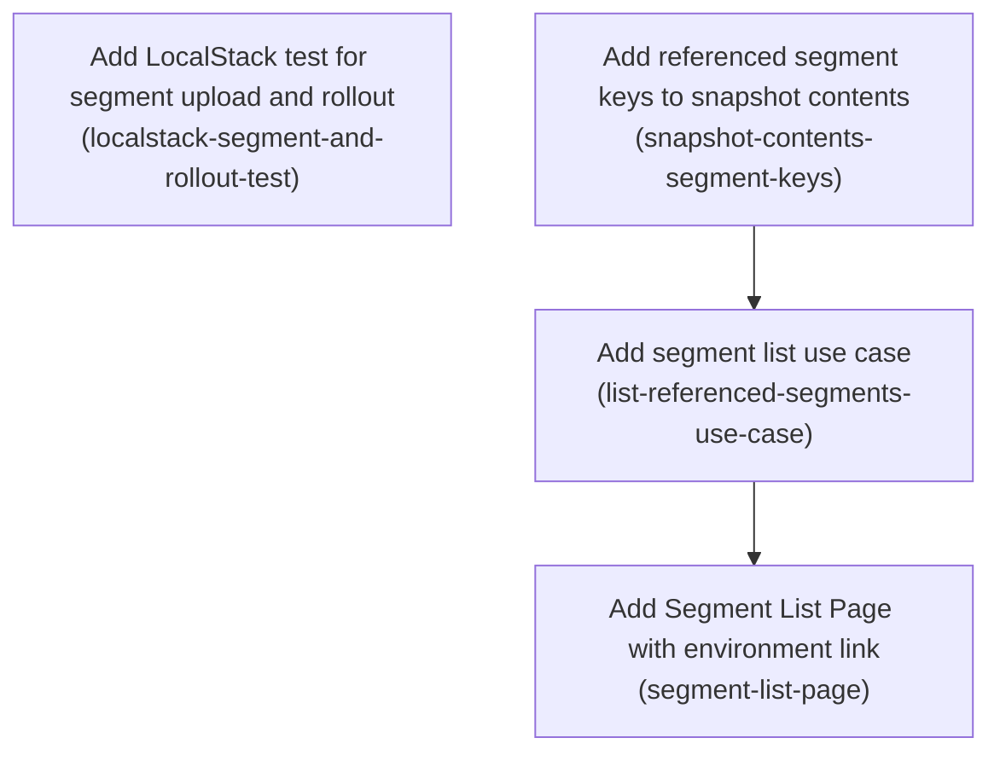

# Horizon 18 — LocalStack proof and Segment List Page

## 🎯 What are we trying to achieve?

Last round the dashboard gained two features: uploading a CSV list of people into a "segment", and setting a percentage rollout on a flag rule so a feature reaches only some of them. Neither has ever been tested against real storage, so nobody knows the files it writes are the files the system later reads. This round proves both against a real (local) S3, and adds a simple page listing which segments a configuration refers to and which version of each is currently published.

## 🧠 Why does this change need to happen?

The upload and rollout code shipped without a single test that touches object storage — every existing test uses an in-memory stand-in, and the one that handles segments deliberately throws. So the only evidence these features work is that the screen said so. On top of that, segment pages exist but nothing in the app links to them: you can only reach a segment by typing its URL by hand.

## At a glance

- **Phases:** 4
- **Complexity:** Medium — one new test suite against real storage, plus a small read-only page across three layers.
- **Main risk:** The horizon-17 FileReader upload path in views/scripts/app.js has never run in a real browser; the Playwright spec may surface genuine bugs (encoding, field name, 32 MiB route cap, form submit wiring) that turn a 'prove it' horizon into a fix horizon.
- **Quality target:** `pnpm verify` green with 100% coverage on every new source file; no change to what is stored in S3; no member values ever rendered or logged.
- **Testing focus:** assertions read back real S3 objects and are keyed off the Segment Pointer, never off object existence; every row state distinguishable; no personal data in fixtures.

---
## Order of work

1. **Add LocalStack test for segment upload and rollout** — starts immediately; proves the existing upload and rollout features against real storage.
2. **Add referenced segment keys to snapshot contents** — independent of step 1; exposes the segment keys a configuration mentions, where it is already being parsed.
3. **Add segment list use case** — comes after step 2 because it consumes those keys and turns each into a row.
4. **Add Segment List Page with environment link** — comes last because it renders exactly what step 3 produces.

---
## Implementation plan

### Phase 1 — Add LocalStack test for segment upload and rollout

Technical ID: `localstack-segment-and-rollout-test` · context: End-to-end Proof · layer: cross-cutting · blast radius: medium

**Goal** — Prove, against a real S3 (LocalStack), that driving the dashboard's HTTP routes performs a Segment Upload and a Percentage Rollout edit, by asserting on the S3 objects the dashboard actually wrote.

**Why** — The dashboard's CSV Segment Upload and per-rule rollout editing shipped last horizon with no test that touches real object storage, so nobody knows whether the objects landing in S3 are the ones the system later reads. This test drives the running dashboard over HTTP exactly as a browser would and then reads the resulting S3 objects back. It has to define its own starting snapshot because a Percentage Rollout is only accepted when a snapshot declares schemaVersion 2, and no schemaVersion 2 snapshot exists anywhere in the repository today.

**Changes**

- Create a sibling integration test file (the existing dashboard.localstack.test.ts is already ~350 lines; do not grow it) that creates a per-test bucket named featuresync-it-<uuid> and starts the dashboard through main() exactly as the existing suite does.
- Define in this file a seed snapshot literal with schemaVersion 2, one flag, and one rule whose `when` carries an inSegment condition referencing a segment key such as 'beta' — this is the first schemaVersion 2 snapshot in the repository, and a Percentage Rollout cannot be saved without one. Reference the segment by key only; never put member values in it.
- PUT that seed snapshot and its pointer into the bucket before each scenario.
- POST an x-www-form-urlencoded CSV body (with the `origin` header the routes require) to /env/<env>/segments/<key>, then assert the published Segment Version object body parses via core's parseSegment, and that <env>/segments/<key>/current.json parses via parseSegmentPointer and points at that version.
- POST a setRollout edit for a rule index, then assert the NEW snapshot version object in S3 contains that rule's {percentage, bucketBy, salt}; then POST removeRollout and assert the rollout block is gone from the next snapshot version.
- Key every assertion off the Segment Pointer, never off mere object existence, so an orphaned version object from a lost compare-and-set race cannot make the test pass falsely.
- Define local segmentPointerText / segmentVersionText / snapshotText helpers inside this file, matching the per-file-helper convention used by the other LocalStack suites.
- Use synthetic member ids only in the CSV body, so no real personal data can reach logs or failure output.

**Files / areas**

- `packages/dashboard/integration/dashboard-segments.localstack.test.ts`

**How to verify**

- **Assertions read back real S3 objects** — The test file contains GetObject (or equivalent S3 client read) calls issued AFTER the HTTP POST, and the assertions run on the fetched body
- **Assertions keyed off the Segment Pointer** — The S3 key used to fetch the segment version body comes from the parsed pointer's objectKey field, not from a string built in the test
- **Self-contained schemaVersion 2 seed** — A snapshot literal in this file has schemaVersion 2, at least one flag, and a rule whose `when` contains an inSegment condition referencing a segment key
- **setRollout and removeRollout both proven** — A setRollout POST is followed by an S3 read whose parsed rule carries percentage, bucketBy and salt with the posted values
- **Synthetic member values only** — Member values in the CSV literal are clearly synthetic (e.g. user-1, user-2) with no email addresses, names or phone numbers

**Done when** — A new LocalStack integration test file that seeds its own schemaVersion 2 snapshot and asserts on the segment version object, the Segment Pointer and the rollout-bearing snapshot version written by the dashboard., and every check under *How to verify* passes its bar.

**Depends on** — nothing — can start immediately

**Rollback** — Delete the test file; it creates only its own throwaway bucket and touches no production source.

Reference — full rubric

| Dimension | Rule | Pass criteria | Failure examples | Min |
|---|---|---|---|---|
| **Assertions read back real S3 objects** `asserts-on-real-s3-objects` | Every scenario must assert on bytes fetched from the LocalStack bucket after the dashboard wrote them, parsed with the real parsers, not on HTTP status codes or in-memory values; 10 means every write the flow performs is read back and parsed, 8 means segment version, pointer and rollout snapshot are all read back and parsed, minScore is the bar for acceptable. | • The test file contains GetObject (or equivalent S3 client read) calls issued AFTER the HTTP POST, and the assertions run on the fetched body • The fetched segment body is passed through core's parseSegment and the fetched <env>/segments/<key>/current.json through parseSegmentPointer, rather than JSON.parse plus a hand-written shape check • No scenario's only assertion is the HTTP response status or response HTML • The rollout assertion reads the NEW snapshot version object from S3 and checks the rule's {percentage, bucketBy, salt} | • The test POSTs the CSV, asserts a 302 redirect and asserts the segment page HTML now lists the key, never fetching the S3 object • parseSegment is imported but only the pointer is parsed; the version body is checked with JSON.parse and a truthy check on a field • The rollout test re-reads the snapshot via the dashboard's own read route instead of S3, so a write that never reached S3 would still pass | 8 |
| **Assertions keyed off the Segment Pointer** `pointer-keyed-assertions` | The test must locate the segment version object through the objectKey read from current.json, so an orphaned version object left by a lost compare-and-set race cannot make the test pass; 10 means every version lookup derives its key from the pointer and the test would visibly fail on an orphan, 8 means no version object is fetched by a key the test constructed itself. | • The S3 key used to fetch the segment version body comes from the parsed pointer's objectKey field, not from a string built in the test • The test asserts the pointer's version field equals the version inside the fetched body • No assertion is of the form 'an object exists under <env>/segments/<key>/' or a ListObjects count | • The test builds the version key as `${env}/segments/${key}/v1.json` because it knows the publisher's naming, so an orphaned v1 from a failed CAS still passes • The test asserts both the pointer and the version object exist and separately parse, but never checks that the pointer actually points at the object it parsed • ListObjectsV2 length === 2 is used as the success signal after upload | 8 |
| **Self-contained schemaVersion 2 seed** `seed-snapshot-schema-v2` | The file must define and PUT its own schemaVersion 2 snapshot with a rule carrying an inSegment condition before each scenario, since no such snapshot exists in the repo and a rollout cannot be saved without one; 10 means the seed is re-PUT per scenario with a fresh bucket and the pointer, 8 means a valid v2 seed plus pointer is written before the scenarios that need it. | • A snapshot literal in this file has schemaVersion 2, at least one flag, and a rule whose `when` contains an inSegment condition referencing a segment key • Both the snapshot object AND its pointer object are PUT into the bucket before the HTTP calls • The bucket name is generated per test run (e.g. featuresync-it-<uuid>) and the dashboard is started via main() as in dashboard.localstack.test.ts • Running the file twice in a row with `pnpm test:integration` passes both times | • The seed snapshot is written once in a beforeAll, so the rollout scenario runs against the snapshot version the segment scenario already mutated and breaks when test order changes • The snapshot is PUT but its pointer is not, so the dashboard reads no current snapshot and the setRollout POST silently 404s • A fixed bucket name is reused, leaving objects behind that make a re-run pass for the wrong reason | 8 |
| **setRollout and removeRollout both proven** `rollout-add-and-remove` | The rollout scenario must prove the block both appears and disappears across successive snapshot versions in S3; 10 means the removal assertion checks the key is absent (not merely falsy) and the snapshot version number advanced on each edit, 8 means both directions are asserted against S3 bodies. | • A setRollout POST is followed by an S3 read whose parsed rule carries percentage, bucketBy and salt with the posted values • A removeRollout POST is followed by an S3 read of the NEXT snapshot version showing the rule has no rollout property • The test asserts the snapshot version number increased between the two reads • Requests include the `origin` header and an x-www-form-urlencoded body, as the routes require | • Only setRollout is exercised; removeRollout is assumed symmetric and never posted • After removeRollout the test re-reads the same snapshot key it read before and passes because the object is unchanged • The removal check is `expect(rule.rollout).toBeFalsy()`, which would also pass if the route wrote `rollout: null` into the stored format | 8 |
| **Synthetic member values only** `no-pii-in-fixtures` | CSV bodies and any failure output must contain only synthetic member ids, since failure dumps of this test are printed in CI; 10 means member values are obviously synthetic and never echoed in an assertion message, 8 means no realistic personal data appears anywhere in the file. | • Member values in the CSV literal are clearly synthetic (e.g. user-1, user-2) with no email addresses, names or phone numbers • No console.log or assertion message interpolates the CSV body or the parsed member list • The seed snapshot references the segment by key only and contains no member values | • The CSV uses plausible emails like alice@example.com to make the fixture realistic • A debugging console.log of the parsed segment body is left in, printing all member values into CI logs on every run • An assertion message embeds the raw CSV to aid diagnosis, so a failure dumps every member value | 8 |

_Healer hint:_ The usual miss is asserting on the HTTP response or a self-constructed S3 key instead of re-reading the object named by the parsed Segment Pointer — fix by fetching current.json first and deriving every version lookup from its objectKey.

### Phase 2 — Add referenced segment keys to snapshot contents

Technical ID: `snapshot-contents-segment-keys` · context: Segment List Page · layer: application · blast radius: small

**Goal** — Expose the set of segment keys that the current snapshot's rules reference from the existing environment-browsing use case, so pages can list them without re-parsing the snapshot themselves.

**Why** — The snapshot parser already knows which segment keys a snapshot's rules mention, but the use case that reads an environment's snapshot returns only flags, metadata and the raw text — so any consumer wanting segment keys would have to parse the snapshot a second time. Surfacing the keys once keeps parsing in a single place.

**Changes**

- Add a readonly segmentKeys field to the snapshot-contents result, populated from @featuresync/core's referencedSegmentKeys applied to the snapshot that is already parsed there.
- Return the keys in a stable sorted order so pages and tests render deterministically.
- Return an empty collection (never an error) when the snapshot references no segments.
- Extend the existing unit tests for this use case to cover both the keys-present and no-keys cases, keeping the project's 100% line/branch/function/statement coverage gate green.

**Files / areas**

- `packages/dashboard/src/application/browse-environment.ts`

**How to verify**

- **Keys derived from the already-parsed snapshot** — browse-environment.ts calls referencedSegmentKeys exactly once, on the variable returned by the existing parseSnapshot call
- **Stable sorted, immutable result** — The field is declared readonly (e.g. `readonly segmentKeys: readonly string[]`) on the snapshot-contents result type
- **No-segments case returns empty** — A unit test parses a snapshot with no inSegment conditions and asserts segmentKeys equals []
- **Application layer stays inward-facing** — The import list added in browse-environment.ts references only @featuresync/core

**Done when** — browse-environment's snapshot-contents result carries a deterministic, unit-tested set of referenced segment keys., and every check under *How to verify* passes its bar.

**Depends on** — nothing — can start immediately

Reference — full rubric

| Dimension | Rule | Pass criteria | Failure examples | Min |
|---|---|---|---|---|
| **Keys derived from the already-parsed snapshot** `single-parse-reuse` | segmentKeys must be computed by calling core's referencedSegmentKeys on the snapshot object parseSnapshot already produced in this function, with no second parse and no local key-scanning logic; 10 means the call sits directly beside the existing parse with no added parsing surface, 8 means referencedSegmentKeys is used once on the existing parsed value. | • browse-environment.ts calls referencedSegmentKeys exactly once, on the variable returned by the existing parseSnapshot call • There is no second parseSnapshot / JSON.parse of the snapshot text in the file • No loop over flags or rules inside browse-environment.ts collects segment keys by hand | • The function re-parses snapshotText into a fresh object to feed referencedSegmentKeys, keeping the two code paths independent • A small local helper walks rules looking for inSegment conditions because it seemed clearer than importing from core • referencedSegmentKeys is called once per flag inside an existing loop, quietly making the work quadratic | 8 |
| **Stable sorted, immutable result** `deterministic-ordering` | The returned segmentKeys must be a readonly, deterministically sorted collection so page output and tests do not depend on rule order; 10 means the sort is explicit and a test asserts exact order from deliberately unsorted input, 8 means the sort exists and the field is readonly. | • The field is declared readonly (e.g. `readonly segmentKeys: readonly string[]`) on the snapshot-contents result type • An explicit sort is applied before returning; the raw output of referencedSegmentKeys is not returned as-is • A unit test feeds a snapshot whose rules mention keys in non-alphabetical order and asserts the exact returned array • The returned array contains no duplicate keys when two rules reference the same segment | • The Set from referencedSegmentKeys is spread into an array and returned, so order follows rule order and happens to look sorted in the test fixture • The test fixture lists keys already in alphabetical order, so the missing sort is never detected • The array is typed `string[]` and mutated in place by a later caller | 8 |
| **No-segments case returns empty** `empty-not-error` | A snapshot whose rules reference no segments must yield an empty collection, never undefined, null or a thrown error; 10 means the field is always present with the same type in every branch, 8 means the empty case is covered by a passing test. | • A unit test parses a snapshot with no inSegment conditions and asserts segmentKeys equals [] • The field is not optional in the result type (no `?`) • No branch returns undefined for segmentKeys, including any early-return or error path already in the function | • The field is typed optional and left off when there are no keys, forcing every consumer to write `?? []` • A schemaVersion 1 snapshot, which has no rules at all, makes referencedSegmentKeys throw because the field is accessed unguarded • The empty case is only implicitly covered by an existing test that never asserts on segmentKeys | 8 |
| **Application layer stays inward-facing** `application-layer-purity` | This application use case must import only core and its own port types — no HTTP, S3 SDK, view or formatting concerns may appear alongside the new field; 10 means the new code adds zero imports outside core, 8 means no outward-layer import is introduced. | • The import list added in browse-environment.ts references only @featuresync/core • No string is formatted for display (no HTML escaping, no 'not published' label) in this file • The result field holds plain segment keys, not pre-rendered links or labels | • The keys are returned pre-escaped for HTML because the only consumer is a page • A count or display string like `3 segments` is added next to the keys for the view's convenience • An import from ../infrastructure is added to reuse a sorting or escaping helper that already lives there | 8 |

_Healer hint:_ The usual miss is returning referencedSegmentKeys' output unsorted (or optional) and testing it with an already-alphabetical fixture — fix by sorting explicitly and adding a deliberately unsorted-input test.

### Phase 3 — Add segment list use case

Technical ID: `list-referenced-segments-use-case` · context: Segment List Page · layer: application · blast radius: small

**Goal** — Add an application use case that turns the snapshot's referenced segment keys into rows of {segment key, current published version or 'not published'}, using the segment version reader already present on the dashboard's ports.

**Why** — The page needs, per referenced segment key, the version number of the segment currently published for it. That reader already exists on the dashboard's port interface, but it reports a missing pointer as an empty result while reporting every other failure by throwing — so one unreadable key must not be allowed to blow up the whole list.

**Changes**

- Add a use case taking the environment name and the dashboard ports, reading the snapshot's referenced segment keys via the segmentKeys field added in phase snapshot-contents-segment-keys.
- For each key, call ports.readSegmentVersion(environment, key) and map the result to a row: a version number, or an explicit 'not published' state when no pointer exists.
- Wrap each per-key read in its own error handling so a failing key becomes an explicit 'unavailable' row rather than failing the whole page.
- Never read, expose or log segment member values — the use case deals only in keys and version numbers.
- Add unit tests for all four outcomes (version found, no pointer, read failure, no referenced keys) so the 100% branch-coverage gate stays green.

**Files / areas**

- `packages/dashboard/src/application/list-referenced-segments.ts`

**How to verify**

- **One bad key cannot break the list** — The try/catch (or equivalent) is inside the per-key loop/map, not wrapped around the whole iteration
- **Version, not-published and unavailable are distinct** — The row type distinguishes at least three cases: a numeric version, 'not published', and 'unavailable'
- **No member values touched or logged** — The row type has no field holding member values, member counts or a segment body
- **Reads keys from browse-environment, not S3** — The file contains no parseSnapshot call and no direct snapshot-object read

**Done when** — A unit-tested use case returning one row per referenced segment key with its current version or an explicit unpublished/unavailable state., and every check under *How to verify* passes its bar.

**Depends on** — Add referenced segment keys to snapshot contents

Reference — full rubric

| Dimension | Rule | Pass criteria | Failure examples | Min |
|---|---|---|---|---|
| **One bad key cannot break the list** `per-key-failure-isolation` | Each readSegmentVersion call must be individually guarded so a throw becomes an 'unavailable' row while every other key still resolves; 10 means isolation is proven by a test where a middle key throws and the rows before and after are still correct, 8 means the try/catch is per key rather than around the loop. | • The try/catch (or equivalent) is inside the per-key loop/map, not wrapped around the whole iteration • A unit test makes readSegmentVersion throw for one of at least three keys and asserts the other two rows still carry their versions • The row count always equals the number of referenced segment keys, even when some reads fail • The use case itself never rethrows a per-key read error | • A single try/catch wraps a Promise.all over all keys, so one rejection collapses the whole list to an error • Per-key catch exists but the test only has one key, so the isolation claim is never exercised • The catch returns nothing, so the failing key is silently dropped and the row count no longer matches the key count | 8 |
| **Version, not-published and unavailable are distinct** `three-distinct-row-states` | A missing pointer (empty result) and a failed read (throw) must map to two different, machine-distinguishable row states, neither of which is confusable with a real version; 10 means the states are a discriminated union that makes a wrong render impossible, 8 means the two are distinguishable without string matching. | • The row type distinguishes at least three cases: a numeric version, 'not published', and 'unavailable' • A unit test with readSegmentVersion returning the empty/no-pointer result asserts the 'not published' state, and a separate test with a throw asserts 'unavailable' • Neither absent state is represented as version 0, -1, null or an empty string • The no-referenced-keys case returns an empty row list | • Both the missing-pointer and the failed-read case produce `version: undefined`, so the page cannot tell an unpublished segment from a broken one • 'not published' is encoded as the string in the version field, forcing the view to string-compare and making a future copy change silently break it • The empty result from readSegmentVersion is treated as a falsy version and falls into the same branch as a legitimate version 0 | 8 |
| **No member values touched or logged** `keys-and-versions-only` | The use case must handle only segment keys and version numbers — never member values — and must not log the caught error object if it could carry a segment body; 10 means nothing beyond key and version ever enters a variable here, 8 means no member data is read, returned or logged. | • The row type has no field holding member values, member counts or a segment body • No console.* / logger call in this file interpolates a segment body or a caught error's response payload • Only readSegmentVersion (not a full segment-body reader) is called on ports | • The caught error is logged in full for diagnosis, and it carries the S3 response body of a partially read segment • A memberCount field is added because it was cheap to compute from the reader's result • The use case calls a broader read-segment port to get the version because that method was more familiar | 8 |
| **Reads keys from browse-environment, not S3** `consumes-phase-4-field` | Referenced keys must come from the snapshot-contents segmentKeys field added in phase snapshot-contents-segment-keys rather than a fresh snapshot fetch or parse, keeping parsing in one place; 10 means the use case composes the existing use case with no new snapshot I/O, 8 means no parseSnapshot or raw snapshot read appears here. | • The file contains no parseSnapshot call and no direct snapshot-object read • The keys come from the snapshot-contents result's segmentKeys field • The use case's parameters are the environment name and the dashboard ports, with no extra snapshot argument threaded through | • The use case fetches and parses the snapshot itself because calling another use case felt like indirection • The caller is required to pass segmentKeys in, pushing the composition into the route and duplicating it per caller • referencedSegmentKeys is imported from core and re-applied here, recreating the double-parse the prior phase removed | 8 |

_Healer hint:_ The usual miss is collapsing 'no pointer' and 'read failed' into one falsy version state — fix by making the row a three-way discriminated union and adding the throwing-key test.

### Phase 4 — Add Segment List Page with environment link

Technical ID: `segment-list-page` · context: Segment List Page · layer: interface · blast radius: medium

**Goal** — Render a read-only page listing each referenced segment key with its current published version, and link to it from the environment page so segments are reachable without typing a URL.

**Why** — Segment pages exist but nothing in the dashboard links to them, so segments are invisible unless a user guesses the URL. A simple read-only list gives operators an entry point and shows at a glance which referenced segments have actually been published.

**Changes**

- Add the GET route inside the existing segment route matcher (matched when the path has three segments and the third is 'segments'), so the main HTTP router needs no change.
- Add a view module rendering a table of segment key plus current version, with an explicit 'not published' cell for a referenced key that has no pointer and an 'unavailable' cell for a failed read; each key links to its existing segment page.
- Render only keys and version numbers — no member values, no member counts, no timestamps.
- Add a link to this page from the environment page.
- Put any new styling in an existing or new per-feature file under views/styles/ and register it in the stylesheet module's STYLE_FILES list — never one growing monolithic stylesheet.
- Add unit tests covering the route match, each row state and the environment-page link, keeping coverage at 100%.

**Files / areas**

- `packages/dashboard/src/infrastructure/segment-routes.ts`
- `packages/dashboard/src/infrastructure/views/segment-list-page.ts`
- `packages/dashboard/src/infrastructure/views/environment-page.ts`
- `packages/dashboard/src/infrastructure/views/styles/`

**How to verify**

- **Route added to the existing segment matcher** — git diff shows no change to the main HTTP router/dispatch file
- **Every row state has a visible cell** — Unit tests render the view with each of the three row states and assert the distinct output text for each
- **Keys and versions only, nothing else** — The rendered HTML in the tests contains no member value, member count or date/timestamp
- **Styles in a registered per-feature file** — New CSS lives in a file under views/styles/ and that filename appears in STYLE_FILES
- **Interface layer holds no segment logic** — No try/catch around readSegmentVersion or any ports call appears in segment-routes.ts or the view module

**Done when** — A read-only Segment List Page served at the environment's /segments path and linked from the environment page., and every check under *How to verify* passes its bar.

**Depends on** — Add segment list use case

**Rollback** — Remove the route branch, the view module, the environment-page link and the stylesheet registration; no stored data is affected since the page is read-only.

Reference — full rubric

| Dimension | Rule | Pass criteria | Failure examples | Min |
|---|---|---|---|---|
| **Route added to the existing segment matcher** `route-inside-existing-matcher` | The GET listing must be matched inside segment-routes.ts's existing matcher for three-part paths whose third element is 'segments', leaving the main HTTP router untouched; 10 means the new branch reuses the matcher's existing parsing with no duplicated path splitting, 8 means the router file is unchanged and the branch lives in the matcher. | • git diff shows no change to the main HTTP router/dispatch file • The new branch is inside matchSegmentRoute and distinguishes GET from the existing POST on the same path shape • A unit test asserts the matcher returns the list route for GET /env/<env>/segments and still returns the existing routes for the previously matched paths • An unmatched near-miss path (e.g. a four-part path, or POST to the list path) does not resolve to the list page | • The GET is added as a new top-level branch in the router because the matcher's shape checks were awkward to extend • The new branch matches on path length alone and swallows POST /env/<env>/segments, breaking the upload route • The matcher change is tested only for the happy path, so the regression on the existing segment-detail route ships unnoticed | 8 |
| **Every row state has a visible cell** `all-row-states-rendered` | The table must render a distinct cell for a found version, an explicit 'not published' and an explicit 'unavailable', with each key linking to its existing segment page; 10 means an empty list also renders a sensible empty-state row rather than a bare table, 8 means all three states plus the link are covered by tests. | • Unit tests render the view with each of the three row states and assert the distinct output text for each • Each rendered key is an anchor whose href is the existing segment page path for that key • Rendering with zero rows produces valid HTML without a broken/empty table body • Segment keys pass through the shared escapeHtml helper before being interpolated | • 'not published' and 'unavailable' render as the same blank or em-dash cell, so operators cannot tell a missing pointer from a broken read • The version cell renders `${row.version}` directly and prints 'undefined' for the non-version states • The key is escaped in the cell text but injected raw into the href, so a key with a quote breaks the attribute | 8 |
| **Keys and versions only, nothing else** `no-member-data-rendered` | The page must show only segment keys and version numbers — no member values, member counts or timestamps — even though the underlying objects carry more; 10 means the view's data type structurally cannot hold member data, 8 means the rendered output contains none. | • The rendered HTML in the tests contains no member value, member count or date/timestamp • The view module's parameter type exposes only key and version/state fields • The view does not import or call any segment-body reader | • A 'last updated' column is added from the pointer object because it looked useful on a list page • A member count is rendered to show at a glance which segments are populated, leaking set sizes • The view is handed the whole use-case result plus the raw snapshot 'just in case', so member data is one template edit away | 8 |
| **Styles in a registered per-feature file** `per-feature-stylesheet` | Any new CSS must live in a file under views/styles/ registered in the stylesheet module's STYLE_FILES list, never appended to a growing monolith or inlined in the view; 10 means the new file is scoped to this page's selectors only, 8 means the file exists and is registered. | • New CSS lives in a file under views/styles/ and that filename appears in STYLE_FILES • The view module contains no <style> block and no inline style attributes • The served stylesheet response includes the new file's rules (covered by the existing stylesheet test or a new one) | • The file is created but not added to STYLE_FILES, so the page renders unstyled while every test still passes • The two rules needed are appended to an existing shared stylesheet file because creating a file for them felt excessive • Styles are inlined on the table element to avoid touching the stylesheet registration | 8 |
| **Interface layer holds no segment logic** `interface-layer-thinness` | The route and view must only call the list-referenced-segments-use-case use case and format its result; deciding what a row means, sorting keys, or catching read errors must not appear in infrastructure; 10 means the route body is a call plus a render, 8 means no state-deciding or error-recovery logic lives in these files. | • No try/catch around readSegmentVersion or any ports call appears in segment-routes.ts or the view module • No sorting or de-duplication of segment keys happens in the view or route • The view receives the use case's rows and maps them to markup without re-deriving the not-published/unavailable distinction from raw values • No S3/AWS import appears in the view module | • The route catches errors from the use case and substitutes 'unavailable' rows itself, duplicating logic the use case already owns • The view sorts rows before rendering because the ordering guarantee wasn't obvious from the use case's type • The route calls ports.readSegmentVersion directly for one key to avoid a use-case round trip | 8 |

_Healer hint:_ The usual miss is a new styles file that is never added to STYLE_FILES, or 'not published' and 'unavailable' collapsing into one blank cell — fix by asserting the registration and rendering all three states in the view tests.

---
## Discovery Findings

| Area | Finding | Where | Implication |
|---|---|---|---|
| Playwright wiring | playwright.config.ts has testDir 'e2e', no webServer block, no projects, no env plumbing; it uses the locally installed Chrome by default (PLAYWRIGHT_CHANNEL='' selects bundled Chromium). The server under test is started inside the fixture, not by Playwright. | `packages/dashboard/playwright.config.ts` | A LocalStack-backed spec does not need a webServer; it needs a new fixture that starts the dashboard with AWS ports. But CI has no Playwright job at all, so config likely needs PLAYWRIGHT_CHANNEL handling plus a browser-install step. |
| Playwright fixtures are purely in-memory | e2e/support/fixtures.ts defines InMemoryEnvironment implementing DashboardPorts directly and calls startDashboardServer({ports, port:0}). Its publishSegment rejects ('Segment upload is not used in these tests.') and readSegmentVersion resolves null. Seed snapshots are schemaVersion 1. | `packages/dashboard/e2e/support/fixtures.ts` | The existing fixture cannot be reused for the S3-asserting spec - a NEW fixture (e.g. e2e/support/localstack-fixtures.ts) is needed that creates a per-test bucket, builds ports via createAwsDashboardPorts({bucket}), exposes bucket + an S3 client for assertions, and tears the bucket down. Don't bolt segments onto InMemoryEnvironment. |
| Dashboard entrypoint supports LocalStack with zero code change | main(argv, io) takes --bucket/--port and io.createPorts = createAwsDashboardPorts; createAwsDashboardPorts builds S3 clients from the standard AWS SDK env (AWS_ENDPOINT_URL_S3 etc.) and optionally accepts config.client. The LocalStack integration test already starts the dashboard this way. | `packages/dashboard/src/main.ts` | No entrypoint/env work is needed - the LocalStack Playwright fixture can call main() or createAwsDashboardPorts directly. Only AWS_* env must reach the Playwright process; vitest.integration.config.ts loads ../../.env manually - Playwright has NO equivalent, so the plan must add .env loading (or CI env) to playwright.config.ts. |
| CI has no Playwright job | .github/workflows/ci.yml has exactly two jobs: 'verify' (pnpm verify + example) and 'localstack' (docker compose up --wait on pinned localstack/localstack:2026.08.3, then pnpm test:integration). `pnpm test:e2e` is not run anywhere in CI, and root package.json has no e2e script. | `.github/workflows/ci.yml` | Running Playwright + LocalStack together is NEW infrastructure: the plan needs a phase for a CI step (browser install, PLAYWRIGHT_CHANNEL='', AWS_* env, running e2e inside the localstack job or a new job), plus a root script. |
| LocalStack integration test shape | integration/dashboard.localstack.test.ts creates a per-test bucket (featuresync-it-<uuid>), starts the dashboard through main(), drives everything over HTTP with x-www-form-urlencoded POSTs carrying an `origin` header, and asserts by GET-ing S3 objects (snapshotText, currentPointerText, snapshotExists, listKeys) plus a local differingPaths helper. Every snapshot is schemaVersion 1; there are NO segment or rollout tests. ~350 lines. | `packages/dashboard/integration/dashboard.localstack.test.ts` | Adding segment-upload and rollout scenarios is additive over HTTP. A schemaVersion 2 seed snapshot with a rule must be ADDED - none exists today. The file is already large, so a sibling dashboard-segments.localstack.test.ts is warranted. |
| Coverage scope excludes app.js entirely | Root vitest.config.ts is the only coverage config: projects per package with exclude ['integration/**','e2e/**'], coverage include ['packages/*/src/**/*.ts'], thresholds 100 on lines/branches/functions/statements. vitest.integration.config.ts sets coverage.enabled=false. | `vitest.config.ts` | packages/dashboard/src/infrastructure/views/scripts/app.js is a .js file, already OUTSIDE the coverage include glob - browser JS is structurally uncoverable today and the 100% gate cannot see it. The plan must NOT try to 'cover' app.js; the proof is behavioural via Playwright, and that boundary should be stated explicitly. |
| How app.js is built/served | client-script.ts readFileSync's ./scripts/app.js at module load, content-hashes it into CLIENT_SCRIPT_HREF, and http-server serves it at /assets/app.js. The dashboard build is tsc plus a cpSync of views/styles and views/scripts into dist. stylesheet.ts concatenates STYLE_FILES = base, layout, forms, components, tables, rollout, segments.css. | `packages/dashboard/src/infrastructure/views/client-script.ts` | Playwright running against src picks up app.js from src, so no build step is needed for the e2e spec. Any new CSS file must be registered in stylesheet.ts's STYLE_FILES array. eslint.config.js has a block declaring browser globals for scripts/*.js including FileReader. |
| CSV upload path (the thing to prove) | app.js [data-segment-upload] handler intercepts submit only when csv.value==='' and a file is selected, uses FileReader.readAsText then form.submit(). The form in views/segment-page.ts has hidden expectedCurrentVersion and csv inputs, a text memberAttribute (default 'userId') and <input type=file data-segment-file>. Route POST/GET /env/<env>/segments/<key> lives in segment-routes.ts with MAX_SEGMENT_CSV_BYTES=32MiB. | `packages/dashboard/src/infrastructure/segment-routes.ts` | The Playwright spec uses page.setInputFiles on [data-segment-file], clicks 'Upload members' and asserts on the success notice plus S3 objects. Selectors data-segment-upload / data-segment-file already exist and are stable. |
| Segment page is unreachable from the UI | environment-page.ts contains no segment link at all; /env/<env>/segments/<key> is reachable only by typing a URL. The only place segment keys are rendered today is rollout-form.ts's renderSegmentKeys, which derives them locally from rule.when[*].inSegment - it does NOT use core's referencedSegmentKeys. | `packages/dashboard/src/infrastructure/views/rollout-form.ts` | The new Segment list page is the first navigation entry point for segments - the plan needs an explicit change to environment-page.ts and a new GET route. The duplicated segment-key extraction is a DRY smell worth calling out. |
| referencedSegmentKeys availability | packages/core exports referencedSegmentKeys(snapshot): ReadonlySet<string> from index.ts; it takes a PARSED Snapshot, not raw JSON. packages/dashboard already depends on @featuresync/core and @featuresync/aws and already calls parseSnapshot in browse-environment.ts and aws-adapters.ts. | `packages/core/src/domain/snapshot.ts` | No dependency work needed. But browse-environment's SnapshotContents exposes only flags/metadata/raw - NOT the parsed Snapshot - so the list-page use case must either re-parse the raw snapshot text or browse-environment must surface segment keys. Adding a segmentKeys field to SnapshotContents is the smaller change and keeps parseSnapshot in one place. |
| createS3SegmentVersionReader signature and port composition | createS3SegmentVersionReader({bucket, client?}) returns { readVersion(environment, segmentKey): Promise<number\|null> }; null ONLY for a missing pointer, every other failure throws S3SegmentPublishError. It is already exported from @featuresync/aws and already wired in aws-adapters.ts as DashboardPorts.readSegmentVersion. DashboardPorts = EditFeaturePorts & SegmentUploadPorts. | `packages/aws/src/infrastructure/s3-segment-version-reader.ts` | The list page needs NO new port and NO new aws reader - it reuses ports.readSegmentVersion. Because non-missing failures throw, the 'a per-key failure must not take the page down' requirement forces an explicit per-key try/catch in the new application use case, and each branch needs a unit test to hold 100% branch coverage. |
| Existing S3 assertion helpers | There is no shared test-helper module; each LocalStack suite redefines its own local helpers. packages/aws/integration/s3-segment-publisher.localstack.test.ts has listKeys/readJson and asserts segment bodies via core's parseSegment and pointers via parseSegmentPointer at <env>/segments/beta/{current.json,1.json,2.json}. | `packages/aws/integration/s3-segment-publisher.localstack.test.ts` | Convention is per-file local helpers, not a shared package. Follow it: add segmentPointerText/segmentVersionText helpers inside the dashboard integration file and inside the Playwright LocalStack fixture rather than inventing a shared test-utils package. |
| Routing and view composition conventions | http-server.ts matches routes by split path segments with explicit length/name checks inside a match(segments, method) closure; segment routes are delegated to matchSegmentRoute(ports, environment, segments, method) in a separate module returning Route\|undefined. Views are template-literal functions: renderPage(title, bodyHtml, notices) from layout.ts, escapeHtml/environmentPath from escape.ts, styles registered in stylesheet.ts. | `packages/dashboard/src/infrastructure/http-server.ts` | The Segment list page should be a GET matched at segments.length===3 && segments[2]==='segments' - most naturally added INSIDE matchSegmentRoute (which currently early-returns unless length===4), keeping http-server untouched except for the environment-page link. New view file views/segment-list-page.ts plus reuse of segments.css. |
| schemaVersion 2 / rollout precondition | No snapshot anywhere in the dashboard integration test or e2e fixtures uses schemaVersion 2; both use schemaVersion 1 exclusively, and environment-page's firstVersionTemplate hardcodes schemaVersion 1. The rollout edit path exists end-to-end already: rollout-form renders percentage/bucketBy/salt plus field=setRollout\|removeRollout, http-server parses ruleIndex, flag-edit.ts implements both with typed failures. | `—` | Both the new LocalStack scenario and the Playwright rollout scenario must seed a bespoke schemaVersion 2 snapshot with at least one rule and an inSegment condition. That seed is a shared prerequisite - make it one early phase artifact reused by both proofs rather than duplicating it in three places. |

## Out of Scope

- Starting a real @featuresync/core FlagClient or SDK S3 snapshot source process that reads the uploaded segment/rollout back from LocalStack — the user capped the proof at asserting the S3 objects the dashboard wrote.
- Showing segment member count or createdAt on the Segment list — the user rejected it because it would require changing what publish writes to S3.
- Any change to the SegmentPointer shape or the segment version object format — pinned by caller acceptance criteria.
- Rendering, exporting, searching or logging segment member values anywhere in the dashboard — PII invariant.
- Listing segments via S3 ListObjectsV2, or showing segments not referenced by the current snapshot — the dashboard never lists the bucket (horizon-10 decision) and reader IAM does not grant it.
- Deleting segments, or cleaning up orphaned segment version objects from a lost pointer race — that blocker needs its own lifecycle decision.
- Structured inSegment condition editing (a segment picker) — the raw 'Edit rules' JSON textarea already covers it; deferred from horizon 17.
- Per-SDK segment version telemetry — decided against in horizon 17; no telemetry exists to read.
- Measuring or hardening the 100k-member (~25 MiB) upload path through FileReader and the 32 MiB urlencoded route — an open blocker requiring a load measurement, not a feature.
- Deciding whether setRollout should auto-upgrade a schemaVersion 1 snapshot to 2 — an unresolved horizon-17 blocker needing a migration decision.
- Fixing the horizon-16 concurrent-replay 200+422 race for rollout edits — a separate correctness investigation, not part of this proof.
- Any multipart/form-data upload parser or transport change — horizon 17 decided on FileReader + urlencoded.
- Add Playwright fixture backed by LocalStack: a browser-test fixture starting the dashboard against a real bucket — held for the next Planning Horizon to keep this one small and reviewable — the Planning Brief and project memory carry the context forward
- Add browser spec for CSV upload and rollout: a real browser driving the FileReader upload and the rollout form — held for the next Planning Horizon to keep this one small and reviewable — the Planning Brief and project memory carry the context forward
- Extract the schemaVersion 2 seed snapshot into a shared fixture module — only worth doing once the deferred browser spec becomes a second consumer; today it has one.
- Add a CI job running the browser specs against LocalStack (browser install, AWS env, new workflow job) — fails the 'needed now?' gate: the proof must first be green locally and the specs may surface real bugs; wiring CI around an unproven spec is speculative and belongs to the next horizon once the spec is stable.
- Show member count and createdAt on the Segment List Page — fails the 'in scope?' gate: the user explicitly rejected it because it would change what publish writes to S3.
- Start a real flag-client/SDK process that reads the uploaded segment and rollout back from LocalStack — fails the 'in scope?' gate: the user capped the proof at asserting the S3 objects the dashboard wrote.
- Deciding whether a rollout edit should auto-upgrade a schemaVersion 1 snapshot to schemaVersion 2 — fails the 'decided?' gate: an unresolved migration question from the previous horizon; this horizon simply seeds a schemaVersion 2 snapshot.
- Cleaning up orphaned segment version objects left by a lost pointer compare-and-set race — fails the 'decided?' gate: needs its own segment lifecycle decision; this horizon only avoids asserting on object existence.
- Measuring or hardening the very large (100k-member, ~25 MiB) CSV upload path through the in-browser file read and the 32 MiB request cap — fails the 'needed now?' gate: a load measurement, not part of proving the path works.
- Extracting a shared LocalStack test-helper package — fails the 'needed now?' gate: the repo convention is per-file local helpers and only two suites would share them.
- Replacing the rollout form's local segment-key extraction with the snapshot's referenced segment keys (a duplication cleanup) — fails the 'needed now?' gate: a DRY refactor with no behaviour change and no caller asking for it.
- Structured inSegment condition editing (a segment picker) — fails the 'in scope?' gate: already declared out of scope; the raw rules JSON editor covers it.

## Success Criteria

- Done when: (1) packages/dashboard/integration/dashboard-segments.localstack.test.ts seeds its own schemaVersion 2 snapshot and covers a segment CSV upload and a setRollout/removeRollout edit driven through the dashboard's HTTP routes against LocalStack, asserting on the actual S3 objects written (segment version object body located via the Segment Pointer's objectKey, the <env>/segments/<key>/current.json pointer itself, and the new snapshot version object carrying the rule's rollout); (2) a read-only Segment List Page exists in the dashboard, built from core's referencedSegmentKeys surfaced through browse-environment plus the readSegmentVersion port already on DashboardPorts, rendering each Referenced Segment Key with its current pointer version and explicit 'not published' / 'unavailable' states, reachable from the environment page; (3) no member value is ever rendered or logged; (4) SegmentPointer and segment version object shapes are byte-for-byte unchanged from horizon 17; (5) `pnpm verify` passes with 100% line/branch/function/statement coverage including every new src/*.ts file, ESLint layer boundaries hold, and the LocalStack integration suite passes in its existing out-of-root-coverage config. The browser-level (Playwright) proof of the FileReader upload path is deliberately NOT part of this horizon: it is carried to the next Planning Horizon so it can land together with the CI job that runs it.
- Add LocalStack test for segment upload and rollout: A new LocalStack integration test file that seeds its own schemaVersion 2 snapshot and asserts on the segment version object, the Segment Pointer and the rollout-bearing snapshot version written by the dashboard.
- Add referenced segment keys to snapshot contents: browse-environment's snapshot-contents result carries a deterministic, unit-tested set of referenced segment keys.
- Add segment list use case: A unit-tested use case returning one row per referenced segment key with its current version or an explicit unpublished/unavailable state.
- Add Segment List Page with environment link: A read-only Segment List Page served at the environment's /segments path and linked from the environment page.

## Alignment Preview

Five concerns were raised before the expensive half of planning. Four pointed the same way: the original cut kept four proof phases and deferred the Segment List Page entirely, spending two of those four on browser-test plumbing for a spec that no CI job would ever run.

The user redirected once (1 of 2 rounds used): **swap the browser proof out, bring the Segment List Page in.** The redirect was applied as a mechanical re-selection of phases Stage 3 had already produced, so no re-decomposition call was spent. A fifth concern — that the shared seed snapshot was too small to be its own phase — became correct as a consequence of that swap (its second consumer left with the browser proof), so it was folded into the LocalStack test phase.

## Quality Gate

Path: full. One critic iteration, as designed.

- **Raised:** 1 blocker, 9 passing dimensions. **Discarded on evidence:** 0. **Downgraded:** 0. **Confirmed:** 1.
- **Blocker (healed):** `success-coverage` — after the redirect, `successCriteria[0]` still demanded the Playwright browser spec and "the LocalStack + Playwright suites pass", but that work now sits in `deferred`. Completing all four phases could not have satisfied the stated bar. Fixed by rewriting the success definition to the subset this horizon delivers, naming the browser proof as explicitly carried to the next horizon, and correcting the integration-test filename.
- **Minor debt accepted:** none outstanding. The one minor wart the critic noted (phases referring to each other by stale numbers like "the phase-4 field") was fixed mechanically in 5 places, since it would have misled an executor reading `inputs`.
- **Verification call:** not run — the critic's own quoted evidence resolved the blocker, so no call was needed.
- **Healer call:** not made. The confirmed blocker was a single precise text rewrite; a healer call returns the full roadmap and would have risked drift across 4 phases and 18 rubric dimensions to fix one field. Applied directly and recorded here.
- **Verdict:** passed after one iteration.

## Cost

Budget stated before Stage 1: 8–10 Agent calls (full path with Discovery). **Actual: 7** — Stage 1, Discovery, Stage 3, preview concerns, Stage 3.5, Stage 4, critic. Under budget because Stage 2 was skipped (Discovery ran), the user's redirect was absorbed mechanically instead of re-running Stage 3, no blocker needed verification, and the one blocker was healed without a healer call. No stage overran.

## Full analysis

**Domain shape:** `business` — Even though the work is test- and UI-heavy, the objective is about the FeatureSync domain — Segments, Segment Pointers, referenced segment keys, snapshot versions and percentage rollout rules — which are the rule-bearing concepts a flag operator would name.

### Ubiquitous language

| Term | Meaning |
|---|---|
| **Segment** | A named, versioned set of member values under one member attribute, stored in S3 and referenced by flag rules by key only. |
| **Segment Pointer** | The <env>/segments/<key>/current.json object {schemaVersion, environment, segmentKey, version, objectKey} naming the live Segment Version; its shape is frozen this horizon. |
| **Segment Version** | One immutable published segment body object; its version number is what the Segment list page displays. |
| **Referenced Segment Key** | A segment key that the current snapshot's rules mention, obtained from core's referencedSegmentKeys(snapshot) — the sole source of rows on the Segment list page. |
| **Segment Upload** | The dashboard flow that reads a CSV in the browser via FileReader, posts it urlencoded, and publishes a new Segment Version plus pointer through the S3 Segment Publisher with expectedCurrentVersion CAS. |
| **Percentage Rollout** | The optional per-rule {percentage, bucketBy, salt} block edited via the setRollout/removeRollout Flag Edit kinds through the existing CAS/replay edit path. |
| **Segment List Page** | The new read-only dashboard page listing each Referenced Segment Key with its current Segment Pointer version, and nothing else. |
| **End-to-end Proof** | A LocalStack integration test plus a Playwright browser spec that exercise Segment Upload and rollout editing and assert on the S3 objects the dashboard actually wrote. |

### Assumptions

- createS3SegmentVersionReader(bucket).readVersion(env, key) — already exported from @featuresync/aws (horizon 17) and returning number | null with null only for a missing pointer — is the 'public segment pointer reader' the task asks for; the horizon reuses it rather than adding a second reader, extending it only if the list page needs a shape it cannot give.
- The Segment list page derives its key set only from the current snapshot's referencedSegmentKeys (core export), never from S3 ListObjectsV2, per the horizon-10 no-listing decision and reader IAM.
- Reading N segment pointers for the list page is N GETs of small current.json objects on page render, with no caching layer; a referenced key whose pointer is missing renders as unpublished rather than failing the page.
- The Playwright spec reuses the existing packages/dashboard/e2e/support fixtures and the existing LocalStack seeding pattern from dashboard.localstack.test.ts; LocalStack runs on the pinned image already used in CI and Playwright uses its existing playwright.config.ts.
- The e2e CSV fixture is small (tens of members), not a 100k-member file — the 25 MiB/32 MiB memory question stays an open blocker, not a horizon-18 measurement.
- The rollout edit under test targets a schemaVersion 2 snapshot, since parseSnapshot rejects a rollout on schemaVersion 1 and the v1-upgrade question is an unresolved horizon-17 blocker.
- Segment list is read-only: no upload form, delete, or member view is added on it beyond linking to the existing upload page.

### Risks

- The horizon-17 FileReader upload path in views/scripts/app.js has never run in a real browser; the Playwright spec may surface genuine bugs (encoding, field name, 32 MiB route cap, form submit wiring) that turn a 'prove it' horizon into a fix horizon.
- views/scripts/app.js is untested browser JS copied verbatim by the build script; the 100% coverage gate is enforced by vitest over src, and Playwright/LocalStack suites live outside root coverage — so an e2e-only proof may leave app.js formally uncovered, forcing either a jsdom/unit harness for app.js or an explicit coverage-scope decision.
- Rendering the Segment list needs one pointer GET per referenced key on every page render; a snapshot referencing many segments makes the page slow, and a per-key failure must not take the page down.
- The horizon-16/17 concurrent-replay 200+422 race is unresolved; a Playwright spec that races a rollout edit against another write could be flaky in CI.
- PII risk: segment member values must never reach HTML, logs, or Playwright trace/screenshot artifacts — an e2e failure trace could capture uploaded CSV content, so fixtures must use synthetic ids.
- An orphaned segment version object left by a lost pointer IfMatch race (open horizon-17 blocker) can make S3-object assertions in the integration test see objects no reader will use; assertions must key off the pointer, not object existence.
- The 'no stored-format change' criterion forbids putting memberCount/createdAt into the pointer, which is exactly what would make the list page cheap — accepted per the user's explicit rejection, but it locks the page to N pointer reads.
- LocalStack + Playwright are both required for the proof; if CI lacks LOCALSTACK_AUTH_TOKEN the suite fails rather than skips (horizon-3 decision), so the horizon's proof can red the pipeline for environment reasons.
