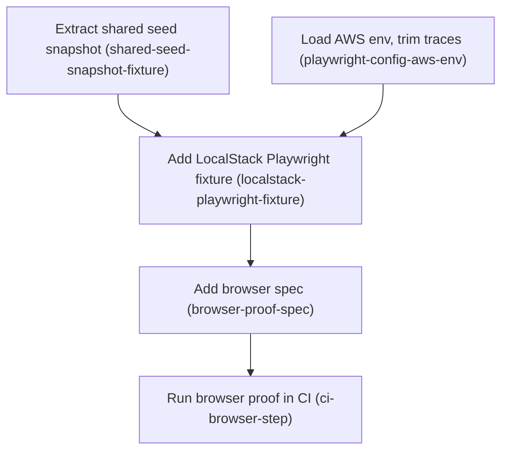

# Horizon 19 — Browser proof of CSV upload and rollout editing, with CI

## 🎯 What are we trying to achieve?

The dashboard has a small piece of browser JavaScript that lets an operator pick a CSV file of segment members and upload it. That code has never actually run in a browser under test — nothing proves it works. This horizon drives a real browser (Chromium, via Playwright) against the dashboard running on LocalStack (a local stand-in for AWS), uploads a CSV through the real file picker, changes a percentage rollout through the real form, and checks that both actually landed in S3. The test and the continuous-integration wiring that runs it land together.

**Done means:** the browser test passes as a required step inside the existing LocalStack CI job, any genuine bug the real browser exposes is fixed, and `pnpm verify` with its 100% coverage gate still passes.

## 🧠 Why does this change need to happen?

The dashboard's CSV upload works like this: the page's JavaScript intercepts the form submit, reads the chosen file with the browser's `FileReader`, copies its text into a hidden field, and submits. Every existing test drives the server directly over HTTP, so the hidden field is filled by the test rather than by the browser — the `FileReader` step is skipped entirely. If that script were broken, every test would still pass and every real operator upload would fail.

The same gap applies to percentage rollouts: the server-side edit path is tested, the rendered form that produces those edits is not. And a test that only runs on a developer's laptop protects nothing, which is why the project already decided the browser proof and its CI step must land together or not at all.

## At a glance

- **Phases:** 5
- **Complexity:** Medium — five small/medium phases, no healing needed at the gate, but one phase carries unknown-size bug fixes
- **Main risk:** the real browser exposes genuine bugs in the never-executed upload script; fixing them is in scope and could consume most of the horizon
- **Quality target:** the browser step fails the build (no skip, no `continue-on-error`), matching the project's existing strict-CI rule
- **Testing focus:** no flaky waits, complete teardown of throwaway buckets, assertions against real S3 documents rather than on-screen text alone, and no CSV member data retained in CI artifacts

---

# Implementation plan

## Order of work

1. **Extract shared schemaVersion 2 seed snapshot** — start here; nothing depends on anything yet.
2. **Load AWS env and trim Playwright traces** — independent of step 1; can run in parallel.
   ↓ *both must exist before a fixture can seed data and reach LocalStack*
3. **Add LocalStack-backed Playwright dashboard fixture** — needs the shared seed (step 1) and the AWS settings (step 2).
   ↓ *the test needs a running dashboard and an S3 client to assert against*
4. **Add browser spec for CSV upload and rollout edit** — needs the fixture.
   ↓ *CI can only run a test that exists*
5. **Run browser proof in the localstack CI job** — needs the spec.

---

### Phase 1 — Extract shared schemaVersion 2 seed snapshot

`Technical ID: shared-seed-snapshot-fixture` · dashboard test fixtures · infrastructure · small blast radius

**Goal** — Move the schemaVersion 2 seed snapshot and pointer literals out of the LocalStack integration test into one shared fixture module that both the integration suite and the coming browser proof import.

**Why** — The dashboard test that talks to LocalStack currently defines its seed data (a feature-flag snapshot document and the pointer file naming it) as literals inside a single test file. A second consumer is about to need exactly the same seed, and rollout rules only parse when the snapshot says schemaVersion 2, so one copied-and-drifted literal would cause failures that look like product bugs.

**Changes**
- Create a new module exporting the schemaVersion 2 seed snapshot (environment `integration`, version 1, `features.checkout` config flag with one rule whose `when` is `{ userId: { inSegment: 'beta' } }`) and the matching seed pointer (`{ schemaVersion: 1, environment, version: 1, snapshotKey: '<env>/snapshots/1.json' }`), parameterised by environment name.
- Place the module where both `packages/dashboard/integration/**` and `packages/dashboard/e2e/**` can import it, and confirm `packages/dashboard/tsconfig.json` already includes that path.
- Replace the file-local `seedSnapshot`/`seedPointer` literals in `dashboard-segments.localstack.test.ts` with imports, changing no assertions.
- Run `pnpm typecheck`, `pnpm lint` and `pnpm test:integration` to confirm the extraction is behaviour-neutral.

**Files / areas** — `packages/dashboard/integration/dashboard-segments.localstack.test.ts`, `packages/dashboard/test/support/seed-snapshot.ts`

**How to verify**
- *No duplicated seed literals remain* — grep for `schemaVersion` and `snapshots/1.json` finds hits only in the new module and its importers.
- *Environment is a parameter, not a constant* — the export is a function taking an environment name; the pointer's `snapshotKey` is built from it.
- *Extraction changed no test behaviour* — `git diff` shows no changes inside any `expect(...)`, and the integration suite passes with the same test count.
- *Reachable and type-checked from integration and e2e* — the path is inside the tsconfig include globs, imports use the repo's `.js` extension convention, and typecheck plus lint pass with zero warnings.

**Done when** — a single shared seed-snapshot fixture module exists, the LocalStack integration test imports it, that suite is still green, and every check above passes its bar.

**Depends on** — nothing; can start immediately.

Reference — full rubric

| Dimension | Rule | minScore |
|---|---|---|
| `single-source-of-seed` | The snapshot and pointer literals exist in exactly one module. 10 = no second copy anywhere under packages/dashboard; 8 = the integration test is fully converted with no stray literal. | 7 |
| `environment-parameterisation` | The fixture builds both documents from a caller-supplied environment name. 10 = every environment-derived string including keys is computed from the argument. | 7 |
| `behaviour-neutral-extraction` | Assertions and seeded bytes are identical to before. 10 = the diff shows only import/usage changes. | 8 |
| `importable-from-both-trees` | The module is importable and type-checked from integration and e2e. 10 = a proof import from e2e type-checks today. | 7 |

**Failure modes to watch:** importing the snapshot but keeping an inline pointer "because it's only three fields"; leaving the old constant behind unused so a later editor edits the dead copy; the factory taking an env argument while `snapshotKey` still hardcodes `integration/`; dropping `schemaVersion` so rollout rules no longer parse.

**Healer hint:** If this fails, it is almost always a leftover or subtly altered literal in the integration test — re-diff that file and make the only changes the import plus call sites.

---

### Phase 2 — Load AWS env and trim Playwright traces

`Technical ID: playwright-config-aws-env` · dashboard e2e configuration · application · small blast radius

**Goal** — Make `packages/dashboard/playwright.config.ts` supply AWS/LocalStack configuration to the Playwright worker process on a laptop and in CI, and stop failure traces from persisting uploaded CSV member data.

**Why** — Playwright's config today never touches AWS settings, so a test that starts the dashboard against LocalStack would find no credentials or endpoint. The vitest integration config already solves this exact problem and is the pattern to copy. Separately, traces are retained on failure and would capture uploaded CSV rows — personal data — in CI artifacts.

**Changes**
- At config load, parse the repo-root `.env` with `node:util` `parseEnv` when the file exists, and assign its `AWS_*` keys into `process.env` only where `process.env` does not already define them, so CI job-level env always wins.
- Keep the existing `PLAYWRIGHT_CHANNEL` behaviour (empty string means Playwright's bundled Chromium) untouched.
- Set trace/screenshot/video retention so no artifact retains request bodies or DOM containing CSV member values; document the choice in a comment naming the PII reason.
- Raise test and hook timeouts to match the 30s used by the integration config.
- Add a comment stating the mechanism: `.env` for developers, job-level env in CI, CI wins.

**Files / areas** — `packages/dashboard/playwright.config.ts`, `packages/dashboard/vitest.integration.config.ts` (as the pattern to copy)

**How to verify**
- *CI env wins over .env* — the assignment is guarded per key, not a blanket `Object.assign`; a shell-set `AWS_ENDPOINT_URL_S3` survives; only `AWS_*` keys are copied.
- *Config loads with no .env present* — listing tests in a tree with no root `.env` prints no error; existence is checked before reading; the path is anchored to the repo root, not `cwd`.
- *Failure artifacts retain no CSV content* — trace is no longer `retain-on-failure`; screenshot and video do not capture the filled form; a comment states the PII reason.
- *Timeouts raised, channel behaviour untouched* — test and hook timeouts are both ≥30000, and an empty `PLAYWRIGHT_CHANNEL` still means bundled Chromium.

**Done when** — `playwright.config.ts` exposes `AWS_*` env to the Playwright worker with CI precedence and retains no CSV content in failure artifacts, and every check above passes its bar.

**Depends on** — nothing; can start immediately.

Reference — full rubric

| Dimension | Rule | minScore |
|---|---|---|
| `ci-env-precedence` | The .env load assigns only keys `process.env` does not already define. 10 = precedence proven by code that cannot overwrite, plus a comment. | 8 |
| `missing-env-file-tolerance` | Config evaluation does not throw or warn when the root .env is absent (the CI case). | 7 |
| `no-pii-in-artifacts` | No artifact can carry uploaded CSV member values. 10 = trace, screenshot and video all off, with a comment naming the PII reason. | 8 |
| `timeouts-and-channel-preserved` | Timeouts match the 30s precedent; `PLAYWRIGHT_CHANNEL` semantics are preserved byte-for-byte. | 7 |

**Failure modes to watch:** `Object.assign(process.env, parsed)` letting a stale developer `.env` override CI's endpoint; a try/catch that swallows a malformed `.env` so tests run with no credentials; turning trace off but leaving `screenshot: 'only-on-failure'` so member identifiers still appear in an image; raising only the test timeout so LocalStack bucket creation dies at the default hook timeout.

**Healer hint:** The usual miss is precedence or hook timeouts — guard the .env assignment per key and raise the hook timeout, not just the test timeout.

---

### Phase 3 — Add LocalStack-backed Playwright dashboard fixture

`Technical ID: localstack-playwright-fixture` · dashboard e2e fixtures · infrastructure · medium blast radius

**Goal** — Add a Playwright support module that, per test, creates an S3 bucket in LocalStack, seeds the shared schemaVersion 2 snapshot, starts the dashboard on an ephemeral port, exposes an S3 client for assertions, and tears everything down.

**Why** — The existing Playwright fixture runs the dashboard against an in-memory stub whose segment-publish operation deliberately throws, so it cannot prove a real CSV upload. A second, separate fixture is needed that wires the dashboard to real storage the way the LocalStack integration tests already do.

**Changes**
- Create a new fixture module (do not modify the existing in-memory `fixtures.ts`) exporting its own `test` and a re-exported `expect`, following the existing file's conventions including `.js` import extensions.
- In a per-test fixture, throw a clear error if `AWS_ENDPOINT_URL_S3` is unset, create a uniquely named bucket, start the dashboard via `main()`/`createAwsDashboardPorts` on port 0 so it binds 127.0.0.1, and PUT the shared seed snapshot and pointer.
- Expose fixtures for the dashboard URL, the environment name, the bucket name, and an S3 client.
- Tear down after each test: close the dashboard, delete all objects, delete the bucket; destroy the S3 client once at the end.
- Keep the module strictly typed so `pnpm typecheck` and `eslint --max-warnings=0` pass under the strict type-checked ruleset.

**Files / areas** — `packages/dashboard/e2e/support/localstack-fixtures.ts` (new), `packages/dashboard/e2e/support/fixtures.ts` (unmodified reference), `packages/dashboard/src/main.ts`

**How to verify**
- *Unique bucket per test* — the name uses `randomUUID`-level entropy; two consecutive suite runs both succeed; parallel tests share no bucket or prefix.
- *Teardown removes everything it created* — teardown runs post-`use` so it executes after a failing test body; all objects are listed and deleted before `DeleteBucket`; the server is closed and awaited; no buckets remain after a full run.
- *Dashboard binds 127.0.0.1 on an ephemeral port* — port 0 is used and the real port read back; the URL contains `127.0.0.1` and never `localhost`.
- *Clear failure when LocalStack config is absent* — with `AWS_ENDPOINT_URL_S3` unset, the run fails within seconds with a message naming that variable and where to set it.
- *In-memory fixture left intact* — `git diff` shows no changes to `fixtures.ts`, and existing e2e specs still pass.

**Done when** — a LocalStack-backed Playwright fixture module boots a real dashboard per test and hands the spec a URL plus an S3 client, and every check above passes its bar.

**Depends on** — Extract shared schemaVersion 2 seed snapshot; Load AWS env and trim Playwright traces.

**Rollback** — Fixture teardown deletes only buckets it created; a leaked bucket can be removed manually from LocalStack, which is disposable.

Reference — full rubric

| Dimension | Rule | minScore |
|---|---|---|
| `per-test-isolation` | Each test gets its own bucket so parallel or repeated runs never collide. | 8 |
| `teardown-completeness` | Dashboard closed and every created object and bucket gone, even when the test body failed. | 8 |
| `loopback-binding` | Dashboard on port 0, URL exposed as 127.0.0.1 to match the host guard. | 8 |
| `missing-endpoint-diagnostic` | Absent `AWS_ENDPOINT_URL_S3` produces an immediate explanatory error, not an SDK timeout. | 7 |
| `existing-fixture-untouched` | The new module stands alongside `fixtures.ts` without altering it or its consumers. | 7 |

**Failure modes to watch:** naming the bucket from the test title so two same-titled tests collide under `fullyParallel`; deleting only the seeded keys by name so the segment the test published blocks `DeleteBucket` and leaks the bucket; assembling the URL as `http://localhost:<port>` so every POST fails the host guard with an opaque 403; extending the old fixture's `test` and inheriting the stub ports that throw on segment publish.

**Healer hint:** Most failures here are leaked buckets — make teardown list-and-delete every object (not just seeded keys) in a post-use block that also runs after setup errors.

---

### Phase 4 — Add browser spec for CSV upload and rollout edit

`Technical ID: browser-proof-spec` · dashboard browser proof · interface · medium blast radius

**Goal** — Add one Playwright spec that drives a real browser through the dashboard's CSV segment upload and a percentage-rollout edit against LocalStack, and fix any genuine defect the real browser exposes in the upload script or rollout form.

**Why** — The browser-side script that reads a chosen CSV file and copies its text into a hidden form field has never actually run in a browser under test, so nothing proves the upload works end to end. Driving it for real is the only evidence, and it is also the first chance to catch real bugs in that script.

**Changes**
- Navigate directly to the segment page using the fixture's 127.0.0.1 URL (never `localhost`, which the server's host/origin guards reject on POST), set a small synthetic CSV on the file input, submit, and assert the success notice.
- Assert via the fixture's S3 client that the segment pointer reports the expected version and the published segment body contains the uploaded members.
- In the same spec, expand the flag row and the "Rollout" disclosure, fill percentage/bucket-by/salt, save, assert the rendered rollout badge, and assert the newly published snapshot's rule carries that rollout.
- Keep the spec serial and single-tab so it cannot hit the known concurrent-edit conflict path; add no segment-list navigation.
- If the real browser exposes a genuine defect in the file-reading script (an unhandled read error, a double submit) or the rollout form, fix it minimally and let this spec stand as its regression proof; if new browser globals are used, extend the globals allowlist in `eslint.config.js`.
- Run `pnpm verify` to confirm the 100% coverage gate still passes and e2e stays outside coverage.

**Files / areas** — `packages/dashboard/e2e/segment-upload-rollout.spec.ts` (new), `packages/dashboard/src/infrastructure/views/scripts/app.js`, `packages/dashboard/src/infrastructure/views/rollout-form.ts`

**How to verify**
- *The upload really goes through the browser file path* — `setInputFiles` on `[data-segment-file]` with synthetic CSV; the spec never writes the hidden `csv` field directly or posts the form itself; breaking `app.js` makes the spec fail.
- *Assertions read real S3 state, not just the UI* — the segment pointer's version, the published segment's member ids, and the new snapshot's rollout percentage/bucketBy/salt are all asserted from fetched documents.
- *No sleeps, no races, loopback host* — no `waitForTimeout`/`sleep`; never navigates to `localhost`; declared serial and single-tab; passes 5 consecutive runs.
- *Any product fix is minimal and covered* — the diff of `app.js`/`rollout-form.ts` contains no unrelated refactoring; `pnpm verify` passes with 100% coverage; any new browser global is added to the eslint allowlist.

**Done when** — one passing browser spec proves CSV segment upload and a rollout edit against LocalStack with S3 state assertions, and every check above passes its bar.

**Depends on** — Add LocalStack-backed Playwright dashboard fixture.

**Rollback** — The spec creates only per-test LocalStack buckets, which teardown removes; any product fix it forces is an ordinary revertible code change.

> **Note for the reviewer:** this phase may produce two things in one diff — the spec, and a minimal product fix if the browser exposes a real defect. That was raised at the alignment preview and accepted deliberately: the user chose to fix genuine bugs inside this horizon rather than defer them.

Reference — full rubric

| Dimension | Rule | minScore |
|---|---|---|
| `real-filereader-exercised` | The CSV reaches the server only via the file input and page script. 10 = the assertion would fail if `app.js` were deleted. | 8 |
| `s3-state-assertions` | Upload and rollout edit are both verified against documents read from LocalStack. | 8 |
| `flake-resistance` | No fixed waits; cannot race the page or the edit path; serial and single-tab. | 8 |
| `product-fix-discipline` | Any product fix is minimal and leaves the coverage gate intact. | 7 |

**Failure modes to watch:** filling the hidden `csv` field "to be safe", so the spec passes with the FileReader path dead; posting the form with `request.post` to avoid flakiness, bypassing the browser entirely; asserting only the success notice so a server that renders success without persisting passes; fetching the snapshot by the seeded key rather than following the pointer, so the assertion passes regardless of the rollout edit; adding a 500ms `waitForTimeout` that passes locally and flakes on CI.

**Healer hint:** The likeliest failure is a spec that passes without the real browser path or without re-reading S3 through the pointer — assert on freshly fetched documents and never touch the hidden csv field.

---

### Phase 5 — Run browser proof in the localstack CI job

`Technical ID: ci-browser-step` · continuous integration · cross-cutting · small blast radius

**Goal** — Make the existing `localstack` job in `.github/workflows/ci.yml` install a browser and run the browser proof as a required step that fails the build.

**Why** — A browser proof that only ever runs on a developer laptop protects nothing. The repository's LocalStack CI job already stands up LocalStack and exports every AWS setting the test needs, so the work is adding a browser install step and a run step to that job — no new job, and no option to skip.

**Changes**
- After the existing integration-test step, add a step installing Playwright's bundled Chromium with its system dependencies, run from the dashboard package.
- Add a following step running the dashboard's existing `test:e2e` script with `PLAYWRIGHT_CHANNEL` set to the empty string so bundled Chromium is used.
- Add no `continue-on-error` and no conditional skip; mirror the hard-fail style of the existing required-secret gate.
- Decide and apply one invocation form (a root `test:e2e` alias, or a filtered call to the dashboard package) and state it in the step name.
- Confirm the new steps sit before the failure-logs and stop-LocalStack steps so diagnostics still run on failure.

**Files / areas** — `.github/workflows/ci.yml`, `packages/dashboard/package.json`

**How to verify**
- *The step cannot be skipped or soft-failed* — no `continue-on-error`, no `if:` that could be false on a normal push or pull request, no `|| true`; a deliberately failing spec fails the job.
- *Chromium and its system deps are installed* — the install uses `--with-deps` and names chromium, invoked through the dashboard package so the browser matches that package's Playwright version, after dependency install.
- *Bundled Chromium is selected and AWS env reaches the run* — the step sets `PLAYWRIGHT_CHANNEL: ''` explicitly; no `AWS_*` value is redefined divergently; the command runs the dashboard's existing `test:e2e`.
- *Ordered so diagnostics and cleanup still run* — both steps sit below `pnpm test:integration` and above the failure-logs and stop-LocalStack steps, whose conditions still cover a failure originating in the new steps.

**Done when** — the localstack CI job installs Chromium and runs the browser proof as a required, non-skippable step, and every check above passes its bar.

**Depends on** — Add browser spec for CSV upload and rollout edit.

**Rollback** — Revert the two added workflow steps to restore the previous job definition.

Reference — full rubric

| Dimension | Rule | minScore |
|---|---|---|
| `non-skippable-step` | The step fails the job on any failure and has no escape hatch. | 8 |
| `browser-install-correctness` | Bundled Chromium plus OS deps installed from the dashboard package. | 7 |
| `env-and-channel-wiring` | `PLAYWRIGHT_CHANNEL: ''` set explicitly; job AWS env inherited, not redefined. | 7 |
| `step-ordering-and-diagnostics` | Steps ordered so LocalStack logs are still captured on browser-proof failure. | 7 |

**Failure modes to watch:** adding `if: github.event_name == 'push'` so pull requests never run the proof; giving the install step `continue-on-error` so a failed download surfaces later as a confusing run failure; using `npx playwright install` without a filter and resolving a different Playwright version; omitting `PLAYWRIGHT_CHANNEL` on the assumption the config defaults to bundled Chromium, so CI tries to launch a system Chrome that is not installed; appending the steps after stop-LocalStack so the proof runs against a torn-down LocalStack.

**Healer hint:** The common miss is ordering or the channel — put both steps between the integration step and the stop-LocalStack/failure-logs steps and set `PLAYWRIGHT_CHANNEL` to an explicit empty string.

---

## Discovery Findings

| Area | Finding | File | Implication |
|---|---|---|---|
| Playwright config | 15 lines; testDir `e2e`, fullyParallel, retries 0, trace `retain-on-failure`, channel from `PLAYWRIGHT_CHANNEL ?? 'chrome'`. No projects, webServer, baseURL, video/screenshot, or .env loading. | `packages/dashboard/playwright.config.ts` | The CI escape hatch already exists; AWS env loading must be added; trace retention is a real PII change, not a review no-op. |
| e2e suite shape | Three files; `fixtures.ts` exports `test`, `expect`, `SEED`, `checkForUpdates`, `expandFlag`. `InMemoryEnvironment` is file-local, publishes schemaVersion 1 only, and its `publishSegment` rejects. | `packages/dashboard/e2e/support/fixtures.ts` | The existing fixture cannot serve the proof; the new one must be a separate module, reusing conventions. |
| Dashboard startup | `startDashboardServer({ports, port, logError?})` → `{url, close}` with url always `http://127.0.0.1:<port>`; `createAwsDashboardPorts` builds an S3 client from ambient AWS env. | `packages/dashboard/src/main.ts` | The fixture can copy the integration tests' idiom; the Playwright worker process must already have `AWS_*` set. |
| Security guards | Host must be `127.0.0.1:<port>` or `localhost:<port>`; POST Origin must equal exactly `http://127.0.0.1:<port>`. Otherwise 403. | `packages/dashboard/src/infrastructure/http-server.ts` | The spec must navigate via 127.0.0.1 or every form POST 403s opaquely. |
| Segment upload markup | Form `[data-segment-upload]` with hidden `expectedCurrentVersion`, hidden `csv`, `memberAttribute` text input, file input `[data-segment-file]`, submit "Upload members". | `packages/dashboard/src/infrastructure/views/segment-page.ts` | Selectors are settled; success notice is `Uploaded as version N.` |
| app.js FileReader path | Handler returns early if `csv.value !== ''` or no file; otherwise reads with FileReader and calls `form.submit()`. No error listener, no progress state, no size guard. | `packages/dashboard/src/infrastructure/views/scripts/app.js` | These are the concrete defect candidates the browser will expose. |
| Rollout form | `renderRolloutForms` returns '' when a flag has no rules; otherwise one form per rule inside a `
` "Rollout" disclosure, with percentage/bucketBy/salt and a `setRollout` submit. | `packages/dashboard/src/infrastructure/views/rollout-form.ts` | The spec must expand two disclosures; the seeded flag must have rules. |
| Segment routes & caps | Segment POST allows 32 MiB; every other route 1 MiB. Success notice `Uploaded as version N.` | `packages/dashboard/src/infrastructure/segment-routes.ts` | A small synthetic CSV is well under every cap. |
| Integration seeding pattern | File-local `seedSnapshot` (schemaVersion 2) and `seedPointer`; per-test bucket `featuresync-it-<uuid>`, dashboard via `main()` on port 0, full object+bucket teardown, module-level `AWS_ENDPOINT_URL_S3` guard. | `packages/dashboard/integration/dashboard-segments.localstack.test.ts` | The fixture is a near-mechanical port of this lifecycle; the seed is the extraction target. |
| CI workflow | Two jobs. `localstack` has job-level AWS env, a hard-fail `LOCALSTACK_AUTH_TOKEN` gate, pinned LocalStack via `docker compose --wait`, `pnpm test:integration`, logs on failure, stop always. | `.github/workflows/ci.yml` | The new work is exactly two steps inserted after the integration step; the secret gate is the in-repo no-skip precedent. |
| Scripts | `test:e2e` already exists in the dashboard package; the root has none. `@playwright/test ^1.63.0` is a dashboard devDependency, not a root one. | `package.json` | "Introduce or confirm test:e2e" resolves to confirm; only the invocation form is open. |
| Coverage & typecheck | `e2e/**` already excluded from the unit run; coverage include is `packages/*/src/**/*.ts`. But e2e files ARE typechecked and linted under strict type-checked rules. | `vitest.config.ts` | No coverage-config change needed; the fixture must be strictly typed. |
| Env mechanism to copy | `vitest.integration.config.ts` parses the root `.env`, merges `{...dotenv, ...process.env}` filtered to `AWS_*` so process.env wins, and uses 30s timeouts. | `packages/dashboard/vitest.integration.config.ts` | The exact precedent for the laptop-and-CI mechanism, including CI precedence. |

## Out of Scope

- Segment List Page navigation in the browser spec — the user explicitly did not choose it.
- A full dashboard walkthrough in the browser — those paths already have integration and unit coverage.
- A separate third CI job standing up its own LocalStack — the user chose the existing job.
- SDK/FlagClient read-back of the uploaded segment or edited rollout — capped in earlier horizons.
- Segment member count, createdAt, or per-SDK telemetry in the UI — excluded by the horizon-17 decision.
- The 100k-member (~25 MiB) FileReader/urlencoded memory and latency measurement — an open blocker.
- Whether `setRollout` on a schemaVersion 1 snapshot should auto-upgrade — an open blocker; the spec seeds v2.
- Cleanup of orphaned segment version objects from a lost pointer race — an open blocker.
- Fixing the horizon-16/17 concurrent-replay 200+422 race itself — its own horizon.
- A jsdom coverage harness for `app.js` — accepted as outside the coverage gate.
- A segment picker or new segment navigation affordance — new feature work, not a proof.
- The `rollout-form.ts` DRY cleanup — optional-if-early, not part of the bar for done.
- Cross-browser coverage (Firefox, WebKit) or a Playwright projects matrix — no new evidence.
- Real-AWS (non-LocalStack) execution — LocalStack-only is the standing project rule.

## Success Criteria

1. A LocalStack-backed Playwright fixture exists that provisions a per-test bucket, seeds a schemaVersion 2 snapshot, starts the dashboard on port 0 from AWS SDK env alone, and exposes an S3 client.
2. One browser spec drives the real browser through the CSV file picker and a rollout edit, asserting the resulting Segment Pointer version and the published snapshot rollout in S3.
3. `playwright.config.ts` receives AWS/LocalStack configuration by an explicit mechanism that works on a laptop and in CI, using bundled Chromium in CI.
4. The `localstack` CI job runs the browser suite as a required step that fails the build — never skips.
5. Any genuine defect the browser exposes in `app.js` or the rollout form is fixed, with the spec as its regression proof.
6. `pnpm verify` still passes with the 100% coverage gate intact and `e2e/` still outside coverage.
7. The browser proof and the CI step land in the same horizon — neither alone counts as done.

## Alignment Preview

Four advisory concerns were raised and shown to the user before the expensive half of the pipeline:

1. Phase 4 both writes the test and fixes what it uncovers, so its size is unknown until it runs. **Accepted deliberately** — the user chose to fix genuine bugs inside this horizon; a reviewer note was added to that phase.
2. The CI phase says "decide and apply one invocation form". Narrowed by discovery: `test:e2e` already exists in the dashboard package, so only the root-alias-vs-filter choice is open, and the rubric requires the step name to state it.
3. The spec asserting the literal notice "Uploaded as version 1." could break on a wording change. Mitigated rather than removed: the rubric requires S3-document assertions as the primary proof, with the notice as a secondary check.
4. A concern that no `.env` mechanism exists for laptops — **refuted by discovery**: a root `.env` and `.env.example` already exist with the AWS keys.

The user accepted the first preview; **0 redirect rounds**.

## Quality Gate

- **Path:** full (existing multi-package system, CI and cross-package work).
- **Pre-gate mechanical checks:** all `dependsOn` ids resolve, no cycles, `order` consistent with dependencies. Layer-direction ranking not applied (technical shape). Two mechanical fixes with no Agent call: `blastRadius` values lowercased to schema values, and two `inputs` cross-references rewritten from "phase N" to the referenced phase's plain name. One missing vocabulary term (`continuous integration`) added to `ubiquitousLanguage`.
- **Post-Stage-3 checks:** oversize — clean; plain-name — clean; stylesheet — not applicable; bookkeeping-only phase — none. **0 of 2 patch calls used.**
- **Critic:** `blockers: 0 raised, 0 discarded on evidence, 0 downgraded, 0 confirmed`. All 10 rubric dimensions passed at or above their bars — `valid-dependencies` 9/8, `domain-shape-fit` 9/7 (scored by reading the phases, not trusting the label), `yagni-scope` 7/7, the rest 8–9.
- **Verification call:** not made — no blocker was left evidence-inconclusive.
- **Healer call:** not made — no surviving blocker or major issue.
- **Accepted debt:** 10 minor issues, all with "no change needed" fix proposals except one — duplicate entries in `deferred`, which was fixed mechanically (21 → 14 entries).
- **Verdict:** passed on one gate iteration.

## Cost

Budget stated before Stage 1: 8–10 Agent calls (full path with Discovery), plus at most 2 patch calls.
Actual: **7 Agent calls** — Stage 1, Stage 1.5 Discovery, Stage 3, Stage 3.4 concerns, Stage 3.5 brief, Stage 4 rubrics, Stage 5 critic. No verification call, no healer call, 0 patch calls. Under budget; no stage overran.

## Full analysis

**Domain shape:** `technical` — the objective is test machinery and CI wiring (a Playwright fixture, browser configuration, a GitHub Actions job step), not flag/segment/rollout domain rules, which already exist and are only being exercised. Confirmed independently by the critic.

**Ubiquitous language**

| Term | Meaning |
|---|---|
| Browser Proof | The Playwright spec that drives a real browser against a LocalStack-backed dashboard to exercise the app.js FileReader upload path and the rollout form. |
| LocalStack Fixture | The new e2e/support module that provisions a per-test bucket, seeds a schemaVersion 2 snapshot, starts the dashboard on port 0, and exposes an S3 client for assertions. |
| localstack CI job | The existing second job in `.github/workflows/ci.yml` that stands up pinned LocalStack, exports AWS_* env, and runs `pnpm test:integration`. |
| CSV Segment Upload | The browser flow where a file chosen via `[data-segment-file]` is read by FileReader into the urlencoded `csv` field of the `[data-segment-upload]` form. |
| Rollout Edit | A setRollout/removeRollout FlagEdit on a rule index, submitted from the rollout form through the existing edit-feature CAS/replay path. |
| Segment Pointer | The `<env>/segments/<key>/current.json` document whose version the browser proof asserts on after an upload. |
| schemaVersion 2 seed snapshot | The seed snapshot required for rollout rules to parse, extracted into a shared fixture module. |
| Coverage gate exemption | The standing acceptance that `app.js` sits outside the coverage include glob, with the Browser Proof as its only evidence. |
| continuous integration | The GitHub Actions workflow whose `localstack` job gains the browser-proof steps. |

**Assumptions**

- The existing `localstack` CI job already exports every AWS variable the Playwright process needs, so extending it means a browser-install step and a run step, not new AWS plumbing.
- CI supplies AWS configuration through job-level env; any `.env` loading in `playwright.config.ts` is a developer convenience that must not override CI.
- CI uses bundled Chromium via `PLAYWRIGHT_CHANNEL=''` plus `playwright install --with-deps chromium`; developers keep the existing `chrome` default.
- `app.js` is formally outside the 100% coverage gate; the Playwright spec is its only proof, and no jsdom harness is added.
- The schemaVersion 2 seed snapshot is extracted into a shared fixture module now that the browser spec is a second consumer.
- The spec asserts through a fixture-exposed S3 client keyed on the Segment Pointer version and the published snapshot body.
- Trace/screenshot/video retention is configured so a failing upload spec does not persist CSV member content as a CI artifact.
- The browser spec runs serially with a per-test bucket so it cannot collide with the unresolved concurrent-replay race.
- `pnpm test:e2e` is the single command CI invokes, after the existing integration step in the same job.

**Risks**

1. The real browser exposes genuine bugs in the never-executed `app.js` FileReader path — fixing them is in scope but can consume most of the horizon and turn a proof horizon into a fix horizon.
2. A Playwright rollout edit can collide with the unresolved horizon-16/17 concurrent-replay 200+422 race, producing CI flakiness that is not a real regression; retries are 0 today, so a flake fails the build.
3. Adding a Chromium download plus a browser run lengthens the `localstack` job and adds a new failure surface (apt deps, sandbox flags) to a job that already gates the LocalStack suite.
4. `setRollout` requires a schemaVersion 2 snapshot; if the seed fixture is wrong the spec fails for a seeding reason that looks like a rollout bug.
5. The dashboard Host allowlist requires `127.0.0.1:<port>` or `localhost:<port>` plus a matching Origin on POST — a baseURL or proxy mismatch yields an opaque 403.
6. `playwright.config.ts` has no webServer block; the fixture must own server lifecycle, and a leaked port-0 server or bucket could poison parallel workers.
7. The binding horizon-18 decision means a spec whose CI step is deferred fails the horizon outright — partial landing is not acceptable.
8. Trace/video retention could leak CSV member PII into CI artifacts if not explicitly configured.
