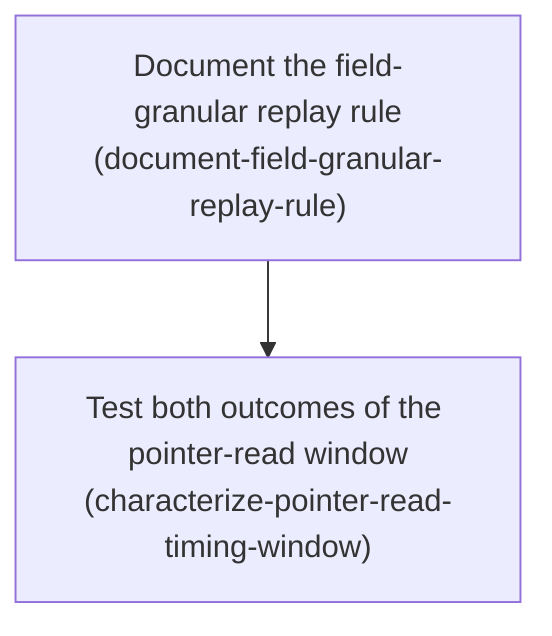

# Horizon 20 — Edit-conflict documentation and characterization

## 🎯 What are we trying to achieve?

Make three things agree about what the dashboard does when two people edit feature flags at the same time: the code, the written explanation of the code, and the project's list of open problems. Right now all three say slightly different things, and one of them — an entry claiming a group of tests fails — has been wrong for four horizons.

Done means: the rule that decides whether a late edit is re-applied is written down next to the function that decides it and matches it exactly; both possible outcomes of a timing window are locked in by tests; the one test that accepts either outcome carries an explanation saying that is deliberate; and the stale bug report is retired with evidence anyone can re-check.

## 🧠 Why does this change need to happen?

When two operators edit the same environment, each submits a change based on the version of the data they last loaded. If someone else publishes first, the second edit is stale. The system sometimes re-applies that stale edit onto the newest data automatically, and sometimes rejects it — and the rule for which happens is more precise than the project's notes claim. The notes say a late edit is re-applied "when the edited feature is unchanged." The code actually compares only *the specific fields that edit writes*. So two people editing different fields of the *same* flag both succeed, which the notes imply is impossible.

Separately, the project's open-problems file has carried an entry since horizon 14 saying a group of tests returns the wrong status code. That was diagnosed and fixed in horizon 16 — by correcting the tests, not the product — but the entry was never retired. It went on to shape the plan for this entire horizon before anyone checked it against the code.

## At a glance

- **Phases:** 2
- **Complexity:** Low — documentation and tests only; no product behaviour changes.
- **Main risk:** the project's own written decision (horizon 16) is looser than the code, so wording written carelessly here would contradict the implementation it is meant to describe.
- **Quality target:** `pnpm verify` (typecheck, lint, unit tests, 100% coverage) and the dashboard LocalStack suite both pass, with no skipped tests and no product-code behaviour change.
- **Testing focus:** characterization tests that genuinely force the branch they claim to test — a test that would still pass with the re-apply path deleted is the failure mode both phases guard against.

---

## Order of work

**1. Document the field-granular replay rule**
↓ *the rule has to be settled and written down before anything else describes it — phase 2's explanatory comment and project-notes entries all restate it*
**2. Test both outcomes of the pointer-read window**

---

### Phase 1 — Document the field-granular replay rule

`Technical ID: document-field-granular-replay-rule` · Flag Editing (dashboard) · domain layer · small blast radius

**Goal** — The function that decides whether a late edit may be re-applied carries a comment stating the rule it actually implements, and the project's decisions file carries the corrected one-sentence version.

**Why** — When two operators edit the same environment, a later edit submitted against an older snapshot is sometimes re-applied automatically onto the newest snapshot instead of being rejected. The function that makes that call compares only the specific fields the edit writes, but the project's written rule says something looser ("the edited feature is unchanged"), which a reader would take to mean a same-feature edit always gets rejected. That mismatch is misleading and is the only wording correction this horizon owes.

**Changes**
- Add a doc comment directly above `canReplayEdit` in `packages/dashboard/src/domain/flag-edit.ts` stating the rule it actually implements: replay is allowed when the fields this edit touches are byte-identical between the base snapshot text and the latest snapshot text — `enabled -> ['enabled']`; `default -> ['type','default']`; `setRules`/`setRollout`/`removeRollout -> ['rules']`; `delete ->` the whole flag; `create ->` the key must still be absent; and replay is refused when either snapshot text fails to parse or the flag was deleted meanwhile.
- In that comment, give the consequence a reader needs: two edits to the SAME flag but DIFFERENT fields both succeed by design, and only an edit whose own touched fields moved gets the 422 Edit Conflict response.
- Append one line to `docs/roadmaps/featuresync/decisions.md` recording the corrected one-sentence rule and stating that it supersedes the earlier, looser "the edited feature is unchanged" wording; reference `packages/dashboard/src/domain/flag-edit.ts` as the authority.
- Change no behaviour: `canReplayEdit`'s implementation, its signature, and every caller stay exactly as they are.

**Files / areas**
- `packages/dashboard/src/domain/flag-edit.ts`
- `docs/roadmaps/featuresync/decisions.md`

**How to verify**
- *Doc comment covers every branch of canReplayEdit* — open `flag-edit.ts` and read the comment directly above `canReplayEdit`; it must name the parse-failure refusal, the deleted-flag refusal, the separate `create` case, the exact touched-field sets, and that comparison is equality of serialized values.
- *Operator-visible consequence spelled out* — the comment states that same-flag/different-field edits both succeed, and that only an edit whose own touched fields moved gets 422.
- *Decisions entry is one sentence, field-granular, and marked superseding* — the new line uses "the fields the edit touches", names the superseded wording, cites the source file, and leaves the horizon-16 line in place.
- *Domain deliverable stays free of transport and infrastructure concerns* — `git diff` shows only added comment lines; the import list is unchanged.
- *Signature and callers untouched* — `git diff --stat` lists only the two files above; `pnpm verify` passes with no test file modified.

**Done when** — `decisions.md` carries a one-sentence field-granular replay rule that matches `canReplayEdit`, with the matching doc comment in place above that function, and every check under *How to verify* passes its bar.

**Depends on** — nothing; can start immediately.

Reference — full rubric

Five dimensions: `branch-coverage-of-doc-comment` (minScore 7), `reader-consequence-stated` (7), `decisions-line-supersedes-old-wording` (7), `domain-layer-purity` (8), `no-caller-or-signature-drift` (8). Full `ruleStatement`, `passCriteria` and `failureExamples` for each are in the roadmap JSON under `phases[0].rubric`.

**Healer hint:** The likeliest miss is a comment that documents only the field-comparison happy path — re-read `canReplayEdit` top to bottom and add one clause per early return (unparseable text, missing/non-object flag, create-key-absent) before touching anything else.

---

### Phase 2 — Test both outcomes of the pointer-read window

`Technical ID: characterize-pointer-read-timing-window` · Flag Editing (dashboard) · application layer · small blast radius

**Goal** — Pin, with deliberate unit tests, the two safe outcomes that occur when a losing edit re-reads the pointer naming the live version after its write lost the race — a fresh read re-applies and publishes (success), a stale read re-applies onto stale text and conflicts (422) — mark the existing tolerant integration assertion as correct and deliberate, and retire the stale horizon-14 blocker on that evidence.

**Why** — When two edits to DIFFERENT flags are submitted against the same base snapshot, one write wins and the other is retried automatically against whatever the pointer says at that instant. If the pointer has already advanced, the retry succeeds; if it has not yet advanced, the retry fails and the operator sees a conflict. Both endings are safe — no published version is lost either way — but only one of them ever shows up in real runs, so it must be forced by a test rather than waited for. Without that, a future developer sees a test that accepts either status and assumes it is sloppy.

**Changes**
- In `packages/dashboard/test/application/edit-feature.test.ts`, add a characterization group that drives `editFeature` with a hand-built, test-local ports object (`editFeature` already takes its ports as an argument, so no production seam is needed).
- Force the FRESH-read branch: the first publish attempt fails as a lost race, and the test ports' `readCurrentVersion` then returns the ALREADY-ADVANCED pointer with the winner's snapshot text; assert `editFeature` returns a success outcome and that the replayed publish carried the advanced expected-current-version.
- Force the STALE-read branch: same lost-race first attempt, but `readCurrentVersion` still returns the OLD pointer and the old snapshot text; assert `editFeature` returns the conflict failure outcome (the same shape the HTTP layer turns into 422) and that it does not loop or publish twice.
- Add an explanatory comment above the tolerant assertion in the different-flags race test in `packages/dashboard/integration/dashboard.localstack.test.ts` naming the two branches, stating the invariants that hold in both (no published version lost, no snapshot above the pointer, disabled-flag count equals the number of successful requests), and stating explicitly that the assertion must NOT be tightened to "both 200" because the outcome is genuinely timing-dependent and a strict assertion would flake under the repo's `retries: 0` policy.
- Make no change to the behaviour of `packages/dashboard/src/application/edit-feature.ts` — it appears here only as the unit under test and must not gain a retry, a new outcome field, or a new error type.
- **Named, non-optional step** (folded here because a project-memory edit is never a phase of its own): mark the 2026-09-19 horizon-14 blocker line in `docs/roadmaps/featuresync/blockers.md` resolved, naming the evidence — the tests themselves were corrected in horizon 16, and the dashboard LocalStack suite passes 13/13 on nine consecutive runs with no flakes.
- **Further named step:** record in `docs/roadmaps/featuresync/discoveries.md` that the 200+422 pair in the different-flags race is a pointer-read timing window rather than a lost-update defect, that both branches hold every invariant, that it is not reachable by a single operator in the browser, and that these characterization tests are where both branches are now pinned. Keep each entry to one fact in 240 characters or fewer.

**Files / areas**
- `packages/dashboard/test/application/edit-feature.test.ts`
- `packages/dashboard/integration/dashboard.localstack.test.ts`
- `packages/dashboard/src/application/edit-feature.ts` (unit under test — not modified)
- `docs/roadmaps/featuresync/blockers.md`
- `docs/roadmaps/featuresync/discoveries.md`

**How to verify**
- *Fresh-read success branch is genuinely forced* — the test asserts the success outcome, the second publish's expected-current-version equals the advanced pointer, and the publish port was called exactly twice; stubbing out the re-apply path makes it fail.
- *Stale-read conflict branch is pinned, including the no-loop guarantee* — the test asserts a failure that is not `invalidInput` (so 422, not 400), that the failure carries the base version, and a publish call count of exactly two; no timers or sleeps.
- *Integration comment marks the tolerance as deliberate and forbids tightening* — the comment names both branches, lists the invariants, says explicitly it must not be narrowed to two 200s, and gives the `retries: 0` reason.
- *No behavioural change to edit-feature and no layer leakage in the tests* — `git diff` of `edit-feature.ts` shows no statement changes; the tests import nothing from `packages/aws` or `src/infrastructure`; no coverage-ignore pragma added.
- *Horizon-14 blocker retired against checkable evidence* — the entry is marked resolved with a date, names the horizon-16 test correction, cites the 13/13-across-nine-runs result, and leaves the original wording readable.
- *Discovery entry is accurate, bounded, and one fact per line* — four facts recorded, each ≤240 characters, none claiming the race was eliminated.

**Done when** — `packages/dashboard/test/application/edit-feature.test.ts` contains passing characterization tests that pin both the fresh-read success outcome and the stale-read conflict outcome, and every check under *How to verify* passes its bar.

**Depends on** — Document the field-granular replay rule.

**Rollback** — Restore the blocker line verbatim from git history if a later run of the dashboard LocalStack suite shows a genuine 200-instead-of-422 failure.

Reference — full rubric

Six dimensions: `fresh-read-branch-forced` (minScore 7), `stale-read-branch-forced` (7), `non-tightening-comment` (7), `product-code-unchanged` (8), `blocker-retired-with-named-evidence` (7), `discovery-entry-accuracy-and-brevity` (7). Full `ruleStatement`, `passCriteria` and `failureExamples` for each are in the roadmap JSON under `phases[1].rubric`.

**Healer hint:** The likeliest miss is a characterization test that would still pass with the replay path removed — assert the second publish's expected-current-version and an exact publish call count in both branches rather than just the outcome kind.

---

## Discovery Findings

| Area | Finding | File | Implication |
|---|---|---|---|
| Defect premise | The horizon-14 blocker was already fixed in horizon 16 by correcting the tests; the suite passes 13/13 on nine consecutive LocalStack runs | `docs/roadmaps/featuresync/blockers.md` | There is no failure to reproduce — the horizon's original premise was false |
| Tolerant assertion | Only ONE test uses a status-set assertion, and it is the different-flags race, not a same-flag one | `packages/dashboard/integration/dashboard.localstack.test.ts` | Scope any test work to that single assertion; the same-flag tests are already deterministic |
| Root cause | Both requests read the pointer at v1; the loser re-reads after its write loses. Reading after the winner's pointer write → replays and publishes (200); reading before → replays on stale text and conflicts (422) | `packages/dashboard/src/application/edit-feature.ts` | Neither response is incorrect; "which one is lying" is a mis-posed question |
| Replay predicate | `canReplayEdit` compares only `touchedFields(edit)`, not the whole feature | `packages/dashboard/src/domain/flag-edit.ts` | The project's written decision is looser than the code — phase 1 exists to fix that |
| Status mapping | Edits throw nothing; `writeStatus` maps success→200, `invalidInput`→400, else→422. No 302 on the edit path | `packages/dashboard/src/infrastructure/http-server.ts` | Any plan text about "302 mapping" or thrown-error status mapping is wrong |
| Error convention | Concrete `Error` subclasses with a literal `name` + `reason` union, matched structurally (never `instanceof`) so the dashboard never loads the aws runtime | `packages/dashboard/src/application/publish-snapshot.ts` | A fix must not add a new exception type at the dashboard layer |
| Publisher CAS | `checkExpectedVersion` early-returns on `undefined`, which `rollback()` and the CLI depend on; `writeNextVersion`/`put` are shared with the segment publisher | `packages/aws/src/infrastructure/s3-snapshot-publisher.ts` | Touching the publisher would break the CLI and widen blast radius into the out-of-scope orphan issue |
| Browser harness | `concurrent-edits.spec.ts` uses an in-memory fake with no S3 and no true parallelism; all five specs are strictly sequential | `packages/dashboard/e2e/concurrent-edits.spec.ts` | Operator-reachability is settled by code trace, not by a new Playwright spec |
| Coverage mechanics | Coverage includes `packages/*/src/**/*.ts` only, at 100%; integration and e2e contribute ZERO coverage | `vitest.config.ts` | No new product-code branch this horizon ⇒ no new coverage obligation |
| Reproduction cost | LocalStack container live, `.env` present, suite runs in ~2.7s with no build step; 9/9 runs showed no variation | `packages/dashboard/integration/dashboard.localstack.test.ts` | Characterization must force the window with a seam, not hunt it by repetition |

## Out of Scope

Carried in the roadmap's `deferred` list (18 entries) — the ten scope exclusions from the analysis plus eight candidates rejected at decomposition. Highlights:

- **A bounded retry making the race deterministically 200+200** — the user explicitly dropped it after a reviewer showed an immediate re-read can land just as early as the first, so determinism would not actually hold.
- **Tightening the tolerant assertion to "both 200"** — the outcome is genuinely timing-dependent; a strict assertion would flake under `retries: 0`.
- **A new error reason, failure kind, or outcome field** — nothing consumes the distinction.
- **A Playwright spec or swapping the browser fixtures to LocalStack** — reachability is already settled by code trace; the fixture swap is separate, larger work.
- **Changing the S3 publisher's compare-and-set** — would break the CLI publish/rollback callers.
- **Orphaned-object cleanup** — storage hygiene with its own blocker.
- **Coverage-repair work** — no product-code branch is added.
- **Re-opening the horizon-16 auto-replay policy** — binding decision; this horizon only corrects how it is described.

## Success Criteria

1. The field-granular replay rule is recorded in `decisions.md` and matches `canReplayEdit`; both branches of the Current Pointer read timing window are pinned by passing unit tests in `packages/dashboard/test/application/edit-feature.test.ts`; the tolerant different-flags race assertion carries a comment marking it correct-by-design and forbidding tightening; the horizon-14 blocker is retired with named, re-checkable evidence; and `pnpm verify` plus the dashboard LocalStack suite pass with no product-code behaviour change and no skipped tests.
2. Document the field-granular replay rule: `decisions.md` carries a one-sentence field-granular Replay-On-Latest rule that matches `canReplayEdit`, with the matching doc comment in place above that function.
3. Test both outcomes of the pointer-read window: `packages/dashboard/test/application/edit-feature.test.ts` contains passing characterization tests that pin both the fresh-read success outcome and the stale-read conflict outcome.

## Alignment Preview

The first preview showed a 4-phase plan including a bounded retry in the edit-replay path. The light critique raised three concerns; the decisive one was that an immediate re-read can land just as early as the first, so "both edits always succeed" would not actually hold and the new strict test could fail intermittently under the repo's `retries: 0` policy.

The user redirected once (1 of a 2-round budget) and **dropped the retry entirely**, reducing the horizon to documentation and characterization with no behavioural change. Stage 3 was re-run under that constraint and returned 3 phases; the third ("Retire the stale edit-conflict blocker") had only project-memory files as its deliverable, so it was folded into phase 2 as a named, non-optional step per the rule that a memory-file edit is never a phase of its own. The user accepted the revised 2-phase preview.

The second light-critique call was skipped: its three concerns were all resolved or explicitly decided by the user, and re-running it would have pushed the run to its call-budget ceiling for little return.

## Quality Gate

- **Path:** Full. Stage 2 skipped (Discovery ran); 0 external materials lifted.
- **Pre-gate mechanical checks:** dependency existence, cycles, layer direction (domain → application), `inputs` ≤ 4, single-artifact `expectedResult`, plain-name check, bookkeeping check, stylesheet check — all passed with **0 patch calls**.
- **Critic:** one iteration. 10 dimensions scored. `blockers: 1 raised, 0 discarded on evidence, 0 downgraded, 1 confirmed`. No verification call was needed — the blocker's quoted evidence resolved and showed the defect directly.
- **Healed:** `success-coverage` (scored 4/7). `successCriteria[0]` had been assembled verbatim from the pre-Discovery `analysis.successDefinition` and still demanded a layer-of-responsibility decision, a fix, and "no status-set assertions" — all of which this horizon defers, so completing every phase would not have satisfied it. Replaced, along with `analysis.objective` and `analysis.successDefinition`. Applied directly by the orchestrator rather than via a healer call, because the critic's `fixProposal` specified the replacement text exactly and left no judgment to make.
- **Accepted debt:** none. The nine passing dimensions scored 7–9 against bars of 6–8. The one advisory note is on `phase-blast-radius` (7/7): phase 2 carries five `filesAffected` and four sub-deliverables, at the edge of one reviewable unit — if it grows during execution, split the integration comment and memory-file retirement into a third phase.
- **Verdict:** passed after one iteration.

## Cost

8 Agent calls against a stated budget of 8–10 for the full path: Stage 1, Stage 1.5 Discovery, Stage 3, Stage 3.4 concerns, Stage 3 re-run (redirect), Stage 3.5, Stage 4, Stage 5 critic. No stage overran. Two calls were avoided deliberately: the second Stage 3.4 concerns call after the redirect, and the Stage 5 healer call.

## Full analysis

**Domain shape:** `business` — the objective is about the rules governing when one operator's edit legitimately overwrites another's (optimistic concurrency, version lineage, conflict semantics over versioned snapshots), which are domain rules an operator would recognize, not build or CI machinery. The critic independently re-scored this at 8/10 by reading the phases rather than trusting the claim.

**Ubiquitous language**

| Term | Meaning |
|---|---|
| Same-Base Edit | A dashboard feature edit submitted against a specific base snapshot version, where another edit may have published since that base was read. |
| Edit Conflict | The outcome in which a same-base edit is rejected because the fields it touches changed since its base, surfaced to the operator as 422 CONFLICT. |
| Replay-On-Latest | The behaviour in edit-feature that re-applies a stale edit onto the latest snapshot and publishes again when the fields the edit touches are unchanged since base. |
| Expected Current Version | The compare-and-set precondition passed to the S3 snapshot publisher, which must match the Current Pointer or the write throws CONFLICT before any PUT. |
| Current Pointer | The per-environment `current.json` object naming the live snapshot version; its value after a race is the ground truth for which edit actually won. |
| Characterization | The recorded, evidence-backed statement of which observed response happens in which branch and why both are safe. |
| User-Reachable Path | A sequence of actions a real operator can perform in the browser dashboard, as opposed to a request pattern only the integration harness can produce. |
| Regression Proof | The deterministic unit test that pins a branch of the timing window and fails if that branch's behaviour changes. |
| Flag Editing | The bounded context covering how a dashboard operator changes a feature flag and how those changes are reconciled against concurrent changes. |

**Assumptions** — the LocalStack harness and a working auth token are available locally (confirmed live during Discovery); the suspect code surface is `edit-feature.ts` and `flag-edit.ts`, with the publisher deliberately untouched; the horizon-16 auto-replay decision and the horizon-12 linear-history rule remain binding; the coverage gate applies to `packages/*/src/**/*.ts` only.

**Risks**

1. *(Materialized and resolved)* The horizon-16 decision deliberately makes some stale edits return 200, so part of what the horizon-14 blocker called a defect was correct-by-decision behaviour plus a stale test expectation. Discovery confirmed this and the horizon was re-scoped around it.
2. The concurrent case is genuinely non-deterministic against LocalStack, so forcing a single asserted outcome would produce a test that flakes or passes for the wrong reason — which is exactly why the retry and the tightened assertion were dropped.
3. Characterization may feel like a failed horizon because nothing is "fixed", inviting a fabricated fix. Guarded by making documentation and evidence the named deliverables.
4. A fix inside the replay path risks re-entering it repeatedly — deferred, not taken.
5. Moving conflict detection into the publisher would break the CLI publish/rollback callers that pass no expected-current-version — deferred, not taken.
6. The 100% coverage gate can force coverage-driven rather than behaviour-driven test design — neutralized this horizon, since no product-code branch is added.
7. LocalStack flakiness could make reproduction inconclusive — mitigated: 9/9 runs were stable and characterization uses a test seam rather than repetition.
8. Touching shared publisher code would silently widen blast radius into the segment publisher — avoided by construction.
