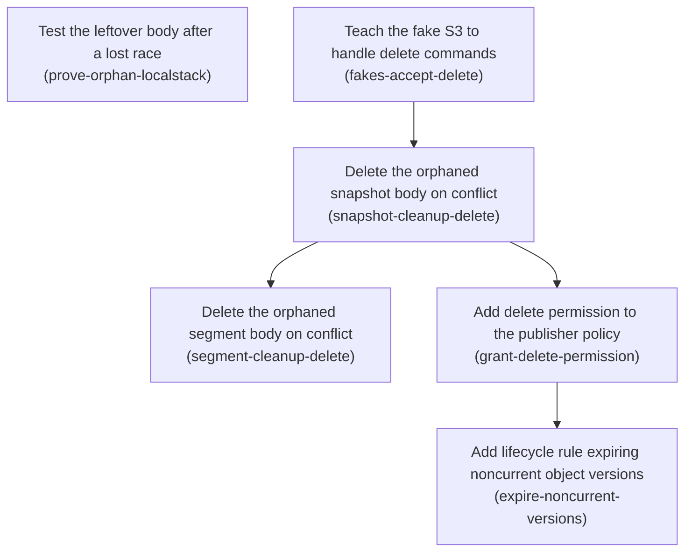

# Horizon 22 — Clean up the orphaned S3 object left by a lost publish race

## Executive Summary

### 🎯 What are we trying to achieve?

When two people publish to FeatureSync at the same time, only one of them can win. The loser has already uploaded its snapshot file before it finds out it lost — and that file then sits in the S3 bucket forever. Nothing ever reads it and nothing ever removes it, so the bucket quietly fills up with files nobody can reach. This horizon makes the losing publisher clean up after itself, and adds a bucket rule so the storage is genuinely reclaimed rather than merely hidden.

### 🧠 Why does this change need to happen?

The publisher writes in two steps: first it uploads the new version's file, then it moves a small "current" marker to point at it. That second step is the one that can lose a race. Today, when it loses, the code reports the conflict correctly but never deletes the file it just uploaded. Nobody has ever actually demonstrated this leak — it has been sitting in the project's open-questions list as an inference from reading the code — so this horizon proves it first, then fixes it. A complication found during investigation: the bucket keeps old versions of every file, which means an ordinary delete only hides an object rather than removing its bytes. The fix therefore has two halves: the publisher deletes the leftover, and a bucket lifecycle rule expires the hidden versions.

### At a glance

- **Phases:** 6
- **Complexity:** Medium — small, surgical code edits, but they touch a concurrency path and widen an IAM policy
- **Main risk:** Deleting the orphan body races a concurrent reader or a concurrent publisher that has already resolved that version number: a delete of an object another in-flight publish believes it owns would be a correctness regression worse than the leak.
- **Quality target:** unchanged observable contract for the CLI and dashboard; 100% line/branch/function/statement coverage maintained
- **Testing focus:** best-effort failure paths (the cleanup delete itself failing), correct key targeting, and absence assertions that would fail if the fix were reverted

---

## Implementation plan

### Order of work

1. **Test the leftover body after a lost race** — can start immediately — nothing depends on it
2. **Teach the fake S3 to handle delete commands** — can start immediately — nothing depends on it
3. **Delete the orphaned snapshot body on conflict** — follows Teach the fake S3 to handle delete commands
4. **Delete the orphaned segment body on conflict** — follows Delete the orphaned snapshot body on conflict
5. **Add delete permission to the publisher policy** — follows Delete the orphaned snapshot body on conflict
6. **Add lifecycle rule expiring noncurrent object versions** — follows Add delete permission to the publisher policy

Note that phases 1 and 2 are independent of each other — the proof test and the test-double change can land in either order, or in parallel.

### Phase 1 — Test the leftover body after a lost race

Technical ID: `prove-orphan-localstack` · FeatureSync S3 snapshot publisher · infrastructure · small blast radius

**Goal** — Prove with a real LocalStack test that when a snapshot publish loses the Current Pointer conditional write (the IfMatch PUT of <environment>/current.json returning 412), the version body object it already wrote (<environment>/snapshots/<n>.json) is still present in the bucket afterwards. A passing LocalStack integration test in packages/aws/integration/s3-snapshot-publisher.localstack.test.ts that asserts an orphaned version body object remains after a lost pointer race.

**Why** — Nobody has ever demonstrated this leak; it is only inferred from reading the code and is recorded as an open question in the project's blockers file. Proving the leftover object exists before writing any fix stops us building a cleanup for a problem that may not occur, and gives us a test that will later show the fix works.

**Changes**

- In the existing 'lets exactly one of two concurrent publishes win' test, after Promise.allSettled, branch on the rejected publish's reason: when it is CONFLICT (the pointer race), assert with listKeys(bucket)/HeadObjectCommand that a snapshots/<n>.json body object exists that the current pointer does NOT point at.
- If the two-racer test cannot deterministically reach the CONFLICT branch, add a separate test that forces it: publish once to establish a pointer, then run a publish whose pointer PUT is guaranteed to fail its IfMatch because another publish moved the pointer in between, and assert the leftover body key.
- Name the test so it reads as a characterization of current (buggy) behaviour, e.g. 'leaves the version body object behind when the pointer write loses'.

**Files / areas**

- `packages/aws/integration/s3-snapshot-publisher.localstack.test.ts`

**How to verify**

- *Leftover body object is observed, not assumed* — The test body calls listKeys(bucket) or HeadObjectCommand after the race and asserts on a snapshots/<n>.json key
- *The CONFLICT branch is actually reached, not skipped* — Run the test file at least twice against LocalStack and confirm the orphan assertions execute both times (e.g. via a deliberate temporary failure inside the branch, or an expect.assertions/explicit count)
- *Reads as a characterization of current buggy behaviour* — The test title contains words to the effect of 'leaves the version body object behind' / 'orphan'

**Done when** — A passing LocalStack integration test in packages/aws/integration/s3-snapshot-publisher.localstack.test.ts that asserts an orphaned version body object remains after a lost pointer race. …and every check under *How to verify* passes its bar.

**Depends on** — nothing — can start immediately

**Rollback** — Revert the test file; no production code or infrastructure is touched.

<b>Reference</b> — full rubric

| Dimension | Rule | Pass criteria | Failure examples | minScore |
|---|---|---|---|---|
| `orphan-actually-observed` Leftover body object is observed, not assumed | The new/extended LocalStack test must assert on the real bucket contents that a snapshots/<n>.json object exists which the current pointer does not reference; 10 = the assertion names the exact orphan key and cross-checks it against the pointer's version field, 8 = it asserts an unreferenced snapshots key exists via listKeys/HeadObject, minScore = some bucket-content assertion beyond the rejection reason. | • The test body calls listKeys(bucket) or HeadObjectCommand after the race and asserts on a snapshots/<n>.json key • The test reads <environment>/current.json and asserts the orphan key's version is NOT the version in that pointer • The assertion fails if the orphan is absent (verify by temporarily asserting the opposite, or by the key being computed rather than hard-coded from a passing run) | • The test only asserts the rejected publish's reason is CONFLICT and adds a comment that the body is left behind • listKeys is called and the returned array length is asserted (e.g. toHaveLength(3)) without identifying which key is the orphan, so the same count passes after the fix too • The orphan key is hard-coded as 'production/snapshots/2.json' while the pointer is never read, so the test passes even if the pointer points at 2 | 7 |
| `conflict-branch-determinism` The CONFLICT branch is actually reached, not skipped | The test must reach the lost-pointer-race branch reliably rather than silently passing when the loser fails with VERSION_EXISTS; 10 = the race is forced deterministically (sequenced publishes) so every run exercises the branch, 8 = the test branches on the reason and the run demonstrably lands in CONFLICT, minScore = the CONFLICT path is exercised on a normal run and cannot pass vacuously. | • Run the test file at least twice against LocalStack and confirm the orphan assertions execute both times (e.g. via a deliberate temporary failure inside the branch, or an expect.assertions/explicit count) • If the code branches on the rejection reason, there is an assertion that the reason set actually included CONFLICT — not just an `if (reason === 'CONFLICT')` whose else-path passes silently • The test does not pass when the loser rejects with VERSION_EXISTS only | • `if (reason === 'CONFLICT') { expect(...) }` with no else, so a VERSION_EXISTS-only run is a green test asserting nothing • Two Promise.all publishes fired identically and assumed to race; on a fast LocalStack the loser consistently fails at the IfNoneMatch body PUT and the orphan code never runs • Retrying the whole race in a loop until CONFLICT appears, with no bound, making the suite hang on a machine where it never does | 7 |
| `characterization-framing` Reads as a characterization of current buggy behaviour | The test must be named and written so a later phase flips it rather than deletes it; 10 = name states the current wrong behaviour AND a comment points at the phase that will invert the assertion, 8 = the name plainly describes the leftover, minScore = the name mentions the leftover body rather than generic 'concurrency'. | • The test title contains words to the effect of 'leaves the version body object behind' / 'orphan' • A reader can tell from the title alone that the asserted state is undesired • No production source file under packages/*/src was modified by this phase (check `git diff --name-only`) | • Titled 'handles concurrent publishes correctly', so when the cleanup lands nobody knows this assertion is meant to invert • The proof is added as a bare console.log of listKeys output plus an eyeball check, with no expect() • A helper added for the test is placed in packages/aws/src rather than the integration folder, pulling untested lines into the coverage gate | 7 |

*Healer hint:* The usual failure is a vacuous conditional assertion that never runs because the losing publish failed with VERSION_EXISTS — force the race by publishing sequentially with a stale etag so the IfMatch pointer PUT is guaranteed to 412.

### Phase 2 — Teach the fake S3 to handle delete commands

Technical ID: `fakes-accept-delete` · FeatureSync S3 publisher unit-test doubles · infrastructure · small blast radius

**Goal** — Extend the unit-test fake S3 clients so they accept DeleteObjectCommand — removing the key from their in-memory object map — and can be told to make a specific delete fail. packages/aws/test/infrastructure/fake-s3.ts handles DeleteObjectCommand and supports a deleteErrors map, with the existing publisher unit suites still green.

**Why** — The unit-test fakes today reject every S3 command that is not Get, Head or Put with 'unexpected S3 command'. The moment the publishers issue a delete, all existing publisher unit tests turn red. The fakes must learn about deletes first, and must also be able to simulate a delete that itself fails, because the project enforces 100% branch coverage and the cleanup's own failure path is a branch.

**Changes**

- Add a DeleteObjectCommand branch to the fake dispatch that deletes the key from the in-memory objects map and resolves with an empty result.
- Add an optional deleteErrors map (key -> error) alongside the existing putErrors/headErrors, so a test can force one delete to reject.
- Keep the 'unexpected S3 command' guard for every other command type.

**Files / areas**

- `packages/aws/test/infrastructure/fake-s3.ts`
- `packages/aws/test/infrastructure/s3-snapshot-publisher.test.ts`
- `packages/aws/test/infrastructure/s3-segment-publisher.test.ts`

**How to verify**

- *DeleteObjectCommand actually removes the key* — After a DeleteObjectCommand for key K, a GetObjectCommand/HeadObjectCommand for K in the same fake rejects as not-found, not returns stale content
- *A specific delete can be forced to fail* — fake-s3.ts exposes a deleteErrors parameter of the same map shape as the existing putErrors
- *The unexpected-command guard still catches everything else* — The dispatch still ends in a throw/reject for any command type that is not Get/Head/Put/Delete
- *New fake code does not break the coverage gate* — Run the repo's coverage command and confirm the line/branch/function/statement thresholds still report 100% over packages/*/src/**/*.ts

**Done when** — packages/aws/test/infrastructure/fake-s3.ts handles DeleteObjectCommand and supports a deleteErrors map, with the existing publisher unit suites still green. …and every check under *How to verify* passes its bar.

**Depends on** — nothing — can start immediately

**Rollback** — Revert the fake; test-only change with no production impact.

<b>Reference</b> — full rubric

| Dimension | Rule | Pass criteria | Failure examples | minScore |
|---|---|---|---|---|
| `delete-mutates-store` DeleteObjectCommand actually removes the key | The fake must model delete as a real mutation of its in-memory object map so a later Get/Head of that key behaves as missing; 10 = deleting an absent key also resolves (matching S3) and that is covered by a test, 8 = delete removes the key and resolves empty, minScore = the key is removed and a subsequent Head reports missing. | • After a DeleteObjectCommand for key K, a GetObjectCommand/HeadObjectCommand for K in the same fake rejects as not-found, not returns stale content • DeleteObjectCommand resolves (does not reject) when the key was never present • The delete branch reads the key from the command input rather than from a closure-captured constant | • The branch returns `{}` without touching the objects map, so the publisher's delete looks successful but the LocalStack-mirroring unit assertions can't distinguish delete-called from delete-effective • Delete throws on a missing key because the fake reuses the Get branch's not-found path, so a double-cleanup test fails for the wrong reason • The fake records deleted keys in a separate `deleted` array while leaving the object in `objects`, so tests assert on the array and never notice the map is stale | 7 |
| `delete-failure-injection` A specific delete can be forced to fail | A deleteErrors map keyed by object key must let one delete reject while other deletes still succeed; 10 = it mirrors putErrors/headErrors exactly in shape and optionality so call sites read identically, 8 = a per-key error map exists and is honoured, minScore = a test can make exactly one delete reject. | • fake-s3.ts exposes a deleteErrors parameter of the same map shape as the existing putErrors • A test that sets deleteErrors for key A observes a rejection for A and a successful delete for key B in the same fake instance • The parameter is optional — existing call sites that pass only objects/putErrors still compile and run | • A single boolean `failDelete` flag is added, so the delete-fails branch cannot be distinguished per key and future multi-delete tests can't target one • deleteErrors is added as a required positional parameter before headErrors, forcing edits to every existing call site and silently shifting arguments • The error is thrown before the key is removed in one fake and after in the other, so the two publisher suites disagree about post-failure state | 7 |
| `unknown-command-guard-intact` The unexpected-command guard still catches everything else | Adding the delete branch must not widen the fake into a permissive default; 10 = a test asserts an unrelated command (e.g. ListObjectsV2Command) still rejects with 'unexpected S3 command', 8 = the guard is visibly the final else, minScore = no catch-all success path was introduced. | • The dispatch still ends in a throw/reject for any command type that is not Get/Head/Put/Delete • grep the fake for a `return {}` or `resolve({})` that is reachable for arbitrary commands — there must be none • Both packages/aws/test/infrastructure/s3-snapshot-publisher.test.ts and s3-segment-publisher.test.ts pass unchanged after the fake edit | • The delete branch is added as `if (!(cmd instanceof PutObjectCommand)) return {}` style shortcut, quietly making every future command a silent no-op • instanceof DeleteObjectCommand is checked after a broad `'Key' in cmd.input` branch, so deletes fall into the Get path • Only one of the two fakes is updated because the second publisher suite doesn't delete yet, leaving the next phase to discover it | 7 |
| `fake-lines-stay-covered` New fake code does not break the coverage gate | Every new branch in the fake must be exercised by the suite that ships with this phase; 10 = both the success and the injected-failure delete paths are hit by a test added in this very phase, 8 = they are hit by the end of the phase's test run, minScore = `npm test` coverage over packages/*/src stays at 100% and no new uncovered branch is introduced anywhere the gate measures. | • Run the repo's coverage command and confirm the line/branch/function/statement thresholds still report 100% over packages/*/src/**/*.ts • No production file under packages/aws/src was changed in this phase (`git diff --name-only`) • If the fake lives under a path the coverage config includes, its new delete and deleteErrors branches are both executed by at least one test | • deleteErrors is added but no test sets it yet ('the next phase will'), leaving a dead branch that trips the gate or rots unverified • A delete branch is added to src-side helper code rather than the test double, pulling an uncovered line into the measured set • Coverage is checked only for the aws package while the root gate aggregates all packages | 7 |

*Healer hint:* Most likely miss is adding deleteErrors with no test that actually triggers it in this phase — add a two-line fake-level test forcing one key's delete to reject before moving on.

### Phase 3 — Delete the orphaned snapshot body on conflict

Technical ID: `snapshot-cleanup-delete` · FeatureSync S3 snapshot publisher · infrastructure · medium blast radius

**Goal** — In the snapshot publisher's writeNextVersion, when the Current Pointer PUT fails, attempt a best-effort DeleteObject of the version body object just written, then rethrow the original S3PublishError with reason CONFLICT and key <environment>/current.json unchanged. packages/aws/src/infrastructure/s3-snapshot-publisher.ts performs a best-effort delete of the orphaned version body when the pointer write loses, with full unit-test coverage of both the success and delete-failure branches.

**Why** — This is the one place in the snapshot publisher where the leaked object's key is still in hand at the moment the race is lost, and it covers both publish and rollback. Best-effort means a failure of the cleanup delete itself is swallowed, so callers (the CLI and the dashboard) still see exactly the same error they see today and their behaviour does not change.

**Changes**

- Wrap the writePointer call in writeNextVersion in try/catch; in the catch, issue DeleteObjectCommand for the snapshot body key inside its own try/catch that swallows any error, then rethrow the caught pointer error untouched.
- Do not change the publisher's options shape, return type, error classes or reason union, and leave resolveNextVersion/isLeftover probing intact.
- Add unit tests under packages/aws/test/infrastructure/ for: pointer PUT fails and the body key is deleted; pointer PUT fails and the cleanup delete also fails, yet the caller still receives CONFLICT on <environment>/current.json; the pre-write CONFLICT from checkExpectedVersion issues no delete.
- Record the chosen strategy in docs/roadmaps/featuresync/decisions.md as a line that explicitly supersedes the horizon-4 decision about orphaned snapshots being fixed by hand.

**Files / areas**

- `packages/aws/src/infrastructure/s3-snapshot-publisher.ts`
- `packages/aws/test/infrastructure/s3-snapshot-publisher.test.ts`
- `docs/roadmaps/featuresync/decisions.md`

**How to verify**

- *Cleanup fires only where an orphan can exist* — In s3-snapshot-publisher.ts the try block contains the pointer write call and nothing else — not the body PUT, not resolveNextVersion
- *The original CONFLICT reaches the caller untouched* — A test where the delete succeeds asserts the rejection is reason CONFLICT with key '<env>/current.json'
- *Every new branch has a unit test, including the swallow* — Run the repo coverage command; line, branch, function and statement coverage over packages/*/src/**/*.ts is still 100%
- *resolveNextVersion / isLeftover still skip old leftovers* — `git diff` shows no edits to resolveNextVersion, isLeftover, or MAX_VERSION_PROBES
- *decisions.md explicitly supersedes the horizon-4 line* — docs/roadmaps/featuresync/decisions.md contains a new line referencing the horizon-4 decision about orphaned snapshots and marking it superseded

**Done when** — packages/aws/src/infrastructure/s3-snapshot-publisher.ts performs a best-effort delete of the orphaned version body when the pointer write loses, with full unit-test coverage of both the success and delete-failure branches. …and every check under *How to verify* passes its bar.

**Depends on** — Teach the fake S3 to handle delete commands

**Rollback** — Revert the try/catch in writeNextVersion and the accompanying tests; the publisher returns to leaving the orphan behind, which is the current behaviour.

<b>Reference</b> — full rubric

| Dimension | Rule | Pass criteria | Failure examples | minScore |
|---|---|---|---|---|
| `cleanup-scoped-to-pointer-failure` Cleanup fires only where an orphan can exist | The delete must be attached specifically to the writePointer failure inside writeNextVersion, never to S3PublishError CONFLICT generally; 10 = a test proves the pre-write checkExpectedVersion CONFLICT issues zero S3 commands after readPointer, 8 = the try/catch wraps only the pointer call, minScore = no delete is issued on a conflict raised before the body PUT. | • In s3-snapshot-publisher.ts the try block contains the pointer write call and nothing else — not the body PUT, not resolveNextVersion • A unit test triggers the expectedCurrentVersion mismatch conflict and asserts the fake received no DeleteObjectCommand • A unit test where the body PUT itself fails with VERSION_EXISTS asserts no delete is issued (nothing was written to delete) | • The try wraps the whole tail of writeNextVersion including the body PUT, so a VERSION_EXISTS failure deletes a key that belongs to another, winning writer • The catch matches on `error instanceof S3PublishError && error.reason === 'CONFLICT'` and is placed in publish(), so the pre-write conflict path also issues a delete of a never-written key • The delete targets the pointer key (<env>/current.json) instead of the snapshot body key, because both were in scope in the catch | 8 |
| `error-passthrough-unchanged` The original CONFLICT reaches the caller untouched | The caught pointer error must be rethrown as the same object, with reason CONFLICT and key <environment>/current.json, whether or not the cleanup delete succeeded; 10 = a test asserts object identity (toBe) of the rethrown error and the cleanup failure's own error is proven not to surface anywhere, 8 = reason and key are asserted in both branches, minScore = both branches yield CONFLICT on the pointer key. | • A test where the delete succeeds asserts the rejection is reason CONFLICT with key '<env>/current.json' • A test where deleteErrors makes the cleanup delete reject asserts the SAME reason and key — the delete's error must not replace or wrap it • The publisher's exported options type, return type, error classes and reason union string literals are byte-identical to before (`git diff` shows no change to the type declarations) | • The cleanup uses `await` outside its inner try, so a delete failure rejects with a REQUEST_FAILED on the snapshots key and the CLI's exit code changes • The rethrow is `throw new S3PublishError('CONFLICT', key, error)` — right reason and key but a new instance, losing the original cause chain callers may inspect • A new reason like 'CLEANUP_FAILED' is added to the union 'for observability', breaking the dashboard's structural binding | 8 |
| `both-branches-unit-covered` Every new branch has a unit test, including the swallow | The cleanup's success path AND its own failure path must both be covered by unit tests in packages/aws/test/infrastructure/, since integration tests contribute zero coverage; 10 = the delete's target key is asserted (not just that a delete happened) in the success test, 8 = both branches are covered and pass, minScore = coverage over packages/*/src remains 100% on all four metrics. | • Run the repo coverage command; line, branch, function and statement coverage over packages/*/src/**/*.ts is still 100% • A unit test asserts the fake's object map no longer contains the snapshot body key after the conflict • A separate unit test sets deleteErrors for that body key and still expects a CONFLICT rejection • The new tests live under packages/aws/test/infrastructure/s3-snapshot-publisher.test.ts, not in the integration folder | • The delete-fails branch is covered only by the LocalStack test, which contributes no coverage, so the gate drops below 100% on branches • The success test asserts `expect(deleteCalled).toBe(true)` without checking which key, so a bug deleting the pointer still passes • An `if (key !== undefined)` guard is added around the delete for type-narrowing and its false arm is never exercised | 8 |
| `version-probe-preserved` resolveNextVersion / isLeftover still skip old leftovers | The forward HeadObject probe and its leftover-skip logic must remain functional, because pre-existing orphans from before this fix still exist in real buckets; 10 = an existing or added test proves a stale leftover body is still skipped rather than causing VERSION_EXISTS, 8 = the probe code and its tests are untouched and green, minScore = no probe behaviour changed. | • `git diff` shows no edits to resolveNextVersion, isLeftover, or MAX_VERSION_PROBES • The existing tests covering the leftover-skip and VERSION_PROBE_LIMIT paths still pass unmodified • A publish into a bucket that already contains a stale snapshots/<n>.json still succeeds by skipping ahead | • The probe is deleted as 'no longer needed now that we clean up', stranding every orphan created before this deploy • isLeftover is relaxed to treat any existing body as a leftover, so a concurrent winner's body gets overwritten • An existing leftover-skip test is edited to match new behaviour instead of the behaviour being preserved | 7 |
| `decision-record-supersedes` decisions.md explicitly supersedes the horizon-4 line | The decision record must name the old 'fixed by hand' decision and state it is superseded, plus name the chosen strategy (active best-effort delete + lifecycle expiry); 10 = it also records why best-effort (caller contract must not change) and notes bucket versioning, 8 = supersession and strategy are both explicit, minScore = a reader of decisions.md cannot come away believing manual cleanup is still the policy. | • docs/roadmaps/featuresync/decisions.md contains a new line referencing the horizon-4 decision about orphaned snapshots and marking it superseded • The new line names both halves of the strategy: the best-effort delete and the noncurrent-version lifecycle rule • The old horizon-4 line is left in place (history preserved), not silently rewritten | • A new decision is appended describing the delete but never mentioning horizon 4, leaving two contradictory entries for a future reader • The horizon-4 line is edited in place to say the opposite, erasing the record that behaviour changed • Only the delete is recorded, so the lifecycle rule added two phases later looks unmotivated | 7 |

*Healer hint:* The likeliest failure is the cleanup's inner catch not fully swallowing — put the DeleteObjectCommand in its own try/catch with an empty catch body inside the outer catch, and assert in a test that a rejecting delete still surfaces CONFLICT on current.json.

### Phase 4 — Delete the orphaned segment body on conflict

Technical ID: `segment-cleanup-delete` · FeatureSync S3 segment publisher · infrastructure · medium blast radius

**Goal** — Apply the same best-effort delete to the segment publisher: when its segment pointer PUT fails, delete the segment version body object it just wrote and rethrow the original S3SegmentPublishError with reason CONFLICT unchanged. packages/aws/src/infrastructure/s3-segment-publisher.ts performs a best-effort delete of the orphaned segment version body when its pointer write loses, with unit coverage of both branches.

**Why** — The segment publisher has the identical leak on its own code path. It has a separate error class and its own put() helper, which must stay as they are, so the same short pattern is applied locally rather than by merging the two publishers.

**Changes**

- Wrap the segment pointer PUT in try/catch; on failure issue DeleteObjectCommand for pointer.objectKey inside a swallowing try/catch, then rethrow the original error.
- Leave S3SegmentPublishError, its reason union, the put() helper and the { bucket, client? } options shape untouched.
- Add unit tests for delete-succeeds and delete-fails branches, asserting the caller still receives CONFLICT.
- Extend the existing concurrent-publish LocalStack test to assert no orphaned segment body remains for the losing writer.

**Files / areas**

- `packages/aws/src/infrastructure/s3-segment-publisher.ts`
- `packages/aws/test/infrastructure/s3-segment-publisher.test.ts`
- `packages/aws/integration/s3-segment-publisher.localstack.test.ts`

**How to verify**

- *The deleted key is the segment version body, not the pointer* — A unit test asserts the fake's map still contains the segment pointer key after the failure, and no longer contains the versioned body key
- *No unification with the snapshot publisher* — `git diff packages/aws/src` shows no new shared module imported by both publishers, and no change to S3PublishError/S3SegmentPublishError definitions
- *Both segment cleanup branches have unit tests* — Coverage over packages/*/src/**/*.ts reports 100% on lines, branches, functions and statements after this phase
- *LocalStack test proves the orphan is now gone* — The integration test asserts a HeadObjectCommand for the loser's segment body key rejects with httpStatusCode 404, or that listKeys contains no unreferenced segments/<key>/<n>.json

**Done when** — packages/aws/src/infrastructure/s3-segment-publisher.ts performs a best-effort delete of the orphaned segment version body when its pointer write loses, with unit coverage of both branches. …and every check under *How to verify* passes its bar.

**Depends on** — Delete the orphaned snapshot body on conflict

**Rollback** — Revert the try/catch and tests in the segment publisher; behaviour returns to today's leak.

<b>Reference</b> — full rubric

| Dimension | Rule | Pass criteria | Failure examples | minScore |
|---|---|---|---|---|
| `segment-body-key-targeted` The deleted key is the segment version body, not the pointer | On segment pointer-PUT failure the delete must target pointer.objectKey (<env>/segments/<key>/<n>.json), never segmentPointerKeyFor's current.json; 10 = a test asserts the exact orphan key string including the segment key and version, 8 = the test asserts the body key is gone and the pointer key survives, minScore = the correct key is deleted. | • A unit test asserts the fake's map still contains the segment pointer key after the failure, and no longer contains the versioned body key • The deleted key in src is read from the already-built pointer object, not re-derived by string concatenation in the catch • A segment key containing a character that needs encoding (e.g. a nested-looking key) still produces the same key that was written | • The catch rebuilds the key with template literals and drops the environment prefix, so the delete 404s silently and the orphan stays (best-effort hides it) • The delete targets segmentPointerKeyFor(...), wiping the winning writer's current pointer and making the segment unreadable • The test asserts only `objects` shrank by one entry, which also passes if the wrong key was removed | 8 |
| `separate-publisher-kept-separate` No unification with the snapshot publisher | S3SegmentPublishError, its narrower reason union, the segment put() helper and the { bucket, client? } options must be unchanged, with the cleanup pattern repeated locally; 10 = the diff is confined to s3-segment-publisher.ts's pointer-write site plus tests, 8 = no shared abstraction was introduced across the two publishers, minScore = the two error classes and put() helpers still exist independently. | • `git diff packages/aws/src` shows no new shared module imported by both publishers, and no change to S3PublishError/S3SegmentPublishError definitions • The segment publisher's exported options type and its publish() return type (SegmentPointer) are unchanged • The segment reason union has no new member | • A tidy `deleteQuietly(client, bucket, key)` helper is extracted into a new shared file and both publishers are refactored to use it — clean-looking, but it couples two deliberately separate contracts and expands the diff • The segment put() signature gains an onCleanupKey parameter to route the delete, changing an internal contract other tests assert on • S3SegmentPublishError is made to extend S3PublishError 'to reduce duplication', widening the segment reason union at the type level | 8 |
| `segment-branches-unit-covered` Both segment cleanup branches have unit tests | Delete-succeeds and delete-itself-fails must each have a unit test in packages/aws/test/infrastructure/s3-segment-publisher.test.ts, since the LocalStack test contributes no coverage; 10 = a test also covers the first-ever publish path (IfNoneMatch pointer, current === undefined) failing and cleaning up, 8 = both branches covered, minScore = 100% coverage over packages/*/src is maintained. | • Coverage over packages/*/src/**/*.ts reports 100% on lines, branches, functions and statements after this phase • A test with deleteErrors set on the segment body key still expects reason CONFLICT • A test asserts the caller's rejection is unchanged in the current === undefined case (pointer written with IfNoneMatch) as well as the IfMatch case | • Only the IfMatch branch is tested because the first-publish path 'can't conflict' — but its IfNoneMatch pointer PUT can also fail, leaving the new branch's other arm uncovered • The delete-fails test asserts `.rejects.toThrow()` without checking the reason, so a swapped error passes • Both branches are covered only in the LocalStack file, which the coverage gate ignores | 8 |
| `segment-localstack-absence-proof` LocalStack test proves the orphan is now gone | The existing concurrent segment-publish integration test must assert the loser left no body object behind; 10 = it asserts the exact expected key set under <env>/segments/<key>/ so an extra file of any name fails it, 8 = it HeadObjects the loser's body key and expects a 404, minScore = an absence assertion exists that would fail if the cleanup were reverted. | • The integration test asserts a HeadObjectCommand for the loser's segment body key rejects with httpStatusCode 404, or that listKeys contains no unreferenced segments/<key>/<n>.json • Reverting the src change makes this integration test fail (check once locally) • The assertion only runs when the loser actually failed at the pointer write, and that case is reached rather than silently skipped | • The test asserts only the surviving pointer's version number, as today, and the added comment claims the orphan is gone • listKeys length is asserted, which passes both before and after the fix because the delete marker keeps list output stable in a versioned bucket only under some settings • The absence check is wrapped in an if-reason guard that never fires, making it a green no-op | 7 |

*Healer hint:* Most likely slip is rebuilding the orphan key by hand in the catch and getting the prefix wrong — reuse the pointer.objectKey value that was passed to the body PUT, and assert that exact string in the unit test.

### Phase 5 — Add delete permission to the publisher policy

Technical ID: `grant-delete-permission` · FeatureSync deployment stack · infrastructure · small blast radius

**Goal** — Extend the publisher IAM statement in the deployment template so the publisher role may delete objects under its own environment prefix, and update the policy assertion test. packages/deploy/template/featuresync-stack.json grants the publisher delete actions on its environment prefix, asserted by the updated stack-policies test.

**Why** — The publisher role today may only get, list and put objects. Without a delete permission the new cleanup delete would always fail in a real deployment (silently, because it is best-effort), so the leak would persist in production even though the code is correct.

**Changes**

- Add s3:DeleteObject and s3:DeleteObjectVersion to the Action array of the existing ReadWriteEnvironmentKeys statement, which is already scoped to ${SnapshotBucket.Arn}/${Environment}/*.
- Do not add a fourth statement, so the positional destructure in the existing test stays valid.
- Update the sorted actions toEqual assertion in packages/deploy/test/stack-policies.test.ts to match.

**Files / areas**

- `packages/deploy/template/featuresync-stack.json`
- `packages/deploy/test/stack-policies.test.ts`

**How to verify**

- *Both delete actions on the prefix-scoped statement* — In packages/deploy/template/featuresync-stack.json the ReadWriteEnvironmentKeys Action array contains both 's3:DeleteObject' and 's3:DeleteObjectVersion'
- *No fourth statement — positional test stays valid* — The PublisherPolicy statement list still has exactly 3 entries, with Sids in the original order
- *The sorted-actions assertion matches the new reality* — The assertion is still toEqual on a complete array, not toContain / arrayContaining / expect.any

**Done when** — packages/deploy/template/featuresync-stack.json grants the publisher delete actions on its environment prefix, asserted by the updated stack-policies test. …and every check under *How to verify* passes its bar.

**Depends on** — Delete the orphaned snapshot body on conflict

**Rollback** — Remove the added actions from the template and revert the test assertion; the cleanup delete then fails harmlessly and the old leak resumes.

<b>Reference</b> — full rubric

| Dimension | Rule | Pass criteria | Failure examples | minScore |
|---|---|---|---|---|
| `delete-actions-present-and-scoped` Both delete actions on the prefix-scoped statement | s3:DeleteObject and s3:DeleteObjectVersion must be added to the existing ReadWriteEnvironmentKeys statement whose Resource is ${SnapshotBucket.Arn}/${Environment}/*; 10 = a test asserts the delete actions appear on that prefix-scoped statement specifically, not merely somewhere in the policy, 8 = both actions are present on the right statement, minScore = both actions present and no wildcard resource introduced. | • In packages/deploy/template/featuresync-stack.json the ReadWriteEnvironmentKeys Action array contains both 's3:DeleteObject' and 's3:DeleteObjectVersion' • That statement's Resource is still the ${Environment}/* prefixed ARN — not the bucket ARN, not '*' • No s3:Delete* wildcard is used | • Only s3:DeleteObject is added; on a versioning-enabled bucket the delete marker is written but the noncurrent version can never be removed, so the leak is only hidden • The delete actions are added to the ListEnvironmentKeys statement, which is scoped to the bucket ARN — granting delete across every environment • 's3:Delete*' is used as shorthand, silently including s3:DeleteBucket-adjacent permissions the reviewer didn't intend | 8 |
| `statement-count-unchanged` No fourth statement — positional test stays valid | The publisher policy must still have exactly three statements in the same order, so the existing positional destructure keeps meaning what it says; 10 = the diff touches only the Action array, 8 = statement count and order are unchanged, minScore = the existing positional test compiles and passes without being rewritten. | • The PublisherPolicy statement list still has exactly 3 entries, with Sids in the original order • The `const [objects, , publish] = statementsOf(publisher)` destructure in the existing test is unmodified and its assertions pass • `git diff` on the template shows no new Sid | • A tidy separate 'CleanupOrphanedObjects' statement is added — arguably cleaner IAM, but it shifts the positional destructure so `publish` now points at the delete statement and the sns assertion passes for the wrong reason • The statements are reordered alphabetically while editing, silently invalidating the positional test that still passes because both statements happen to have overlapping actions • The Action array is replaced wholesale and loses s3:GetObject | 8 |
| `policy-assertion-updated-exactly` The sorted-actions assertion matches the new reality | packages/deploy/test/stack-policies.test.ts must assert the full, sorted action list including the two delete actions via toEqual, not a loosened matcher; 10 = the test would fail if an unrelated extra action were ever added, 8 = the toEqual array is updated correctly and sorted, minScore = the test passes and still uses an exhaustive comparison. | • The assertion is still toEqual on a complete array, not toContain / arrayContaining / expect.any • The expected array is ['s3:DeleteObject','s3:DeleteObjectVersion','s3:GetObject','s3:ListBucket','s3:PutObject','sns:Publish'] in the file's existing sort order • Adding a stray action to the template locally makes this test fail (spot-check once) | • toEqual is swapped for expect.arrayContaining to 'make it less brittle', so the policy can silently grow permissions forever • The expected array is updated but not re-sorted, so the test passes only because the template happens to list actions in that order • The delete actions are added to the expectation but the template edit was applied to a different environment's stack file | 8 |

*Healer hint:* The likeliest miss is granting only s3:DeleteObject on a versioning-enabled bucket — add s3:DeleteObjectVersion too and keep both on the existing prefix-scoped statement.

### Phase 6 — Add lifecycle rule expiring noncurrent object versions

Technical ID: `expire-noncurrent-versions` · FeatureSync deployment stack · infrastructure · small blast radius

**Goal** — Add a LifecycleConfiguration to the snapshot bucket that expires noncurrent object versions and aborts incomplete multipart uploads, so the bytes behind a deleted orphan are actually reclaimed. packages/deploy/template/featuresync-stack.json carries an enabled noncurrent-version expiration lifecycle rule on the snapshot bucket, asserted by a deploy test.

**Why** — The snapshot bucket has S3 object versioning enabled, which means a delete does not remove data — it only writes a delete marker and turns the object into a noncurrent version that is still stored and still billed. Without a rule that expires those noncurrent versions, the cleanup delete hides the orphan but never reclaims it.

**Changes**

- Add a LifecycleConfiguration Properties key to the SnapshotBucket resource with an enabled rule carrying NoncurrentVersionExpiration (a small number of days) and AbortIncompleteMultipartUpload.
- Key the rule on noncurrent versions only, never on the age of current objects, so legitimate rollback targets are never expired.
- Add a template assertion that the rule exists, is enabled, and does not carry a current-version Expiration.

**Files / areas**

- `packages/deploy/template/featuresync-stack.json`
- `packages/deploy/test/stack-policies.test.ts`

**How to verify**

- *Current versions are never expired* — The rule object in packages/deploy/template/featuresync-stack.json has NoncurrentVersionExpiration with a NoncurrentDays value and no 'Expiration' key
- *The rule is enabled and has a stable Id* — The rule's Status field is exactly 'Enabled'
- *Incomplete multipart uploads are aborted* — AbortIncompleteMultipartUpload with a DaysAfterInitiation value appears on an enabled rule in the SnapshotBucket LifecycleConfiguration
- *The template still validates and the change is safely reversible* — `git diff` on the template shows additions only inside SnapshotBucket.Properties — BucketName, VersioningConfiguration, DeletionPolicy and UpdateReplacePolicy are unchanged

**Done when** — packages/deploy/template/featuresync-stack.json carries an enabled noncurrent-version expiration lifecycle rule on the snapshot bucket, asserted by a deploy test. …and every check under *How to verify* passes its bar.

**Depends on** — Add delete permission to the publisher policy

**Rollback** — Remove the LifecycleConfiguration key and its assertion; no already-stored current object version is affected by the removal.

<b>Reference</b> — full rubric

| Dimension | Rule | Pass criteria | Failure examples | minScore |
|---|---|---|---|---|
| `noncurrent-only-expiration` Current versions are never expired | The lifecycle rule must carry NoncurrentVersionExpiration and must not carry any current-version Expiration (days, date, or expired-object-delete-marker behaviour that would remove live pointers), because current versions are rollback targets; 10 = a test asserts the absence of an Expiration key explicitly and the rule's Filter/Prefix is stated, 8 = no Expiration key exists and a test asserts so, minScore = no current-version expiry is configured. | • The rule object in packages/deploy/template/featuresync-stack.json has NoncurrentVersionExpiration with a NoncurrentDays value and no 'Expiration' key • A deploy test asserts the rule has no Expiration property (a negative assertion, e.g. expect(rule.Expiration).toBeUndefined()) • No ExpiredObjectDeleteMarker or Expiration-by-date is present on the rule | • A well-meaning `Expiration: { Days: 365 }` is added alongside 'to cap total storage' — which silently deletes the current snapshot bodies that rollback depends on after a year • NoncurrentVersionExpiration is set but the test only asserts the rule exists, so a later edit adding Expiration passes CI • The rule uses a Prefix that excludes the snapshots/ path, so nothing is ever expired and the fix is inert | 8 |
| `rule-enabled-and-identified` The rule is enabled and has a stable Id | The rule must have Status 'Enabled' and a stable, descriptive Id so future template edits can target it; 10 = the Id names the intent (e.g. ExpireNoncurrentSnapshotVersions) and a test asserts both Id and Status, 8 = Status Enabled is asserted, minScore = the rule is Enabled rather than Disabled. | • The rule's Status field is exactly 'Enabled' • The rule has an Id string, and the deploy test looks the rule up by that Id rather than by array index [0] • A test asserts Status === 'Enabled' | • Status is 'Disabled' as a 'safe first deploy' and nobody flips it, so the bytes are never reclaimed • The test does rules[0] with no Id, so adding a second rule later shifts the assertion onto the wrong object • NoncurrentDays is set to 0, which CloudFormation rejects at deploy time though the JSON test passes | 7 |
| `multipart-abort-included` Incomplete multipart uploads are aborted | The lifecycle configuration must also abort incomplete multipart uploads, the other invisible storage leak on this bucket; 10 = it is asserted with a concrete DaysAfterInitiation value and lives on an enabled rule, 8 = AbortIncompleteMultipartUpload is present and covered by an assertion, minScore = the property exists on an enabled rule. | • AbortIncompleteMultipartUpload with a DaysAfterInitiation value appears on an enabled rule in the SnapshotBucket LifecycleConfiguration • A deploy test asserts that property is present • The property sits on a rule whose Status is Enabled (not on a disabled rule) | • AbortIncompleteMultipartUpload is placed at the LifecycleConfiguration level rather than inside a rule, which CloudFormation rejects at deploy time although the JSON assertion passes • It is added to a second rule that was left Disabled • Only NoncurrentVersionExpiration is added and the multipart abort is dropped as out of scope, leaving the other leak open | 7 |
| `template-remains-deployable-and-reversible` The template still validates and the change is safely reversible | The LifecycleConfiguration must be a plain Properties key on the existing AWS::S3::Bucket resource, leaving DeletionPolicy/UpdateReplacePolicy Retain and VersioningConfiguration intact so applying or reverting it never replaces the bucket; 10 = the template is validated with a real linter/validator and the retain policies are asserted by a test, 8 = the diff touches only the Properties block and existing bucket assertions still pass, minScore = no bucket-replacing property was changed. | • `git diff` on the template shows additions only inside SnapshotBucket.Properties — BucketName, VersioningConfiguration, DeletionPolicy and UpdateReplacePolicy are unchanged • The existing deploy tests asserting versioning-enabled and public-access-blocked still pass • The template parses as valid JSON and, if a validator is available (cfn-lint / aws cloudformation validate-template), reports no errors | • The bucket's BucketName or another replacement-triggering property is reformatted or renamed while editing, which would recreate the bucket and lose every snapshot on the next deploy • LifecycleConfiguration is nested one level wrong (outside Properties), so JSON parses, the test reads it via a hand-written path that matches, and only the real deploy fails • A trailing-comma or duplicate-key edit leaves the JSON parseable by the test's loose loader but rejected by CloudFormation | 7 |

*Healer hint:* The likeliest failure is a reviewer-pleasing current-version Expiration added alongside the noncurrent rule — remove any Expiration key and keep an explicit test asserting it stays undefined.

## Discovery Findings

| Area | Finding | File | Implication |
|---|---|---|---|
| Snapshot publisher structure | publish() at line 282-288 does: checkEnvironment -> checkBody -> readPointer -> checkExpectedVersion -> writeNextVersion. rollback() at 304-320 does: checkEnvironment -> readPointer -> checkRollbackTarget -> readSnapshot -> checkSnapshot -> writeNextVersion(bu | `packages/aws/src/infrastructure/s3-snapshot-publisher.ts` | The orphan-cleanup hook has exactly one natural site: wrap line 263 (writePointer) in try/catch inside writeNextVersion, where both key and version are in scope, and it covers publish AND rollback in  |
| Snapshot publisher: checkExpectedVersion / resolveNextVersion / isLeftover | checkExpectedVersion (207-215) early-returns when expected === undefined \|\| expected === current?.pointer.version, else throws S3PublishError('CONFLICT', <env>/current.json) BEFORE any write — this CONFLICT leaves no orphan. resolveNextVersion (236-251) starts | `packages/aws/src/infrastructure/s3-snapshot-publisher.ts` | Two distinct CONFLICT throw sites exist; only the pointer-PUT one can have an orphan. Cleanup must be attached to the pointer-write failure, not to S3PublishError('CONFLICT') generally. The leftover/s |
| Segment publisher structure and differences | publish() (149-175) does: validateEnvironmentName -> validateSegmentKey -> readPointer -> checkExpectedVersion -> buildSegmentPointer(nextSegmentVersion) -> parseSegment -> put(pointer.objectKey, stored.value, { IfNoneMatch: '*' }, 'VERSION_EXISTS') (167) — bo | `packages/aws/src/infrastructure/s3-segment-publisher.ts` | The two publishers cannot share a cleanup helper without a new shared module; the plan should either add a small shared helper next to s3-errors.ts / s3-read.ts (the existing shared-infra idiom) or im |
| S3 client abstraction | Both publishers use the raw AWS SDK and type the injected client as Pick<S3Client, 'send'> (snapshot line 55, segment line 45), defaulting to new S3Client({}). There is NO project-internal port interface. Shared helpers are plain functions taking Pick<S3Client | `packages/aws/src/infrastructure/s3-read.ts` | No port change is needed — adding DeleteObjectCommand is a local import plus one client.send call, and Pick<S3Client,'send'> already permits it. But every unit-test fake S3 rejects unknown command typ |
| Publisher IAM policy (actual source) | The real source is the CloudFormation template at packages/deploy/template/featuresync-stack.json (packages/deploy has NO src/ directory). PublisherPolicy has three statements: Sid ReadWriteEnvironmentKeys Allow ['s3:GetObject','s3:PutObject'] on ${SnapshotBuc | `packages/deploy/template/featuresync-stack.json` | Adding a delete action means adding it to the ReadWriteEnvironmentKeys Action array (already environment-prefix scoped) and updating the sorted toEqual array. The positional destructure stays valid as |
| Bucket versioning changes delete semantics | SnapshotBucket sets VersioningConfiguration Status: Enabled, with DeletionPolicy/UpdateReplacePolicy Retain and public access blocked. There is NO LifecycleConfiguration anywhere in the template. | `packages/deploy/template/featuresync-stack.json` | Material and absent from the task analysis: on a versioning-enabled bucket a plain DeleteObject only writes a delete marker — the orphan bytes remain and s3:DeleteObject alone does not reclaim them; p |
| Unit test layout and 412 idiom | Unit tests are NOT co-located: they live under packages/aws/test/ mirroring src — test/infrastructure/s3-snapshot-publisher.test.ts and test/infrastructure/s3-segment-publisher.test.ts. Both mock '@aws-sdk/client-s3' via vi.mock replacing S3Client with a const | `packages/aws/test/infrastructure/s3-snapshot-publisher.test.ts` | New tests go under packages/aws/test/infrastructure/. Both fakes must be extended with a DeleteObjectCommand branch plus a deleteErrors map to cover the delete-itself-fails branch required by 100% bra |
| LocalStack integration test for the snapshot publisher | packages/aws/integration/s3-snapshot-publisher.localstack.test.ts throws at import time unless AWS_ENDPOINT_URL_S3 is set, builds a fresh bucket featuresync-it-<uuid> per test in beforeEach, and cleans up with ListObjectsV2 + DeleteObjects + DeleteBucket in af | `packages/aws/integration/s3-snapshot-publisher.localstack.test.ts` | Proving the orphan needs no new fixture: add a listKeys/HeadObject assertion to the existing concurrent test. Caveat — that test's loser may fail with VERSION_EXISTS (no body written, no orphan) rathe |
| Evidence the orphan occurs / existing cleanup | There is NO test, code path, or sweeper that cleans up an orphan anywhere in the repo, and NO test that observes one. The only evidence is documentation: blockers.md records the orphan as an OPEN, unverified question; decisions.md (horizon 4) records 'A snapsh | `docs/roadmaps/featuresync/blockers.md` | The stage-1 risk is confirmed: the leak is documented-by-reasoning but never demonstrated. A first phase that adds a characterizing LocalStack assertion proving a leftover body object exists after a l |
| Caller contract surfaces (unchanged-contract constraint) | CLI callers: packages/cli/src/main.ts:144 publisher.publish(env, json.value), :152 rollback(env, target), :218 segment publish. Dashboard: packages/dashboard/src/application/publish-snapshot.ts declares its own structural writer port publish(environment, snaps | `packages/dashboard/src/application/publish-snapshot.ts` | The dashboard binds to the publisher structurally via its own interface, so ANY new required option or changed return type breaks it at compile time; a best-effort internal cleanup with no signature c |

## Out of Scope

- Changing the CONFLICT semantics, retry behaviour, or the dashboard's replayOnLatest rule — horizon 20's decision closed the concurrent-edit semantics and explicitly forbids re-adding the bounded retry.
- Deleting or garbage-collecting legitimately superseded old snapshot or segment versions — those are rollback targets, a retention policy is a separate product decision.
- A bucket-wide sweeper, reconciliation job, or any code path that lists the bucket — readers and publishers deliberately never hold ListBucket over the snapshot prefix (horizon 10/12 decisions).
- New CLI flags, exit codes, or dashboard UI surfaces for cleanup — the task requires the callers' observable contract to stay identical.
- Enabling S3 object versioning or bucket-level immutability as an alternative design — that reshapes the whole layout contract, far beyond this defect.
- The general blockers.md backlog audit the stale brief proposed as an alternative lane — the brief itself says not to combine a backlog audit with a product-code change in one horizon.
- Change Notification behaviour on a failed publish — a lost race sends no notification today and that stays true.
- The unresolved per-rule rollout conflict granularity question — a separate open blocker about FlagEdit semantics, not about S3 objects.
- Extracting a shared cleanup helper module next to s3-errors.ts to deduplicate the two publishers' delete blocks — the duplicated block is a few lines and unifying it risks churning two deliberately separate error contracts; revisit only if a third publisher appears.
- Emitting a log or warning when the best-effort cleanup delete fails — no logging port exists in these adapters today, and adding one is a separate cross-cutting decision.

## Success Criteria

- The active best-effort delete plus noncurrent-version lifecycle expiry is recorded in docs/roadmaps/featuresync/decisions.md as superseding the horizon-4 manual-cleanup decision, and is implemented in both packages/aws/src/infrastructure/s3-snapshot-publisher.ts and packages/aws/src/infrastructure/s3-segment-publisher.ts; a losing publish still throws exactly S3PublishError/S3SegmentPublishError with reason CONFLICT and the same key, with no new error reason, no new required option, and no change to CLI exit codes (1/2/3) or dashboard 200/422 outcomes; every new src branch — including the cleanup-delete-itself-failing path — is covered by a unit test under packages/aws/test/infrastructure/, and the losing writer leaves no orphan in a LocalStack proof; the publisher IAM statement grants s3:DeleteObject and s3:DeleteObjectVersion on the environment prefix with packages/deploy/test/stack-policies.test.ts updated; pnpm typecheck, lint, unit (100% line/branch/function/statement) and integration gates all pass.
- Test the leftover body after a lost race: A passing LocalStack integration test in packages/aws/integration/s3-snapshot-publisher.localstack.test.ts that asserts an orphaned version body object remains after a lost pointer race.
- Teach the fake S3 to handle delete commands: packages/aws/test/infrastructure/fake-s3.ts handles DeleteObjectCommand and supports a deleteErrors map, with the existing publisher unit suites still green.
- Delete the orphaned snapshot body on conflict: packages/aws/src/infrastructure/s3-snapshot-publisher.ts performs a best-effort delete of the orphaned version body when the pointer write loses, with full unit-test coverage of both the success and delete-failure branches.
- Delete the orphaned segment body on conflict: packages/aws/src/infrastructure/s3-segment-publisher.ts performs a best-effort delete of the orphaned segment version body when its pointer write loses, with unit coverage of both branches.
- Add delete permission to the publisher policy: packages/deploy/template/featuresync-stack.json grants the publisher delete actions on its environment prefix, asserted by the updated stack-policies test.
- Add lifecycle rule expiring noncurrent object versions: packages/deploy/template/featuresync-stack.json carries an enabled noncurrent-version expiration lifecycle rule on the snapshot bucket, asserted by a deploy test.

## Alignment Preview

Four concerns were raised before the expensive half of the pipeline ran:

1. **The success bar said "both publishers" but the automatic size cut delivered only one.** Resolved by the user's decision to keep all six phases.
2. **The cut would have shipped delete code without the IAM permission to delete**, and because the delete deliberately swallows its own failure, production would have kept leaking silently. Resolved by the same decision.
3. **Bucket versioning means a plain delete only hides the bytes.** Resolved by the user choosing delete *plus* a lifecycle rule.
4. **Phase 2 is setup rather than a shippable increment.** Accepted as-is — it is kept separate because the test-double change is independently reviewable and is now unblocked from phase 1.

The user redirected once, at the first preview, widening the scope from the mechanically-cut 3 phases back to the full 6.

## Quality Gate

- **Path:** full. One gate iteration, as designed.
- **Issues raised:** 10 (one per rubric dimension). Blockers: 0 raised, 0 discarded on evidence, 0 downgraded, 0 confirmed — so the optional verification call did **not** run.
- **Failing:** 1 — `valid-dependencies` (score 6 against a bar of 8, severity major): phase 2 declared a dependency on phase 1 while consuming nothing it produces, and phase 5 depended on phase 4 while consuming a decision record written in phase 3.
- **Healed:** the two non-consuming dependency arrows were removed (phase 2 now depends on nothing; phase 5 depends on phase 3). Applied **mechanically by the orchestrator using the critic's own exact fix proposal, not via a Healer agent call** — the defect was a pure dependency-graph edit, and the mechanical dependency/cycle/order checks were re-run clean afterwards. This is a deliberate deviation from the standard heal step, recorded here rather than hidden.
- **Also fixed (both passing dimensions, fixes were free and the critic supplied them verbatim):** `successCriteria[0]` still framed the cleanup strategy as an unchosen three-way option and gated the IAM work on "if the active strategy is chosen", contradicting the settled decision — rewritten to state the chosen strategy directly. And `deferred` carried three duplicate entries from concatenating the out-of-scope list with the phase-level deferrals — de-duplicated from 13 to 10.
- **Accepted debt:** none outstanding.
- **Verdict:** passed after one iteration.

## Cost

Budget stated before Stage 1: 8–10 Agent calls for the full path with Discovery. **Actually made: 6** (Stage 1, Stage 1.5 Discovery, Stage 3, Stage 3.4 concerns, Stage 4 rubrics, Stage 5 critic). Under budget: Stage 2 was skipped because Discovery ran, Stage 3.5 was skipped because the user's decision left nothing deferred by size, no Stage 3 patch call was needed (the only mechanical defect was an over-length phase name, rewritten without a model), the blocker-verification call was not needed (zero blockers), and the healer call was not made (see Quality Gate). No stage overran.

## Full analysis

**Domain shape:** `technical` — The objective is about the S3 write protocol and object lifecycle inside two infrastructure adapters — conditional writes, orphaned keys, IAM actions — not about flag targeting rules or any concept a feature-flag domain expert would recognise. The critic scored this dimension independently at 9/10, confirming the classification rather than merely trusting it.

### Ubiquitous language

| Term | Meaning |
|---|---|
| **Current Pointer** | The <environment>/current.json (or per-segment current.json) object whose IfMatch conditional PUT decides which concurrent writer wins. |
| **Version Body Object** | The immutable <environment>/snapshots/<n>.json or <environment>/segments/<key>/<n>.json object written with IfNoneMatch before the pointer move. |
| **Orphaned Object** | A Version Body Object whose pointer write lost the race, so no reader ever resolves to it and nothing removes it. |
| **Lost Pointer Race** | The IfMatch pointer PUT returning 412 PreconditionFailed, surfaced to callers as reason CONFLICT. |
| **Cleanup Strategy** | The chosen handling of an Orphaned Object: active delete-on-CONFLICT, passive S3 lifecycle rule, or explicit documented accept. |
| **Best-Effort Cleanup** | A cleanup attempt whose own failure is swallowed so the caller still receives the original CONFLICT error unchanged. |
| **Publisher IAM Policy** | The deploy-stack statement currently granting s3:GetObject, s3:ListBucket, s3:PutObject and sns:Publish, asserted by packages/deploy/test/stack-policies.test.ts. |
| **Version Probe** | The snapshot publisher's forward HeadObject walk (resolveNextVersion/isLeftover) that skips leftovers without listing the bucket. |

### Assumptions

- The losing writer's orphan is the version body object written with IfNoneMatch just before the pointer PUT fails with 412 — one object per lost race, in packages/aws only; no other code path creates orphans.
- Active delete-on-CONFLICT is the default candidate, since the orphan's key is known in-process at the moment CONFLICT is raised and no listing is needed; the roadmap may still land on lifecycle or documented-accept if the delete proves unsafe.
- The publisher IAM policy today grants only s3:GetObject, s3:ListBucket, s3:PutObject and sns:Publish (verified in packages/deploy/test/stack-policies.test.ts:144), so an active delete requires a deliberate IAM widening, not a no-op.
- A cleanup delete must be best-effort: if the delete itself fails, the original CONFLICT is still what the caller sees, never a delete error.
- The snapshot publisher's existing forward HeadObject probe (resolveNextVersion/isLeftover) is the current mitigation for leftovers and must keep working whether or not orphans are now deleted; the horizon-12 decision (write to highest+1, never ListObjects) stays binding.
- The dashboard's replayOnLatest path re-publishes after a CONFLICT, so any cleanup must be safe to run repeatedly inside a replay loop.
- LocalStack remains reachable only via standard AWS SDK env config, per the horizon-1 decision.
- Integration and e2e tests contribute zero coverage, so every new src branch needs a unit test.

### Risks

- Deleting the orphan body races a concurrent reader or a concurrent publisher that has already resolved that version number: a delete of an object another in-flight publish believes it owns would be a correctness regression worse than the leak.
- The horizon-4 decision 'a snapshot orphaned by a failed pointer write makes the next publish fail with VERSION_EXISTS and is fixed by hand' is on record; it was largely superseded by the horizon-12 skip-ahead decision, but an active delete changes its premise again — the conflict must be named in decisions.md rather than silently overwritten.
- Active delete requires s3:DeleteObject on the publisher role, widening a deliberately minimal IAM policy; a delete permission on a bucket of immutable versioned snapshots is a real blast-radius increase and must be scoped to the environment prefix.
- A cleanup delete that is awaited before rethrowing CONFLICT adds latency and a new failure mode to a path the dashboard hits under concurrency; getting the try/catch order wrong would convert a 422 into a 500.
- The two publishers have separately evolved error types and put() helpers; a fix applied to only one, or unified too aggressively, either leaves half the bug or churns the segment publisher's contract.
- A passive S3 lifecycle rule cannot distinguish an orphan from a legitimately old snapshot version, so choosing it risks deleting restorable rollback targets — if chosen it must key on something safer than age alone.
- The evidence that orphans actually accumulate is still an open blocker (blockers.md 2026-09-20 h19/h20); implementing a fix before confirming the leak risks solving a phantom, so the first phase should establish the fact.
- 100% coverage is enforced, so a best-effort catch around the cleanup delete needs a test that forces the delete to fail — easy to omit and it will red the CI gate.
