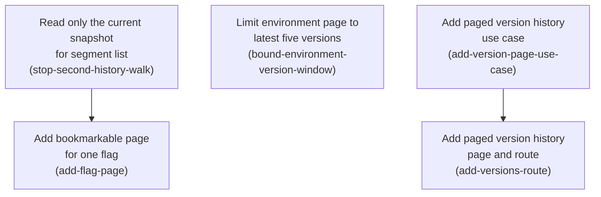

# Horizon 24 — Version paging and flag URLs

## 🎯 What are we trying to achieve?

Make the dashboard stay comfortable as an environment grows. Version history moves onto its own page you can flip through, each flag gets an address you can bookmark, and a page render stops reading every version ever published.

**Done means:** Done when: (1) rendering /env/<env> reads a bounded number of Snapshot Versions (a fixed small window, not 1..currentVersion) regardless of how many versions exist, and listPublishedSegments reads exactly one snapshot per call, so a render no longer walks history twice; (2) GET /env/<env>/versions renders one Page Window of version history, with page position read from the query string and Older/Newer links that are omitted when no such page exists; (3) GET /env/<env>/features/<key> returns a Flag Page for an existing key and a 404 for an unknown one, with the existing POST /env/<env>/features/<key> edit route unchanged, and each flag in the environment list links to it; (4) BrowsePorts is NOT widened — version numbers stay derivable arithmetically from the Current Pointer; (5) repo gates stay green — pnpm verify (build, typecheck, ESLint layer boundaries, 100% line/branch/function/statement coverage over packages/*/src/**/*.ts), the integration suite and the Playwright browser suite, whose existing specs drive bare URLs and must keep passing on the new defaults.

## 🧠 Why does this change need to happen?

Everything currently lives on one page, and the only way to get anywhere is to scroll. Worse, drawing that page reads *every* published snapshot from storage — an environment at version 400 does 400 network reads per page view, and it does that work twice, because the segment list helper re-reads the whole history just to look at the newest snapshot. The scrolling is the symptom people notice; the read cost is what actually breaks first.

## At a glance

- **Phases:** 5
- **Complexity:** Medium — three small application-layer changes, then two medium routing/view phases.
- **Main risk:** The route matcher rejects paths with more than 4 segments (http-server.ts guard) and already binds /env/<env>/features/<key> to POST edits; adding a GET Flag Page and a paged versions route must not shadow or loosen the existing method/path dispatch.
- **Quality target:** repo gates stay green, including 100% line/branch/function/statement coverage over `packages/*/src`.
- **Testing focus:** counting storage reads in tests, boundary arithmetic (first/middle/last/past-the-end page), untrusted query input clamping, and not disturbing the existing Playwright specs.

## Order of work

Three phases can start immediately; two wait on a predecessor.

1. **Read only the current snapshot for segment list** — can start immediately.
2. **Limit environment page to latest five versions** — can start immediately; independent of phase 1.
3. **Add paged version history use case** — can start immediately; it reuses helpers that already exist.
4. **Add paged version history page and route** → after 3, because it renders what that use case returns.
5. **Add bookmarkable page for one flag** → after 1, because the flag page renders the edit form, which needs the published-segment list; adding this route first would create a second full-history walk.

## Implementation plan

### Phase 1 — Read only the current snapshot for segment list

Technical ID: `stop-second-history-walk` · Dashboard read path · application layer · small blast radius

**Goal** — Make listPublishedSegments read just the current published snapshot instead of walking every published version, so one page render stops paying the version fan-out twice.

**Why** — A helper that only needs the flags in the newest snapshot currently loads every snapshot ever published. On an environment with 400 published versions that is 400 network reads for data taken from one of them, and this helper runs on every page render and every edit submit.

**Changes**

- In currentFlags(), replace the browseEnvironment() call with readCurrentVersion(env) followed by a single viewSnapshotVersion(ports, env, version) call.
- Keep the existing fallbacks exactly as they are: return an empty flag list when there is no current version, when the snapshot is missing, or when its contents are invalid.
- Add unit tests covering no-current-version, missing snapshot, invalid snapshot and the happy path, and assert the fake port records exactly one snapshot fetch.

**Files / areas**

- packages/dashboard/src/application/list-published-segments.ts
- packages/dashboard/test/application/list-published-segments.test.ts

**How to verify**

- **One snapshot read per call** — A test in packages/dashboard/test/application/list-published-segments.test.ts uses a fake port whose fetchSnapshotText increments a counter, seeds currentVersion at 50 or more, and asserts the counter equals 1 after the call
- **Empty-result fallbacks still hold** — A test where readCurrentVersion resolves undefined asserts the result is an empty array and that fetchSnapshotText was never called
- **Helper no longer routes through browseEnvironment** — grep for 'browseEnvironment' in packages/dashboard/src/application/list-published-segments.ts returns nothing

**Done when** — listPublishedSegments performs exactly one snapshot read per call regardless of how many versions the environment has, proven by a unit test counting port calls., and every check under *How to verify* passes its bar.

**Depends on** — nothing — can start immediately

**Rollback** — Revert the file to the previous browseEnvironment-based currentFlags(); no data or stored state is touched.

Reference — full rubric

| Dimension | Must be true | Fails when | Min |
|---|---|---|---|
| **One snapshot read per call** `snapshot-read-count` | A unit test must prove listPublishedSegments fetches exactly one snapshot regardless of how many versions exist; 8 = a counting test at a large version count, 10 = counts asserted for both a large and a single-version environment plus an assertion on which version number was fetched. | The test seeds currentVersion = 1, so a surviving full fan-out would still record exactly one fetch and the test passes against the old code | 8 |
| **Empty-result fallbacks still hold** `fallback-branches-preserved` | All three degenerate inputs must still yield an empty segment list rather than a throw or undefined; 8 = a test per branch, 10 = each test also asserts no snapshot fetch happens when there is no current version. | The no-current-version case returns [] but still issues a snapshot read for version undefined or NaN | 8 |
| **Helper no longer routes through browseEnvironment** `no-browse-environment-dependency` | The published-segments read path must not call browseEnvironment at all; 8 = the import is gone and viewSnapshotVersion is used directly, 10 = no new port method or exported helper was added to achieve it. | browseEnvironment is kept but called with a new 'limit' option, leaving the fan-out reachable from other call sites | 8 |

**Healer hint:** The usual miss is a read-count test seeded at one version, which passes against the unchanged code — seed 50 versions and assert the count is exactly 1 plus the version argument.

### Phase 2 — Limit environment page to latest five versions

Technical ID: `bound-environment-version-window` · Dashboard read path · application layer · small blast radius

**Goal** — Change browseEnvironment so it loads only the newest few published versions plus the current one, instead of every version from 1 to the current number.

**Why** — The main environment page loads every snapshot ever published just to draw a history list the operator scrolls past. Loading a fixed small window makes the page cost the same whether the environment is at version 5 or version 500.

**Changes**

- Introduce an exported constant ENVIRONMENT_VERSION_WINDOW = 5 in browse-environment.ts.
- Replace the Array.from({length: currentVersion}) fan-out with a range covering only the highest ENVIRONMENT_VERSION_WINDOW version numbers (clamped when fewer exist), keeping the returned versions field the same readonly VersionEntry[] type so the view needs no change yet.
- Keep current (the view of currentVersion) correct by selecting it by version number rather than by array index.
- Add unit tests for fewer-than-window, exactly-window and far-more-than-window environments, asserting both the returned entries and the number of snapshot fetches.

**Files / areas**

- packages/dashboard/src/application/browse-environment.ts
- packages/dashboard/test/application/browse-environment.test.ts

**How to verify**

- **Window size holds at every boundary** — A test with currentVersion = 3 asserts 3 fetches and versions [1,2,3] present in the result
- **Current view found by version number** — A test with currentVersion = 500 asserts view.current.version === 500
- **EnvironmentView contract unchanged** — The exported EnvironmentView type still declares versions as a readonly VersionEntry[] with no added page/offset fields
- **Window size is a single named constant** — browse-environment.ts exports a named constant ENVIRONMENT_VERSION_WINDOW

**Done when** — browseEnvironment issues at most five snapshot reads per call and still returns the correct current snapshot view, proven by unit tests., and every check under *How to verify* passes its bar.

**Depends on** — nothing — can start immediately

**Rollback** — Restore the full 1..currentVersion range in browse-environment.ts.

Reference — full rubric

| Dimension | Must be true | Fails when | Min |
|---|---|---|---|
| **Window size holds at every boundary** `window-clamping` | The number of snapshot fetches must be min(currentVersion, ENVIRONMENT_VERSION_WINDOW) at every boundary; 8 = tests at below, at and far above the window, 10 = the exact set of version numbers fetched is asserted, not just how many. | Range computed as currentVersion-5..currentVersion without clamping, so an environment at version 3 requests versions -1 and 0 | 8 |
| **Current view found by version number** `current-selected-by-number` | view.current must correspond to currentVersion under a window, where index arithmetic no longer lines up; 8 = a test at currentVersion far above the window asserts current.version === currentVersion, 10 = it also asserts current.contents differ from the other windowed entries so a wrong pick is visible. | current is taken as the last element of the fetched array — correct today, silently wrong the moment the range is reordered newest-first | 8 |
| **EnvironmentView contract unchanged** `view-shape-unchanged` | Consumers of EnvironmentView must compile and behave unchanged; 8 = versions is still readonly VersionEntry[] and no view module was touched, 10 = the existing environment-page tests and Playwright seed (3 flags, 1 version) pass with no edits. | versions gains a totalVersions or hasOlder field 'while we are here', forcing view changes this phase promised not to make | 8 |
| **Window size is a single named constant** `window-constant-exported` | The bound must live in one exported constant rather than a literal repeated in code and tests; 8 = ENVIRONMENT_VERSION_WINDOW is exported and used in the implementation, 10 = tests import it instead of hardcoding 5, so changing it does not break the suite. | The constant is exported but the implementation still computes with a literal 5 in one branch, so the two drift | 7 |

**Healer hint:** The likely failure is current still being picked by array index (correct only when the window covers all versions) — select it by matching version === currentVersion and add a currentVersion=500 test.

### Phase 3 — Add paged version history use case

Technical ID: `add-version-page-use-case` · Dashboard read path · application layer · small blast radius

**Goal** — Add an application function that returns one page of published versions, computing which version numbers fall on that page arithmetically from the current version number.

**Why** — A separate history page needs to load a chosen slice of versions rather than all of them. Because versions are numbered 1..current and each is addressable by its number, the slice can be worked out by arithmetic with no extra storage lookup.

**Changes**

- Create list-version-page.ts exporting listVersionPage(ports, environment, page, pageSize) that reads the current version, computes the newest-first slice of version numbers for the requested page, and fetches only those snapshots via the existing viewSnapshotVersion.
- Return a value containing environment, page, pageSize, totalVersions, the page's VersionEntry list, and whether newer/older pages exist.
- Clamp untrusted input: page below 1 becomes 1, a page past the end returns an empty entry list rather than an error, and pageSize is clamped to a fixed maximum.
- Reuse the existing BrowsePorts interface unchanged — do not add a port method — and cover every clamping branch with unit tests.

**Files / areas**

- packages/dashboard/src/application/list-version-page.ts
- packages/dashboard/test/application/list-version-page.test.ts

**How to verify**

- **Page slice computed newest-first and correctly** — With totalVersions = 23 and pageSize = 10, page 1 returns versions 23..14 in that order
- **Untrusted page and pageSize clamped, never thrown** — page = 0 and page = -5 each return the same entries as page 1
- **BrowsePorts untouched** — git diff shows no change to the BrowsePorts interface or to DashboardPorts
- **Returned metadata supports navigation** — The returned value includes environment, page, pageSize, totalVersions and the entry list

**Done when** — A listVersionPage application module returning one bounded page of version entries, with unit tests covering clamping and out-of-range pages., and every check under *How to verify* passes its bar.

**Depends on** — nothing — can start immediately

**Rollback** — Delete the new module and its test; nothing else imports it until the next phase.

Reference — full rubric

| Dimension | Must be true | Fails when | Min |
|---|---|---|---|
| **Page slice computed newest-first and correctly** `page-arithmetic` | For a given page and pageSize the returned version numbers must be the correct newest-first slice; 8 = first, middle and last page asserted by exact version numbers, 10 = a last page that is only partly full is also asserted. | Pagination is computed ascending then reversed per page, so page 1 shows the oldest ten versions in descending order | 8 |
| **Untrusted page and pageSize clamped, never thrown** `input-clamping` | Out-of-range page and pageSize inputs must clamp or return empty rather than throw or fan out; 8 = each clamp branch has a test, 10 = a huge pageSize test asserts the port call count equals the clamped maximum, not the requested one. | page is clamped but pageSize is not, so ?pageSize=100000 restores the full fan-out this horizon exists to remove | 8 |
| **BrowsePorts untouched** `ports-not-widened` | The page must be computed arithmetically from readCurrentVersion with no new port method; 8 = BrowsePorts is unchanged and no fixture literal needed editing, 10 = the module's own test constructs ports with only the two existing methods and no cast. | A listVersionNumbers port is added 'for future S3 listing', forcing four hand-written port literals to change | 9 |
| **Returned metadata supports navigation** `paging-metadata` | The result must carry enough to render Older/Newer links without a second call; 8 = totalVersions and both has-flags correct on first, middle and last page, 10 = the flags are asserted on the single-page case where both must be false. | hasOlder is derived from entries.length === pageSize, so a history whose length is an exact multiple of pageSize advertises an empty page after the last one | 8 |

**Healer hint:** Most likely miss is an unclamped pageSize or a hasOlder derived from entries.length — clamp pageSize to a named maximum and derive both flags from totalVersions arithmetic, with a test at an exact multiple of pageSize.

### Phase 4 — Add paged version history page and route

Technical ID: `add-versions-route` · Dashboard routing and views · interface layer · medium blast radius

**Goal** — Serve a browsable version history at GET /env/<env>/versions, showing one page of versions with older/newer links, and link to it from the environment page.

**Why** — Version history moves off the main page so the operator navigates to it instead of scrolling through hundreds of entries. Page position lives in the URL so a given page can be linked to and reloaded.

**Changes**

- Create version-list-page.ts following the existing standalone-page template (back link, page head, renderPage from layout.ts) and export its own path helper versionsPath(environment, page).
- Render each version entry with the same rollback form markup the environment page uses today, plus Older/Newer links that carry the page number in the query string and are omitted when no such page exists.
- Bind GET /env/<env>/versions in http-server.ts (a three-segment path currently unbound), parsing page and pageSize from the query string with the existing strict-regex plus HttpError(400) validation style, and call listVersionPage.
- In environment-page.ts, keep rendering the bounded version list and add a 'View all versions' link to versionsPath; add co-located tests for the new view module and route including page 1, a middle page and a past-the-end page.

**Files / areas**

- packages/dashboard/src/infrastructure/views/version-list-page.ts
- packages/dashboard/src/infrastructure/views/environment-page.ts
- packages/dashboard/src/infrastructure/http-server.ts

**How to verify**

- **GET /env/<env>/versions bound with strict query parsing** — A request test for GET /env/demo/versions returns 200 and HTML containing version entries
- **Older/Newer links correct and omitted at the ends** — On page 1 the rendered HTML contains an Older link whose href includes page=2 and contains no Newer link
- **Past-the-end page renders, does not error** — GET /env/demo/versions?page=99 on a 3-version environment returns 200
- **Environment page keeps the bounded list and links out** — renderEnvironmentPage output contains an anchor whose href is versionsPath(environment) / ends in /versions with the text of a 'view all versions' style link
- **Bare URLs keep working for existing specs** — No file under packages/dashboard/e2e/ was modified in this phase

**Done when** — GET /env/<env>/versions renders one page of version history with working Older/Newer links, covered by route and view tests., and every check under *How to verify* passes its bar.

**Depends on** — Add paged version history use case

**Rollback** — Remove the route binding and the environment-page link, and delete version-list-page.ts; the environment page returns to showing only its bounded version list.

Reference — full rubric

| Dimension | Must be true | Fails when | Min |
|---|---|---|---|
| **GET /env/<env>/versions bound with strict query parsing** `route-binding-and-query-validation` | The three-segment versions path must resolve for GET and reject malformed query input with 400 rather than coercing it; 8 = bound with tests for valid and malformed page, 10 = method mismatch returns 405 with an allow header like the other routes. | The new branch is added after the four-segment versions branch or after the features branch and is never reached, so the test only passes because of another handler | 8 |
| **Older/Newer links correct and omitted at the ends** `pager-links` | Pager links must carry the page number in the query string and disappear where no such page exists; 8 = both ends tested, 10 = a rendered link is followed in a second request that returns the expected adjacent versions. | Both links always render and are merely disabled with an attribute, so an operator on page 1 can still click through to page 0 | 8 |
| **Past-the-end page renders, does not error** `past-the-end-page` | Requesting a page beyond the history must render an empty-but-valid history page; 8 = a test asserts 200 and an empty-state message, 10 = it also asserts no snapshot fetch occurred for that request. | The empty page throws on views[0] while building the heading and returns 500 | 8 |
| **Environment page keeps the bounded list and links out** `environment-page-still-bounded` | The environment page must keep showing only the windowed versions plus a link to the new route; 8 = link present and list still bounded, 10 = a test proves the environment page renders at most the window size on a large history. | The environment page keeps its own version rendering while the new page duplicates a divergent rollback form, so rollback works on one page and 404s on the other | 8 |
| **Bare URLs keep working for existing specs** `e2e-defaults-unchanged` | Existing Playwright specs drive bare URLs on a 3-flag, 1-version seed and must keep passing; 8 = no spec file edited and the defaults render page 1, 10 = the versions route itself is exercised by at least one assertion on the seed environment. | page is made a required query parameter, so the bare /env/<env>/versions URL returns 400 | 8 |

**Healer hint:** The commonest break is branch ordering in http-server.ts — bind the three-segment versions route so it cannot shadow the existing /versions/<n> branch, and test both in the same run.

### Phase 5 — Add bookmarkable page for one flag

Technical ID: `add-flag-page` · Dashboard routing and views · interface layer · medium blast radius

**Goal** — Serve a single flag at GET /env/<env>/features/<key> so it can be bookmarked and shared, and link each flag in the list to it.

**Why** — Today a flag can only be reached by finding it in the full list on the environment page. Giving each flag its own address lets an operator jump straight to it from a bookmark or a chat message. This phase must follow the segment-list read fix, because rendering the flag's edit form requires the published-segment list: adding this route before that fix would introduce a second place that walks every published version.

**Changes**

- Create flag-page.ts rendering one flag using the existing renderFeatureEditForm with the same edit context the environment page builds, following the standalone-page template, and export flagPath(environment, key).
- Convert the existing four-segment features/<key> branch in http-server.ts into a method-dispatching route in the style segment-routes.ts already uses so the existing POST edit route keeps working and GET no longer returns 405.
- For an unknown flag key, or an environment with no published snapshot, throw the existing HttpError(404, <message>) — http-server.ts already catches HttpError and renders it via renderErrorPage from views/error-page.js, so no new not-found page is built.
- In snapshot-contents.ts, wrap the flag key text in renderFlagCard with an anchor to flagPath, leaving data-flag and data-search attributes untouched so the existing browser filter spec still passes.
- Add co-located tests for the new page module and for GET/POST dispatch, including the unknown-key 404 branch.

**Files / areas**

- packages/dashboard/src/infrastructure/views/flag-page.ts
- packages/dashboard/src/infrastructure/views/snapshot-contents.ts
- packages/dashboard/src/infrastructure/http-server.ts

**How to verify**

- **features/<key> dispatches by method, POST unchanged** — GET /env/demo/features/<known-key> returns 200 HTML (it returned 405 before)
- **Unknown key and unpublished environment give 404** — GET /env/demo/features/does-not-exist returns 404
- **Flag page reuses the real edit form and context** — flag-page.ts imports and calls renderFeatureEditForm; grep shows no duplicated <form> markup for flag editing in that file
- **Flag card anchor added without disturbing filter hooks** — renderFlagCard output still carries data-flag="<key>" and the same data-search value as before
- **Every new branch covered** — The repo coverage command passes with no new uncovered lines or branches in flag-page.ts, snapshot-contents.ts or http-server.ts

**Done when** — GET /env/<env>/features/<key> renders a single flag page for a known key and a 404 page for an unknown one, with the existing POST edit route unchanged., and every check under *How to verify* passes its bar.

**Depends on** — Read only the current snapshot for segment list

**Rollback** — Restore the POST-only features/<key> route branch, drop the anchor in renderFlagCard, and delete flag-page.ts.

Reference — full rubric

| Dimension | Must be true | Fails when | Min |
|---|---|---|---|
| **features/<key> dispatches by method, POST unchanged** `method-dispatch-preserves-post` | Converting the POST-only branch must leave the edit POST byte-for-byte behaviourally identical while GET now renders; 8 = both verbs tested on the same path, 10 = the pre-existing edit POST tests pass with no edit to their assertions. | The route object sets method to the matched verb but allow stays ['POST'], so DELETE returns a 405 whose allow header lies | 9 |
| **Unknown key and unpublished environment give 404** `unknown-key-404` | Both not-found cases must surface as the existing HttpError(404) error page, not a crash or an empty flag page; 8 = both branches tested for status, 10 = the response body is asserted to be the rendered error page with a message naming the missing key. | The unknown key renders a normal flag page with an empty edit form, so a typo'd bookmark looks like a real but broken flag | 8 |
| **Flag page reuses the real edit form and context** `edit-form-parity` | The single-flag page must render the same edit form the environment page builds, not a reimplementation; 8 = it calls renderFeatureEditForm with the same EditContext, 10 = a test asserts the rendered form action and input names match the environment page's output for the same flag. | The form is hand-written on the flag page and omits a hidden field (e.g. base version) the POST handler requires, so edits from this page fail validation only under concurrency | 8 |
| **Flag card anchor added without disturbing filter hooks** `flag-list-anchor-nonbreaking` | Wrapping the flag key in a link must leave every attribute the browser filter relies on intact; 8 = data-flag and data-search unchanged and the e2e filter spec untouched, 10 = a view test asserts the anchor href equals flagPath and that data-search still holds the lowercased key/type/state text. | The anchor wraps the whole 
, so expanding a flag row now navigates away and the horizon-23 expand-and-edit spec fails | 8 |
| **Every new branch covered** `coverage-of-new-branches` | The repo gate requires 100% lines/branches over packages/*/src/**/*.ts, so each new conditional needs a test in this phase; 8 = the coverage run is green, 10 = each new branch has a test that fails when that branch is inverted. | A defensive fallback (e.g. a ?? 'unknown' on missing flag metadata) is added with no input that reaches it, dropping branch coverage below 100% | 8 |

**Healer hint:** The likely break is the anchor swallowing the flag-row summary click or the 405-to-dispatch conversion narrowing the allow header — anchor only the key span and keep allow listing both GET and POST.

## Discovery Findings

| Area | Finding | Where | Implication |
|---|---|---|---|
| HTTP routing | dispatch() builds `const url = new URL(String(request.url), 'http://localhost')` and `segments = url.pathname.split('/').filter(s => s !== '')`. match(segments, method) returns a Route or undefined; undefined -> 404, method mismatch -> 405 with an `allow` header from `route.allow ?? [route.method]`. | `packages/dashboard/src/infrastructure/http-server.ts` | GET /env/<e>/features/<key> currently returns 405 (not 404) because the 4-segment `features` branch returns a POST-only Route regardless of method. The plan must convert that branch into a method-dispatching route in the same style segment-routes.ts already uses (`{ method: matched, allow: ['GET','P |
| HTTP routing / query strings | The URL object with searchParams is already threaded into every handler as the third argument of Route.handle (`handle(request, response, url)`), and is already read in three places: `url.searchParams.get('env')` on /, and `since`/`edited` on /changes. There is NO generic query-string parsing, pagin | `packages/dashboard/src/infrastructure/http-primitives.ts` | No plumbing work is needed to reach the query string — every handler already has `url`. The plan should add one small parse helper (page/pageSize/q/open-sections) next to the existing `parseVersion`/`parseBaseVersion` validators in http-server.ts (or better, a new infrastructure module so http-serve |
| HTTP routing / POST round-trip of query state | The POST handlers (editRoute, publish, rollback) do NOT redirect — they re-render renderEnvironmentPage inline with a 200/400/422 status. Only the home route uses `redirect()` (303). | `packages/dashboard/src/infrastructure/http-server.ts` | Carrying q/section state 'across a publish' cannot rely on the browser URL: after a POST the browser URL is the POST action URL. State must therefore either be echoed as hidden form fields in every form (publish dialog, each edit form, rollback form) and re-read from the POST body, or the POST actio |
| Application layer / browse-environment | BrowsePorts has exactly two methods: readCurrentVersion(env): Promise<number|undefined> and fetchSnapshotText(env, version): Promise<string>. browseEnvironment() reads currentVersion then does Promise.all over Array.from({length: currentVersion}) calling viewSnapshotVersion for EVERY version 1..curr | `packages/dashboard/src/application/browse-environment.ts` | The N+1 read is a single Promise.all line; bounding it is a small change, but EnvironmentView.versions is a public shape consumed by the view. The plan should keep EnvironmentView shape-compatible (versions still readonly VersionEntry[], just bounded) and add a separate paged use case (e.g. listVers |
| Callers of browseEnvironment | Exactly five call sites, all in two files. http-server.ts: GET /env/<e> (uses the whole view), POST /publish, POST /rollback, and editRoute (all three re-render the full page). list-published-segments.ts: currentFlags() calls browseEnvironment and immediately discards everything except view.current. | `packages/dashboard/src/application/list-published-segments.ts` | listPublishedSegments pays the full 1..N snapshot read just to get the current snapshot's flags — and it is called on EVERY environment render and EVERY edit POST, so today a render costs ~2N snapshot fetches. The plan should have currentFlags() call viewSnapshotVersion(ports, env, await readCurrent |
| Views / environment-page.ts | renderEnvironmentPage(view, state) composes renderUpdateWatch + renderCurrentCard + renderFlags + renderVersions + renderPublishDialog. renderFlags emits the filter as `<input type="search" class="flag-filter" data-filter="flag-list" ... hidden>` — hidden by default and unhidden by app.js; the empty | `packages/dashboard/src/infrastructure/views/environment-page.ts` | (a) Making the filter server-side means it must stop being `hidden` and become a GET <form> submitting `q` — but app.js still binds `[data-filter]`, so the plan must decide whether to keep client-side filtering as progressive enhancement over the already-filtered server set or drop the data-filter a |
| Views / snapshot-contents.ts | renderSnapshotContents(contents, editable?) branches: invalid -> notice; zero flags -> muted paragraph; editable given -> <ul class="flag-list"> of renderFlagCard; editable absent -> a read-only <table class="flag-table"> of renderTableRow. renderFlagCard emits `<li class="card flag" data-flag="<key | `packages/dashboard/src/infrastructure/views/snapshot-contents.ts` | The per-flag URL is added by wrapping the .flag-key span in renderFlagCard in an <a>, and the flag page itself can reuse renderFeatureEditForm with the same EditContext — no new form plumbing. data-search must be preserved if the client filter stays. Server-side paging of flags means slicing content |
| Views / standalone page precedent | version-page.ts and segment-page.ts are the two existing standalone pages. Both are a single exported render function calling renderPage(heading, body, notices?) from layout.ts, both start the body with a back-link paragraph followed by `
<h1>…</h1>
`, and both take a plai | `packages/dashboard/src/infrastructure/views/version-page.ts` | New pages (flag page, versions-list page) should follow this template exactly: one module per page exporting renderXPage(view, state?) plus its own path helper (flagPath(env,key), versionsPath(env,page)) colocated in that module, back-link + page-head, notices via renderPage's third argument. Do not |
| Stylesheet convention | stylesheet.ts concatenates a hardcoded ordered array STYLE_FILES = [base, layout, forms, components, tables, rollout, segments, segment-list, segment-create, segment-attach].css read with readFileSync and joined. STYLESHEET_PATH='/assets/app.css' with a sha256 content hash. Sizes: components.css 439 | `packages/dashboard/src/infrastructure/views/stylesheet.ts` | Sticky nav CSS goes in a NEW small file (e.g. section-nav.css) added to STYLE_FILES after layout.css — that is the established pattern for every feature-scoped sheet (segment-list/segment-create/segment-attach are all 12-23 lines). Adding a file requires only the array edit; no build tooling. Order  |
| Test layout and coverage gate | Root vitest.config.ts creates one project per packages/* dir, excluding integration/** and e2e/**; coverage include is ['packages/*/src/**/*.ts'] with 100% lines/branches/functions/statements. Dashboard unit tests live in TWO places: co-located src/infrastructure/**/*.test.ts (http-server.test.ts 15 | `vitest.config.ts` | Every new .ts branch (query parsing, page clamping, 404 for unknown flag key, empty page, page-out-of-range) needs a test in the same phase it is written, or coverage fails the gate. New application-layer modules get tests under packages/dashboard/test/application/; new infrastructure/view modules g |
| Playwright e2e exposure | Specs: flag-list.spec.ts, concurrent-edits.spec.ts (in-memory fixture), segment-picker.spec.ts, segment-upload-rollout.spec.ts (LocalStack). Every navigation is a bare URL with no query string. The seed environment has exactly 3 flags and 1 version. flag-list.spec.ts 'filters flags by key, type and  | `packages/dashboard/e2e/support/fixtures.ts` | Adding query state does not break existing specs (all use bare URLs, so defaults must render the unfiltered first page with 3 flags and 1 version visible). The real risk is flag-list.spec.ts's filter spec: if the filter becomes a server-side GET form, typing no longer hides rows live and that spec m |
| Fixture port surface | e2e/support/fixtures.ts InMemoryEnvironment.ports() and http-server.test.ts fakes() both construct a full DashboardPorts literal (readCurrentVersion, fetchSnapshotText, listPublishedSegments, publishSegment, readSegmentVersion, openWriter). DashboardPorts = EditFeaturePorts & SegmentUploadPorts & Li | `packages/dashboard/src/infrastructure/http-server.ts` | If any phase widens BrowsePorts (e.g. to list versions), three hand-written port literals must be updated in lockstep (fixtures.ts, localstack-fixtures.ts, http-server.test.ts fakes) plus aws-adapters.ts. The arithmetic-paging approach avoids this entirely — the plan should explicitly commit to NOT  |

## Out of Scope

- Carry the flag filter and per-section open/closed state in the query string, rendered server-side (user item 3) — held for the next Planning Horizon to keep this one small and reviewable; it needs a URL-state contract shared by three pages and touches every write form, because POST handlers re-render inline instead of redirecting.
- Server-side flag filtering and flag paging (user item 4) — held for the next Planning Horizon; its query-string semantics are defined by item 3's URL-state contract, and it forces a rewrite of the flag-list browser spec that drives the live client-side filter.
- Sticky Flags / Versions / Segments section navigation (user item 5) — held for the next Planning Horizon; cosmetic, and its shape depends on how the new routes settle (Segments is a separate route, not an on-page section).
- A reusable query-string/URL-state parsing module shared by all pages — premature abstraction while only page and pageSize exist; extract it when item 3 adds the third and fourth consumers.
- Widening BrowsePorts with a version-listing method — unnecessary; version numbers are derivable arithmetically from the Current Pointer, and it would force lockstep edits to three hand-written port literals plus the AWS adapter.
- Carrying the flag filter and per-section open/closed state in the query string (user item 3) — deferred to the next horizon; it needs a URL-state contract shared by three pages and touches every write form, because POST handlers re-render inline instead of redirecting.
- Making the horizon-23 browser spec stop reopening the flag row and Rollout panel after a submit — that depends entirely on open/closed state travelling in the URL, which is deferred item 3; this horizon cannot and does not promise it.
- Any new logic in packages/dashboard/src/infrastructure/views/scripts/app.js — an explicit horizon-18 decision puts it outside the coverage gate and the user chose server-side URL state instead.
- Caching, memoising or otherwise persisting parsed Snapshot Versions between requests — paging removes the fan-out without introducing a cache and its invalidation.
- A per-environment version index object in S3 — versions stay derivable from the Current Pointer, and horizon 23 already rejected index objects as a second source of truth.
- Widening ListObjectsV2 beyond the <env>/segments/ prefix — the horizon-10 no-listing rule still binds every other prefix.
- Segment list paging or filtering — the user's five items cover Flags and Versions only.
- Orphaned snapshot/segment object cleanup (the superseded horizon 22) — unrelated to navigation and still parked.
- The create-a-flag-with-segments-attached scope in next-horizon-brief.md — written for a different horizon and explicitly redirected by the user.
- Any change to flag edit, publish, rollback, replay or conflict semantics — this horizon changes read paths and navigation only.
- Authentication, multi-user sessions or server-side session storage — state lives in the URL, and the dashboard remains a localhost single-operator tool behind the Host/Origin guard.
- A visual redesign of the dashboard beyond the sticky section nav's markup and CSS.

## Success Criteria

- Done when: (1) rendering /env/<env> reads a bounded number of Snapshot Versions (a fixed small window, not 1..currentVersion) regardless of how many versions exist, and listPublishedSegments reads exactly one snapshot per call, so a render no longer walks history twice; (2) GET /env/<env>/versions renders one Page Window of version history, with page position read from the query string and Older/Newer links that are omitted when no such page exists; (3) GET /env/<env>/features/<key> returns a Flag Page for an existing key and a 404 for an unknown one, with the existing POST /env/<env>/features/<key> edit route unchanged, and each flag in the environment list links to it; (4) BrowsePorts is NOT widened — version numbers stay derivable arithmetically from the Current Pointer; (5) repo gates stay green — pnpm verify (build, typecheck, ESLint layer boundaries, 100% line/branch/function/statement coverage over packages/*/src/**/*.ts), the integration suite and the Playwright browser suite, whose existing specs drive bare URLs and must keep passing on the new defaults.
- Read only the current snapshot for segment list: listPublishedSegments performs exactly one snapshot read per call regardless of how many versions the environment has, proven by a unit test counting port calls.
- Limit environment page to latest five versions: browseEnvironment issues at most five snapshot reads per call and still returns the correct current snapshot view, proven by unit tests.
- Add paged version history use case: A listVersionPage application module returning one bounded page of version entries, with unit tests covering clamping and out-of-range pages.
- Add paged version history page and route: GET /env/<env>/versions renders one page of version history with working Older/Newer links, covered by route and view tests.
- Add bookmarkable page for one flag: GET /env/<env>/features/<key> renders a single flag page for a known key and a 404 page for an unknown one, with the existing POST edit route unchanged.

## Alignment Preview

Four concerns were raised before the expensive half of planning:

- **The plan covers two of the user's five requested items.** Raised, taken to the user, who confirmed items 1-2 now and items 3-5 as the next horizon. A Planning Brief for that horizon is written.
- **The success bar listed six outcomes the phases could not deliver.** Fixed — trimmed to what this horizon builds.
- **One promise was undeliverable** (that the horizon-23 browser spec would stop reopening the flag row after a submit). That depends on open/closed state travelling in the URL, which is deferred. Removed from scope and stated explicitly as not promised.
- **"The existing 404-style error page" named nothing concrete.** Resolved: `renderErrorPage` in `views/error-page.js`, reached by throwing `HttpError(404, ...)`, which `http-server.ts` already catches. No new page is built.

The user accepted the first preview; no redirect rounds were used.

## Quality Gate

Path: **full**. One critic iteration, as designed.

- **Blockers:** 0 raised, 0 discarded on evidence, 0 downgraded, 0 confirmed. No verification call was needed.
- **Healed — `success-coverage` (major, 6/10):** the objective still promised URL-carried filter and section state that the roadmap defers, so objective and success criteria described different horizons. Objective rewritten to the two items actually built; the now-unused terms *URL State* and *Section Nav* dropped from the vocabulary; the out-of-scope entry reworded to drop its sticky-nav carve-out.
- **Healed — `valid-dependencies` (major, 6/10), partially, with a documented disagreement:** the critic flagged two dependency edges as not load-bearing. It was right about `add-version-page-use-case` → `bound-environment-version-window` (the paged use case never touches the window constant), so that edge is dropped and the phase can now start immediately. It was **wrong** about `add-flag-page` → `stop-second-history-walk`: the flag page renders `renderFeatureEditForm`, which requires a `PublishedSegmentsView`, and every route that renders it calls `listPublishedSegments` — verified in `feature-edit-form.ts:78` and `http-server.ts:303,347,416,433`. The Flag Page is therefore a *new* caller of that helper, and landing it before the read fix would add a second full-history walk. The edge is kept and made explicit in the phase's `inputs` and `rationale`.
- **Accepted debt:** duplicate entries in the deferred list were de-duplicated for free (19 → 17). The remaining `minor` issues all passed their bar and needed no change.
- **Verdict:** gate passed after one heal. Seven dimensions passed unchanged, two `major` issues healed, no blockers, no overrides.

## Cost

Budget stated before Stage 1: 8-10 Agent calls plus at most 2 patch calls. **Actual: 7 Agent calls, 0 patch calls.** Stage 2 was skipped because Discovery ran. The heal was applied mechanically by the orchestrator from the critic's own fix proposals rather than spending a healer call, because one proposal was contradicted by the code and needed a grounded partial rejection rather than wholesale application.

## Full analysis

**Domain shape:** `technical` — The objective is about the dashboard's read path, routing and rendering machinery — how many S3 reads a page render costs and which URL shows what — not about flag targeting, versioning or any rule a domain expert would recognise. The critic re-scored this independently at 9/10 and agreed.

### Ubiquitous language

| Term | Meaning |
|---|---|
| **Environment Page** | The server-rendered page at /env/<env>; after this horizon it shows the current snapshot, a bounded page of flags and only the latest few versions. |
| **Version History Page** | The new paged route (/env/<env>/versions) that renders one page of Snapshot Versions, reading only the versions on that page. |
| **Flag Page** | The new deep-linkable page at /env/<env>/features/<key> rendering one flag and its edit forms, bookmarkable and shareable. |
| **Page Window** | The bounded slice — of versions or of flags — a given render actually reads and emits, defined by page size and offset. |
| **Snapshot Version** | One immutable published snapshot numbered 1..currentVersion, addressable by key without any bucket listing. |
| **Dashboard read path** | The application-layer path that turns storage reads into an Environment Page view: browseEnvironment, listVersionPage and listPublishedSegments. |
| **Dashboard routing and views** | The infrastructure layer that binds URLs to handlers and renders HTML pages: http-server.ts and the modules under views/. |

### Assumptions

- Version history stays linear 1..currentVersion and addressable by key, so a page of versions is computed arithmetically from readCurrentVersion — no ListObjectsV2 on the snapshots prefix (the horizon-23 listing permission was granted for the <env>/segments/ prefix only).
- The environment page's 'latest few' window is a small fixed constant (e.g. 5) chosen in the plan, not an operator-tunable setting.
- listPublishedSegments' internal browseEnvironment call is the second fan-out named in discoveries.md and is reduced to the data it actually needs (the current Snapshot Version), so a render does not walk history twice.
- State in the query string is carried across POSTs by the forms themselves (action/hidden fields or a redirect preserving the query), since POST handlers currently render the page directly.
- The existing client-side data-filter input is replaced by, not layered on top of, the server-side filter, so one filter mechanism remains.
- Query-string state is untrusted input: unknown keys, out-of-range pages and oversized q values are clamped or ignored rather than erroring.
- The horizon-16 Host/Origin guard, the field-granular replay rule and all existing edit/publish semantics are unchanged by this horizon.
- This horizon resolves the open horizon-10 blocker 'Is 1..current version browsing usable for many versions, or is pagination needed?' — the answer is paging.

### Risks

- The route matcher rejects paths with more than 4 segments (http-server.ts guard) and already binds /env/<env>/features/<key> to POST edits; adding a GET Flag Page and a paged versions route must not shadow or loosen the existing method/path dispatch.
- The 100% branch-coverage gate over hand-written HTML strings (open horizon-10 blocker) gets harder as paging, filter echo and open/closed section state each add branches to the view modules — test surface may grow faster than the feature.
- Server-side filter plus per-section open/closed state can combine into a large query-string surface; without a single parsed URL-state value object the parsing logic will be duplicated across environment-page, flag page and versions page.
- Moving state into the URL changes the URLs the horizon-19/23 Playwright browser specs drive; those specs must be updated in the same horizon or CI goes red.
- Reducing the fan-out inside listPublishedSegments touches a shared use case used by several routes (GET env, publish, rollback) and could silently change which segment keys are listed.
- An extra round-trip per filter interaction (user-accepted) makes the filter feel slower on a large environment and adds one S3 read path per keystroke-submit; the plan must not compensate by re-growing app.js.
- The five items are user-prioritised but not independent — items 3 and 4 both define query-string semantics, so shipping 4 before 3's URL-state contract exists would force a rewrite.
