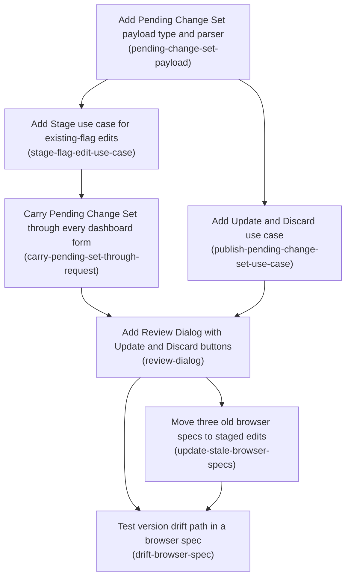

# Horizon 27 — Staged pending changes for flag edits

## 🎯 What are we trying to achieve?

Right now, every time you change a flag in the dashboard and hit save, that change is published straight to S3 as a brand-new version. This horizon changes that for one form only — editing an existing flag. Your edits collect into a **Pending Change Set** that travels with the page, you review them in a dialog, and one **Update** click publishes them all as a single new version. If someone else published while you were working, the dialog warns you and lets you publish anyway or throw your draft away.

## 🧠 Why does this change need to happen?

Publishing on every keystroke-level save means a handful of related edits become a handful of separate versions, each one a separate chance to collide with someone else's work, and there is no moment where you can look at what you are about to do before it is done. Staging gives the operator a review step and gives the version history one entry per intent instead of one per form submit.

## At a glance

- **Phases:** 7 (revision 1 added *Move three old browser specs to staged edits* after verification found the CI browser suite red)
- **Complexity:** Medium — small domain and application pieces, but two infrastructure phases touch the shared route closure and every form on the page
- **Main risk:** every rendered form must echo the draft losslessly; miss one and the operator's staged work silently disappears (the same class of bug horizon 25 hit with URL state)
- **Quality target:** 100% line/branch/function/statement coverage from unit tests alone, ESLint layer boundaries clean, and the other seven write surfaces behaviourally unchanged
- **Testing focus:** no-storage-write assertions with spy counts, exact-HTML view assertions, request-level version-delta assertions, and one Playwright spec for the drift path

## Order of work

1. **Add Pending Change Set payload type and parser** — nothing to wait for; it can start immediately.
2. **Add Stage use case for existing-flag edits** — comes after *Add Pending Change Set payload type and parser*, because it consumes what that phase produces.
3. **Add Update and Discard use case** — comes after *Add Pending Change Set payload type and parser*, because it consumes what that phase produces.
4. **Carry Pending Change Set through every dashboard form** — comes after *Add Stage use case for existing-flag edits*, because it consumes what that phase produces.
5. **Add Review Dialog with Update and Discard buttons** — comes after *Carry Pending Change Set through every dashboard form* and *Add Update and Discard use case*, because it consumes what that phase produces.
6. **Move three old browser specs to staged edits** — comes after *Add Review Dialog with Update and Discard buttons*, because it moves the older specs onto the flow that phase completes.
7. **Test version drift path in a browser spec** — comes after *Add Review Dialog with Update and Discard buttons* and *Move three old browser specs to staged edits* (a CI-gate ordering, not a data dependency), because it consumes what that phase produces.

## Implementation plan

### Phase 1 — Add Pending Change Set payload type and parser

Technical ID: `pending-change-set-payload` · bounded context: Dashboard flag authoring · layer: domain · blast radius: small

**Goal** — Create a pure TypeScript module that defines the Pending Change Set (the accumulated, not-yet-published snapshot of staged flag edits plus the Base Version it started from) and converts it to and from the single hidden-form-field string that carries it through the request cycle.

**Why** — The dashboard is a stateless local web server: it keeps nothing in memory between requests, so an operator's unpublished edits have to travel back and forth inside the HTML form itself. Before any form or route can carry those edits, there must be one agreed data shape and one agreed way to turn it into text and back. Doing this first means every later piece reads and writes the same thing.

**Changes**

- Define a `PendingChangeSet` type holding `baseVersion` (the snapshot version number the draft started from) and `snapshot` (the accumulated snapshot JSON object after all staged edits have been applied), mirroring the object shape that `applyFlagEdit` in packages/dashboard/src/domain/flag-edit.ts already returns.
- Add `serializePendingChangeSet(set): string` producing the exact text that will sit in the hidden field, and `parsePendingChangeSet(raw: string | undefined): PendingChangeSet | undefined`.
- Make parsing NEVER throw: an absent, empty, malformed, oversized or hand-tampered value returns `undefined` (meaning 'no pending changes'), following the same deliberate fallback discipline documented in packages/dashboard/src/infrastructure/url-state.ts:79-84, so a bad field can never turn into a 400 error page.
- Reject payloads over an explicit byte budget well under the 1 MiB request-body cap enforced by `readForm` in packages/dashboard/src/infrastructure/http-primitives.ts, returning `undefined` rather than letting the request reach the 413 path.
- Import nothing from the application or infrastructure folders, which the repository's ESLint boundary rules (eslint.config.js:50-66) forbid for domain code.
- Cover every branch with unit tests so the repository-wide 100% coverage thresholds in vitest.config.ts stay green.

**Files / areas**

- `packages/dashboard/src/domain/pending-change-set.ts`
- `packages/dashboard/src/domain/pending-change-set.test.ts`

**How to verify**

- **Parse never throws on hostile input** — The test file in packages/dashboard/src/domain/pending-change-set.test.ts calls the parse function with each of: undefined, an empty string, a string of random characters, and a string that decodes to valid JSON but is missing baseVersion or snapshot, and asserts the result is undefined each time
- **Explicit byte budget well under 1 MiB** — A named numeric constant for the maximum payload size appears in packages/dashboard/src/domain/pending-change-set.ts and its value is less than 1048576
- **Serialize/parse round-trip preserves the set** — A test builds a Pending Change Set containing a snapshot with at least two flags and a nested object/array value, serializes it, parses it back, and asserts deep equality with the original
- **Domain layer purity** — Every import line in packages/dashboard/src/domain/pending-change-set.ts resolves inside packages/dashboard/src/domain/
- **Full branch coverage of the new module** — The unit-test coverage run reports 100% lines, branches, functions and statements for packages/dashboard/src/domain/pending-change-set.ts

**Done when** — packages/dashboard/src/domain/pending-change-set.ts exporting the Pending Change Set type with its serialize and never-throwing parse functions, fully unit-tested. And every check under *How to verify* passes its bar.

**Depends on** — nothing — can start immediately

Reference — full rubric

| Dimension | Rule | Pass criteria | Failure examples | minScore |
|---|---|---|---|---|
| **Parse never throws on hostile input** (`never-throwing-parse`) | parsePendingChangeSet must return undefined — never throw, never return a partially-built object — for every non-conforming input; 10 means the test file enumerates absent/empty/non-string-shaped/malformed-encoding/valid-encoding-but-wrong-JSON-shape/oversize and each asserts exactly undefined, 8 means the common malformed cases are covered by explicit assertions, minScore is the bar for ACCEPTABLE. | • The test file in packages/dashboard/src/domain/pending-change-set.test.ts calls the parse function with each of: undefined, an empty string, a string of random characters, and a string that decodes to valid JSON but is missing baseVersion or snapshot, and asserts the result is undefined each time • No `throw` statement appears in the parse function, and any JSON.parse/decode call is wrapped so its exception cannot escape • Running `npx vitest run packages/dashboard/src/domain/pending-change-set.test.ts` passes with no unhandled-rejection or thrown-error output | • The author wraps JSON.parse in try/catch but decodes the field (base64/URI decode) outside the try, so a tampered value still throws a URIError • Parse returns an object whose snapshot is `undefined` when the JSON decodes but lacks the snapshot key, instead of returning undefined for the whole set • Only `undefined` and `''` are tested; a string of random characters is never passed in | 7 |
| **Explicit byte budget well under 1 MiB** (`byte-budget-guard`) | The module must reject oversized payloads at an explicit named byte constant strictly below the 1 MiB readForm cap, so the request never reaches the 413 path; 10 means the constant is named, exported or documented with a comment tying it to the 1 MiB cap, and tested at both sides of the boundary; 8 means a named constant with one over-budget test; minScore is the bar for ACCEPTABLE. | • A named numeric constant for the maximum payload size appears in packages/dashboard/src/domain/pending-change-set.ts and its value is less than 1048576 • A test feeds a string longer than that constant to the parse function and asserts undefined • A test feeds a string at or just under the limit that is otherwise valid and asserts it parses successfully (not undefined) | • The size check is written as a bare `raw.length > 500000` inline with no named constant, so no reader can tell it relates to the 1 MiB cap • Length is measured in JS string characters while the cap it guards is a byte cap, and no test uses multi-byte characters to expose the gap • Only the over-budget rejection is tested; nothing proves a payload just under the limit still parses, so an off-by-one that rejects everything would pass | 7 |
| **Serialize/parse round-trip preserves the set** (`round-trip-fidelity`) | serializePendingChangeSet followed by parsePendingChangeSet must return a value deep-equal to the original, including baseVersion numeric type and nested snapshot structure; 10 means the round-trip is proven on a realistic multi-flag snapshot with nested values, 8 means a non-trivial snapshot with more than one key; minScore is the bar for ACCEPTABLE. | • A test builds a Pending Change Set containing a snapshot with at least two flags and a nested object/array value, serializes it, parses it back, and asserts deep equality with the original • The parsed baseVersion is asserted to be the same type as the input (a number stays a number, not a string) • The serialized output is a single string containing no raw newline or double-quote characters that would break an HTML `value="..."` attribute, or the test asserts the safe-character property explicitly | • Round-trip is tested with `{baseVersion: 1, snapshot: {}}` only, so a serializer that drops nested keys still passes • The serializer emits raw JSON, which round-trips in the unit test but breaks once embedded in an HTML attribute; nothing in the tests catches it • baseVersion comes back as a string after the round-trip and the test uses toEqual on a loosely-built fixture that hides it | 7 |
| **Domain layer purity** (`domain-purity`) | The deliverable is domain code and must import nothing from application or infrastructure and carry no HTTP/HTML/S3 concern; 10 means its only imports are same-layer domain modules and Node-free standard values, 8 means no boundary violation and no transport vocabulary in the public API; minScore is the bar for ACCEPTABLE. | • Every import line in packages/dashboard/src/domain/pending-change-set.ts resolves inside packages/dashboard/src/domain/ • `npx eslint packages/dashboard/src/domain/pending-change-set.ts` reports no import-x/no-restricted-paths error • No exported function takes a request, response, form, or S3/storage object as a parameter, and no HTML string is produced by the module | • The author imports an escaping helper from src/infrastructure/views to make the string attribute-safe, which is exactly the inward dependency ESLint forbids • The parse function accepts the whole parsed form record and picks the field out itself, pulling HTTP form vocabulary into domain • A type is imported from src/application for the result shape rather than declared locally | 8 |
| **Full branch coverage of the new module** (`branch-coverage-holds`) | The new module must keep the repo's 100% line/branch/function/statement gate green from unit tests alone, since e2e and integration runs contribute no coverage; 10 means every guard clause has both a taken and a not-taken test, 8 means the coverage run reports 100% on this file; minScore is the bar for ACCEPTABLE. | • The unit-test coverage run reports 100% lines, branches, functions and statements for packages/dashboard/src/domain/pending-change-set.ts • No `/* istanbul ignore */`, `/* v8 ignore */` or equivalent coverage-suppression comment appears in the new source file • Each `if`/ternary/`??`/optional-chain in the source has at least one test exercising each side | • A defensive `?? undefined` fallback is unreachable from any test, so the author silences it with a v8 ignore comment instead of removing the dead branch • Branch coverage sits at 100% for lines but a `typeof raw !== 'string'` guard is never exercised because all tests pass strings or undefined • Coverage is claimed from a full-suite run that includes e2e, which contributes nothing, masking an uncovered branch | 8 |

**Healer hint:** The usual miss is a decode or size check sitting outside the try/catch (or measured in characters rather than bytes) — move every decoding step inside the guarded block, name the byte budget as a constant, and add the just-under-limit and multi-byte tests.

### Phase 2 — Add Stage use case for existing-flag edits

Technical ID: `stage-flag-edit-use-case` · bounded context: Dashboard flag authoring · layer: application · blast radius: small

**Goal** — Add an application use case that takes a submitted edit to an existing flag plus the current Pending Change Set and returns an updated Pending Change Set, without writing anything to S3.

**Why** — Today, submitting the edit form for an existing flag immediately publishes a new snapshot version to storage. The staged model needs a single place that instead folds that edit into the operator's accumulated draft and validates it right away, so an invalid edit can never get into the draft and surface only much later at publish time.

**Changes**

- Implement `stageFlagEdit(ports, environment, edit, pending | undefined)`: when there is no Pending Change Set yet, read the environment's current snapshot text and its version to seed a new set whose Base Version is that version; otherwise apply the edit on top of the set's accumulated snapshot.
- Apply each edit through the existing pure `applyFlagEdit` helper (packages/dashboard/src/domain/flag-edit.ts:77-100) so the accumulated snapshot is re-validated at every stage step.
- Return the same success/failure result shape the existing write use cases return, so the HTTP layer's existing notice and status-code handling needs no new cases.
- Never call `publishExpecting` or any storage write; leave packages/dashboard/src/application/edit-feature.ts (and its automatic replay-on-conflict behaviour) completely untouched, because the other seven write surfaces still use it.
- Unit-test seeding a new set, accumulating a second edit onto an existing set, and rejecting an invalid edit, to keep 100% coverage.

**Files / areas**

- `packages/dashboard/src/application/stage-flag-edit.ts`
- `packages/dashboard/src/application/stage-flag-edit.test.ts`

**How to verify**

- **Staging performs zero storage writes** — Grep of packages/dashboard/src/application/stage-flag-edit.ts finds no reference to publishExpecting, replayOnLatest, editFeature, or any port method whose name writes/puts/saves
- **Seeding versus accumulating are distinct and correct** — A test with `pending` undefined asserts the returned set's baseVersion equals the version the read-stub returned
- **Invalid edits are rejected at stage time** — A test stages an edit that applyFlagEdit rejects and asserts the returned result is the failure variant with a message
- **Result shape matches existing write use cases** — The success and failure object keys returned by stageFlagEdit match those returned by packages/dashboard/src/application/edit-feature.ts field for field
- **Application layer boundary respected** — No import in packages/dashboard/src/application/stage-flag-edit.ts resolves into src/infrastructure/

**Done when** — packages/dashboard/src/application/stage-flag-edit.ts exporting a `stageFlagEdit` use case that returns an updated Pending Change Set and performs no storage write, fully unit-tested. And every check under *How to verify* passes its bar.

**Depends on** — Add Pending Change Set payload type and parser

Reference — full rubric

| Dimension | Rule | Pass criteria | Failure examples | minScore |
|---|---|---|---|---|
| **Staging performs zero storage writes** (`no-storage-write`) | stageFlagEdit must never invoke a write on the storage ports — no publishExpecting, no put, no replay — and its tests must prove it with assertions on a spy, not merely by absence; 10 means the test asserts every write-capable port method has zero calls, 8 means publish/write spies are asserted not-called on both the seeding and the accumulating path; minScore is the bar for ACCEPTABLE. | • Grep of packages/dashboard/src/application/stage-flag-edit.ts finds no reference to publishExpecting, replayOnLatest, editFeature, or any port method whose name writes/puts/saves • A unit test asserts the write-capable port stub was called zero times after a successful stage • A unit test does the same for the second-edit-onto-existing-set path, not only for the first edit | • The use case reads the current snapshot via a shared helper that also touches a write port for a lock or bookkeeping, and nothing asserts the write spy count • Tests pass a ports object with the write method omitted entirely, so an accidental write would throw a confusing TypeError rather than fail a clear assertion — and only the seeding path is covered • The author reuses editFeature internally with a flag to suppress publishing, bringing the auto-replay path back into reach | 8 |
| **Seeding versus accumulating are distinct and correct** (`seed-vs-accumulate`) | With no Pending Change Set the use case must read the environment's current snapshot and version to seed Base Version; with one present it must apply onto the set's accumulated snapshot and leave Base Version untouched; 10 means a test asserts the environment read does NOT happen on the accumulate path, 8 means both paths are tested for their resulting baseVersion; minScore is the bar for ACCEPTABLE. | • A test with `pending` undefined asserts the returned set's baseVersion equals the version the read-stub returned • A test with an existing set whose baseVersion is, say, 3 and an environment whose current version is 7 asserts the returned baseVersion is still 3 • A test asserts the snapshot-read port was not called when a Pending Change Set was supplied | • The use case unconditionally reads the current version and only uses it when seeding, so baseVersion is right but a needless S3 read happens on every keystroke-level stage and nothing catches it • The accumulate path applies the edit to the freshly-read environment snapshot instead of the set's accumulated snapshot, silently discarding the first staged edit; the test only ever stages one edit so it passes • Base Version is re-derived from the current version on every call, defeating drift detection later | 8 |
| **Invalid edits are rejected at stage time** (`invalid-edit-rejected-at-stage`) | An edit that applyFlagEdit rejects must produce a failure result and leave the incoming Pending Change Set unmodified, so no invalid state enters the draft; 10 means the test asserts the original set object is returned or unchanged in addition to the failure, 8 means the failure result is asserted; minScore is the bar for ACCEPTABLE. | • A test stages an edit that applyFlagEdit rejects and asserts the returned result is the failure variant with a message • The same test asserts the previously staged set still contains the earlier valid edit and none of the invalid one • Validation happens through the existing applyFlagEdit helper from src/domain/flag-edit.ts, not a re-implemented check in this file | • The failure result is returned but the accumulated snapshot was mutated in place before validation, so the caller echoes a corrupted draft back into the hidden field • The use case validates only the incoming edit fields itself and never runs the accumulated snapshot back through applyFlagEdit, so an edit that is valid alone but invalid in combination slips in • Only the happy path and a missing-flag case are tested; a schema-invalid value is never staged | 7 |
| **Result shape matches existing write use cases** (`result-shape-compatibility`) | The returned result must use the same success/failure discriminator and field names as the existing write use cases so the HTTP layer needs no new branches; 10 means the shape is expressed via a type imported or structurally identical to edit-feature's and a test asserts the discriminant field by name, 8 means the field names match on inspection; minScore is the bar for ACCEPTABLE. | • The success and failure object keys returned by stageFlagEdit match those returned by packages/dashboard/src/application/edit-feature.ts field for field • A unit test asserts the discriminant property by its literal name and value on both a success and a failure • No new error class or exception is thrown out of the use case for an expected failure | • The author returns `{ ok: true, pending }` while the existing use cases return `{ status: 'ok', ... }`, forcing an extra branch in http-server later • Failure is signalled by throwing, which the existing notice handling does not catch, so the route turns a bad edit into a 500 • The shapes match but the failure message field is named differently, so the notice renders blank | 7 |
| **Application layer boundary respected** (`application-layer-boundary`) | This application-layer deliverable may import domain but must not import infrastructure nor embed HTTP/HTML/S3-client specifics; storage access goes only through the injected ports parameter; 10 means every dependency is either a domain import or reached via `ports`, 8 means no boundary violation; minScore is the bar for ACCEPTABLE. | • No import in packages/dashboard/src/application/stage-flag-edit.ts resolves into src/infrastructure/ • `npx eslint packages/dashboard/src/application/stage-flag-edit.ts` reports no import-x/no-restricted-paths error • Every storage read in the function body goes through the `ports` argument rather than a module-level client or a direct SDK call | • A type used for the environment or snapshot is imported from src/infrastructure because that is where it happened to be declared, tripping the boundary rule • The function parses the hidden-field string itself by importing the form-reading helper from infrastructure instead of receiving an already-parsed Pending Change Set • A default S3 client is imported at module scope for a 'convenience' fallback when ports lacks a reader | 8 |

**Healer hint:** The common failure is the accumulate path re-reading the environment snapshot (losing earlier staged edits or resetting Base Version) — branch explicitly on whether a Pending Change Set was supplied, and add a test where current version differs from baseVersion.

### Phase 3 — Add Update and Discard use case

Technical ID: `publish-pending-change-set-use-case` · bounded context: Dashboard flag authoring · layer: application · blast radius: small

**Goal** — Add an application use case that publishes a whole Pending Change Set to storage as exactly one new snapshot version, reports whether the environment's version has moved under the draft, and supports discarding the draft without writing anything.

**Why** — Staged edits eventually have to reach storage, and they must land as a single new version rather than one per edit. If someone else published to the same environment while the draft was open, the operator must be told and allowed to decide, instead of the system silently rewriting their edits onto the newer version.

**Changes**

- Add `detectVersionDrift(ports, environment, pending)` returning whether the environment's current version differs from the Pending Change Set's Base Version, by reading the current version only (no write).
- Add `publishPendingChangeSet(ports, environment, pending, { force })` that calls the existing `publishExpecting` (packages/dashboard/src/application/publish-snapshot.ts:67-100) once with the accumulated snapshot — passing the Base Version normally, and passing `undefined` when `force` is set, which is already how that function skips the version expectation and so is exactly the 'publish anyway' behaviour.
- Do not call `replayOnLatest` or any automatic replay path; a drifted draft is either published as-is on the operator's explicit choice or discarded.
- Express Discard as returning no Pending Change Set and performing no storage call at all, so the caller simply stops echoing the hidden field.
- Unit-test: clean publish against the Base Version, drift detected, forced publish after drift, and discard.

**Files / areas**

- `packages/dashboard/src/application/publish-pending-change-set.ts`
- `packages/dashboard/src/application/publish-pending-change-set.test.ts`

**How to verify**

- **Update publishes exactly one version** — A unit test with a Pending Change Set containing at least two staged flag changes asserts the publish spy was called exactly once
- **Publish-anyway uses the undefined-expectation primitive** — A test with force true asserts the publish spy received `undefined` as its version-expectation argument
- **No automatic replay path is reachable** — Grep of packages/dashboard/src/application/publish-pending-change-set.ts finds no reference to replayOnLatest, editFeature, or a rebase/merge helper
- **Discard touches no port** — A unit test invokes the discard path and asserts the returned Pending Change Set is undefined/absent
- **Drift detection compares versions correctly at the edges** — Tests cover current === base (no drift), current > base (drift), and the case where the environment has no current version yet
- **Application layer boundary respected** — No import in packages/dashboard/src/application/publish-pending-change-set.ts resolves into src/infrastructure/

**Done when** — packages/dashboard/src/application/publish-pending-change-set.ts exporting drift detection plus a single-version Update publish (with a force option) and Discard, fully unit-tested. And every check under *How to verify* passes its bar.

**Depends on** — Add Pending Change Set payload type and parser

**Rollback** — The use case only ever calls the existing publish path; an unwanted published version is undone with the dashboard's existing rollback, which this horizon does not change.

Reference — full rubric

| Dimension | Rule | Pass criteria | Failure examples | minScore |
|---|---|---|---|---|
| **Update publishes exactly one version** (`single-version-publish`) | publishPendingChangeSet must call publishExpecting exactly once with the whole accumulated snapshot regardless of how many edits were staged; 10 means a test stages three edits and asserts the call count is 1 and the payload contains all three, 8 means call count 1 asserted with a multi-edit snapshot; minScore is the bar for ACCEPTABLE. | • A unit test with a Pending Change Set containing at least two staged flag changes asserts the publish spy was called exactly once • The same test asserts the snapshot argument handed to publish contains both changes • No loop or per-edit iteration issuing a publish appears in packages/dashboard/src/application/publish-pending-change-set.ts | • The implementation is correct but every test uses a single-flag set, so a per-edit publish loop introduced later would not be caught • The accumulated snapshot is rebuilt by re-applying edits against the freshly read current snapshot before publishing, which is a silent auto-replay wearing a different name • publish is called once but with the base snapshot rather than the accumulated one, and the test only asserts the call count | 8 |
| **Publish-anyway uses the undefined-expectation primitive** (`force-uses-undefined-expectation`) | With force set, the use case must call publishExpecting with `undefined` as the version expectation — the repo's existing publish-anyway primitive — and with the Base Version otherwise; 10 means both branches assert the exact fourth argument value, 8 means the force branch asserts undefined; minScore is the bar for ACCEPTABLE. | • A test with force true asserts the publish spy received `undefined` as its version-expectation argument • A test with force absent/false asserts the publish spy received the Pending Change Set's baseVersion as that argument • No alternative force mechanism (deleting the expectation elsewhere, catching and retrying a conflict error) appears in the file | • Force is implemented by catching the version-conflict failure from a normal publish and retrying, which is a retry loop rather than the intended single publish-anyway call • The force branch passes the environment's freshly read current version instead of undefined — it works today but re-introduces a race between the read and the write • Only the force-true case is tested, so a bug passing undefined in both branches silently disables all version checking | 8 |
| **No automatic replay path is reachable** (`no-auto-replay`) | A drifted draft must be published as-is on explicit choice or discarded — replayOnLatest and any equivalent rebase-onto-newest must be unreachable from this module; 10 means a test proves that after drift with force false the use case returns a failure/drift result and publishes nothing, 8 means grep shows no replay reference and drift detection is tested; minScore is the bar for ACCEPTABLE. | • Grep of packages/dashboard/src/application/publish-pending-change-set.ts finds no reference to replayOnLatest, editFeature, or a rebase/merge helper • A test where the current version differs from baseVersion and force is not set asserts the publish spy was never called or that the result reports the conflict without a second publish attempt • detectVersionDrift performs only a version read: no snapshot write, no snapshot mutation | • The author imports editFeature to reuse its conflict handling, which drags its replayOnLatest auto-replay into the staged path • On a version-conflict failure from publishExpecting the code helpfully re-reads the latest snapshot and re-applies the staged edits, which is auto-replay by another name • detectVersionDrift is implemented by attempting a publish and inspecting the error, so 'detection' can itself write | 8 |
| **Discard touches no port** (`discard-writes-nothing`) | Discard must return an absent Pending Change Set and make no storage call of any kind, including reads for logging or confirmation; 10 means a test asserts every port stub method has zero calls, 8 means the write spy is asserted not-called and the returned set is undefined; minScore is the bar for ACCEPTABLE. | • A unit test invokes the discard path and asserts the returned Pending Change Set is undefined/absent • The same test asserts the publish spy call count is 0 • The test also asserts no read port was called during discard | • Discard re-reads the current snapshot to build a confirmation notice, so an offline or erroring S3 turns a discard into an error page • Discard returns an empty-but-present set object, so the hidden field keeps being echoed as an empty draft and the Review Dialog trigger never disappears • Only the return value is asserted; nothing prevents a future write from creeping in | 7 |
| **Drift detection compares versions correctly at the edges** (`drift-detection-boundaries`) | detectVersionDrift must report drift only when the current version has actually moved from the Base Version, handling equal, ahead, and missing/first-version cases without type coercion surprises; 10 means all three cases are tested with explicit expected booleans, 8 means equal and ahead are tested; minScore is the bar for ACCEPTABLE. | • Tests cover current === base (no drift), current > base (drift), and the case where the environment has no current version yet • Comparison uses strict equality/inequality on like-typed values, with no `==` and no implicit string-to-number coercion in the comparison expression • detectVersionDrift is exported and callable without performing a publish | • The version arrives as a string from the storage stub in one test and a number in another; `!==` then reports drift for '3' vs 3 and nobody notices because the tests use matching types • An environment with no published version yet is treated as drift, so a first-ever staged edit warns spuriously • Drift is computed as `current > base` only, so an unexpected rollback to a lower version is silently treated as no drift | 7 |
| **Application layer boundary respected** (`application-layer-boundary-publish`) | This application module must import domain and sibling application modules only, reaching storage solely through injected ports; 10 means no infrastructure import and no transport vocabulary in the signature, 8 means no boundary violation; minScore is the bar for ACCEPTABLE. | • No import in packages/dashboard/src/application/publish-pending-change-set.ts resolves into src/infrastructure/ • `npx eslint` on that file reports no import-x/no-restricted-paths error • The exported functions take the Pending Change Set and an options object — not a request, form record, or raw hidden-field string | • The use case accepts the raw hidden-field string and parses it by importing the infrastructure form helper, coupling it to HTTP • A notice/HTML string is built inside the use case for the drift warning instead of returning a drift flag for the view to render • An S3 client type is imported from infrastructure purely for a parameter annotation, which still trips the boundary rule | 8 |

**Healer hint:** The most likely miss is implementing publish-anyway as a catch-and-retry or a re-read of the latest version instead of passing `undefined` to publishExpecting — pass undefined directly and assert that exact argument in both force branches.

### Phase 4 — Carry Pending Change Set through every dashboard form

Technical ID: `carry-pending-set-through-request` · bounded context: Dashboard flag authoring · layer: infrastructure · blast radius: medium

**Goal** — Make the existing-flag edit route stage instead of publish, and make every rendered form on the environment page echo the Pending Change Set hidden field and the frozen Base Version so a staged draft survives any subsequent request.

**Why** — Because the draft lives only inside the page's HTML, every form the operator might submit next has to hand the draft back to the server, or the staged work silently disappears. The version the draft started from must also stay frozen on those forms; otherwise it would keep tracking the newest published version and drift could never be noticed.

**Changes**

- In the shared edit route closure (packages/dashboard/src/infrastructure/http-server.ts:300-330), parse the incoming hidden Pending Change Set field and, for the existing-flag edit case only, call `stageFlagEdit` instead of `editFeature`; keep the create-flag POST on that same shared closure publishing immediately as it does today.
- Add the new field to the page state and the form context: extend `WriteFormContext` (built once in packages/dashboard/src/infrastructure/views/feature-edit-form.ts:59-63) with a `pendingInputs` string, and append it AFTER the existing `stateInputs` in each form so current tests asserting the exact hidden-input sequence keep passing.
- Amend the three forms that build their inputs independently — the filter form and publish-dialog form in packages/dashboard/src/infrastructure/views/environment-page.ts (lines 51 and 97) and packages/dashboard/src/infrastructure/views/new-flag-form.ts:40 — to emit the same hidden field; missing one drops the draft.
- When a Pending Change Set exists, seed the edit context's base version from the set's frozen Base Version rather than from the currently rendered version (packages/dashboard/src/infrastructure/views/environment-page.ts:61).
- Add no new selectors or draft logic to packages/dashboard/src/infrastructure/views/scripts/app.js, which is outside the coverage gate.
- Extend the existing request-level tests (packages/dashboard/src/infrastructure/http-server.test.ts and test/infrastructure/state-echo.test.ts) to prove an edit submit publishes no new version and that a following unrelated form submit still carries the draft.

**Files / areas**

- `packages/dashboard/src/infrastructure/http-server.ts`
- `packages/dashboard/src/infrastructure/views/state-fields.ts`
- `packages/dashboard/src/infrastructure/views/feature-edit-form.ts`
- `packages/dashboard/src/infrastructure/views/environment-page.ts`
- `packages/dashboard/src/infrastructure/views/new-flag-form.ts`

**How to verify**

- **All forms round-trip the hidden field** — A test renders the environment page with a Pending Change Set present and asserts the number of occurrences of the pending hidden-input name equals the page's form count (the existing suite asserts toHaveLength(9) forms)
- **Existing hidden-input sequence unchanged** — The git diff of the view test files shows no reordering or rewriting of the existing VIEWED_INPUTS hidden-input expectations — only appended content
- **Existing-flag edit publishes nothing** — A request-level test in packages/dashboard/src/infrastructure/http-server.test.ts submits an existing-flag edit and asserts the environment's snapshot version is identical before and after
- **Base Version stays frozen on re-render** — A test renders the environment page with a Pending Change Set whose baseVersion is older than the environment's current version and asserts the rendered form's version field equals the older baseVersion
- **No draft logic in the uncovered client script** — `git diff -- packages/dashboard/src/infrastructure/views/scripts/app.js` is empty, or shows no reference to the pending field, drafts, or review
- **The other seven write surfaces still publish immediately** — `git diff -- packages/dashboard/src/application/edit-feature.ts` shows no behavioural change

**Done when** — An existing-flag edit submit stages into the Pending Change Set and every environment-page form round-trips it, proven by request-level tests showing no new snapshot version is published on edit. And every check under *How to verify* passes its bar.

**Depends on** — Add Stage use case for existing-flag edits

Reference — full rubric

| Dimension | Rule | Pass criteria | Failure examples | minScore |
|---|---|---|---|---|
| **All forms round-trip the hidden field** (`every-form-echoes-the-field`) | Every form rendered on the environment page — including the filter form, the publish-dialog form, and the new-flag form that build inputs independently — must emit the Pending Change Set hidden input, because one omission silently drops the draft; 10 means a test enumerates the forms and asserts the field count equals the form count, 8 means each of the three independent forms is individually asserted; minScore is the bar for ACCEPTABLE. | • A test renders the environment page with a Pending Change Set present and asserts the number of occurrences of the pending hidden-input name equals the page's form count (the existing suite asserts toHaveLength(9) forms) • The filter form, the publish-dialog form and the new-flag form each have an assertion showing the hidden input inside their own markup • With no Pending Change Set present, the page renders no pending hidden input (or an empty one) and the existing exact-HTML view tests still pass | • The author threads the field through WriteFormContext and every per-flag edit form gets it, but the filter form at environment-page.ts builds its own inputs and is missed — the draft vanishes the moment the operator filters • The field is emitted on all forms including when no draft exists, changing the exact rendered HTML for the default case and breaking the existing string-equality view tests • A count assertion is written against a hardcoded number that happens to match today, so adding a form later silently reintroduces the gap | 8 |
| **Existing hidden-input sequence unchanged** (`hidden-input-ordering-preserved`) | The new input must be appended AFTER the existing stateInputs so the exact rendered-HTML assertions and the VIEWED_INPUTS sequence keep passing unmodified; 10 means the existing view tests pass with no edits to their expected strings beyond appending the new field, 8 means they pass and the diff shows no reordering of prior inputs; minScore is the bar for ACCEPTABLE. | • The git diff of the view test files shows no reordering or rewriting of the existing VIEWED_INPUTS hidden-input expectations — only appended content • `npx vitest run packages/dashboard/src/infrastructure/views` passes • The pending input appears after, never between, the pre-existing state hidden inputs in the rendered output | • The new field is inserted first because it felt more important, and the author then rewrites every expected HTML string in the view tests to match — the tests pass but the regression guard was edited away • The field is appended, but a stray newline or differing attribute-quote style changes whitespace in the exact-string assertions and the author fixes it by trimming in the test rather than in the renderer • toHaveLength(9) is bumped to 10 because a new form was added, when the phase called for no new form here | 8 |
| **Existing-flag edit publishes nothing** (`edit-stages-not-publishes`) | A POST that edits an existing flag must route to stageFlagEdit and produce no new snapshot version, while the create-flag POST on the same shared closure still publishes immediately; 10 means one request-level test proves the version is unchanged after edit and a sibling proves create still bumps it, 8 means the no-new-version assertion exists for edit; minScore is the bar for ACCEPTABLE. | • A request-level test in packages/dashboard/src/infrastructure/http-server.test.ts submits an existing-flag edit and asserts the environment's snapshot version is identical before and after • A request-level test submits the create-flag form on the same route and asserts the version increased by exactly one • The response to the edit submit contains a non-empty Pending Change Set hidden field carrying the staged change | • The route branches on the presence of an existing flag id, but the create form also sends that field when pre-populated, so creating a flag silently stages instead of publishing and no test distinguishes them • The edit path stages correctly but the route still falls through to the old publish call on an unrelated button value, producing both a staged draft and a published version • The test asserts a 200 response and the presence of the hidden field but never checks the stored version, so an extra publish goes unnoticed | 8 |
| **Base Version stays frozen on re-render** (`base-version-frozen`) | When a Pending Change Set exists the edit context's base version must come from the set's frozen Base Version, not from the currently rendered version, otherwise drift can never be detected; 10 means a test renders after the environment has moved ahead and asserts the form still carries the original Base Version, 8 means the sourcing is asserted in a view or request test; minScore is the bar for ACCEPTABLE. | • A test renders the environment page with a Pending Change Set whose baseVersion is older than the environment's current version and asserts the rendered form's version field equals the older baseVersion • With no Pending Change Set, the rendered version field still equals the current version (previous behaviour preserved) • The value is read from the parsed Pending Change Set in environment-page.ts, not recomputed from the page's version variable | • The base version is sourced from the set, but only where the edit form is built; the publish-dialog form still emits the live current version, so a drifted publish silently expects the wrong version • The render helper defaults to the current version when the set's baseVersion is falsy, and version 0 is treated as absent • Only the no-drift scenario is rendered in tests, so freezing is never actually observed | 7 |
| **No draft logic in the uncovered client script** (`no-client-script-draft-logic`) | packages/dashboard/src/infrastructure/views/scripts/app.js sits outside the 100% coverage gate and must gain no Pending Change Set logic, selector, or storage use; 10 means the file is byte-identical in the diff, 8 means any change is unrelated to drafts and trivially inspectable; minScore is the bar for ACCEPTABLE. | • `git diff -- packages/dashboard/src/infrastructure/views/scripts/app.js` is empty, or shows no reference to the pending field, drafts, or review • Grep of app.js finds no localStorage, sessionStorage, or IndexedDB use • The draft survives a form submit with JavaScript disabled (the hidden input is present in the server-rendered HTML, not injected by script) | • A one-line listener is added to app.js to re-copy the draft into forms that were missed server-side, hiding a server-render gap behind uncovered client code • localStorage is used to 'back up' the draft against accidental navigation, which contradicts the hidden-field-only requirement • The hidden input is written into forms by client script at load time, so submitting with scripts disabled loses the draft entirely | 9 |
| **The other seven write surfaces still publish immediately** (`other-write-surfaces-untouched`) | Only the edit-existing-flag surface becomes staged; the other seven forms and packages/dashboard/src/application/edit-feature.ts must keep their immediate-publish behaviour and remain functionally unchanged; 10 means edit-feature.ts is untouched in the diff and each remaining surface has a passing unchanged test, 8 means edit-feature.ts is untouched and the pre-existing suite passes unmodified for those surfaces; minScore is the bar for ACCEPTABLE. | • `git diff -- packages/dashboard/src/application/edit-feature.ts` shows no behavioural change • The pre-existing tests for the non-edit write surfaces pass with no edits to their expectations • A request-level test for at least one other write surface (e.g. create flag or a segment write) asserts it still produces a new snapshot version on submit | • A shared helper used by all eight surfaces is refactored to accept an optional pending set, and a defaulting mistake makes a second surface stage silently • edit-feature.ts is left alone but its call site is wrapped in a new dispatcher whose fallback branch is never exercised, so a mistyped button value now stages a segment edit • The other surfaces' tests were adjusted to accommodate the new hidden field's presence in ways that also relaxed their version assertions | 8 |

**Healer hint:** The classic failure is missing one of the three independently-built forms (filter, publish-dialog, new-flag) so the draft disappears on the next submit — assert the pending-input count equals the page's form count rather than checking forms one by one.

### Phase 5 — Add Review Dialog with Update and Discard buttons

Technical ID: `review-dialog` · bounded context: Dashboard flag authoring · layer: infrastructure · blast radius: medium

**Goal** — Render a Review Dialog that lists the staged changes, warns when the environment's version has moved under the draft, and offers Update or Discard as ordinary form submissions handled by the server.

**Why** — An operator needs to see what they have staged before anything is written, and to be told when someone else published in the meantime. Reusing the project's existing modal shell keeps the dialog working as a plain inline card when JavaScript is unavailable, so the two buttons must be real form submits rather than script-driven.

**Changes**

- Add `renderReviewDialog(...)` built on the existing `renderModalDialog` / `renderDialogTrigger` helpers (packages/dashboard/src/infrastructure/views/modal-dialog.ts), following the form-inside-a-dialog pattern of packages/dashboard/src/infrastructure/views/confirm-dialog.ts:27-32 so no JavaScript is required.
- Build the human-readable change list by calling the existing `diffFlags` helper (packages/dashboard/src/domain/snapshot-diff.ts:42) on the base snapshot versus the accumulated snapshot; do not reuse `changes-dialog.ts`, whose wording and buttons mean 'someone else changed this under you'.
- Render a plain warning line, plus a publish-anyway submit and a Discard submit, when drift is detected; never disable or hide the Update button.
- Show the dialog's trigger in the flags section header next to the existing New-flag trigger (packages/dashboard/src/infrastructure/views/environment-page.ts:80) and open the dialog on load after a stage, modelled on the publish dialog's existing open-on-load predicate at line 94.
- Handle the Update, publish-anyway and Discard submits in packages/dashboard/src/infrastructure/http-server.ts by dispatching on the submitted button's field value, as the existing edit-parser table already does, and route them to `publishPendingChangeSet` / discard.
- Unit-test the rendered HTML for the no-drift and drift variants, and add request-level tests that Update produces exactly one new snapshot version and Discard produces none.

**Files / areas**

- `packages/dashboard/src/infrastructure/views/review-dialog.ts`
- `packages/dashboard/src/infrastructure/views/review-dialog.test.ts`
- `packages/dashboard/src/infrastructure/views/environment-page.ts`
- `packages/dashboard/src/infrastructure/http-server.ts`

**How to verify**

- **Dialog works without JavaScript** — The rendered HTML asserted in packages/dashboard/src/infrastructure/views/review-dialog.test.ts contains submit buttons for Update and Discard enclosed in a form element
- **Drift warns and still offers Update** — A view test asserts the drift-variant rendered HTML contains the warning text and a submit control for publishing anyway
- **Change list is a real diff of base versus accumulated** — review-dialog.ts imports diffFlags from src/domain/snapshot-diff.ts and passes the base and accumulated snapshots to it
- **Update, publish-anyway and Discard are dispatched and produce the right storage effects** — A request-level test submits Update and asserts the environment's version increased by exactly one and the response no longer carries a Pending Change Set field
- **View tests are exact-HTML and coverage stays complete** — review-dialog.test.ts asserts full rendered HTML strings (equality), not substring/regex spot-checks
- **Dependencies point inward only** — `npx eslint packages/dashboard/src` reports no import-x/no-restricted-paths error

**Done when** — packages/dashboard/src/infrastructure/views/review-dialog.ts rendering the staged change list with drift warning, Update and Discard, wired into the environment page and its POST handling. And every check under *How to verify* passes its bar.

**Depends on** — Carry Pending Change Set through every dashboard form, Add Update and Discard use case

**Rollback** — Update publishes through the existing publish path; an unwanted version is reverted with the dashboard's existing rollback.

Reference — full rubric

| Dimension | Rule | Pass criteria | Failure examples | minScore |
|---|---|---|---|---|
| **Dialog works without JavaScript** (`no-script-required`) | Update, publish-anyway and Discard must be real form submits inside the existing modal shell, degrading to an inline card without scripts; 10 means the rendered HTML shows each control as a submit button inside a form with a method and action and the dialog markup matches the confirm-dialog pattern, 8 means all three are submit buttons with no onclick; minScore is the bar for ACCEPTABLE. | • The rendered HTML asserted in packages/dashboard/src/infrastructure/views/review-dialog.test.ts contains submit buttons for Update and Discard enclosed in a form element • No onclick, data-action handled only by script, or href-based trigger is used for the three actions • The dialog is built via renderModalDialog/renderDialogTrigger from modal-dialog.ts rather than bespoke markup | • The buttons are real submits but the dialog's open state is driven by a script-set class, so with JavaScript off the panel renders permanently hidden by CSS and the buttons are unreachable • Discard is implemented as a link back to the page with a query parameter, which works but is a GET that browsers may prefetch • Bespoke <dialog> markup is used, so the no-JS inline-card fallback the project relies on is lost | 8 |
| **Drift warns and still offers Update** (`drift-warns-never-blocks`) | When drift is detected the dialog must show a warning line AND keep a working publish-anyway submit — never disabled, never hidden, never replaced by a forced discard; 10 means the drift-variant HTML assertion shows the warning text and the enabled submit and the no-drift variant shows no warning, 8 means both variants are asserted; minScore is the bar for ACCEPTABLE. | • A view test asserts the drift-variant rendered HTML contains the warning text and a submit control for publishing anyway • That same assertion shows the control carries no `disabled` attribute and no `hidden`/`aria-hidden="true"` wrapper • A view test asserts the no-drift variant contains no warning text and still offers Update | • The warning renders and the Update button is kept, but it is styled/attributed as `aria-disabled` so assistive tech reports it unavailable while the test only checks the text is present • On drift the author swaps Update for a 'Reload and re-apply' control, which is a hard block plus an auto-replay in disguise • Only the drift variant is tested, so a renderer that always shows the warning passes | 8 |
| **Change list is a real diff of base versus accumulated** (`change-list-from-diffflags`) | The listed changes must be produced by the existing diffFlags helper comparing the base snapshot with the accumulated snapshot, not a replay of raw submitted fields; 10 means a test with two staged edits to the same flag shows one net change entry, 8 means the list reflects diff output for a multi-flag set; minScore is the bar for ACCEPTABLE. | • review-dialog.ts imports diffFlags from src/domain/snapshot-diff.ts and passes the base and accumulated snapshots to it • A view test with a set containing edits to two different flags asserts both appear in the rendered list • A view test where the same flag was edited twice asserts the list shows the net change once, not two entries | • The dialog lists one row per staged submission, so toggling a flag on and back off shows two entries instead of an empty list • changes-dialog.ts is reused for rendering, importing its 'someone else changed this' wording and buttons along with it • diffFlags is called with the current published snapshot instead of the draft's base snapshot, so unrelated changes by others appear as the operator's own staged work | 7 |
| **Update, publish-anyway and Discard are dispatched and produce the right storage effects** (`submit-dispatch-and-outcomes`) | The POST handler must dispatch on the submitted button's field value through the existing parser-table style and produce exactly one new version for Update/publish-anyway and none for Discard; 10 means request-level tests assert the version delta for all three plus an unknown button value is handled safely, 8 means Update and Discard version deltas are asserted; minScore is the bar for ACCEPTABLE. | • A request-level test submits Update and asserts the environment's version increased by exactly one and the response no longer carries a Pending Change Set field • A request-level test submits Discard and asserts the version is unchanged and the pending field is gone from the response • A request-level test submits the publish-anyway button after a drift and asserts exactly one new version results • An unrecognised or missing button value does not fall through to a publish | • Update publishes and then re-renders from a stale in-request snapshot, so the response still echoes the now-published draft and a second Update publishes it again • Dispatch is done by checking which named field is merely present; browsers submit only the clicked button, but a test posts both and the ambiguity is never exposed • Discard clears the field in the response but the redirect/re-render path re-parses the original body, resurrecting the draft | 8 |
| **View tests are exact-HTML and coverage stays complete** (`exact-html-tests-and-coverage`) | The new view must be covered by exact rendered-HTML string assertions in the project's established style and keep the 100% unit-coverage gate green without help from e2e; 10 means every render branch (drift/no-drift, empty/non-empty list) has an exact-string assertion, 8 means the drift and no-drift variants do; minScore is the bar for ACCEPTABLE. | • review-dialog.test.ts asserts full rendered HTML strings (equality), not substring/regex spot-checks • Unit-run coverage reports 100% for review-dialog.ts and for the new branches added to environment-page.ts and http-server.ts • No coverage-ignore comment is added to any file touched by this phase | • The author uses toContain for the new dialog because exact strings are tedious, diverging from the surrounding suite and letting stray markup through • Coverage is satisfied only because the e2e run touched the code path; the unit-only run leaves the drift branch uncovered • An empty Pending Change Set render path exists for safety but is unreachable from tests, so a v8 ignore is added | 8 |
| **Dependencies point inward only** (`infrastructure-boundary-direction`) | This infrastructure deliverable may depend on application and domain, but must not push HTTP or HTML concerns into them — no view import inside application, no new HTML built in the use case; 10 means the diff shows domain/application files gained no HTML, string-escaping or request vocabulary, 8 means ESLint boundaries pass and no markup appears in inner layers; minScore is the bar for ACCEPTABLE. | • `npx eslint packages/dashboard/src` reports no import-x/no-restricted-paths error • The diff of files under src/domain/ and src/application/ in this phase contains no HTML tags, CSS class names, or form field names • The drift decision comes from the application use case as data; the dialog only decides how to render it | • The warning sentence is composed in publish-pending-change-set.ts and returned as a ready-made HTML string so the view can 'just print it' • A shared constant for the button field name is placed in domain so both layers can import it, pushing form vocabulary into the innermost layer • The view imports the S3 port type from infrastructure into an application signature to thread ports through, blurring the boundary | 8 |

**Healer hint:** The likeliest failure is the post-Update re-render still echoing the now-published draft (enabling a duplicate publish) — clear the pending field on the Update and Discard responses and assert its absence in the request-level tests.

### Phase 6 — Move three old browser specs to staged edits

Technical ID: `update-stale-browser-specs` · bounded context: Dashboard flag authoring · layer: cross-cutting · blast radius: small

*Added by REPLAN (revision 1): the browser gate CI runs went red once editing a flag became staged.*

**Goal** — Make every existing Playwright spec that still expects Save enabled, Save default or Save rules to publish immediately assert the staged flow instead, so the browser suite CI runs is green again.

**Why** — Editing an existing flag now stages a Pending Change Set instead of publishing, so three older browser specs that click Save default or Save enabled and wait for a published version can never pass. CI runs the whole browser suite, so leaving them stale keeps the build red even though the new feature works.

**Changes**

- In url-state.spec.ts, after Save enabled assert the staged notice ('Staged. Review your pending changes and choose Update to publish them.') instead of 'Published version 2 to production.', keep the open-row and filter assertions, and assert the environment is still at version 1.
- In concurrent-edits.spec.ts, move 'saves an edit on top of a change to a different field without asking' and 'offers a review when the edited flag was deleted meanwhile' onto a Write Surface that still publishes immediately (create flag, delete flag, rollout or attach segment; see STAGED_EDIT_KINDS in packages/dashboard/src/infrastructure/http-server.ts), so the replay-on-latest path stays covered in a real browser.
- If a scenario cannot be reproduced on an immediate surface with the in-memory fixture, delete that one test and record in the ledger notes which unit or request-level test covers the same behaviour.
- Leave pending-changes-drift.spec.ts, e2e/support/fixtures.ts and everything under packages/dashboard/src untouched, and run the whole browser suite to confirm it is green.

**Files / areas**

- `packages/dashboard/e2e/url-state.spec.ts`
- `packages/dashboard/e2e/concurrent-edits.spec.ts`

**How to verify**

- **Rewritten url-state spec asserts the staged outcome, not a weaker stand-in** — Open packages/dashboard/e2e/url-state.spec.ts: the old wait for 'Published version 2 to production.' is gone and the test now expects the exact text 'Staged. Review your pending changes and choose Update to publish them.' (the STAGED_MESSAGE constant value in src/application/stage-flag-edit.ts).
- **Concurrent-edit specs re-run on a surface that still publishes immediately** — In packages/dashboard/e2e/concurrent-edits.spec.ts, grep the two test bodies: neither clicks 'Save enabled', 'Save default' or 'Save rules' any more; each drives a surface that still publishes (create flag, delete flag, rollout or attach segment), confirmed against STAGED_EDIT_KINDS in src/infrastructure/http-server.ts.
- **Any removed test has a recorded reason and a named, existing covering test** — Compare test titles in concurrent-edits.spec.ts and url-state.spec.ts against git HEAD (git diff -U0 on both files): every title that disappeared is listed in the horizon ledger/notes file with a one-line reason.
- **No production code, fixture or sibling spec is touched** — Run git diff --name-only against the phase's base: no path starts with packages/dashboard/src/.
- **Suite is green under CI settings without sleeps, retries, longer timeouts or skips** — Run pnpm --filter @featuresync/dashboard test:e2e (or npx playwright test in packages/dashboard): exit code 0 and the summary shows 0 failed, 0 flaky, 0 skipped.

**Done when** — The full browser suite (pnpm --filter @featuresync/dashboard test:e2e) passes: url-state.spec.ts and the two concurrent-edits.spec.ts tests either assert the staged flow or run on a still-immediate Write Surface, or are removed with a recorded reason. And every check under *How to verify* passes its bar.

**Depends on** — Add Review Dialog with Update and Discard buttons

Reference — full rubric

| Dimension | Rule | Pass criteria | Failure examples | minScore |
|---|---|---|---|---|
| **Rewritten url-state spec asserts the staged outcome, not a weaker stand-in** (`staged-assertions-are-real`) | The url-state.spec.ts test 'keeps the open flag row and the filter after an edit is saved' must prove the edit was STAGED and NOT published, while keeping its original open-row and filter checks. Scale: 10 = staged notice, unchanged version and pending-set content all asserted with the original row/filter assertions intact; 8 = staged notice plus version 1 plus original assertions kept; 5 = only the notice is asserted; 0 = assertion deleted or replaced with something always true. | • Open packages/dashboard/e2e/url-state.spec.ts: the old wait for 'Published version 2 to production.' is gone and the test now expects the exact text 'Staged. Review your pending changes and choose Update to publish them.' (the STAGED_MESSAGE constant value in src/application/stage-flag-edit.ts). • The same test asserts the environment is still at version 1 after Save enabled (e.g. expect(env.currentVersion).toBe(1)), so 'staged' is distinguished from 'published'. • The original assertions that the flag row is still expanded and the search filter is still applied (URL query and visible rows) remain in the test and are not loosened (no toBeAttached/toBeTruthy swaps, no removed expectations). • For a 10: the test also asserts the staged edit is visible in the pending set (e.g. the Review pending changes dialog or badge lists that flag key), so it fails if Save silently did nothing. | • The test only checks that some text containing 'Staged' appears and drops the version-1 assertion, so it would also pass if Save had published. • The notice assertion is added but the row-still-open or filter assertion is quietly removed because the review dialog now covers the row, making the test green but no longer testing URL state. • Plausible honest miss: the developer asserts the notice text with a substring/regex like /Staged/ that would also match an unrelated message, or asserts version 1 with a check placed before the click so it can never fail. | 7 |
| **Concurrent-edit specs re-run on a surface that still publishes immediately** (`immediate-surface-migration`) | The two concurrent-edits.spec.ts tests ('saves an edit on top of a change to a different field without asking', 'offers a review when the edited flag was deleted meanwhile') must each either exercise the same replay-on-latest / deleted-flag behaviour through a Write Surface NOT in STAGED_EDIT_KINDS (enabled, default, setRules) or be removed per the removal rule. Scale: 10 = both migrated, with expected messages re-derived from the chosen immediate surface's actual server response and the original end-state assertions on env.features()/env.currentVersion; 8 = both migrated, one end-state assertion slightly thinner; 5 = one migrated, other removed with reason; 0 = still driving Save enabled/default/rules. | • In packages/dashboard/e2e/concurrent-edits.spec.ts, grep the two test bodies: neither clicks 'Save enabled', 'Save default' or 'Save rules' any more; each drives a surface that still publishes (create flag, delete flag, rollout or attach segment), confirmed against STAGED_EDIT_KINDS in src/infrastructure/http-server.ts. • The migrated 'different field' test still has bob publish a concurrent change first (env.publishAs), then the operator's action, then asserts the 'your edit was applied on top of it' message AND that env.features() contains BOTH bob's change and the operator's change. • The migrated 'deleted meanwhile' test still asserts the 'Someone else published version 2 meanwhile' message, opens Review changes / 'What changed', and asserts env.currentVersion is 2 (operator's change not saved). • Running each migrated test alone (npx playwright test concurrent-edits.spec.ts -g '<title>') passes; the message text asserted matches what the server actually emits for the chosen surface, not the old edit-form wording copied blindly. | • The developer moves the test to 'rollout' but keeps the old text 'your edit was applied on top of it' when that surface emits different wording, then relaxes the assertion to a generic toBeVisible on any banner to make it pass. • Plausible honest miss: the migrated 'deleted meanwhile' scenario targets a flag surface where deletion by bob cannot conflict (e.g. creating a new flag), so the test passes but no longer covers the deleted-flag path. • The test is migrated but the final env.features() assertion is dropped, so it no longer proves the replay landed on top of bob's version. | 7 |
| **Any removed test has a recorded reason and a named, existing covering test** (`removal-is-justified-and-covered`) | A test may be deleted only if the scenario cannot be reproduced on an immediate surface with the in-memory fixture, and then a reason and a specific covering test must be recorded. Scale: 10 = zero deletions, or each deletion has a ledger note naming a real covering test file plus test title that was opened and confirmed to assert the same behaviour; 8 = deletion noted with file and title; 4 = deletion noted only generically ('covered by unit tests'); 0 = silent deletion. If no test is removed this dimension scores 10 by default only when the diff shows all original test titles still present. | • Compare test titles in concurrent-edits.spec.ts and url-state.spec.ts against git HEAD (git diff -U0 on both files): every title that disappeared is listed in the horizon ledger/notes file with a one-line reason. • Each recorded covering test is named with file path and test title, and that file/title exists in the repo (grep for the title) and its assertions cover the same behaviour (replay-on-latest or deleted-flag review). • The recorded reason states specifically why the immediate-surface reproduction is impossible with the in-memory fixture (not just 'hard to test'). • If nothing was removed, git diff shows the count of test(...) blocks in the two files is unchanged. | • A test is deleted and the note says 'covered by request-level tests' without naming which test, so nobody can verify the coverage exists. • Plausible honest miss: the note names a covering test that exists but only asserts the staged path (e.g. pending-changes-drift.spec.ts), which does not exercise the replay-on-latest behaviour of an immediate write. • The test is turned into test.skip/fixme instead of deleted and the ledger claims it was removed. | 7 |
| **No production code, fixture or sibling spec is touched** (`scope-is-test-only`) | The change must live only in packages/dashboard/e2e spec files (url-state.spec.ts, concurrent-edits.spec.ts) plus the ledger note. Scale: 10 = git diff --stat lists only those two spec files (and docs ledger); 8 = a small helper added inside a spec file itself; 3 = a fixture or src edit slipped in; 0 = production behaviour changed to make tests pass. | • Run git diff --name-only against the phase's base: no path starts with packages/dashboard/src/. • packages/dashboard/e2e/support/fixtures.ts shows no diff. • packages/dashboard/e2e/pending-changes-drift.spec.ts shows no diff, and other specs (flag-list, segment-picker, segment-upload-rollout) show no diff. • No new file under packages/dashboard/e2e/support/ was added; any helper is local to the edited spec. | • To make the migrated concurrent test work the developer adds a helper method to fixtures.ts (e.g. env.publishRollout), changing a fixture they were told not to touch. • Plausible honest miss: the developer tweaks a message constant such as STAGED_MESSAGE in src/application/stage-flag-edit.ts to match the old spec wording instead of updating the spec. • Adding a shared helper file under e2e/support/ counts as a fixture change even though it is 'just a test util'. | 9 |
| **Suite is green under CI settings without sleeps, retries, longer timeouts or skips** (`no-flakiness-workarounds`) | The full browser suite must pass with the repo's CI configuration (retries 0, 30s timeouts) using only auto-waiting web-first assertions. Scale: 10 = full suite green three times consecutively with no flakiness workarounds anywhere in the diff; 8 = green once, no workarounds; 4 = green only with a workaround; 0 = red. | • Run pnpm --filter @featuresync/dashboard test:e2e (or npx playwright test in packages/dashboard): exit code 0 and the summary shows 0 failed, 0 flaky, 0 skipped. • git diff of the two spec files contains no waitForTimeout, setTimeout, page.pause, test.slow, test.setTimeout, expect(...).toPass, { timeout: ... } overrides, test.skip, test.fixme, or test.only. • packages/dashboard/playwright.config.ts has no diff (retries remains 0, timeout and expect.timeout remain 30_000). • For a 10: run the two edited spec files with --repeat-each=3 and all runs pass, showing the staged notice assertion is not racing the dialog opening. | • The spec waits for the notice, but the Review dialog opens over it and the developer adds a waitForTimeout(500) or force:true click to get past it. • Plausible honest miss: the suite passes locally with the bundled Chrome channel but the new assertion depends on ordering that fails under fullyParallel in CI; a single local run hides it. • The developer bumps expect timeout or adds retries in the config to get a green run. | 8 |

**Healer hint:** Most likely failure is that the migrated concurrent-edits tests keep the old edit-form message text or a still-staged surface, so re-derive each expected message from the server response on a surface outside STAGED_EDIT_KINDS (rollout or delete) and assert it plus the final env.features() and env.currentVersion rather than loosening the assertion.

### Phase 7 — Test version drift path in a browser spec

Technical ID: `drift-browser-spec` · bounded context: Dashboard flag authoring · layer: cross-cutting · blast radius: small

**Goal** — Prove end to end in a real browser that a staged edit whose environment version moved underneath it shows the drift warning, and that publish-anyway and Discard each behave as specified.

**Why** — The warn-and-choose behaviour when someone else publishes mid-draft is the riskiest part of this feature and spans the page, the hidden field and the publish call, so it needs to be checked in an actual browser rather than only in unit tests.

**Changes**

- Write a Playwright spec that opens an environment page, edits an existing flag to stage a change, then moves the environment's current version underneath the draft using the existing `env.publishAs(...)` test fixture helper (packages/dashboard/e2e/support/fixtures.ts), as the concurrent-edits spec already does.
- Open the Review Dialog and assert the drift warning text is visible and that the Update control is still available (not blocked).
- Assert the publish-anyway branch results in one further version via the fixture's current-version accessor, and in a second test that Discard leaves the version unchanged and clears the staged list.
- Avoid the fixture's rollback and segment-publish stubs, which intentionally reject.
- Run the spec under the existing Playwright configuration with no fixture changes and no retries.

**Files / areas**

- `packages/dashboard/e2e/pending-changes-drift.spec.ts`

**How to verify**

- **Drift is induced through a real concurrent publish** — The spec stages the edit by filling and submitting the flag edit form in the page, not by posting a crafted request
- **Warning shown and Update not blocked** — The spec opens the Review Dialog and asserts the drift warning text is visible
- **Publish-anyway and Discard asserted by version change** — Test A captures the version before publish-anyway and asserts the version afterwards equals that value plus exactly one
- **Runs on the existing fixtures and config unmodified** — `git diff --name-only` for this phase lists only packages/dashboard/e2e/pending-changes-drift.spec.ts
- **Deterministic waits, no sleeps** — Grep of the spec finds no waitForTimeout, setTimeout, or sleep call
- **Coverage still comes from unit tests alone** — The unit/vitest coverage run (without any e2e execution) reports 100% lines/branches/functions/statements over packages/*/src/**/*.ts

**Done when** — packages/dashboard/e2e/pending-changes-drift.spec.ts passing, covering the drift warning plus the publish-anyway and Discard outcomes. And every check under *How to verify* passes its bar.

**Depends on** — Add Review Dialog with Update and Discard buttons, Move three old browser specs to staged edits

Reference — full rubric

| Dimension | Rule | Pass criteria | Failure examples | minScore |
|---|---|---|---|---|
| **Drift is induced through a real concurrent publish** (`real-drift-induced`) | The spec must stage an edit in the browser and then move the environment's version underneath it via the existing env.publishAs fixture helper, not by hand-editing the hidden field or stubbing the version; 10 means the staged edit is made through actual form interaction and the drift via publishAs with an assertion that the version moved, 8 means both steps are real; minScore is the bar for ACCEPTABLE. | • The spec stages the edit by filling and submitting the flag edit form in the page, not by posting a crafted request • The drift is created by calling the fixture's publishAs helper from packages/dashboard/e2e/support/fixtures.ts between staging and review • The spec asserts the environment's current version increased after publishAs, before opening the Review Dialog | • The spec sets the hidden Pending Change Set field's value directly via page.evaluate to fake an older baseVersion, so it would still pass if the real staging path stopped freezing the version • publishAs is called before the edit is staged, so the draft's Base Version is already the newer version and no drift ever occurs — yet the warning assertion passes because the locator matches an unrelated notice • Drift is simulated by stubbing the storage layer, which tests the stub rather than the app | 8 |
| **Warning shown and Update not blocked** (`warning-visible-and-update-available`) | The spec must assert the drift warning is visible in the opened Review Dialog and that the Update/publish-anyway control is present and enabled; 10 means enabledness is asserted explicitly (not merely visibility) alongside the warning text, 8 means both the warning and the control's presence are asserted; minScore is the bar for ACCEPTABLE. | • The spec opens the Review Dialog and asserts the drift warning text is visible • The spec asserts the publish-anyway control is enabled (e.g. toBeEnabled), not just present in the DOM • The spec asserts the staged change itself is listed in the dialog | • Only `toBeVisible` is asserted on the button, so a disabled-but-visible Update would pass and the never-hard-block requirement goes unproven • The warning is located by a broad text match that also matches the page's generic notice banner, so the assertion passes even when the dialog shows nothing • The dialog is asserted on without being opened, matching hidden markup that is present in the DOM at all times | 8 |
| **Publish-anyway and Discard asserted by version change** (`both-outcomes-asserted-by-version`) | Two separate tests must prove publish-anyway yields exactly one further version and Discard leaves the version unchanged and clears the staged list, measured via the fixture's current-version accessor; 10 means exact version deltas are asserted in both, 8 means one further version and unchanged version are asserted; minScore is the bar for ACCEPTABLE. | • Test A captures the version before publish-anyway and asserts the version afterwards equals that value plus exactly one • Test B asserts the version after Discard equals the version before, using the same accessor • Test B also asserts the Review Dialog no longer lists staged changes (or its trigger is gone) after Discard | • Publish-anyway is asserted with 'version is greater than before', which would still pass if the implementation published once per staged edit • Discard asserts the dialog closed but never re-reads the version, so an accidental write during discard is invisible • Both outcomes are squeezed into one test whose shared state makes the Discard assertion depend on the earlier publish | 8 |
| **Runs on the existing fixtures and config unmodified** (`fixture-discipline`) | The spec must run under the existing Playwright configuration with no fixture changes, no added retries, and without touching the rollback or segment-publish stubs that intentionally reject; 10 means the diff contains only the new spec file, 8 means no fixture/config behaviour change; minScore is the bar for ACCEPTABLE. | • `git diff --name-only` for this phase lists only packages/dashboard/e2e/pending-changes-drift.spec.ts • The spec contains no test.describe.configure({retries}), no test.slow(), and no timeout override added to make it pass • The spec never calls the rollback or segment-publish fixture helpers | • The spec is flaky when the review dialog animates in, so the author adds a retry or bumps the global timeout in playwright.config instead of awaiting a stable locator • A convenience accessor is added to fixtures.ts, which changes shared test infrastructure for every other spec • Rollback is used to reset the version between the two tests, hitting the stub that intentionally rejects | 8 |
| **Deterministic waits, no sleeps** (`deterministic-waiting`) | Synchronisation must use Playwright auto-waiting locators and web-first assertions rather than fixed delays or manual polling, so the spec is stable without retries; 10 means no timing primitive appears anywhere and every step awaits an assertion or navigation, 8 means no fixed sleeps; minScore is the bar for ACCEPTABLE. | • Grep of the spec finds no waitForTimeout, setTimeout, or sleep call • Each form submit is followed by an awaited navigation or a web-first expect on the resulting page state before the next action • Locators are role/label/test-id based rather than brittle nth-child CSS chains | • A 500 ms waitForTimeout is inserted after the edit submit because the dialog 'sometimes' is not ready, which passes locally and flakes in CI • The spec reads the version via the fixture immediately after clicking publish-anyway, racing the server write, and compensates with a short poll loop written by hand • Selectors like `form >> nth=3` are used, so any added form in a later phase silently retargets the assertions | 7 |
| **Coverage still comes from unit tests alone** (`e2e-contributes-no-coverage`) | Because e2e runs contribute no coverage, this phase must not be the thing keeping the 100% gate green — the unit suite must still hit the gate with the e2e run excluded; 10 means the unit-only coverage run is clean and no source file was modified in this phase, 8 means the unit-only run is clean; minScore is the bar for ACCEPTABLE. | • The unit/vitest coverage run (without any e2e execution) reports 100% lines/branches/functions/statements over packages/*/src/**/*.ts • No file under packages/dashboard/src/ was modified in this phase • No production code was added solely to make the browser spec selectable that lacks unit-test coverage | • A data-testid is added to a view to make the spec's locator work, changing the exact-HTML view test expectations and adding an untested render branch • A small 'drift banner' helper is introduced in src during e2e debugging and is exercised only by the browser spec, dropping unit coverage below the gate • Coverage is checked with a combined run that includes e2e, masking the uncovered branch | 8 |

**Healer hint:** The most likely failure is a spec that passes without proving anything — drift faked by editing the hidden field, or assertions on 'version increased' rather than an exact +1 — so induce drift only via env.publishAs and assert exact version deltas with toBeEnabled on the Update control.

## Discovery Findings

| Area | Finding | File | Implication |
|---|---|---|---|
| Draft round-trip precedent | The publish dialog's draft is a single textarea named `snapshot` (id="snapshot"), rendered at environment-page.ts:98. On POST /env/<env>/publish (http-server.ts:415-432) it is read with `const draft = fields.get('snapshot') ?? ''`, passed to publishSnapshot, and on failure only re-put into `EnvironmentPageState.draft`. The dialog re-opens via `openOnLoad: state.draft !== undefined && state.conflict === undefined` (environment-page.ts:94). Serialization is raw JSON text escaped with escapeHtml; the base it started from rides alongside as a hidden `baseVersion` input (environment-page.ts:97), re-parsed by `parseBaseVersion` (http-server.ts:139-142, regex /^[1-9]\d{0,8}$/). | `packages/dashboard/src/infrastructure/views/environment-page.ts` | Copy this exactly: one hidden field (e.g. `pendingChanges`) plus the existing `baseVersion` field as the Base Version, a `state.pendingChanges` on EnvironmentPageState, re-rendered on every response, and a Review-Dialog `openOnLoad` predicate modelled on line 94. The precedent round-trips only on FAILURE; the staged model must round-trip on SUCCESS of a stage too — new behaviour, not a copy. |
| modal-dialog contract | Horizon 26 shipped `renderModalDialog({ id, headingId, title, body, openOnLoad? }): string`, `renderDialogTrigger({ dialogId, label })` and `dialogId(...parts)`. The dialog emits `<dialog id=… class="modal-dialog" aria-labelledby=…[ data-open-on-load]>` with a `.dialog-head` h2 and a `<form method="dialog">` Close button; `body` is injected UNESCAPED (caller-escaped). The no-JS fallback is CSS-only: `.modal-dialog` renders as an inline card, `.modal-dialog.is-enhanced` becomes the overlay (modal-dialog.test.ts:43-47). The trigger renders `hidden` and is unhidden by app.js. | `packages/dashboard/src/infrastructure/views/modal-dialog.ts` | The Review Dialog is a pure `renderModalDialog` call whose server-rendered `body` contains a real `<form method="post">` (Update/Discard submits), exactly like confirm-dialog.ts:27-32. No JS is needed; do NOT put Update/Discard behind a script. |
| Existing dialog-with-form idiom | confirm-dialog.ts is the closest template: `renderConfirmation(config, form: WriteFormContext)` builds `<form method="post" action=…>${form.baseVersionInput}${form.stateInputs}${hiddenInputs}` plus a `<button name="field" value=…>` wrapped in `renderDialogTrigger` + `renderModalDialog`, and already accepts a free-form `hiddenInputs` string. | `packages/dashboard/src/infrastructure/views/confirm-dialog.ts` | Model the Review Dialog on this file; `hiddenInputs` is the established way to thread an extra hidden payload into a dialog form. |
| POST flag-edit handler end to end | http-server.ts:454-462 dispatches `segments.length===4 && segments[2]==='features'` POST to the shared `editRoute(environment, parse, draftState)` closure (http-server.ts:300-330): readForm (1 MiB cap) -> listPublishedSegments -> `parseEditForm` (requires valid baseVersion, dispatches on `fields.get('field')` via the EDIT_PARSERS table) -> `await editFeature(ports, environment, baseVersion, edit)` -> browseEnvironment -> state with notices/publishedSegments/urlState/editDraft/conflict -> `send(response, writeStatus(outcome), renderEnvironmentPage(view,state))` where writeStatus = 200 \| 400 (invalidInput) \| 422. | `packages/dashboard/src/infrastructure/http-server.ts` | Seam A (preferred): inside editRoute's callback, after `parsed.ok`, branch on a staged-mode marker and call a NEW application use case (stageFlagEdit) instead of editFeature, keeping the same WriteOutcome-shaped contract so notices/status/re-render are unchanged. Do NOT fork the route table — editRoute is shared with POST /features (create), which stays immediate. |
| editFeature auto-replay conflict | editFeature (edit-feature.ts:114-134) fetches the base snapshot text, applies the edit, calls publishExpecting(..., baseVersion), and on conflict calls `replayOnLatest` which uses `canReplayEdit` and re-publishes on latest, appending EDIT_REPLAYED. This is the auto-replay the horizon-26 decision forbids for the staged path. | `packages/dashboard/src/application/edit-feature.ts` | The staged Update publish must call publishExpecting DIRECTLY from a new use case so replayOnLatest is never reached. editFeature stays untouched for the seven immediate surfaces. |
| Version-drift primitive already exists | `publishExpecting(ports, environment, snapshot, baseVersion)` (publish-snapshot.ts:67-100) performs the CAS: on S3PublishError CONFLICT\|VERSION_EXISTS it re-reads the pointer and returns `{kind:'failure', message: EDIT_CONFLICT(current), conflict:{since: baseVersion}}`. Passing `baseVersion === undefined` skips the expectation entirely. | `packages/dashboard/src/application/publish-snapshot.ts` | 'Publish anyway' after a drift warning is literally publishExpecting(..., undefined) — no new port or writer option needed. Normal Update is publishExpecting(..., baseVersion). Drift DETECTION for the warning is `ports.readCurrentVersion(environment) !== baseVersion`, readable without publishing. |
| FlagEdit list vs accumulated snapshot | `applyFlagEdit(rawSnapshotText: string, edit, meta): Result<JsonObject, FlagEditFailure>` (flag-edit.ts:77-100) is PURE: parses the text, rebuilds `features`, stamps createdBy/reason, validates with parseSnapshot, returns a new object. It takes TEXT in and returns an OBJECT out, so an ordered fold needs a re-stringify per step and one reason/createdBy for the whole result. canReplayEdit and touchedFields are per-single-edit with no list form. The FlagEdit union is 9 flat JSON-serialisable variants. | `packages/dashboard/src/domain/flag-edit.ts` | Carry the ACCUMULATED SNAPSHOT JSON, not the edit list: applyFlagEdit already validates at each stage (so an invalid edit can never enter the set), the accumulated snapshot is exactly what publishExpecting, mergeDraft and diffFlags already consume, and it stays O(snapshot) instead of growing unbounded against the 1 MiB body cap. The Review Dialog gets its human list by diffing base snapshot vs accumulated snapshot with diffFlags. |
| Forms that must echo the hidden field | Forms in the environment page: filter form (GET, environment-page.ts:51); publish-dialog form (:96); feature edit form (feature-edit-form.ts:82); one rollout form per rule (rollout-form.ts:97); segment attach form (segment-attach-form.ts:47); delete/detach/removeRollout confirmations (confirm-dialog.ts:27); new-flag form (new-flag-form.ts:40); plus each modal's non-submitting `<form method="dialog">`. feature-edit-form.test.ts:184 asserts exactly 9 `<form ` per two-flag render. Every POST form threads `WriteFormContext { action, baseVersionInput, stateInputs }` built once in `writeFormContext` (feature-edit-form.ts:59-63). | `packages/dashboard/src/infrastructure/views/state-fields.ts` | There is NO single global helper: stateInputs() is called per call-site (environment-page.ts:51,97; feature-edit-form.ts:62; version-list-page.ts:28). Cheapest single point is a `pendingInputs` on WriteFormContext produced once by writeFormContext — covering the edit, rollout, attach and confirmation forms in one edit. The filter, publish and new-flag forms build inputs independently and must each be amended; missing one silently drops the Pending Change Set. |
| Diff rendering reuse | `diffFlags(before: FlagState[], after: FlagState[])` (snapshot-diff.ts:42) is meaning-neutral over ['type','enabled','default','rules']. But `renderChangesFragment(comparison: Changed, edited?)` (changes-dialog.ts:49) HARD-CODES the upstream meaning: headers `<th>Your version</th><th>Latest</th>`, notes like 'This flag was deleted, so your edit to it can't be applied.', and footer buttons `data-merge="discard"`/`data-merge="keep"` wired by app.js. | `packages/dashboard/src/infrastructure/views/changes-dialog.ts` | Reuse diffFlags (domain) for the Review Dialog's change list but write a NEW small view module (review-dialog.ts) — renderChangesFragment's copy, headers and merge buttons all mean 'upstream changed under you'. FlagState is satisfied structurally by FlagDefinitionView, so base-vs-draft is a direct call with no adapter. |
| e2e drift determinism | Already possible. `e2e/support/fixtures.ts` exposes `env.publishAs(createdBy, features, reason)`, called MID-TEST while the page is open in concurrent-edits.spec.ts:8,23,34,46. The fixture's publish() enforces the same CAS (throws S3PublishError CONFLICT on expectedCurrentVersion mismatch). `checkForUpdates(page)` dispatches a focus event to force the poll. Playwright: testDir 'e2e', retries 0, fullyParallel, channel 'chrome', 30 s timeouts, no trace/screenshot/video. | `packages/dashboard/e2e/support/fixtures.ts` | The drift spec needs no fixture change: open env, stage an edit, call env.publishAs, open the Review Dialog, assert the warning, then assert publish-anyway yields version 3 and discard yields version 2 via env.currentVersion. Caveat: openWriter().rollback and publishSegment are rejecting stubs — the spec must not touch them. |
| Coverage gate | Root vitest.config.ts sets coverage include ['packages/*/src/**/*.ts'], exclude ['**/*.test.ts'], provider v8, 100% thresholds on lines/branches/functions/statements. app.js lives at packages/dashboard/src/infrastructure/views/scripts/app.js — matched by no .ts glob, so invisible to the gate; it is pulled in as a STRING by client-script.ts via readFileSync. Projects exclude integration/** and e2e/**, so e2e contributes no coverage. | `vitest.config.ts` | Any new staged module must be a .ts under packages/dashboard/src with 100% coverage from UNIT tests (e2e does not count). app.js:99 and :294 already use the brittle `form[action$="/features"]` selector which breaks under a query-stringed action; add no new dependency on it. |
| ESLint layer boundaries | eslint.config.js:50-66 configures import-x/no-restricted-paths: packages/*/src/domain/** may not import application or infrastructure; packages/*/src/application/** may not import infrastructure. No rule restricts infrastructure. | `eslint.config.js` | Pending-Change-Set serialisation/parsing (a transport concern) belongs in infrastructure next to url-state.ts, or in domain with no view/http imports if it is pure data. A new application use case may import domain and ports but never views or http-server. |
| URL-state echo contract | `parseUrlStateFields(fields)` (url-state.ts:79-84) deliberately FALLS BACK rather than throwing on a bad value, 'so a hand-edited field cannot turn a 422 rejection into a 400 error page and lose the operator's draft'. `withUrlState(path, state)` appends the query to the form ACTION too; the vocabulary is exactly filter/open/page/pageSize. | `packages/dashboard/src/infrastructure/url-state.ts` | The Pending Change Set field must follow the same never-throw discipline: a malformed or tampered pending payload degrades to 'no pending changes' plus a notice, never a 400 error page. It is a separate field, NOT a fifth url-state key. |
| Body-size cap risk | `readForm(request, limit = MAX_BODY_BYTES)` with MAX_BODY_BYTES = 1024 * 1024 throws HttpError 413 'The submitted form is too large.' Only the segment-upload route passes a higher limit. | `packages/dashboard/src/infrastructure/http-primitives.ts` | Corrects the Stage 1 assumption of a 32 MiB cap — it is 1 MiB on the features route. Carrying the accumulated snapshot (bounded by snapshot size) is safe; an unbounded append-only edit list is the risk. Plan an explicit size check with a friendly notice before the 413 path is hit. |
| Same-origin guard and dispatch | Every POST route is gated by isSameOrigin(request) (http-server.ts:512-514) comparing request.headers.origin to http://127.0.0.1:<port>, plus a Host allowlist (isAllowedHost, line 59). Routing is a hand-written match(segments, method) chain keyed on segments.length and segments[2]. | `packages/dashboard/src/infrastructure/http-server.ts` | No guard change needed — Update/Discard are ordinary same-origin POSTs. A new route must slot into the segments.length === 3 chain; alternatively keep everything on the existing POST /env/<env>/features/<key> route distinguished by the `field` value (EDIT_PARSERS already dispatches on field), which avoids touching routing at all. |
| Test conventions | View unit tests are exact rendered-HTML string assertions (feature-edit-form.test.ts:50; `expect(html.match(/<form /g)).toHaveLength(9)` at :184; a VIEWED_INPUTS constant pins the exact hidden-input sequence). http-server.test.ts is 1721 lines of request-level tests; test/infrastructure/state-echo.test.ts covers the state echo for routes e2e cannot reach. | `packages/dashboard/src/infrastructure/views/feature-edit-form.test.ts` | Adding one hidden input to the shared WriteFormContext breaks VIEWED_INPUTS and count-based assertions. Append the new input AFTER stateInputs so toContain(VIEWED_INPUTS) still passes substring-wise, and avoid changing form counts. |
| Review Dialog placement and open-on-load | renderEnvironmentPage (environment-page.ts:107-121) composes summary (update-watch + flags section) plus the publish dialog, and passes ONE trigger as the page-header action (renderPage takes a single trailing action argument). The changes-dialog modal is rendered by update-watch.ts:30-35 with an empty `

` filled by fetch. | `packages/dashboard/src/infrastructure/views/environment-page.ts` | The Review Dialog must be server-rendered with real content (unlike changes-dialog) so the no-JS fallback works. Its trigger cannot simply reuse renderPage's single action slot — either make a small layout change or place the trigger in the flags .section-head next to the New-flag trigger (environment-page.ts:80). |
| Base Version source | EditContext.baseVersion is seeded from view.currentVersion at environment-page.ts:61 on every render and re-emitted as the hidden baseVersion input on every write form, so today every form's baseVersion tracks the LATEST rendered version. | `packages/dashboard/src/infrastructure/views/environment-page.ts` | Critical: once a Pending Change Set exists the forms must emit the FROZEN Base Version the draft started from, not view.currentVersion, or drift can never be detected. This is a targeted change in renderFlags's context object rather than in each form. |

## Out of Scope

- Migrating the remaining edit/rollout/attach-segment/create-segment forms into modal dialogs — explicitly excluded by the user; the write model must settle first or that markup would be redone.
- Converting rollout, attach-segment, create-segment, create-flag, segment CSV upload, rollback and the destructive actions to staged writes — the user decided exactly ONE surface (edit existing flag) goes end to end this horizon.
- Splitting environment-page.ts or http-server.test.ts — explicitly excluded; file-size refactors are unrelated churn.
- Adding the /env/<env>/flags route — explicitly excluded by the user's scoping answer.
- Working the blockers.md backlog (200+422 replay race, pointer-read window, orphaned segment objects, e2e-on-LocalStack migration) — explicitly excluded; note them, do not fix them.
- Server-side draft storage, browser/localStorage storage, or any new S3/disk-persisted draft object — the storage question is DECIDED as hidden-field carriage; alternatives are closed.
- Any change to the same-origin POST guard, Host allowlist, expectedCurrentVersion CAS semantics for the immediate surfaces, or snapshot validation — horizon-26 decided server-side guards stay exactly as they are.
- Adding a confirmation dialog before rollback on the versions page — deferred from horizon 26 and not part of the write model.
- Deciding or enforcing the standing rule for how much logic may live in the uncovered app.js — the decided hidden-field model keeps staged logic in .ts, so this blocker can stay open.
- Multi-operator or cross-tab draft sharing, draft persistence across restarts, and draft expiry — the dashboard is a single-operator local stateless server and the storage decision rules these out.
- Removing or reworking the automatic replay-on-conflict logic in edit-feature.ts — still needed by the seven immediate-publish surfaces; only the staged path bypasses it.

## Success Criteria

- Done when: (1) submitting the existing-flag edit form no longer publishes an S3 snapshot version — it stages a Pending Change Set that is round-tripped through the request cycle in a hidden form field on every rendered form, exactly as the publish dialog's draft textarea does today, with no server process state, no browser/localStorage draft and no new S3 or disk draft object; (2) the staged edits are listed in a Review Dialog before anything is written, reusing horizon-26's modal-dialog shell and keeping its no-JavaScript inline-card fallback; (3) a single Update action publishes the whole Pending Change Set as ONE new snapshot version against the Base Version the draft started from, and discard clears it; (4) when the environment's Current Version has moved under the draft, the Review Dialog WARNS and offers publish-anyway or discard — never hard-blocks, never silently auto-replays; (5) that Version Drift warn-and-choose path is proved end to end by a Playwright browser spec, plus unit/HTTP-level tests; (6) all staged-write logic lives in covered .ts modules under packages/dashboard/src so the 100% line/branch/function/statement coverage gate and ESLint layer rules still pass, and app.js gains no draft logic; (7) every other write surface (rollout, attach-segment, create-segment, create-flag, segment CSV upload, rollback, deletes) still publishes immediately and is unchanged; (8) the existing URL-state contract (filter/open/page/pageSize via withUrlState action + stateInputs hidden fields) still survives a staged submit, and the same-origin POST guard is untouched.
- Add Pending Change Set payload type and parser: packages/dashboard/src/domain/pending-change-set.ts exporting the Pending Change Set type with its serialize and never-throwing parse functions, fully unit-tested.
- Add Stage use case for existing-flag edits: packages/dashboard/src/application/stage-flag-edit.ts exporting a `stageFlagEdit` use case that returns an updated Pending Change Set and performs no storage write, fully unit-tested.
- Add Update and Discard use case: packages/dashboard/src/application/publish-pending-change-set.ts exporting drift detection plus a single-version Update publish (with a force option) and Discard, fully unit-tested.
- Carry Pending Change Set through every dashboard form: An existing-flag edit submit stages into the Pending Change Set and every environment-page form round-trips it, proven by request-level tests showing no new snapshot version is published on edit.
- Add Review Dialog with Update and Discard buttons: packages/dashboard/src/infrastructure/views/review-dialog.ts rendering the staged change list with drift warning, Update and Discard, wired into the environment page and its POST handling.
- Move three old browser specs to staged edits: the full browser suite (pnpm --filter @featuresync/dashboard test:e2e) passes, with url-state.spec.ts and the two concurrent-edits.spec.ts tests asserting the staged flow or running on a still-immediate Write Surface, or removed with a recorded reason.
- Test version drift path in a browser spec: packages/dashboard/e2e/pending-changes-drift.spec.ts passing, covering the drift warning plus the publish-anyway and Discard outcomes.

## Alignment Preview

Two concerns were raised before the expensive half of planning ran:

- **Acceptance conflict** — the phase cap had cut the Playwright browser spec that proves the version-drift warning, so the horizon would have shipped that behaviour with no browser proof. *Cheapest fix:* keep it as a sixth phase.
- **Phase count** — phases 1 and 2 are both small and only useful together. *Cheapest fix:* merge them to free a slot.

The user chose to **keep all six phases**, resolving the first concern directly and declining the merge. No redirect round was used; the decomposition was not re-run.

## Quality Gate

- Path: **full** (multiple layers, migration-shaped change, real architectural decision)
- One critic iteration, as the skill specifies. Ten rubric dimensions scored, **all passing** (scores 7–9).
- Blockers: 0 raised, 0 discarded on evidence, 0 downgraded, 0 confirmed. The optional blocker-verification call did **not** run, and no healing was needed.
- Accepted debt: one minor note on `deferred` carrying near-duplicate entries — fixed mechanically after the gate (17 entries reduced to 11).
- Two phases were noted as sitting at the edge of the one-deliverable rule (`carry-pending-set-through-request` and `review-dialog` each touch `http-server.ts` alongside view work). The critic judged both defensible, since splitting them would leave an intermediate state where edits publish immediately while forms carry a dead field.
- Final verdict: **passed**.

## Cost

Budget stated before Stage 1: 8–10 Agent calls for the full path with Discovery. Actual: **7** — analyze, discovery, decompose, preview concerns, next-horizon brief, rubrics, critic. No patch call, no verification call, no heal. No stage overran.

## Full analysis

**Domain shape:** business — The objective is about an operator-facing workflow over domain entities — flag edits, a reviewable change set, publishing a snapshot version and handling version drift — not about build machinery or styling.

### Ubiquitous language

| Term | Meaning |
|---|---|
| **Pending Change Set** | The accumulated, not-yet-published set of flag edits an operator has staged, carried forward in a hidden form field through the request cycle. |
| **Stage** | To add a submitted flag edit to the Pending Change Set instead of publishing it to S3. |
| **Review Dialog** | The modal that lists the Pending Change Set, surfaces any Version Drift warning, and offers Update or Discard before anything is written. |
| **Update** | The single action that publishes the whole Pending Change Set to S3 as one new snapshot version. |
| **Discard** | The action that abandons the Pending Change Set without writing anything to S3. |
| **Base Version** | The environment's snapshot version the Pending Change Set was started from and is kept against. |
| **Version Drift** | The condition where the environment's Current Version has moved past the Base Version while the draft was open, which warns at review time rather than blocking or auto-replaying. |
| **Write Surface** | One dashboard form that changes flag or segment state; only the edit-existing-flag surface becomes staged this horizon, the rest stay immediate-publish. |

### Objective

Introduce the staged Pending Changes write model in the local dashboard for exactly one write surface — editing an existing flag — so an operator's edits accumulate into a reviewable Pending Change Set carried in a hidden form field, are shown in a Review Dialog, and reach S3 only as a single Update publish with the decided version-drift warn-and-choose path.

### Success definition

Done when: (1) submitting the existing-flag edit form no longer publishes an S3 snapshot version — it stages a Pending Change Set that is round-tripped through the request cycle in a hidden form field on every rendered form, exactly as the publish dialog's draft textarea does today, with no server process state, no browser/localStorage draft and no new S3 or disk draft object; (2) the staged edits are listed in a Review Dialog before anything is written, reusing horizon-26's modal-dialog shell and keeping its no-JavaScript inline-card fallback; (3) a single Update action publishes the whole Pending Change Set as ONE new snapshot version against the Base Version the draft started from, and discard clears it; (4) when the environment's Current Version has moved under the draft, the Review Dialog WARNS and offers publish-anyway or discard — never hard-blocks, never silently auto-replays; (5) that Version Drift warn-and-choose path is proved end to end by a Playwright browser spec, plus unit/HTTP-level tests; (6) all staged-write logic lives in covered .ts modules under packages/dashboard/src so the 100% line/branch/function/statement coverage gate and ESLint layer rules still pass, and app.js gains no draft logic; (7) every other write surface (rollout, attach-segment, create-segment, create-flag, segment CSV upload, rollback, deletes) still publishes immediately and is unchanged; (8) the existing URL-state contract (filter/open/page/pageSize via withUrlState action + stateInputs hidden fields) still survives a staged submit, and the same-origin POST guard is untouched.

### Assumptions

- The Pending Change Set is carried as a hidden form field on every rendered form in the page, per the user's DECIDED draft-storage answer; the existing publish-dialog draft-snapshot textarea round-trip is the working precedent to copy.
- The Base Version the draft started from is carried alongside the change set in the same hidden payload, since drift detection needs 'the version it started from' and no server state exists to hold it.
- An unpublished draft does NOT need to survive a browser navigation away or a dashboard restart — hidden-field carriage inherently scopes it to the page the operator is on; this follows from the decided storage model rather than re-opening it.
- Per-edit validation stays synchronous at stage time (today's inline 400/422 behaviour) so an invalid edit can never enter the Pending Change Set; the Update publish still validates the resulting snapshot.
- The single Update publish reuses the existing publishExpecting/expectedCurrentVersion CAS against the Base Version; 'publish anyway' after a drift warning is an explicit operator override of that expectation, not a silent replay of edits onto latest.
- The Review Dialog can reuse the existing snapshot-diff / changes-dialog fragment machinery plus horizon-26's modal-dialog shell rather than introducing a second diff renderer.
- The e2e proof runs on the existing Playwright setup with the in-memory environment fixture (which supports the feature-edit POST), as the LocalStack-vs-in-memory e2e question is an open blocker, not this horizon's job.
- Per-flag row 'Expand' stays a URL-bound disclosure and the Side Menu stays route-selected (horizon-26 decisions), so the staged model adds no new url-state key.

### Risks

- CONFLICT TO RESOLVE: edit-feature.ts today contains replayOnLatest/canReplayEdit auto-replay logic, while the binding horizon-26 decision says the pending draft NEVER auto-replays on drift; the staged path must deliberately bypass or gate that logic without changing the still-immediate surfaces' behaviour.
- Carrying the change set in a hidden field on EVERY rendered form means every form (including the ones staying immediate-publish) must echo it losslessly or a staged edit is silently dropped — the same class of bug horizon 25 hit with URL state across eight write forms.
- app.js's brittle selectors (e.g. form[action$="/features"], already known to break under URL state) could interfere with a new hidden field or dialog wiring, and app.js is outside the coverage gate so the failure would be invisible to unit tests.
- View unit tests are exact rendered-HTML string assertions across ~1767 lines / 12 files; adding a hidden field to every form will break many of them, inflating the diff and tempting scope creep into the deferred environment-page.ts / http-server.test.ts splits.
- Mixing a staged surface with seven immediate surfaces gives the operator two contradictory mental models in one page; without clear affordances an operator may publish immediately and lose staged work.
- A large accumulated change set in a hidden field grows the POST body; the 32 MiB urlencoded cap and node:http limits are a known pressure point (segment CSV path) and an unbounded draft could hit it.
- The Playwright drift proof requires deterministically moving the environment's current version underneath an open draft; if the in-memory fixture cannot simulate that cleanly the proof may be unprovable without LocalStack work that is out of scope.
- The known 200+422 concurrent-replay race and pointer-read timing window are open blockers that touch the same publish path and could surface as CI flakiness at retries:0.

